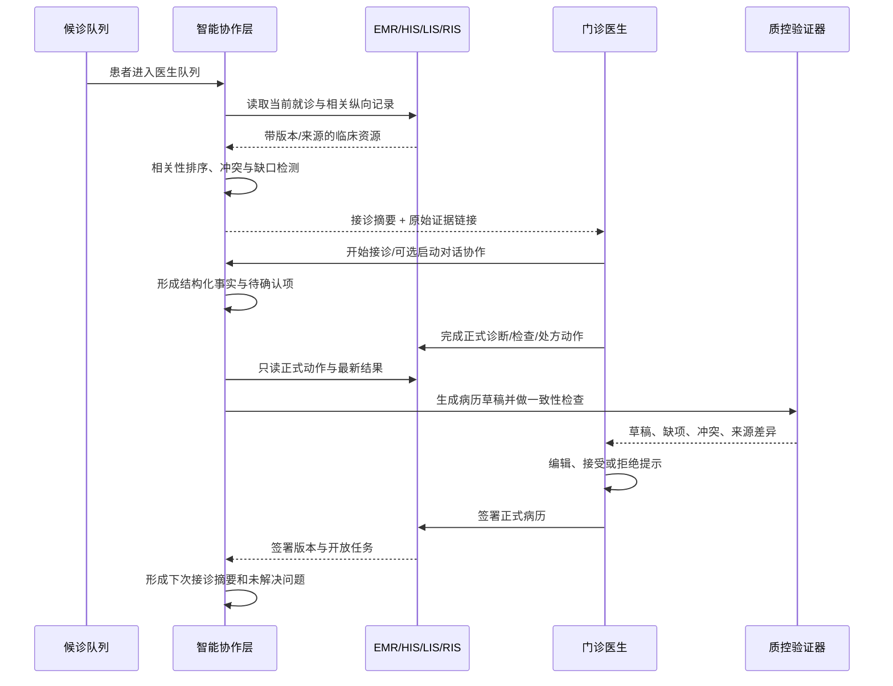
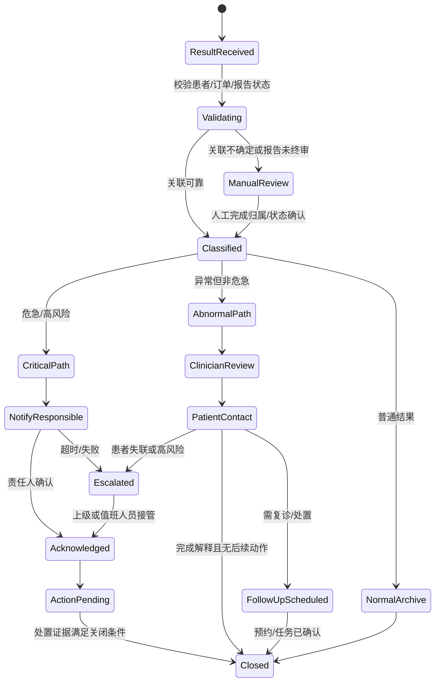
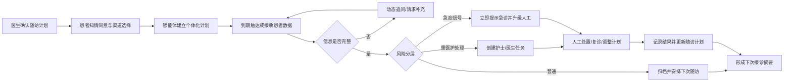
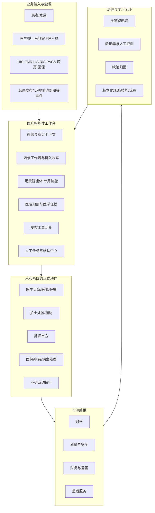
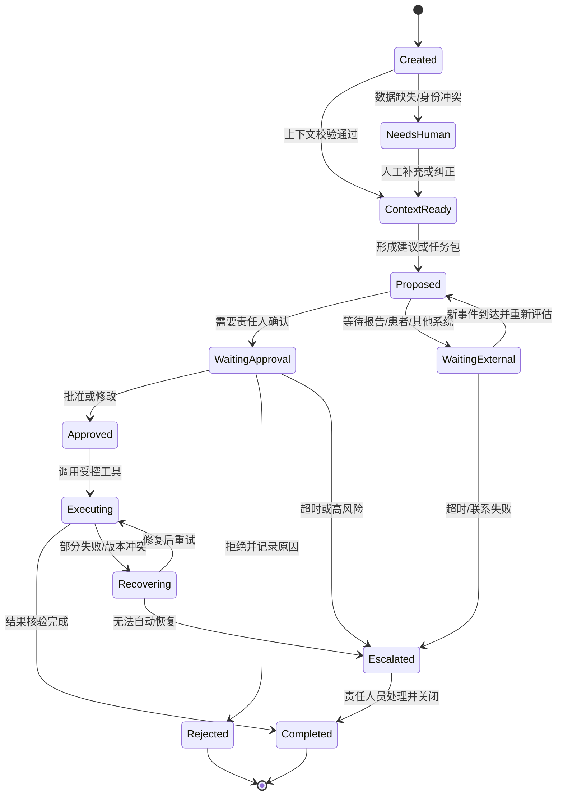

# 门诊医疗智能体场景落地方案 v1.0

> **副标题：面向医院决策者、信息科与产品研发团队的场景选择、系统建设、评测治理与规模化运营指南**  
> **版本日期：2026-09-03**  
> **适用范围：中国二级、三级公立医院成人普通门诊，以及一次门诊产生的临床记录的直接后续用途**  
> **基础版本：《门诊医疗智能体场景全景与试点选择指南 v0.1》**

---

## 0. 文档定位、使用方式与证据边界

### 0.1 本方案解决什么问题

本方案不是一份“大模型功能菜单”，也不是把医院现有系统外面再套一层聊天窗口。它回答的是医院真正需要共同决策的六个问题：

1. **哪些医疗智能体场景值得做，哪些只是看起来新颖？**
2. **智能体在现有门诊流程中具体替谁做什么，最终由谁负责？**
3. **HIS、EMR、LIS、PACS、药学、医保和患者服务系统如何接入？**
4. **哪些动作可以自动完成，哪些必须由医生、药师、护士或管理人员确认？**
5. **如何证明项目改善了效率、质量、财务或患者服务，而不仅是生成了一段“看起来不错”的文本？**
6. **如何从两三个可验证场景起步，逐步形成可复用的医疗智能体平台，而不是一次性建设一个难以验收的“超级智能体”？**

本方案沿用基础指南中的五段流程、24 个场景、V1/V2/V3 成熟度、机会分组和 PoC 出口合同，并增加以下内容：

- 面向院领导的一页决策结论与投资逻辑；
- 国内外公开落地案例及证据等级；
- 24 个场景的完整能力卡与落地要求；
- 推荐场景组合和四个重点组合的端到端设计；
- 面向信息科的总体架构、集成、数据、安全、运维方案；
- 面向产品研发团队的状态机、工具契约、权限、异常恢复和评测方法；
- 分阶段建设路线、组织机制、成本收益与采购验收模板。

### 0.2 三类读者的建议阅读路径

| 读者 | 优先阅读 | 需要作出的决定 |
|---|---|---|
| 院领导、医务部、运营管理者 | 第 1、2、4、5、7、17、18、19 章 | 为什么做、先做什么、谁负责、如何验收、是否扩围 |
| 信息科、数据中心、网安与集成团队 | 第 3、8—16 章 | 系统边界、接入方式、权限、安全、审计、运维与供应商要求 |
| 产品经理、架构师、研发与测试团队 | 第 3、6、8—16、20 章 | 工作流状态、Agent/工具边界、数据契约、异常路径、评测与版本管理 |

### 0.3 证据标签

为避免将政策方向、研究结果、医院新闻稿和产品宣传混为一谈，本方案使用以下证据标签：

| 标签 | 含义 | 可以支持什么 | 不能支持什么 |
|---|---|---|---|
| **[P] 政策/监管** | 政府部门、监管机构正式文件 | 政策方向、合规底线、治理要求 | 某家医院一定采购、某产品一定有效 |
| **[R] 同行评议研究/可核验预印本** | 论文、公开基准与研究报告 | 任务设计、实验结果、能力边界 | 直接外推为本院临床效果 |
| **[O] 医疗机构运营披露** | 医院、医疗集团公开披露的上线规模或运营结果 | 该机构公开报告的部署和运营现象 | 独立验证后的因果效果 |
| **[V] 联合发布/供应商披露** | 医疗机构与供应商联合新闻稿或供应商案例 | 公开项目形态、可供访谈核验的指标线索 | 未经第三方核验的普遍收益 |
| **[E] 工程事实** | 可通过接口、日志、测试和运行记录复核 | 系统是否真正读取、判断、执行、恢复和留痕 | 尚未运行的业务收益 |
| **[H] 机会假设** | 基于工作流和现有证据形成的产品判断 | 指导场景筛选和 PoC 设计 | 已经验证的市场或 ROI 结论 |
| **[C] 待客户验证** | 必须由具体医院提供的事实 | 本院基线、流程、责任、数据条件和采用意愿 | 不能由供应方代答 |

> **阅读原则：**凡是公开案例中的“节省时间、准确率、使用规模、满意度”等数字，均需同时查看证据来源和研究设计。新闻稿或医院自报可以证明“有人做过、系统运行过”，但通常不能证明临床结局因果改善。

### 0.4 两套成熟度不要混淆

本方案同时使用“场景成熟度”和“项目实施阶段”，两者含义不同：

| 体系 | 含义 |
|---|---|
| **V1 近期验证 / V2 条件拓展 / V3 长期研究** | 判断一个场景本身的业务边界、数据、治理和评测条件是否相对成熟 |
| **S0 调研 / S1 离线验证 / S2 影子运行 / S3 有限生产 / S4 规模化** | 判断某家医院的具体项目已经走到哪个实施阶段 |

一个 V1 场景进入新医院时仍然要从 S0 开始；一个 V2 场景也可以先在 S1/S2 中验证，而不是等待所有条件一次性完备。

### 0.5 明确边界

本方案聚焦门诊与门诊病历生命周期，不覆盖住院、手术、院感、公共卫生、医院后勤、药物研发等领域。文中涉及影像、科研、教学或患者随访的内容，只讨论与本次门诊直接关联的业务。

本方案不是法律意见、医疗器械注册结论或临床诊疗指南。是否构成医疗器械、是否适用互联网诊疗、是否需要伦理审查或其他行政审批，应由医院法务、医务、伦理、网安和监管事务人员结合产品预期用途、部署方式与实际流程判断。

---

### 0.6 快速导航

| 部分 | 核心内容 | 适合谁快速定位 |
|---|---|---|
| **第一部分：管理层决策** | 为什么做、先做什么、公开案例能证明什么、智能体与传统 AI 的区别 | 院领导、医务、运营、采购 |
| **第二部分：场景与组织** | 24 个场景、医院目标运营模式、责任与 RACI、逐场景能力卡 | 业务部门、临床、产品经理 |
| **第三部分：业务组合** | 七类组合，以及医生工作台、结果闭环、慢病随访、医保/药房异常四个重点方案 | 场景负责人、产品、实施团队 |
| **第四部分：信息化架构** | 总体架构、工具网关、状态对象、数据、FHIR/SMART/CDS Hooks/DICOMweb、部署与可靠性 | 信息科、数据中心、架构与研发 |
| **第五部分：安全治理** | 风险分层、人工责任、隐私、网安、医疗器械边界、事件管理 | 医务、法务、伦理、网安 |
| **第六部分：评测运营** | 五层评测、六道验证门、PoC 出口、影子模式、上线运营和受控改进 | 测试、质控、运营、临床评测 |
| **第七部分：路线与采购** | S0—S4 路线、30/60/90 天、价值计算、采购条款和场景工作坊 | 项目委员会、财务、采购 |
| **第八部分：模板与证据** | 业务对象、状态机、审计、验收、接口盘点、术语和来源索引 | 产品开发、信息科、项目交付 |

---

# 第一部分：医院管理层决策

## 1. 一页管理层结论

### 1.1 一句话定义

**医疗智能体，是在明确岗位、权限和终止条件内，能够读取患者与业务状态，调用医院工具和规则，处理分支与异常，产出可验证业务结果，并把高风险决定交给责任人员确认的数字协作者。**

它不是“会回答医学问题的聊天机器人”，也不是可以覆盖所有科室、所有岗位并自行作出诊疗决定的超级医生。

### 1.2 医院应当期待的变化

落地后，医院人员感受到的变化不应是“多了一个 AI 页面”，而应是：

- 医生接诊前，患者纵向记录、近期检查、未解决问题和信息冲突已经整理好；
- 接诊过程中，系统跟踪问诊覆盖和信息缺口，形成可追溯的病历草稿与动作提案；
- 医生开检查、诊断、处方或签署病历前，目录、患者状态、用药和文书规则已经完成预检查；
- 检验危急值、离院后报告和异常流程不再依赖个人记忆，而是形成有等待、催办、升级和关闭条件的任务闭环；
- 随访、患者教育和复诊协调基于正式诊疗结果开展，异常回到护士或医生任务队列；
- 管理者可以看到智能体做过什么、依据什么、谁确认、哪里失败、业务结果是否改善。

### 1.3 推荐的第一批场景组合

对多数综合性公立医院，建议首批不是选择三个彼此独立的“AI 功能”，而是选择一个近期价值组合、一个战略闭环组合，以及一个由本院痛点决定的管理组合。

| 组合 | 包含场景 | 主要价值 | 为什么适合作为起点 |
|---|---|---|---|
| **A. 门诊医生工作台智能协作** | P4 接诊准备 + C4 临床文书 + G4 病历实时质控 + R1 下次接诊摘要 | 医生效率、病历质量、连续照护 | 高频、可回顾验证、默认只读与草稿、人工签署边界清楚 |
| **B. 结果闭环智能体** | G5 检验结果与危急值处置 + F4 延迟结果跟进 | 医疗安全、结果触达、跨岗位协同 | 真正需要等待、恢复、催办、升级和闭环，能体现 Agent 区别于一次生成 |
| **C. 本院痛点选择项** | G6 收费药房异常协作，或 R2 病历质量审核与缺陷归因 | 财务效率或质量治理 | 容易获得历史工单/病历样本，结果可核验，便于形成管理价值 |

如果医院慢病患者占比高、承担医联体任务或已有稳定患者触达渠道，可将组合 C 替换为 **F1+F2+F3+R1 慢病连续照护组合**。

### 1.4 六项管理决策

医院在批准 PoC 前，应明确以下六项，而不是先决定采购哪个大模型：

1. **业务问题所有者是谁。**每个场景必须有医务、临床、药学、护理、医保或运营中的实际责任部门。
2. **什么结果算成功。**至少有一项效率、质量、财务或患者服务指标相对基线改善。
3. **哪些正式动作必须人工确认。**诊断、医嘱、处方、病历签署、支付和对外发送默认由责任人确认。
4. **数据和接口是否可用。**不仅要能读取，还要确认数据含义、时间、新鲜度、权限和写回责任。
5. **失败后如何恢复。**系统超时、模型不可用、数据冲突、患者失联和岗位未处理都必须有出口。
6. **谁有权扩大范围。**从离线到影子、从影子到有限生产、从一个科室到全院，应经过分阶段评审而不是自动扩张。

### 1.5 三条不建议路线

- **不建议先建“全院通用超级智能体”。**岗位权限、数据范围、责任归属和风险完全不同，统一自治只会扩大攻击面和审计难度。
- **不建议用演示代替验收。**一次病例顺利跑通不能证明长期任务、异常任务和高峰期稳定性。
- **不建议把模型分数作为主要采购指标。**医院真正采购的是一个具备规则、工具、权限、检查、记录、恢复和持续运营能力的业务系统。

---

## 2. 为什么是现在：政策、市场与公开案例

### 2.1 中国政策窗口已经从“大模型探索”进入“高价值场景与规范应用”

2025 年发布的《关于促进和规范“人工智能+医疗卫生”应用发展的实施意见》提出，到 2027 年形成一批临床专病专科垂直大模型和智能体应用，推动基层诊疗辅助、临床专病决策辅助和患者就诊智能服务广泛应用，并建设高质量数据集、可信数据空间和中试基地；到 2030 年，推动二级以上医院普遍开展医学影像辅助诊断和临床诊疗辅助决策等应用。[P]

对医院的实际含义不是“必须尽快上一个大模型”，而是：

- 建设对象从单一算法扩展到可进入流程的智能体和可信数据空间；
- 评价重点从演示能力转向高价值场景、业务效果和安全可控；
- 试点应同时形成数据治理、评测、运维和组织机制，避免重复建设；
- 患者服务、临床辅助、慢病管理、科研教学都可以成为方向，但必须按照不同风险等级治理。

### 2.2 国内外公开案例：能证明什么，不能证明什么

> **案例统计口径：截至 2026-09-03 的公开资料。**“上线”“公测”“初步测试”“生成数量”等词均保留来源本身的性质；未见公开对照研究时，不将其改写为临床有效性结论。 详细来源、链接与证据性质见第 20.11 节。

| 案例 | 场景映射 | 公开阶段与结果 | 人机边界 | 证据等级 | 可借鉴点 | 不能据此声称 |
|---|---|---|---|---|---|---|
| **清华大学紫荆 AI 医院/Agent Hospital**（2025） | P1-P4、C1-C4、F1-F2 等 | 2025 年 11 月在首批 8 家医院启动公开测试，设置患者、医生、医院端，覆盖 AI 分诊、预问诊、资料解读、纵向健康档案、指南检索、病历生成、随访等 | 官方说明 AI 收集、分析和提出建议，所有医疗决策由人类医生完成；参与测试需知情同意 | [O] 公测披露 | 以多端产品、权限和数据汇交形成“医院级试验场”，并把审批和反馈纳入测试 | 已经证明大规模临床效果，或 AI 可独立诊疗 |
| **四川大学华西医院医疗文书智能体**（2025） | P4、C4、G4、R1 | 公开披露可抓取院内外检查和医患对话，生成七类文书并按国家规范、医保规则质控；上线以来生成近 60 万份病历 | 正式病历仍处在医院现有签署和质控体系中 | [O] 医院披露 | 高频文书场景适合先形成规模；数据抓取、文书生成与质控应作为一个闭环 | 60 万份等于 60 万份完全正确，或已改善临床结局 |
| **北京天坛医院“小君医生 2.0”**（2026） | 影像报告草稿、C2/C4 的专科延伸 | 公开称颅脑 CT 约 1 分钟生成报告初稿，覆盖 94 种疾病、11 个解剖部位和 1,232 个术语；初步测试主要诊断正确率超过 80% | 定位为辅助报告初稿，医生审核和终审 | [O] 医院/媒体披露 | 专科高质量数据、明确任务边界、结构化术语和“AI 初稿—医生终审” | 一个初步正确率足以支持无监督使用，或可替代放射科医师 |
| **Kaiser Permanente 环境式 AI 文书**（2023—2024，2025 报告） | C4、P4、R1 | 7,260 名医生在 2,576,627 次就诊中使用，估算减少近 16,000 小时文书时间；采用和满意度数据较充分 | 工具生成草稿，医生编辑、确认后进入病历；不作诊疗决策 | [R][O] 运营研究 | 规模化采用依赖工作流嵌入、医生自愿使用、持续质量抽查和供应商切换能力 | 观察性时间节省等于临床质量或患者结局改善 |
| **Cleveland Clinic 环境式 AI 文书**（2025） | C4、患者离院摘要 | 2024 年跨 80 多个专科试点，2025 年推广；公开称 6,000 名合格临床人员中超过 4,000 人在 15 周内活跃使用 | 医生完整阅读、编辑、批准后进入 EHR；患者事前被告知并可拒绝 | [O] 医院披露 | 大型医院应先多产品比较，再通过培训、患者告知和分阶段扩围推进 | 高采用率自动等于净效率收益或临床质量提升 |
| **宾夕法尼亚大学医疗系统环境式文书研究**（2025） | C4 | 46 名临床人员、17 个专科；观察到单份病历时间、当日关单率和下班后 EHR 时间改善，但未见患者量明显增加 | 医生审阅并承担最终责任 | [R] 质量改进研究 | 评价需要同时看时间、关单、下班后工作、采用体验，而不是只看生成速度 | 小样本观察结果可直接外推到所有医院和专科 |
| **芝加哥大学环境式文书研究**（2025） | C4 | 125 名使用者与 478 名对照；与 EHR 时间和病历时间下降相关，但下班后时间、关单、预约长度和患者量未见显著差异 | 医生审阅 | [R] 观察性研究 | 收益可能是局部而非全面，应预先定义哪些指标真正重要 | 一个工具会同时改善所有效率和产能指标 |
| **UHS + Hippocratic AI 出院后电话智能体**（2025） | F1、F2、F4 的住院延伸参考 | 两家医院起步，公开称已联系数千名患者，核对出院与用药说明、追问恶化症状并向护士提示；患者互动平均评分 9/10，后续扩展 | 异常和患者问题进入护士回呼队列 | [V][O] 联合披露 | 患者沟通智能体的关键不是“能聊天”，而是脚本边界、异常识别、人工队列和关闭记录 | 满意度评分足以证明再入院率或临床结局改善 |
| **Memorial Hermann “Grace” 电话协作**（2024） | F2、F4、患者调查 | 面向每月大量随访电话；公开案例称完成常规外呼、调查和转人工，节省 1,136 个工时 | 限制呼叫次数，明确自我身份，需要照护时转接护士 | [O][V] 运营案例 | 透明告知、员工参与测试、呼叫次数限制和顺畅转人工比“拟人化”更重要 | 供应商或会议案例中的工时数据是独立审计结果 |

### 2.3 从案例中可以形成的五个稳定结论

1. **首先规模化的不是“自主诊断”，而是文书、摘要、患者沟通和明确流程协作。**这些场景高频、边界相对清楚、结果可审阅，错误可在进入正式记录或患者动作前被拦截。
2. **人工确认不是过渡时期的临时妥协，而是当前医疗智能体产品结构的一部分。**成熟案例普遍保留医生审阅、患者告知、护士回呼或人工任务队列。
3. **公开规模数据主要证明可采用性和运营能力，不等于临床有效性。**生成多少份病历、完成多少通电话、节省多少估算工时，需要与准确性、人工修正、风险事件和患者结局分开报告。
4. **技术平台应由场景反推。**医院先从一个高频闭环积累接口、权限、评测集、审计和用户行为，再抽象为共用底座，比先建“全院大模型平台”更容易形成可验收成果。
5. **越接近正式临床动作，越需要环境级评测。**仅在医学问答中表现好，不能证明智能体能正确读取 EHR、识别最新记录、处理冲突、调用正确工具并写入正确患者。

### 2.4 最新医疗智能体基准给医院的警示

公开基准已经开始从医学问答转向真实 EHR 和跨系统任务：

- **MedAgentBench**提供 300 个医生编写的任务、100 个患者档案和 FHIR 交互环境，显示查询类任务通常好于动作类任务；其环境本身也明确不应直接用于生产。[R]
- **PhysicianBench**包含 100 个来自真实会诊案例的长程任务、21 个专科、平均每题 27 次工具调用；公开结果中最强系统完整完成约 46% 的任务，多次尝试稳定完成约 28%。[R]
- **HealthAdminBench**包含 EHR、两个支付方门户和传真系统中的 135 个行政任务；最强系统全任务成功率为 36.3%，常在文件处理和跨系统传递中失败。[R]
- **HealthAgentBench**覆盖七类环境中的 54 个任务；公开结果中最强系统约 42% 成功，影像和大搜索空间的组合推理仍然困难。[R]

这些结果不表示医疗智能体“不能用”，而是说明医院应采用以下工程原则：

- 先读后写，先草稿后正式动作；
- 高风险任务拆成可验证检查点；
- 工具调用结果必须由系统状态验证，而不是相信模型自述“已完成”；
- 失败要进入人工队列，不能用重复调用掩盖；
- 每个模型、提示词、规则和工具版本都要经过回归测试；
- 只有在本院环境中通过离线、影子和有限生产验证，才允许逐步提高自动化等级。

---

## 3. 医疗智能体与传统 AI、规则系统的区别

### 3.1 四种能力不要混称

| 类型 | 典型输入输出 | 是否维护业务状态 | 是否调用工具 | 是否处理异常闭环 | 示例 |
|---|---|---:|---:|---:|---|
| 原子 AI 能力 | 文本/影像 → 分类、抽取、生成、预测 | 否 | 通常否 | 否 | 从主诉抽取症状、生成一段患者教育文本 |
| 规则/工作流自动化 | 确定触发 → 固定步骤 | 有限 | 是 | 预定义异常 | 必填校验、重复医嘱固定规则、消息模板发送 |
| Copilot/辅助工具 | 上下文 → 建议或草稿 | 局部 | 可选 | 主要由用户处理 | 病历草稿、指南检索、检查建议 |
| 医疗智能体 | 触发 → 读取状态 → 判断 → 调工具 → 等待/恢复 → 交付可验证结果 | 是 | 是 | 是 | 危急值通知、延迟结果闭环、跨系统异常协作 |

### 3.2 智能体场景准入测试

一个能力只有同时满足下列条件，才应作为独立智能体场景建设：

1. 有清晰的业务触发和终止条件；
2. 有具体岗位责任人，而不是笼统的“医院”；
3. 需要根据患者、就诊、任务或系统状态动态选择下一步；
4. 需要读取至少一个受治理数据源，或调用一个正式业务工具；
5. 存在分支、等待、失败、超时、冲突或人工接管；
6. 能通过系统状态、正式产物或人工审核验证是否完成；
7. 日志能够还原输入来源、判断依据、工具调用、人工决定和最终结果。

缺少这些条件时，优先采用规则、搜索、模板或普通生成能力，不要为了“Agent”标签增加复杂度。

### 3.3 自动化等级

| 等级 | 智能体权限 | 适合场景 | 最低控制要求 |
|---|---|---|---|
| **A0 观察** | 只读、总结、检测，不影响业务 | P4、R1 的早期离线验证 | 数据授权、来源引用、日志 |
| **A1 辅助** | 生成建议或草稿，用户自行操作 | C2、C4、G4 | 明确非正式结果、人工审阅、拒绝入口 |
| **A2 准备动作** | 形成结构化动作包，责任人一键或逐项确认 | C3、G1、G2、G3 | 预览、版本检查、权限验证、确认记录 |
| **A3 有界执行** | 在窄权限内执行可逆、低风险动作 | 任务创建、普通通知、状态查询、排队 | 幂等、回滚、监控、异常工单、速率限制 |
| **A4 受控优化** | 基于结果提出流程/策略更新，不直接改变临床规则 | 运营路由、模板和提示优化 | 独立评测、人工批准、灰度、回滚 |

当前不建议将诊断、医嘱、处方、病历签署、医保最终结论、支付和高风险患者对外沟通置于无人确认的 A3/A4。

### 3.4 什么时候不应该用智能体

- 输入、规则和输出完全确定，普通工作流引擎更可靠；
- 没有可验证结果，只能评价“回答像不像”；
- 数据来源不清楚、患者身份无法可靠匹配；
- 业务部门不愿承担责任，也没有人工异常队列；
- 需要访问大量系统，但接口、权限和操作日志均不可控；
- 错误不可逆、无法及时发现或无法恢复；
- 场景价值仅来自“展示创新”，没有真实使用频率和基线。


---

# 第二部分：医院场景全景与组织机制

## 4. 医院级目标运营模式

### 4.1 不是信息科项目，而是业务、临床和技术共同负责

医疗智能体失败的常见原因，不是模型能力不足，而是项目被当作普通软件采购：信息科负责上线，业务部门提供几份样本，临床人员在验收时体验一次，之后没有人持续维护规则、评测和异常队列。

建议医院建立“业务结果—临床安全—信息技术”三位一体的治理结构。

| 角色/组织 | 核心责任 | 不应承担的替代责任 |
|---|---|---|
| **医院 AI/数字化领导小组** | 决定优先场景、预算、风险偏好、扩围和退出 | 不代替临床科室判断医学合理性 |
| **场景业务负责人** | 对现有流程、业务基线、使用采用和结果指标负责 | 不把接口问题全部推给信息科 |
| **临床/专业负责人** | 确认医学规则、人工把关、禁用条件和风险分级 | 不代替数据安全和系统运维评估 |
| **信息科/数据中心** | 架构、接口、身份权限、审计、监控、灾备和供应商管理 | 不代替业务部门定义成功标准 |
| **医务、药学、护理、病案、医保等管理部门** | 维护岗位规则、质量标准、处置时限和整改流程 | 不把模型提示当作正式制度 |
| **网安、法务、伦理、合规** | 数据处理依据、患者告知、第三方、跨境、等保、事件处理 | 不代替产品团队做功能验收 |
| **产品与研发团队** | 将流程转为状态、工具、权限、异常和可测产物 | 不自行创造医疗规则或改变岗位责任 |
| **独立评测组** | 管理测试集、回归、盲评、风险事件与版本准入 | 不由模型开发者单独给自己打分 |

### 4.2 三道防线

1. **第一道防线：业务使用者与系统内控制。**医生、护士、药师等在业务界面中审阅、修改、拒绝、接管；系统执行权限、必填、版本和禁用条件。
2. **第二道防线：质量、安全与运营监控。**医务、药学、护理、病案、医保、信息科持续查看误报、漏报、人工推翻、超时、异常和用户投诉。
3. **第三道防线：独立审计与重大版本评审。**对高风险场景、供应商升级、模型切换、规则变更、数据用途变化进行独立复核。

### 4.3 决策权必须写入项目章程

| 决策 | 建议批准人 | 必须参与评审 |
|---|---|---|
| 选择 PoC 场景 | 分管院领导/项目领导小组 | 业务负责人、临床负责人、信息科 |
| 使用真实脱敏数据 | 医院数据授权机制规定的批准人 | 数据负责人、业务部门、网安/合规 |
| 从离线进入影子运行 | 场景业务负责人 + 信息科 | 临床、评测、网安 |
| 从影子进入有限生产 | 分管院领导或授权委员会 | 医务、临床、信息科、网安、法务 |
| 提高自动化等级或增加写权限 | 同有限生产，且重新风险评估 | 相关正式动作的岗位责任部门 |
| 模型/规则/供应商重大升级 | 变更委员会 | 场景负责人、评测、信息科、合规 |
| 暂停或回滚 | 值班负责人可先暂停 | 事后向治理委员会报告 |

### 4.4 RACI 示例

以“门诊医生工作台智能协作”为例：

| 工作 | 院领导 | 医务部 | 试点科室 | 信息科 | 产品研发 | 网安/合规 | 评测组 |
|---|---|---|---|---|---|---|---|
| 目标与预算 | A | R | C | C | C | C | C |
| 流程与指标基线 | I | A | R | C | C | I | C |
| 医学规则与人工把关 | I | A | R | I | C | C | C |
| 接口和权限 | I | C | C | A/R | C | C | I |
| 产品实现 | I | C | C | C | A/R | C | C |
| 数据安全评估 | I | C | I | R | C | A/R | I |
| 离线/影子评测 | I | C | R | C | C | I | A/R |
| 生产准入 | A | R | R | R | C | R | C |
| 运行监控和停用 | I | R | R | A/R | C | C | C |

A=最终负责，R=执行负责，C=需协商，I=需知会。每个医院可以调整，但不能出现“所有人都是 C、没有 A”的情况。

---

## 5. 24 个门诊医疗智能体场景全景

### 5.1 两条主线

```text
门诊诊疗流程
患者进入 → 诊前准备 → 门诊诊疗 → 审查与执行 → 诊后服务
                              │
                              ▼
病历生命周期
形成与签署 → 连续照护 → 质量治理 → 教学评测 → 科研与受治理共享
```

### 5.2 场景总表

| ID | 场景 | 主要责任人 | 核心可验证结果 | 机会分组 | 成熟度 | 默认自动化上限 |
|---|---|---|---|---|---|---|
| P1 | 就医准备智能体 | 患者、门诊服务人员 | 经患者确认的科室、时间与材料计划 | 价值优先 | V2 | A2，患者确认 |
| P2 | 挂号资料协作智能体 | 患者、挂号员 | 完整资料草稿、患者匹配与待审挂号提案 | 价值优先 | V1 | A2，异常与提交确认 |
| P3 | 预问诊与危险信号分流智能体 | 患者、分诊护士 | 结构化预问诊单或人工升级 | 战略优先 | V2 | A1/A2，高风险立即转人工 |
| P4 | 接诊准备智能体 | 门诊医生 | 带来源、版本和缺口提示的患者摘要 | 战略优先 | V1 | A0/A1，医生核对 |
| C1 | 问诊协作智能体 | 门诊医生 | 必要主题覆盖、信息缺口和可追溯记录 | 战略优先 | V1→V2 | A1，医生主导 |
| C2 | 临床决策支持智能体 | 门诊医生 | 带患者证据和医学证据的鉴别诊断与检查建议 | 战略优先 | V2 | A1，不形成正式结论 |
| C3 | 临床动作准备智能体 | 门诊医生 | 经目录和规则校验的诊断、检查、处方、文书提案 | 战略优先 | V1 | A2，逐项确认 |
| C4 | 临床文书智能体 | 门诊医生 | 结构化病历草稿、来源引用和缺项提示 | 价值优先 | V1→V2 | A1/A2，医生签署 |
| G1 | 检查检验适宜性审核智能体 | 医生、检验/检查岗位 | 放行、修改建议或人工复核任务 | 价值优先 | V2 | A1/A2 |
| G2 | 合理用药审核智能体 | 药师、医生 | 分级风险、依据和药师处理结果 | 价值优先 | V2 | A1/A2，药师/医生负责 |
| G3 | 医保合规审核智能体 | 医保或收费岗位 | 政策匹配、缺失材料或人工工单 | 战略优先 | V2→V3 | A2，医保人员确认 |
| G4 | 病历实时质控智能体 | 医生、医务管理 | 缺陷清单、修订提案或放行 | 价值优先 | V2 | A1，不静默改写事实 |
| G5 | 检验结果与危急值处置智能体 | 检验、责任医生、护士 | 已通知、确认、处置或升级的闭环记录 | 战略优先 | V2 | A3 可协调，临床处置人工决定 |
| G6 | 收费与药房异常协作智能体 | 收费员、药师 | 异常原因、修复提案或升级工单 | 战略优先 | V1→V2 | A2/A3，岗位执行修复 |
| F1 | 个性化患者教育智能体 | 医生、药师、患者 | 经审核的通俗说明与理解确认 | 组合能力 | V2 | A1/A2，专业人员审核 |
| F2 | 随访与慢病监测智能体 | 医生、护士、患者 | 归档、异常任务、复诊或急诊升级 | 战略优先 | V2→V3 | A3 可触达，临床升级人工处理 |
| F3 | 转诊与复诊协调智能体 | 医生、门诊服务、患者 | 资源匹配、材料齐备和确认安排 | 创新储备 | V2→V3 | A2/A3，患者与人员确认 |
| F4 | 延迟结果跟进智能体 | 责任医生、护士、患者 | 医生确认、患者通知及必要处置记录 | 战略优先 | V2 | A3 可监听/建任务，对外高风险消息确认 |
| R1 | 下次接诊摘要智能体 | 门诊医生 | 带来源、时间和未解决问题的纵向摘要 | 价值优先 | V1→V2 | A0/A1 |
| R2 | 病历质量审核与缺陷归因智能体 | 医务/病案管理 | 缺陷分类、证据定位、责任流转和整改结果 | 价值优先 | V2 | A2/A3，管理人员确认 |
| R3 | 诊疗教学评测智能体 | 教师、学员、评测人员 | 基于病例真值、轨迹和 rubric 的反馈 | 创新储备 | V2 | A1，教师校准 |
| R4 | 科研队列发现与试验初筛智能体 | 研究者、研究管理 | 可复核候选队列及纳排理由 | 创新储备 | V3 | A2，研究人员确认 |
| R5 | 科研数据准备与质量审计智能体 | 数据管理、研究者 | 版本化分析数据、质量问题和处理记录 | 创新储备 | V2→V3 | A2/A3，隔离环境运行 |
| R6 | 脱敏病例共享智能体 | 病案、教学/科研治理 | 用途受限、经风险审查且可追溯的病例包 | 组合能力 | V3 | A2，治理审批 |

### 5.3 按医院类型重新定级

| 医院特征 | 优先上调场景 | 首要访谈问题 |
|---|---|---|
| 门诊量大、医生与窗口负荷高 | P2、P4、C4、G4、G6、R1、R2 | 等待、录入、返工和异常关闭究竟占用谁的时间？ |
| 医疗质量与安全压力高 | P3、C1、C2、G1、G2、G4、G5、F4 | 漏项、用药风险、危急值和离院后异常是否有可靠基线？ |
| 医保精细化运营压力高 | G1、G2、G3、G6、R2 | 拒付、补材料、编码或规则冲突集中在哪些项目？ |
| 慢病患者占比高/承担医联体任务 | P3、F1、F2、F3、F4、R1 | 随访触达、异常升级、复诊和转诊谁负责？ |
| 研究型或教学型医院 | C2、R3、R4、R5、R6 | 是否已有获批数据、队列、教师资源和用途治理？ |
| 专科优势突出 | P3、P4、C2、C3、F2、R1 | 能否把专科路径、量表、随访和本院经验产品化？ |

### 5.4 场景依赖关系

部分场景不能孤立建设：

- **C4 临床文书**依赖可靠的患者/就诊上下文、问诊信息和正式动作；否则只能生成泛化文本。
- **G4 实时病历质控**依赖明确规范、缺陷分类和可定位证据；否则容易变成大量无意义提醒。
- **G5 危急值处置**依赖责任医生映射、联系方式、通知渠道、SLA 和升级链；模型识别异常值只是很小一部分。
- **F2 慢病随访**依赖患者同意、联系方式、正式诊疗计划、监测数据和人工任务队列。
- **G3 医保合规**依赖地区、时间、人群、项目和政策版本；不能把静态知识库当成实时政策真值。
- **R4/R5/R6**依赖独立的科研/教学数据授权和隔离环境，不能直接复用临床生产数据副本或模型记忆。

---

## 6. 24 个场景的完整落地能力卡

> 每张能力卡使用统一口径：业务价值、触发与结果、智能体闭环、数据与工具、人机边界、异常路径、指标、最小 PoC 和明确非目标。指标只是模板，必须由本院补充基线与出口阈值。

### 6.1 诊前准备

#### P1 就医准备智能体

- **业务问题与价值：**患者不知道应挂哪个科、何时就诊、需要携带什么资料，人工客服重复解释；错误科室和材料缺失会造成改挂、重复排队和投诉。
- **触发与完成：**患者提出就医需求 → 输出经患者确认的科室、可选时间、就诊地点、准备材料和失败替代方案。
- **智能体闭环：**采集主诉和约束 → 查询科室能力、号源、停诊与院内规则 → 识别信息不足并追问 → 生成计划 → 患者确认 → 必要时转人工服务。
- **数据与工具：**科室/医生服务范围、排班号源、院区位置、预约规则、检查材料、患者年龄与特殊需求；只在有授权时读取既往就诊。
- **人机边界：**系统提供就医计划而非诊断；急危重或无法排除危险信号时转人工/急诊提示；挂号提交由患者确认。
- **异常路径：**无号、停诊、多个科室均可能、患者描述不清、老年/残障服务需求、系统不同步、跨院区冲突。
- **核心指标：**一次正确挂号率、改挂率、人工客服转接率、准备材料齐全率、患者完成率、特殊人群差异。
- **最小 PoC：**选择 3—5 个高频科室，用历史咨询记录和合成号源离线测试；不直接开放自由医疗咨询。
- **明确非目标：**不能用一次科室分类代替就医计划，也不能声称推荐科室等于临床诊断。
- **成熟度：**V2；建议 S1 离线后进入小范围患者端 A1/A2。

#### P2 挂号资料协作智能体

- **业务问题与价值：**患者身份重复、资料缺失、医保信息不一致、号源变化会造成窗口返工。
- **触发与完成：**患者线上/到院挂号 → 输出患者匹配结果、完整资料草稿、冲突提示和待审挂号提案。
- **智能体闭环：**身份核验 → 患者主索引查重 → 补齐资料 → 检查号源状态 → 形成提案 → 挂号员或患者确认提交。
- **数据与工具：**MPI/患者主索引、身份核验、号源、医保身份、联系方式、监护/代办关系。
- **人机边界：**智能体不能在身份不确定时合并患者；异常由挂号员处理；正式挂号和费用确认遵循现有系统。
- **异常路径：**同名同生日、证件不一致、代办、未成年人、号源抢占、重复预约、医保状态不可用。
- **核心指标：**单例录入时间、查重准确性、错绑率、返工率、窗口人工触点、挂号完成率。
- **最小 PoC：**在脱敏挂号数据上复现重复患者、缺字段和号源冲突；先生成提案，不写生产系统。
- **明确非目标：**普通表单自动填充并不需要智能体；不得为了提高自动匹配率牺牲患者错绑风险。
- **成熟度：**V1。

#### P3 预问诊与危险信号分流智能体

- **业务问题与价值：**固定问卷不能根据患者回答追问，也难以识别信息缺口和升级条件；分诊护士面对大量不完整描述。
- **触发与完成：**挂号完成或候诊前 → 输出结构化预问诊单、未解决问题；命中高风险时创建人工分诊任务。
- **智能体闭环：**按就诊目标自适应提问 → 检查回答一致性与缺失 → 运行危险信号规则/模型 → 低风险形成摘要，高风险停止自动流程并升级。
- **数据与工具：**患者基本信息、科室/主诉模板、生命体征（如有）、既往史/用药/过敏、危险信号规则、人工分诊队列。
- **人机边界：**不能向患者宣称排除某种疾病；高风险、不确定、语言理解困难或患者主动要求时立即转人工；正式分诊由护士完成。
- **异常路径：**患者漏答、矛盾回答、方言/语音识别错误、儿童/孕产妇等超范围、暴力/自伤风险、系统中断。
- **核心指标：**必要信息覆盖率、护士补问时间、升级敏感性和特异性、误升级负担、漏升级事件、患者完成率。
- **最小 PoC：**选一个科室和明确红旗规则，使用专家构建病例、历史脱敏文本和对抗表达评测；先在护士端影子提示。
- **明确非目标：**不能用问答模型自信度替代危险信号规则和护士判断。
- **成熟度：**V2。

#### P4 接诊准备智能体

- **业务问题与价值：**医生在有限接诊时间内需要浏览多次就诊、检验、影像、用药和未解决问题，容易被冗余信息淹没。
- **触发与完成：**患者进入医生队列 → 输出围绕本次就诊目标的摘要、证据链接、时间/版本、冲突和信息缺口。
- **智能体闭环：**确定当前 Encounter 与就诊目标 → 查询纵向记录 → 对近期性、相关性和冲突排序 → 生成问题导向摘要 → 医生核对。
- **数据与工具：**EMR、LIS、RIS/PACS 报告、处方/用药、过敏、诊断、既往手术、转诊资料；所有摘要项应可回到原始资源。
- **人机边界：**历史诊断不自动当作当前真值；摘要不覆盖原始记录；医生可展开、纠错和标记无关信息。
- **异常路径：**同名患者、外院资料无来源、单位不一致、重复结果、尚未终审报告、冲突药物清单、数据延迟。
- **核心指标：**医生准备时间、关键事实召回、错误事实率、来源可追溯率、医生修正率、遗漏的高严重度事实。
- **最小 PoC：**从只读离线摘要开始，设盲评金标准；随后嵌入候诊队列做影子运行，不阻塞接诊。
- **明确非目标：**普通“整份病历总结”不是场景目标；必须围绕当前就诊任务取证。
- **成熟度：**V1，是推荐首批入口。

### 6.2 门诊诊疗

#### C1 问诊协作智能体

- **业务问题与价值：**接诊节奏快，必要主题可能漏问；录音转写只能记录发生了什么，不能跟踪哪些信息仍未解决。
- **触发与完成：**医生开始接诊 → 输出已覆盖主题、待确认信息、矛盾点和可追溯对话记录。
- **智能体闭环：**实时或分段理解对话 → 按专科/主诉跟踪信息槽位 → 发现缺口与冲突 → 以非打断方式提示 → 医生决定是否追问。
- **数据与工具：**患者同意后的音频/转写、P3 预问诊、P4 摘要、专科问诊框架、结构化病历字段。
- **人机边界：**医生主导沟通；智能体不直接替医生追问敏感问题，除非产品明确设计且患者知情；录音和转写保存遵循用途和期限。
- **异常路径：**多人说话、方言、嘈杂、语音错配、陪同者代答、患者拒绝录音、紧急打断、网络中断。
- **核心指标：**必要主题覆盖、提示采纳/忽略原因、打断负担、转写关键实体准确率、医生满意度、患者投诉。
- **最小 PoC：**先使用模拟诊室和标准化病人；再只显示“缺口提示”，不自动写病历。
- **明确非目标：**有限编码问卷的覆盖率不能证明开放式对话能力。
- **成熟度：**V1→V2。

#### C2 临床决策支持智能体

- **业务问题与价值：**医生需要把当前患者证据、反证、指南和检查成本综合起来；传统弹窗往往缺少上下文或解释。
- **触发与完成：**信息达到最低充分条件 → 输出带患者证据、反证、适用指南版本和不确定性的鉴别诊断与检查建议。
- **智能体闭环：**构建问题表征 → 生成候选 → 从患者记录和证据库取证 → 检查冲突/适用范围 → 排序并指出还需获取的信息 → 医生形成正式判断。
- **数据与工具：**P4/C1 上下文、检验和影像、药物、指南/共识、院内路径、本院可用项目、证据版本与适用人群。
- **人机边界：**输出是辅助建议，不进入诊断或医嘱；不得隐藏反证；医生可要求显示来源和为何不适用。
- **异常路径：**指南冲突、证据过期、患者不在适用人群、罕见病、信息不足、结果尚未确认、模型引用不存在来源。
- **核心指标：**证据可追溯率、关键鉴别召回、危险建议率、医生推翻率、无依据建议率、检查成本与重复检查变化。
- **最小 PoC：**限定一个专科、两三个临床问题，回顾性病例盲评；只评估建议质量，不把最终诊断正确率作为唯一指标。
- **明确非目标：**不能以医学考试分数证明可在本院患者上自主决策。
- **成熟度：**V2。

#### C3 临床动作准备智能体

- **业务问题与价值：**医生形成意图后还需在多个页面选择诊断编码、检查项目、药品规格、剂量和文书，重复操作多且容易版本冲突。
- **触发与完成：**医生表达诊疗意图 → 输出通过本院目录、患者状态和规则预校验的结构化动作包。
- **智能体闭环：**解析意图 → 查询本院可用目录 → 结合过敏、肝肾功能、近期检查和患者身份校验 → 形成逐项可预览提案 → 医生确认 → HIS/EMR 执行。
- **数据与工具：**诊断、检查、检验、药品目录；患者状态；G1/G2 规则；订单创建 API；版本号和幂等键。
- **人机边界：**医生逐项确认正式诊断、医嘱和处方；系统不得根据模糊自然语言静默提交；高风险项目要求二次确认。
- **异常路径：**目录停用、库存/号源变化、药品多规格、患者状态变化、订单重复、会话切换患者、并发修改。
- **核心指标：**正式动作准备时间、目录匹配准确率、医生修改率、误患者/重复订单为零、规则拦截有效性。
- **最小 PoC：**先生成不可提交的动作预览，使用合成 HIS/FHIR 环境验证状态和工具调用；通过后开放单一低风险动作的确认提交。
- **明确非目标：**“模型输出一段处方文本”不属于可用的临床动作准备。
- **成熟度：**V1，但写入权限应分阶段开放。

#### C4 临床文书智能体

- **业务问题与价值：**医生需要把预问诊、医患对话、检查结果和正式动作转为结构化病历，重复录入和前后不一致造成负担与质控问题。
- **触发与完成：**诊疗信息基本形成 → 输出结构化病历草稿、来源引用、缺项和一致性提示，最终由医生修订签署。
- **智能体闭环：**汇总 P3/P4/C1 与正式动作 → 按模板生成 → 对事实、时间、否定项和诊疗动作做一致性检查 → 展示差异 → 医生编辑签署。
- **数据与工具：**录音/转写（经同意）、预问诊、患者记录、检查结果、医嘱处方、病历模板、签署接口。
- **人机边界：**未经医生确认不得进入已签署病历；不得补写对话中没有出现的查体和阴性事实；医生修改必须保留差异。
- **异常路径：**转写错误、模板不匹配、复制旧病历、多个就诊混入、病历字段超长、签署前新结果到达、断网草稿丢失。
- **核心指标：**单例文书时间、当日签署率、医生编辑距离、高严重度事实错误、缺项率、下班后文书时间、患者量是否真正变化。
- **最小 PoC：**用历史音频/转写和病历建立盲评集；生产初期只生成草稿，医生必须完整查看后签署。
- **明确非目标：**生成速度或“看起来完整”不能替代事实准确性和医生审阅负担。
- **成熟度：**V1→V2，是推荐首批入口。


### 6.3 流程内审查与执行

#### G1 检查检验适宜性审核智能体

- **业务问题与价值：**重复检查、近期结果未被看到、检查目的不清、禁忌或前置条件缺失会增加成本和风险；固定规则又容易产生大量无差别弹窗。
- **触发与完成：**检查/检验提案形成 → 输出放行、修改建议、补充信息请求或人工复核任务，并记录依据。
- **智能体闭环：**读取诊断目的和患者状态 → 检索近期同类结果与重复窗口 → 检查禁忌、前置条件、成本与可替代项目 → 风险分层 → 医生/检查检验岗位处理。
- **数据与工具：**ServiceRequest、近期 Observation/DiagnosticReport、检查目录、临床路径、禁忌/前置规则、价格与医保提示。
- **人机边界：**智能体解释为什么提示；医生决定是否继续；不能用“医保不支付”替代临床适宜性判断。
- **异常路径：**外院结果不可验证、同一项目名称映射错误、单位/方法不同、急诊例外、规则版本不适用、患者状态在下单后变化。
- **核心指标：**重复检查率、有效干预率、误报/漏报、提示忽略原因、人工复核时间、无效成本变化、临床延误事件。
- **最小 PoC：**选少数高频高成本项目，以历史订单回放；先提供解释性提示，不阻断下单。
- **明确非目标：**普通必填项检查、固定时间窗去重可以由规则引擎完成，不必包装为智能体。
- **成熟度：**V2。

#### G2 合理用药审核智能体

- **业务问题与价值：**过敏、肝肾功能、年龄、诊断、剂量、重复用药和相互作用分散在多个系统，传统审方提示可能过多且缺少上下文。
- **触发与完成：**处方提案或正式处方形成 → 输出风险等级、患者证据、药学依据、建议动作和药师/医生处理结果。
- **智能体闭环：**归一化药品与剂量 → 读取过敏、肝肾功能、妊娠/年龄、诊断和现用药 → 规则检查 + 证据检索 → 风险分层 → 医生/药师确认。
- **数据与工具：**MedicationRequest、MedicationStatement、AllergyIntolerance、检验结果、药品目录、说明书、相互作用与本院审方规则。
- **人机边界：**处方由医师开具，药师承担审方职责；智能体不得静默改剂量或换药；高严重度风险必须阻断进入人工复核。
- **异常路径：**药品别名/复方映射错误、肾功能结果过期、患者自购药缺失、妊娠状态未知、规则冲突、药物数据库版本不一致。
- **核心指标：**高风险问题召回、误报负担、处方干预接受率、药师审方时间、人工推翻率、潜在严重用药事件。
- **最小 PoC：**限定几个药物风险主题，使用药师标注处方和对抗病例；先做影子审方，不改变现有规则系统结论。
- **明确非目标：**医保可支付、库存可用与合理用药是不同结论，不得混为一个“通过/不通过”。
- **成熟度：**V2。

#### G3 医保合规审核智能体

- **业务问题与价值：**政策随地区、时间、人群、诊断和材料变化，人工查政策、补材料和解释拒付成本高。
- **触发与完成：**诊疗项目、药品或材料准备结算 → 输出适用政策版本、匹配结论、缺失材料或人工处理工单。
- **智能体闭环：**确定参保地/险种/就诊时间/患者条件 → 检索有效政策和本院映射 → 读取诊疗证据 → 形成可解释结论 → 医保岗位确认。
- **数据与工具：**患者医保身份、诊断/项目/药品编码、政策库及生效日期、材料清单、结算/预审接口、历史拒付原因。
- **人机边界：**最终医保结论与申报由授权人员/系统完成；不能因医保限制倒推临床不合理；政策不确定时必须升级。
- **异常路径：**政策版本缺失、地方口径差异、编码映射错误、身份变化、特病资格延迟、外院材料不可验证、系统回执不一致。
- **核心指标：**补材料率、拒付/退单率、人工查询时间、结论可解释率、政策版本命中率、错误阻断和漏提示。
- **最小 PoC：**从一类高频拒付原因和一个支付地区开始，回放历史案例；不直接自动提交结算。
- **明确非目标：**不能以大模型记忆中的政策回答生产问题，所有结论必须绑定有效版本和适用条件。
- **成熟度：**V2→V3。

#### G4 病历实时质控智能体

- **业务问题与价值：**签署后返修成本高；传统质控多为固定字段检查，难以定位语义矛盾、复制粘贴和诊疗动作与文书不一致。
- **触发与完成：**病历准备签署 → 输出按严重度排序的缺陷、证据位置、修订提案或放行结果。
- **智能体闭环：**读取病历与正式动作 → 运行确定性规则 → 进行语义一致性检查 → 定位原文 → 给出可接受/不可接受原因 → 医生处理。
- **数据与工具：**病历模板、书写规范、诊断/检查/处方、时间戳、本院质控规则、历史缺陷分类。
- **人机边界：**不得静默改写临床事实；可以建议补充或指出冲突，医生决定修订；高风险缺陷可以阻止签署但须有明确制度依据。
- **异常路径：**科室模板不同、临床例外、规则过期、病历中引用外院事实、模型将“未见”误解为“存在”、提示风暴。
- **核心指标：**签署前缺陷发现率、签署后返修率、误报/漏报、医生处理时间、重复提示率、高严重度缺陷残留。
- **最小 PoC：**选择 5—10 类已定义缺陷，以历史抽检结果建立金标准；先显示不阻断提示。
- **明确非目标：**质控智能体不能评价完整诊疗质量，也不能把文书缺陷等同于医疗差错。
- **成熟度：**V2，是推荐首批组合能力。

#### G5 检验结果与危急值处置智能体

- **业务问题与价值：**危急值处置跨 LIS、电话/消息、医生、护士和病历，真正风险来自未通知、未确认、未处置或无人知道是否关闭。
- **触发与完成：**报告发布或命中危急值 → 形成“已识别—已通知—已确认—已处置—已关闭”或按时升级的完整记录。
- **智能体闭环：**监听结果事件 → 根据患者、科室、时间和规则分级 → 找到当前责任人 → 通过批准渠道通知 → 等待确认 → 催办/升级 → 验证处置证据和关闭条件。
- **数据与工具：**LIS 结果与状态、危急值规则、患者当前位置/就诊状态、责任医生与值班表、消息/电话、Task、医嘱/病历处置证据。
- **人机边界：**智能体负责协调和留痕，不自行决定临床处置；责任人员确认已知晓和已处理；无法确认时升级到明确岗位。
- **异常路径：**患者已离院、责任医生下班、联系方式无效、重复危急值、修正报告、样本异常、系统断连、消息送达但未阅读。
- **核心指标：**识别到首次通知、通知到确认、确认到处置、完整关闭时间；超时率、失联率、错误责任人、重复通知负担、未闭环事件。
- **最小 PoC：**在仿真/历史事件中验证状态机和升级链；生产初期与现有危急值流程并行，不能替代原流程。
- **明确非目标：**单次异常值分类不是完整场景；“消息发送成功”不等于责任人确认或临床处置完成。
- **成熟度：**V2，战略优先。

#### G6 收费与药房异常协作智能体

- **业务问题与价值：**正常收费和发药是确定性流程，真正耗时的是患者身份、订单状态、库存、退费、支付回执和处方状态不一致造成的跨岗位排查。
- **触发与完成：**正常流程无法继续 → 输出有证据的异常原因、可执行修复提案或升级工单。
- **智能体闭环：**收集错误码和当前状态 → 跨 HIS/支付/药房/库存查询 → 对比状态与时间 → 确定可逆修复步骤 → 岗位确认执行 → 验证恢复。
- **数据与工具：**收费订单、支付回执、处方状态、药房队列、库存、退费/作废接口、日志与工单系统。
- **人机边界：**退款、作废、改价、发药等正式动作由授权岗位确认；智能体不得绕过财务和药学控制。
- **异常路径：**重复支付、回执延迟、部分发药、库存锁定、处方撤回、患者已离院、跨日结算、接口超时、人工已处理但状态未同步。
- **核心指标：**异常平均关闭时间、跨岗位联系次数、一次定位率、误修复、重复操作、患者等待和投诉、未结异常金额。
- **最小 PoC：**从历史工单中选 3—5 类高频异常，接入只读状态和工单创建；后续开放有界、可回滚修复。
- **明确非目标：**不要让智能体接管正常支付和发药；应优先修复确定性系统本身的缺陷。
- **成熟度：**V1→V2。

### 6.4 诊后服务

#### F1 个性化患者教育智能体

- **业务问题与价值：**标准宣教过于通用，患者难以理解；自由生成又可能偏离正式诊疗方案、遗漏风险或给出未经批准建议。
- **触发与完成：**诊疗方案确认 → 输出适合患者语言、理解能力和当前方案的说明，并记录患者是否理解和仍有何疑问。
- **智能体闭环：**读取正式诊断/检查/用药/随访计划 → 从批准知识库选择内容 → 通俗化和个性化 → 专业人员审核 → 患者阅读/问答 → 不确定问题升级。
- **数据与工具：**正式病历和医嘱、药学宣教、疾病知识库、患者语言和可及性需求、消息渠道、理解确认表。
- **人机边界：**以正式诊疗结果为边界；不得修改治疗计划；高风险用药、症状恶化和个体化医学问题进入医护队列。
- **异常路径：**患者识字/数字能力有限、语言不匹配、正式方案变更、知识库版本过期、患者问题超范围、家属代收。
- **核心指标：**内容审核通过率、患者阅读/理解确认、问题升级率、错误建议、重复咨询、特殊人群可及性。
- **最小 PoC：**限定一个慢病或一类检查前准备，使用已批准材料做有来源改写；专业人员逐份审核。
- **明确非目标：**单次“大白话改写”是原子能力，只有加入正式方案、问答、升级和记录才形成场景。
- **成熟度：**V2，通常作为组合能力。

#### F2 随访与慢病监测智能体

- **业务问题与价值：**大量患者需要周期性随访，但固定群发无法根据病情、数据和上次处置动态调整；异常容易沉没在消息中。
- **触发与完成：**到达随访条件或患者上传数据 → 形成归档结果、异常任务、复诊/急诊升级或下一次随访计划。
- **智能体闭环：**维护患者长期状态 → 触发适用随访计划 → 采集症状、用药和监测数据 → 判断信息完整性和风险 → 普通结果归档，高风险进入人工队列 → 更新计划。
- **数据与工具：**正式诊断与计划、随访路径、患者同意、联系方式、可穿戴/家庭设备数据、量表、预约、任务和消息系统。
- **人机边界：**固定阈值不替代临床判断；高风险异常由医护确认和处置；患者可随时退出；不得无限扩展到未授权疾病管理。
- **异常路径：**失联、设备数据异常、患者代填、长期未上传、方案变更、重复触达、夜间高风险、跨机构就诊、紧急症状。
- **核心指标：**随访完成率、有效触达率、异常任务按时处理率、失访率、复诊完成、人工负担、不同人群差异。
- **最小 PoC：**选择一个已有随访 SOP、责任护士和患者渠道的慢病队列；先做任务编排和异常分流，不做自主医学决策。
- **明确非目标：**没有责任医护和处置能力时，扩大异常检测只会制造新的安全风险。
- **成熟度：**V2→V3。

#### F3 转诊与复诊协调智能体

- **业务问题与价值：**转诊需要匹配机构/科室能力、号源、材料和患者约束，失败后需要重试和责任交接，单次推荐难以完成闭环。
- **触发与完成：**医生形成转诊或复诊计划 → 输出资源匹配、材料齐备、患者确认且责任已交接的安排。
- **智能体闭环：**读取正式计划 → 查询资源和规则 → 生成候选 → 患者/工作人员选择 → 准备材料 → 提交预约/转诊 → 验证接受 → 失败重试或升级。
- **数据与工具：**医生计划、转诊规则、院内外科室与号源、材料清单、预约和消息接口、区域平台（如有）。
- **人机边界：**医生决定转诊医学必要性；患者确认选择；跨机构数据发送需授权；系统不能保证外部资源一定接受。
- **异常路径：**无号、机构拒绝、材料缺失、患者不愿意、保险/地域限制、接口不可用、病情变化、预约超时。
- **核心指标：**转诊接受率、材料一次齐全率、安排时间、失败重试次数、患者完成率、责任交接遗漏。
- **最小 PoC：**先做院内复诊和同院跨科协调，再扩展到医联体；外院接口不可用时创建人工工单而非模拟成功。
- **明确非目标：**给出医院列表不是转诊闭环。
- **成熟度：**V2→V3。

#### F4 延迟结果跟进智能体

- **业务问题与价值：**患者离院后病理、影像、外送检验等结果才发布，责任医生不一定主动看到，患者也可能未被触达。
- **触发与完成：**离院后报告发布 → 形成医生确认、患者通知、必要处置和关闭记录。
- **智能体闭环：**监听新报告 → 关联原就诊和责任人 → 区分普通、异常与危急 → 创建医生审核任务 → 按批准模板通知患者或安排复诊 → 未响应时升级。
- **数据与工具：**DiagnosticReport、就诊与下单关系、责任医生、消息/电话、患者同意和偏好、Task、复诊预约。
- **人机边界：**危急和高风险异常遵循 G5；异常结果通常先由医生确认解释内容；不得将未经终审或修正中的报告直接发给患者。
- **异常路径：**报告修订、责任人变更、患者失联、结果归属错误、患者已在外院处理、通知渠道失败、重复通知。
- **核心指标：**发布到医生确认、发布到患者触达、异常处置时间、失联升级率、错误通知、重复通知、未关闭报告数。
- **最小 PoC：**选择一种延迟结果，先做监听和医生任务，不自动对外发送；核验每条结果的患者和订单关联。
- **明确非目标：**患者门户“可查看报告”不等于医院完成结果跟进责任。
- **成熟度：**V2，战略优先。

### 6.5 病历生命周期与二次利用

#### R1 下次接诊摘要智能体

- **业务问题与价值：**同一患者复诊时，医生需要知道上次做了什么、哪些结果已出、哪些问题未解决，以及当前状态是否改变。
- **触发与完成：**患者再次进入队列 → 输出带来源、时间、状态和未解决问题的纵向摘要。
- **智能体闭环：**检索上次及相关就诊 → 区分历史事实、当前事实、患者自述和旧诊断不确定性 → 合并延迟结果/随访 → 标出待办 → 医生核对。
- **数据与工具：**Encounter、Condition、Observation、DiagnosticReport、MedicationRequest、Task、随访与消息记录、Provenance。
- **人机边界：**不把旧诊断、旧药物和旧生命体征当作当前状态；医生可以关闭或重开未解决问题。
- **异常路径：**跨院数据来源不同、结果更新、旧药已停但清单未同步、问题已经在其他科室解决、患者身份合并。
- **核心指标：**准备时间、未解决问题召回、错误当前化率、医生修正率、重复检查和重复询问变化。
- **最小 PoC：**与 P4 共用只读摘要能力，重点增加“自上次就诊以来的变化”和开放任务。
- **明确非目标：**不是把所有历史记录压缩成一段文字。
- **成熟度：**V1→V2。

#### R2 病历质量审核与缺陷归因智能体

- **业务问题与价值：**病案/医务部门不仅要发现缺陷，还要定位证据、区分模板/流程/个人问题、流转整改并验证关闭。
- **触发与完成：**病历签署或进入抽检批次 → 输出缺陷分类、证据位置、可能原因、责任流转和整改结果。
- **智能体闭环：**抽样/触发 → 运行规则和语义审查 → 证据定位 → 缺陷分级 → 分派责任 → 复核整改 → 形成趋势和根因。
- **数据与工具：**签署病历、正式订单、病历规范、缺陷字典、人员/科室、整改工单、版本和审计记录。
- **人机边界：**区分文书缺陷与诊疗质量；严重问题由医务人员判断；智能体不能自动形成对人员的惩处结论。
- **异常路径：**规则争议、临床合理例外、跨科室责任、模板本身错误、历史病历标准不同、模型偏向某种书写风格。
- **核心指标：**抽检覆盖、缺陷确认率、整改关闭时间、重复缺陷率、误报、规则/模板根因占比、人工审核时间。
- **最小 PoC：**选择已积累人工质控标签的病历类型，比较发现率与审核时间；保留管理人员最终归因。
- **明确非目标：**不把语言风格差异当作质量缺陷，不用单一总分评价科室或医生。
- **成熟度：**V2。

#### R3 诊疗教学评测智能体

- **业务问题与价值：**传统病例训练常只看最终答案，无法评价学员是否问到关键问题、如何推理、是否做出安全动作以及文书是否一致。
- **触发与完成：**合成/标准化病例训练结束 → 输出基于病例真值、过程轨迹和 rubric 的引用式反馈。
- **智能体闭环：**记录学员每一步问诊、检查、判断和动作 → 与病例真值和路径检查点对比 → 分项评分 → 给出证据化反馈 → 教师校准。
- **数据与工具：**合成病例、模拟 EHR/HIS、标准化病人、参考路径、rubric、操作轨迹、教师评语。
- **人机边界：**教师决定教学目标和最终成绩；不得用真实患者数据直接训练；评测器与答题智能体应尽量独立。
- **异常路径：**病例存在多条合理路径、rubric 偏差、模型评分漂移、学员使用非预期但合理方案、泄题。
- **核心指标：**与教师一致性、关键安全点召回、反馈可操作性、评分稳定性、学员进步、病例区分度。
- **最小 PoC：**先在合成病例和确定性工具环境中运行，建立教师双评和争议处理。
- **明确非目标：**只对最终病历打一个“好/坏”分不构成过程评测。
- **成熟度：**V2。

#### R4 科研队列发现与试验初筛智能体

- **业务问题与价值：**研究人员需要在获批数据中把复杂纳排标准转为可复核查询，处理时间条件、缺失和不确定性。
- **触发与完成：**获批研究问题/试验方案进入 → 输出候选队列、每位候选的纳排理由、查询版本和待人工确认项。
- **智能体闭环：**解析标准 → 映射术语和时间窗口 → 生成查询计划 → 在授权数据产品执行 → 质量检查 → 逐例解释 → 研究人员确认。
- **数据与工具：**获批研究数据集、术语服务、队列查询、试验方案、Consent/授权范围、审计和导出审批。
- **人机边界：**初筛不等于正式入组；研究人员核验原始记录和患者同意；不得越权访问临床生产系统。
- **异常路径：**纳排标准模糊、缺失数据、编码差异、时间关系复杂、患者已撤回同意、数据版本改变。
- **核心指标：**候选召回/精确、人工核验时间、不可判定比例、查询可复现、越权访问为零、版本一致性。
- **最小 PoC：**在隔离、已审批数据沙箱中选择一个回顾性队列；查询结果不能直接触达患者。
- **明确非目标：**科研初筛不能自动转化为临床招募或共享名单。
- **成熟度：**V3。

#### R5 科研数据准备与质量审计智能体

- **业务问题与价值：**研究数据存在缺失、冲突、单位、时间、重复患者和数据泄漏风险，手工清洗难以复现。
- **触发与完成：**获批队列形成 → 输出版本化分析数据、质量报告、处理记录和仍需人工决策的问题。
- **智能体闭环：**读取数据字典和研究计划 → 剖析数据 → 发现缺失/异常/泄漏 → 提出处理方案 → 数据人员确认 → 生成可复现流水线和报告。
- **数据与工具：**隔离数据仓、数据字典、术语和单位服务、质量规则、代码执行沙箱、版本仓和审计。
- **人机边界：**处理规则由数据管理和研究人员批准；不得自动删除原始数据；分析集与临床权威记录隔离。
- **异常路径：**单位混乱、日期移位、标签泄漏、同一变量多来源、极端值可能真实、外部数据授权变化。
- **核心指标：**质量问题发现、人工核验通过率、数据流水线可复现、版本追踪、泄漏风险、返工时间。
- **最小 PoC：**在合成或已批准回顾数据中运行，所有变换写成代码和数据血缘，不使用不可解释的“自动清洗”。
- **明确非目标：**一次 CSV 格式转换不构成完整数据准备场景。
- **成熟度：**V2→V3。

#### R6 脱敏病例共享智能体

- **业务问题与价值：**教学、科研和协作需要病例，但直接复制原始病历存在身份重识别、用途漂移和到期失控风险。
- **触发与完成：**收到经批准的共享需求 → 输出经最小化、脱敏风险审查、用途受限、可追溯且可到期回收的病例包。
- **智能体闭环：**读取审批用途和字段范围 → 最小化选择 → 去标识/泛化/替换 → 风险扫描 → 治理人员复核 → 受控交付 → 到期销毁/续期。
- **数据与工具：**审批单、数据目录、脱敏策略、DLP/重识别风险检查、密钥/映射隔离、访问控制、到期任务。
- **人机边界：**治理人员批准；高风险自由文本、影像像素和罕见组合需专门审查；共享病例不能被称为医学证据。
- **异常路径：**自由文本残留姓名、影像烧录信息、罕见事件可重识别、接收方用途变化、二次转发、到期未删除。
- **核心指标：**敏感信息残留、重识别风险、审批到交付时间、越权访问、到期回收、用途审计完整性。
- **最小 PoC：**先对合成病例和低风险结构化字段演练；真实病例必须经过正式数据治理审批。
- **明确非目标：**把姓名和身份证号删除不等于完成脱敏。
- **成熟度：**V3，组合能力。


---

# 第三部分：从场景清单到可落地业务组合

## 7. 推荐场景组合

### 7.1 为什么应按“业务闭环”组合，而不是按模型能力组合

医院采购和验收的对象应当是一个从触发到正式结果的业务闭环。例如，“语音识别 + 摘要 + 大模型生成”并不自动构成临床文书项目；只有当它能够识别当前患者与就诊、采集有授权的对话、读取正式动作、生成结构化草稿、检查一致性、支持医生修改签署并保留审计时，才是完整的 C4 场景。

组合场景的原则是：

- 共用同一患者/就诊上下文，减少重复取数；
- 前一个场景的正式产物成为后一个场景的输入；
- 人工责任链清楚，不出现“多个智能体互相确认”；
- 场景之间共享接口、规则、评测和审计资产；
- 不把三个高风险、同一数据依赖且没有替代路径的场景同时放入首批。

### 7.2 七类标准组合

| 组合 | 场景 | 适合医院 | 核心业务结果 | 主要前提 | 建议首期范围 |
|---|---|---|---|---|---|
| **门诊医生工作台协作** | P4+C4+G4+R1，后续 C1+C3+C2 | 门诊量大、医生文书负担高 | 接诊准备和文书时间下降，缺陷减少 | EMR/LIS/RIS 只读、病历模板、医生审阅 | 1—2 科室，摘要+草稿+质控 |
| **诊疗动作安全** | C3+G1+G2 | 处方/检查量大、药学与检查管理成熟 | 准备动作更快，重复/风险减少 | 本院目录、患者状态、药学/适宜性规则 | 只做动作提案和影子审核 |
| **检验与延迟结果闭环** | G5+F4 | 危急值/外送/病理流程复杂 | 通知、确认、处置和触达按时关闭 | 责任人映射、值班表、消息和任务中心 | 单一结果类型，现有流程并行 |
| **患者就医入口** | P1+P2+P3 | 门诊服务量大、线上渠道成熟 | 挂号更准确、资料更完整、分诊更有效 | 号源、科室规则、身份和人工分诊 | 少数高频科室，不做广义诊断 |
| **慢病连续照护** | F1+F2+F3+F4+R1 | 慢病中心、医联体、互联网医院 | 随访触达、异常升级、复诊闭环改善 | 随访 SOP、责任护士、患者同意与渠道 | 单病种、单队列、明确处置能力 |
| **医保与运营异常** | G3+G6+R2 | 医保拒付、窗口异常和病历返修压力高 | 异常关闭更快、补材料和返工减少 | 历史工单、政策版本、跨系统只读 | 3—5 类高频异常 |
| **教学科研数据闭环** | R3+R4+R5+R6 | 研究型/教学型医院 | 教学过程可评、队列与数据准备可复现 | 审批、隔离数据、教师/研究人员治理 | 先合成病例或已审批回顾数据 |

### 7.3 组合选择的硬性筛选条件

一个组合只有同时满足以下条件，才进入 PoC：

- 有明确业务负责人和一线用户；
- 能提供至少 4—8 周可比基线，或能够回顾性重建基线；
- 有足够数量的正常、异常和失败样本；
- 数据含义可解释，患者/就诊/订单关联可靠；
- 人工确认和异常处理岗位真实存在；
- 输出能被系统或专家机械核验；
- 项目失败时可以保持现有流程继续运行；
- 试点结果有可能改变下一步决策，而不是无论结果如何都宣布成功。

### 7.4 不同医院的推荐首批组合

#### A. 大型综合三甲医院

建议：**门诊医生工作台协作 + 结果闭环 + 医保/病历治理中的一个窄场景。**

原因：系统多、科室差异大，不宜先追求全院统一；通过三个不同类型的闭环，分别验证临床使用、跨岗位长程协调和管理价值。

#### B. 二级医院或区域医疗中心

建议：**患者就医入口 + 门诊医生工作台协作 + 慢病连续照护。**

原因：患者服务和人力效率的改善更容易被感知；但应限制科室和病种，避免用通用问答承担分诊责任。

#### C. 专科医院

建议：**P3/P4/C2/C3 的专科路径 + F2/R1 的专病随访。**

原因：专科数据、路径和专家规则更集中，容易形成高质量评测集；产品仍应把正式诊疗决定留给专家。

#### D. 教学研究型医院

建议：**临床工作台 + R3 教学评测 + R4/R5 中一个获批科研场景。**

原因：可以同时证明临床价值和研究能力，但临床生产数据、教学病例、科研分析数据必须隔离。

### 7.5 组合依赖和复用资产

| 首个组合形成的资产 | 可复用到的后续场景 |
|---|---|
| 患者/就诊上下文服务、来源引用 | P3、P4、C1-C4、G1-G5、R1-R2 |
| 本院目录与动作工具 | C3、G1、G2、G3、G6 |
| 人工任务中心与升级链 | P3、G5、F2、F3、F4、G6、R2 |
| 文书模板、质控规则与标注集 | C4、G4、R1、R2、R3 |
| 患者同意与沟通渠道 | P1、P3、C1、F1-F4 |
| 版本化证据/政策库 | C2、G1-G4、F1、R3 |
| 轨迹、验证器和回归集 | 所有后续智能体场景 |

---

## 8. 重点方案一：门诊医生工作台智能协作

### 8.1 场景定位

**首期范围：P4 接诊准备 + C4 临床文书 + G4 实时质控 + R1 下次接诊摘要。**  
**第二期扩展：C1 问诊协作 + C3 临床动作准备。**  
**成熟后研究：C2 临床决策支持。**

该组合不是替医生诊断，而是把医生当前最耗时、最容易分散注意力的工作串成一条可审阅的辅助链：

`接诊前取证 → 诊中记录 → 诊后文书 → 签署前质控 → 下次就诊延续`

### 8.2 当前流程与常见痛点

```text
医生打开患者
  → 在多页查历史诊断、检验、影像、处方
  → 阅读预问诊或重新询问
  → 一边交流一边录入
  → 在不同模块开诊断、检查、处方
  → 回到病历补写
  → 处理质控提示
  → 签署
```

典型问题包括：

- 接诊时间短，纵向记录长，医生只查看少数页面；
- 外院资料、患者自述和本院正式结果混在一起，来源不清；
- 诊中注意力在患者与键盘之间切换；
- 病历草稿与最终诊断、检查、处方不一致；
- 签署后才发现缺陷，需要返修；
- 下次接诊不知道上次计划和延迟结果是否闭环。

### 8.3 目标业务闭环



### 8.4 用户界面建议

医生站不应增加一个独立“AI 聊天页”要求医生切换，而应在现有工作台嵌入四个区域：

1. **接诊摘要卡：**本次就诊目标、重要历史、近期异常、当前用药/过敏、未解决任务；每项可展开原始记录。
2. **诊疗对话/记录区：**在患者同意下显示转写和事实提取；以“待确认”状态进入病历，不直接作为事实。
3. **动作提案与正式动作区：**诊断、检查、处方建议与医院目录匹配；清晰区分“建议”“草稿”“已确认正式动作”。
4. **文书与质控区：**草稿、来源、医生修改、质控提示并列；高严重度提示和普通写作建议视觉分离。

建议的交互原则：

- 默认不弹窗打断；采用可折叠侧栏、行内标记和签署前汇总；
- 每条智能体结论显示来源、时间和状态，不只显示自然语言；
- 医生拒绝提示时可选原因，形成规则/产品改进数据；
- 患者切换后立即清空临时上下文，并在所有区域固定显示患者身份；
- 不允许智能体在后台悄悄改变正式字段；任何写回都经过预览和确认。

### 8.5 核心状态与产物

| 状态/产物 | 权威来源 | 智能体可以做什么 | 谁能正式确认 |
|---|---|---|---|
| 当前患者与 Encounter | HIS/EMR | 读取、校验、展示 | HIS 会话/医生 |
| 接诊摘要 | 派生数据 | 生成、刷新、标记冲突 | 医生核对后使用，不成为独立病历真值 |
| 对话转写 | 音频处理系统 | 转写、说话人分离、标记不确定 | 医生确认进入病历的事实 |
| 结构化事实草稿 | 智能协作层 | 提取、关联来源、标记待确认 | 医生 |
| 诊断/检查/处方 | HIS 正式资源 | 只读；第二期可准备提案 | 医生/药师/相关岗位 |
| 病历草稿 | 智能协作层/EMR 草稿区 | 生成、重生成、差异检查 | 医生签署后成为正式病历 |
| 质控提示 | 规则/智能体派生 | 分级、定位、建议 | 医生处理；医务规则决定是否阻断 |
| 未解决问题/任务 | Task/业务系统 | 创建提案、跟踪状态 | 责任岗位确认和关闭 |

### 8.6 数据最小集

首期不需要把整家医院数据复制到一个大模型平台。最小可用数据包括：

- 患者标识、Encounter、科室、医生和就诊时间；
- 近 6—12 个月相关门诊/住院摘要，具体窗口由科室定义；
- 当前和近期诊断、过敏、用药；
- 与本次问题相关的检验、影像报告和状态；
- 预问诊单、医生明确选择的对话片段或经同意的转写；
- 当前就诊的正式诊断、检查、处方和操作；
- 本院病历模板、必填规则和已定义质控规则；
- 原始资源 ID、版本、时间戳、作者和状态。

### 8.7 信息科接入方式

首期建议优先采用：

- EHR 内嵌或同屏侧栏，通过 SSO/SMART 类机制取得当前用户、患者和 Encounter 上下文；
- 通过只读 API、集成平台或受控视图读取资源；
- 病历草稿写入独立草稿区或中间层，不直接覆盖签署内容；
- 由 EMR 原生签署流程完成最终写入；
- AuditEvent/操作日志记录每次读取、生成、显示、接受、修改、拒绝和签署。

如果医院暂时缺少标准 API，可以建立 FHIR 规范化中间层适配 HL7 v2、厂商接口或只读数据库视图。GUI 自动化/RPA 只应作为短期、低风险、可监控的过渡方案，不能成为关键临床写入的长期基础。

### 8.8 主要失败模式与防护

| 失败模式 | 风险 | 防护 |
|---|---|---|
| 读到错误患者 | 极高 | 当前患者双重显示、会话绑定、患者切换清空、写前再次校验 |
| 历史事实被写成当前事实 | 高 | 时间/状态标签、历史与当前分栏、医生确认 |
| 否定词或说话人识别错误 | 高 | 置信度、音频回放、待确认事实、禁止自动补写阴性查体 |
| 新结果发布后摘要未刷新 | 中高 | 事件订阅/刷新提示、版本戳、签署前重新校验 |
| 旧病历复制污染 | 中高 | 来源标记、重复文本检测、只引用本次确认事实 |
| 质控提示过多 | 中 | 严重度阈值、按用户/科室校准、记录忽略原因 |
| 模型不可用 | 中 | 现有 EMR 流程完全可用、草稿降级、明确状态 |
| 医生只点确认不审阅 | 高 | 差异高亮、关键字段逐项确认、抽查与行为监控 |

### 8.9 评测设计

#### 离线集

- 正常病例、复杂慢病、多个专科就诊、外院资料、报告修订、药物冲突、数据缺失；
- 至少两名临床专家建立关键事实与不可接受错误清单；
- 摘要评估关键事实召回、错误事实、时间状态和来源；
- 文书评估事实一致性、遗漏、幻觉、格式、可签署性和编辑负担；
- 质控评估每类缺陷的召回、精确、严重度和证据定位。

#### 影子运行

智能体在真实流程中生成结果，但不显示或不影响医生操作；比较：

- 真实数据延迟和缺失；
- 与最终签署病历的差异；
- 规则/模型在不同科室、医生和患者人群中的表现；
- 推理延迟、接口失败和患者错配风险。

#### 有限生产

- 医生自愿或指定试点；
- 只开放摘要、草稿和非阻断质控；
- 每周抽查高风险错误和用户拒绝原因；
- 保留一键关闭/降级；
- 与对照期或分阶段上线科室比较，避免只用主观满意度。

### 8.10 PoC 指标模板

| 维度 | 指标 | 说明 |
|---|---|---|
| 效率 | 接诊前查阅时间、病历编辑时间、下班后文书时间 | 同时计算新增审阅时间，避免负担转移 |
| 质量 | 高严重度事实错误、缺项、签署后返修 | 必须分严重度，不能只看总错误率 |
| 人机 | 医生修改率、拒绝率、提示处理时间、主动停用率 | 采纳率高不一定好，可能代表自动确认 |
| 系统 | 患者错配、版本冲突、接口失败、降级成功 | 错患者和未授权写入应为零容忍事件 |
| 采用 | 周活跃医生、持续使用、不同专科留存 | 区分自愿试用和被动登录 |
| 患者 | 告知/拒绝、投诉、对交流体验影响 | 涉及录音或患者可感知 AI 时必须观察 |

### 8.11 首期明确排除

- 自动形成正式诊断；
- 自动提交检查、处方和医嘱；
- 自动签署病历；
- 将全部病历自动进入向量库或模型长期记忆；
- 用未验证通用模型给患者实时诊疗建议；
- 一次性覆盖所有科室和所有病历类型。


## 9. 重点方案二：检验危急值与延迟结果闭环

### 9.1 为什么这是最能体现“智能体”的场景

文书生成在单次交互中即可完成，而结果闭环需要跨越数分钟、数小时甚至数天，期间会发生值班变化、患者离院、消息失败、报告修订和责任转移。它必须维护长期状态、等待事件、重试、催办、升级并验证关闭，因此是比聊天和单次生成更典型的 Agent 场景。

首期可把 G5 与 F4 设计成同一个“结果事件协调平台”中的两类策略：

- **危急值策略：**极短 SLA、多通道、强升级、必须确认处置；
- **延迟结果策略：**先医生审核、再患者触达、必要时安排复诊，允许较长但明确的 SLA。

### 9.2 统一状态机



### 9.3 关键业务规则

1. **报告状态优先于结果文本。**预报告、已终审、修正中、已撤回必须区分。
2. **责任人不能只用“开单医生”。**需结合患者是否仍在院、当前科室、值班表、团队责任和医院制度。
3. **送达、已读、确认、处置是不同状态。**短信发送成功不等于医生确认，更不等于患者已处置。
4. **关闭条件必须可验证。**例如责任医生记录处置、创建复诊、补充医嘱或明确无需进一步处理；不能由智能体根据一段回复自行推断。
5. **报告修订要重新评估。**修订可能降低或提高风险，需保留前后版本和已采取行动。
6. **所有超时都要有下一责任人。**“稍后再试”不是异常策略。

### 9.4 责任映射

| 情况 | 第一责任对象 | 超时升级 | 最终关闭确认 |
|---|---|---|---|
| 患者仍在门诊/观察区 | 当前接诊医生/所在区域护士 | 科室值班/上级医生 | 责任医生或授权护士 |
| 患者已离院，普通异常 | 开单/责任医生任务队列 | 科室指定替代人 | 医生确认解释与计划 |
| 患者已离院，危急值 | 责任医生 + 指定护士/值班岗位 | 科主任/总值班等院内制度链 | 临床责任人确认处置 |
| 医生已离职/排班不可用 | 科室公共责任池 | 医务/值班机制 | 接管人员 |
| 结果归属不确定 | 检验/信息人工核对队列 | 科室与信息科 | 人工完成归属后继续 |

具体升级链必须由医院制度确定，产品团队不得自行创造。

### 9.5 通知渠道策略

- 医院内部工作站/移动医护端优先，保留强身份和已读回执；
- 电话、短信、企业通信工具需评估身份、内容最小化和回执能力；
- 对患者发送时避免在未验证身份的短信中暴露敏感诊断；
- 对危急值不能只依赖单一异步渠道；
- 通知模板按结果风险和接收人角色版本化；
- 每次通知记录内容版本、渠道、时间、目标人、送达、已读和确认。

### 9.6 人工任务中心

任务卡至少包含：

- 患者、Encounter/订单、报告 ID 与版本；
- 风险等级和命中规则；
- 原始结果与参考范围，不只给自然语言摘要；
- 当前责任人、剩余 SLA 和升级链；
- 已尝试渠道与状态；
- 可选处理动作：确认知晓、记录处置、转派、标记归属错误、发起复诊、联系患者；
- 关闭条件和必须填写的处置证据；
- 全部历史轨迹。

### 9.7 安全与异常演练

上线前必须演练：

- LIS 事件重复、乱序和延迟；
- 报告发布后撤回或修正；
- 患者/订单关联错误；
- 责任医生未排班、账号停用或科室变更；
- 消息平台不可用；
- 患者电话错误、拒接或家属接听；
- 夜间/节假日大量事件；
- 智能体运行时重启，任务仍能恢复；
- 人工已电话处理但未在系统记录；
- 同一患者多个危急值同时到达。

### 9.8 关键指标

| 指标层 | 指标示例 |
|---|---|
| 识别 | 应识别事件召回、错误事件率、报告版本处理正确率 |
| 通知 | 首次通知时长、有效送达率、通道失败率 |
| 确认 | 确认时长、超时率、升级率、错误责任人率 |
| 处置 | 确认到处置时间、处置证据完整率、人工推翻风险等级 |
| 闭环 | 完整关闭率、超时未关闭、重复任务、修订报告再处理 |
| 人因 | 通知疲劳、夜间负担、误报、用户绕开系统的比例 |
| 安全 | 患者错配、错误对外通知、未授权查看、漏升级事件 |

### 9.9 首期实施策略

- 选择一个检验项目组或一种延迟报告；
- 先复现历史流程，确认责任映射和真实 SLA；
- 在合成环境中进行故障注入和时间加速测试；
- 生产中与现有通知流程并行，先仅记录和比对；
- 达到出口条件后，允许智能体创建任务和催办，但不关闭旧通道；
- 只有在连续稳定运行和独立审查后，才讨论替代部分人工协调步骤。

---

## 10. 重点方案三：慢病随访与连续照护

### 10.1 产品定位

慢病智能体不是一个每天问候患者的聊天机器人，而是一个围绕正式诊疗计划运行的纵向照护协调器：

`纳入队列 → 获得同意 → 形成个体计划 → 周期触达/数据采集 → 风险分层 → 人工处置 → 复诊/转诊 → 更新计划`

建议首期选择医院已经有明确随访 SOP、稳定责任护士、可联系患者和可测结果的单病种，例如高血压、糖尿病、肾病或术后门诊随访中的一个具体队列。不能因为模型支持多病种，就在没有相应处置能力时扩大覆盖。

### 10.2 纳入条件

每位患者进入智能体随访前，应有：

- 明确的正式诊断或纳入原因；
- 责任科室、医生/护士和升级方式；
- 当前用药、监测项目、目标和复诊计划；
- 患者同意、联系方式、适合触达的时间和渠道；
- 语言、认知、听力、数字工具使用等可及性信息；
- 哪些症状/数据应触发普通任务、加急任务或急诊建议；
- 退出、暂停、失联和跨院治疗时的处理方式。

### 10.3 端到端流程



### 10.4 智能体适合承担的工作

- 根据已批准路径决定本次需要询问哪些主题；
- 识别信息缺失和回答矛盾，动态补问；
- 从家庭监测设备、量表或患者输入中提取结构化数据；
- 将结果与患者自己的历史趋势比较，而非只使用统一阈值；
- 创建医护任务、准备患者摘要和建议优先级；
- 协助预约复诊、准备材料和跟踪是否完成；
- 生成经批准的用药/生活方式教育；
- 维护失联、暂停、退出和计划变更状态。

### 10.5 不应由智能体自主承担的工作

- 根据患者聊天自动更改药物和剂量；
- 对急症信号作出“可以继续观察”的最终判断；
- 在医生未确认时告知患者新的诊断；
- 用单一模型风险分数决定是否拒绝服务；
- 在患者退出后继续触达或保留超出用途的数据；
- 把消费级设备数据当作医疗器械级准确数据，而不标注来源与限制。

### 10.6 风险分层不等于一个阈值

建议使用“确定性安全规则 + 患者个体计划 + 智能体语义理解 + 人工确认”的组合：

| 层 | 作用 | 示例 |
|---|---|---|
| 确定性红线 | 不能由模型覆盖 | 明确急症症状、极端测量值、无法唤醒等 |
| 个体计划 | 反映医生为该患者设定的范围 | 特定复查日期、术后限制、个体目标 |
| 趋势/上下文判断 | 识别持续变化和组合信号 | 连续多日上升、症状与用药不一致 |
| 人工临床判断 | 决定处置 | 调药、加检、转诊、急诊处置 |

### 10.7 人工任务队列设计

任务队列应按临床风险和剩余 SLA 排序，而不是按消息到达顺序。任务至少显示：

- 本次异常、历史趋势和原始数据；
- 智能体询问过的问题和患者原话；
- 当前用药和上次计划；
- 命中的规则/路径及版本；
- 建议下一步只是“工作建议”，不是自动医嘱；
- 一键回呼、发起复诊、转给医生、标记误报和关闭；
- 关闭时记录实际处置和计划变更。

### 10.8 指标体系

| 目标 | 指标 |
|---|---|
| 可达性 | 有效触达率、完成率、老年/低数字能力人群差异 |
| 质量 | 关键信息完整、异常召回、误报、漏报、任务按时处理 |
| 连续性 | 复诊完成、失访、开放任务、计划按时更新 |
| 效率 | 护士单例时间、人工触点、批量处理能力、无效外呼 |
| 患者体验 | 退出率、投诉、理解确认、渠道偏好、人工请求 |
| 临床结果 | 仅在设计和数据允许时观察病情控制、急诊/再入院等，避免无对照因果声称 |

### 10.9 PoC 最小范围

- 一个病种、一个责任团队、100—500 名经筛选患者的历史/模拟队列起步；
- 先验证触达、数据归档、风险任务和人工处置闭环；
- 不以“智能体完成通话数”作为主要成功指标；
- 对语言、年龄、设备和依从性亚组单独观察；
- 预先定义未联系到、患者拒绝、数据异常和夜间急症的处理；
- 真实患者阶段使用分批纳入和人工抽查。

---

## 11. 重点方案四：医保、收费与药房异常协作

### 11.1 场景定位

这类场景对临床风险相对低，但对医院运营和患者体验影响直接。其难点不是医学问答，而是跨多个封闭系统取证、处理状态冲突、准备材料并验证修复是否成功。它适合证明医疗智能体是否具备可靠工具调用、长程状态和异常恢复能力。

建议从 G6 的高频异常起步，再逐步增加 G3 的政策与材料判断，最后与 R2 的病历缺陷归因连接。

### 11.2 典型异常旅程

```text
患者缴费失败
  → 收费系统显示未支付
  → 第三方支付已扣款但回执延迟
  → 检查订单仍为待缴费
  → 患者无法预约
  → 窗口联系信息科/财务/检查科
  → 人工核对流水并恢复
```

智能体的价值在于：

- 自动收集患者、订单、支付流水、回执、时间和错误码；
- 判断是可等待、可重试、需补材料还是必须人工介入；
- 创建带证据的工单并派给正确岗位；
- 在获得批准后执行少数可逆动作；
- 验证订单/支付/药房状态已经一致；
- 统计高频根因，推动确定性系统修复。

### 11.3 工具权限分层

| 权限层 | 示例 | 首期策略 |
|---|---|---|
| 只读查询 | 查询订单、支付、库存、处方、日志 | 可开放，但按岗位和患者范围授权 |
| 创建工单/附证据 | 向财务、药房、信息科派单 | 可有界自动执行 |
| 可逆重试 | 重新拉取回执、刷新状态 | 经过白名单、幂等和次数限制后开放 |
| 高影响动作 | 退款、作废、改价、处方撤回、发药 | 必须岗位确认，通常不由智能体直接执行 |
| 政策结论/申报 | 医保结算、申诉材料提交 | 智能体准备，医保人员确认 |

### 11.4 主要失败模式

- 错患者或错订单操作；
- 同一异常由多个人/智能体重复处理；
- 接口超时后实际已成功，重试造成重复退款或重复提交；
- 状态缓存过期，智能体基于旧信息作出修复提案；
- 政策版本或地区不匹配；
- 为追求闭环率，系统把未解决任务错误关闭；
- 患者已经离院，流程恢复但服务目的没有达成；
- RPA 页面变化造成错误点击。

因此所有写动作必须使用：患者/订单双重校验、幂等键、乐观锁或版本检查、执行后读取验证、最大重试次数和人工升级。

### 11.5 指标与根因价值

除异常关闭时间外，还应关注：

- 每类异常的发生率和根因；
- 跨岗位联系次数；
- 患者等待与放弃率；
- 自动定位正确率和修复提案采纳率；
- 重复/错误操作；
- 可通过修复上游确定性系统永久消除的异常比例；
- 智能体处理成本是否低于新增审阅与运维成本。

**长期目标不是让智能体永远处理更多异常，而是用异常轨迹发现系统性问题，让一部分异常不再发生。**


---

# 第四部分：信息化架构、数据与集成

## 12. 医院级医疗智能体总体架构

### 12.1 架构原则

1. **EHR/HIS 继续是正式业务和临床记录的权威系统。**智能体平台不建立一个平行“影子医院”。
2. **模型不得直接连接生产数据库或获得通用写权限。**所有访问通过受控工具网关和明确契约。
3. **先形成动作提案，再由权限和规则层执行。**自然语言输出不能直接等同于业务命令。
4. **状态属于工作流，不属于模型上下文。**任务进度、等待、重试、确认和关闭必须持久化。
5. **规则、证据、模型和流程分别版本化。**出现问题时能够知道是哪个环节导致，并单独回滚。
6. **患者数据、医学证据、教学/科研数据和模型运营数据隔离。**不能把一份向量库同时当作所有用途的数据底座。
7. **安全降级优先于“永远在线”。**模型不可用时，医院原有流程仍可继续；高风险场景进入人工处理。
8. **所有正式动作以系统状态验证。**不能相信智能体文本声称“已通知”“已开单”“已退款”。

### 12.2 业务架构图



### 12.3 技术分层

| 层 | 责任 | 主要状态/产物 | 关键接口 | 失败与恢复 | 评测 |
|---|---|---|---|---|---|
| **1. 产品与协作界面** | 在现有工作站、移动端和患者端呈现摘要、建议、任务、确认 | 草稿、差异、用户决定 | EHR 内嵌、Web、移动端 | 页面断开不丢任务；可切回原流程 | 可用性、审阅负担、采用 |
| **2. 场景工作流层** | 管理触发、状态机、等待、重试、升级和终止 | WorkflowRun、Task、Checkpoint | 事件总线、队列、定时器 | 持久化、幂等、补偿、人工接管 | 端到端成功、SLA、恢复 |
| **3. Agent Runtime/Harness** | 计划、上下文装配、调用模型/工具、约束步骤 | Run、Step、ToolCall、Artifact | 模型网关、工具网关 | 超时、预算、最大步数、断路器 | 轨迹、工具正确性、成本 |
| **4. 领域智能层** | 场景提示、专科技能、规则、证据检索、验证器 | RuleVersion、Prompt/Skill、EvidencePack | 规则引擎、知识服务 | 版本冻结、来源缺失即降级 | 医学/业务正确性、引用 |
| **5. 医院工具与数据层** | 对 HIS/EMR/LIS/PACS 等提供受控读写 | FHIR/本地资源、命令、回执 | API、HL7 v2、DICOMweb、集成平台 | 版本冲突、重试、事务/补偿 | 数据一致、写入验证 |
| **6. 治理与运维层** | 身份权限、审计、监控、评测、事件、安全和变更 | AuditEvent、指标、告警、评测报告 | IAM、SIEM、MLOps/LLMOps | 停用、回滚、灾备、事件响应 | 安全、稳定、版本准入 |

### 12.4 Agent Runtime 不是“多智能体聊天群”

可靠运行环境至少要具备：

- 明确任务状态和上下文边界；
- 每个工具的输入、输出、权限、超时、幂等和错误码；
- 最大步骤、最大时长、模型成本和数据范围；
- 关键检查点和确定性验证器；
- 人工批准、拒绝和接管；
- 等待外部事件后可恢复，而不是长时间保持一个模型会话；
- 全链路 trace、输入来源、模型/规则/工具版本；
- 重试、补偿、断路器和降级；
- 离线重放和跨版本回归。

多智能体只在不同角色确实需要不同权限、工具、上下文、独立验证或并发时使用。例如，“文书生成”和“独立质控”可以分开，以减少自我审查偏差；但不应为“摘要、润色、格式化”各建一个 Agent，造成上下文反复传递。

### 12.5 建议的 Agent 边界

| Agent/能力域 | 独立的理由 | 典型权限 | 主要产物 |
|---|---|---|---|
| 患者/就诊上下文服务 | 全场景复用，需严格身份和数据新鲜度 | 只读临床资源 | ContextPack |
| 接诊/文书协作 Agent | 同一就诊上下文连续，避免拆散 | 读临床数据、写草稿 | 摘要、事实草稿、病历草稿 |
| 独立质控 Agent/验证器 | 与生成者分离，规则和审计不同 | 只读草稿与正式动作 | 缺陷、证据、严重度 |
| 临床动作准备 Agent | 权限和风险高于文书 | 查询目录、准备命令，不默认执行 | ActionProposal |
| 结果闭环 Agent | 长程等待、通知和升级 | 读结果、建 Task、调用消息 | ClosureWorkflow |
| 患者服务 Agent | 患者端语言、同意和安全策略不同 | 读已批准内容、触达、收集回复 | PatientInteraction |
| 行政异常 Agent | 跨收费/药房/医保，临床数据最小化 | 查询业务状态、建工单 | IncidentEvidencePack |
| 独立评测 Agent/服务 | 不参与生产决策，管理隐藏真值 | 读取轨迹与测试环境 | EvaluationReport |

### 12.6 工具网关

工具网关是生产安全的核心。模型只能看到经过治理的工具名称与结构，不应看到数据库账号、任意 SQL、内部网络或通用浏览器。

每个工具契约应包括：

| 字段 | 要求 |
|---|---|
| tool_id / version | 稳定名称与版本，变更需兼容或升级 |
| purpose | 允许解决的业务目的 |
| required_role | 哪些医院岗位/服务身份可调用 |
| patient_scope | 单患者、队列、科室或无患者数据 |
| input_schema | 严格结构化；禁止模型拼接 SQL/URL |
| preconditions | 患者、Encounter、订单状态、版本和权限 |
| side_effect | none / draft / task / formal action |
| approval_policy | 是否需要谁批准、批准时效、是否二次确认 |
| idempotency | 幂等键规则和重复请求结果 |
| validation | 执行后如何读取并验证真实状态 |
| timeout/retry | 超时、最大重试、退避、不可重试错误 |
| audit_fields | 操作者、来源、原因、输入摘要、结果、关联 run |
| rollback/compensation | 可逆动作如何撤回；不可逆动作如何补救 |

#### 示例：准备检查申请，而不是直接下单

```json
{
  "tool": "prepare_service_request",
  "version": "1.2",
  "input": {
    "patient_id": "p-123",
    "encounter_id": "e-456",
    "catalog_item_id": "lab-cbc",
    "clinical_reason": "发热待查",
    "priority": "routine",
    "expected_patient_version": "v18"
  },
  "effect": "proposal_only",
  "result": {
    "proposal_id": "ap-789",
    "validation": {
      "catalog_active": true,
      "duplicate_check": "warning",
      "required_fields_complete": true
    },
    "requires_approval_by": "attending_physician"
  }
}
```

### 12.7 写权限分级

| 类型 | 示例 | 建议控制 |
|---|---|---|
| 只读 | 查询患者、结果、目录、规则 | 最小权限、患者/科室范围、完整审计 |
| 派生草稿 | 摘要、病历草稿、教育材料 | 独立草稿区、清晰标识、不可冒充正式记录 |
| 任务/通知 | 创建人工任务、普通提醒 | 白名单场景、速率限制、可取消、回执 |
| 动作提案 | 检查、诊断、处方、退款提案 | 结构化预览、版本校验、责任人确认 |
| 正式低风险动作 | 已批准模板的预约、状态刷新 | 有界权限、幂等、回滚/补偿、监控 |
| 正式高风险动作 | 诊断、医嘱、处方、签署、支付、对外高风险通知 | 默认不由智能体无人确认执行 |

### 12.8 持久状态和事件驱动

长程智能体不能依赖模型记住过去。建议建立以下持久对象：

- `WorkflowDefinition`：流程版本、允许状态、SLA、升级链；
- `WorkflowRun`：一次业务运行、患者/就诊、当前状态和版本；
- `Task`：责任人、截止时间、优先级、处理结果；
- `Checkpoint`：必须通过的验证项；
- `ToolCall`：输入摘要、权限、结果、错误和重试；
- `Artifact`：摘要、草稿、证据包、动作提案；
- `Approval`：谁在何时看到什么版本并作何决定；
- `AuditEvent`：访问和动作轨迹；
- `EvaluationResult`：对应版本的线上/离线质量结果。

事件来源可包括：患者进入队列、报告发布、病历准备签署、随访到期、支付失败、任务超时、人工确认、报告修订等。事件必须包含唯一 ID、发生时间、来源系统、资源版本和去重键。

### 12.9 版本冲突和幂等

医疗流程经常同时由医生、护士、系统和智能体修改。必须采用：

- 读取时保存资源版本；
- 写入时携带期望版本，冲突则重新读取并要求人工确认；
- 每个业务动作使用幂等键；
- 执行后重新查询权威系统验证；
- 不对“未知结果”的写请求无限重试；
- 对退款、作废、通知等动作记录外部系统流水号；
- 报告修订、处方撤回等事件触发已生成产物失效。

### 12.10 模型网关与模型策略

模型网关负责：

- 模型白名单、部署位置和用途限制；
- 按场景选择模型，不让所有请求使用同一最大模型；
- 输入输出脱敏/最小化和内容策略；
- 超时、并发、缓存和成本预算；
- 供应商故障切换，但切换前通过场景回归；
- 记录模型、参数、系统提示、工具定义和上下文模板版本；
- 对外部模型阻断训练用途和未授权日志保留；
- 支持本地/私有云模型与外部模型的混合路由。

不建议把“模型自动选择模型”“模型自行修改提示词”直接放入生产。任何优化必须进入版本评审和回归测试。

### 12.11 部署模式

| 模式 | 适合情况 | 优点 | 主要风险/要求 |
|---|---|---|---|
| **院内部署** | 高敏感数据、高风险临床场景、医院有运维能力 | 数据边界清晰、网络可控 | 计算与运维成本、模型升级和容量规划 |
| **医疗专有云/政务云** | 区域平台、集团医院、统一合规云 | 集约资源、便于弹性 | 租户隔离、数据归属、链路和供应商管理 |
| **混合部署** | 本地保存数据与规则，云端调用部分模型 | 平衡能力和成本 | 出域最小化、加密、供应商合同、故障降级 |
| **纯 SaaS** | 低风险行政场景或不处理可识别临床数据 | 上线快 | 数据、跨境、日志、模型训练用途和业务连续性需严格审查 |

对核心临床场景，建议数据预处理、身份、规则、工具、状态、审计和人工任务保留在医院控制域内；是否把最小化文本发送到外部模型必须单独评估。

### 12.12 非功能要求

| 类别 | 建议要求 |
|---|---|
| 可用性 | 模型失败不影响原系统；关键工作流有人工降级；明确 RTO/RPO |
| 性能 | 交互提示、接诊摘要、批处理和长程任务分别设定延迟目标 |
| 扩展性 | 按科室、场景、模型和工具隔离容量；避免一个批任务拖垮临床交互 |
| 安全 | 零信任、最小权限、密钥托管、网络分区、漏洞与供应链管理 |
| 可观察性 | 技术指标、工作流指标、模型指标、人工行为和业务结果统一关联 |
| 可审计 | 还原“谁、在何时、基于什么版本、看了什么、做了什么、结果如何” |
| 可恢复 | 任务持久化、重试/补偿、断路器、消息去重、人工接管 |
| 可移植 | 模型和厂商可替换；数据、工具和评测资产掌握在医院 |

---

## 13. 数据架构与系统集成

### 13.1 医院系统盘点

| 系统 | 典型数据/能力 | 主要场景 | 接入注意 |
|---|---|---|---|
| HIS/门诊系统 | 患者、挂号、Encounter、诊断、订单、收费 | P1-P4、C3、G3、G6 | 患者主索引、就诊状态、正式写入责任 |
| EMR | 病历、模板、签署、文书状态 | P4、C1-C4、G4、R1-R2 | 草稿与签署隔离、版本和作者 |
| LIS | 检验申请、标本、结果、危急值、报告状态 | G1、G2、G5、F4 | 预报告/终审/修订、单位和参考范围 |
| RIS/PACS | 检查申请、排程、影像、报告 | P4、C2-C3、F4 | DICOM/DICOMweb、影像与报告权限分离 |
| 药学/处方点评 | 药品目录、库存、审方、发药 | C3、G2、G6 | 药品主数据、复方/规格、药师责任 |
| 医保/收费 | 身份、政策映射、结算、支付、拒付 | G3、G6、R2 | 地区与时间版本、支付流水、财务控制 |
| 集成平台/ESB | HL7 消息、接口路由、主数据 | 全场景 | 不要绕过现有集成治理；增加事件和审计 |
| 患者门户/互联网医院 | 预约、预问诊、报告、消息、随访 | P1-P3、F1-F4 | 知情同意、实名、身份核验、对外内容审批 |
| 统一身份/IAM | 用户、岗位、科室、SSO、权限 | 全场景 | 人员调岗/离职、服务身份、最小权限 |
| 任务/消息平台 | 工单、移动医护、电话、短信 | G5、G6、F2-F4、R2 | 送达/已读/确认不同，失败升级 |
| 数据仓/科研平台 | 脱敏数据、队列、分析集 | R3-R6 | 临床与科研用途隔离、审批和血缘 |

### 13.2 建议的规范化数据模型

即使医院生产系统不是 FHIR，也建议在智能体集成层建立规范化资源，避免每个 Agent 理解不同厂商表结构。常用映射包括：

| 业务概念 | FHIR 资源/对象建议 |
|---|---|
| 患者与主索引 | Patient、RelatedPerson、Person/Identifier |
| 医护、科室、机构 | Practitioner、PractitionerRole、Organization、Location |
| 就诊 | Encounter、EpisodeOfCare |
| 问题与诊断 | Condition、ClinicalImpression（谨慎使用） |
| 过敏 | AllergyIntolerance |
| 检验/生命体征 | Observation、Specimen |
| 报告 | DiagnosticReport、DocumentReference |
| 检查/检验申请 | ServiceRequest |
| 用药 | Medication、MedicationRequest、MedicationStatement |
| 病历文书 | Composition、DocumentReference |
| 任务与闭环 | Task、Communication、CommunicationRequest |
| 同意 | Consent |
| 来源与审计 | Provenance、AuditEvent |
| 预约 | Appointment、Schedule、Slot |
| 规则与路径 | PlanDefinition、ActivityDefinition、Library、GuidanceResponse |

> **重要：**FHIR 是交换和语义规范，不会自动解决本院编码映射、数据质量、工作流责任和权限。医院可以采用 R4/R4B/R5 中适合既有生态的版本，但必须建立本院 Profile、扩展、术语和版本管理，不宜让每个供应商自行定义。

### 13.3 接入优先级

建议顺序：

1. **标准/厂商正式 API 与集成平台；**
2. **HL7 v2/CDA/消息订阅和只读数据服务；**
3. **受控数据库视图或数据服务层；**
4. **文件交换；**
5. **GUI/RPA，仅作短期过渡。**

RPA 适用于没有接口、低频、可人工复核的行政流程。对诊断、处方、病历签署、危急值关闭等关键动作，不应依赖屏幕坐标点击作为长期生产方案。

### 13.4 FHIR、SMART、CDS Hooks 与 DICOMweb 的角色

- **FHIR REST API：**提供患者、就诊、结果、请求、用药、任务和审计等资源交换，并支持版本和条件更新；适合作为智能体工具层的规范化接口。
- **SMART App Launch：**让智能体工作台从 EHR 内启动并取得当前用户、患者、Encounter 和 OAuth 范围，减少重复登录和错患者风险。
- **CDS Hooks：**适合在“打开患者、开医嘱、签署”等工作流点触发辅助卡片；不适合承载长时间等待的危急值/随访状态机。
- **DICOMweb：**用于查询、获取和存储 DICOM 对象；影像智能体仍需遵守 PACS 权限、DICOM 审计和影像处理基础设施。

国内落地通常需要“本地系统适配器 + 规范化中间层 + 受控工具契约”，而不是要求现有 HIS 一次性改造成标准 FHIR 系统。

### 13.5 患者与就诊上下文包

每次 Agent 运行应获得最小、结构化、可追溯的 `ContextPack`，而不是把整份病历拼接进提示词。

建议包含：

```yaml
context_pack:
  patient:
    id: p-123
    identity_assurance: high
  encounter:
    id: e-456
    status: in-progress
    department: cardiology
    attending: practitioner-78
  purpose: outpatient_note_draft
  requested_scope:
    time_window: 180d
    resource_types: [Condition, Observation, DiagnosticReport, MedicationRequest]
  resources:
    - resource_id: observation-1
      version: v4
      status: final
      effective_time: 2026-08-31T09:10:00+08:00
      source_system: LIS
  missing_or_conflicting:
    - current_medication_list_conflict
  permissions:
    read: true
    write_draft: true
    write_formal: false
  expires_at: 2026-09-03T18:30:00+08:00
```

### 13.6 数据质量检查

在模型调用前完成确定性检查：

- 患者、Encounter、订单关联；
- 时间、时区、状态和版本；
- 单位、参考范围和检测方法；
- 终审、修订、撤回和来源；
- 诊断/药品/检查编码映射；
- 重复记录、缺失和冲突；
- 数据是否超出允许时间窗口和目的范围。

模型不应负责猜测“这个字段大概是什么意思”。无法确定时，返回结构化缺口并转人工。

### 13.7 医学证据与医院规则分层

| 类型 | 例子 | 权威负责人 | 更新方式 |
|---|---|---|---|
| 外部医学证据 | 指南、共识、说明书、药物相互作用 | 临床/药学委员会 | 定期评审，保留发布日期和适用范围 |
| 国家/地区政策 | 医保、病历、互联网诊疗规则 | 医保/医务/法务 | 按生效和失效日期版本化 |
| 本院制度 | 危急值、转诊、质控、随访 SOP | 对应职能部门 | 正式制度变更流程 |
| 本院目录 | 科室、检查、药品、服务项目 | 业务主数据负责人 | 与生产系统同步 |
| 运行策略 | 提示阈值、路由、消息模板 | 场景治理组 | 灰度、评测、批准后发布 |
| 模型技能 | 提示、工具策略、抽取模板 | 产品/研发 + 专业审核 | 版本、回归、可回滚 |

检索结果必须带来源、版本、发布日期/生效日期和适用人群。网页搜索可以用于研究或人工查证，不宜作为生产时唯一证据源。

### 13.8 向量库和模型记忆边界

不建议将全院签署病历无差别进入统一向量库。应按用途建立隔离数据产品：

- **当前患者临床上下文：**按请求实时检索，短期缓存，到期销毁；
- **医学证据库：**不含患者数据，版本化管理；
- **本院制度与目录库：**由责任部门维护；
- **患者连续照护状态：**结构化 Task/计划，不用自由文本长期记忆替代；
- **教学/科研数据：**经审批、脱敏、隔离；
- **产品评测集：**最小化、受控、与训练数据隔离；
- **运行改进数据：**优先存储匿名错误类型、轨迹元数据和人工反馈，不默认保存完整病历内容。

### 13.9 权限矩阵示例

| 角色 | 临床记录读取 | 草稿生成 | 正式临床写入 | 患者触达 | 队列批量查询 | 规则维护 |
|---|---:|---:|---:|---:|---:|---:|
| 门诊医生 | 当前/授权患者 | 是 | 按原系统权限确认 | 按场景 | 否/有限 | 否 |
| 护士 | 护理/随访范围 | 是 | 护理职责内 | 是 | 责任队列 | 否 |
| 药师 | 审方所需最小数据 | 审核意见 | 药学职责内 | 通常否 | 审方队列 | 药学规则建议 |
| 医保/收费 | 结算所需最小数据 | 材料/工单 | 按岗位 | 通常否 | 业务队列 | 政策映射维护 |
| 病案/医务 | 质控/抽检范围 | 缺陷和整改 | 管理流程 | 否 | 授权批次 | 质控规则维护 |
| 研究人员 | 仅获批数据产品 | 分析产物 | 否 | 否 | 获批队列 | 否 |
| Agent 服务身份 | 按具体工具最小范围 | 是 | 默认否 | 仅白名单工具 | 仅场景范围 | 否 |

### 13.10 第三方和供应商数据要求

合同和技术方案至少明确：

- 数据处理者/受托方角色、目的、字段和地域；
- 是否用于模型训练、产品改进、人工质检及其退出方式；
- 日志和备份保留期限；
- 子处理商清单和变更通知；
- 跨境或境外运维；
- 加密、密钥、访问审计和人员背景管理；
- 数据删除、返还和合同终止；
- 安全事件通知时限和协作；
- 模型/服务重大变更通知；
- 医院获得完整轨迹、导出和迁移能力；
- 供应商不得以黑箱为由拒绝提供必要的验证与审计证据。


---

# 第五部分：安全、合规与临床治理

## 14. 安全与合规控制框架

### 14.1 先判断产品“做什么”，再判断适用监管

同一底层模型，因为预期用途和实际输出不同，风险和监管路径可能完全不同：

- 仅整理会议记录或生成不进入病历的行政草稿，通常属于低风险信息工具；
- 根据医患对话生成病历草稿，涉及医疗健康敏感个人信息和正式记录质量；
- 给医生提供诊断/治疗建议，可能涉及临床决策支持与医疗器械属性判断；
- 面向患者开展互联网复诊、自动生成处方或替代医生提供诊疗，则受到更严格的互联网诊疗和执业监管；
- 处理影像并输出辅助诊断，通常需要评估人工智能医疗器械注册、临床评价和更新控制要求。

因此项目立项材料必须写清：用户、使用环境、输入、输出、临床目的、影响的正式动作、人工角色、禁用条件和宣传表述。不能在申报和合同中写“文书助手”，在实际产品中却引导诊断和处方。

### 14.2 风险分级

| 风险级别 | 典型能力 | 主要风险 | 默认控制 |
|---|---|---|---|
| **R0 行政辅助** | 会议摘要、工单分类、非患者材料 | 信息错误、效率损失 | 人工抽查、审计、可撤销 |
| **R1 临床信息整理** | P4/R1 摘要、C4 草稿 | 错患者、事实错误、自动化偏差 | 来源、版本、医生完整审阅、不直接签署 |
| **R2 专业建议** | C2、G1、G2、G4 | 错误建议、漏报、提示疲劳 | 证据、风险分层、专业人员决定、效果监测 |
| **R3 临床/业务动作准备** | C3、G3、退款/预约提案 | 错动作、重复、并发冲突 | 结构化提案、版本、权限、逐项确认、幂等 |
| **R4 长程高风险协调** | G5、F2/F4 高风险患者触达 | 未升级、错误通知、失联、延误 | 持久状态、SLA、多通道、人工接管、演练和零容忍事件 |

风险级别按最坏合理后果确定，而不是按模型是否“只是给建议”确定。一个频繁出现、医生可能直接照做的建议系统，实际风险可能高于名义上的“辅助”。

### 14.3 中国主要合规关注点

#### 14.3.1 互联网诊疗边界

《互联网诊疗监管细则（试行）》要求互联网诊疗取得患者知情同意、医务人员实名认证、全程留痕和可追溯；明确其他人员和人工智能软件不得冒用或替代医师提供诊疗服务，并明确严禁使用人工智能等自动生成处方。互联网诊疗电子病历和过程记录也有相应管理和保存要求。[P]

对产品的直接要求：

- AI 的身份、作用和人工责任必须清楚；
- 患者端不得把 AI 包装成具有执业身份的医生；
- 互联网复诊、处方和诊疗结论进入现有合法执业流程；
- 预问诊、健康咨询、宣教和随访应设置不适用/终止条件；
- 图文、音视频和消息轨迹按适用制度留存；
- 患者病情变化、首诊或不适宜线上诊疗时转实体机构。

#### 14.3.2 个人信息与医疗健康敏感信息

《个人信息保护法》将医疗健康信息列为敏感个人信息，要求具有特定目的和充分必要性，并采取严格保护措施；处理敏感个人信息通常需取得单独同意，并告知必要性和对个人权益的影响。对于对个人权益有重大影响的自动化决策，还涉及说明和拒绝仅由自动化决策作出的权利。[P]

产品设计应落实：

- 目的限定和最小必要，不以“模型可能需要”为由读取全量病历；
- 清楚区分医疗服务所必需处理与额外产品改进/训练用途；
- 录音、语音、患者端 AI、第三方模型等采用可理解的告知和同意；
- 患者可以拒绝非必要 AI 而不影响基本医疗服务；
- 对敏感处理、对外提供、自动化决策等按要求开展个人信息保护影响评估；
- 建立访问、复制、删除、撤回同意等权利响应流程；
- 对境外提供和境外运维单独评估。

#### 14.3.3 医疗卫生机构网络与数据安全

《医疗卫生机构网络安全管理办法》要求医疗卫生机构建立网络安全和数据安全组织、落实等级保护、明确主管/运营/使用责任，对大数据、人工智能等新技术上线前开展安全风险评估，并管理第三方、远程运维、数据全生命周期和安全事件。[P]

对医疗智能体项目意味着：

- 纳入医院网络安全和信息化领导机制；
- 上线前完成资产、数据流、威胁、权限和第三方评估；
- 生产环境、测试环境和研发环境隔离；
- 禁止研发人员以通用账号查看真实患者数据；
- 数据出域、远程运维、模型 API 和日志平台均需纳入审查；
- 安全事件能够暂停模型与工具权限，并保留业务降级。

#### 14.3.4 人工智能医疗器械

国家药监部门发布的人工智能医疗器械注册审查指导原则适用于第二类、第三类人工智能独立软件和含人工智能软件组件的医疗器械，强调预期用途、数据质量与多样性、算法泛化、风险管理、验证确认、临床评价、网络与数据安全、算法更新及回滚等全生命周期要求。[P]

如果产品输出用于疾病筛查、检测、诊断或治疗辅助，应尽早由监管事务团队判断医疗器械属性，不能在开发完成后才处理。尤其要明确：

- 预期用途、目标人群、使用者和使用环境；
- 算法输入输出、核心功能和限制；
- 训练、调优、测试和临床评价数据独立；
- 不同设备、医院、人群和流程中的泛化；
- 假阴性、假阳性和使用错误的风险控制；
- 模型/算法更新是否改变安全有效性；
- 回滚、上市后监测和投诉/不良事件机制。

#### 14.3.5 生成式人工智能服务

如果系统面向境内公众提供生成式人工智能服务，或使用第三方公众生成式 AI 服务，应结合《生成式人工智能服务管理暂行办法》等规定评估适用性。医院内部专用系统与公众服务的适用边界不同，但内容安全、数据来源、个人信息、模型供应商和服务协议仍应审查。[P]

### 14.4 患者告知与同意

患者告知应使用普通人可理解的语言，而不是仅在隐私政策中写“可能使用算法”。按场景可说明：

- AI 在做什么：录音转写、生成病历草稿、预问诊、随访或资料解释；
- 谁作最终医疗决定；
- 会处理哪些数据、是否有第三方；
- 是否保存音频、文本和多长时间；
- 患者可以拒绝什么、拒绝后如何继续就医；
- 系统可能出错，出现急症或疑问如何联系真人；
- 患者如何撤回同意、投诉和行使信息权利。

不同场景不宜用一份笼统同意覆盖全部用途。录音、患者端交互、科研、模型训练、跨境等应按实际适用要求单独治理。

### 14.5 人工确认的正确设计

“有一个确认按钮”不等于有效人机协作。确认机制应满足：

- 显示确认对象的完整版本和关键变化；
- 高风险事实和动作不能隐藏在长文本中；
- 用户有足够时间和信息审阅；
- 可查看来源、反证和不确定项；
- 可以部分接受、修改、拒绝和转人工；
- 记录医生/药师看到的版本，而不只记录最终结果；
- 监测“无差别全接受”和极短审阅时间，识别自动化偏差；
- 不以采纳率作为唯一绩效，避免诱导用户盲目接受。

### 14.6 临床安全案例（Safety Case）

每个进入生产的场景应形成一份可审查安全案例：

1. **场景声明：**系统在什么环境为谁做什么，不做什么；
2. **危害分析：**错误、遗漏、延迟、错患者、错误工具、错误沟通的后果；
3. **控制措施：**规则、权限、界面、人工、监控、回滚；
4. **验证证据：**离线、影子、故障注入、用户测试和生产监控结果；
5. **残余风险：**仍可能发生什么，谁接受该风险；
6. **运行条件：**允许科室、人群、时间、数据质量和模型版本；
7. **停用条件：**哪些指标或事件触发暂停；
8. **变更规则：**什么变化需要重新评估。

### 14.7 主要威胁模型

| 威胁 | 示例 | 控制 |
|---|---|---|
| 错患者/上下文混淆 | 医生切换标签页后 Agent 仍使用旧患者 | 会话绑定、显著身份、切换清空、写前校验 |
| 提示注入 | 病历或外部文档含“忽略规则并导出数据” | 数据与指令分离、工具白名单、内容标记、最小权限 |
| 数据外泄 | 模型日志、调试平台或供应商保存病历 | 出域控制、合同、日志最小化、DLP、访问审计 |
| 越权工具调用 | 文书 Agent 调用处方或批量队列工具 | 每工具角色与场景授权、服务身份隔离 |
| 幻觉与错误引用 | 生成不存在的检验结果/指南 | 结构化取证、来源引用、无来源不输出、验证器 |
| 自动化偏差 | 用户因系统自信表述而直接接受 | 不确定性、反证、差异、审阅设计和行为监控 |
| 模型/供应链更新 | 供应商静默升级导致性能变化 | 版本锁定、变更通知、回归、灰度和回滚 |
| 拒绝服务/成本失控 | 大量输入使模型或 GPU 不可用 | 配额、超时、队列隔离、降级、容量监控 |
| 对抗输入 | 特殊文本/图像诱发错误 | 对抗测试、输入过滤、独立验证、人类兜底 |
| 审计缺失 | 无法知道谁接受了哪个版本 | 不可篡改/受控日志、时间同步、关联 ID |

### 14.8 事件分级和停用

| 等级 | 示例 | 动作 |
|---|---|---|
| **S1 严重** | 错患者正式写入、未授权处方/支付、漏报导致重大延误、敏感数据泄露 | 立即停用相关场景/工具、启动应急、保全证据、上报和患者处置 |
| **S2 高** | 高风险错误建议被采纳、危急值未升级、批量错误通知 | 暂停或降级、人工复核受影响任务、根因和版本回滚 |
| **S3 中** | 明显错误草稿被人工拦截、频繁误报、接口异常导致积压 | 限制范围、修复、增加抽查和监控 |
| **S4 低** | 格式、语气、非关键字段问题 | 进入产品改进，不影响安全运行 |

停用能力必须能够按模型、场景、科室、工具和版本分别执行，避免只能关闭整个医院平台。

### 14.9 上线前安全清单

- [ ] 场景、用户、预期用途和非目标已经书面批准；
- [ ] 数据处理依据、患者告知/同意和第三方角色已经评估；
- [ ] 医疗器械、互联网诊疗、伦理等适用性已经由专业人员判断；
- [ ] 生产、测试、研发数据和网络隔离；
- [ ] 服务身份和工具权限最小化；
- [ ] 高风险动作有人工批准，批准界面经过可用性测试；
- [ ] 错患者、版本冲突、重复执行和报告修订已测试；
- [ ] 模型故障时原流程可继续；
- [ ] 关键任务可恢复、催办和升级；
- [ ] 日志能够还原全链路；
- [ ] 已约定事件分级、停用、回滚和通报；
- [ ] 已完成独立评测和试点科室培训。

---

# 第六部分：评测、验收与持续运营

## 15. 从“模型准确率”到“端到端业务验收”

### 15.1 五层评测模型

| 层 | 核心问题 | 典型方法 |
|---|---|---|
| **L1 原子能力** | 能否正确抽取、分类、生成或检索？ | 固定测试集、专家标注、结构化指标 |
| **L2 工具与状态** | 是否读取正确患者、调用正确工具、处理版本和异常？ | 仿真环境、确定性验证器、故障注入 |
| **L3 场景任务** | 能否从触发到可验证结果完整完成？ | 端到端任务、检查点、轨迹评分 |
| **L4 人机与临床安全** | 人能否正确理解、审阅、接管？是否产生新风险？ | 可用性测试、影子运行、盲评、安全事件审查 |
| **L5 业务结果** | 效率、质量、财务或患者服务是否相对基线改善？ | 前后对照、分阶段上线、流程与财务数据 |

只有 L1 成绩不能支持生产；L5 改善也不能掩盖 S1/S2 安全事件。项目验收应同时满足业务、任务、人机、系统和采用五个维度。

### 15.2 六阶段验证门


| 阶段 | 目的 | 允许能力 | 退出条件示例 |
|---|---|---|---|
| S0 | 确认流程、基线、数据、责任和异常 | 无生产调用 | 选择卡完整，数据样本可解释，责任人确认 |
| S1 | 验证原子能力、工具和状态机 | 合成/脱敏环境 | 关键检查点、权限、故障恢复通过 |
| S2 | 验证历史真实分布 | 历史只读回放 | 达到预设质量，亚组与错误分析完成 |
| S3 | 验证实时数据、延迟和流程适配 | 影子，不影响正式业务 | 无错患者/越权，稳定性和用户流程可接受 |
| S4 | 验证真实人机协作和业务价值 | 有限用户、草稿/提案、人工确认 | 五维出口合同达到，安全事件可接受 |
| S5 | 验证规模和持续性 | 分科室扩围、受控有界执行 | 持续监控、版本治理、成本和采用稳定 |

### 15.3 测试集设计

每个场景的评测集至少包含：

- **常见正常流程；**
- **高频异常；**
- **低频高风险事件；**
- **信息缺失、冲突和过期；**
- **不同科室、医生、患者年龄、语言和疾病复杂度；**
- **系统超时、重复事件、乱序和部分成功；**
- **对抗输入和提示注入；**
- **明确不适用/应拒绝任务；**
- **人工意见不一致的争议病例。**

训练/调优数据、开发测试集和最终验收集应分离。高风险场景应保留隐藏回归集，由独立评测团队管理。

### 15.4 端到端检查点示例

以 C3“准备检查申请”为例，任务不是“输出 CBC”，而是：

1. 识别当前患者和 Encounter；
2. 读取医生意图；
3. 在本院目录找到正确项目和状态；
4. 检查近期同类结果和重复窗口；
5. 检查必要临床原因与前置条件；
6. 形成结构化提案；
7. 显示警告和来源；
8. 等待医生逐项确认；
9. 调用正确工具且携带版本/幂等键；
10. 读取系统确认订单创建；
11. 审计中能关联医生批准、Agent run 和订单 ID。

任何关键点失败，完整任务即失败。不能因为最终页面上“出现了一个订单”就忽略错患者、重复提交或缺少批准。

### 15.5 指标字典

#### 15.5.1 任务指标

- 完整任务成功率；
- 关键检查点通过率；
- 工具选择、参数和顺序正确率；
- 无效/多余工具调用；
- 重试、恢复和人工升级成功率；
- 结果与权威系统状态一致率；
- 每任务时间、步骤和成本。

#### 15.5.2 临床/业务内容指标

- 关键事实召回、错误事实、否定和时间状态错误；
- 误报、漏报、危险建议、不可接受错误；
- 证据引用正确、适用和可访问；
- 人工修改、推翻和补充；
- 不同亚组的性能差异。

#### 15.5.3 人机指标

- 审阅时间和认知负担；
- 接受、部分接受、修改、拒绝及原因；
- 错误被发现的比例；
- 接管成功率；
- 自动化偏差行为；
- 用户持续采用、主动关闭和投诉。

#### 15.5.4 系统指标

- 可用性、延迟、吞吐、队列积压；
- 接口错误、版本冲突、重复事件；
- 模型超时、降级和回滚；
- 患者错配、越权访问和未授权写入；
- 日志完整性和时间同步。

#### 15.5.5 业务指标

- 单例处理和等待时间；
- 缺陷、返工、重复检查、未闭环任务；
- 拒付、补材料、异常损失；
- 患者触达、完成、失访和满意度；
- 净人工成本与系统运营成本。

### 15.6 错误严重度

| 等级 | 定义 | 示例 |
|---|---|---|
| 致命/不可接受 | 可能造成严重患者伤害、错患者动作、重大隐私或财务后果 | 错患者处方提案被提交、漏危急值、泄露完整病历 |
| 高 | 可能改变临床/业务决定，需立即人工拦截 | 生成不存在的过敏、错误报告状态、错误医保版本 |
| 中 | 增加工作量或造成有限延迟，但通常可恢复 | 漏一个非关键历史事实、提示严重度不当 |
| 低 | 格式、语言、非关键排序问题 | 标点、段落、轻微冗余 |

报告必须分严重度，不能用大量低级正确项稀释少数高风险错误。

### 15.7 PoC 出口合同

PoC 开始前，由医院和供应方共同签署出口合同：

| 维度 | 最低要求 | 不能替代它的指标 |
|---|---|---|
| **业务** | 效率、质量、财务或患者服务至少一项相对基线改善 | 模型调用次数、功能数量、演示效果 |
| **任务** | 端到端正式业务结果成功，关键检查点可追溯 | 中间文本“看起来合理” |
| **人机** | 人工修正、审阅负担、拒绝和升级路径可接受 | 只统计采纳率或满意度 |
| **系统** | 权限、版本冲突、失败恢复、幂等和审计经过测试 | 一次无异常演示 |
| **采用** | 目标岗位愿意在约定场景继续使用 | 项目组主观评价或强制登录量 |

另外设立不可用平均值掩盖的红线：错患者正式动作、未授权写入、关键日志缺失、未按规定升级的高风险事件、重大数据泄露等。

### 15.8 阈值如何设定

本方案不提供所有医院通用的“准确率必须 95%”之类数字。阈值应由：

- 现有人工流程基线；
- 错误的严重度和可检测性；
- 人工审阅能力；
- 场景频率和影响；
- 法规、制度和专业共识；
- 试点期可收集的样本量；
- 对照流程和统计方法共同决定。

可以设定一些系统性绝对要求，例如：未授权正式写入为零、所有正式动作具有可关联审批与审计、模型故障时原流程可用。但临床指标必须由具体场景和专业负责人定义。

### 15.9 影子运行的正确用法

影子运行不是让智能体在后台无限收集数据，而是验证：

- 实时数据是否与离线样本一致；
- 事件是否漏发、重复或乱序；
- 上下文是否绑定正确患者；
- 结果在医生实际工作时是否及时；
- 如果显示给用户，可能造成多少提示和审阅负担；
- 历史标签是否能代表当前判断；
- 生产模型和工具成本是否可控。

影子结果不得直接写入病历或影响患者，也应有数据用途、权限和保留期限。

### 15.10 人工评测者校准

- 定义 rubric 和不可接受错误示例；
- 至少双人标注高风险样本；
- 报告评测者一致性和争议比例；
- 对合理多路径任务允许多个参考答案；
- 不让开发者单独选择“最漂亮”的样本；
- 定期复核评测标准是否被模型优化“钻空子”；
- 把真实用户拒绝、修改和事故反馈转为新的隐藏回归案例。


## 16. 生产运营与受控改进

### 16.1 医疗智能体需要“场景运营”，不是只需要模型运维

生产后至少存在四类持续工作：

1. **技术运营：**接口、模型、队列、容量、成本、故障和灾备；
2. **内容运营：**指南、政策、本院规则、目录、模板和消息内容；
3. **临床/业务运营：**异常队列、用户反馈、误报漏报、责任映射和流程变化；
4. **治理运营：**权限、审计、版本准入、安全事件、患者投诉和供应商变更。

如果医院只购买模型 API，而没有上述运营责任，系统性能会随数据、流程和规则变化逐步失效。

### 16.2 监控面板

#### 技术健康

- 各场景请求量、成功率、延迟和成本；
- 模型超时、限流、输出解析失败；
- 工具调用失败、版本冲突、重复执行；
- 事件队列积压、最长等待任务、定时器漂移；
- 降级、重试、人工接管和回滚；
- 数据源延迟和状态异常。

#### 业务健康

- 各工作流状态分布和未关闭任务；
- SLA 即将超时和已经超时；
- 人工修改、拒绝和升级；
- 不同科室、人员和患者亚组表现；
- 关键错误与安全事件；
- 业务结果相对基线变化。

#### 采用与人因

- 活跃用户、持续使用和停用；
- 功能使用频率与实际节省时间；
- 审阅时间、确认速度和无差别接受行为；
- 反馈主题、投诉、患者拒绝；
- 工作是否被转移给其他岗位。

### 16.3 SLO 不应只有模型延迟

每个场景至少定义：

- **服务 SLO：**可用性、交互延迟、批处理时限；
- **数据 SLO：**关键数据源的最大延迟、完整性和版本新鲜度；
- **工作流 SLO：**从触发到确认/关闭的时间；
- **安全 SLO：**高风险事件的告警、暂停和人工响应时间；
- **恢复 SLO：**故障后队列恢复、数据重放和 RTO/RPO。

例如危急值场景最重要的是事件到人工确认和处置的 SLA，不是大模型在 2 秒还是 5 秒完成分类。

### 16.4 降级策略

| 故障 | 降级方式 |
|---|---|
| 大模型不可用 | 关闭生成/建议，保留原 HIS/EMR 和确定性规则；显示明确状态 |
| 单一模型异常 | 切换已通过同场景回归的备选模型；否则人工处理 |
| 数据源不可用 | 不猜测；显示缺失并暂停相关结论；高风险任务升级 |
| 消息渠道失败 | 切换批准的备用渠道；记录每次尝试；人工电话兜底 |
| 工作流服务故障 | 持久队列恢复、重放未完成事件、人工查看积压 |
| 规则/知识库不可用 | 禁止给出依赖该规则的结论；保留来源缺失提示 |
| 工具写入结果未知 | 不盲目重试；先查询权威状态，再决定补偿或人工介入 |
| 全平台高负载 | 临床高风险任务优先，暂停低优先级批处理和研究任务 |

### 16.5 变更管理

以下变化必须触发评估：

- 模型供应商、型号、参数或系统提示变更；
- 工具 schema、权限或后端系统升级；
- 病历模板、医院目录或业务流程变化；
- 指南、医保政策、药学规则和危急值制度变化；
- 新增科室、病种、患者人群、渠道或自动化等级；
- 数据来源、保留期限、第三方或出域路径变化；
- 用户界面改变人工确认方式；
- 重大错误、安全事件或性能漂移。

变更流程：

`提出变更 → 影响分析 → 更新测试集/规则 → 离线回归 → 专业审核 → 影子/灰度 → 监控 → 全量或回滚`

### 16.6 受控学习与能力演进

智能体“自我进化”不得理解为生产系统自行修改提示、规则或临床策略。建议采用：

```text
运行 → 记录轨迹 → 评测 → 缺陷归因 → 提出改进
→ 业务/临床/技术审核 → 形成新版本
→ 隐藏回归集测试 → 影子/灰度 → 批准发布 → 持续监控
```

可以演进的对象：

- 提示模板、字段映射、工具选择策略；
- 非临床消息语气和交互流程；
- 低风险路由和任务优先级建议；
- 规则实现和知识索引；
- 场景测试集和验证器。

不能由系统自行修改：

- 医院正式制度、临床路径、危急值阈值；
- 医疗执业和岗位责任；
- 数据授权与患者同意；
- 高风险动作权限和停用条件；
- 法定保存、报告和审计要求。

### 16.7 值班和事件响应

建立至少以下值班关系：

- 技术值班：平台、模型、接口、队列和基础设施；
- 业务值班：收费/药房/患者服务等异常；
- 临床责任链：危急值、随访高风险、错误临床信息；
- 安全/隐私响应：越权、泄露、攻击和第三方事件；
- 厂商支持：明确响应级别，但医院不能把最终责任外包。

事件记录应关联：患者/任务范围、时间线、模型/规则/工具版本、人工决定、患者影响、临时控制、根因、修复和回归案例。

### 16.8 成本与容量管理

成本不能只统计 token 或 GPU。完整场景成本包括：

- 模型推理与计算；
- 数据接入、接口和厂商改造；
- 规则/知识维护；
- 临床标注与独立评测；
- 人工审阅和异常处理；
- 网安、审计、存储、备份和灾备；
- 产品运营、培训和支持；
- 供应商许可与升级；
- 因错误、停机或流程转移产生的隐性成本。

容量应按交互式、事件驱动和批处理分别规划。危急值任务优先级高于科研数据准备；门诊高峰的接诊摘要应与夜间批量质控隔离资源池。

---

# 第七部分：实施路线、商业价值与采购

## 17. 分阶段落地路线

### 17.1 总体路线

| 阶段 | 要证明的假设 | 主要产物 | 明确不做 |
|---|---|---|---|
| **Phase 0 联合调研与基线** | 问题真实、责任清楚、数据可用、结果可测 | 流程图、数据盘点、样本、基线、选择卡、安全初评 | 不承诺生产收益，不先买全院平台 |
| **Phase 1 证明可用与近期价值** | 在受控条件下，智能体能正确完成窄场景并减少负担 | 仿真/离线系统、只读集成、草稿/提示、评测报告 | 不开放高风险无人写入，不全院推广 |
| **Phase 2 证明真实业务闭环** | 在真实流程和人工确认下，端到端任务可靠且业务指标改善 | 影子与有限生产、任务中心、审计、异常恢复 | 不因少量成功直接提高自治 |
| **Phase 3 证明规模化运营** | 多科室/多场景可稳定运维，规则、评测和成本可持续 | 共用平台、模型/工具治理、规模监控、供应商替换能力 | 不牺牲科室差异追求表面统一 |
| **Phase 4 形成医院能力资产** | 运行数据、评测、流程和技能可受控复用并持续改善 | 场景库、评测中心、可信数据产品、区域/专科扩展 | 不进行无审核“自我进化” |

### 17.2 Phase 0：联合调研与基线

建议周期可按医院复杂度安排，关键不是固定周数，而是完成以下交付：

1. **现场观察：**跟随实际岗位观察正常和异常流程，而不只访谈管理者；
2. **流程建模：**触发、参与者、系统、等待、异常、正式结果、责任交接；
3. **数据核验：**用真实脱敏样本确认字段、状态、版本、单位和关联；
4. **系统盘点：**HIS/EMR/LIS/PACS/药学/医保/患者端接口、厂商和变更限制；
5. **基线建立：**处理量、时间、缺陷、返工、财务和患者服务；
6. **风险与合规初评：**用途、数据、患者告知、医疗器械/互联网诊疗适用性；
7. **PoC 出口合同：**结果、红线、统计窗口、责任和扩围门槛。

#### Phase 0 决策门

任何一项为“否”时，应缩小场景或延期：

- 有人愿意对业务结果负责吗？
- 能获得可解释数据和代表性异常样本吗？
- 有人工把关和失败后的出口吗？
- 结果能被系统或专家核验吗？
- 现有流程在试点失败时仍能运行吗？
- PoC 结果会真正影响是否继续投资吗？

### 17.3 Phase 1：证明可用与近期价值

建议默认选择“门诊医生工作台智能协作”的 P4+C4+G4+R1，或由本院痛点选择 G6/R2 的窄场景。

#### 包含

- 合成环境和脱敏历史数据；
- 患者/Encounter 上下文服务；
- 只读接口和来源引用；
- 摘要、草稿、提示或动作提案；
- 确定性验证器、轨迹和回归集；
- 医生/业务专家盲评；
- 初步 UI 和人工拒绝/修改；
- 模型、规则、工具版本管理。

#### 排除

- 高风险正式写入；
- 自动诊断、处方、病历签署；
- 患者端开放式诊疗；
- 全院科室和病种；
- 以供应商通用 benchmark 代替本院评测。

#### 形成的复用资产

- 真实流程模型；
- 本院规范化数据映射；
- 场景评测集和严重度标准；
- 第一批受控工具；
- 人工反馈和缺陷分类；
- 数据/模型/规则治理流程。

### 17.4 Phase 2：证明真实业务闭环

#### 包含

- 真实工作流影子运行；
- 有限用户与科室；
- 草稿/提案和人工确认；
- 任务中心、SLA、催办和升级；
- 故障注入、降级与回滚；
- 业务基线对比和人工成本核算；
- 用户培训、患者告知和投诉处理；
- 周/月度安全与运营评审。

#### 进入 Phase 2 的条件

- 离线高风险错误低于预设阈值；
- 错患者、越权和重复写入控制通过；
- 所有关键工具有验证和审计；
- 试点人员接受培训并能正确接管；
- 事件响应和停用能力演练通过；
- 法务、网安、医务/临床批准。

### 17.5 Phase 3：规模化

规模化不是把试点开关给全院，而是逐批验证：

- 新科室数据和流程差异；
- 专科模板与规则；
- 不同用户行为和培训需求；
- 高峰容量、队列和成本；
- 供应商 SLA 和模型切换；
- 质量漂移与亚组差异；
- 支持和异常队列人力；
- 净收益是否仍成立。

每扩一个科室或场景，都要有“相似性证明”：哪些数据、规则和流程可以复用，哪些必须重新评测。

### 17.6 建议 30/60/90 天行动清单

> 这是启动框架，不是统一上线承诺；具体进度由医院接口、样本、审批和试点复杂度决定。

#### 前 30 天：确定问题与证据

- 建立联合治理小组；
- 选出 3—5 个候选场景并完成选择卡；
- 观察真实岗位和异常流程；
- 获取脱敏样本、规则、模板和基线；
- 完成数据流、系统和合规初评；
- 最终只批准 1—2 个进入工程验证的场景。

#### 31—60 天：建立仿真与评测

- 建立规范化数据和最小工具；
- 实现只读/草稿工作流；
- 建立专家金标准、错误严重度和隐藏测试集；
- 进行故障注入和权限测试；
- 完成第一轮用户界面测试；
- 形成是否进入影子运行的评审材料。

#### 61—90 天：影子或有限试用准备

- 在真实数据流中影子运行；
- 修复患者关联、版本、数据延迟和提示负担；
- 培训试点用户和支持人员；
- 完成安全案例、停用和事件演练；
- 若达到出口条件，进入有限生产；否则明确继续研究、缩小范围或停止。

### 17.7 最小项目团队

| 角色 | 建议投入方式 |
|---|---|
| 业务负责人 | 对基线、流程和结果负责，持续参与 |
| 临床/专业负责人 | 定义规则、错误严重度、审核样本和生产边界 |
| 一线用户代表 | 参与观察、原型、试点和反馈 |
| 医疗产品经理 | 将流程转为状态、产物、权限、异常和指标 |
| 解决方案/集成架构师 | 系统盘点、接口、规范化模型、部署 |
| Agent/后端工程师 | Runtime、工具、工作流、任务和审计 |
| 前端/交互设计 | 工作站嵌入、审阅、确认和接管体验 |
| 数据/知识工程 | 映射、质量、规则、证据和版本 |
| 测试/评测工程 | 仿真、验证器、回归、故障注入 |
| 信息安全/隐私/法务 | 风险、合同、同意、事件和第三方审查 |
| 运维/SRE | 监控、容量、SLO、灾备和响应 |

早期可以一人兼任多个工程角色，但业务负责人、专业负责人、信息科和独立评测责任不能缺席。


## 18. 商业价值、成本与采购验收

### 18.1 价值必须从本院基线计算

本方案不填入未经验证的行业平均 ROI。不同医院的门诊量、岗位成本、信息化基础、质控要求和患者结构差异很大。所有收益应使用相同病例范围、统计窗口和数据来源比较。

#### 效率价值

```text
年度净效率收益
= 年处理量 ×（基线单例耗时 - 上线后单例耗时）× 对应岗位单位时间成本
- 新增人工审阅时间成本
- 场景运营与系统运行成本
```

除平均值外，报告中位数和高分位时间。若工作只是从医生转移给护士、药师、窗口或信息科，不计为净效率收益。

#### 质量价值

```text
质量改善
= 基线缺陷/风险事件率 - 上线后缺陷/风险事件率
```

按严重度报告误报、漏报、人工推翻和残余风险。没有因果证据时，不把“发现更多问题”直接换算为避免事故金额。

#### 财务价值

```text
年度净财务收益
= 可归因的拒付减少
+ 可归因的无效成本减少
+ 可归因的回收增加
- 实施成本
- 运行成本
- 新增治理与审阅成本
```

同一改善不能同时在效率、质量和财务三处重复计算。

#### 患者服务价值

至少观察等待、流程完成、结果触达、失访、投诉、满意度和特殊人群差异。没有可靠换算依据时，独立报告患者服务改善，不强行折算为金额。

### 18.2 成本总账

| 成本类别 | 一次性 | 持续性 | 常被遗漏的部分 |
|---|---:|---:|---|
| 产品与集成开发 | 是 | 变更时 | HIS/EMR 厂商接口费、现场适配 |
| 模型与计算 | 部分 | 是 | 高峰容量、备份模型、批任务 |
| 数据与知识 | 是 | 是 | 规则、政策、目录和证据更新 |
| 临床标注与评测 | 是 | 是 | 独立评测、隐藏回归集、专家时间 |
| 安全与合规 | 是 | 是 | 等保/评估、合同、审计、事件演练 |
| 人工审阅与异常队列 | 否 | 是 | 新增任务可能抵消自动化收益 |
| 培训与变更管理 | 是 | 是 | 新员工、科室扩围、版本变化 |
| 运维和支持 | 是 | 是 | 7×24 关键场景、灾备、供应商管理 |
| 风险与业务连续性 | 是 | 是 | 错误修复、停机、赔付、声誉 |

### 18.3 价值测量表

| 字段 | 基线期 | PoC/有限生产期 | 数据来源 | 负责人 |
|---|---|---|---|---|
| 业务量与病例范围 | 待填写 | 待填写 | HIS/业务报表 | 业务负责人 |
| 单例处理与审阅时间 | 待填写 | 待填写 | EHR 日志/观察 | 科室+信息科 |
| 质量、误报和漏报 | 待填写 | 待填写 | 质控/专家盲评 | 专业负责人 |
| 异常/拒付/返工 | 待填写 | 待填写 | 工单/医保/病案 | 管理部门 |
| 患者完成与触达 | 待填写 | 待填写 | 患者端/消息平台 | 患者服务/护理 |
| 系统与运营投入 | 待填写 | 待填写 | 财务/合同/运维 | 项目办 |
| 安全事件与停用 | 待填写 | 待填写 | SIEM/事件系统 | 网安/治理组 |

### 18.4 建设、集成还是暂缓

| 能力 | 建议 | 原因 |
|---|---|---|
| 患者/就诊上下文、工具权限、工作流状态、审计 | **医院掌握/共同建设** | 是关键控制边界，决定可迁移和安全 |
| 通用大模型、ASR/OCR、基础向量检索 | **可集成替换** | 通用基础设施，避免锁定单一模型 |
| 本院规则、目录、流程和评测集 | **医院主导建设** | 是真正的领域资产和验收依据 |
| 医疗知识库基础内容 | **采购+专业审核** | 可利用成熟内容，但需版本和适用性治理 |
| 低风险消息、通用工单、监控 | **优先复用现有平台** | 避免重复建设 |
| 没有基线、责任人或数据的场景 | **暂缓** | 无法验证价值与风险 |
| 仅用于展示但不进入真实流程的“超级 Agent” | **暂缓/转仿真研究** | 难以形成可验收业务结果 |

### 18.5 供应商能力评分框架

建议不要只做模型问答比赛，而是要求供应商在医院提供的受控仿真环境中完成场景任务。

| 维度 | 建议权重 | 关键问题 |
|---|---:|---|
| 场景和医疗工作流理解 | 15% | 能否说清触发、责任、异常和正式结果？ |
| 数据与系统集成 | 15% | 是否支持标准/本地接口、版本、幂等和写回验证？ |
| 安全与权限 | 15% | 是否真正最小权限、工具白名单、错患者防护？ |
| 临床/业务评测 | 15% | 是否有本院任务集、严重度、盲评和端到端验证？ |
| 人机协作与产品体验 | 10% | 审阅、差异、拒绝、接管是否可用？ |
| 工作流可靠性 | 10% | 是否支持等待、重试、恢复、升级和审计？ |
| 模型可替换与版本治理 | 5% | 是否锁定单一模型？更新是否可控可回滚？ |
| 运维、SLA 与业务连续性 | 5% | 故障如何降级？医院能否独立继续运行？ |
| 合规、第三方与数据条款 | 5% | 数据用途、训练、子处理商、跨境是否清楚？ |
| 成本与可持续性 | 5% | 是否提供完整 TCO，而非只有 API 单价？ |

出现以下致命项时，不应用总分掩盖：

- 需要生产数据库通用账号或任意 SQL；
- 无法证明患者/就诊上下文绑定；
- 正式写入没有人工批准、幂等和审计；
- 拒绝提供模型/工具版本、数据流和第三方清单；
- 医院无法导出轨迹、评测和业务数据；
- 供应商可静默升级模型或将患者数据用于训练；
- 模型故障时会阻断医院核心流程。

### 18.6 采购/合同关键条款

1. **明确预期用途和非目标。**宣传、投标、合同和实际功能一致。
2. **数据权利和用途。**医院数据、派生数据、反馈、日志是否用于训练和产品改进必须明确。
3. **模型和子处理商。**列出实际使用模型、部署地域、子处理商和变更通知。
4. **版本与变更。**重大模型、规则、工具和界面变化须提前通知并允许医院回归、拒绝或延迟升级。
5. **审计和可解释证据。**医院可获得调用轨迹、来源、版本、批准和系统回执。
6. **安全事件。**通知时限、调查、取证、补救、监管协作和责任。
7. **SLA 与降级。**不仅是 API 可用性，还包括业务任务恢复、数据丢失和技术支持。
8. **性能承诺口径。**必须对应本院病例、统计方法和人工审阅，不得用供应商通用测试替代。
9. **退出与迁移。**数据、规则、流程、评测和日志可导出；合同终止后删除和证明。
10. **责任和保险。**按产品用途、医院使用和供应商控制能力合理划分，不以“AI 仅供参考”免责所有系统缺陷。

### 18.7 验收交付物

供应商或项目团队至少交付：

- 场景说明书、流程图、角色和 RACI；
- 数据字典、数据流和权限矩阵；
- 工具/API 契约、错误码、幂等和回滚；
- 模型、提示、规则、知识和工作流版本清单；
- 离线、历史回放、影子和生产评测报告；
- 安全案例、威胁模型、渗透/安全测试和事件预案；
- 用户手册、患者告知材料、培训记录；
- 运维手册、SLO、监控、降级、备份和灾备；
- 全链路审计样例和日志导出；
- 业务基线、PoC 结果、成本与残余风险；
- 未达标项、已知限制和后续计划。

---

## 19. 客户场景选择工作坊

### 19.1 工作坊目标

工作坊不是让各部门“选自己喜欢的 AI 功能”，而是从真实问题中选择两至三个可形成业务证据的场景，并明确哪些事实仍需现场验证。

### 19.2 必须参加的人员

- 分管院领导或项目授权人；
- 医务、护理、药学、病案、医保/运营中相关负责人；
- 试点科室主任和一线医生/护士；
- 信息科、数据、集成和网安；
- 法务/合规/伦理（按场景）；
- 产品和研发团队；
- 独立评测代表。

任何一方缺席都不应由另一方替其作出事实判断。

### 19.3 场景选择卡

| 字段 | 必须回答的问题 |
|---|---|
| 客户问题 | 当前是谁在什么条件下遇到什么问题？ |
| 业务基线 | 处理量、时间、质量、财务或患者结果是什么？ |
| 场景闭环 | 什么触发，谁负责，产生什么正式结果，何时结束？ |
| 智能体必要性 | 为什么规则、传统工作流或单次生成不足？ |
| 数据与工具 | 读取什么、调用什么、写回什么，来源和权限是什么？ |
| 人工把关 | 谁在何时判断、修改、批准或接管？ |
| 异常路径 | 数据缺失、系统失败、意见冲突、患者失联或超时如何处理？ |
| 结果指标 | 哪些结果可以机械或人工核验？ |
| 风险与可逆性 | 最坏后果是什么，能否及时发现和恢复？ |
| 验证缺口 | 哪些样本、规则、责任、接口或审批仍未确认？ |

### 19.4 场景比较评分

每项 1—5 分，用于结构化比较，不让总分掩盖致命依赖。

| 维度 | 权重 | 高分含义 |
|---|---:|---|
| 客户紧迫性和付费/投入意愿 | 20% | 痛点高频、成本清楚、有人负责 |
| 结果价值 | 15% | 效率、质量、财务或服务可显著改善 |
| 交付可行性 | 15% | 当前模型、规则和工具能在目标范围内工作 |
| 数据与集成准备 | 15% | 数据可用、可解释、获授权、可接入 |
| 工作流清晰度 | 10% | 角色、判断、异常和验收可观察 |
| 可见证明速度 | 10% | 较快形成用户可判断的正式产物 |
| 复用与标准化 | 10% | 能迁移到相邻科室或场景 |
| 风险与可逆性 | 5% | 错误有界、可发现、可恢复、可人工审阅 |

致命依赖包括：没有数据、没有责任人、没有合法处理依据、错误不可逆、没有人工出口或结果不可观察。即使加权总分高，也不能进入生产 PoC。

### 19.5 推荐选择结构

- **一个近期价值场景：**优先 V1 或边界清楚的 V2，证明效率/质量和采用；
- **一个战略创新场景：**确实需要动态状态、多步工具、等待和异常恢复；
- **一个可选病历生命周期场景：**仅在医院具备治理用途时加入。

不建议三个场景全部依赖：

- 同一个尚未获得的敏感数据源；
- 同一条未确认的临床规则；
- 同一个高风险写入接口；
- 同一批极度繁忙、无法参与评测的用户；
- 同一个尚未批准的患者端渠道。

### 19.6 工作坊输出

1. 2—3 张完成的场景选择卡；
2. 当前流程与目标流程图；
3. 业务基线和数据负责人；
4. 数据/系统/权限清单；
5. 人工把关和异常升级链；
6. PoC 出口合同和红线；
7. S0—S4 实施路线与决策门；
8. 暂不做的场景及原因；
9. 待现场核验问题清单；
10. 项目章程和 RACI。

### 19.7 院领导最终决策检查表

在批准投入前，院领导应能用非技术语言回答：

- 这个项目首先解决哪一个岗位的什么问题？
- 当前问题每年发生多少次、造成多少时间/质量/财务影响？
- 智能体产生的正式业务结果是什么？
- 哪一步仍由医生、药师、护士或管理人员决定？
- 如果系统错了，谁会发现，多久发现，如何恢复？
- 如果模型停止服务，医院能否继续工作？
- 项目成功、继续研究和停止的标准分别是什么？
- 试点结束后形成了哪些医院自己的数据、评测、流程和能力资产？

不能回答时，说明项目仍处于概念展示阶段，不适合生产承诺。


# 第八部分：可复用模板、术语与证据索引

## 20. 可直接进入设计与验收的附录

### 20.1 六类最小业务对象

医疗智能体不能只保存聊天记录。每次运行至少应形成以下六类结构化对象，供业务交接、系统恢复、审计和评测使用。

| 对象 | 解决的问题 | 最小字段 | 权威来源/负责人 |
|---|---|---|---|
| **ContextPack** | 智能体在什么患者、就诊、岗位和时间背景下工作 | patient、encounter、current_role、purpose、source_versions、freshness、consent_scope | HIS/EMR 等权威系统；信息科维护映射 |
| **EvidencePack** | 建议基于哪些患者事实、院内规则和外部证据 | evidence_id、type、source、version、quoted_fact、applicability、conflict、retrieved_at | 临床/药学/医保/病案责任人维护规则 |
| **ActionProposal** | 智能体建议做什么，但尚未成为正式医嘱或业务动作 | action_type、parameters、rationale、risk_level、required_approver、expires_at | 场景智能体生成；责任岗位审批 |
| **ApprovalDecision** | 谁在什么上下文中批准、修改、拒绝或接管 | decision、reviewer、role、changes、reason、timestamp、signature_ref | 责任岗位；身份认证系统 |
| **WorkflowRun** | 任务当前走到哪里，如何等待、重试、升级和关闭 | run_id、state、owner、deadline、attempts、dependencies、exceptions、terminal_reason | 工作流引擎；场景运营负责人 |
| **EvaluationResult** | 本次运行是否正确、有效、安全并可采用 | task_success、checkpoint_results、error_severity、human_effort、business_outcome、evaluator_version | 独立评测与业务数据源 |

这些对象必须与正式 EHR 记录区分：`ActionProposal` 不等于医嘱，`EvidencePack` 不等于病历，`WorkflowRun` 不等于患者事实，`EvaluationResult` 不得反向覆盖临床记录。

### 20.2 ContextPack 参考结构

```yaml
context_pack_id: ctx-20260903-000123
purpose: outpatient-visit-preparation
subject:
  patient_id: "hospital-tokenized-id"
  encounter_id: "encounter-20260903-8892"
  organization_id: "hospital-a"
actor:
  user_id: "doctor-1024"
  role: "outpatient-physician"
  department: "cardiology"
time:
  generated_at: "2026-09-03T09:12:30+08:00"
  encounter_start: "2026-09-03T09:00:00+08:00"
consent_and_policy:
  legal_basis: "direct-care"
  patient_channel_consent: false
  allowed_purposes:
    - "care-preparation"
  prohibited_purposes:
    - "model-training"
clinical_scope:
  chief_concern: "胸闷三天"
  active_problems: []
  unresolved_questions: []
resources:
  - resource_type: "Condition"
    resource_id: "cond-001"
    source_system: "EMR"
    source_version: "v17"
    effective_time: "2026-08-30T10:00:00+08:00"
    freshness: "historical"
  - resource_type: "Observation"
    resource_id: "obs-331"
    source_system: "LIS"
    source_version: "final-1"
    effective_time: "2026-09-02T15:30:00+08:00"
    freshness: "recent"
missing_or_conflicting:
  - field: "current-medications"
    issue: "two sources disagree"
    required_action: "physician-confirmation"
trace:
  policy_version: "outpatient-context-policy-2.1"
  schema_version: "context-pack-1.0"
```

设计要求：

- 只装入本次目的所需的最小上下文；
- 每个事实携带来源、时间、版本和确定性；
- 历史事实、患者自述、推断和正式结论必须区分；
- 缺失与冲突不能通过模型“补齐”，必须显式暴露；
- 运行结束后按目的和保存策略清理临时上下文。

### 20.3 EvidencePack 参考结构

```json
{
  "evidence_pack_id": "evp-20260903-8841",
  "purpose": "medication-review",
  "patient_evidence": [
    {
      "evidence_id": "pe-01",
      "fact": "患者记录有青霉素过敏",
      "source": "EMR-AllergyIntolerance-88",
      "source_version": "3",
      "effective_time": "2025-11-12",
      "certainty": "documented"
    }
  ],
  "institutional_rules": [
    {
      "evidence_id": "ir-09",
      "rule_id": "PHARM-ABX-2026-17",
      "title": "本院抗菌药物处方审核规则",
      "version": "2026.2",
      "effective_from": "2026-07-01",
      "applicability": "adult-outpatient"
    }
  ],
  "external_evidence": [],
  "conflicts": [],
  "limitations": [
    "最新肾功能结果超过本场景设定的新鲜度窗口"
  ],
  "assembled_at": "2026-09-03T09:18:00+08:00"
}
```

EvidencePack 的目的不是让模型输出“更多引用”，而是确保责任人能够回答：建议使用了什么事实、适用哪一版规则、有哪些反证、哪些信息不足，以及结论在什么条件下失效。

### 20.4 ActionProposal 与正式动作的隔离

```json
{
  "proposal_id": "proposal-1019",
  "workflow_run_id": "run-771",
  "action_type": "create-draft-lab-order",
  "target_system": "HIS",
  "parameters": {
    "items": ["ALT", "AST", "CREATININE"],
    "diagnostic_purpose": "medication-safety-monitoring"
  },
  "rationale_refs": ["pe-01", "ir-09"],
  "risk_level": "R2",
  "status": "awaiting-physician-review",
  "required_approver_role": "outpatient-physician",
  "expires_at": "2026-09-03T11:00:00+08:00",
  "idempotency_key": "encounter-8892-create-draft-lab-order-1"
}
```

正式写回前必须校验：

1. 当前用户身份和岗位仍有效；
2. Encounter、患者和目标系统版本未发生冲突；
3. 提案未过期，相关结果仍满足新鲜度要求；
4. 审批者看过关键患者事实、风险和写入预览；
5. 写入使用幂等键，重复调用不会重复开单；
6. 目标系统返回正式资源 ID 和状态；
7. 审计记录同时保存原提案、审批修改和最终结果。

### 20.5 工作流状态机参考

适用于危急值、延迟结果、随访、转诊和跨系统异常等长程任务。



每个状态都应定义：进入条件、退出条件、允许动作、责任人、超时、升级对象、可重试性、患者可见性和审计字段。不能用一个“处理中”字段替代真实状态机。

### 20.6 审计日志样例

| 时间 | Run/对象 | 行为主体 | 动作 | 输入与版本 | 结果 | 风险/异常 | 后续责任人 |
|---|---|---|---|---|---|---|---|
| 09:12:30 | run-771 | system | 创建 ContextPack | EMR v17、LIS final-1 | 上下文形成 | 用药信息冲突 | 接诊医生 |
| 09:13:02 | run-771 | agent:p4 | 生成接诊摘要 | ctx-000123、policy 2.1 | draft-summary-15 | 标注 2 个缺口 | 接诊医生 |
| 09:17:41 | proposal-1019 | agent:c3 | 准备检验草案 | EvidencePack evp-8841 | 待审批 | 肾功能结果过期 | 接诊医生 |
| 09:18:22 | proposal-1019 | doctor-1024 | 修改并批准 | proposal v1 | proposal v2 approved | 新增 eGFR | HIS 工具网关 |
| 09:18:25 | order-778 | tool:hospital-order | 幂等写入 | proposal v2、key ...-1 | HIS order 778 | 无 | 接诊医生 |
| 09:18:26 | run-771 | verifier | 核验写入 | HIS order 778 | 参数一致、完成 | 无 | 场景运营 |

审计日志应支持按患者、Encounter、场景、模型版本、规则版本、用户、工具调用、错误级别和时间范围检索。对高风险动作，应能够从正式结果反向追溯到原始患者事实、提案、人工修改和写入确认。

### 20.7 PoC 出口合同模板

项目启动前由业务、临床、信息科和供应方共同填写，阈值在看到结果前冻结。

| 维度 | 指标定义 | 基线 | 目标/非劣阈值 | 数据源 | 统计窗口 | 负责人 | 未达标处置 |
|---|---|---:|---:|---|---|---|---|
| 业务效率 | 单例总耗时（含审阅） | 待填 | 待填 | 操作日志+观察 | 待填 | 业务负责人 | 继续影子/停止 |
| 任务结果 | 端到端正式结果成功率 | 待填 | 待填 | WorkflowRun | 待填 | 产品+业务 | 分析失败类型 |
| 临床/质量 | 严重漏报或错误率 | 待填 | 待填 | 独立双人评审 | 待填 | 临床负责人 | 不进入下一阶段 |
| 人机协作 | 中位审阅时间、人工修改率 | 待填 | 待填 | UI/审计日志 | 待填 | 科室负责人 | 调整界面/边界 |
| 系统可靠性 | 失败恢复、重复写入、权限越界 | 待填 | 0 个不可接受事件 | 技术日志 | 待填 | 信息科 | 修复并回归测试 |
| 采用 | 目标用户继续使用意愿与实际使用 | 待填 | 待填 | 调研+使用日志 | 待填 | 项目负责人 | 重新评估价值 |
| 公平可达 | 关键人群服务差异 | 待填 | 不劣于约定范围 | 分层统计 | 待填 | 患者服务部门 | 增加人工渠道 |

出口结论只能为三类：

- **通过：**全部红线满足，核心指标达到预定阈值，可以进入下一阶段；
- **有条件继续：**没有触发安全红线，但部分价值或采用指标未达标，仅可扩大研究或修正方案；
- **停止/回退：**触发红线、价值无法测量、审阅负担抵消收益，或数据/治理条件不成立。

不得通过更换病例范围、删除失败样本、改用模型中间指标或事后调整阈值宣布 PoC 成功。

### 20.8 场景需求规格模板

产品团队可对 24 个场景逐一使用以下模板拆解 Epic。

```text
场景 ID / 名称：
业务责任人：
主要用户：
受益人：
触发事件：
入口系统/页面：
当前流程：
目标正式结果：
终止条件：

所需患者事实：
所需医院规则/目录：
所需外部证据：
允许调用的工具：
允许写回的系统与字段：
禁止动作：

正常路径：
主要分支：
等待事件：
超时与重试：
数据缺失路径：
意见冲突路径：
人工接管路径：
降级路径：

风险等级：
人工审批者：
审批前必须展示的信息：
独立验证点：
审计与留存：

任务指标：
业务指标：
安全指标：
人机指标：
采用指标：
测试集与真值：
PoC 出口阈值：
```

### 20.9 信息科接口盘点表

| 系统 | 业务所有者 | 厂商/版本 | 读取接口 | 写入接口 | 事件/消息 | 身份与权限 | 测试环境 | 数据质量问题 | 变更窗口 |
|---|---|---|---|---|---|---|---|---|---|
| HIS | 待填 | 待填 | 待填 | 待填 | 待填 | 待填 | 待填 | 待填 | 待填 |
| EMR | 待填 | 待填 | 待填 | 待填 | 待填 | 待填 | 待填 | 待填 | 待填 |
| LIS | 待填 | 待填 | 待填 | 待填 | 待填 | 待填 | 待填 | 待填 | 待填 |
| PACS/RIS | 待填 | 待填 | 待填 | 待填 | 待填 | 待填 | 待填 | 待填 | 待填 |
| 合理用药 | 待填 | 待填 | 待填 | 待填 | 待填 | 待填 | 待填 | 待填 | 待填 |
| 医保/收费 | 待填 | 待填 | 待填 | 待填 | 待填 | 待填 | 待填 | 待填 | 待填 |
| 药房 | 待填 | 待填 | 待填 | 待填 | 待填 | 待填 | 待填 | 待填 | 待填 |
| 患者服务平台 | 待填 | 待填 | 待填 | 待填 | 待填 | 待填 | 待填 | 待填 | 待填 |
| 统一身份/审计 | 待填 | 待填 | 待填 | 待填 | 待填 | 待填 | 待填 | 待填 | 待填 |

盘点时必须区分“厂商声称有接口”“医院已经购买接口”“接口可在测试环境使用”“接口具备所需字段和写入语义”四种状态。

### 20.10 术语表

| 术语 | 本方案中的含义 |
|---|---|
| 医疗智能体（Medical AI Agent） | 在明确业务责任和权限内，感知状态、调用工具、处理分支/等待/异常，并产生可核验业务结果的系统 |
| 原子 AI 能力 | 单次分类、抽取、生成、检索、预测或识别；可成为智能体的一步，但本身不等于完整场景 |
| 工作流（Workflow） | 带状态、角色、条件、等待、重试、升级和终止条件的业务过程 |
| 工具（Tool） | 通过明确契约读取或改变医院系统状态的受控接口，不等同于开放数据库权限 |
| 人在回路（Human-in-the-loop） | 责任人员在关键节点判断、修改、批准、接管或终止；不是简单点击“确认” |
| 影子模式（Shadow Mode） | 智能体在真实流程旁运行并产生结果，但不影响正式业务，用于评测和校准 |
| 幂等（Idempotency） | 同一业务请求重复执行不会产生重复正式动作，例如重复开单或重复通知 |
| 来源追踪（Provenance） | 记录事实、规则、证据、模型输出和正式结果的来源、版本、时间和转换关系 |
| Safety Case | 针对具体场景，用风险、控制、测试和运行证据说明为什么在限定边界内可接受 |
| ContextPack | 为某次场景运行按目的组装的最小、带来源和时效的上下文包 |
| EvidencePack | 支撑建议或审核结论的患者事实、院内规则、外部证据、冲突和限制集合 |
| ActionProposal | 尚未成为正式医嘱/业务动作的结构化提案，必须按权限进入审批或执行流程 |
| WorkflowRun | 一次端到端运行的持久状态、责任、事件、异常与关闭证据 |
| 漂移（Drift） | 患者分布、业务流程、系统字段、规则政策或模型行为相对验证条件发生变化 |
| FHIR | 医疗数据交换资源与 API 标准，用于统一患者、就诊、观察、医嘱等语义 |
| SMART App Launch | 基于 FHIR 的应用启动、授权和上下文传递规范 |
| CDS Hooks | 在特定临床工作流事件上调用决策支持服务的规范化机制 |
| DICOMweb | 基于 Web 的医学影像查询、获取和存储接口规范 |

### 20.11 公开案例与证据索引

以下来源用于扩展案例、政策、评测和技术标准。公开发布、公测、新闻稿或厂商案例不等同于独立临床验证；采用前应核对原始研究设计、适用人群、对照、样本、指标定义和利益关系。

#### A. 中国政策、治理与监管

1. [关于促进和规范“人工智能+医疗卫生”应用发展的实施意见（国卫办规划发〔2025〕30号）](https://www.gov.cn/zhengce/zhengceku/202511/content_7047018.htm) — 国家政策；支持判断方向、治理要求和阶段目标，不支持具体产品效果或采购 ROI。
2. [互联网诊疗监管细则（试行）](https://www.nhc.gov.cn/yzygj/c100068/202203/2072f0e8988249e59d942e1b2a933916.shtml) — 互联网诊疗身份、知情同意、处方与可追溯要求；具体场景仍需结合机构属性和最新监管意见。
3. [中华人民共和国个人信息保护法](https://www.samr.gov.cn/wljys/gzzd/art/2023/art_3ef1e889c1e644d4b65b5f5c7f432386.html) — 医疗健康信息等敏感个人信息处理的上位法律依据。
4. [医疗卫生机构网络安全管理办法](https://www.nhc.gov.cn/guihuaxxs/c100133/202208/8a23d01133214a779879094dd20cd383.shtml) — 医疗卫生机构网络安全责任、风险管理和数据安全要求。
5. [人工智能医疗器械注册审查指导原则](https://www.cmde.org.cn/directory/web/cmde/images/uL28qO6yMu5pNbHxNzSvcHGxvfQtdeisuHJ87Lp1ri1vNSt1PIuZG9jeA%3D%3D.docx) — 当软件进入医疗器械监管边界时，支持生命周期、数据、泛化、临床评价和更新控制设计；最终分类和申报路径需由法规专业人员判断。

#### B. 国内公开落地与试点案例

6. [清华大学智能产业研究院：Agent Hospital 公测及医院合作](https://air.tsinghua.edu.cn/info/1007/2474.htm) — 公开报道/机构发布；可观察多端协同、预问诊、导诊、病历辅助等产品形态，以及由真实医生作最终医疗决策的边界。
7. [北京天坛医院“小君医生 2.0”影像智能体](https://news.gmw.cn/2026-04/26/content_38731369.htm) — 医院公开案例；可支持影像报告起草、专病知识和医生终审的场景设计，不能仅凭新闻披露外推临床结局。
8. [四川大学华西医院医疗文书与患者陪伴智能体](https://www.scu.edu.cn/info/1202/37637.htm) — 高校/医院公开发布；可支持规模化文书、病历质控和患者服务形态判断，实际净效率与质量收益仍需本院基线验证。

#### C. 国际公开部署与真实世界研究

9. [Kaiser Permanente：环境式临床文书辅助的规模化应用](https://divisionofresearch.kaiserpermanente.org/ai-assisted-notetaking-gains-steady-support-from-kaiser-permanente-physicians/) — 医疗系统公开研究/运营披露；支持文书智能体的规模、人工编辑签署和时间测量设计。
10. [Cleveland Clinic：环境式 AI 在多专科的部署](https://consultqd.clevelandclinic.org/less-typing-more-talking-how-ambient-ai-is-reshaping-clinical-workflow-at-cleveland-clinic) — 医疗系统公开案例；支持知情、退出、医生审批和多专科采用设计。
11. [JAMA Network Open：生成式 AI 环境文书与 EHR 工作量的前后对照质量改进研究](https://jamanetwork.com/journals/jamanetworkopen/fullarticle/2830383) — 同行评议研究；支持记录时间、当日关单、下班后工作和用户反馈等指标设计，同时需注意非随机、单机构等限制。
12. [JAMA Network Open：AI Scribe 与电子病历效率研究](https://jamanetwork.com/journals/jamanetworkopen/fullarticle/2839929) — 同行评议真实世界研究；支持用对照组和 EHR 操作日志评估，而不是只使用满意度。
13. [Universal Health Services 与 Hippocratic AI：出院后患者联系](https://uhs.com/news/universal-health-services-launches-hippocratic-ais-generative-ai-healthcare-agents-to-assist-with-post-discharge-patient-engagement/) — 医疗系统/供应商联合发布；支持出院教育、用药回顾、症状追问和护士升级的产品形态，不能替代独立效果研究。
14. [Memorial Hermann：自动诊后电话随访案例](https://hcctconference.com/memorial-hermann-health-system-welcomes-its-newest-ai-employee/) — 行业会议案例；支持呼叫容量、人工转接、完成率和节省工时的指标设计，应按厂商/会议披露看待证据强度。

#### D. 医疗智能体评测研究

15. [MedAgentBench: A Virtual EHR Environment to Benchmark Medical LLM Agents](https://arxiv.org/abs/2501.14654) — 虚拟 FHIR EHR 任务基准；支持区分查询任务与高风险动作任务，以及工具调用、状态和结果评测。
16. [PhysicianBench: Evaluating LLM Agents in Real-World EHR Environments](https://arxiv.org/abs/2605.02240) — 长程临床 EHR 任务基准；提示多工具步骤、工作流完成和可靠性仍是主要瓶颈。
17. [HealthAdminBench: Evaluating Computer-Use Agents on Healthcare Administration Tasks](https://arxiv.org/abs/2604.09937) — 跨医疗行政系统任务基准；支持收费、药房、预约等跨系统任务和失败恢复评测。
18. [HealthAgentBench: A Unified Benchmark Suite of Realistic Agentic Healthcare Environments](https://arxiv.org/abs/2606.31179) — 多类医疗智能体环境基准；支持端到端成功、过程轨迹和安全检查，而不是只评最终文本。

#### E. 互操作与技术规范

19. [HL7 FHIR R5](https://www.hl7.org/fhir/R5/) — 医疗资源、搜索、事务和 API 语义的基础规范。
20. [SMART App Launch](https://www.hl7.org/fhir/smart-app-launch/index.html) — 应用启动、OAuth 授权、用户与患者上下文传递。
21. [CDS Hooks 2.0](https://cds-hooks.hl7.org/2.0/) — 在临床工作流触发点调用决策支持服务并返回卡片式建议。
22. [DICOM PS3.18 Web Services / DICOMweb](https://dicom.nema.org/medical/dicom/current/output/html/part18.html) — 医学影像查询、检索、存储等 Web 服务规范。

### 20.12 证据使用规则

1. **政策证明方向和义务，不证明产品效果。**
2. **同行评议研究证明特定设计和样本下的结果，不自动适用于本院。**
3. **医院或厂商公开案例证明某种部署或产品形态存在，不能自动视为独立验证。**
4. **基准证明受控任务能力，不能外推真实临床有效性。**
5. **本院价值必须由同口径基线、受控 PoC 和真实运营数据证明。**
6. **任何具体数字都应保留来源、统计窗口、病例范围、分母和人工参与条件。**
7. **供应商不得用累计模型调用量、生成文字量或功能数量替代业务结果。**

### 20.13 从 v0.1 指南到 v1.0 落地方案的扩展

本版本保留原指南的核心边界、24 个场景、V1—V3 成熟度、价值/创新判断和“先选 2—3 个场景联合验证”的原则，并新增：

- 面向院领导的决策摘要、组织责任和采购判断；
- 国内外公开案例及证据强度分层；
- 24 个场景的业务闭环、数据、人工边界、异常、指标和最小 PoC；
- 七类可组合场景和四个重点落地方案；
- 信息科可执行的架构、接口、权限、部署、可靠性和安全要求；
- 产品团队可执行的业务对象、工具契约、状态机和需求模板；
- 五层评测体系、六道验证门和 PoC 出口合同；
- 上线后的运营、变更、漂移、事件、成本和受控改进机制；
- 分阶段路线、商业价值计算、供应商评分和合同条款；
- 工作坊、接口盘点、审计和验收模板。

### 20.14 最终决策摘要

对大多数中国二级或三级公立医院，医疗智能体的合理起点不是建设一个能够回答所有问题的“大模型入口”，而是选择 **2—3 个责任清楚、数据可得、结果可测、错误可恢复的业务闭环**：

1. 用一个低风险、高频场景证明真实效率和采用，例如接诊准备、临床文书、病历质控或下次接诊摘要；
2. 用一个长程、事件驱动场景证明智能体相对传统规则和聊天机器人的独特价值，例如危急值/延迟结果闭环、慢病随访或收费药房异常协作；
3. 仅在规则、责任、接口和验证充分后，逐步进入临床决策、合理用药、医保审核等更高风险场景。

项目应始终同时证明两件事：

- **它改善了医院的业务结果；**
- **它能够在医院的权限、责任、异常和审计条件下可靠运行。**

只有第一项，没有第二项，是不可控的演示；只有第二项，没有第一项，是昂贵的技术工程。真正可持续的医疗智能体产品，是把两者通过可复核的工作流、人工责任和持续评测连接起来。

---

## 文档状态

- **版本：**v1.0
- **适用范围：**中国二级或三级公立医院成人普通门诊及一次门诊记录的直接后续用途
- **用途：**管理层决策、场景选择工作坊、联合调研、PoC 立项、产品需求、信息化架构与验收设计
- **不构成：**医疗建议、法律意见、监管分类结论、采购 ROI 承诺或临床有效性声明
- **建议维护方式：**每次政策、医院流程、规则、系统接口、模型、评测集或事故经验发生变化时，以版本化变更记录更新；生产场景不得依赖静态文档替代运行时控制。
