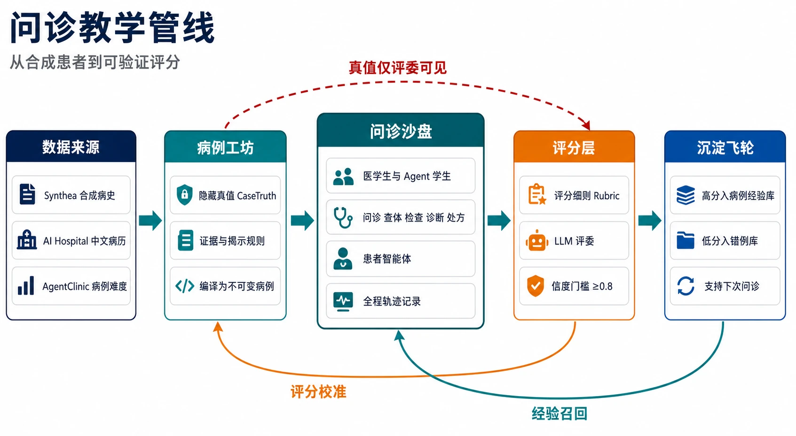

# 问诊教学管线：从合成患者到可验证评分

> 图示角色：生成式讲解图（gpt-image-2），帮助建立整体直觉；每个组件的机制、依据与状态以上下文为准。管线本身是 **Phase 1 工程设计**（假设层），尚未实现——各层标注了当前证据等级。

## 一句话定位

五个仓室一条主线、三条反馈线：**合成数据进来，病例带着隐藏真值编译，学生在沙盘里问诊，评委按细则打分，分数沉淀成下一次问诊的经验**。这条管线是医疗智能体平台的教学楔子（teaching wedge）——用它先把「可验证评分」这一层做扎实，再横向复制到治理轨场景（处方审查、病案质控、DRG-DIP、对账）。

## 逐仓讲解

### 1 数据来源（事实层）

| 卡片 | 来源 | 证据等级 |
|---|---|---|
| Synthea 合成病史 | Apache-2.0 生成器，输出患者一生就诊史（FHIR R4）；克隆于 `references/synthea`（commit d9d07a6） | 已验证：能生成；**边界已核验**：无中国人口包，需本地化改造 |
| AI Hospital 中文病历 | `references/AI_Hospital`（MIT）的 `src/data/patients.json` 真实病历改编数据 + MVME 评分脚本 | 已验证：中文素材现成 |
| AgentClinic 病例难度 | `references/AgentClinic`（MIT，commit b6570ed）24 种偏置注入 + 难度分级设计 | 已验证：难度源设计参考 |

直觉：教学系统最怕的不是「AI 不够聪明」而是**没有地面真值（ground truth）**——考卷没有标准答案。所以第一层不选真实患者（隐私、许可、标注成本三重障碍），全部用合成或公开脱敏数据，让每个病例天生自带答案。

### 2 病例工坊（编译层）

- **隐藏真值 CaseTruth**：病例的完整事实（真正患什么病、哪项检查会出什么结果）只存在模拟引擎私有状态里，学生看不到。
- **证据与揭示规则**：定义「问什么给什么」——初始主诉、问诊后症状细节、查体后体征、开单后报告，逐级解锁；「LLM 只口语化，不决定事实」。
- **编译为不可变病例**：Scenario 一旦发布不可修改，每次运行生成独立的 Scenario Run 与 append-only ActionTrace。

直觉：像游戏引擎的思路——地图（真值）和迷雾（揭示规则）分离。学生看到的世界由规则逐步展开，而不是由患者扮演者（人或 LLM）即兴编造。这是 DSH-AGUI-demo 仓库 ClinMesh 设计（`docs/research/virtual-patient-and-case-authoring-systems.md`）已沉淀的模型。

### 3 问诊沙盘（运行层）

最大的一仓，也是产品的脸。两类学生（医学生真人 + Agent 学生强弱双档）对同一病例走完整门诊链路：**问诊 → 查体 → 检查 → 诊断 → 处方**。对面是患者智能体（LLM 扮演，受 CaseTruth 约束），全程轨迹记录（ActionTrace）落盘。

为什么同时放真人学生和 Agent 学生：Agent 学生是**可无限次重放的评分标定器**——强弱双档在同一病例上的分数差，就是评分层区分度的直接证据；真人学生随后进入才有意义。

### 4 评分层（验证层）——本管线的差异化核心

- **评分细则 Rubric**：不问「答得好不好」的整体印象，而是几十条可判定的原子项（如「是否询问了糖尿病家族史」）。方法论来自 HealthBench（48,562 条 rubric，`references/simple-evals`）与 AMIE 的多轴评估。
- **LLM 评委**：LLM 按细则逐条比对轨迹判定，而非自由打分（simple-evals judge 模式）。
- **信度门槛 ≥0.8**：评分本身也要被评——Phase 1 的 P2.5 评分合同要求：同一轨迹重复评分 3 次稳定、约 20% 人工抽查一致率 ≥0.8、强弱双档 Agent 分数可区分。过不了门槛的 rubric 不上线。

**红线**：顶部那条「真值仅评委可见」虚线绕过沙盘直达评分层——CaseTruth 永不进入对话运行时，只有评委能读。没有这条线，患者智能体泄露答案或学生诱导泄露，整个考核作废。这也是 TAIREX 线上诊室取证中未见的机制（同行结果分布 ≠ 标准答案），是我们「考」对它「练」的差异化所在。

### 5 沉淀飞轮（记忆层）

高分对话入病例经验库、低分入错例库，支持下次问诊。这是 AMIE 外环（fine-tuning）在**不做微调前提下的非参数替代**：分数门控的经验召回——新病例先检索同病种高分对话作为 in-context 范例，错例库阻断已知坏模式。可版本化、可审计、可回滚，比「医生分身」式隐式记忆透明。

## 三条反馈线

| 线 | 方向 | 作用 |
|---|---|---|
| 真值仅评委可见 | 2 → 4（顶部虚线，绕过 3） | 防泄露红线，考核有效性的前提 |
| 评分校准 | 4 → 2 | 抽查与信度数据反哺病例与 rubric 修订（难了/易了/条款歧义） |
| 经验召回 | 5 → 3 | 高分经验进入下次运行时，形成飞轮 |

## 待办与缺口

- rubric 的中文住培/OSCE 本地化：未有现成中文细则语料，是当前最大缺口（INDEX 检索台账在案）。
- Synthea 中国本地化：姓名/人口/编码需自建（详见 DSH-AGUI-demo `docs/research/synthetic-hospital-data-sources.md`）。
- P0 golden case（二型糖尿病）尚未开工——这是整条管线的第一个端到端验证。

## 思考题

评分层要求「同一轨迹重复评分 3 次结果稳定」。如果 LLM 评委三次给出 0.72 / 0.75 / 0.58，你会先怀疑 rubric 写得有歧义，还是先怀疑评委模型太弱？先动哪一个？（提示：想想哪一层的问题会污染所有病例的评分。）
