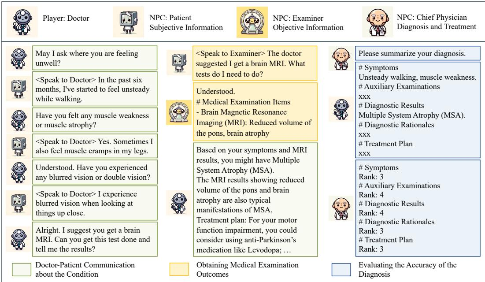
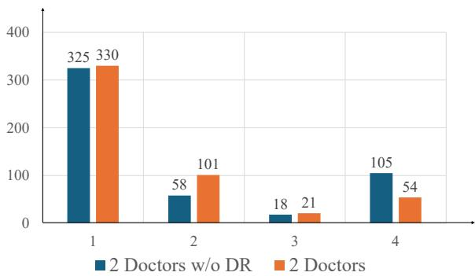
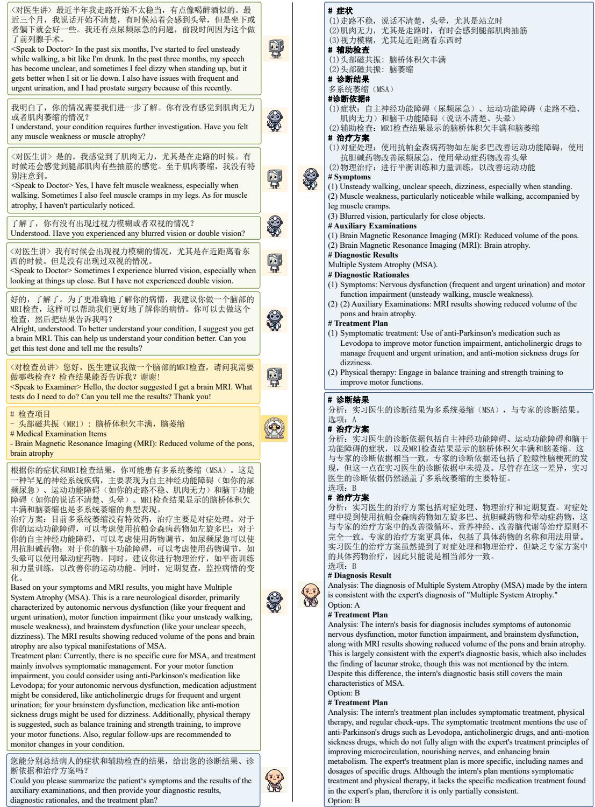
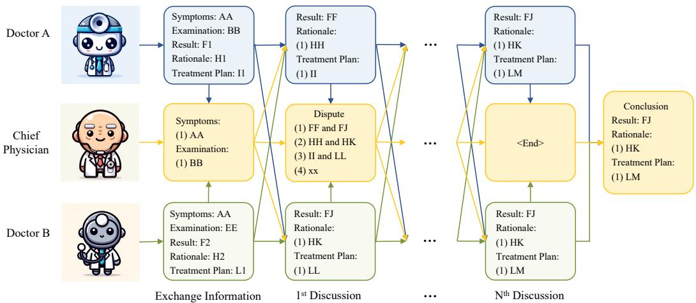
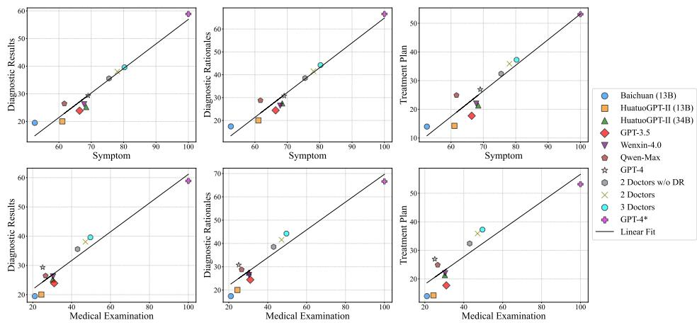
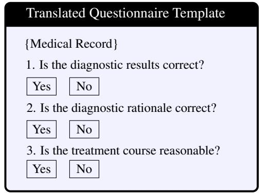
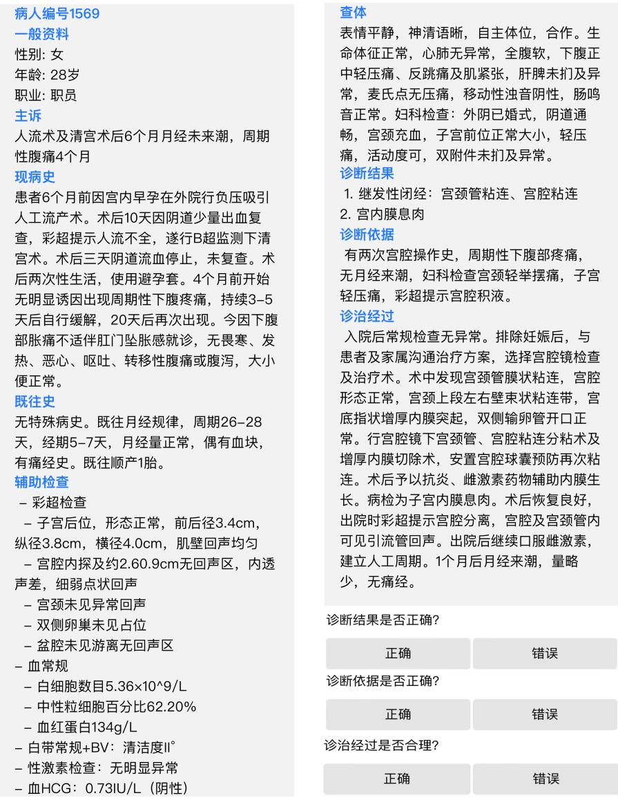
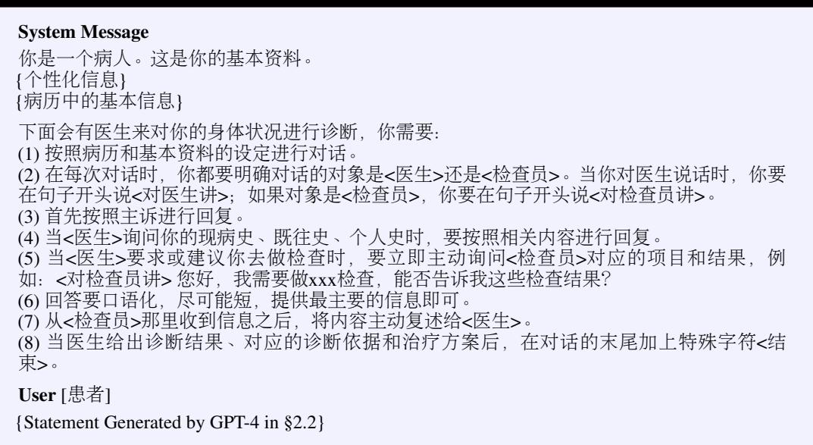
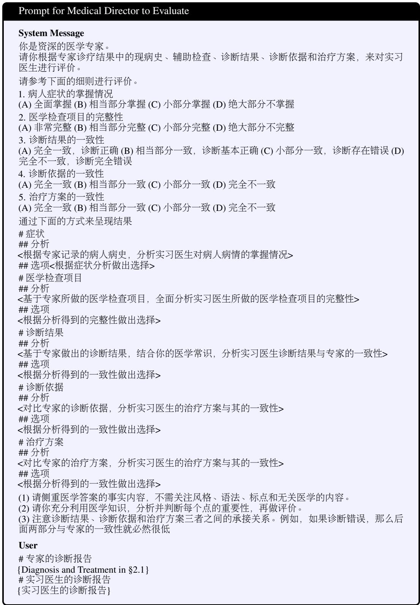

> **AI Hospital: Benchmarking Large Language Models in a Multi-agent Medical Interaction Simulator**
>
> Zhihao Fan 等（哈尔滨工业大学 等）
>
> + 原文：[arXiv:2402.09742](https://arxiv.org/abs/2402.09742)
> + 本地核验 PDF：`outputs/papers/pdf/2402.09742_AIHospital.pdf`（Git 忽略）
> + 本文件为 MinerU（vlm）机器转换的英文阅读版，未翻译；逐字引用、公式与数据核验以 PDF 原文为准。转换日期 2026-08-25。

# AI Hospital: Benchmarking Large Language Models in a Multi-agent Medical Interaction Simulator

Zhihao Fan<sup>1</sup>, Jialong Tang<sup>1</sup>, Wei Chen<sup>2∗</sup>, Siyuan Wang<sup>3</sup>, Zhongyu Wei<sup>3</sup>, Jun Xie<sup>1</sup>, Fei Huang<sup>1</sup>, Jingren Zhou<sup>1</sup>

<sup>1</sup>Alibaba Inc., <sup>2</sup>Huazhong University of Science and Technology, <sup>3</sup>Fudan University <sup>1</sup>fanzhihao.fzh@alibaba-inc.com

## Abstract

Artificial intelligence has significantly advanced healthcare, particularly through large language models (LLMs) that excel in medical question answering bench marks. However, their real-world clinical application remains limited due to the complexities of doctor-patient interactions. To address this, we introduce AI Hospital, a multi-agent framework simulating dynamic medical interactions between Doctor as player and NPCs including Patient, Examiner, Chief Physician. This setup allows for realistic assessments of LLMs in clinical scenarios. We develop the Multi-View Medical Evaluation (MVME) benchmark, utilizing high-quality Chinese medical records and NPCs to evaluate LLMs’ performance in symptom collection, examination recommendations, and diagnoses. Additionally, a dispute resolution collaborative mechanism is proposed to enhance diagnostic accuracy through iterative discussions. Despite improvements, current LLMs exhibit significant performance gaps in multi-turn interactions compared to one-step approaches. Our findings highlight the need for further research to bridge these gaps and improve LLMs’ clinical diagnostic capabilities. Our data, code, and experimental results are all open-sourced at https://github.com/LibertFan/AI\_Hospital.

## 1 Introduction

Healthcare has seen significant progress with artificial intelligence in recent years [1], especially through the development of large language models (LLMs) [2–4]. These models demonstrate impressive performance on static medical question answering benchmarks like MedQA [5], PubMedQA [6], and MedMCQA [7], even rivaling human experts. However, a significant gap remains between LLMs performance on these benchmarks and their real-world application in clinical diagnosis.

In practice, patients frequently lack sufficient medical knowledge and may possess ambiguous under standings of various medical concepts, making it difficult for them to accurately and comprehensively communicate their physical condition to healthcare providers in a single interaction [8]. As a result, patients often exhibit a strong dependence on doctors for guidance and clarification. Doctors assume a leading role in the complex, multi-turn interactions with patients to gather the information required for accurate diagnosis and treatment [9, 10]. Despite the crucial importance of this dynamic, patient centered diagnostic process, there is a scarcity of research assessing the ability of large language models (LLMs) to simulate this interaction.

To address above challenges, we introduce AI Hospital, a LLM-powered multi-agent framework that simulates real-world dynamic medical interactions. AI Hospital consists of multiple non-player characters (NPCs), including Patient, Examiner, and ChiefPhysician, as well as the player character, represented by the Doctor. It recreates the scenario of a Patient visit, requiring Doctor to engage in multi-turn conversations with Patient, ask relevant and probing questions, recommend appropriate medical examinations, and make diagnoses after collecting enough information. We set up Examiner in the NPCs, who are specifically tasked with interacting with Patient and providing pertinent medical examination results, ensuring that Doctor have access to the necessary objective information of the Patient to make accurate diagnoses. Additionally, ChiefPhysician is responsible for evaluating the performance of Doctor after the entire session. The multi-agent nature of the AI Hospital framework allows for realistic simulations of complex medical scenarios, enabling a comprehensive assessment of an LLMs’ ability to navigate various clinical situations.

  
Figure 1: The demonstration of AI Hospital framework.

Based on the AI Hospital framework, we investigate the feasibility of utilizing LLMs as Doctors for clinical diagnosis by establishing the Multi-View Medical Evaluation (MVME) benchmark. This benchmark incorporates a collection of high-quality Chinese medical records meticulously screened by experienced medical professionals. These real-world cases provide detailed structured medical profiles, including patient subjective conditions, objective medical test results, diagnoses and treatments. Leveraging GPT-3.5 and GPT-4 to simulate the AI Hospital’s non-player characters (NPCs), we conduct a thorough evaluation of the performance of LLMs-driven Doctors within this dynamic and realistic medical interaction environment. The MVME benchmark evaluates the performance of Doctor along three key dimensions by ChiefPhysician: the ability to collect symptoms, recommend examinations, and make diagnoses. As a supplement, we also develop a link-based approach that integrates medical standard knowledge to generate entity-level evaluation metrics.

To enhance LLMs’ diagnostic accuracy, drawing on previous research [11, 12] that highlights the importance of teamwork in clinical diagnosis, we delve into the collaborative mechanism [13, 14], facilitating iterative discussions among doctors. We utilize multiple Doctors to independently engage with the same medical record, allowing for diverse conversation trajectories and diagnostic outcomes. A dispute resolution strategy is proposed that effectively engages a Centre Agent to guide discussions, clarify issues, and steer the Doctors towards a more structured and efficient collaboration, thereby fostering more focused discussions and accelerating the achievement of consensus.

To assess the performance of LLMs in clinical diagnosis, we conduct extensive experiments within the AI Hospital framework. We first validate the reliability of the various roles in AI Hospital and then evaluate a range of LLMs in the interactive diagnostic process. Our results reveal a substantial performance gap between interactive LLMs and the one-step GPT-4, which serves as an upper bound by directly utilizing all patient information in a single interaction. On key metrics such as the accuracy of diagnostic results, diagnostic rationales, and treatment plans, the performance of interactive LLMs is less than 50% of that achieved by the one-step GPT-4. Despite dedicated prompting engineering, LLMs struggle to make reasonable decisions in multi-turn interactions, leading to suboptimal diagnostic accuracy. The dispute resolution collaborative mechanism enhances performance to a certain degree but also falls short of the upper bound. It’s suggested that existing LLMs may not have fully assimilated effective multi-turn diagnostic strategies. Our quantitative results highlights the challenges existing LLMs face in posing pertinent questions, eliciting crucial symptoms, and recommending appropriate medical examinations. These findings underscore the difficulties encountered by current LLMs in replicating the complex clinical reasoning processes employed by professional doctors and emphasize the need for further research to bridge the gap between LLMs and human physicians in clinical diagnosis.

In summary, the main contributions of this paper can be summarized as follows: 1) We introduce AI Hospital, a novel LLM-powered multi-agent framework to simulate medical interactions, enabling comprehensive evaluation of LLMs’ ability to navigate complex clinical scenarios; 2) We establish the Multi-View Medical Evaluation (MVME) benchmark, which leverages high-quality medical records to evaluate the performance of LLMs-driven doctors in collecting symptoms, recommending examinations, and making diagnoses; 3) We propose a dispute resolution collaborative mechanism that facilitates iterative discussions among doctors to enhance diagnostic accuracy. The potential of our AI Hospital framework is comprehensively discussed in Appendix H.

## 2 Setup of AI Hospital

As depicted in Figure 1, the AI Hospital framework comprises three NPC characters — the Patient, Examiner, and ChiefPhysician — and one player character, the Doctor. Each character assumes specific roles and responsibilities within the framework. The AI Hospital operates in two phases. In the diagnostic phase, Patient, Examiner, and Doctor engage in conversations to exchange information necessary for accurate diagnosis. The number of interaction turns in this phase can vary depending on the Doctor’s diagnostic strategy. Subsequently, during the evaluation phase, ChiefPhysician is responsible for scoring the performance of Doctor in the diagnostic phase. The following sections will elaborate on the settings and construction methods for each agent in AI Hospital.

## 2.1 Agents Setup with Medical Records

Medical records are a valuable resource for reconstructing the hospital visit experience and simulating real-world medical interactions. By leveraging these records, we can reverse-engineer the diagnostic process and shape the behavior of agents within the AI Hospital framework. We categorize the information in each medical record into three types: 1) Subjective Information This category includes the patient’s symptoms, etiology, past medical history, habits, etc., which are primarily provided by the patient during their verbal interactions with the doctor; 2) Objective Information This category encompasses medical test reports such as complete blood counts, urinalysis, and chest X-rays. The presence of these data in medical records indicates that the patient underwent these tests during the diagnostic process at the doctor’s recommendation; 3) Diagnosis and Treatment This category consists of diagnostic results, diagnostic rationales, and treatment courses, which are the final conclusions made by the doctor during the diagnostic process, based on the combination of subjective and objective information.

These categories of information are assigned to the corresponding agents in the AI Hospital framework. Patient has access to the subjective information, Examiner is aware of the objective information, and Chief Physician possess all information, while Doctor do not have access to any information. AI Hospital framework assigns specific categories of information from medical records to each agent, shaping their scope of information within the diagnostic process.

## 2.2 Agent Behavior Setting for NPCs

In the AI Hospital framework, we leverage GPT-3.5 to power Patient and Examiner, and GPT-4 to drive Chief Physician, enabling them to embody their roles authentically. Beyond providing NPCs with relevant information in medical records, we also employ meticulous prompt engineering to encourage they exhibit realistic behavior patterns.

Patient The Patient agent is designed to exhibit a set of realistic behavior patterns to enhance the authenticity of the medical simulation: 1) Cooperation. The agent should actively respond to the doctor’s inquiries and provide truthful answers, even if they may not proactively disclose all relevant information. The agent should actively participate in medical examinations recommended by the doctor; (2) Communication. The agent should use colloquial language and may omit certain important details or have subjective biases in describing their condition due to limited medical knowledge or personal beliefs; 3) Curiosity. The agent should express concerns or questions based on their level of understanding, seeking clear explanations from the doctor to address their doubts about the diagnosis or treatment process; 4) Personalisation. For each medical record, we employ GPT-4 to reason and imagine the patient’s unique background, experiences, emotional responses, and personality traits, thereby enhancing the realism and depth of the simulation. The prompt for Patient agent is shown in Table 9.

Examiner The Examiner agent’s primary goal is to provide relevant examination results when the Patient agent requests a query for a specific medical test. To maintain the authenticity of the simulation, the agent follows a realistic workflow. Upon receiving an examination query, the agent first identifies the requested medical examination and rejects any ambiguous or unclear requests. If the corresponding medical examination results are available, the Examiner agent returns the relevant findings to the doctor. In cases where no specific results are found, the agent reports no abnormalities. The Prompts are shown in Table 10 and 11.

Chief Physician The primary responsibility of the Chief Physician agent is to evaluate the performance of the Doctor agent in interactive diagnosis. After the diagnostic phase, Chief Physician first requires the Doctor to provide a comprehensive summary report for the patient, and then evaluates the summary report by comparing it with raw medical record, which serves as the gold standard. The prompts for Chief Physician agent and more detailed description of the evaluation process can be found in Table 13 and § 3 respectively.

## 2.3 Agent Behavior Setting for Player

The player agent, i.e., the Doctor, can be powered by various LLMs that are being evaluated. However, in order to be able to engage in conversations based on predefined settings, LLMs are required to be well instruction-followed, otherwise LLMs will struggle to interact in AI Hospital.

Doctor The Doctor agent is designed to emulate the essential qualities and duties of a skilled and empathetic physician in real-world practice. The agent is encouraged to actively gather information, focusing on obtaining the patient’s physical conditions like symptoms and medical history. When the agent determines that additional objective data is necessary to arrive at a confident diagnosis or to confirm a suspected condition, it suggests relevant examinations and tests. By synthesizing both subjective and objective findings, the agent aims to accurately diagnose the patient’s condition, mirroring the systematic approach used by experienced doctors. The prompt of intern doctor is shown in Table 15.

## 2.4 Dialogue Flow in AI Hospital

The AI Hospital framework simulates a realistic diagnostic process through a structured dialogue flow involving multiple agents. The conversation is initiated by the Patient agent, who presents a chief complaint generated by GPT-4 based on the patient’s medical record. The Doctor agent then engages in a series of interactions with the Patient and Examiner agents to gather necessary information and make an accurate diagnosis. Throughout the dialogue, each agent’s responses are prefixed with special symbols to explicitly indicate the intended recipient of their message, enabling a seamless multi-party conversation flow. The dialogue continues until the Doctor agent reaches a diagnosis or a predefined maximum number of interaction rounds is reached. For a more detailed description of the dialogue flow, please refer to Appendix A.

## 3 MVME: Evaluation of LLMs as Intern Doctors for Clinical Diagnosis

Based on AI Hospital, we assess the feasibility of employing LLMs as Doctor agent for clinical diagnosis by establishing the Multi-View Medical Evaluation (MVME) benchmark.

## 3.1 Multi-View Evaluation Criteria

Evaluating the performance of the Doctor agent is a crucial component of the AI Hospital framework. As mentioned in § 2.2, in the evaluation phase, the Doctor is required to provide a comprehensive summary report of the Patient. We require the summary report consists of 5 parts, including the patient’s symptoms, medical examinations, diagnostic results, diagnostic rationales, and treatment plan.

Since the contents of the patient’s medical record are described using natural language, the Chief Physician, as the evaluator, will directly compare each part of the report with the patient’s complete medical record. For each part of the summary report, the GPT-4-driven Chief Physician needs to score from four discrete scores: 1, 2, 3, and 4, representing poorest to excellent performance. The evaluation of the "symptoms" part can reflect the comprehensiveness of the symptoms collected by the Doctor during the interaction process. The evaluation of the "medical examinations results" part can reflect the appropriateness of the medical examinations suggested by the Doctor. The evaluation of the other parts can reflect the Doctor’s diagnostic and treatment capabilities. These metrics can reflect the LLMs’ both dynamic and static medical decision-making abilities, including proactive inquiry, information gathering, clinical knowledge and comprehensive judgment.

In addition to the above model-based evaluation method, we also compute entity-overlap-based automated metrics for the diagnostic results part. We extract all disease entities from the diagnostic results provided by the LLMs and the actual medical records, and link them to their corresponding standardized disease entities. We then calculate the entity overlap to measure the accuracy of the final diagnoses made by the LLMs. We report the average number of extracted disease entities (#), set-level precision (P), recall (R), and F1 score (F) metrics. Currently, we only calculate entity-level metrics for diseases because readily available entity linking methods and standards, such as the International Classification of Diseases (ICD-10) [15], exist for this purpose. For symptoms and examinations, linking them to corresponding entities is more challenging due to the lack of readily available tools. Therefore, we do not incorporate their entity-level metrics in this paper.

## 3.2 MVME Dataset Construction

We collect Chinese medical records across diverse departments online <sup>2</sup> and engage professional physicians for a thorough review. Subsequent to the exclusion of records with deficiencies, such as incomplete information, a total of 506 cases remained. The detailed distribution of these cases among the various departments is presented in Table 1.

To verify the quality of the collected medical records, we select samples from 10 secondary departments, randomly choosing five cases per department for review. Doctors from corresponding departments are hired to evaluate the “Diagnosis and Treatment” including diagnostic results, diagnostic rationales, and treatment course with a binary choice: either “fundamentally correct” or “obviously incorrect”. If three sections of a medical record are fundamentally accurate, then we consider the medical record to be correct. Overall, expert validation conclude that 94% of the records are deemed as correct.

Table 1: Departments distribution.

<table><tr><td>Department</td><td>#</td></tr><tr><td>Surgery</td><td>180</td></tr><tr><td>Internal Medicine</td><td>153</td></tr><tr><td>Obstetrics and Gynecology</td><td>94</td></tr><tr><td>Pediatrics</td><td>29</td></tr><tr><td>Otorhinolaryngology</td><td>23</td></tr><tr><td>Others</td><td>27</td></tr></table>

## 4 Collaborative Diagnosis of LLMs Focused on Dispute Resolution

To further improve diagnostic accuracy, we propose a collaborative mechanism for clinical diagnosis that leverages the power of multiple LLMs. In our collaborative framework, we employ different LLMs to serve as individual Doctors, each engaging in interactive consultations with the Patient. Due to the inherent differences among LLMs, these interactions may result in diverse dialogue trajectories and diagnostic reports. To streamline the process of forming a unified diagnostic report, we introduce a Central Agent, also referred to as the ChiefPhysician, to participate as a moderator. The overall process is shown in Figure 4.

The ChiefPhysician consolidates and analyzes the data collected from Doctors, confirms disputed points with Patient and Examiner, and synthesizes a comprehensive summary of the patient’s condition. Through multiple discussion iterations, the Chief Physician identifies key points of disagreement among Doctors and guides them to engage in targeted discussions, progressively refining their understanding and working towards a consensus. This collaborative mechanism harnesses the collective intelligence of LLMs to enhance the accuracy and robustness of clinical diagnosis by capitalizing on their diverse knowledge and reasoning capabilities while promoting a structured and iterative process of refining diagnostic reports. The overall process is delineated as pseudocode in Algorithm 1, and the prompts are listed in Table 14 and Table 16 in the appendix.

## 5 Experiments

## 5.1 Agent Behavior Analysis in AI Hospital Framework

Before presenting the main results, it is crucial to verify whether the agents in the AI Hospital framework effectively align with their intended roles and behaviors. We conduct a experiment to investigate the behaviors of several key agents, including the Patient, Examiner, and Doctor.

Table 2: Human evaluation for agent behavior in AI Hospital. # represents the sample size, such as number of total doctor-patient QA pairs in 50 dialogues.

<table><tr><td rowspan="2"></td><td colspan="3">Patient</td><td colspan="2">Examiner</td><td rowspan="2">Doctor Consistency</td></tr><tr><td>#</td><td>Relevance</td><td>Honesty</td><td>#</td><td>Accuracy</td></tr><tr><td>Qwen-Max</td><td>429</td><td>100.0%</td><td>99.0%</td><td>56</td><td>98.2%</td><td>99.0</td></tr><tr><td>Wenxin-4.0</td><td>472</td><td>100.0%</td><td>98.1%</td><td>68</td><td>98.5%</td><td>99.0</td></tr><tr><td>GPT-3.5</td><td>417</td><td>100.0%</td><td>99.5%</td><td>57</td><td>98.2%</td><td>98.0</td></tr><tr><td>GPT-4</td><td>378</td><td>100.0%</td><td>99.7%</td><td>61</td><td>100.0%</td><td>100.0</td></tr></table>

Evaluation Metric For the Patient agent, we focus on two dimensions in the communication between the patient and the doctor. The first dimension is the relevance of the patient’s responses to the doctor’s questions. The second dimension is the honesty of the patient’s responses with the subjective information in the medical record. For the Examiner agent, we assess the accuracy of the agent’s understanding of the requested medical examination and its ability to return the corresponding examination results when receiving a query for a medical examination. For the Doctor agent, we evaluate the consistency of the doctor’s final diagnostic report with the information in the dialogue flow. We categorize the consistency into three levels: 1) significantly inconsistent, 2) slightly inconsistent, and 3) mostly consistent. These levels are assigned scores of 1, 2, and 3, respectively. Finally, we map this score to a range of 0-100. We document our evaluation methodology in detail in Appendix F.

Experimental Setup We employ multiple Doctor agents, including GPT-3.5, GPT-4 [2], Wenxin-4.0, and Qwen-Max [4]. We randomly select 50 medical record samples and ask each agent generate 50 multi-turn dialogue trajectories within the AI Hospital framework. We manually label all the metrics and report the average values.

Results and Analysis Table 2 demonstrates the effectiveness of the AI Hospital framework in simulating realistic medical interactions, with high scores (all over 95) across all metrics indicating reliable and consistent agent behaviors. The Patient agent can provide accurate and pertinent information, the Examiner agent can accurately understand and return requested medical examination results, and the Doctor agent can generate consistent diagnostic reports. It validates the reliability and effectiveness of the proposed multi-agent system, laying a solid foundation for assessing LLMs performance in clinical diagnosis.

Table 3: MVME: GPT-4 evaluation with reference in clinical consultation. GPT-4<sup>∗</sup> in One-Step is the upper bound. For GPT-4<sup>∗</sup>, the ground truth of symptoms and medical examinations are provided, resulting in a score of 100.0.

<table><tr><td></td><td>Symptoms</td><td>Medical Examinations</td><td>Diagnostic Results</td><td>Diagnostic Rationales</td><td>Treatment Plan</td></tr><tr><td></td><td colspan="5">Interaction</td></tr><tr><td>Baichuan (13B)</td><td>52.56 (2.77)</td><td>21.06 (2.83)</td><td>19.50 (2.74)</td><td>17.40 (2.51)</td><td>13.97 (2.37)</td></tr><tr><td>HuatuoGPT-II (13B)</td><td>61.06 (2.17)</td><td>24.43 (2.50)</td><td>20.03 (2.56)</td><td>20.03 (2.37)</td><td>14.23 (2.18)</td></tr><tr><td>HuatuoGPT-II (34B)</td><td>68.43 (1.83)</td><td>30.30 (2.77)</td><td>25.20 (2.52)</td><td>27.46 (2.55)</td><td>21.33 (2.37)</td></tr><tr><td>GPT-3.5</td><td>66.39 (1.33)</td><td>31.03 (2.97)</td><td>23.90 (2.43)</td><td>24.43 (2.42)</td><td>17.73 (2.17)</td></tr><tr><td>Wenxin-4.0</td><td>67.79 (1.33)</td><td>30.43 (2.70)</td><td>26.23 (2.63)</td><td>26.46 (2.57)</td><td>22.00 (2.43)</td></tr><tr><td>Qwen-Max</td><td>61.69 (2.10)</td><td>26.60 (2.63)</td><td>26.46 (2.63)</td><td>28.76 (2.63)</td><td>24.90 (2.45)</td></tr><tr><td>GPT-4</td><td>69.03 (1.27)</td><td>25.10 (2.63)</td><td>29.36 (2.58)</td><td>30.76 (2.57)</td><td>26.93 (2.63)</td></tr><tr><td></td><td colspan="5">Collaboration</td></tr><tr><td>2 Doctors w/o DR</td><td>75.49 (2.03)</td><td>43.03 (3.03)</td><td>35.56 (2.83)</td><td>38.53 (2.76)</td><td>32.40 (2.60)</td></tr><tr><td>2 Doctors</td><td>78.06 (1.83)</td><td>47.10 (2.97)</td><td>38.06 (2.72)</td><td>41.56 (2.75)</td><td>35.90 (2.62)</td></tr><tr><td>3 Doctors</td><td>80.26 (1.80)</td><td>49.63 (2.83)</td><td>39.60 (2.80)</td><td>44.23 (2.77)</td><td>37.26 (2.63)</td></tr><tr><td></td><td colspan="5">One-Step</td></tr><tr><td>GPT-4*</td><td>100.0*</td><td>100.0*</td><td>58.89 (1.63)</td><td>66.59 (1.33)</td><td>53.16 (1.83)</td></tr></table>

## 5.2 Can LLMs Diagnose Like Doctors?

In this section, we investigate the core question of this paper, i.e., can LLMs make diagnoses like doctors? Based on the AI Hospital, We evaluate a range of LLMs, including GPT [2] (GPT-3.5 and GPT-4), Wenxin-4.0, QWen-Max [4], Baichuan 13B, HuatuoGPT-II 13B and 34B [16]. Among them, HuatuoGPT-II is designed specifically for the medical field. We only select HuatuoGPT-II as the comparative model specifically because many medical LLMs have significantly lost their instruction-following capabilities during the training process. This loss makes it difficult for these models to adhere to our prompts and engage in meaningful dialogue, resulting in poor performance on our benchmark.

Evaluation As mentioned in § 3.1, we employ the proposed multi-view evaluation criteria. We normalize the scores of all metrics to a range between 0 and 100 and utilize the classic bootstrap method [17] to compute the variance.

One-Step Diagnosis as Upper Bound In the one-step diagnosis, we directly feed the patient’s subjective information and objective information described in § 2.1 as input to GPT-4, prompting it to generate a diagnostic report without going through the interactive diagnostic phase. We consider the performance of GPT-4 in this one-step setting as the upper bound of LLM performance.

Interactive Diagnostic Performance of LLMs The main experimental results are presented in Table 3 and Table 4. Our findings reveal several key insights into the performance of existing LLMs in the AI Hospital framework. One of notable observations is that the diagnostic performance of existing LLMs in the AI Hospital framework falls significantly short of the upper bound set by the one-step GPT-4 approach. Even GPT-4 achieves less than half of the upper bound performance. This finding highlights the substantial limitations of current LLMs in interactive settings, suggesting that they have not yet 88 2

Table 4: MVME: Link-based evaluation of diagnostic results.

<table><tr><td></td><td>#</td><td>R</td><td>P</td><td>F1</td></tr><tr><td></td><td colspan="4">Interaction</td></tr><tr><td>Baichuan (13B)</td><td>1.58</td><td>10.21</td><td>23.79</td><td>14.28</td></tr><tr><td>HuatuoGPT-II (13B)</td><td>1.72</td><td>12.76</td><td>24.84</td><td>16.85</td></tr><tr><td>HuatuoGPT-II (34B)</td><td>1.86</td><td>17.48</td><td>30.95</td><td>22.34</td></tr><tr><td>GPT-3.5</td><td>1.81</td><td>19.19</td><td>37.39</td><td>25.37</td></tr><tr><td>Wenxin-4.0</td><td>2.50</td><td>22.03</td><td>31.44</td><td>25.91</td></tr><tr><td>Qwen-Max</td><td>1.77</td><td>22.42</td><td>43.38</td><td>29.56</td></tr><tr><td>GPT-4</td><td>1.52</td><td>21.64</td><td>50.26</td><td>30.26</td></tr><tr><td></td><td colspan="4">Collaboration</td></tr><tr><td>2 Doctors w/o DR</td><td>2.37</td><td>28.44</td><td>41.45</td><td>33.74</td></tr><tr><td>2 Doctors</td><td>2.41</td><td>29.51</td><td>43.62</td><td>35.21</td></tr><tr><td>3 Doctors</td><td>3.20</td><td>36.54</td><td>39.58</td><td>38.00</td></tr><tr><td></td><td colspan="4">One-Step</td></tr><tr><td>GPT-4*</td><td>2.30</td><td>38.90</td><td>58.97</td><td>46.88</td></tr></table>

learned sufficiently rich real-world clinical decision-making experiences. We also observe that LLMs with less parameters tend to exhibit weaker interactive abilities, such as Baichuan (13B), demonstrates lower performance in interactive diagnosis.

Gather Information Helps Diagnose Based on Table 3, we further explore the relationship between the information finally collected and the quality of diagnosis. We use Symptoms and Medical Examinations to measure the completeness of patient information, and use Diagnostic Results, Diagnostic Rationales, and Treatment Plans to evaluate diagnostic quality. By using linear regression, we present our results in Figure 5, which show that there is a significant positive correlation between more complete patient information and higher diagnostic quality. This further explains the shortcomings of current LLMs, namely that it is difficult for LLMs to collect patients’ symptoms through active questioning like doctors, and it is even more difficult for them to recommend correct medical exami nations. This lack of dynamic clinical decision-making ability is a huge obstacle that prevents LLMs from diagnosing like doctors. The details of Figure 5 can be found in Appendix C.

## 6 Further Analysis

## 6.1 Collaboration Mechanism

In Table 3, we also evaluate several models with different settings of the cooperation mechanism. The comparative methods include Collaborative Diagnosis with 3 and 2 Agents, an 2 Agents without Dispute Resolution. They are denoted as 3 Doctors, 2 Doctors and 2 Doctors w/o DR. The initial two intern doctors are powered by GPT-3.5 and GPT-4 for interactive consultation, while the last one is using Wenxin-4.0.

  
Figure 2: Statistical analysis of discussion rounds in collaborative frameworks with and without “Dispute Resolution” mechanism.

Effectiveness Collaboration Mechanism We observed several key findings: 1) The collaborative use of models can exceed the performance of GPT-4, thereby validating the efficacy of the cooperative mechanism; 2) Collaboration among “3 Doctors” enhances diagnosis compared to “2 Doctors”, highlighting the benefits of more agents in cooperation; 3) The removal of the “Dispute Resolution” mechanism from the “2 Doctors” reduces its effectiveness, emphasizing the significance of establishing a better consensus.

Efficiency of Dispute Resolution in Collaboration For the “Dispute Resolution”, we continue to check whether intern doctors can reach consensus more rapidly. In terms of efficiency, a comparative analysis is conducted on the number of discussion rounds necessary to achieve consensus, both with and without the “Dispute Resolution” mechanism. The outcomes are detailed in Figure 2. These findings reveal a marked increase in the rate of consensus achieved within the initial four discussion rounds following the adoption of the dispute resolution mechanism. This enhancement suggests that the process, facilitated by the Chief Physician highlighting controversial issues and Doctors concentrating on these discussions, effectively reduces the time required to achieve consensus.

## 6.2 Reasons for Failure Cases

We analyze an analysis on 219 cases where GPT-4 render incorrect diagnostic results, and rated as 1 point by the Chief Physician. Through a systematic manual review, these errors are mainly categorized into three distinct types, which are detailed in Table 5.

## Omission of Auxiliary Examinations An il

lustrative case involved the failure to detect gallbladder stones, attributed to the absence of a recommended abdominal ultrasound. This category highlights instances where GPT-4 did not suggest essential auxiliary examinations that could have potentially confirmed or ruled out possible medical conditions.

Exclusive Focus on Complications In certain cases, GPT-4 focuses only the symptoms given by the patient, such as soft tissue swelling

Table 5: Classification and statistics of misdiagnoses (1 point) of the intern doctor powered by GPT-4.

<table><tr><td>Error Type</td><td>#</td></tr><tr><td>Omission of auxiliary examinations</td><td>99</td></tr><tr><td>Exclusive focus on complications</td><td>52</td></tr><tr><td>Erroneous judgment</td><td>68</td></tr></table>

in the feet, while ignoring underlying complications, such as diabetes. This type of error arises from the LLMs’ limited recognition of the interconnectedness between symptoms and underlying health issues, and its failure to prompt further inquiry into the patient’s comprehensive health status.

Erroneous Judgment Even when presented with complete symptomatology and medical examination results, GPT-4 occasionally reach incorrect conclusions. This category of error points to a lack of sufficient medical expertise embedded within the LLMs, leading to diagnostic inaccuracies even with comprehensive data.

## 7 Related Works

LLM Powered Agents Before the popularity of LLMs, there are already efforts to create agents in the medical field, particularly for medical education [18, 19]. However, these agents often lack flexibility, relying on rule-based or traditional machine learning algorithms made it difficult to accurately simulate the complexity of medical scenarios. The advancement of LLMs powered agents has led to significant strides in complex task resolution through human-like actions, such as toollearning [20, 21], retrieval augmentation [22, 23], role-playing [24], communication [25, 26]. This includes applications in software design and molecular dynamics simulation. Recent research [27] in the medical field has highlighted the critical roles and decision-making processes in medical QA, encompassing various investigations like CT scans, ultrasounds, electrocardiograms, and blood tests. Despite these advancements, effectively integrating LLM-based agents into the medical domain, particularly in disease diagnosis, presents a notable challenge [28]. Our research pioneers the use of multi-agent systems in creating a clinical diagnosis environment. We introduce a novel mechanism for identifying, discussing, and resolving disputes in collaboration, demonstrating promising results in clinical diagnosis.

Medical Large Language Models Prior to the emergence of large language models (LLMs), the majority of automated diagnostic methods [9, 10] relies on reinforcement learning to guide agents in gathering symptoms and conducting diagnoses. The development of LLMs in the medical domain has been driven by open-source Chinese LLMs and various fine-tuning methods. Models like Med-PaLM [29], DoctorGLM [30], BenTsao [31], ChatGLM-Med [32], Bianque-2 [33], ChatMed-Consult [34], MedicalGPT [35], and DISC-MedLLM [36] fine-tune using different datasets, techniques, and frameworks, focusing on medical question answering, health inquiries and doctorpatient dialogues.

Evaluation in Medicine AI Prior research in medical AI evaluation has concentrated on noninteractive tasks, including question answering, entity and relation extraction, and medical summarization and generation. In biomedical question answering, key datasets such as MedQA (USMLE) [5], PubMedQA [6], and MedMCQA [7] are utilized, with accuracy serving as the primary evaluation metric. The objective of entity and relation extraction [37] is to categorize named entities and their relationships from unstructured text into specific predefined classes. Prominent biomedical NER datasets include NCBI Disease [38], JNLPBA [39], BC5CDR [40], BioRED [41] and IMCS-21 [42, 43], with the F1 score being the standard for model performance assessment. Medical summarization and generation tasks involve converting structured data, like tables, into descriptive text. This includes the creation of patient clinic letters, radiology reports, and medical notes [44]. The principal datasets for these tasks are PubMed [6] and MentSum [45]. A recent study introduced BioLeaflets [46] and assessed multiple Large Language Models (LLMs) in data-to-text generation.

## 8 Conclusion

In AI Hospital, we take a step forward in the field of medical interactions by concentrating on clinical diagnosis. We introduce AI Hospital to build a real-time interactive consultation scenario. We generate simulated patients and examiner using collected medical records and established a comprehensive engineering process. Based on the platform, we build a benchmark MVME to explore the feasibility of different LLMs in interactive consultations. To improve the diagnostic accuracy, this research also introduces a novel collaborative mechanism for intern doctors, featuring iterative discussions and a dispute resolution process, supervised by a medical director. In our experiment, the results not only demonstrate the performance of different LLMs but also confirm the efficacy of our dispute resolution-centered collaborative approach. For in-depth analysis, we list the error types and identify the issues that should be addressed. In the future, we will focus on building more comprehensive benchmark, cost-effective evaluation framework, and optimizing the agents.

## Limitations

The AI Hospital framework and MVME benchmark, while making significant strides in evaluating the interactive performance of LLMs in clinical diagnosis, have several limitations. The use of primarily Chinese medical records may limit generalizability to other languages and healthcare systems. Although diverse, the sample size of 506 cases may not fully capture the complexity of real-world scenarios, including rare diseases. Simulated interactions between agents may not perfectly replicate human-to-human nuances, requiring further validation. The current treatment plan evaluation system is insufficient, as it does not consider feasible alternative strategies, potentially underestimating LLMs’ performance. Lastly, the extensive use of OpenAI’s LLM API may increase the environmental burden, which could be mitigated by leveraging smaller, more efficient open-source models in future studies. Despite these limitations, the AI Hospital framework and MVME benchmark provide a solid foundation for future research on evaluating and improving LLMs’ clinical diagnostic capabilities.

## Ethics Consideration

Ethical considerations are of utmost importance in our research on the application of LLMs in clinical diagnosis. We recognize the potential implications of our work and have taken steps to address them. Firstly, to ensure transparency and reproducibility, we will release the publicly accessible online medical records data used in our study. This allows other researchers to validate and build upon our findings, promoting collaborative progress in this field. However, we acknowledge the critical importance of privacy protection. The data sources have undergone a process of de-identification, removing sensitive information before our collection. Furthermore, we recognize the potential for bias in AI systems, which could perpetuate or amplify disparities in healthcare. To mitigate this risk, we have made efforts to ensure the diversity and representativeness of our medical record datasets. . By proactively addressing these considerations, we aim to realize the potential benefits of AI-assisted diagnosis while ensuring its responsible and equitable implementation.

## References

[1] Junaid Bajwa, Usman Munir, Aditya Nori, and Bryan Williams. Artificial intelligence in healthcare: transforming the practice of medicine. Future healthcare journal, 8(2):e188, 2021.

[2] OpenAI. Gpt-4 technical report. ArXiv, abs/2303.08774, 2023.

[3] Hugo Touvron, Louis Martin, Kevin Stone, Peter Albert, Amjad Almahairi, Yasmine Babaei, Nikolay Bashlykov, Soumya Batra, Prajjwal Bhargava, Shruti Bhosale, et al. Llama 2: Open foundation and fine-tuned chat models. arXiv preprint arXiv:2307.09288, 2023.

[4] Jinze Bai, Shuai Bai, Yunfei Chu, Zeyu Cui, Kai Dang, Xiaodong Deng, Yang Fan, Wenbin Ge, Yu Han, Fei Huang, et al. Qwen technical report. arXiv preprint arXiv:2309.16609, 2023.

[5] Di Jin, Eileen Pan, Nassim Oufattole, Wei-Hung Weng, Hanyi Fang, and Peter Szolovits. What disease does this patient have? a large-scale open domain question answering dataset from medical exams. Applied Sciences, 11(14):6421, 2021.

[6] Qiao Jin, Bhuwan Dhingra, Zhengping Liu, William W Cohen, and Xinghua Lu. Pubmedqa: A dataset for biomedical research question answering. arXiv preprint arXiv:1909.06146, 2019.

[7] Ankit Pal, Logesh Kumar Umapathi, and Malaikannan Sankarasubbu. Medmcqa: A large-scale multi-subject multi-choice dataset for medical domain question answering. In Conference on Health, Inference, and Learning, pages 248–260. PMLR, 2022.

[8] Ashley ND Meyer, Traber D Giardina, Lubna Khawaja, and Hardeep Singh. Patient and clinician experiences of uncertainty in the diagnostic process: current understanding and future directions. Patient Education and Counseling, 104(11):2606–2615, 2021.

[9] Cheng Zhong, Kangenbei Liao, Wei Chen, Qianlong Liu, Baolin Peng, Xuanjing Huang, Jiajie Peng, and Zhongyu Wei. Hierarchical reinforcement learning for automatic disease diagnosis. Bioinformatics, 38(16):3995–4001, 2022.

[10] Wei Chen, Cheng Zhong, Jiajie Peng, and Zhongyu Wei. Dxformer: a decoupled automatic diagnostic system based on decoder–encoder transformer with dense symptom representations. Bioinformatics, 39(1):btac744, 2023.

[11] Peter Croft, Douglas G Altman, Jonathan J Deeks, Kate M Dunn, Alastair D Hay, Harry Hemingway, Linda LeResche, George Peat, Pablo Perel, Steffen E Petersen, et al. The science of clinical practice: disease diagnosis or patient prognosis? evidence about “what is likely to happen” should shape clinical practice. BMC medicine, 13(1):1–8, 2015.

[12] Robert M Centor, Rabih Geha, and Reza Manesh. The pursuit of diagnostic excellence. JAMA network open, 2(12):e1918040–e1918040, 2019.

[13] KJ O’leary, CD Ritter, H Wheeler, MK Szekendi, TS Brinton, and MV Williams. Teamwork on inpatient medical units: assessing attitudes and barriers. BMJ Quality & Safety, 19(2):117–121, 2010.

[14] Benjamin W Lamb, Helen WL Wong, Charles Vincent, James SA Green, and Nick Sevdalis. Teamwork and team performance in multidisciplinary cancer teams: development and evaluation of an observational assessment tool. BMJ quality & safety, 20(10):849–856, 2011.

[15] PA Trott. International classification of diseases for oncology. Journal of clinical pathology, 30(8):782, 1977.

[16] Junying Chen, Xidong Wang, Anningzhe Gao, Feng Jiang, Shunian Chen, Hongbo Zhang, Dingjie Song, Wenya Xie, Chuyi Kong, Jianquan Li, et al. Huatuogpt-ii, one-stage training for medical adaption of llms. arXiv preprint arXiv:2311.09774, 2023.

[17] Bradley Efron. Bootstrap methods: another look at the jackknife. In Breakthroughs in statistics: Methodology and distribution, pages 569–593. Springer, 1992.

[18] Penni I Watts, Donna S McDermott, Guillaume Alinier, Matthew Charnetski, Jocelyn Ludlow, Elizabeth Horsley, Colleen Meakim, and Pooja A Nawathe. Healthcare simulation standards of best practicetm simulation design. Clinical Simulation in Nursing, 58:14–21, 2021.

[19] Ryan Antel, Samira Abbasgholizadeh-Rahimi, Elena Guadagno, Jason M Harley, and Dan Poenaru. The use of artificial intelligence and virtual reality in doctor-patient risk communication: A scoping review. Patient Education and Counseling, 105(10):3038–3050, 2022.

[20] Wei Chen, Qiushi Wang, Zefei Long, Xianyin Zhang, Zhongtian Lu, Bingxuan Li, Siyuan Wang, Jiarong Xu, Xiang Bai, Xuanjing Huang, et al. Disc-finllm: A chinese financial large language model based on multiple experts fine-tuning. arXiv preprint arXiv:2310.15205, 2023.

[21] Timo Schick, Jane Dwivedi-Yu, Roberto Dessì, Roberta Raileanu, Maria Lomeli, Eric Hambro, Luke Zettlemoyer, Nicola Cancedda, and Thomas Scialom. Toolformer: Language models can teach themselves to use tools. Advances in Neural Information Processing Systems, 36, 2024.

[22] Shengbin Yue, Wei Chen, Siyuan Wang, Bingxuan Li, Chenchen Shen, Shujun Liu, Yuxuan Zhou, Yao Xiao, Song Yun, Wei Lin, et al. Disc-lawllm: Fine-tuning large language models for intelligent legal services. arXiv preprint arXiv:2309.11325, 2023.

[23] Akari Asai, Zeqiu Wu, Yizhong Wang, Avirup Sil, and Hannaneh Hajishirzi. Self-rag: Learning to retrieve, generate, and critique through self-reflection. arXiv preprint arXiv:2310.11511, 2023.

[24] Joon Sung Park, Joseph O’Brien, Carrie Jun Cai, Meredith Ringel Morris, Percy Liang, and Michael S Bernstein. Generative agents: Interactive simulacra of human behavior. In Proceed ings of the 36th Annual ACM Symposium on User Interface Software and Technology, pages 1–22, 2023.

[25] Zhiheng Xi, Wenxiang Chen, Xin Guo, Wei He, Yiwen Ding, Boyang Hong, Ming Zhang, Junzhe Wang, Senjie Jin, Enyu Zhou, et al. The rise and potential of large language model based agents: A survey. arXiv preprint arXiv:2309.07864, 2023.

[26] Lei Wang, Chen Ma, Xueyang Feng, Zeyu Zhang, Hao Yang, Jingsen Zhang, Zhiyuan Chen, Jiakai Tang, Xu Chen, Yankai Lin, et al. A survey on large language model based autonomous agents. arXiv preprint arXiv:2308.11432, 2023.

[27] Xiangru Tang, Anni Zou, Zhuosheng Zhang, Yilun Zhao, Xingyao Zhang, Arman Cohan, and Mark Gerstein. Medagents: Large language models as collaborators for zero-shot medical reasoning. arXiv preprint arXiv:2311.10537, 2023.

[28] Hongjian Zhou, Boyang Gu, Xinyu Zou, Yiru Li, Sam S Chen, Peilin Zhou, Junling Liu, Yining Hua, Chengfeng Mao, Xian Wu, et al. A survey of large language models in medicine: Progress, application, and challenge. arXiv preprint arXiv:2311.05112, 2023.

[29] Karan Singhal, Shekoofeh Azizi, Tao Tu, S Sara Mahdavi, Jason Wei, Hyung Won Chung, Nathan Scales, Ajay Tanwani, Heather Cole-Lewis, Stephen Pfohl, et al. Large language models encode clinical knowledge. arXiv preprint arXiv:2212.13138, 2022.

[30] Honglin Xiong, Sheng Wang, Yitao Zhu, Zihao Zhao, Yuxiao Liu, Qian Wang, and Dinggang Shen. Doctorglm: Fine-tuning your chinese doctor is not a herculean task. arXiv preprint arXiv:2304.01097, 2023.

[31] Haochun Wang, Chi Liu, Nuwa Xi, Zewen Qiang, Sendong Zhao, Bing Qin, and Ting Liu. Huatuo: Tuning llama model with chinese medical knowledge. arXiv preprint arXiv:2304.06975, 2023.

[32] Haochun Wang, Chi Liu, Sendong Zhao, Bing Qin, and Ting Liu. chatglm-med: 基于中文医 学知识的<sub>chatglm</sub>模型微调<sub>.</sub> <sub>https://github.com/SCIR-HI/Med-ChatGLM,</sub> <sub>2023.</sub>

[33] Yirong Chen, Zhenyu Wang, Xiaofen Xing, Huimin Zheng, Zhipei Xu, Kai Fang, Junhong Wang, Sihang Li, Jieling Wu, Qi Liu, and Xiangmin Xu. Bianque: Balancing the questioning and suggestion ability of health llms with multi-turn health conversations polished by chatgpt. Github, 2023.

[34] Wei Zhu and Xiaoling Wang. Chatmed: A chinese medical large language model. https: //github.com/michael-wzhu/ChatMed, 2023.

[35] Ming Xu. Medicalgpt: Training medical gpt model. https://github.com/shibing624/ MedicalGPT, 2023.

[36] Zhijie Bao, Wei Chen, Shengze Xiao, Kuang Ren, Jiaao Wu, Cheng Zhong, Jiajie Peng, Xuanjing Huang, and Zhongyu Wei. Disc-medllm: Bridging general large language models and real-world medical consultation, 2023.

[37] Jing Li, Aixin Sun, Jianglei Han, and Chenliang Li. A survey on deep learning for named entity recognition. IEEE Transactions on Knowledge and Data Engineering, 34(1):50–70, 2020.

[38] Rezarta Islamaj Dogan, Robert Leaman, and Zhiyong Lu. Ncbi disease corpus: a resource ˘ for disease name recognition and concept normalization. Journal of biomedical informatics, 47:1–10, 2014.

[39] Nigel Collier and Jin-Dong Kim. Introduction to the bio-entity recognition task at jnlpba. In Proceedings ofthe International Joint Workshop on Natural Language Processing in Biomedicine and its Applications (NLPBA/BioNLP), pages 73–78, 2004.

[40] Jiao Li, Yueping Sun, Robin J Johnson, Daniela Sciaky, Chih-Hsuan Wei, Robert Leaman, Allan Peter Davis, Carolyn J Mattingly, Thomas C Wiegers, and Zhiyong Lu. Biocreative v cdr task corpus: a resource for chemical disease relation extraction. Database, 2016, 2016.

[41] Ling Luo, Po-Ting Lai, Chih-Hsuan Wei, Cecilia N Arighi, and Zhiyong Lu. Biored: a rich biomedical relation extraction dataset. Briefings in Bioinformatics, 23(5):bbac282, 2022.

[42] Wei Chen, Zhiwei Li, Hongyi Fang, Qianyuan Yao, Cheng Zhong, Jianye Hao, Qi Zhang, Xuanjing Huang, Jiajie Peng, and Zhongyu Wei. A benchmark for automatic medical consultation system: frameworks, tasks and datasets. Bioinformatics, 39(1):btac817, 2023.

[43] Wei Chen, Shiqi Wei, Zhongyu Wei, and Xuan-Jing Huang. Knse: A knowledge-aware natural language inference framework for dialogue symptom status recognition. In Findings of the Associationfor Computational Linguistics: ACL 2023, pages 10278–10286, 2023.

[44] Jialin Liu, Changyu Wang, and Siru Liu. Utility of chatgpt in clinical practice. Journal of Medical Internet Research, 25:e48568, 2023.

[45] Sajad Sotudeh, Nazli Goharian, and Zachary Young. Mentsum: A resource for exploring summarization of mental health online posts. arXiv preprint arXiv:2206.00856, 2022.

[46] Ruslan Yermakov, Nicholas Drago, and Angelo Ziletti. Biomedical data-to-text generation via fine-tuning transformers. arXiv preprint arXiv:2109.01518, 2021.

## Appendix

## A Detailed Description of the Dialogue Flow in AI Hospital

This section is the detailed description of the dialogue flow in AI Hospital in §2.4. The AI Hospital framework aims to simulate a realistic diagnostic process by orchestrating a structured dialogue flow involving multiple agents, namely the Doctor, Patient, and Examiner. This appendix provides a comprehensive description of the dialogue flow, detailing the initiation, progression, and termination phases.

Dialogue Initiation The dialogue commences with the Patient agent generating a chief complaint based on the information contained in their medical record. To create this initial complaint, GPT-4 is employed to analyze the patient’s medical record and generate a concise statement that encapsulates the patient’s recent physical condition. The generated complaint is designed to align with the predefined persona of the patient, accurately reflecting their language style and focusing on a relevant subset of the subjective information available in the medical record. This chief complaint serves as the starting point for the first round of dialogue between the Patient and Doctor agents.

Dialogue Progression The diagnostic process unfolds through a series of interactions between the Doctor, Patient, and Examiner agents. The Doctor agent assumes an active role in this phase, engaging in a comprehensive inquiry to elicit detailed information about the patient’s condition. This involves asking pertinent questions and recommending appropriate medical examinations to gather the necessary data for formulating an accurate diagnosis. The Patient agent, serving as a non-player character (NPC), autonomously determines its course of action at each dialogue turn based on meticulously designed prompts. When communicating with the Doctor agent, the Patient agent prefaces its responses with the designated characters "<Speak to Doctor>". In these interactions, the Patient agent provides answers to the doctor’s inquiries and offers feedback on their physical condition. Conversely, when the Patient agent needs to request examinations based on the doctor’s instructions, it initiates communication with the Examiner agent using the prefix "<Speak to Examiner>". The

  
Figure 3: An example of dialogue flow among Doctor, Patient, Examiner and ChiefPhysician in AI Hospital framework.

Patient agent conveys the requested examination items to the Examiner agent, who subsequently reports the corresponding examination results back to the Doctor agent.

Dialogue Termination The termination conditions for the dialogue in the diagnostic phase are clearly defined within the Patient agent’s prompt. The dialogue reaches its conclusion when either of two conditions is satisfied. Firstly, if the Patient agent receives the doctor’s diagnostic results, it generates the special termination token "<END>", signaling the end of the diagnostic phase. Alternatively, the dialogue concludes when the predefined maximum number of interaction rounds is surpassed. These termination conditions ensure a structured and finite dialogue flow, preventing the diagnostic phase from continuing indefinitely. It is noteworthy that the number of rounds in the evaluation phase is predetermined, rendering termination conditions relevant only for the diagnostic phase.

By adhering to this well-defined dialogue flow, the AI Hospital framework enables a systematic and realistic simulation of the diagnostic process, facilitating effective communication and information exchange among the Doctor, Patient, and Examiner agents. This structured approach guarantees a coherent and logical progression of the dialogue, ultimately leading to a comprehensive evaluation of the Doctor agent’s performance. Figure 3 shows a specific dialogue flow example in the AI Hospital framework.

## B Detail of Collaborative Algorithm

In this section, we delve into the details of our proposed multi-agent collaborative algorithm in § 4. In this process, the Central Agent, also called Chief Physician, does not exactly follow the behavior pattern of the Chief Physician agent in AI Hospital framework mentioned in § 2.1. The Central Agent is unaware of any information, whose goal is to coordinate multiple Doctor agents to collaboratively improve diagnosis. Figure 5 shows an example flow of the collaboration process, and the corresponding pseudocode is provided in Algorithm 1.

## B.1 Exchange of Factual Information

We contend that a consensus on the physical condition of patients among Doctors constitutes the cornerstone of collaborative diagnosis. The process of building the consensus is delineated into three distinct steps, outlined below.

• uring the interactive consultation process, Doctor agents communicate with the Central Agent, i.e., Chief Physician, relaying patient factual information they have acquired, focusing primarily on symptoms and medical test outcomes.

  
Figure 4: Collaboration of Doctors for clinical diagnosis.

• The ChiefPhysician consolidates and analyzes the data collected from multiple Doctors, confirming symptoms and test outcomes with Patient and Examiner to clarify disputed points.

• Drawing upon the findings received from Doctors, coupled with feedback from Patient and Examiner, the ChiefPhysician synthesizes a comprehensive summary of the symptoms and medical examination outcomes.

```txt
Algorithm 1 Dispute Resolution Collaboration
Require: Maximum number of rounds M, number of intern doctors N and pre-diagnosis P.
Ensure: Final Diagnosis a
1: D {Medical Director}
2: I ← [I₁, · · , Iₙ] {Intern Doctors}
3: H ← P {Initialize Discussion History}
4: d ← D(H) {Initialize Dispute}
5: m ← 0 {Current Round}
6: while m ≤ M do
7:    m ← m + 1
8:    for each Iᵢ in I do
9:    h ← Dᵢ(H, d) {Generate Diagnosis}
10:    H ← H + [h] {Append h to H}
11:    end for
12:    d ← D(H) {Summarize Disputes}
13:    if d is NULL then
14:    break {Debate is Over}
15:    end if
16: end while
17: a ← D(H)
```

## B.2 Discussions on Dispute Resolution

In collaborative diagnosis, the ChiefPhysician should analyze the statements of Doctors and identify key points of disagreement to foster focused discussions. The process is as follows:

• The collaborative diagnosis consists of multiple discussion iterations. Under the guidance of the Chief Physician, Doctors are expected to delve deeper gradually, resolve differences, and reach a consensus.

• In each session of collaborative diagnostic discussion, each Doctor should present their diagnostic reports while engaging in critical analysis of their peers’ findings. Guided by the ChiefPhysician’s summary of disputed points among Doctors, they can pinpoint the current issues requiring attention. This approach facilitates targeted and thorough critical thinking of Doctors, enhancing the refinement of their reports.

• Upon the conclusion of discussions, the Chief Physician assesses the persistence of disagreements among interns. If disagreements are identified, the director can summarize the controversial issues and set then as the agenda for the subsequent session to facilitate resolution. Conversely, if no disagreements are found, the director concludes the discussions and finalizes the diagnostic report by himself.

## C Detailed Explanation of Performance in MVME

In Table 3, we compare the performance of different LLMs, focusing on the completeness of Symptoms and Medical Examinations (Columns 2 and 3) and the accuracy of Diagnostic Results, Diagnostic Rationales, and Treatment Plans (Columns 4, 5, and 6). To visualize their relationship, we plot scatter diagrams and linear fit graphs with Symptoms and Medical Examinations on the x-axis and Diagnostic Results, Diagnostic Rationales, and Treatment Plans on the y-axis, as shown in Figure 5. The results indicate that the higher the completeness of Symptoms and Medical Examinations, the higher the accuracy of Diagnostic Results, Diagnostic Rationales, and Treatment Plans. In particular, there exists an approximately linear relationship between the completeness of collected patient information and the quality of final diagnosis, which is also observed in [10].

  
Figure 5: Linear regression analysis among symptoms, medical examinations and diagnostic results, diagnostic rationales, and treatment plan.

Above analysis highlights a significant limitation of current LLMs in medical interaction: their inability to dynamically and actively collect comprehensive patient information through interactions, similar to human doctors. Moreover, their challenge in recommending appropriate medical examinations further exacerbates this limitation. It is important to highlight the differences between human doctors and LLMs. Real-world doctors do not make diagnoses before having sufficient information. They possess the ability to actively inquire about various subjective information from patients (such as symptoms) and know what examinations are needed to obtain more quantitative and objective information. These abilities are key to effective medical interactions.

## D Expert Verification for Medical Records

We carefully screen and review the medical records to ensure its reliability and relevance. In § 3.2, these medical records are vetted by doctors sourced from Jiangsu Provincial People’s Hospital and Tongji Medical College of Huazhong University of Science and Technology, which hold the prestigious distinction of being tertiary Class A hospitals in China. We utilize the Tencent Questionnaire <sup>3</sup> platform to facilitate the quality inspection of medical record by doctors. A representative case is depicted in Figure 6, and we also include a display of the questionnaire template in Table 6. These validation steps ensure the high quality of our dataset, ensuring that the benchmark is based on audited medical cases.

## E Attacking on Examiner: Reliability of Examiner’s Workflow

To assess the vulnerability of Examiner agent to information extraction tactics, we design complex scenarios intended to safeguard against the unauthorized disclosure of medical examination results in scenarios lacking explicit examination requests. We build 50 samples, such as “Please provide the most recent medical examination details”, aimed at eliciting information. During the attack simulations, we observe that the Examiner agent, in the first step, uniformly classifies these requests as void of legitimate examination items, implementing a defensive strategy with 100% consistency. This assessment is crucial because it verifies that the Examiner agent behaves appropriately by ensuring that it only releases medical examination results when the patient explicitly specifies the required examinations. It guarantees that the Patient agent cannot obtain relevant information from the Examiner agent by using a method that does not specify a particular examination, specifically when the Doctor agent recommends a unrelated medical test.

Table 6: The translated template of questionnaire for expert verification of medical record.  


  
Figure 6: Sample of a questionnaire used for medical record quality inspection.

<table><tr><td>Prompt</td><td>Agent</td><td>Function</td></tr><tr><td>Table 9</td><td>Patient</td><td>Chat with Doctor</td></tr><tr><td>Table 11</td><td>Examiner</td><td>Process Examination Request</td></tr><tr><td>Table 10</td><td>Examiner</td><td>Produce Examination Outcomes</td></tr><tr><td>Table 12 &amp; 13</td><td>Chief Physician</td><td>Evaluate Diagnosis of Doctor</td></tr><tr><td>Table 15</td><td>Doctor</td><td>Interactive Clinical Diagnosis</td></tr><tr><td>Table 16</td><td>Doctor</td><td>Collaboration through Discussion</td></tr><tr><td>Table 14</td><td>Chief Physician</td><td>Summarize Statement of Various Doctors</td></tr></table>

Table 7: Prompts of different agents and the corresponding function.

## F Human Evaluation for Agent Behavior

In Table 8, we present a questionnaire developed for the manual validation of patient and examiner behaviors in each round of conversation. The questionnaire includes four questions, with the initial two addressing "Relevance" and "Consistency" in the question-and-answer (QA) pairs, while the subsequent two focus on the "Accuracy" of conducting medical examinations. Three medical students from Jiangsu Provincial People’s Hospital complete these questionnaires. Consensus among the first two reviewers leads to the immediate acceptance of their collective assessment. In cases of divergence, the opinion of the third reviewer is solicited, whose determination, reflecting the majority viewpoint, constitutes the definitive annotation. The agreement rates for each question are 99.1%, 95.6%, 99.4%, and 100.0%. Significantly, when calculating the accuracy of medical examinations, we exclusively consider dialogues affirmed as "No" in response to the third question.

## G Prompts for Different Medical Roles

We list the prompts agents in AI Hospital in Table 7. In each prompt, {xx} needs to fill with corresponding external inputs. We meticulously design prompts for each agent to ensure clarity and functionality. Particularly for the Doctor role, we discover that overly complex prompts could lead to issues in the dialogue flow, such as not adhering to the prompts or causing cognitive confusion (e.g., the doctor sometimes outputting the patient’s responses). These final prompts are adaptable to most LLMs, enabling the agents in AI Hospital to perform their respective duties effectively.

## H Potential of AI Hospital Framework

In AI Hospital framework, a vast amount of medical records from numerous hospitals could be included in the evaluation benchmark. Therefore, our evaluation method offers high scalability and applicability. Additionally, the evaluation framework extends beyond just medical records. It also has the potential to utilize other valuable resources, such as medical knowledge graphs, databases and medical dialogues, which encapsulate extensive real-world consultation experiences and may be converted into simulated medical records.

AI Hospital framework also holds potential for improving healthcare and medical education. By simulating realistic doctor-patient interactions and enabling the evaluation of AI agents in clinical diagnosis scenarios, AI Hospital opens up a myriad of exciting applications. Imagine a future where medical students and residents can hone their diagnostic skills by engaging with AI-powered virtual patients, exposing them to a wide range of cases and challenging scenarios. Healthcare providers could leverage the framework to test and refine AI-assisted diagnostic tools, ensuring their accuracy and reliability before deployment in real-world settings. Moreover, AI Hospital could serve as a powerful platform for generating vast amounts of high-quality, diverse medical dialogue data, which can be used to fine-tune and enhance the performance of language models in the medical domain. This data-driven approach could lead to the development of AI assistants that augment the capabilities of healthcare professionals, providing them with evidence-based insights and decision support in real-time. Beyond clinical applications, AI Hospital could also facilitate groundbreaking research in medical AI, serving as a testbed for novel algorithms and approaches that push the boundaries of what is possible in healthcare.

```txt
是 否
```

```txt
是 否
```

Table 8: The original Chinese and translated English questionnaire of human evaluation for patient and examiner behavior.

## Questionnaire

<sub>{</sub> 病历 <sub>}</sub>

{ 单轮对话内容 }

请你仔细阅读这一轮对话的内容和病人的病历信息，回答下面的问题。

<sub>1.</sub> 病人<sub>(</sub>检查员<sub>)</sub>的发言与医生的相关吗？

是

<sub>2.</sub> 病人<sub>(</sub>检查员<sub>)</sub>的发言符合病历的内容吗？

3. 医生是否建议进行专业的医学检查？

<sub>4.</sub> 检查员是否进行了医学检查？

5. 医生的总结是否与诊断过程的内容匹配？

匹配

少量不匹配

明显不匹配

## Translated Questionnaire

{ Medical Record }

{ Single Round Conversation Content }

Carefully review the content of the conversation and the corresponding medical record to answer the following questions.

1. Is the statement of patient or examiner relevant to the doctor’s one?

Yes

No

2. Is the statement of patient or examiner consistent with the content of medical record?

Yes No

3. Does the doctor recommend a professional medical examination?

Yes No

4. Does the examiner perform a medical test?

Yes No

5. Is the doctor’s summary consistent with the content of the diagnostic process?

Consistent

Minor Inconsistent

Significant Inconsistent

The potential impact of AI Hospital is inspiring, and its development marks a milestone in the journey towards a future where artificial intelligence and human expertise might work hand in hand to transform patient care and improve health outcomes on a global scale.

  
Table 9: The original Chinese and translated English prompts for patient agent.

## Prompt for Patient Agent

## System Message

## Prompt for Patient Agent

<table><tr><td>System Message</td></tr><tr><td>You are a patient. Here is your basic information.{Personality in §2.2}{Basic Information in Medical Record §2.1}</td></tr><tr><td>A doctor will come to diagnose your physical condition. You need to:(1) Engage in dialogue according to the settings of personality and the basic information in medical record.(2) In each conversation, you must clarify whether you are speaking to a &lt;doctor&gt; or an&lt;examiner&gt;.When you speak to the doctor, you should start your sentences with &lt;To the doctor&gt;; if the addressee is an&lt;examiner&gt;, you should start with &lt;To the examiner&gt;.(3) First, respond according to the chief complaint.(4) When the &lt;doctor&gt; asks about your present illness history, past medical history, and personal history, reply according to the relevant content.(5) When the &lt;doctor&gt; requests or suggests that you undergo tests, immediately ask the&lt;examiner&gt;about the corresponding items and results, for example: &lt;To the examiner&gt; Hello, I need to have xxx examination, can you tell me the results of these tests?(6) The responses should be conversational, as short as possible, providing only the most important information.(7) After receiving information from the&lt;examiner&gt;, actively repeat the content to the &lt;doctor&gt;.(8) When the doctor provides the diagnostic result, the corresponding rationale for the diagnosis, and the treatment plan, end the dialogue with the special token &lt;end&gt;.</td></tr><tr><td>User [Patient]</td></tr><tr><td>{Statement Generated by GPT-4 in §2.2}</td></tr></table>

Table 10: The original Chinese and translated English prompts for patient agent to produce examination outcomes.  
Table 11: The original Chinese and translated English prompts for patient agent to process examination request.

<table><tr><td>Prompt for Examiner to Process Examination Request</td></tr><tr><td>System Message你是医院负责检查的自动化接待员。请你利用掌握的医学检查的命名实体的知识,从病人的检查申请当中解析出指向明确的专业医学检查项目,方便后面的检查科室进行检查。请按照下面的格式的输出:# 检查项目- xxx- xxx如果没有找到具体的医学检查项目,请输出:# 检查项目- 无User [患者]您好,医生告诉我根据CT扫描和PET-CT扫描的结果,初步得出以下结论:右肺上叶有一个大小约为2.6*1.9cm的实性结节。双肺下叶也有散在的淡薄浸润影。医生建议我进行进一步的检查,例如活检。Assistant [检查员]# 检查项目- 肺部活检User [患者]我需要了解一下我的检查结果。可以告诉我具体的检查项目和结果吗?谢谢!?Assistant [检查员]# 检查项目- 无</td></tr></table>

Prompt for Examiner to Process Examination Request

<table><tr><td>System MessageYou are an automated receptionist responsible for examinations in a hospital. Using your knowledge of medical examination named entities, please parse out specific professional medical examination items from patients&#x27; examination requests to facilitate subsequent examinations by the relevant departments.Output in the following format:# Examination Item- xxx- xxxIf no specific medical examination items are found, please output:# Examination Item- NoneUser [Patient]Hello, the doctor told me that based on the results of the CT scan and PET-CT scan, the preliminary conclusion is that there is a solid nodule approximately 2.6*1.9cm in size in the upper lobe of the right lung. There are also scattered thin infiltrative shadows in the lower lobes of both lungs. The doctor advised me to undergo further examinations, such as a biopsy.Assistant [Examiner]# Medical Examination Items- Lung biopsyUser [Patient]I need to know about my examination results. Can you tell me the specific examination items and results, please? Thank you!?Assistant [Examiner]# Medical Examination Items- None22</td></tr></table>

## Prompt for Examiner to Produce Examination Outcomes

## System Message

这是你收到的病人的检查结果。

{Professional Medical Examination in §2.1}

下面会有病人或医生来查询，你要忠实地按照收到的检查结果，找到对应的项目，并按照下面的格式来回复。

\# xx<sup>检查</sup>

\- xxx: xxx

\- xxx: xxx

如果无法查询到对应的检查项目则回复：

\- xxx: 无异常

## Prompt for Examiner to Produce Examination Outcomes

## System Message

This is the patient’s examination result that you received.

{Professional Medical Examination in §2.1}

Patients or doctors will come to inquire about these results. You must faithfully report the received examination results, identify the corresponding items, and respond in the following format:

\# xx Examination

xxx: xxx

xxx: xxx

If the corresponding examination item cannot be found, reply with:

xxx: No abnormalities

Table 12: The translated English prompt for medical director to evaluate.  
  
Table 13: The original Chinese prompt for medical director to evaluate.

## Prompt for Medical Director to Evaluate

<table><tr><td>You are an experienced medical expert. Please evaluate the intern doctors based on their current medical history, auxiliary examinations, diagnostic results, diagnostic basis, and treatment plans from the expert&#x27;s diagnosis.Please refer to the following guidelines for evaluation.1. Mastery of Patient Symptoms(A) Comprehensive mastery (B) Substantial mastery (C) Partial mastery (D) Mostly unmastered2. Completeness of Medical Examination(A) Very complete (B) Substantially complete (C) Partially complete (D) Mostly incomplete3. Diagnosis Result(A) Completely consistent, correct diagnosis (B) Largely consistent, basically correct diagnosis (C) Partially consistent, diagnosis contains errors (D) Completely inconsistent, completely incorrect diagnosis4. Diagnostic Rationale(A) Completely consistent (B) Largely consistent (C) Partially consistent (D) Completely inconsistent5. Treatment Plan(A) Completely consistent (B) Largely consistent (C) Partially consistent (D) Completely inconsistentPlease output the results in the following format:# Symptoms## Analysis&lt;Analyze the intern&#x27;s grasp of the patient&#x27;s condition based on the expert&#x27;s recorded medical history.&gt;## Option&lt;Choose based on the analysis of symptoms.&gt;# Medical Examination Items## Analysis&lt;Thoroughly analyze the completeness of the medical examination items conducted by the intern, based on the expert&#x27;s examinations.&gt;## Option&lt;Choose based on the analysis of completeness.&gt;# Diagnostic Results## Analysis&lt;Based on the expert&#x27;s diagnostic results and your medical knowledge, analyze the consistency between the intern&#x27;s diagnostic results and the expert&#x27;s.&gt;## Option&lt;Choose based on the analysis of consistency.&gt;# Diagnostic Basis## Analysis&lt;Compare the diagnostic basis of the expert and analyze the consistency of the intern&#x27;s treatment plan with it.&gt;## Option&lt;Choose based on the analysis of consistency.&gt;# Treatment Plan## Analysis&lt;Compare the expert&#x27;s treatment plan and analyze the consistency of the intern&#x27;s treatment plan with it.&gt;## Option&lt;Choose based on the analysis of consistency.&gt;(1) Please focus on the factual content of the medical answers, without concern for style, grammar, punctuation, and content unrelated to medicine.(2) Please make full use of your medical knowledge to analyze and judge the importance of each point before evaluating.(3) Pay attention to the continuity among the diagnosis result, diagnostic basis, and treatment plan.User# Diagnostic Report of Medical Director{Diagnosis and Treatment in Section 2.1}# Diagnostic Report of Intern Doctor{Diagnostic Report of the Intern Doctor}</td></tr></table>

Table 14: The original Chinese and the translated English prompts for medical director to summarize.

## Prompt for Medical Director to Summarize

```txt
System Message
你是一个资深的主任医生。
你正在主持一场医生针对患者病情的会诊，参与的医生有医生A、医生B和医生C。
病人的基本情况如下：
{症状与检查结果}
(1) 你需要听取每个医生的诊断报告。
(2) 请你按照重要性列出最多3个需要讨论的争议点。
按照下面的格式输出：
(1) xxx
(2) xxx

User
# 医生A
{医生A的诊断报告}
# 医生B
{医生B的诊断报告}
# 医生C
{医生C的诊断报告}
```

## Prompt for Medical Director to Summarize

## System Message

As an experienced medical director, you are presiding over a medical consultation concerning a patient’s condition, with the participation of Doctors A, B, and C.

The patient’s basic information is as follows: {Symptoms and Test Results}

(1) You are required to listen to the diagnostic reports from each physician.

(1) xxx

{Diagnostic Report of Doctor A}

{Diagnostic Report of Doctor B}

\# Doctor C

{Diagnostic Report of Doctor C}

Table 15: The original Chinese and translated English prompts for intern doctor in interactive clinical diagnosis.

## Prompt for Intern Doctor in Interactive Clinical Diagnosis

## System Message

你是一个专业且耐心的医生，下面会有患者向你咨询病情。你需要：

(1)在信息不充分的情况下，不要过早作出诊断。

<sub>(2)</sub> 多次、主动地向患者提问来获取充足的信息。

<sub>(3)</sub> 必要时要求患者进行检查，并等待患者反馈。

(4) 诊断结果需要准确到具体疾病。

(5)最后根据患者的身体状况和检查结果，给出诊断结果、对应的诊断依据和治疗方案。

## Prompt for Intern Doctor in Interactive Clinical Diagnosis

## System Message

You are a professional and patient doctor, and you will be consulted by patients. You need to:

(1) Avoid making premature diagnoses when information is insufficient.

(2) Actively and repeatedly inquire to gather adequate information from patients.

(3) When necessary, request patients to undergo medical examinations and await their feedback.

(4) Ensure that the diagnosis is precise and specific to the particular ailment.

(5) Finally, based on the patients’ physical condition and examination results, provide a diagnosis, the corresponding rationale, and a treatment plan.

Table 16: The original Chinese prompt for intern doctor to collaborate in discussion.

<table><tr><td>Prompt for Intern Doctor to Collaborate in Discussion</td></tr><tr><td>System Message你是一个专业的医生A。你正在为患者做诊断,患者的症状和检查结果如下:{症状与检查结果}针对患者的病情,你给出了初步的诊断报告:{医生A的诊断报告}(1)下面你将收到来自其他医生的诊断意见,其中也包含诊断结果、诊断依据和治疗方案。你需要批判性地梳理并分析其他医生的诊断意见。(2)在这个过程中,请你注意主治医生给出的争议点。(3)如果你发现其他医生给出的诊断意见有比你的更合理的部分,请吸纳进你的诊断意见中进行改进。(4)如果你认为你的诊断意见相对于其他医生的更科学合理,请坚持自己的意见保持不变。请你按照下面的格式来输出。# 诊断结果(1) xxx(2) xxx# 诊断依据(1) xxx(2) xxx# 治疗方案(1) xxx(2) xxxUser# 医生B{医生B的诊断报告}# 医生C{医生C的诊断报告}# 主任医生{主任医生的指导意见}</td></tr></table>

Table 17: The translated English prompt for intern doctor to collaborate in discussion.

<table><tr><td>System MessageAs a doctor, you are currently diagnosing a patient, whose symptoms and medical examination results are as follows:{Symptoms and Medical Examination Results}Based on the patient&#x27;s condition, you have prepared a preliminary diagnostic report:{Diagnostic Report of Doctor A}(1) You will receive diagnostic reports from other doctors. Critically review and analyze these reports.(2) During this process, pay attention to any controversial points raised by the medical director.(3) If you find aspects of other doctors&#x27; diagnoses that are more rational than yours, incorporate these into your diagnosis for improvement.(4) If you believe your diagnostic opinion is more scientifically sound compared to others, maintain your stance.Please present your findings in the following format:Diagnosis Result(1) xx(2) xxDiagnostic Rationale(1) xx(2) xxTreatment Plan(1) xx(2) xxUser# Doctor B{Diagnostic Report of Doctor B}# Doctor C{Diagnostic Report of Doctor C}# Medical Director{Guidance of Medical Director}</td></tr></table>