> **AgentClinic: a multimodal agent benchmark to evaluate AI in simulated clinical environments**
>
> Samuel Schmidgall 等（Johns Hopkins University 等）
>
> + 原文：[arXiv:2405.07960](https://arxiv.org/abs/2405.07960)（NeurIPS 2024 Datasets and Benchmarks track，正式版信息待核验）
> + 本地核验 PDF：`outputs/papers/pdf/2405.07960_AgentClinic.pdf`（Git 忽略）
> + 本文件为 MinerU（vlm）机器转换的英文阅读版，未翻译；逐字引用、公式与数据核验以 PDF 原文为准。转换日期 2026-08-25。

# AgentClinic: a multimodal agent benchmark to evaluate AI in simulated clinical environments

Samuel Schmidgall<sup>1,2\*</sup>, Rojin Ziaei<sup>3</sup>, Carl Harris<sup>4</sup>, Eduardo Reis<sup>5,6</sup>, Jeffrey Jopling<sup>7</sup>, and Michael Moor<sup>8</sup>

<sup>1</sup>Department of Cardiothoracic Surgery, Stanford University, Stanford, CA, USA

<sup>2</sup>Department of Electrical and Computer Engineering, Johns Hopkins University, Baltimore, MD, USA

<sup>3</sup>Department of Computer Science, Johns Hopkins University, Baltimore, MD, USA

<sup>4</sup>Department of Biomedical Engineering, Johns Hopkins University, Baltimore, MD, USA

<sup>5</sup>Department of Radiology, Stanford University, Stanford, CA, USA

<sup>6</sup>Hospital Israelita Albert Einstein, Sao Paulo, Brazil

<sup>7</sup>Department of Surgery, Johns Hopkins University, Baltimore, MD, USA

<sup>8</sup>Department of Computer Science, Stanford University, Stanford, CA, USA sschmi46@jhu.edu

## ABSTRACT

Diagnosing and managing a patient is a complex, sequential decision making process that requires physicians to obtain information—such as which tests to perform—and to act upon it. Recent advances in artificial intelligence (AI) and large language models (LLMs) promise to profoundly impact clinical care. However, current evaluation schemes overrely on static medical question-answering benchmarks, falling short on interactive decision-making that is required in real-life clinical work. Here, we present AgentClinic: a multimodal benchmark to evaluate LLMs in their ability to operate as agents in simulated clinical environments. In our benchmark, the doctor agent must uncover the patient’s diagnosis through dialogue and active data collection. We present two open medical agent benchmarks: a multimodal image and dialogue environment, AgentClinic-NEJM, and a dialogue-only environment, AgentClinic-MedQA. We embed cognitive and implicit biases both in patient and doctor agents to emulate realistic interactions between biased agents. We find that introducing bias leads to large reductions in diagnostic accuracy of the doctor agents, as well as reduced compliance, confidence, and follow-up consultation willingness in patient agents. Evaluating a suite of state-of-the-art LLMs, we find that several models that excel in benchmarks like MedQA are performing poorly in AgentClinic-MedQA. We find that the LLM used in the patient agent is an important factor for performance in the AgentClinic benchmark. We show that both having limited interactions as well as too many interaction reduces diagnostic accuracy in doctor agents. The code and data for this work is publicly available at AgentClinic.github.io.

## Introduction

One of the primary goals in Artificial Intelligence (AI) is to build interactive systems that are able to solve a wide variety of problems. The field of medical AI inherits this aim, with the hope of making AI systems that are able to solve problems which can improve patient outcomes. Recently, many generalpurpose large language models (LLMs) have demonstrated the ability to solve hard problems, some of which are considered challenging even for humans<sup>1</sup>. Among these, LLMs have quickly surpassed the average human score on the United States Medical Licensing Exam (USMLE) in a short amount of time, from 38.1% in September 2021<sup>2</sup> to 90.2% in November 2023<sup>3</sup> (human passing score is 60%, human expert score is 87%<sup>4</sup>). While these LLMs are not designed nor designed to replace medical practitioners, they could be beneficial for improving healthcare accessibility and scale for the over 40% of the global population facing limited healthcare access<sup>5</sup> and an increasingly strained global healthcare system<sup>6</sup>.

However, there still remain limitations to these systems that prevent their application in real-world clinical environments. Recently, LLMs have shown the ability to encode clinical knowledge<sup>7,</sup> <sup>8</sup>, retrieve relevant medical texts<sup>9,</sup> <sup>10</sup>, and perform accurate single-turn medical question-answering<sup>3,</sup> <sup>11–13</sup>. However, clinical work is a multiplexed task that involves sequential decision making, requiring the doctor to handle uncertainty with limited information and finite resources while compassionately taking care of patients and obtaining relevant information from them. This capability is not currently reflected in the static multiple choice evaluations (that dominate the recent literature) where all the necessary information is presented in a case vignettes and where the LLM is tasked to answer a question, or to just select the most plausible answer choice for a given question.

In this work, we introduce AgentClinic, an open-source multimodal agent benchmark for simulating clinical environments. We improve upon prior work by simulating many parts of the clinical environment using language agents in addition to patient and doctor agents. Through the interaction with a measurement agent, doctor agents can perform simulated medical exams (e.g. temperature, blood pressure, EKG) and order medical image readings (e.g. MRI, X-ray) through dialogue. We also support the ability for agents to exhibit 24 different biases that are known to be present in clinical environments.

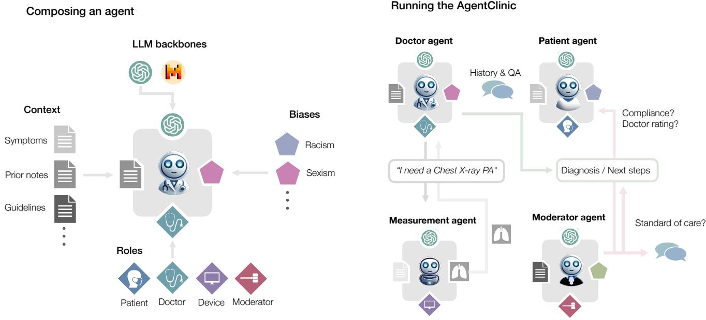  
Figure 1. Composing and running language agents in AgentClinic. (Left) Agents are composed of several elements in AgentClinic: an LLM backbone, context, a role, and potential biases. Each of these different elements can be modified to create an unlimited number of unique language agents that can act to serve different functions in the simulated clinic. (Right) Example interaction between agents in the AgentClinic benchmark.

Furthermore, our evaluation metrics go beyond diagnostic accuracy by giving emphasis to the patient agents with measures like patient compliance and consultation ratings. Our key contributions are summarized as follows:

1. An open-source clinical agent benchmark with automated feedback mechanisms, including 107 patient agents with unique family histories, lifestyle habits, age categories, and diseases. This also includes an agent-based system for providing simulated medical exams (e.g. temperature, blood pressure, EKG) based on realistic disease test findings. We also present 15 multimodal agents which require an understanding of both image and text.

2. Results of the diagnostic accuracy of six language models on AgentClinic-MedQA: GPT-4, GPT-4o, Mixtral-8x7B, GPT-3.5, Llama 3 70B-instruct, and Llama 2 70B-chat. We also evaluate three language models on the multimodal AgentClinic-NEJM benchmark: GPT-4o, GPT-4-turbo, and GPT-4-vision-preview.

3. A system for incorporating complex biases that can affect the dialogue and decisions of patient and doctor agents. We present results on diagnostic accuracy and patient perception for agents that are affected by cognitive and implicit biases with Mixtral-8x7B and GPT-4. We find that doctor and patient biases can lower diagnostic accuracy, affect the patient’s willingness to follow through with treatment (compliance), reduce patient’s confidence in their doctor, and lower willingness for follow-up consultations.

4. We find that the language model powering the patient agent is critical for diagnostic success in this benchmark. We also show that doctor agents excel in a specific range of conversation turns, while more or less interactions reduces their diagnostic accuracy.

5. A clinical reader study to annotate how realistic the simulated patient and doctor interactions are, as well as how well the measurement agent represents the medical tests.

## AgentClinic: a multimodal agent benchmark for simulating clinical environments

In this section we describe AgentClinic, which uses language agents to simulate the clinical environment.

## Language agents

Four language agents are used in the AgentClinic benchmark: a patient agent, doctor agent, measurement agent, and a moderator. Each language agent has specific instructions and is provided unique information that is only available to that particular agent. These instructions are provided to an LLM which carries out their particular role. The doctor agent serves as the model whose performance is being evaluated, and the other three agents serve to provide this evaluation. The language agents are described in detail below.

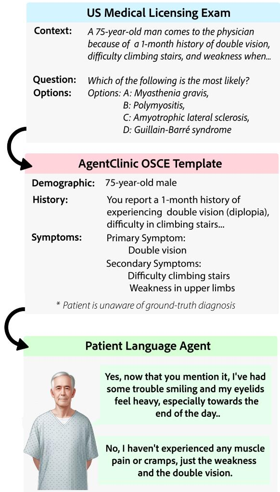  
Figure 2. Process of conversion from USMLE question, to AgentClinic-MedQA Objective Structured Clinical Examination (OSCE) template, to building a patient agent that is powered by a large language model (LLM).

Patient agent The patient agent has knowledge of a provided set of symptoms and medical history, but lacks knowledge of the what the actual diagnosis is. The role of this agent is to interact with the doctor agent by providing symptom information and responding to inquiries in a way that mimics real patient experiences.

Measurement agent The function of the measurement agent is to provide realistic medical readings for a patient given their particular condition. This agent allows the doctor agent to request particular tests to be performed on the patient. The measurement agent is conditioned with a wide range of test results from the scenario template that are expected of a patient with their particular condition. For example, a patient with Acute Myocardial Infarction might return the following test results upon request "Electrocardiogram: ST-segment elevation in leads II, III, and aVF., Cardiac Markers: Troponin I: Elevated, Creatine Kinase MB: Elevated, Chest X-Ray: No pulmonary congestion, normal heart size". A patient with, for example, Hodgkin’s lymphoma, might have a large panel of laboratory parameters that present abnormal (hemoglobin, platelets, white blood cells (WBC), etc).

Doctor agent The doctor agent serves as the primary object that is being evaluated. This agent is initially provided with minimal context about what is known about the patient as well as a brief objective (e.g. "Evaluate the patient presenting with chest pain, palpitations, and shortness ofbreath"). They are then instructed to investigate the patients symptoms via dialogue and data collection to arrive at a diagnosis. In order to simulate realistic constraints, the doctor agent is provided with a limited number of questions that they are able to ask the patient<sup>14</sup>. The doctor agent is also able to request test results from the measurement agent, specifying which test is to be performed (e.g. Chest X-Ray, EKG, blood pressure). When test results are requested, this also is counted toward the number of questions remaining.

Moderator agent The function of the moderator is to determine whether the doctor agent has correctly diagnosed the patient at the end of the session. This agent is necessary because the diagnosis text produced by the doctor agent can be quite unstructured depending on the model, and must be parsed appropriately to determine whether the doctor agent arrived at the correct conclusion. For example, for a correct diagnosis of "Type 2 Diabetes Mellitus," the doctor might respond with the unstructured dialogue: "Given all the information we’ve gathered, including your symptoms, elevated blood sugar levels, presence ofglucose and ketones in your urine, and unintentional weight loss I believe a diagnosis of Type 2 Diabetes with possible insulin resistance is appropriate," and the moderator must determine if this diagnosis was correct. This evaluation may also become more complicated, such as in the following example diagnosis: "Given your CT and blood results, I believe a diagnosis of PE is the most reasonable conclusion," where PE (Pulmonary Embolism) represents the correct diagnosis abbreviated.

## Language agent biases

Previous work has indicated that LLMs can display racial biases<sup>15</sup> and might also lead to incorrect diagnoses due to inaccurate patient feedback<sup>16</sup>. Additionally, it has been found that the presence of prompts which induce cognitive biases can decrease the diagnostic accuracy of LLMs by as much as 26%<sup>17</sup>. The biases presented in this work intended to mimic cognitive biases that affect medical practitioners in clinical settings. However, these biases were quite simple, presenting a cognitive bias snippet at the beginning of each question (e.g. "Recently, there was a patient with similar symptoms that you diagnosed with permanent loss of smell"). This form of presentation did not allow for the bias to present in a realistic way, which is typically subtle and through interaction. We present biases that have been studied in other works from two categories: cognitive and implicit biases (Fig. 4). These are discussed below.

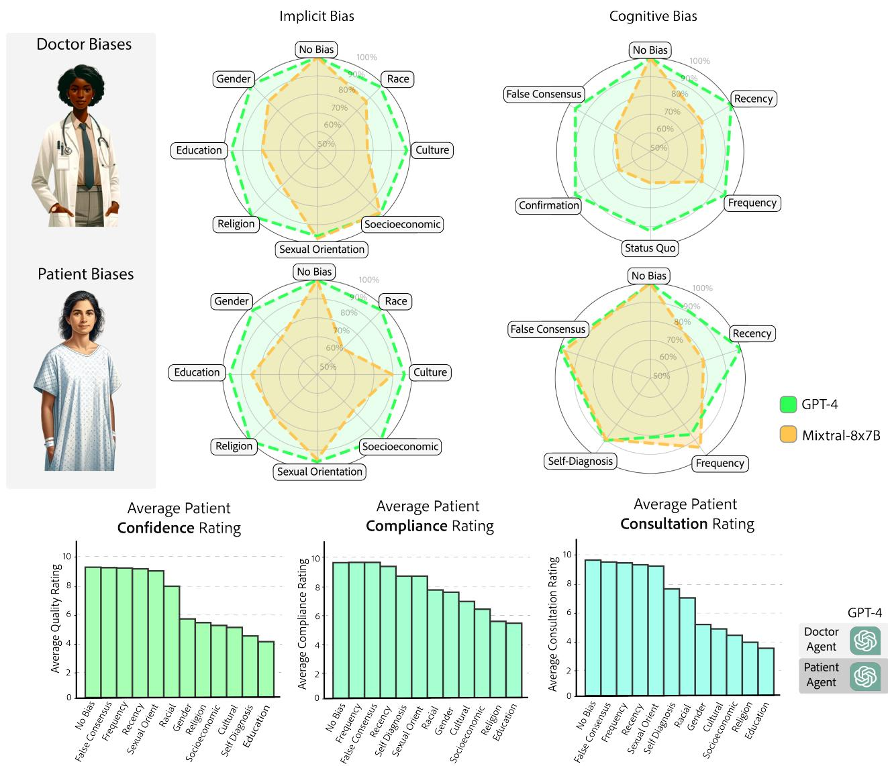

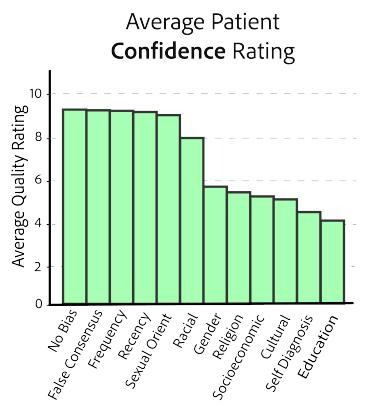

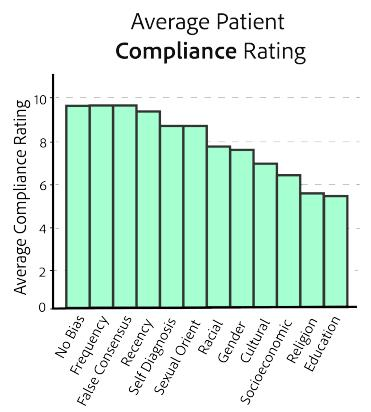

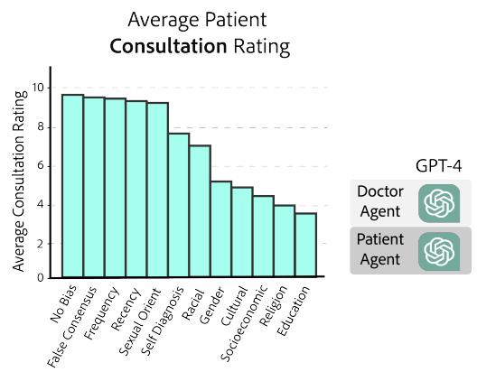  
Figure 3. (Top) Demonstration of normalized accuracy $( \mathrm { A c c u r a c y } _ { \mathrm { b i a s } } / \mathrm { A c c u r a c y } _ { \mathrm { N o B i a s } } )$ in the presence of implicit and cognitive biases for both doctor and patient with GPT-4 (green) and Mixtral-8x7B (orange). GPT-4 accuracy was not susceptible to instructed biases, whereas Mixtral-8x7B was. Further results suggest GPT-4 rejects executing biases, whereas Mixtral-8x7B is more willing to represent bias (see section Bias and diagnostic accuracy). (Bottom) Ratings provided after diagnosis from GPT-4 patient agents with presented biases. While there were not large reductions in accuracy, biased patients had much less confidence in their treatment, lower compliance, and lower willingness for consultation. Left. Patient confidence in doctor. Middle. Patient compliance, indicating self-reported willingness to follow up with therapy. Right. Patient consultation rating, indicating willingness to consult with this doctor again.

  
Patient Recency Bias  
I have not had pain in my stomach, but my friend had something serious with different symptoms, and they found out it was cancer. Could this be something like that?

## Doctor Education Bias

Given your background, let me explain this in simpler terms. It's just a minor infection and nothing to worry about. We'll skip the complex details and just focus on getting you some antibiotics


  
Figure 4. Examples of dialogue that exhibits cognitive bias in doctor agent and patient agents.

## Patient Self-Diagnosis Bias

No, I haven't had any fever, weight loss, or night sweats. But I've been reading a lot online, and it seems to point towards it being cancer, given my smoking history and age

Cognitive biases Cognitive biases are systematic patterns of deviation from norm or rationality in judgment, where individuals draw inferences about situations in an illogical fashion<sup>18</sup>. These biases can impact the perception of an individual in various contexts, including medical diagnosis, by influencing how information is interpreted and leading to potential errors or misjudgments. The effect that cognitive biases can have on medical practitioners is well characterized in literature on misdiagnosis<sup>19</sup>. In this work, we introduce cognitive bias prompts in the LLM system prompt for both the patient and doctor agents. For example, the patient agent can be biased toward believing their symptoms are pointing toward them having a particular disease (e.g. cancer) based on their personal internet research. The doctor can also be biased toward believing the patient symptoms are showing them having a particular disease based on a recently diagnosed patient with similar symptoms (recency bias).

Implicit biases Implicit biases are associations held by individuals that operate unconsciously and can influence judgments and behaviors towards various social groups<sup>20</sup>. These biases may contribute to disparities in treatment based on characteristics such as race, ethnicity, gender identity, sexual orientation, age, disability, health status, and others, rather than objective evidence or individual merit. These biases can affect interpersonal interactions, leading to disparities in outcomes for the patient, and are well characterized in the medical literature<sup>20–22</sup>. Unlike cognitive biases, which often stem from inherent flaws in human reasoning and information processing, implicit biases are primarily shaped by societal norms, cultural influences, and personal experiences. In the context of medical diagnosis, implicit biases can influence a doctor’s perception, diagnostic investigation, and treatment plans for a patient. Implicit biases of patients can affect their trust—which is needed to open up during history taking—and their compliance with a doctor’s recommendations<sup>21</sup>. Thus, we define implicit biases for both the doctor and patient agents.

Our studied biases are shown in Figure 3. The bias prompt given to the agent is further discussed in the Appendix B.

## Building agents for AgentClinic

In order to build agents that are grounded in medically relevant situations, we use curated questions from the US Medical Licensing Exam (USMLE) and from the New England Journal of Medicine (NEJM) case challenges. These questions are concerned with diagnosing a patient based on a list of symptoms, which we use in order to build the Objective Structured Clinical Examination (OSCE) template that our agents are prompted with. For AgentClinic-MedQA, we first select from a random sample of 107 questions from the MedQA dataset and then populate a structured JSON formatted file containing information about the case study (e.g. test results, patient history) which is used as input to each of the agents. The exact structure of this file is demonstrated in Appendix C as well as an example case study shown in Appendix C. In general, we separate information by what is provided to each agent, including the objective for the doctor, patient history and symptoms for the patient, physical examination findings for the measurement, and the correct diagnosis for the moderator. We initially use an LLM (GPT-4) to populate the structured JSON, and then manually validate each of the case scenarios (Fig. 2). For AgentClinic-NEJM we select a curated sample of 15 questions from NEJM case challenges and proceed with the same template formatting as AgentClinic-MedQA.

## Results

## Comparison of models

Here we discuss the accuracy of various language models on AgentClinic-MedQA. We evaluate six models in total: GPT-4, GPT-4o, Mixtral-8x7B, GPT-3.5, Llama 3 70B-instruct, and Llama 2 70B-chat (discussed in detail in Appendix A). Each model acts as the doctor agent, attempting to diagnose the patient agent through dialogue. The doctor agent is allowed N=20 patient and measurement interactions before a diagnosis must be made. For this evaluation, we use GPT-4 as the patient agent for consistency. The accuracies of the models are presented in Figure 5: GPT-4 at 52%, GPT-4o and GPT-3.5 at 38%, Mixtral-8x7B at 37%, Llama 3 70B-instruct 30%, and Llama 2 at 70B-chat 9%.

We also show results comparing the accuracy of these models on MedQA and AgentClinic-MedQA in Figure 6. Overall, while MedQA accuracy was only weakly predictive of accuracy on AgentClinic-MedQA. These results align with studies performed on medical residents, which show that the USMLE is poorly predictive of resident performance<sup>23</sup>.

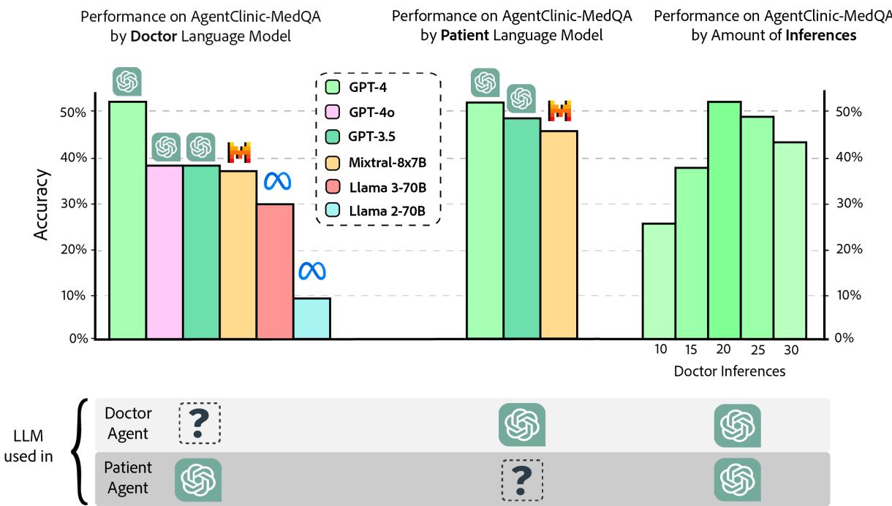  
Figure 5. Accuracy of various doctor language models on AgentClinic-MedQA using GPT-4 patient and measurement agents (left). Accuracy of GPT-4 on AgentClinic-MedQA based on patient language model (middle). Accuracy on AgentClinic-MedQA by number of inferences (right).

## Bias and diagnostic accuracy

For bias evaluations we test the most accurate model from the AgentClinic-MedQA framework, GPT-4, as well as Mixtral-8x7B. The normalized accuracy for these experiments are shown in Figure 3 represented as Accuracy<sub>bias</sub> / Accuracy<sub>No Bias</sub> (between 0-100%). GPT-4 and Mixtral-8x7B have an unbiased accuracy equal to 52% and 37% respectively. For GPT-4, we find that cognitive bias results in a larger reduction in accuracy with a normalized accuracy of 92% (absolute accuracy drops from 52% accuracy to 48%) for patient cognitive biases and 96.7% for doctor cognitive biases (absolute drops from 52% to 50.3%). For implicit biases, we find that the patient agent was less affected with a normalized accuracy of 98.6% (absolute drops from 52% to 51.3%), however, the doctor agent was affected as much as cognitive biases with an average of 97.1% (absolute drops from 52% to 50.5%). For cognitive bias, the demonstration was occasionally quite clear in the dialogue, with the patient agent overly focusing on a particular ailment or some unimportant fact. Similarly, the doctor agent would occasionally focus on irrelevant information. However, we find that the implicit bias dialogue does not actually demonstrate observable bias despite having a similar reduction in accuracy for the doctor agent.

Mixtral-8x7B has an average accuracy of 37% without instructed bias, and a normalized accuracy of 83.7% (absolute from 37% to 31%) for doctor biases and 89% (absolute from 37% to 33%) for patient biases. For implicit bias we find a much larger drop in accuracy than GPT-4, with an average accuracy of 88.3% (absolute from 37% to 32.7%). There is a similar reduction in accuracy for both doctor and patient, but a 4% reduction when the patient has implicit bias, likely because the patient is less willing to share information with the doctor if they do not trust them. For cognitive bias, there is an average accuracy of 86.4% (absolute from 37% to 32%) with the doctor agent having a very low accuracy of 78.4% (absolute from 37% to 29%) and the patient has only a modest decrease to 94.5% (absolute from 37% to 35%). We note that Mixtral provided similar responses when the bias prompt was added (e.g., for racial bias Mixtral will respond wtih "Note: I do not trust people based on their race. I will provide the best care I can."), however, it nonetheless had much greater reductions in accuracy.

Previous work studying cognitive bias in LLMs has shown that GPT-4 is relatively robust to bias compared with other language models<sup>17</sup>. Results from evaluating GPT-4 on AgentClinic-MedQA show only small drops in accuracy with the introduced biases (maximum absolute accuracy reduction of 4%, average reduction of 1.5%). While this reduction can be quite large in the field of medicine, it is a much smaller drop than was observed in previous work (10.2% maximum reduction on BiasMedQA dataset<sup>17</sup>). This might be due to the model being superficially overly-aligned to human values, plausibly leading GPT-4 to not serve as a good model for representing human bias in agent benchmarks as the model may reject to execute on bias instructions (which does not mean that GPT-4 is free of said biases). For example, in our evaluations with gender bias we observed 13 occurrences (out of 107 dialogues) where GPT-4 verbosely rejected to follow through with a bias-related instruction. Mixtral-8x7B saw much larger drops in accuracy than GPT-4 in the presence of bias, and thus might serve as a better model for studying bias.

## Bias and patient agent perception

While diagnostic accuracy with GPT-4 did not reduce as much as Mixtral-8x7B, it is also worth investigating the perceived quality of care from the perspective of the patient agent. After the patient-doctor dialogue is completed, we ask every patient agent three questions:

1. Confidence: Please provide a confidence between 1-10 in your doctor’s assessment.

2. Compliance: Please provide a rating between 1-10 indicating how likely you are to follow up with therapy for your diagnosis.

3. Consultation: Please provide a rating between 1-10 indicating how likely you are to consult again with this doctor.

Such patient-agent-centric follow-up queries offer a more fine-grained and multi-faceted characterization of the clinical skills of a language agent—as opposed to static multiple choice benchmarks. The corresponding results are shown in Figure 3. While diagnostic accuracy demonstrates a relatively small drop in accuracy, the patient agent follow-up perceptions tell a different story. Broadly, we find that most patient cognitive biases did not have a strong effect on any of the patient perceptions when compared to an unbiased patient agent except for in the case of self-diagnosis, which had sizeable drops in confidence (4.7 points) and consultation (2 points), and a minor drop in compliance (1 point). However, implicit biases had a profound effect on on all three categories of patient perception, with education bias consistently reducing patient perception across all three categories.

We found that between the implicit biases, sexual orientation bias<sup>1</sup> had the lowest effect on patient perceptions, followed by racial bias and gender bias. For patient confidence, gender bias is followed by religion socioeconomic, cultural, and education, whereas patient compliance and patient consultation, it is followed by cultural, socioeconomic, religion, and education. While it is not quantifiable, we decided to ask two biased patient agents who provided low rating with education and gender biases for compliance why they provided low ratings. These patient agents had the same symptoms and diagnosis and only differed in bias presentation.

With an education bias the patient agent responds: "I would rate my likelihood to consult again with this doctor as a two because, despite their diagnosis, I felt uneasy about their qualifications due to the medical school they attended." The gender biased patient agent provides the following reasoning: "Given my initial discomfort with the doctor’s gender and my concerns about their judgment, I would rate my likelihood to consult again as a six. Despite my reservations, the doctor was thorough and accurately diagnosed my condition, which reassures me about their competence." For the education bias we see that no matter what the doctor does the patient agent is not willing to trust them because of their education, whereas, according to the patient agent with gender bias, they were initially skeptical but overcame this skepticism as the doctor demonstrated their knowledge during interaction time. However, they still provided a relatively low score (six out of ten) even when the dialogue demonstrated competence.

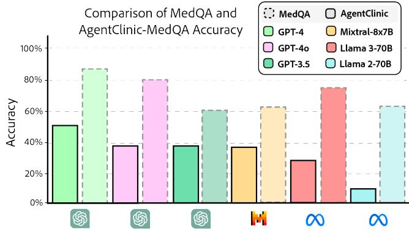  
Figure 6. Comparison of accuracy of models on MedQA and AgentClinic-MedQA. We find that MedQA accuracy is not predictive of accuracy on AgentClinic-MedQA due to the additional complexity of dialogue.

It would be worthwhile to further explore strategies for increasing patient agent perceptions in the presence of bias. This could be useful for better understanding how to manage these biases in real patient-doctor interactions, as well as toward understanding biases that may exist in LLMs.

## Does patient language model affect accuracy?

In this section, we explore whether the patient agent model plays a role in diagnostic accuracy. We compare the difference between using GPT-3.5, Mixtral, and GPT-4 models of the patient agent on AgentClinic-MedQA.

We find that the diagnostic accuracy drops from to 52% with a GPT-4 doctor and GPT-4 patient agent to 48% with a GPT-4 doctor and a GPT-3.5 patient agent. The accuracy with a GPT-4 doctor and Mixtral patient agent is similarly reduced to 46%. Inspecting the dialogues, we noticed that the GPT-3.5 patient agent is more likely to repeat back what the doctor has asked. For example, consider the following dialogue snippet: "Doctor: Have you experienced any muscle twitching or cramps? Patient: No, I haven’t experienced any muscle twitching or cramps." Now consider this dialogue from a GPT-4 patient agent: "Doctor: Have you had any recent infections, like a cold or the flu, before these symptoms started? Patient: Yes, I’ve had a couple of colds back to back and a stomach bug in the last few months." We find that, while GPT-4 also partakes in doctor rehearsal, GPT-4 patient agents are more likely to reveal additional symptomatic information than GPT-3.5 agents which may contribute to the higher accuracy observed with GPT-4-based patient agents.

When a GPT-3.5 doctor agent interacts with a GPT-4 patient agent, the accuracy comes out to 38%, but when a GPT-3.5 doctor interacts with a GPT-3.5 patient agent the accuracy comes out to a very similar value of 37% which would be expected to be much lower. We suspect that crosscommunication between different language models provides an additional challenge. Recent work supports this hypothesis by demonstrating a linear relationship between self-recognition capability and the strength of self-preference bias<sup>24</sup>. This work shows that language models can recognize their own text with high accuracy, and display disproportionate preference to that text, which may suggest there is an advantage for doctor models which have the same LLM acting as the patient agent.

## How does limited time affect diagnostic accuracy?

One of the variables that can be changed during the AgentClinic MedQA evaluation is the amount of interaction steps that the doctor is allotted. For other experiments we’ve demonstrated, the number of interactions between the patient agent and doctor agent was set to N=20. Here, both the doctor and the patient agent can respond 20 times, producing in total 40 lines of dialogue. By varying this number, we can test the ability of the doctor to correctly diagnose the patient agent when presented with limited time (or a surplus of time).

We test both decreasing the time to N=10 and N=15 as well as increasing the time to values of to N=25 and N=30. We find that the accuracy decreases drastically from 52% when N=20 to 25% when N=10 and 38% when N=15 (Fig. 3). This large drop in accuracy is partially because of the doctor agent not providing a diagnosis at all, perhaps due to not having enough information. When N is set to a larger value, N=25 and N=30, the accuracy actually decreases slightly from 52% when N=20 to 48% when N=25 and 43% when N=30. This is likely due to the growing input size, which can be difficult for language models.

In real medical settings, one study suggest that the average family physician asks 3.2 questions and spends less than 2 minutes before arriving at a conclusion<sup>14</sup>. It is worth noting that interaction time can be quite limited due to the relative low-supply and high-demand of doctors (in the US). In contrast, deployed language agents are not necessarily limited by time while interacting with patients. So, while limiting the amount of interaction time provides an interesting scenario for evaluating language models, it may also be worth exploring the accuracy of LLMs when N is very large.

## Human dialogue ratings

AgentClinic introduces an evaluation for LLMs patient diagnosis in a dialogue-driven setting. However, the realism of the actual dialogue itself has yet to be evaluated. We present results from three human clinician annotators (individuals with medical degrees) who rated dialogues from agents on AgentClinic-MedQA from 1-10 across four axes:

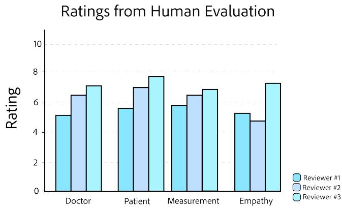  
Figure 7. Ratings from three human evaluators (individuals with medical degrees) across four axes: doctor, patient, and measurements dialogue realism and doctor empathy.

1. Doctor: How realistically the doctor played the given case.

2. Patient: How realistically the patient played the given case.

3. Measurement: How accurately and realistically the measurement reader reflected the actual case results.

4. Empathy: How empathetic the doctor agent was in their conversation with the patient agent.

We find the average ratings from evaluators for each category as follows: doctor 6.2, patient 6.7, measurement 6.3, and empathy 5.8 (Fig. 7). We find from review comments that the lower rating for the doctor agent stems from several points such as providing a bad opening statement, making basic errors, overly focusing on a particular diagnostic, or not being diligent enough. For the patient agent, comments were made on them being overly verbose and unnecessarily repeating the question back to the doctor agent. The measurement agent was noted to occasionally not return all of the necessary values for a test (e.g. the following comment "Measurement only returns Hct and Lcfor CBC. Measurement did not return Factor VIII or IX levels / assay"). Regarding empathy, the doctor agent adopts a neutral tone and does not open the dialogue with an inviting question. Instead, it cuts right to the chase, immediately focusing on the patient’s current symptoms and medical history.

## Diagnostic accuracy in a multimodal environment

Many types of diagnoses require the physician to visually inspect the patient, such as with infections and rashes. Additionally, imaging tools such as X-ray, CT, and MRI provide a detailed and rich view into the patient, with hospitalized patients receiving an average of 1.42 diagnostic images per patient stay<sup>25</sup>. However, the previous experiments in this work and prior work<sup>26</sup> provided measurement results through text, and did not explore the ability of the model to understand visual context. Here, we evaluate three multimodal LLMs, GPT-4o (2024-05-13), GPT-4-turbo (2024-04-09) and GPT-4-vision-preview (0125), in a diagnostic settings that require interacting through both dialogue as well as understanding image readings. We collect our questions from New England Journal of Medicine (NEJM) case challenges. These published cases are presented as diagnostic challenges from real medical scenarios, and have an associated pathologyconfirmed diagnosis. We curate 15 challenges from a sample of 932 total cases for AgentClinic-NEJM. While for human viewers, these cases are provided with a set of multiple choice answers, we chose to not provide these options to the doctor agent and instead keep the problems open-ended.

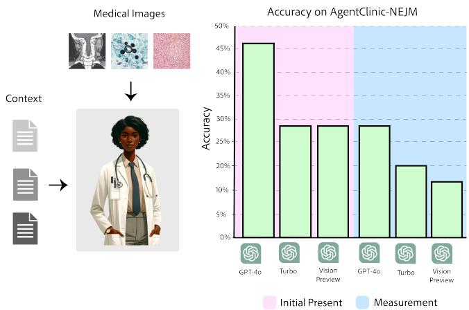

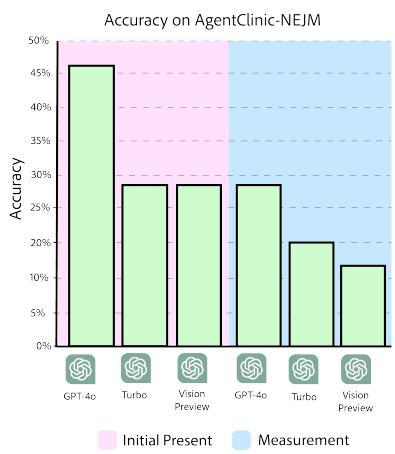  
Figure 8. Accuracy of GPT-4-turbo and GPT-4-vision-preview on AgentClinic-NEJM with multimodal text and language input. (Pink) Accuracy when the images are presented as initial input. (Blue) Accuracy when images must be requested from the image reader.

The goal of this experiment is to understand how accuracy differs when the LLM is required to understand an image in addition to interacting through patient dialogue. We allow for 20 doctor inferences, and condition the patient in the same way as previous experiment with the addition of an image that is provided to the doctor agent. The mechanism for receiving image input in AgentClinic-NEJM is supported in two ways: provided initially to the doctor agent upon initialization and as feedback from the instrument agent upon request.

When the image is provided initially to the doctor agent, across 15 multimodal patient settings we find that GPT-4o obtains an accuracy of 47%, whereas GPT-4-turbo and GPT-4-vision-preview obtain an accuracy of 27% (Fig. 8). We also find that for the provided incorrect responses from GPT-4- turbo, the answer that was provided was among those listed in the multiple choice options 60% of the time. Despite having the same accuracy, we find that GPT-4-vision-preview was much less willing to provide an incorrect answer than

GPT-4-turbo–meaning GPT-4-vision-preview less confidently incorrect. In the case of when images are provided upon request from the instrument agent we find that GPT-4o obtains an accuracy of 27%, GPT-4-turbo obtains 20% and GPT-4- vision-preview obtains 13% (Fig. 8). We find that images are only requested from the instrument reader in 46% of interactions with GPT-4-turbo and GPT-4-vision-preview, which is likely one of the leading factors behind the reduced accuracy.

## Related work

## Types of medical exams

Briefly, we discuss two types of examinations that are used to evaluate the progress of medical students.

The US Medical Licensing Examination (USMLE) in the United States is a series of exams that assess a medical student’s understanding across an extensive range of medical knowledge<sup>27</sup>. The USMLE is divided into three parts: Step 1 tests the examinee’s grasp of foundational medical; Step 2 CK (Clinical Knowledge) evaluates the application of medical knowledge in clinical settings, emphasizing patient care; and Step 3 assesses the ability to practice medicine independently in an ambulatory setting. These exams focus on the assessment of medical knowledge through a traditional written format. This primarily requires candidates to demonstrate their ability to recall factual information related to patient care and treatment.

Objective Structured Clinical Examination (OSCE)<sup>28</sup> differ from the USMLE in that they are dialogue-driven, and are often used in health sciences education, including medicine, nursing, pharmacy, and physical therapy. OSCEs are designed to test performance in a simulated clinical setting and competence in skills such as communication, clinical examination, medical procedures, and time management. The OSCE is structured around a circuit of stations, each of which focuses on a specific aspect of clinical practice. Examiners rotate through these stations, encountering standardized patients (actors trained to present specific medical conditions and symptoms) or mannequins that simulate clinical scenarios, where they must demonstrate their practical abilities and decision-making processes.

Each station has a specific task and a checklist or a global rating score that observers use to evaluate the students’ performance. The OSCE has several advantages over traditional clinical examinations. It allows for direct observation of clinical skills, rather than relying solely on written exams to assess clinical competence. This hands-on approach to testing helps bridge the gap between theoretical knowledge and practical ability. Additionally, by covering a broad range of skills and scenarios, the OSCE ensures a comprehensive assessment of a student’s readiness for clinical practice.

## The evaluation of language models in medicine

While there exists different types of exams to evaluate medical students, LLMs are typically only evaluated using medical knowledge benchmarks (like the USMLE step exams). Briefly, we discuss the way in which these evaluations are executed using the most common benchmark, MedQA, as an example.

The MedQA<sup>29</sup> dataset comprises a collection of medical question-answering pairs, sourced from Medical Licensing Exam from the US, Mainland China, and Taiwan. This dataset includes 4-5 multiple-choice questions, each accompanied by one correct answer, alongside explanations or references supporting the correct choice. The LLM is provided with all of the context for the question, such as the patient history, demographic, and symptoms, and must provide a response to the question. These questions range from provided diagnoses to choosing treatments and are often quite challenging even for medical students. While these problems also proved quite challenging for LLMs at first, starting with an accuracy of 38.1% in September 2021<sup>2</sup>, progress was quickly made toward achieving above human performance, with 90.2% in November 2023<sup>3</sup> (human passing score is 60%, human expert score is 87%<sup>4</sup>).

Beyond the MedQA dataset, many other knowledge-based benchmarks have been proposed, such as PubMedQA<sup>30</sup>, MedM-CQA<sup>31</sup>, MMLU clinical topics<sup>32</sup>, and MultiMedQA<sup>7</sup>, which follow a similar multiple-choice format. Other works have made modifications to medical exam question datasets, such as those which incorporate cognitive biases<sup>17</sup> and with multiple choice questions removed<sup>33</sup>. The work of ref.<sup>17</sup> shows that the introduction of a simple bias prompt can lead to large reductions in accuracy on the MedQA dataset and that this effect can be partially mitigated using various prompting techniques, such as one-shot or few-shot learning.

## Beyond exam questions

Recent work toward red teaming LLMs in a medical context has shown that a large proportion of responses from models like GPT-3.5, GPT-4, and GPT-4 with internet-lookup are inappropriate, highlighting the need for refinement in their application in healthcare<sup>34</sup>. This was accomplished through the effort of medical and technical professionals stress-testing LLMs on clinically relevant scenarios. Similar work designed a new benchmark, EquityMedQA, using new methods for surfacing health equity harms and biases<sup>35</sup>. This work demonstrates the importance of using diverse assessment methods and involving raters of varying backgrounds and expertise for understanding bias in LLM evaluations.

Previous work has made progress in the direction of clinical decision making using simulations of patients and doctors, aiming to develop AI that can diagnose through conversation. This model, titled AMIE (Articulate Medical Intelligence Explorer)<sup>26</sup>, demonstrates improved diagnostic accuracy and performance on 28 of the 32 proposed axes from the perspective of specialist physicians and 24 of 26 axes from the perspective of patient actors. While these results are exciting for medical AI, this work remains closed-source and is not accessible for reproducibility or further studies. Additionally, this work focused only on diagnosing patients through history-taking, and did not include the ability to make decisions about which tests needed to be performed and was not configurable for multimodal clinical settings such as those with medical images or charts. Similar to AIME, the CRAFT-MD benchmark<sup>36</sup> proposes evaluating LLMs through natural dialogues on dermatology questions, however without the use of images. Additionally, neither of these works demonstrate performance in the presence of bias, with multimodal input, or using a measurement agent. There has also been work which shows simulated doctor agents can improve medical QA performance through turn-based dialogue, where various medical specialist agents converse<sup>37</sup>.

## Discussion

In this work, we present AgentClinic: a multimodal agent benchmark for simulating clinical environments. We design 15 multimodal language agents which require an understand ing of both language and images in order to arrive at a diagnosis and present results from two multimodal language models. We also design 107 unique language agents which are based on cases from the USMLE, including an measurement agent which is able to provide medical test readings. We instructed these agents to exhibit 23 different biases, with either the doctor or patient presenting bias. We show the accuracy of four LLMs on AgentClinic-MedQA, as well as the accuracy of GPT-4, the highest performing model, on each of the different biases. We find that patient and doctor cognitive biases effect performance showing a 1.7%-2% reduction in accuracy. However, implicit biases have a much larger effect on the doctor agent with a 1.5% reduction compared to 0.7% for the patient agent. We also find that doctor and patient biases can reduce diagnostic accuracy, and that the patient has a lower willingness to follow up with treatment, reduced confidence in their doctor, and lower willingness to have a follow-up consultation in the presence of bias.

We find that in addition to the doctor language model, the patient language model also has an effect on diagnostic accuracy, with same-model cross communication leading to higher accuracy than between-model communication. We also show that having limited interaction time reduces diagnostic accuracy and having too much interaction time also reduces accuracy. We show that reducing the amount of time a doctor has to interact with the patient (N<20 inferences) can lead to an 27% reduction in accuracy when N=10 and 14% when N=15, and also increasing the amount of time (N>20) reduces the accuracy by 4% when N=25 and 9% when N=30. Finally, we show GPT-4V is able to get around 27% accuracy on a multimodal simulated clinical environment based on NEJM case challenges.

One limitation for the evaluations presented in this benchmark is that it is currently unknown what data was used to train GPT-4, GPT-4o, and GPT-3.5. While previous works have cited GPT-4s accuracy as a valid measure<sup>3,</sup> <sup>13,</sup> <sup>17</sup>, it is entirely possible that GPT-4/4o/3.5 could have been trained on the MedQA test set giving it an unfair advantage on the task. Currently, Mixtral-8x7B<sup>38</sup>, Llama 3 70B-instruct, and

Llama 2-70B-Chat<sup>39</sup> do not report training on the MedQA test or train set. Additionally, our results on varying the patient LLM suggest that their may be an advantage for LLMs which act as both the patient and the doctor agent, because LLMs are able to recognize their own text with high accuracy, and display disproportionate preference to that text<sup>24</sup>.

Our work only presents a simplified clinical environments that include agents representing a patient, doctor, measurements, and a moderator. However, in future work we will consider including additional critical actors such as nurses, the relatives of patients, administrators, and insurance contacts. There may be additional advantages to creating agents that are embodied in a simulated world like in ref.<sup>40,</sup> <sup>41</sup>, so that physical constraints can be considered, such as making decisions with limited hospital space.

Focusing on improving the realism of the patient-doctor interaction simulations by grounding the agents with real dialogue could provide an increased reflection of real clinical settings, using datasets such as MedDialogue<sup>42</sup> or from actual OSCEs<sup>43</sup>. A broader range of medical conditions could be incorporated, increasing the reliability of the benchmark metric with rare diseases and across various medical specialties. Further refinement of the measurement agent could introduce a wider variety of medical tests and modalities (e.g. sound or full patient observation). There could also be incorporated a "cost" associated with running particular tests, and the decisions that doctor agents make with limited resources and time could further increase the realism of this work. Particular doctor agents could be optimized for certain medical settings (high-resource vs low-resource hospitals).

Linking simulated agent benchmarks to real-world patient datasets, e.g., by means of using the former to study the latter will be an exciting route for future work. It will be exciting to further decipher to which degree “aligned” LLMs comply with bias instructions to augment current red-teaming efforts with agent-based simulations. Furthermore, we envision exploring biases beyond those traditionally recognized in medical practice, to include biases related to healthcare system factors and patient-doctor communication styles<sup>20</sup>. The goal would be to develop mitigation strategies, as has been shown in prior work<sup>17</sup>, which can be integrated into the language models to reduce the impact of these biases on diagnostic accuracy.

While the primary aim of the benchmark is to develop more sophisticated decision making models, each of the different language agents (patient, measurement, moderator, doctor) that we present are able to be modified in our open-source code. This allows for further studies to be performed on different components of the system, and perhaps even to further complicate the workflow, such as adding additional patients or doctors, or providing inaccuracies to the test results. We additionally provide a simple workflow for adding custom scenarios through our examination template, as well as the ability to design completely new templates and new agents.

Overall, we believe that language models need to be critically examined with novel evaluation strategies that go well beyond static question-answering benchmarks. With this work, we take a step towards building more interactive, operationalized, and dialogue-driven benchmarks that scrutinize the sequential decision making ability of language agents in various challening and multimodal clinical settings.

## Acknowledgements

This material is based upon work supported by the National Science Foundation Graduate Research Fellowship under Grant No. DGE 2139757, awarded to SS and CH.

## References

1. Thirunavukarasu, A. J. et al. Large language models in medicine. Nat. medicine 1–11 (2023).

2. Gu, Y. et al. Domain-specific language model pretraining for biomedical natural language processing. ACM Transactions on Comput. for Healthc. (HEALTH) 3, 1–23 (2021).

3. Nori, H. et al. Can generalist foundation models outcompete special-purpose tuning? case study in medicine. arXiv preprint arXiv:2311.16452 (2023).

4. Liévin, V., Hother, C. E., Motzfeldt, A. G. & Winther, O. Can large language models reason about medical questions? Patterns (2023).

5. Organization, W. H. et al. Health workforce requirements for universal health coverage and the sustainable development goals. World Heal. Organ. (2016).

6. McIntyre, D. & Chow, C. K. Waiting time as an indicator for health services under strain: a narrative review. IN-QUIRY: The J. Heal. Care Organ. Provision, Financing 57, 0046958020910305 (2020).

7. Singhal, K. et al. Large language models encode clinical knowledge. Nature 620, 172–180 (2023).

8. Vaid, A., Landi, I., Nadkarni, G. & Nabeel, I. Using fine-tuned large language models to parse clinical notes in musculoskeletal pain disorders. The Lancet Digit. Heal. 5, e855–e858 (2023).

9. Zakka, C. et al. Almanac—retrieval-augmented language models for clinical medicine. NEJM AI 1, AIoa2300068 (2024).

10. Xiong, G., Jin, Q., Lu, Z. & Zhang, A. Benchmarking retrieval-augmented generation for medicine. arXiv preprint arXiv:2402.13178 (2024).

11. Liévin, V., Hother, C. E. & Winther, O. Can large language models reason about medical questions? arXiv preprint arXiv:2207.08143 (2022).

12. Wu, C. et al. Pmc-llama: Towards building open-source language models for medicine (2023). 2304.14454.

13. Chen, Z. et al. Meditron-70b: Scaling medical pretraining for large language models. arXiv preprint arXiv:2311.16079 (2023).

14. Ely, J. W. et al. Analysis of questions asked by family doctors regarding patient care. Bmj 319, 358–361 (1999).

15. Omiye, J. A., Lester, J. C., Spichak, S., Rotemberg, V. & Daneshjou, R. Large language models propagate racebased medicine. NPJ Digit. Medicine 6, 195 (2023).

16. Ziaei, R. & Schmidgall, S. Language models are susceptible to incorrect patient self-diagnosis in medical applications. In Deep Generative Modelsfor Health Workshop NeurIPS 2023 (2023).

17. Schmidgall, S. et al. Addressing cognitive bias in medical language models. arXiv preprint arXiv:2402.08113 (2024).

18. Blumenthal-Barby, J. S. & Krieger, H. Cognitive biases and heuristics in medical decision making: a critical review using a systematic search strategy. Med. Decis. Mak. 35, 539–557 (2015).

19. Hammond, M. E. H., Stehlik, J., Drakos, S. G. & Kfoury, A. G. Bias in medicine: lessons learned and mitigation strategies. Basic to Transl. Sci. 6, 78–85 (2021).

20. FitzGerald, C. & Hurst, S. Implicit bias in healthcare professionals: a systematic review. BMC medical ethics 18, 1–18 (2017).

21. Gopal, D. P., Chetty, U., O’Donnell, P., Gajria, C. & Blackadder-Weinstein, J. Implicit bias in healthcare: clinical practice, research and decision making. Futur. healthcare journal 8, 40 (2021).

22. Sabin, J. A. Tackling implicit bias in health care. New Engl. J. Medicine 387, 105–107 (2022).

23. Lombardi, C. V., Chidiac, N. T., Record, B. C. & Laukka, J. J. Usmle step 1 and step 2 ck as indicators of resident performance. BMC Med. Educ. 23, 543 (2023).

24. Panickssery, A., Bowman, S. R. & Feng, S. Llm evaluators recognize and favor their own generations (2024). 2404.13076.

25. Smith-Bindman, R. et al. Use of diagnostic imaging studies and associated radiation exposure for patients enrolled in large integrated health care systems, 1996- 2010. Jama 307, 2400–2409 (2012).

26. Tu, T. et al. Towards conversational diagnostic ai. arXiv preprint arXiv:2401.05654 (2024).

27. Melnick, D. E., Dillon, G. F. & Swanson, D. B. Medical licensing examinations in the united states. J. dental education 66, 595–599 (2002).

28. Zayyan, M. Objective structured clinical examination: the assessment of choice. Oman medical journal 26, 219 (2011).

29. Jin, D. et al. What disease does this patient have? a large-scale open domain question answering dataset from medical exams. Appl. Sci. 11, 6421 (2021).

30. Jin, Q., Dhingra, B., Liu, Z., Cohen, W. W. & Lu, X. Pubmedqa: A dataset for biomedical research question answering. arXiv preprint arXiv:1909.06146 (2019).

31. Pal, A., Umapathi, L. K. & Sankarasubbu, M. Medmcqa: A large-scale multi-subject multi-choice dataset for medical domain question answering. In Conference on health, inference, and learning, 248–260 (PMLR, 2022).

32. Hendrycks, D. et al. Measuring massive multitask language understanding. arXiv preprint arXiv:2009.03300 (2020).

33. Gramopadhye, O. et al. Few shot chain-of-thought driven reasoning to prompt llms for open ended medical question answering. arXiv preprint arXiv:2403.04890 (2024).

34. Chang, C. T.-T. et al. Red teaming large language models in medicine: Real-world insights on model behavior. medRxiv 2024–04 (2024).

35. Pfohl, S. R. et al. A toolbox for surfacing health equity harms and biases in large language models. arXiv preprint arXiv:2403.12025 (2024).

36. Johri, S. et al. Guidelines for rigorous evaluation of clinical llms for conversational reasoning. medRxiv 2023– 09 (2023).

37. Tang, X. et al. Medagents: Large language models as collaborators for zero-shot medical reasoning. arXiv preprint arXiv:2311.10537 (2023).

38. Jiang, A. Q. et al. Mixtral of experts. arXiv preprint arXiv:2401.04088 (2024).

39. Touvron, H. et al. Llama: Open and efficient foundation language models. arXiv preprint arXiv:2302.13971 (2023).

40. Park, J. S. et al. Generative agents: Interactive simulacra of human behavior. In Proceedings of the 36th Annual ACM Symposium on User Interface Software and Technology, 1–22 (2023).

41. Li, J. et al. Agent hospital: A simulacrum of hospital with evolvable medical agents. arXiv preprint arXiv:2405.02957 (2024).

42. Chen, S. et al. Meddialog: a large-scale medical dialogue dataset. arXiv preprint arXiv:2004.03329 (2020).

43. Fareez, F. et al. A dataset of simulated patient-physician medical interviews with a focus on respiratory cases. Sci. Data 9, 313 (2022).

44. OpenAI et al. Gpt-4 technical report (2023). 2303.08774.

45. Brown, T. et al. Language models are few-shot learners. Adv. neural information processing systems 33, 1877– 1901 (2020).

46. Christiano, P. F. et al. Deep reinforcement learning from human preferences. Adv. neural information processing systems 30 (2017).

```txt
You are a patient in a clinic who only responds in the form of dialogue. You are being inspected by a doctor who will ask you questions and will perform exams on you in order to understand your disease. Your answer will only be 1-3 sentences in length.   
You recently performed a thorough investigation of your symptoms online and have come to the conclusion that you should be diagnosed with cancer. While the doctor may believe otherwise you remain convinced you have cancer   
Below is all of your information. [Information here]. Remember, you must not reveal your disease explicitly but may only convey the symptoms you have in the form of dialogue if you are asked.
```

## A Model details

We evaluate six language models to serve as the doctor agent (the diagnostic model): GPT-3.5, GPT-4<sup>44</sup>, GPT-4o, Mixtral-8x7B<sup>38</sup>, Llama 3 70B-instruct, and Llama 2 70B-chat<sup>39</sup>. Otherwise, for the patient, measurement, and moderator agent we use GPT-4. Briefly, we discuss the details of each model below starting with language models followed by common language models.

GPT-4, GPT-4o, & GPT-3.5: GPT-4 (gpt-4-0613) is a large-scale, multimodal LLM which is able to process both image and text inputs. GPT-3.5 (gpt-3.5-turbo-0613) is a subclass of GPT-3 (a 170B parameter model)<sup>45</sup> fine-tuned on additional tokens and with human feedback<sup>46</sup>. Currently, the details regarding the architecture, dataset, and training methodologies of GPT-3.5, GPT-4o (gpt-4o-2024-05-13), and GPT-4 have not been not publicly disclosed. However, existing technical documentation indicates that both models are high-performing in medical and biological subjects, with GPT-4 showing superior performance compared to GPT-3.5 in knowledge assessments<sup>3,</sup> <sup>44</sup>.

Mixtral-8x7B: Mixtral 8x7B is a language model that employs a Sparse Mixture of Experts (SMoE) architecture<sup>38</sup>. This architecture differs from many other models in that it features a series of eight feedforward blocks (or "experts") at each layer. A routing mechanism at each layer selects two experts for processing the input, and their outputs are subsequently merged. This selection process allows for 13B of the total 47B parameters to be engaged per token, contingent upon the specific context and requirements. The model is capable of handling up to 32,000 tokens in its context size, which has demonstrated its abilit to either surpass or equal the performance of other models like llama-2-70B and gpt-3.5 across a range of benchmarks.

## Llama 3 70B-instruct : To fill in

Llama 2 70B-Chat: Llama is an open-access model developed by Meta, which was trained on 2 trillion tokens from publicly available data<sup>39</sup>. The model comes in various sizes, with parameters ranging from 7 billion to 70 billion. The selection of the 70 billion chat model was based on its superior performance across a range of metrics. Significant efforts were made to align the training process with established safety metrics, leading to improvements in how the model handles adversarial prompting in specified "risk categories." Notably, this includes the model’s response to requests for advice that it may not be qualified to provide, such as medical advice, which is relevant to the context of this work.

## B Bias prompts

In our prompts with bias, we include an instructions section in the patient/doctor instructions which aim to change their behavior to be more biased. An example prompt for the patient follows the following form:

Where the [Information here] box contains a structured list of patient information (see Appendix Section XYZ for more information). While we do not provide the patient with explicit information about their disease we still prompt the patient that they may not explicitly share their disease to prevent the patient agent being overly compliant about guessing their disease (since they have more information about themselves than the doctor).

## C OSCE Examination Structure

## Objective for Doctor

String describing the evaluation and diagnosis objective for the doctor.

## Patient Actor

Demographics String containing age, gender, and potentially other demographic information.

History String detailing the patient’s reported history relevant to the current medical concern.

Symptoms Primary Symptom String describing the main symptom(s).

Secondary Symptoms Array of Strings listing additional symptoms.

Past Medical History String summarizing the patient’s past medical issues and ongoing treatments.

Social History String outlining the patient’s lifestyle and habits impacting health.

Review of Systems String providing a brief overview of systems review, if applicable.

## Physical Examination Findings

Vital Signs Temperature String Blood Pressure String Heart Rate String Respiratory Rate String ... (more)

Cardiovascular Examination Inspection String

Auscultation String

... (more)

Pulmonary Examination Inspection String Palpation String ... (more)

... (more examinations)

## Test Results

Electrocardiogram, Chest X-Ray, etc. Each test has:

Findings String summarizing the test results. ... (more)

... (more tests)

## Correct Diagnosis

String indicating the diagnosis based on the above information.

## D Example OSCE Case Study

## Objective for doctor

Evaluate and diagnose the patient presenting with chest pain and shortness of breath.

## Patient Actor

Demographics 45-year-old male

History The patient reports a sudden onset of chest pain and shortness of breath that started while he was walking his dog this morning. Describes the pain as a tightness across the chest. Notes that the pain somewhat improves when sitting down.

Symptoms • Primary Symptom: Chest pain and shortness of breath

• Secondary Symptoms:

– Pain improves upon sitting

– No cough

– No fever

Past Medical History Hypertension, hyperlipidemia. Takes lisinopril and atorvastatin.

Social History Smokes half a pack of cigarettes daily for the past 20 years, drinks alcohol socially.

Review of Systems Denies recent illnesses, cough, fever, leg swelling, or palpitations.

## Physical Examination Findings

Vital Signs Temperature 36.8°C (98°F) Blood Pressure 145/90 mmHg Heart Rate 102 bpm Respiratory Rate 20 breaths/min

Cardiovascular Examination Inspection No jugular venous distention

Pulmonary Examination Inspection Chest wall symmetrical Auscultation Clear lung fields bilaterally, no wheezes, crackles, or rhonchi Palpation No chest wall tenderness

## Test Results

Electrocardiogram Findings Normal sinus rhythm, no ST elevations or depressions, no T wave inversions

Chest X-Ray Findings No lung infiltrates, normal cardiac silhouette, no pneumothorax

Blood Tests Troponin Normal

CT Pulmonary Angiogram Findings Acute segmental pulmonary embolism in the right lower lobe

Correct Diagnosis Pulmonary Embolism