> **AutoMedBench: Towards Medical AutoResearch with Agentic AI Models**
>
> Junqi Liu、Selena 等（完整作者与机构待核验）
>
> + 原文：[arXiv:2606.01961](https://arxiv.org/abs/2606.01961)；代码在本地 `references/AutoMedBench`
> + 本地核验 PDF：`outputs/papers/pdf/2606.01961_AutoMedBench.pdf`（Git 忽略）
> + 本文件为 MinerU（vlm）机器转换的英文阅读版，未翻译；逐字引用、公式与数据核验以 PDF 原文为准。转换日期 2026-08-25。

# AUTOMEDBENCH: TOWARDS MEDICAL AUTORESEARCH WITH AGENTIC AI MODELS

Junqi Liu<sup>1</sup> Selena Song<sup>1</sup> Yuhan Wang<sup>1</sup> Jiawei Mao<sup>1</sup> Hardy Chen<sup>1</sup> Xiaoke Huang<sup>1</sup> Tianhao Qi<sup>1</sup> Pengfei Guo<sup>2</sup> Yucheng Tang<sup>2</sup> Yufan He<sup>2</sup> Can Zhao<sup>2</sup> Andriy Myronenko<sup>2</sup> Dong Yang<sup>2</sup> Daguang Xu<sup>2</sup> Yuyin Zhou<sup>1</sup>

<sup>1</sup>University of California, Santa Cruz <sup>2</sup>NVIDIA

<sup>§</sup> GitHub: https://github.com/AutoMedBench/AutoMedBench <sup>€</sup> Leaderboard: https://automedbench.github.io

## ABSTRACT

Autonomous agents are increasingly expected to support end-to-end medical-AI research workflows, moving beyond isolated prediction tasks or short-form clinical question answering. However, existing medical agent benchmarks primarily evaluate final outputs, providing limited visibility into agent behavior within the research process. In long-horizon workflows, this final-output view becomes insufficient: agents must preserve context across many interaction turns, while failures can emerge from different workflow stages and compound before being collapsed into a single end score. To address this gap, we present AUTOMEDBENCH, a workflow-aware benchmark for autonomous medical-AI research across diverse medical imaging and multimodal inference tasks. AUTOMEDBENCH organizes agent execution into a unified five-stage workflow (S1–S5): Plan, Setup, Validate, Inference, and Submit. It comprises long-horizon tasks with each run averaging 33 agent turns, spanning five research tracks: segmentation, image enhancement, visual question answering (VQA), report generation, and lesion detection. Each task is evaluated under two difficulty tiers, LITE and STANDARD, which use the same data and metrics but differ in the amount of task-brief scaffolding. Each run is scored using both final task performance and S1–S5 stage scores, enabling stage-level analysis from the initial task brief to the final submitted artifact. Across thousands of recorded runs, stage-level scoring reveals that Validate is the weakest workflow stage on average, whereas Setup is the strongest, suggesting that current agents are better at making pipelines executable than at verifying their reliability. Post-run error analysis further shows that verification and submission failures dominate the tagged errors, accounting for 37.7% and 38.1% of fired codes, respectively, whereas task-understanding errors are rare at 0.9%. These error codes are not merely descriptive: runs with one fired error code have a 48% lower overall score than runs with no error code on average. By linking stage-level scores with diagnostic error codes, AUTOMEDBENCH exposes hidden breakdowns, including failed model loading, shape bugs, skipped validation, empty outputs, and malformed submissions, that are often obscured by final-output metrics alone. These findings suggest that strong medical research agents must combine high-quality domain knowledge with robust engineering capabilities, including intermediate validation and error recovery throughout the workflow.

## 1 INTRODUCTION

Large language model agents are rapidly moving beyond passive question answering toward autonomous research assistance. Equipped with code execution, tool use, long-context reasoning, and access to external resources, these systems are increasingly expected to plan experiments, configure environments, run pipelines, inspect intermediate results, and produce research artifacts [45, 32, 13, 66, 20]. This emerging direction, often referred to as AutoResearch, raises a fundamental question: can current agentic AI systems conduct research workflows that would otherwise require human researchers?

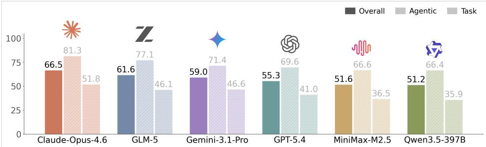  
Figure 1: Overall leaderboard. Overall, agentic, and task scores for the 6 evaluated agents. Agents are ranked by overall scores. The overall score averages the workflow-based agentic score and the held-out task score. Per-track leaderboards are in Figure 9.

Medical AI provides a particularly important and challenging testbed for this question. Unlike many single-step reasoning or coding tasks, medical-AI research requires agents to combine domain understanding with robust engineering execution. A typical task may require interpreting a clinical or biomedical objective, handling heterogeneous imaging modalities, selecting an appropriate model or algorithm, resolving dependencies, validating intermediate outputs, running inference at scale, and submitting artifacts in a strict evaluation format [42, 28, 41, 15]. These requirements make medical AI a natural stress test for autonomous research agents: success requires not only medical knowledge, but also the ability to execute and verify a complete research workflow.

However, existing medical and healthcare agent benchmarks provide limited visibility into this setting. Many benchmarks focus on medical question answering [33, 34, 55, 65], clinical dialogue or health scenarios [4, 7, 62, 26], EHR/FHIR interaction [31, 63, 38, 39, 44], healthcare administration [8], or final task success. While these settings are valuable, they do not directly evaluate whether an agent can complete an end-to-end medical-AI research workflow or evaluation pipelines. More importantly, final-output metrics alone cannot reveal why an agent fails. A low score may result from misunderstanding the task, selecting an unsuitable method, failing to configure the environment, neglecting validation, producing malformed outputs, or submitting artifacts in the wrong schema. Without stage-level evaluation, it remains unclear whether current agents are limited primarily by domain knowledge, engineering reliability, verification ability, or workflow discipline. However, stage-level evaluation is not a substitute for outcome evaluation: a high stage-level agentic score does not necessarily guarantee clinically useful outputs or high accuracy.

To address this gap, we present AUTOMEDBENCH, a workflow-aware benchmark for evaluating autonomous agents on end-to-end medical-AI research tasks. AUTOMEDBENCH organizes each agent run into a unified five-stage workflow (S1–S5): Plan, Setup, Validate, Inference, and Submit. This design reflects the structure of practical medical-AI research workflows, where an agent must first understand the task, configure the environment and required resources, verify intermediate outputs, run full inference, and finally submit artifacts in the required format. The benchmark covers 24 tasks across five representative medical imaging and multimodal research tracks, including segmentation, image enhancement, visual question answering, report generation, and lesion detection, spanning diverse imaging modalities such as CT, MRI, X-ray, pathology, microscopy, dental imaging, and medical video. These tasks are long-horizon, with each run averaging 33 agent turns, requiring agents to preserve context and make consistent decisions across multiple stages. Each task is instantiated under two difficulty tiers, LITE and STANDARD, which hold the underlying data, metrics, references, and submission schemas fixed while varying the amount of scaffolding provided in the task brief. A key feature of AUTOMEDBENCH is that it evaluates both the research process and the final artifact. Each run receives an AGENTIC score based on S1–S5 workflow completion and a TASK score based on deterministic held-out evaluation against private references. This design allows agents to be compared not only by final performance, but also by their ability to make progress through the research workflow. In addition, A M B records full interaction traces and assigns post-run cause-based error codes, enabling diagnostic analysis of where and why agent runs fail. By linking stage-level scores with diagnostic error codes, AUTOMEDBENCH makes it possible to identify hidden workflow breakdowns that final-output metrics alone often obscure. Our experiments with frontier base models reveal gaps between current agents and reliable autonomous medical-AI researchers. Across thousands of recorded runs, agents are often able to set up runnable pipelines, but validation is consistently the weakest workflow stage, indicating that they are less capable of verifying whether a pipeline is correct and reliable before scaling to full inference. Post-run error diagnosis further assigns fired error codes across five cause-based patterns: task understanding, data or model setup, verification and recovery, implementation and execution, and deliverable submission. Verification errors, such as skipped sanity checks and ignored bad outputs, and submission errors, such as missing files and incorrect filenames, are the most frequent tagged failures, accounting for 37.7% and 38.1% of all fired codes, respectively, whereas task-understanding errors are rare at only 0.9%. These error codes are also strongly associated with degraded performance: runs with one fired error code have a 48% lower overall score than runs with no error code on average. By linking stage-level scores with diagnostic error codes, AUTOMEDBENCH exposes hidden breakdowns such as failed model loading, shape bugs, skipped validation, empty outputs, and malformed submissions, which are often obscured by final-output metrics alone. These findings suggest that the main bottleneck for current medical AutoResearch agents is not only domain knowledge, but also robust engineering execution, intermediate validation, and recovery from workflow errors.

Our contributions are threefold. First, we introduce AUTOMEDBENCH, a benchmark for evaluating autonomous medical-AI research across heterogeneous imaging and multimodal tasks using publicly available challenges and datasets, and the process of task-wise building. Second, we propose a workflow-aware evaluation protocol that combines process-level scoring and rubrics, deterministic held-out task evaluation, controlled difficulty tiers, and post-run error diagnosis. Third, we benchmark frontier LLMs, revealing the workflow stages and failure modes. Finally, we release the full execution harness and sandbox as open-source infrastructure, including containerized agents and evaluation environments with isolation.

## 2 AUTOMEDBENCH

In this section, we introduce AUTOMEDBENCH, a workflow-aware benchmark for evaluating autonomous agents in end-to-end medical-AI research. Unlike static medical benchmarks that assess final predictions from fixed inputs [33, 34, 55, 72, 37, 24, 43], AUTOMEDBENCH requires agents to complete a full research workflow: planning a solution, setting up the environment, validating the pipeline, performing inference, and submitting the required artifacts within a controlled research environment [45, 32, 13, 66]. The benchmark follows three design principles: (i) realistic medical research artifacts, (ii) process-level supervision of the research workflow, and (iii) deterministic held-out evaluation using private references.

## 2.1 BENCHMARK CONSTRUCTION

Task suite. AUTOMEDBENCH covers five medical research tracks, defined by the final artifact that the agent is required to produce: segmentation masks [61, 28], restored images [14, 75], VQA answers [37, 24, 43, 41], reports [15], and detection boxes [60, 59, 11]. The 24 tasks span CT, MRI, X-ray, pathology, blood-smear microscopy, dental imaging, and medical video. We include a task only if its public inputs can be made available to the agent, its references can remain hidden from the agent while still enabling deterministic evaluation [13, 66], and its workflow can be expressed under the shared research protocol described below. Table 1 enumerates the active tasks.

We exclude tasks whose correctness depends primarily on subjective judgment, long-horizon clinical dialogue [4, 62, 26], or training-time adaptation [13]. This design keeps the benchmark focused on inference-time medical-AI research workflows with stable and reproducible evaluation.

Shared workflow. Every task in AUTOMEDBENCH follows the same five-stage research workflow: Plan, Setup, Validate, Inference, and Submit. A run is defined as a continuous interaction between a base LLM agent and a code-execution environment. The agent receives the task brief, public inputs, allowed public resources, and a writable workspace. Held-out references are never visible to the agent and are mounted only inside the offline evaluator after the run terminates.

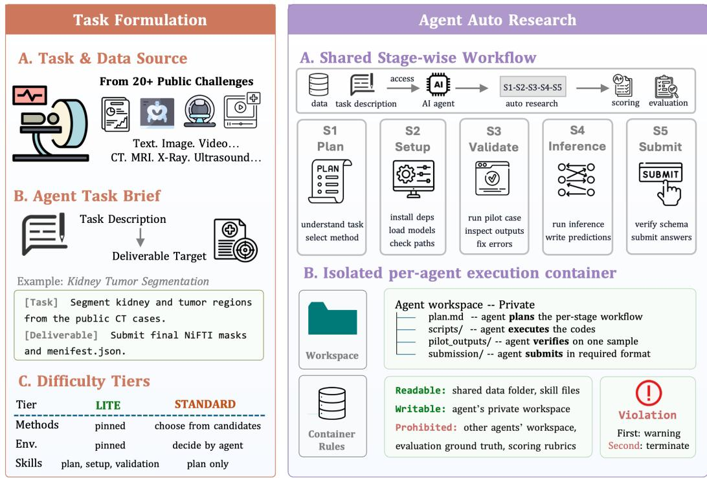  
Figure 2: AUTOMEDBENCH: a workflow-aware benchmark for autonomous medical AI research. Left: Tasks are sourced from 20+ public challenges (e.g., KiTS19 [25]) spanning diverse modalities (CT, MRI, X-ray, ultrasound, video) and task types (segmentation, detection, VQA, report generation, and image enhancement). Each task provides a natural-language description and deliverable target, with two difficulty tiers: Lite (method, environment, and skill scaffolding provided) and Standard (agent selects method and environment autonomously with plan-only guidance). Right: Given data access and a task description, an AI agent conducts auto research via a shared S1–S5 workflow — Plan (understand task, select method), Setup (install dependencies, load models), Validate (run pilot case, inspect outputs, fix errors), Inference (run inference, write predictions), and Submit (verify schema, submit answers) — before scoring and evaluation. Each agent operates in an isolated container with a private workspace; shared data and skill files are readable, but access to other agents’ workspaces, evaluation ground truth, and scoring rubrics is prohibited, with violations triggering a warning then termination.

The workflow is designed to make the research process checkable, rather than evaluating only the final output [66, 8, 44]. To this end, each stage within the workflow requires supporting evidence either on disk or in the execution trace. In particular, S1–S3 capture the main research decisions: selecting a method, preparing the environment, and validating the pipeline before scaling to the full task. S4–S5 capture execution completeness and submission validity. This shared workflow allows AUTOMEDBENCH to compare otherwise heterogeneous medical tasks under a common processlevel protocol.

Post-run error coding. In addition to scoring workflow completion, AUTOMEDBENCH records cause-based error codes after each run for diagnostic analysis. The detailed run report may contain multiple fired error codes, because a single run can show several error patterns during planning, setup, validation, execution, and submission. Specifically, the benchmark harness saves the full interaction record as conversation.json, which is used to identify which error-code categories appear in the run. The error codes are independent of the S1–S5 workflow stages: stage scores measure where the agent made progress in the required workflow, whereas fired error codes describe what types of breakdowns occurred. We use five error-code categories: E1 understanding error, E2 data/model setup error, E3 verification or recovery error, E4 implementation or execution error, and E5 deliverable or submission error. Clean successful runs receive no error code. Error labels are used only for analysis and do not affect the AGENTIC, TASK, or OVERALL scores. Detailed definitions and examples are provided in Appendix G.

Table 1: Active tasks in AUTOMEDBENCH. We evaluate 24 tasks across five medical research tracks. Each task is assessed under two difficulty tiers, LITE and STANDARD, yielding 48 tasktier settings in total. For each track, the header reports the evaluation metric shared by all tasks in that track. The release column denotes the month of the first public dataset, challenge, or paper release, highlighting that AUTOMEDBENCH encompasses both well-established and recently introduced medical-AI benchmarks.

<table><tr><td>Task</td><td>Dataset</td><td>Modality</td><td>Release</td></tr><tr><td colspan="4">Segmentation (macro Dice)</td></tr><tr><td>Kidney Tumor</td><td>KiTS19 [25]</td><td>abdominal CT</td><td>Mar 2019</td></tr><tr><td>Fetal Brain Tissues</td><td>FeTA [19]</td><td>fetal MRI</td><td>May 2021</td></tr><tr><td>Multi-Organ</td><td>TotalSegmentator [70]</td><td>whole-body CT</td><td>Sep 2023</td></tr><tr><td>Airway Tree</td><td>AeroPath [58]</td><td>thoracic CT</td><td>Nov 2023</td></tr><tr><td>PANTHER T1</td><td>PANTHER [9]</td><td>T1-w MR-Linac</td><td>Apr 2025</td></tr><tr><td>PANTHER T2</td><td>PANTHER [9]</td><td>T2-w MR-Linac</td><td>Apr 2025</td></tr><tr><td>Pancreas Tumor</td><td>PanTS [10]</td><td>abdominal CT</td><td>Jul 2025</td></tr><tr><td>Pancreas OAR</td><td>PanTS [10]</td><td>abdominal CT</td><td>Jul 2025</td></tr><tr><td colspan="4">Enhancement (SSIM)</td></tr><tr><td>LDCT Denoising</td><td>LDCT-SimNICT [1]</td><td>low-dose CT</td><td>Jan 2016</td></tr><tr><td>MRI Super-Resolution</td><td>fastMRI [75]</td><td>knee/brain MRI</td><td>Nov 2018</td></tr><tr><td colspan="4">VQA (accuracy)</td></tr><tr><td>Radiology VQA</td><td>VQA-RAD [37]</td><td>radiology</td><td>Nov 2018</td></tr><tr><td>Pathology VQA</td><td>PathVQA [24]</td><td>histopathology</td><td>Mar 2020</td></tr><tr><td>Semantic Radiology VQA</td><td>SLAKE [43]</td><td>radiology</td><td>Feb 2021</td></tr><tr><td>Expert Multimodal VQA</td><td>MedXpertQA-MM [68]</td><td>mixed multimodal</td><td>Jan 2025</td></tr><tr><td>Multi-frame Medical VQA</td><td>MedFrameQA [74]</td><td>medical video</td><td>May 2025</td></tr><tr><td colspan="4">Report Generation (report score)</td></tr><tr><td>Chest X-ray Findings/Impression</td><td>IU X-Ray [16]</td><td>chest X-ray</td><td>Jul 2015</td></tr><tr><td>Chest X-ray Findings</td><td>MIMIC-CXR [35]</td><td>chest X-ray</td><td>Aug 2019</td></tr><tr><td>Pathology Captioning 100</td><td>PathCap [67]</td><td>histopathology</td><td>Mar 2024</td></tr><tr><td>Pathology Captioning 500</td><td>PathCap [67]</td><td>histopathology</td><td>Mar 2024</td></tr><tr><td>Chest X-ray Full Report</td><td>CheXpert Plus [12]</td><td>chest X-ray</td><td>May 2024</td></tr><tr><td colspan="4">Detection (mAP@0.5)</td></tr><tr><td>Blood Cell</td><td>BCCD [36]</td><td>blood smear</td><td>Dec 2017</td></tr><tr><td>Chest X-ray Abnormality</td><td>VinDr-CXR [53]</td><td>chest X-ray</td><td>Jun 2021</td></tr><tr><td>Wrist Anomaly</td><td>GRAZPEDWRI-DX [51]</td><td>pediatric wrist X-ray</td><td>May 2022</td></tr><tr><td>Dental Disease</td><td>DENTEX [23]</td><td>dental X-ray</td><td>Apr 2023</td></tr></table>

Table 2: The unified five-stage workflow adopted by all tasks in AUTOMEDBENCH.

<table><tr><td>Stage</td><td>Skill</td><td>Required Work</td><td>Weight</td></tr><tr><td>S1 Plan</td><td>Knowledge</td><td>Understand the task, select a feasible method, and write plan.md.</td><td>25%</td></tr><tr><td>S2 Setup</td><td>Engineering</td><td>Install dependencies, load models or APIs, and verify paths and outputs.</td><td>15%</td></tr><tr><td>S3 Validate</td><td>Engineering</td><td>Run a pilot case, inspect intermediate outputs, and correct pipeline errors.</td><td>35%</td></tr><tr><td>S4 Inference</td><td>Engineering</td><td>Run full inference and generate prediction files.</td><td>15%</td></tr><tr><td>S5 Submit</td><td>Engineering</td><td>Verify the submission schema and submit the final artifacts.</td><td>10%</td></tr></table>

Execution environment. Each run is conducted with a single base LLM serving as the agent. We do not introduce vendor-specific agent frameworks, multi-agent controllers, or external retrieval wrappers. All agents interact with tasks through the same code-execution interface, ensuring that performance differences primarily reflect model behavior under a fixed benchmark harness rather than task-specific orchestration.

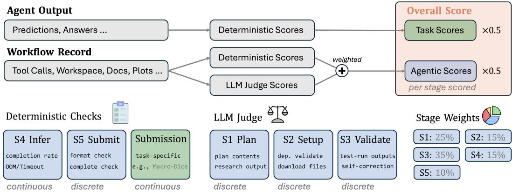  
Figure 3: AUTOMEDBENCH scoring rubrics. The overall score is the equal-weighted average of Task Score and Agentic Score (×0.5 each). Task Score is computed deterministically from agent predictions or answers. Agentic Score combines deterministic checks and LLM judge scores across the S1–S5 workflow stages, weighted as: S1 Plan (25%), S2 Setup (15%), S3 Validate (35%), S4 Inference (15%), and S5 Submit (10%). S1, S2, and S3 are evaluated as discrete scores via LLM judge (plan contents, dependency validation, and self-correction); S4 is continuous (completion rate, OOM/timeout); S5 is discrete (format and completeness check). Task-specific metrics (e.g., Macro-Dice) are scored continuously and folded into the Task Score.

Each task is executed under two-container isolation. The agent container has GPU access, network access, a mounted public-input view, and a writable workspace. In contrast, the offline evaluator container has access to the held-out references and scoring code, is isolated from external network communication, and receives only the submitted artifacts after the agent run terminates. For each dataset, the benchmark harness materializes a public input view and a private reference store. The agent is granted read access only to the public view and write access only to its workspace, while private references are never mounted into the agent container.

To ensure fair and reproducible evaluation under this isolation design, AUTOMEDBENCH enforces an inference-only protocol. Agents may use pre-trained models and approved model-inference APIs, but may not train or fine-tune models during a run. If a run attempts to access private data, write outside the designated workspace, bypass the sandbox, or otherwise violate the isolation policy, the benchmark harness flags the run and assigns zero scores to all S1–S5 workflow stages. The run is nevertheless retained in the cost ledger, ensuring that invalid attempts are included in resource analyses.

## 2.2 TASK FORMULATION

Given the benchmark construction above, we formulate each task instance in AUTOMEDBENCH as a unified research problem consisting of public inputs $\mathcal { D } _ { p u b }$ , hidden references $\mathcal { D } _ { p r i v }$ , a task brief $^ { \cdot } b ,$ the final artifact A produced by the agent and evaluated by the evaluator, a submission schema S, a task-specific metric m, and a wall-time limit τ:

$$
\mathcal {T} = (\mathcal {D} _ {p u b}, \mathcal {D} _ {p r i v}, b, \mathcal {A}, \mathcal {S}, m, \tau).
$$

Given $\mathcal { D } _ { p u b }$ and $b ,$ the agent must produce A such that it conforms to S within time τ. The evaluator then computes the task outcome as $m ( \mathcal { A } , \mathcal { D } _ { p r i v } )$

Agent objective. The agent is expected to produce a valid evaluated artifact through the full research workflow, rather than simply emit a final answer. This requires not only selecting an appropriate method, but also making the pipeline executable, validating intermediate outputs, and submitting artifacts that conform to the required schema. The formulation accommodates diverse solution strategies while preserving a fixed interface for reproducible evaluation.

Difficulty tiers. AUTOMEDBENCH instantiates two difficulty tiers, LITE and STANDARD, by varying only the amount of scaffolding provided in the task brief. Across tiers, the input data, held-out references, wall-time limit, task metric, scoring code, and submission schema remain fixed. Thus, the tiers control the degree of agent autonomy while keeping the underlying task unchanged.

• LITE. The brief identifies a viable method, specifies key dependencies, and provides stagespecific hints for planning, setup, and pilot validation. This tier evaluates whether an agent can execute a prescribed medical-AI workflow end to end.

• STANDARD. The brief specifies only bounded model or method families and leaves the final implementation unspecified. The agent must select an approach, resolve dependencies, and design validation checks independently. This tier evaluates whether an agent can make bounded methodological choices and implement them within the same end-to-end workflow.

Applying these two tiers to the 24 active tasks yields 48 task-tier settings evaluated in this paper.

## 2.3 EVALUATION PROTOCOL

We evaluate each run along two complementary axes: workflow execution and final artifact quality. All component scores are computed in [0, 1] and reported as percentages, unless otherwise specified. The top-line score is defined as:

$$
\text { OVERALL } = 0. 5 \cdot \text { AGENTIC } + 0. 5 \cdot \text { TASK },
$$

where AGENTIC measures the agent’s completion of the required research workflow, and TASK measures the quality of the final artifact against held-out references.

Agentic workflow score. AGENTIC is a weighted sum of the five workflow stages:

$$
\mathrm{AGENTIC} = 0. 2 5 \mathrm{S} 1 + 0. 1 5 \mathrm{S} 2 + 0. 3 5 \mathrm{S} 3 + 0. 1 5 \mathrm{S} 4 + 0. 1 0 \mathrm{S} 5.
$$

Each stage score lies in [0, 1], with different stages scored according to their evidence type. S1– S3 are evaluated as LLM judge scores from saved artifacts and execution traces [66, 8, 44], as they involve qualitative decisions in planning, setup, and validation. S4–S5 are evaluated through deterministic checks: S4 verifies that the expected prediction files exist for the evaluation inputs, and S5 verifies that the submitted artifacts conform to the required schema. The weights reflect the relative research consequence of each stage. S3 (Validate) receives the highest weight (35%) because catching and correcting pipeline errors before full inference is the most critical and often neglected step in a research workflow. S1 (Plan) receives the second highest weight (25%) because a flawed method choice or misunderstood task objective cannot be recovered downstream. S2, S4, and S5 receive lower weights as they are more mechanical: setting up dependencies, running inference, and submitting artifacts are necessary but less consequential than the core research decisions made in S1 and S3.

Task outcome score. TASK is the standard held-out metric for each track, scaled to [0, 1]. We use macro Dice [17] for segmentation, mean SSIM [69] for image enhancement, VQA accuracy [3] for visual question answering, and mAP at IoU 0.5 [18] for detection. For report generation, we use the unweighted mean of BLEU [56], METEOR [5], ROUGE-L [40], F1RadGraph [29], and micro precision, recall, and F1. Invalid, missing, or unreadable outputs are handled according to the failure rules described below. Exact formulas are provided in Appendix A.

Failure handling. To maintain reproducible and policy-compliant evaluation, we define deterministic rules for incomplete, malformed, and invalid runs. When a run times out, the evaluator considers only artifacts written to the workspace before termination, and assigns zero to missing outputs for the corresponding cases. When a submission is malformed, S5 is set to zero, and the task metric is evaluated only if the submitted artifacts can be safely parsed. Runs that violate the isolation policy are marked invalid; all S1–S5 workflow stages are assigned zero, and the submitted artifacts are excluded from task scoring. This protocol preserves partial credit for valid intermediate progress while preventing malformed or policy-violating runs from receiving undue credit.

Table 3: Comparison with medical and healthcare agent benchmarks. “Full Med-AI Pipeline” denotes end-to-end medical-AI pipeline evaluation. “Code Env.” denotes access to a code-execution research environment. “Cross-task Workflow” denotes a unified workflow shared across tasks. “Workflow Score” denotes process-level or checkpoint-based scoring. “Hidden Eval.” denotes hidden references, held-out states, blind tests, or post-execution checks unseen by the agent. “Tiers” denotes controlled difficulty levels. “Error Diag.” denotes post-run error diagnosis.

<table><tr><td>Benchmark</td><td>Full Med-AI Pipeline</td><td>Code Env.</td><td>Cross-task Workflow</td><td>Workflow Score</td><td>Hidden Eval.</td><td>Tiers</td><td>Error Diag.</td></tr><tr><td>HealthBench Professional [26]</td><td>X</td><td>X</td><td>X</td><td>X</td><td>X</td><td>X</td><td>X</td></tr><tr><td>MedHELM [6]</td><td>X</td><td>X</td><td>X</td><td>X</td><td>√</td><td>X</td><td>X</td></tr><tr><td>AgentClinic [62]</td><td>X</td><td>X</td><td>X</td><td>X</td><td>√</td><td>X</td><td>X</td></tr><tr><td>EHRAgent [63]</td><td>X</td><td>√</td><td>X</td><td>X</td><td>X</td><td>√</td><td>X</td></tr><tr><td>MedAgentBench [31]</td><td>X</td><td>X</td><td>√</td><td>X</td><td>√</td><td>√</td><td>X</td></tr><tr><td>FHIR-AgentBench [38]</td><td>X</td><td>√</td><td>X</td><td>√</td><td>X</td><td>X</td><td>X</td></tr><tr><td>AgentEHR [39]</td><td>X</td><td>X</td><td>√</td><td>X</td><td>X</td><td>X</td><td>√</td></tr><tr><td>HealthAdminBench [8]</td><td>X</td><td>X</td><td>√</td><td>√</td><td>√</td><td>√</td><td>X</td></tr><tr><td>PhysicianBench [44]</td><td>X</td><td>X</td><td>√</td><td>√</td><td>√</td><td>X</td><td>√</td></tr><tr><td>CamylaBench [20]</td><td>√</td><td>√</td><td>√</td><td>X</td><td>√</td><td>X</td><td>√</td></tr><tr><td>AUTOMEDBENCH</td><td>√</td><td>√</td><td>√</td><td>√</td><td>√</td><td>√</td><td>√</td></tr></table>

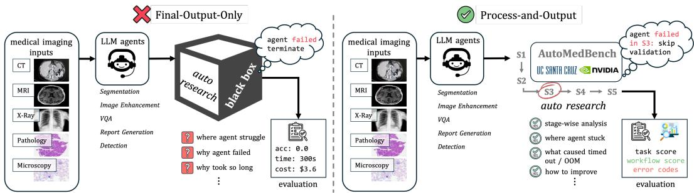  
Figure 4: AUTOMEDBENCH provides stage-level evaluation for medical research agents. Unlike most prior benchmarks that only measure the final output, AUTOMEDBENCH tracks the full workflow from planning to submission, making it possible to identify where agents fail during the research process. This process-aware evaluation reveals hidden failure modes, workflow weaknesses, and error patterns that are not visible from final task scores alone.

## 2.4 COMPARISON WITH EXISTING BENCHMARKS

AUTOMEDBENCH differs from existing medical and healthcare agent benchmarks by introducing a unique combination of medical auto-research challenges, as summarized in Table 3. First, tasks in AUTOMEDBENCH require agents to complete end-to-end medical-AI research workflows and submit valid artifacts, rather than merely answer medical questions, conduct clinical dialogue, interact with EHR/FHIR systems, or operate healthcare administration portals. This setting requires agents to reason about the research objective, execute code, and produce outputs that can be evaluated by task-specific evaluators. Second, AUTOMEDBENCH covers heterogeneous medical-AI tasks across five tracks: segmentation, image enhancement, VQA, report generation, and detection. In contrast to benchmarks centered on a single clinical environment or task family, AUTOMEDBENCH spans diverse modalities and artifact formats across radiology, pathology, microscopy, dental imaging, and medical video. Third, AUTOMEDBENCH evaluates both the research process and the final outcome. Whereas many prior benchmarks primarily report final answer accuracy or task success, AU-TOMEDBENCH adopts a shared cross-task workflow with explicit workflow-level scoring. Finally, AUTOMEDBENCH enables more diagnostic evaluation through hidden or post-execution checks, controlled difficulty tiers, and post-run error diagnosis.

## 3 EXPERIMENTAL SETUP

We evaluate AUTOMEDBENCH under a fixed agent interface and a unified replication protocol, following the controlled evaluation practice used in execution-grounded agent benchmarks [45, 13, 66].

This section describes the agents, task-tier coverage, replication protocol, and logging procedures used in the analyses in Section 4.

## 3.1 AGENTS

We evaluate six frontier base models on the 48 LITE/STANDARD task-tier settings in AUTOMED-BENCH, covering both hosted proprietary models and open-weight models served through our own inference stack. Appendix C lists the model names, vendors, release dates, and open-source status. Each model is used directly as the agent in a single long-horizon interaction with the same code-execution environment. To isolate the effect of the underlying base model, we keep the system prompt, tool schema, stop conditions, and default decoding settings fixed across models. We do not add vendor-specific agent wrappers, multi-agent controllers, or task-specific retrieval pipelines beyond the shared benchmark interface, since scaffold and orchestration choices can materially affect agent results [13, 66]. As a consequence, the comparison reflects differences among frontier base models under the same benchmark contract rather than differences among product-level agent systems.

## 3.2 EVALUATION RUNS AND LOGGING

Task coverage and data access. The main evaluation covers all 24 active tasks across five medical research tracks under both LITE and STANDARD, yielding 48 reported task-tier settings. All tasks follow the public-input/private-reference split described in Section 2. AUTOMEDBENCH does not redistribute restricted datasets; runners must obtain any credentialed data before launching the benchmark harness. In our experiments, MIMIC-CXR is accessed through PhysioNet [35], and fastMRI is accessed under the NYU data-sharing agreement [75]. When an official evaluation script is available from the source benchmark, we execute it inside the offline evaluation container rather than re-implementing the metric.

Replication protocol. The smallest evaluation unit is an evaluation cell, defined by an (agent, task, tier) tuple. With six agents, 24 tasks, and two tiers, the main experiments comprise 288 evaluation cells. Each replicate starts from the same task-specific container image and a fresh writable workspace, with no shared cache, files, or conversation history across runs. The default cohort size is N=10 runs per cell. Five segmentation tasks—KiTS19, PanTS Tumor, PanTS OAR, FeTA, and AeroPath—use N=20 runs to better estimate performance under longer execution horizons and higher observed run-to-run variance. Each task has a fixed wall-time cap that is held constant across agents and difficulty tiers. A run terminates when the agent submits successfully or when the wall-time cap is reached; upon timeout, the evaluator scores only artifacts already written to the workspace.

Logging and cost accounting. For every run, we log the five workflow stage scores, the derived TASK and OVERALL scores, the number of conversational turns, wall-clock time, input and output token counts, estimated inference cost, run status, and the full interaction record in conversation.json. Post-run diagnostics are derived from this interaction record: the detailed report records all fired error codes from E1–E5, following the rubric in Appendix G. Each run writes one row to a unified ledger keyed by (agent, task, tier, run-id), allowing all reported statistics to be recomputed without replaying the benchmark. For cost accounting, we normalize all costs using the fixed rate snapshot in Table 11, without prompt-cache or negotiated discounts, following the resource-accounting emphasis in execution-heavy agent benchmarks [13, 66]. Resource records and error-code labels are used only for analysis and do not affect workflow or task scoring. We define an end-to-end completed run as a run that submits artifacts accepted by the evaluation module and receives a task score. A failed run is one that does not reach this end-to-end state. For runs with two or more fired error codes, we define recovery as still reaching end-to-end completion after those errors appear in the detailed report. Accordingly, recovery rate is the percentage of runs with at least two fired error codes that still submit scoreable artifacts.

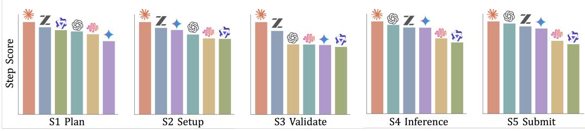  
Figure 5: Step-level workflow scoring across agents. Scores are shown for the six evaluated agents at each workflow stage: S1 Plan, S2 Setup, S3 Validate, S4 Inference, and S5 Submit. The dashed line marks the mean score across agents for each stage. Setup is the strongest stage on average, while validation is the weakest, showing that agents are better at making pipelines runnable than at checking whether those pipelines are reliable before full inference and submission. A strong agent tends to perform consistently well across steps, as seen for Opus 4.6, whereas other agents show more uneven profiles, such as GPT-5.4.

## 4 RESULTS AND ANALYSIS

We report three levels of evidence. Section 4.1 presents the overall leaderboard and summarizes where current agents stand on AUTOMEDBENCH. Section 4.2 uses workflow, tier, and cost analyses to diagnose when and why agents struggle. Section 4.3 examines fine-grained failure modes and recovery behavior.

## 4.1 MAIN RESULTS

Table 4: Per-track and overall leaderboard. Scores are averaged over all runs for the tasks and tiers within each track. Agent rows are ordered by the overall leaderboard rank, the overall column is shown on the right, and the highest score in each column is highlighted.

<table><tr><td>Agent</td><td>Segmentation</td><td>Enhancement</td><td>Visual Question Answering</td><td>Report Generation</td><td>Detection</td><td>Overall</td></tr><tr><td>Opus 4.6 [2]</td><td>67.2</td><td>78.3</td><td>55.5</td><td>55.8</td><td>85.7</td><td>66.5</td></tr><tr><td>GLM-5 [21]</td><td>58.0</td><td>68.8</td><td>64.0</td><td>48.6</td><td>83.3</td><td>61.6</td></tr><tr><td>Gemini 3.1 Pro [22]</td><td>54.7</td><td>70.9</td><td>62.3</td><td>47.7</td><td>77.2</td><td>59.0</td></tr><tr><td>ChatGPT-5.4 [54]</td><td>59.4</td><td>75.1</td><td>36.5</td><td>40.8</td><td>73.8</td><td>55.3</td></tr><tr><td>MiniMax-M2.5 [50]</td><td>46.5</td><td>74.5</td><td>55.8</td><td>28.9</td><td>80.0</td><td>51.6</td></tr><tr><td>Qwen3.5 [57]</td><td>42.8</td><td>63.5</td><td>57.0</td><td>38.7</td><td>81.4</td><td>51.2</td></tr></table>

Finding 1: The leaderboard separates agents but does not identify a uniformly best profile. Figure 1 and Table 4 show a 15.3-point spread in overall score across the evaluated agents, from 51.2 to 66.5. The top overall agent also leads segmentation, enhancement, report generation, and detection, while a different agent leads visual question answering. The step-level breakdown in Figure 5 further shows that agents with similar overall scores can differ in where they succeed or fail within the workflow. This pattern suggests that AUTOMEDBENCH captures meaningful differences between agents while also exposing track-specific and process-specific strengths and weaknesses. We therefore treat the leaderboard as a starting point for diagnosis rather than as a single-number measure of medical research ability.

Finding 2: Task quality lags behind workflow completion. A consistent gap appears between agentic and task scores: all evaluated agents score higher on the workflow component than on the final task component. This suggests that agents are often able to make progress through the required stages, but the resulting medical artifacts remain substantially weaker than their apparent workflow progress would imply. In other words, completing the visible steps of an auto-research process does not guarantee that the final segmentation mask, restored image, VQA answer, report, or detection output is correct.

Table 5: More scaffolding does not consistently improve agentic scores. LITE and STANDARD use the same data, metric, time cap, scoring code, and submission schema, but LITE provides more detailed scaffolding. $\Delta$ reports the relative change from STANDARD to LITE, computed as (LITE − STANDARD)/STANDARD × 100. Green values indicate improvement under LITE; red values indicate a drop. See tier details in Table 13.

<table><tr><td></td><td>Opus 4.6</td><td>GLM-5</td><td>Gemini 3.1 Pro</td><td>GPT-5.4</td><td>MiniMax-M2.5</td><td>Qwen3.5-397B</td></tr><tr><td>STANDARD</td><td>81.8</td><td>71.9</td><td>69.7</td><td>78.9</td><td>65.3</td><td>61.7</td></tr><tr><td>LITE</td><td>81.1</td><td>77.9</td><td>71.7</td><td>66.0</td><td>66.4</td><td>66.6</td></tr><tr><td>Δ</td><td>-0.9</td><td>+8.3</td><td>+2.8</td><td>-16.3</td><td>+1.7</td><td>+8.0</td></tr></table>

Finding 3: Medical tracks expose different agent weaknesses. The per-track results in Table 4 show that performance varies strongly across medical research tracks. Detection obtains the highest scores for several agents, suggesting that constrained output formats and mature pretrained detectors make these tasks comparatively easier under our benchmark [60, 59, 11]. Report generation and VQA are more challenging, likely because they require semantic interpretation of medical images and text beyond producing a valid artifact [41, 15]. Segmentation remains competitive for the best agents but is costly and pipeline-heavy, especially for 3D medical volumes [42, 28]. These differences indicate that no single track is sufficient to characterize medical auto-research ability; agents can appear strong in one artifact type while failing in another.

## 4.2 DIAGNOSTIC ANALYSIS

Validation is the central workflow bottleneck. Figure 5 breaks agent performance down by the five workflow stages. S3 (Validate) has the lowest mean score across agents, while S2 (Setup) is the highest. This pattern suggests that agents are better at installing dependencies and preparing a runnable environment than at designing and executing meaningful pilot checks before scaling to full inference. The stage-level view also reveals differences hidden by a single final score: agents with similar overall performance can differ in where they fail, such as late-stage inference and submission versus early planning and validation. This supports the need for workflow-aware scoring rather than final-output evaluation alone, consistent with recent rubric- or checkpoint-based agent benchmarks [66, 8, 44].

More scaffolding does not always improve performance. Table 5 compares STANDARD and LITE agentic scores across agents. Since the underlying data, metric, time limit, scoring code, and submission schema are fixed across tiers, the only change is the amount of task-brief scaffolding. Moving from STANDARD to the more detailed LITE tier does not produce a clear, uniform improvement: four agents improve under LITE, but two agents perform worse, including a 16.3% relative drop for GPT-5.4. This suggests that additional scaffolding is not automatically beneficial; in some cases it may constrain the agent to a brittle workflow, encourage unnecessary steps, or induce inefficient behavior. This sensitivity is important because prior agent benchmarks often evaluate full model–scaffold systems rather than base models alone [13, 66].

Higher cost does not reliably translate into better performance. Figure 6 shows that AU-TOMEDBENCH spans a wide range of cost regimes, from relatively cheap enhancement tasks to much more expensive segmentation tasks. Within each track, higher spending is only weakly associated with better performance. Segmentation shows the clearest positive cost–performance relationship, but report generation, detection, and enhancement show diminishing returns, and VQA shows almost no relationship. In many cases, the gap in cost between agents is larger than the gap in score. These results suggest that raw spending is not the main driver of success; what matters more is whether agents use compute effectively for validation, debugging, and recovery. Resource-aware reporting is therefore important for execution-heavy agent evaluation [13, 66].

Absolute performance and cost efficiency identify different agents. The leaderboard and cost analysis point to different deployment choices. Table 4 shows that Opus 4.6 obtains the highest overall score, while the resource summary in Appendix D shows that it also has the highest average cost per run. By contrast, GLM-5 reaches the second-best overall score at lower average cost. This suggests that the highest-scoring agent and a lower-cost practical choice need not be the same. For repeated benchmark runs across datasets, tiers, and task variants, AUTOMEDBENCH therefore supports both capability-oriented comparison and resource-aware model selection.

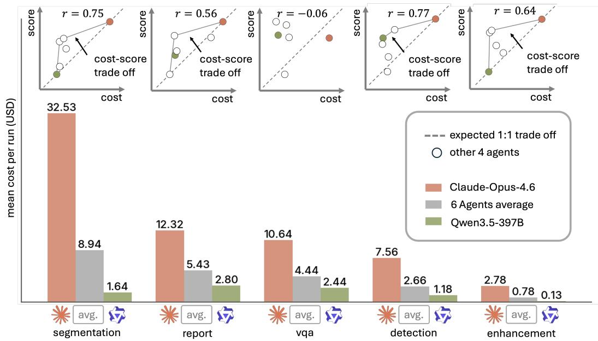  
Figure 6: Higher cost does not reliably translate into better performance. Bars show the mean cost per run for each task track. Insets plot each agent’s track-level cost against score, with Pearson correlation r summarizing the cost–performance relationship within that track. The weak and trackdependent correlations indicate that raw spending is not the main driver of success. The API-price snapshot is listed in Table 11.

Table 6: Cause-based error codes. A run may fire multiple codes when multiple breakdown types appear in the trace.

<table><tr><td>E1 Understanding</td><td>E2 Setup</td><td>E3 Verification</td><td>E4 Execution</td><td>E5 Submission</td></tr><tr><td>hallucination wrong model type</td><td>wrong dependency failed model load</td><td>skipped validation ignored bad output</td><td>runtime crash shape mismatch</td><td>missing files wrong format</td></tr></table>

## 4.3 FINE-GRAINED FAILURE ANALYSIS

After each run, the detailed report records all fired error codes observed in the trace. We analyze these fired codes directly to summarize which breakdown types occur most often. Table 6 summarizes the five codes used in the following analysis.

Engineering-shaped failures dominate agent breakdowns. Figure 7 summarizes the post-run error-code categories defined in Appendix G. Panel (a) reports percentages over all fired code tags. Most tagged errors in AUTOMEDBENCH are engineering-shaped rather than understandingshaped. Setup, execution, verification, and deliverable errors account for the majority of observed failures, while E1 understanding errors are rare. This does not imply that agents have sufficient medical knowledge; instead, it shows that in our end-to-end setting, many runs fail through practi cal research-workflow problems: invalid environments, failed execution, missed validation signals, incomplete outputs, missing files, or malformed submissions. Similar engineering and execution bottlenecks have been observed in software- and ML-engineering agent benchmarks [32, 13, 66].

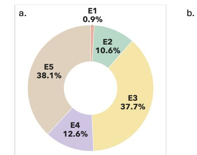  
engineering (E2-E5): knowledge (E1) = 110:1

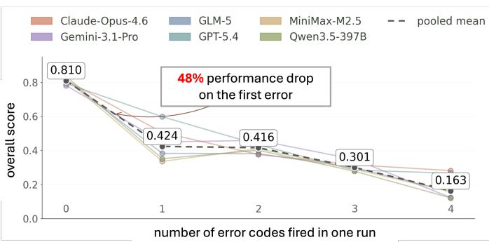  
Figure 7: Error codes can sharply derail a run. (a) Distribution of fired error-code types. (b) Mean overall score by the number of fired error codes in a run. Verification and submission errors dominate tagged failures. The first fired error produces a large score drop, and runs with two or more fired errors remain in a low-score regime.

Fired error codes mark a performance cliff. Figure 7b shows that runs with fired error codes score much lower than runs with no fired errors. On average, runs with one fired error code have a 48% lower overall score than runs with no fired error code, and runs with two or more fired codes remain in a low-score regime. This motivates the recovery analysis in Figure 8, where recovery is measured as reaching end-to-end completion after at least two fired error codes. These results highlight the importance of early error detection and recovery in medical auto-research agents.

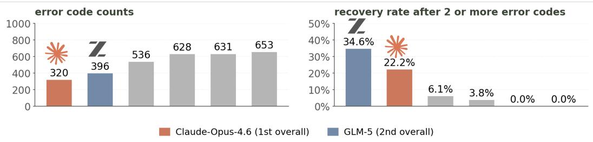  
Figure 8: Strong agents both avoid errors and recover from them. Left: total fired error-code counts across agents. Right: recovery rate after two or more fired error codes, defined as the percentage of such runs that still reach end-to-end completion and receive an evaluation score.

Strong agents are better at recovering after multiple fired errors. Figure 8 shows that topperforming agents are not simply the ones with the fewest fired error codes. Instead, stronger agents more often recover after two or more errors appear in the interaction record. This finding refines the interpretation of agent reliability: success depends not only on avoiding early mistakes, but also on persisting through debugging when the workflow begins to fail. Error avoidance alone is insufficient, and persistence without a clean recovery strategy is also insufficient. Robust medical auto-research agents need both a stable start and the ability to repair the workflow after multiple failures occur.

The largest improvement opportunity is workflow control, not only model knowledge. The step-level and error-code analyses point to a common pattern. Figure 5 shows that agents are comparatively strong at setup but weaker at validation, while Figure 7 and Table 15 show that many failures arise from execution, verification, and deliverable errors rather than from E1 understanding errors. This suggests that improving medical research agents requires more than stronger task reasoning or larger base models. Agents need explicit validation routines, artifact-level sanity checks, and recovery policies that connect observed failures to corrective actions before full inference or submission.

## 5 RELATED WORK

Agentic Evaluation. Recent agent benchmarks move beyond static question answering by placing models in interactive environments with external state, tools, and verifiable artifacts. AgentBench, AgentBoard, and GAIA test broad multi-step reasoning; WebArena, AssistantBench, and OSWorld ground agents in browser or operating-system environments; SWE-bench, Terminal-Bench, MLEbench, and PaperBench emphasize execution-heavy tasks with sandboxed or repository-based grading [45, 47, 49, 76, 73, 71, 32, 48, 13, 66]. These works motivate AUTOMEDBENCH’s environmentgrounded evaluation, but remain largely domain-general and do not model medical data constraints, modality-specific metrics, or staged medical research workflows.

Research Automation. Research-agent work studies whether LLM agents can assist scientific discovery by writing code, analyzing data, running experiments, or reproducing research artifacts [27, 30, 46, 64, 66]. This direction is closest to AUTOMEDBENCH because it evaluates agents as research workers rather than passive answer generators. However, most settings focus on general scientific workflows [30, 46], machine-learning engineering [27, 52, 13], or paper replication and reproducibility [64, 66]. AUTOMEDBENCH targets medical-AI research specifically, where agents must handle medical data separation, modality-dependent outputs, and a shared Plan–Setup– Validate–Inference–Submit workflow.

Medical Benchmarks. Medical AI benchmarks typically evaluate fixed-input knowledge, clinical reasoning, or single-task prediction. Language-centric datasets such as MedQA, PubMedQA, MedMCQA, and MultiMedQA test exam-style or biomedical question answering, while Health-Bench and MedHELM move toward richer rubric-based evaluation in realistic health scenarios [33, 34, 55, 65, 4, 7]. Medical imaging and multimodal benchmarks extend evaluation to visual tasks, including MedMNIST v2 for lightweight biomedical image classification and VQA-RAD, PathVQA, and SLAKE for image-grounded medical question answering [72, 37, 24, 43]. MedAgentBench is closest in spirit, but targets clinical EHR assistance rather than medical model building [31]. In contrast, AUTOMEDBENCH evaluates whether agents can set up environments, validate pipelines, run inference, recover from workflow failures, and submit valid artifacts under medical metrics.

## 6 CONCLUSION

We present AUTOMEDBENCH, a workflow-aware benchmark for evaluating autonomous agents on end-to-end medical-AI research tasks. Unlike prior benchmarks that measure only final output quality, AUTOMEDBENCH evaluates both how agents work and what they produce, using a shared five-stage workflow across 24 tasks and five medical research tracks. Our evaluation protocol combines process-level agentic scoring, deterministic held-out task metrics, controlled difficulty tiers, and post-run error diagnosis, enabling a more complete picture of where and why agents succeed or fail in medical auto-research.

Our experiments with six frontier models show that current agents remain far from reliable medical-AI researchers. While agents can often set up runnable pipelines, validation is consistently the weakest stage, and engineering failures dominate over understanding errors. These findings suggest that the main bottleneck is not medical knowledge alone, but the ability to verify intermediate outputs and recover from workflow errors. We hope AUTOMEDBENCH provides a practical foundation for building agents that can conduct medical-AI research more reliably and systematically.

## REFERENCES

[1] AAPM. AAPM low-dose CT grand challenge (LDCT-SimNICT). https://www.aapm. org/GrandChallenge/LowDoseCT/, 2016.

[2] Anthropic. Claude Opus 4.6 system card. https://www-cdn.anthropic.com/ 14e4fb01875d2a69f646fa5e574dea2b1c0ff7b5.pdf, February 2026.

[3] Stanislaw Antol, Aishwarya Agrawal, Jiasen Lu, Margaret Mitchell, Dhruv Batra, C. Lawrence Zitnick, and Devi Parikh. VQA: Visual question answering. In Proceedings of the IEEE International Conference on Computer Vision, pp. 2425–2433, 2015.

[4] Rahul K. Arora, Jason Wei, Rebecca Soskin Hicks, Preston Bowman, Joaquin Quinonero-˜ Candela, Foivos Tsimpourlas, Michael Sharman, Meghan Shah, Andrea Vallone, Alex Beutel, Johannes Heidecke, and Karan Singhal. Healthbench: Evaluating large language models towards improved human health, 2025. URL https://arxiv.org/abs/2505.08775.

[5] Satanjeev Banerjee and Alon Lavie. METEOR: An automatic metric for MT evaluation with improved correlation with human judgments. In Proceedings of the ACL Workshop on Intrinsic and Extrinsic Evaluation Measures for Machine Translation and/or Summarization, pp. 65–72, 2005.

[6] Suhana Bedi, Hejie Cui, Miguel Fuentes, Alyssa Unell, Michael Wornow, Juan M Banda, Nikesh Kotecha, Timothy Keyes, Yifan Mai, Mert Oez, et al. Medhelm: Holistic evaluation of large language models for medical tasks. arXiv preprint arXiv:2505.23802, 2025.

[7] Suhana Bedi, Hejie Cui, Miguel Fuentes, Alyssa Unell, Michael Wornow, et al. Holistic evaluation of large language models for medical tasks with MedHELM. Nature Medicine, 32(3): 943–951, 2026. doi: 10.1038/s41591-025-04151-2. URL https://www.nature.com/ articles/s41591-025-04151-2.

[8] Suhana Bedi, Ryan Welch, Ethan Steinberg, Michael Wornow, Taeil Matthew Kim, Haroun Ahmed, Peter Sterling, Bravim Purohit, Qurat Akram, Angelic Acosta, et al. HealthAdmin-Bench: Evaluating computer-use agents on healthcare administration tasks. arXiv preprint arXiv:2604.09937, 2026.

[9] Amparo Soeli Betancourt Tarifa, Faisal Mahmood, Uffe Bernchou, and Peter Jan Koopmans. PANTHER challenge: Public training dataset, 2025. URL https://doi.org/10.5281/ zenodo.15192302.

[10] BodyMaps. PanTS: Pancreatic tumor segmentation. https://huggingface.co/ datasets/BodyMaps/PanTSMini, 2024.

[11] Nicolas Carion, Francisco Massa, Gabriel Synnaeve, Nicolas Usunier, Alexander Kirillov, and Sergey Zagoruyko. End-to-end object detection with transformers. In European Conference on Computer Vision, pp. 213–229. Springer, 2020.

[12] Pierre Chambon, Jean-Benoit Delbrouck, Thomas Sounack, Shih-Cheng Huang, Zhihong Chen, Maya Varma, Steven QH Truong, Chu The Chuong, and Curtis P. Langlotz. CheXpert Plus: Augmenting a large chest x-ray dataset with text radiology reports, patient demographics and additional image formats, 2024. URL https://arxiv.org/abs/2405.19538.

[13] Jun Shern Chan, Neil Chowdhury, Oliver Jaffe, James Aung, Dane Sherburn, Evan Mays, Giulio Starace, Kevin Liu, Leon Maksin, Tejal Patwardhan, Lilian Weng, and Aleksander Madry. MLE-bench: Evaluating machine learning agents on machine learning engineering, 2024. URL https://arxiv.org/abs/2410.07095.

[14] Hu Chen, Yi Zhang, Mannudeep K. Kalra, Feng Lin, Yang Chen, Peixi Liao, Jiliu Zhou, and Ge Wang. Low-dose CT with a residual encoder-decoder convolutional neural network. IEEE Transactions on Medical Imaging, 36(12):2524–2535, 2017. doi: 10.1109/TMI.2017. 2715284.

[15] Zhihong Chen, Yan Song, Tsung-Hui Chang, and Xiang Wan. Generating radiology reports via memory-driven transformer. In Proceedings ofthe 2020 Conference on Empirical Methods in Natural Language Processing, pp. 1439–1449, 2020.

[16] Dina Demner-Fushman, Marc D. Kohli, Marc B. Rosenman, Sonya E. Shooshan, Laritza Rodriguez, Sameer Antani, George R. Thoma, and Clement J. McDonald. Preparing a collection of radiology examinations for distribution and retrieval. Journal of the American Medical Informatics Association, 23(2):304–310, 2016. doi: 10.1093/jamia/ocv080. URL https://doi.org/10.1093/jamia/ocv080.

[17] Lee R. Dice. Measures of the amount of ecologic association between species. Ecology, 26 (3):297–302, 1945. doi: 10.2307/1932409.

[18] Mark Everingham, Luc Van Gool, Christopher K. I. Williams, John Winn, and Andrew Zisserman. The PASCAL visual object classes (VOC) challenge. International Journal ofComputer Vision, 88(2):303–338, 2010. doi: 10.1007/s11263-009-0275-4.

[19] FeTA Organizers. FeTA challenge: Fetal brain tissue annotation and segmentation. https: //fetachallenge.github.io/, 2021.

[20] Yifan Gao, Haoyue Li, Feng Yuan, Xin Gao, Weiran Huang, and Xiaosong Wang. Camyla: Scaling autonomous research in medical image segmentation. arXiv preprint arXiv:2604.10696, 2026.

[21] GLM-5 Team. GLM-5: From vibe coding to agentic engineering, 2026. URL https:// arxiv.org/abs/2602.15763.

[22] Google DeepMind. Gemini 3.1 Pro model card. https://deepmind.google/ models/model-cards/gemini-3-1-pro/, February 2026.

[23] Ibrahim Ethem Hamamci et al. DENTEX: Dental enumeration and diagnosis on panoramic x-rays. https://huggingface.co/datasets/ibrahimhamamci/DENTEX, 2023.

[24] Xuehai He, Yichen Zhang, Luntian Mou, Eric P. Xing, and Pengtao Xie. PathVQA: 30000+ questions for medical visual question answering, 2020. URL https://arxiv.org/abs/ 2003.10286.

[25] Nicholas Heller et al. KiTS19: Kidney tumor segmentation challenge. https://kits19. grand-challenge.org/, 2019.

[26] Rebecca Soskin Hicks, Mikhail Trofimov, Dominick Lim, Rahul K. Arora, Foivos Tsimpourlas, Preston Bowman, Michael Sharman, Chi Tong, Kavin Karthik, Arnav Dugar, Akshay Jagadeesh, Khaled Saab, Johannes Heidecke, Ashley Alexander, Nate Gross, and Karan Singhal. Healthbench professional: Evaluating large language models on real clinician chats, 2026. URL https://arxiv.org/abs/2604.27470.

[27] Qian Huang, Jian Vora, Percy Liang, and Jure Leskovec. MLAgentBench: Evaluating language agents on machine learning experimentation. In Proceedings of the 41st International Conference on Machine Learning, volume 235 of Proceedings ofMachine Learning Research, pp. 20271–20309. PMLR, 2024. URL https://proceedings.mlr.press/v235/ huang24y.html.

[28] Fabian Isensee, Paul F. Jaeger, Simon A. A. Kohl, Jens Petersen, and Klaus H. Maier-Hein. nnU-Net: A self-configuring method for deep learning-based biomedical image segmentation. Nature Methods, 18:203–211, 2021. doi: 10.1038/s41592-020-01008-z.

[29] Saahil Jain, Ashwin Agrawal, Adriel Saporta, Steven QH Truong, Du Nguyen Duong, Tan Bui, Pierre Chambon, Matthew Lungren, Andrew Ng, Curtis Langlotz, and Pranav Rajpurkar. RadGraph: Extracting clinical entities and relations from radiology reports. PhysioNet, 2021. doi: 10.13026/hm87-5p47. Version 1.0.0.

[30] Peter Jansen, Marc-Alexandre Cotˆ e, Tushar Khot, Erin Bransom, Bhavana Dalvi Mishra,´ Bodhisattwa Prasad Majumder, Oyvind Tafjord, and Peter Clark. DiscoveryWorld: A virtual environment for developing and evaluating automated scientific discovery agents. In Advances in Neural Information Processing Systems, volume 37, 2024. doi: 10.52202/079017-0324. URL https://proceedings.neurips.cc/paper\_files/paper/2024/ hash/13836f251823945316ae067350a5c366-Abstract-Datasets\_and\_ Benchmarks\_Track.html. Datasets and Benchmarks Track.

[31] Yixing Jiang, Kameron C. Black, Gloria Geng, Danny Park, James Zou, Andrew Y. Ng, and Jonathan H. Chen. MedAgentBench: A realistic virtual EHR environment to benchmark medical LLM agents, 2025. URL https://arxiv.org/abs/2501.14654.

[32] Carlos E. Jimenez, John Yang, Alexander Wettig, Shunyu Yao, Kexin Pei, Ofir Press, and Karthik Narasimhan. SWE-bench: Can language models resolve real-world GitHub issues? In International Conference on Learning Representations, 2024. URL https: //openreview.net/forum?id=VTF8yNQM66.

[33] Di Jin, Eileen Pan, Nassim Oufattole, Wei-Hung Weng, Hanyi Fang, and Peter Szolovits. What disease does this patient have? a large-scale open domain question answering dataset from medical exams. Applied Sciences, 11(14):6421, 2021. doi: 10.3390/app11146421. URL https://www.mdpi.com/2076-3417/11/14/6421.

[34] Qiao Jin, Bhuwan Dhingra, Zhengping Liu, William Cohen, and Xinghua Lu. PubMedQA: A dataset for biomedical research question answering. In Proceedings of the 2019 Conference on Empirical Methods in Natural Language Processing and the 9th International Joint Conference on Natural Language Processing, pp. 2567–2577, 2019. doi: 10.18653/v1/D19-1259. URL https://aclanthology.org/D19-1259/.

[35] Alistair E.W. Johnson et al. MIMIC-CXR, a de-identified publicly available database of chest radiographs. https://physionet.org/content/mimic-cxr/, 2019.

[36] Kerem Berke. BCCD: Blood cell count and detection dataset. https://huggingface. co/datasets/keremberke/blood-cell-object-detection, 2018.

[37] Jason J. Lau, Soumya Gayen, Asma Ben Abacha, and Dina Demner-Fushman. A dataset of clinically generated visual questions and answers about radiology images. Scientific Data, 5:180251, 2018. doi: 10.1038/sdata.2018.251. URL https://www.nature.com/ articles/sdata2018251.

[38] Gyubok Lee, Elea Bach, Eric Yang, Tom Pollard, Alistair Johnson, Edward Choi, Jong Ha Lee, et al. FHIR-AgentBench: Benchmarking LLM agents for realistic interoperable EHR question answering. arXiv preprint arXiv:2509.19319, 2025.

[39] Yusheng Liao, Chuan Xuan, Yutong Cai, Lina Yang, Zhe Chen, Yanfeng Wang, and Yu Wang. AgentEHR: Advancing autonomous clinical decision-making via retrospective summarization. arXiv preprint arXiv:2601.13918, 2026.

[40] Chin-Yew Lin. ROUGE: A package for automatic evaluation of summaries. In Text Summarization Branches Out, pp. 74–81, 2004.

[41] Zhihong Lin, Donghao Zhang, Qingyi Tao, Danli Shi, Gholamreza Haffari, Qi Wu, Mingguang He, and Zongyuan Ge. Medical visual question answering: A survey. Artificial Intelligence in Medicine, 143:102611, 2023. doi: 10.1016/j.artmed.2023.102611.

[42] Geert Litjens, Thijs Kooi, Babak Ehteshami Bejnordi, Arnaud Arindra Adiyoso Setio, Francesco Ciompi, Mohsen Ghafoorian, Jeroen A. W. M. van der Laak, Bram van Ginneken, and Clara I. Sanchez. A survey on deep learning in medical image analysis. ´ Medical Image Analysis, 42:60–88, 2017. doi: 10.1016/j.media.2017.07.005.

[43] Bo Liu, Li-Ming Zhan, Li Xu, Lin Ma, Yan Yang, and Xiao-Ming Wu. SLAKE: A semantically-labeled knowledge-enhanced dataset for medical visual question answering. In 2021 IEEE 18th International Symposium on Biomedical Imaging (ISBI), pp. 1650–1654, 2021. doi: 10.1109/ISBI48211.2021.9434010. URL https://doi.org/10.1109/ ISBI48211.2021.9434010.

[44] Ruoqi Liu, Imran Q Mohiuddin, Austin J Schoeffler, Kavita Renduchintala, Ashwin Nayak, Prasantha L Vemu, Shivam C Vedak, Kameron C Black, John L Havlik, Isaac Ogunmola, et al. PhysicianBench: Evaluating LLM agents in real-world EHR environments. arXiv preprint arXiv:2605.02240, 2026.

[45] Xiao Liu, Hao Yu, Hanchen Zhang, Yifan Xu, Xuanyu Lei, Hanyu Lai, Yu Gu, Hangliang Ding, Kaiwen Men, Kejuan Yang, Shudan Zhang, Xiang Deng, Aohan Zeng, Zhengxiao Du, Chenhui Zhang, Sheng Shen, Tianjun Zhang, Yu Su, Huan Sun, Minlie Huang, Yuxiao Dong, and Jie Tang. Agentbench: Evaluating LLMs as agents. In International Conference on Learning Representations, 2024. URL https://openreview.net/forum?id=zAdUB0aCTQ.

[46] Chris Lu, Cong Lu, Robert Tjarko Lange, Jakob Foerster, Jeff Clune, and David Ha. The AI scientist: Towards fully automated open-ended scientific discovery, 2024. URL https: //arxiv.org/abs/2408.06292.

[47] Chang Ma, Junlei Zhang, Zhihao Zhu, Cheng Yang, Yujiu Yang, Yaohui Jin, Zhenzhong Lan, Lingpeng Kong, and Junxian He. Agentboard: An analytical evaluation board of multi-turn LLM agents, 2024. URL https://arxiv.org/abs/2401.13178.

[48] Mike A. Merrill, Alexander G. Shaw, Nicholas Carlini, Boxuan Li, et al. Terminal-Bench: Benchmarking agents on hard, realistic tasks in command line interfaces, 2026. URL https: //arxiv.org/abs/2601.11868.

[49] Gregoire Mialon, Cl ´ ementine Fourrier, Craig Swift, Thomas Wolf, Yann LeCun, and Thomas´ Scialom. GAIA: a benchmark for general AI assistants. In International Conference on Learning Representations, 2024. URL https://openreview.net/forum?id= fibxvahvs3.

[50] MiniMax. The MiniMax-M2 series: Mini activations unleashing max real-world intelligence, 2026. URL https://arxiv.org/abs/2605.26494.

[51] Eszter Nagy et al. GRAZPEDWRI-DX: A pediatric wrist radiograph dataset. https:// figshare.com/articles/dataset/GRAZPEDWRI-DX/14825193, 2022.

[52] Deepak Nathani, Lovish Madaan, Nicholas Roberts, Nikolay Bashlykov, Ajay Menon, Vincent Moens, Mikhail Plekhanov, Amar Budhiraja, Despoina Magka, Vladislav Vorotilov, Gaurav Chaurasia, Dieuwke Hupkes, Ricardo Silveira Cabral, Tatiana Shavrina, Jakob Nicolaus Foerster, Yoram Bachrach, William Yang Wang, and Roberta Raileanu. MLGym: A new framework and benchmark for advancing AI research agents. In Conference on Language Modeling, 2025. URL https://openreview.net/forum?id=ryTr83DxRq.

[53] Ha Q. Nguyen et al. VinDr-CXR: An open dataset of chest x-rays with radiologist’s annotations. https://vindr.ai/datasets/vindr-cxr, 2022.

[54] OpenAI. GPT-5.4 Thinking system card. https://deploymentsafety.openai. com/gpt-5-4-thinking/gpt-5-4-thinking.pdf, March 2026.

[55] Ankit Pal, Logesh Kumar Umapathi, and Malaikannan Sankarasubbu. MedMCQA: A largescale multi-subject multi-choice dataset for medical domain question answering. In Proceedings of the Conference on Health, Inference, and Learning, volume 174 of Proceedings of Machine Learning Research, pp. 248–260. PMLR, 2022. URL https://proceedings. mlr.press/v174/pal22a.html.

[56] Kishore Papineni, Salim Roukos, Todd Ward, and Wei-Jing Zhu. BLEU: A method for automatic evaluation of machine translation. In Proceedings ofthe 40th Annual Meeting ofthe Associationfor Computational Linguistics, pp. 311–318, 2002. doi: 10.3115/1073083.1073135.

[57] Qwen Team. Qwen3.5: Towards native multimodal agents. https://qwen.ai/blog? id=qwen3.5, February 2026.

[58] Raidionics. AeroPath: Airway segmentation dataset. https://github.com/ raidionics/AeroPath, 2023.

[59] Joseph Redmon, Santosh Divvala, Ross Girshick, and Ali Farhadi. You only look once: Unified, real-time object detection. In Proceedings of the IEEE Conference on Computer Vision and Pattern Recognition, pp. 779–788, 2016. doi: 10.1109/CVPR.2016.91.

[60] Shaoqing Ren, Kaiming He, Ross Girshick, and Jian Sun. Faster R-CNN: Towards real-time object detection with region proposal networks. In Advances in Neural Information Processing Systems, volume 28, pp. 91–99, 2015.

[61] Olaf Ronneberger, Philipp Fischer, and Thomas Brox. U-Net: Convolutional networks for biomedical image segmentation. In Medical Image Computing and Computer-Assisted Intervention, volume 9351 of Lecture Notes in Computer Science, pp. 234–241. Springer, 2015.

[62] Samuel Schmidgall, Rojin Ziaei, Carl Harris, Eduardo Reis, Jeffrey Jopling, and Michael Moor. Agentclinic: a multimodal agent benchmark to evaluate ai in simulated clinical environments. arXiv preprint arXiv:2405.07960, 2024.

[63] Wenqi Shi, Ran Xu, Yuchen Zhuang, Yue Yu, Jieyu Zhang, Hang Wu, Yuanda Zhu, Joyce C Ho, Carl Yang, and May Dongmei Wang. Ehragent: Code empowers large language models for few-shot complex tabular reasoning on electronic health records. In Proceedings of the 2024 Conference on Empirical Methods in Natural Language Processing, pp. 22315–22339, 2024.

[64] Zachary S. Siegel, Sayash Kapoor, Nitya Nadgir, Benedikt Stroebl, and Arvind Narayanan. CORE-Bench: Fostering the credibility of published research through a computational reproducibility agent benchmark. Transactions on Machine Learning Research, 2025. URL https://openreview.net/forum?id=BsMMc4MEGS.

[65] Karan Singhal, Shekoofeh Azizi Tu, Julia Gottweis, Rory Sayres, Ellery Wulczyn, Le Hou, Peter Schuh, Karan Sareen, David Winer, Denny Wilson, et al. Large language models encode clinical knowledge. Nature, 620:172–180, 2023. doi: 10.1038/s41586-023-06291-2. URL https://www.nature.com/articles/s41586-023-06291-2.

[66] Giulio Starace, Oliver Jaffe, Dane Sherburn, James Aung, Jun Shern Chan, Leon Maksin, Rachel Dias, Evan Mays, Benjamin Kinsella, Wyatt Thompson, Johannes Heidecke, Amelia Glaese, and Tejal Patwardhan. PaperBench: Evaluating AI’s ability to replicate AI research, 2025. URL https://arxiv.org/abs/2504.01848.

[67] Yuxuan Sun, Chenglu Zhu, Sunyi Zheng, Kai Zhang, Lin Sun, Zhongyi Shui, Yunlong Zhang, Honglin Li, and Lin Yang. PathAsst: A generative foundation AI assistant towards artificial general intelligence of pathology, 2023. URL https://arxiv.org/abs/2305.15072.

[68] TsinghuaC3I. MedXpertQA-MM: Multimodal expert medical question answering. https: //huggingface.co/datasets/TsinghuaC3I/MedXpertQA, 2024.

[69] Zhou Wang, Alan C. Bovik, Hamid R. Sheikh, and Eero P. Simoncelli. Image quality assessment: From error visibility to structural similarity. IEEE Transactions on Image Processing, 13(4):600–612, 2004. doi: 10.1109/TIP.2003.819861.

[70] Jakob Wasserthal et al. TotalSegmentator: Robust segmentation of 104 anatomical structures in CT. https://github.com/wasserth/TotalSegmentator, 2023.

[71] Tianbao Xie, Danyang Zhang, Jixuan Chen, Xiaochuan Li, Siheng Zhao, Ruisheng Cao, Toh Jing Hua, Zhoujun Cheng, Dongchan Shin, Fangyu Lei, Yitao Liu, Yiheng Xu, Shuyan Zhou, Silvio Savarese, Caiming Xiong, Victor Zhong, and Tao Yu. OSWorld: Benchmarking multimodal agents for open-ended tasks in real computer environments, 2024. URL https://arxiv.org/abs/2404.07972.

[72] Jiancheng Yang, Rui Shi, Donglai Wei, Zequan Liu, Lin Zhao, Bilian Ke, Hanspeter Pfister, and Bingbing Ni. MedMNIST v2: A large-scale lightweight benchmark for 2d and 3d biomedical image classification. Scientific Data, 10:41, 2023. doi: 10.1038/s41597-022-01721-8. URL https://www.nature.com/articles/s41597-022-01721-8.

[73] Ori Yoran, Samuel Joseph Amouyal, Chaitanya Malaviya, Ben Bogin, Ofir Press, and Jonathan Berant. Assistantbench: Can web agents solve realistic and time-consuming tasks?, 2024. URL https://arxiv.org/abs/2407.15711.

[74] Suhao Yu, Haojin Wang, Juncheng Wu, Luyang Luo, Jingshen Wang, Cihang Xie, Pranav Rajpurkar, Carl Yang, Yang Yang, Kang Wang, Yannan Yu, and Yuyin Zhou. MedFrameQA: A multi-image medical VQA benchmark for clinical reasoning, 2025. URL https://arxiv. org/abs/2505.16964.

[75] Jure Zbontar, Florian Knoll, Anuroop Sriram, Matthew J. Muckley, Mary Bruno, Aaron Defazio, Marc Parente, Krzysztof J. Geras, Joe Katsnelson, Hersh Chandarana, Zizhao Zhang, Michal Drozdzal, Adriana Romero, Michael Rabbat, Pascal Vincent, James Pinkerton, Duo Wang, Nafissa Yakubova, Erich Owens, C. Lawrence Zitnick, Michael P. Recht, Daniel K.

Sodickson, and Yvonne W. Lui. fastMRI: An open dataset and benchmarks for accelerated MRI. arXiv preprint arXiv:1811.08839, 2018.

[76] Shuyan Zhou, Frank F. Xu, Hao Zhu, Xuhui Zhou, Robert Lo, Abishek Sridhar, Xianyi Cheng, Tianyue Ou, Yonatan Bisk, Daniel Fried, Uri Alon, and Graham Neubig. WebArena: A realistic web environment for building autonomous agents. In International Conference on Learning Representations, 2024. URL https://openreview.net/forum?id=oKn9c6ytLx.

## APPENDIX CONTENTS

Per-Task Scoring Definitions 22  
Scoring Rubrics Details 23  
Evaluated Model Details 24  
Run Resource Statistics 25  
API Price Snapshot 25  
Difficulty Tier Details 26  
Workflow Step Details 27  
Error-Code Definitions 28  
Per-Task Scoring Details 30  
Example Benchmarking Traces 31

## A PER-TASK SCORING DEFINITIONS

This appendix gives the exact per-task metric used in TASK for each track. Every metric is scaled to [0, 1] and averaged over the $N$ cases in the held-out set; missing or unreadable outputs receive 0 for the affected case.

Segmentation: macro Dice [17]. For case i with $K _ { i }$ targets, prediction $P _ { i k }$ , and reference mask $G _ { i k }$ , we use the standard Dice overlap $2 | P _ { i k } \cap G _ { i k } | / ( | \bar { P _ { i k } } | + | G _ { i k } | )$ , averaged first over the $K _ { i }$ targets in a case and then over cases.

Enhancement: mean SSIM [69]. For restored image ${ \hat { x } } _ { i }$ and private reference $x _ { i } .$ , the case score is $\mathrm { S S I M } ( \hat { x } _ { i } , x _ { i } )$ , averaged over cases.

VQA: exact-match accuracy [3]. With normalized prediction $\hat { a } _ { i }$ and gold answer $a _ { i } .$ , the case score is $\mathbf { 1 } \{ \hat { a } _ { i } = a _ { i } \}$ , averaged over cases.

Reports: averaged text and entity metrics. Each case gets BLEU [56], METEOR [5], ROUGE-L [40], F1RadGraph [29], and micro precision, recall, and F1. The case score $s _ { i }$ is the unweighted mean of these seven values; the task score is the mean of $s _ { i }$ over cases.

Detection: mAP@0.5 [18]. We follow the PASCAL VOC protocol and report mean average precision at IoU 0.5, averaged over the $C$ classes in the task.

## B SCORING RUBRICS DETAILS

Table 7 gives segmentation as one concrete example of the workflow-scoring rubric. This example follows the public segmentation evaluator.<sup>1</sup> For other task tracks, please check the public GitHub repository.<sup>2</sup>

Table 7: Segmentation workflow-scoring rubric details. S1–S3 use LLM judge scores from saved artifacts and execution traces. S4–S5 use deterministic checks from the evaluator.

<table><tr><td>Step</td><td>Item</td><td>Score type</td><td>Segmentation rubric</td><td>Value</td></tr><tr><td rowspan="7">S1 Plan</td><td>S1a</td><td>LLM judge score</td><td>plan.md exists.</td><td>{0, 1}</td></tr><tr><td>S1b</td><td>LLM judge score</td><td>plan.md gives clear pipeline instructions; scored 0 if plan.md is missing.</td><td>{0, 1}</td></tr><tr><td>S1c</td><td>LLM judge score</td><td>The selected model covers the lesion/tumor target or all required tissue labels and mappings; scored 0 if plan.md is missing.</td><td>{0, 1}</td></tr><tr><td>S1d</td><td>LLM judge score</td><td>At least three distinct models are researched. In Lite, this item is credited because the model is given.</td><td>{0, 1}</td></tr><tr><td>S1e</td><td>LLM judge score</td><td>plan.png exists. In Lite, this item is credited because the plot is not required.</td><td>{0, 1}</td></tr><tr><td>S1f</td><td>LLM judge score</td><td>The plot shows a clear pipeline diagram; scored 0 if the plot is missing. In Lite, this item is credited.</td><td>{0, 1}</td></tr><tr><td>S1 score</td><td>Average</td><td>(S1a + S1b + S1c + S1d + S1e + S1f)/6.</td><td>[0, 1]</td></tr><tr><td rowspan="6">S2 Setup</td><td>S2a</td><td>LLM judge score</td><td>Model checkpoint or weights are successfully downloaded.</td><td>{0, 1}</td></tr><tr><td>S2b</td><td>LLM judge score</td><td>Input compatibility is checked, including spacing, shape, or dtype when relevant.</td><td>{0, 1}</td></tr><tr><td>S2c</td><td>LLM judge score</td><td>Environment setup succeeds, including virtual environment or package installation.</td><td>{0, 1}</td></tr><tr><td>S2d</td><td>LLM judge score</td><td>Environment failures are resolved within five attempts, or no such failure occurs.</td><td>{0, 1}</td></tr><tr><td>S2e</td><td>LLM judge score</td><td>The model is loaded on GPU and confirmed working.</td><td>{0, 1}</td></tr><tr><td>S2 score</td><td>Average</td><td>(S2a + S2b + S2c + S2d + S2e)/5.</td><td>[0, 1]</td></tr><tr><td rowspan="3">S3 Validate</td><td>S3=1.0</td><td>LLM judge score</td><td>A pilot patient is tested before batch inference and output shape/values are checked. For multi-class segmentation, allowed labels and per-tissue coverage are checked.</td><td>1.0</td></tr><tr><td>S3=0.5</td><td>LLM judge score</td><td>Some validation is performed, but it is incomplete, such as checking shape without checking lesion or tissue coverage.</td><td>0.5</td></tr><tr><td>S3=0.0</td><td>LLM judge score</td><td>No validation is detected, or the agent runs batch inference immediately without verifying outputs.</td><td>0.0</td></tr><tr><td rowspan="3">S4 Inference</td><td>S4a</td><td>Deterministic check</td><td>Completion rate: fraction of expected patients with output files.</td><td>[0, 1]</td></tr><tr><td>S4b</td><td>Deterministic check</td><td>Mask-format validity: all masks are readable and have valid values and the expected shape.</td><td>{0, 1}</td></tr><tr><td>S4 score</td><td>Formula</td><td>0.5 × S4a + 0.5 × S4b.</td><td>[0, 1]</td></tr><tr><td rowspan="3">S5 Submit</td><td>S5a</td><td>Deterministic check</td><td>Valid-results flag: at least one patient is scored and has positive Dice evidence.</td><td>{0, 1}</td></tr><tr><td>S5b</td><td>Deterministic check</td><td>Output-format validity: all masks pass the evaluator format check.</td><td>{0, 1}</td></tr><tr><td>S5 score</td><td>Formula</td><td>0.5 × S5a + 0.5 × S5b.</td><td>{0, 0.5, 1}</td></tr></table>

For segmentation task scoring, incomplete runs receive zero Dice credit if any expected patient output is missing. S4 still records the partial completion rate for workflow diagnosis.

## C EVALUATED MODEL DETAILS

Table 8 lists the six base models used in the main experiments. The set includes hosted proprietary models and open-weight models so that AUTOMEDBENCH measures agent performance across both API-served and self-hosted deployment modes. All models are evaluated through the same benchmark harness, with the same prompt template, tool schema, workspace layout, stopping rules, and scoring scripts. The “open-source” column indicates whether the model weights are publicly available; it does not change the task interface or the scoring procedure.

Table 8: Base models evaluated in this paper.

<table><tr><td>Name</td><td>Vendor</td><td>Release date</td><td>Open-source</td></tr><tr><td>chatgpt-5.4</td><td>OpenAI [54]</td><td>Mar. 5, 2026</td><td>No</td></tr><tr><td>gemini-3.1-pro</td><td>Google DeepMind [22]</td><td>Feb. 19, 2026</td><td>No</td></tr><tr><td>qwen3.5</td><td>Alibaba [57]</td><td>Feb. 16, 2026</td><td>Yes</td></tr><tr><td>minimax-m2.5</td><td>MiniMax [50]</td><td>Feb. 12, 2026</td><td>Yes</td></tr><tr><td>glm-5</td><td>Zhipu AI / THU [21]</td><td>Feb. 11, 2026</td><td>Yes</td></tr><tr><td>claude-opus-4.6</td><td>Anthropic [2]</td><td>Feb. 5, 2026</td><td>No</td></tr></table>

## D RUN RESOURCE STATISTICS

Table 9 reports average resource use per run for the six evaluated agents. The averages are computed from the public leaderboard run summaries, exclude Kimi, and are weighted by the number of runs in each task-tier setting. Agent order follows the overall leaderboard ranking used in the main text.

The average overall cost per run is \$19.77 for Opus 4.6, \$2.73 for GLM-5, \$5.85 for Gemini 3.1 Pro, \$3.94 for ChatGPT-5.4, \$2.70 for MiniMax-M2.5, and \$1.83 for Qwen3.5.

Table 9: Average resource use per run. Time is wall-clock minutes, turns are conversational turns, tokens are total LLM tokens, and cost is normalized USD under the rate snapshot described in §3.

<table><tr><td>Agent</td><td>Avg. time (min)</td><td>Avg. turns</td><td>Avg. tokens</td><td>Avg. cost</td></tr><tr><td>Opus 4.6</td><td>28.9</td><td>35.0</td><td>1.27M</td><td>$19.77</td></tr><tr><td>GLM-5</td><td>30.8</td><td>45.9</td><td>1.34M</td><td>$2.73</td></tr><tr><td>Gemini 3.1 Pro</td><td>23.3</td><td>27.3</td><td>0.82M</td><td>$5.85</td></tr><tr><td>ChatGPT-5.4</td><td>22.7</td><td>14.0</td><td>0.25M</td><td>$3.94</td></tr><tr><td>MiniMax-M2.5</td><td>30.3</td><td>43.2</td><td>1.34M</td><td>$2.70</td></tr><tr><td>Qwen3.5</td><td>29.4</td><td>31.5</td><td>0.88M</td><td>$1.83</td></tr></table>

Note: Average cost is computed from platform-reported run charges, not by multiplying total tokens by text-only token rates; the price snapshot is for reference only.

Table 10 reports the same resource fields averaged by task track. These per-track values summarize the task-level settings that feed the cost analysis in Figure 6.

Table 10: Average resource use per run by task track. Values are averaged over agents, tiers, and task settings within each track, excluding Kimi and weighted by run count.

<table><tr><td>Task track</td><td>Avg. time (min)</td><td>Avg. turns</td><td>Avg. tokens</td><td>Avg. cost</td></tr><tr><td>Segmentation</td><td>41.6</td><td>41.8</td><td>1.24M</td><td>$8.98</td></tr><tr><td>Enhancement</td><td>27.9</td><td>24.7</td><td>0.40M</td><td>$0.81</td></tr><tr><td>VQA</td><td>24.5</td><td>26.5</td><td>0.91M</td><td>$4.44</td></tr><tr><td>Report</td><td>12.3</td><td>25.0</td><td>0.97M</td><td>$5.43</td></tr><tr><td>Detection</td><td>4.9</td><td>24.9</td><td>0.52M</td><td>$2.66</td></tr></table>

## D.1 API PRICE SNAPSHOT

Table 11 lists the OpenRouter prices used for cost accounting. Prices are in USD per million tokens and were queried from the OpenRouter model API on May 28, 2026.

Table 11: API price snapshot. Input and output prices are USD per million tokens. We apply these fixed rates to all runs, with no prompt-cache discounts or negotiated discounts. Model IDs follow OpenRouter.

<table><tr><td>Agent</td><td>OpenRouter model ID</td><td>Input price</td><td>Output price</td></tr><tr><td>Opus 4.6</td><td>anthropic/claude-opus-4.6</td><td>$5.00</td><td>$25.00</td></tr><tr><td>GLM-5</td><td>z-ai/glm-5</td><td>$0.72</td><td>$2.30</td></tr><tr><td>Gemini 3.1 Pro</td><td>google/gemini-3.1-pro-preview</td><td>$2.00</td><td>$12.00</td></tr><tr><td>ChatGPT-5.4</td><td>openai/gpt-5.4</td><td>$2.50</td><td>$15.00</td></tr><tr><td>MiniMax-M2.5</td><td>minimax/minimax-m2.5</td><td>$0.118</td><td>$0.99</td></tr><tr><td>Qwen3.5</td><td>qwen/qwen3.5-397b-a17b</td><td>$0.39</td><td>$2.34</td></tr></table>

## E DIFFICULTY TIER DETAILS

Tables 12 and 13 summarize the difference between Lite and Standard. The two tiers use the same input data, held-out references, time limits, metrics, scoring code, and submission schema; only the task brief changes.

Table 12: Lite versus Standard at a glance. Short side-by-side comparison of the task-brief scaffolding in each tier.

<table><tr><td>Dimension</td><td>Lite</td><td>Standard</td></tr><tr><td>Goal</td><td>Known workflow</td><td>Chosen workflow</td></tr><tr><td>Method</td><td>Concrete</td><td>Bounded</td></tr><tr><td>Dependencies</td><td>Pinned</td><td>Agent-resolved</td></tr><tr><td>Planning</td><td>Translate</td><td>Compare + justify</td></tr><tr><td>Setup</td><td>Recreate</td><td>Resolve</td></tr><tr><td>Validation</td><td>Guided</td><td>Self-designed</td></tr><tr><td>Research burden</td><td>Low</td><td>Moderate</td></tr><tr><td>Measured ability</td><td>Execution</td><td>Bounded choice</td></tr></table>

Table 13: Detailed Lite versus Standard specification. Both tiers keep the same data, references, metrics, time limits, scoring code, submission schema, and S1–S5 workflow; the table expands what changes in the brief.

<table><tr><td>Dimension</td><td>Lite</td><td>Standard</td></tr><tr><td>Goal</td><td>Execute a viable workflow end to end with the main method already specified.</td><td>Choose and execute a suitable workflow within bounded method families.</td></tr><tr><td>Method guidance</td><td>Names a concrete method or model family that is known to work for the task.</td><td>Gives candidate families or constraints, but leaves the final method choice to the agent.</td></tr><tr><td>Dependency guidance</td><td>Pins key packages, scripts, checkpoints, or APIs when these are needed for a stable run.</td><td>Mentions required capabilities, but the agent must identify compatible packages, checkpoints, or APIs.</td></tr><tr><td>Planning expectation</td><td>Translate the supplied workflow into plan.md.</td><td>Compare plausible approaches and justify the selected workflow in plan.md.</td></tr><tr><td>Setup expectation</td><td>Recreate the provided environment recipe and verify that the named components run.</td><td>Resolve environment choices, install compatible dependencies, and verify that the selected components run.</td></tr><tr><td>Validation support</td><td>Provides stage-specific hints for pilot validation, expected output shapes, and common failure modes.</td><td>Requires the agent to design its own pilot validation and decide what outputs are plausible.</td></tr><tr><td>Research burden</td><td>Most research decisions are already scaffolded.</td><td>Method selection, dependency resolution, and validation design are part of the task.</td></tr><tr><td>Primary measurement</td><td>Measures whether the agent can reliably execute a known medical-AI workflow.</td><td>Measures whether the agent can make bounded research choices and still complete the same workflow.</td></tr></table>

Table 14 expands the compact workflow table in §2. Each row names the concrete work expected from the agent and the artifact or check used by the harness. Consistent with Figure 3, S1–S3 use LLM judge scores and S4–S5 use deterministic checks.

## F WORKFLOW STEP DETAILS

Table 14: Detailed workflow-stage requirements. The main text gives the short version; this table lists the corresponding expected work and evidence.

<table><tr><td>Step</td><td>Detailed work</td><td>Evidence used for scoring</td></tr><tr><td rowspan="3">S1 Plan</td><td>Understand the task brief, target artifact, input files, output format, and task metric.</td><td>Notes in plan.md and consistency with the task brief.</td></tr><tr><td>Research feasible methods and select an approach that fits the task constraints.</td><td>Method choice and rationale in plan.md.</td></tr><tr><td>Write plan.md with execution steps, expected outputs, and validation checks.</td><td>Completed plan artifact saved in the workspace.</td></tr><tr><td rowspan="3">S2 Setup</td><td>Install dependencies and prepare the software environment.</td><td>Successful commands, installed packages, and runnable scripts.</td></tr><tr><td>Load allowed pre-trained weights or configure allowed model-inference APIs.</td><td>Model/API availability in the execution trace.</td></tr><tr><td>Verify required data paths, scripts, and output directories.</td><td>Workspace files and setup checks before validation.</td></tr><tr><td rowspan="3">S3 Validate</td><td>Run a pilot case or small public subset before full inference.</td><td>Pilot outputs and validation logs.</td></tr><tr><td>Inspect intermediate outputs for shape, format, and clinical plausibility.</td><td>Explicit validation notes or checks in the trace.</td></tr><tr><td>Fix setup or pipeline errors before scaling.</td><td>Evidence of debugging and corrected reruns.</td></tr><tr><td rowspan="2">S4 Inference</td><td>Run the selected pipeline on the full evaluation input set.</td><td>Completed inference commands and generated outputs.</td></tr><tr><td>Write required prediction files for every evaluation case.</td><td>Output completeness checked by the harness.</td></tr><tr><td rowspan="2">S5 Submit</td><td>Verify that saved predictions match the required submission schema.</td><td>Schema check or equivalent format validation.</td></tr><tr><td>Submit only final artifacts to the evaluator.</td><td>Submitted files passed to the offline evaluator.</td></tr></table>

## G ERROR-CODE DEFINITIONS

This appendix defines the post-run error codes used in the failure analysis. After the agent interaction ends, the detailed report records all fired error codes observed in the trace. The input is the recorded conversation.json, which contains the task prompt, agent messages, tool calls, command outputs, and submitted-file history. A run may fire multiple codes; these labels describe observed breakdown types, not a single exclusive cause. Error-code labels are diagnostic only and are not used to compute AGENTIC, TASK, or OVERALL.

Table 15: Error-code rubric. A run may fire multiple codes when multiple breakdown types appear in the trace.

<table><tr><td>Code</td><td>Name</td><td>Definition</td><td>Common evidence</td></tr><tr><td>E1</td><td>Understanding error</td><td>The agent solves the wrong problem or chooses a high-level approach incompatible with the task objective, modality, metric, constraints, or required artifact.</td><td>Incorrect task interpretation; incompatible method; hallucinated requirement.</td></tr><tr><td>E2</td><td>Data/model setup error</td><td>The agent understands the task but cannot correctly access, prepare, load, or configure required data, models, APIs, dependencies, or runtime resources.</td><td>Wrong paths; dependency conflicts; failed checkpoint/API/GPU loading.</td></tr><tr><td>E3</td><td>Verification/recovery error</td><td>The run produces evidence of invalid intermediate or final outputs, but the agent fails to detect, validate, debug, or recover from the problem.</td><td>Skipped sanity checks; ignored logs; accepted empty or implausible outputs.</td></tr><tr><td>E4</td><td>Implementation/execution error</td><td>The intended pipeline is plausible, but the agent&#x27;s code, commands, or processing logic fail during execution.</td><td>Runtime exceptions; shape/type bugs; preprocessing bugs; partial execution.</td></tr><tr><td>E5</td><td>Deliverable/submission error</td><td>Usable outputs exist or could have been produced, but the final artifacts are missing, incomplete, malformed, wrongly named, misplaced, or incompatible with the evaluator schema.</td><td>Missing required files; wrong JSON/CSV/NIFTI format; incomplete case coverage.</td></tr></table>

The detailed report applies these categories according to the observed evidence. E1 fires when the run solves the wrong problem or uses an incompatible high-level approach. E2 fires when the main blocker is preparing the data, model, dependencies, API, or runtime resources. E3 fires when warning signs or invalid outputs appear but are not detected or repaired. E4 fires when the intended pipeline fails while processing inputs. E5 fires when the main remaining failure is packaging or submitting the final artifacts.

Table 16: Examples of error codes by task track. The examples illustrate how the same error-code taxonomy applies across heterogeneous medical artifacts.

<table><tr><td>Code</td><td>Segmentation</td><td>Enhancement</td><td>VQA</td><td>Report generation</td><td>Detection</td></tr><tr><td>E1</td><td>Treats a mask-generation task asimage classification, or chooses a method that cannot output voxel masks.</td><td>Treats MRI super-resolution asdenoising, or optimizes for the wrong target resolution.</td><td>Answersdisease presencewhen the task requires exact short-answer VQA.</td><td>Generatescaptionswhen the task requires structured radiology findings.</td><td>Usesimage-level classificationwhen bounding boxes are required.</td></tr><tr><td>E2</td><td>Cannot loadCT volumes, affine metadata, or a segmentation checkpoint.</td><td>Fails to installrestoration dependenciesor load the pretrained denoising model.</td><td>Cannot load thevision-language model, tokenizer, image files, or API key.</td><td>Cannot access thereportmodel, sentence tokenizer, or image/report metadata.</td><td>Fails to loaddetector weights, class maps, or image annotation metadata.</td></tr><tr><td>E3</td><td>Pilot masks areempty or misaligned, but the agent does not inspect or correct them.</td><td>Restored images areblank, clipped, or unchanged, but the agent accepts them.</td><td>Answers areall identical or invalid, but the agent skips sanity checks.</td><td>Reports arerepetitive, empty, or clinically implausible, but the agent does not revise.</td><td>Boxes areoutside image boundsor all confidence scores are zero, but the agent proceeds.</td></tr><tr><td>E4</td><td>Crashes fromtensor-shape mismatch, wrong voxel orientation handling, or sliding-window inference bugs.</td><td>Produces runtime errors in patch stitching, normalization, or image resizing.</td><td>Breaksbatching or prompt construction, causing empty or malformed answers.</td><td>Crashes whiledecoding reports, parsing studies, or aligning generated text with cases.</td><td>Crashes during preprocessing, non-maximum suppression, or box coordinate conversion.</td></tr><tr><td>E5</td><td>Masks are generated but saved withwrong filenames, spacing, orNIfTI layout.</td><td>Restored images exist but are submitted withwrong extension, size, or directory layout.</td><td>Answers existbut JSON/CSV fields, case IDs, or normalization are wrong.</td><td>Reports exist butmissing required study IDs, sections, or schema fields.</td><td>Detections exist but boxes use the wrong coordinate convention, labels, or file format.</td></tr></table>

## H PER-TASK SCORING DETAILS

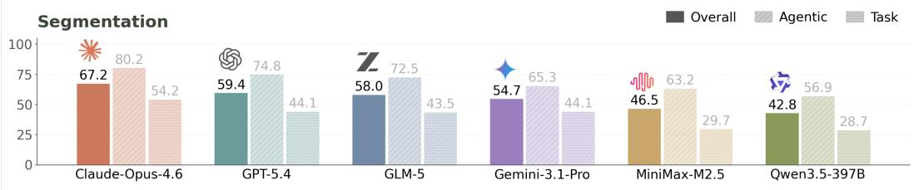

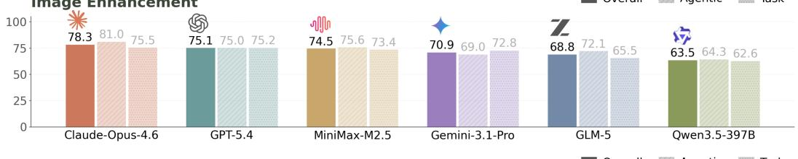

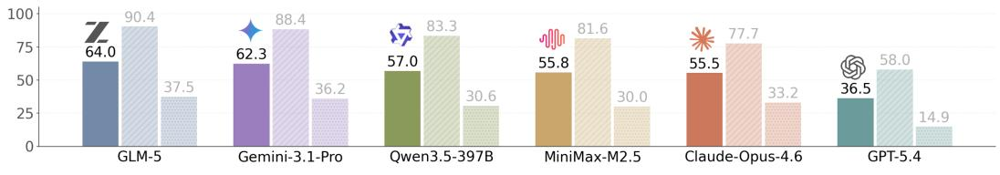

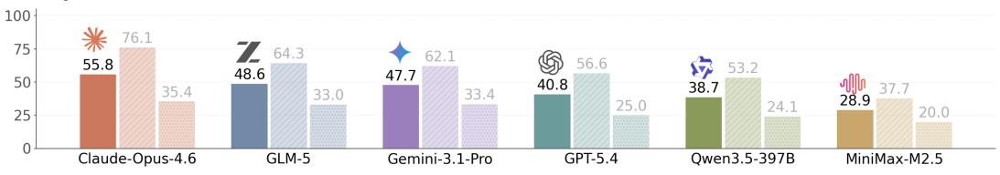

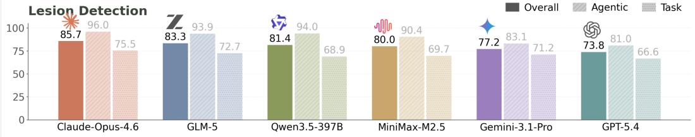  
Figure 9: Track-wise leaderboard breakdown. Overall, agentic, and task scores are shown for each evaluated agent across segmentation, image enhancement, VQA, report generation, and lesion detection. The breakdown shows that overall rank masks task-track specialization: Opus 4.6 leads most tracks, while GLM-5 leads VQA and several agents remain competitive on detection.

## I EXAMPLE BENCHMARKING TRACES

This section shows two real kidney tumor segmentation runs. For each tier, we show the task text, the run report, API usage, and one short conversation example. Local paths, backend names, and secret-like strings are redacted.

## I.1 LITE

## Task description.

```txt
Task: kidney tumor segmentation  
Tier: Lite  
Input: 20 public CT cases.  
Output: organ.nii.gz and lesion.nii.gz for each case.  
Guidance: the model is given; the agent researches it and follows S1-S5.  
Goal: make valid masks and submit them for held-out scoring.
```

## Detailed report.

```txt
Agent: Claude Opus 4.6
Tier: Lite
Task: kidney tumor segmentation

Scores:
    Agentic score: 0.7567
    Task score: 0.3073
    Overall score: 0.5320

Task metrics:
    Organ Dice: 0.9160
    Lesion Dice: 0.1045

Workflow scores:
    S1 Plan: 1.0000
    S2 Setup: 1.0000
    S3 Validate: 0.5000
    S4 Inference: 1.0000
    S5 Submit: 0.3166

Run cost:
    Estimated cost: $28.1496

Output checks:
    Submission valid: true
    Mask files valid: true
    CSV valid: false

Dominant error:
    E3 verification/recovery error
```

## API calls.

```txt
API calls: 55
Code runs: 54
Submit calls: 1
Input tokens: 1706325
Output tokens: 34063
Total tokens: 1740388
Estimated cost: $28.1496
Wall time: 1673.42 s

Phase summary:
S1 Plan: 14 calls, 0 errors, 99.0 s
S2 Setup: 3 calls, 1 error, 99.4 s
S3 Validate: 9 calls, 2 errors, 118.3 s
S4 Inference: 27 calls, 3 errors, 718.1 s
S5 Submit: 2 calls, 0 errors, 71.3 s
```

Example conversation.  
```txt
USER:
Begin. The model architecture has been chosen for you. Research it, then follow S1 through S5.

ASSISTANT:
I'll start by researching MONAI VISTA3D and setting up the environment.

TOOL CALL:
execute_code: ls <PUBLIC_DATA>/

TOOL OUTPUT:
patient_00000001 ... patient_00000020

ASSISTANT:
I inspected one CT case, checked the VISTA3D labels, and wrote a plan.
The plan uses right kidney label 5, left kidney label 14, and kidney mass label 129.

TOOL OUTPUT:
CUDA available: True
GPU: NVIDIA H100 80GB HBM3
Model loaded successfully on cuda:0
Parameters: 218.0M

ASSISTANT:
I ran a pilot case before full inference.

TOOL OUTPUT:
Preprocessed image shape: [1, 313, 227, 204]
Output shape: [1, 3, 313, 227, 204]
Label 5 voxels: 57564
Label 14 voxels: 48060
Label 129 voxels: 7

ASSISTANT:
The lesion result is small, but the pipeline runs. I will run all cases and verify the files.

TOOL OUTPUT:
Checking 20 patients...
patient_00000001: OK
patient_00000002: OK
patient_00000003: OK

ASSISTANT:
All masks exist. I will submit the results.
```
