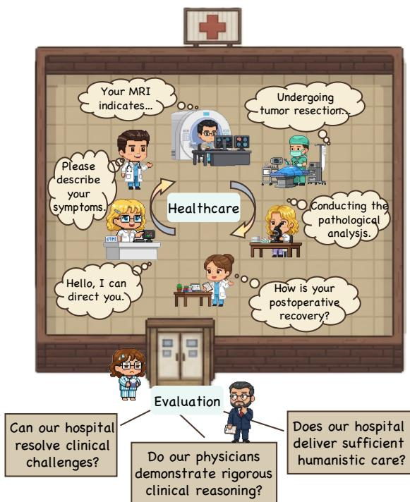
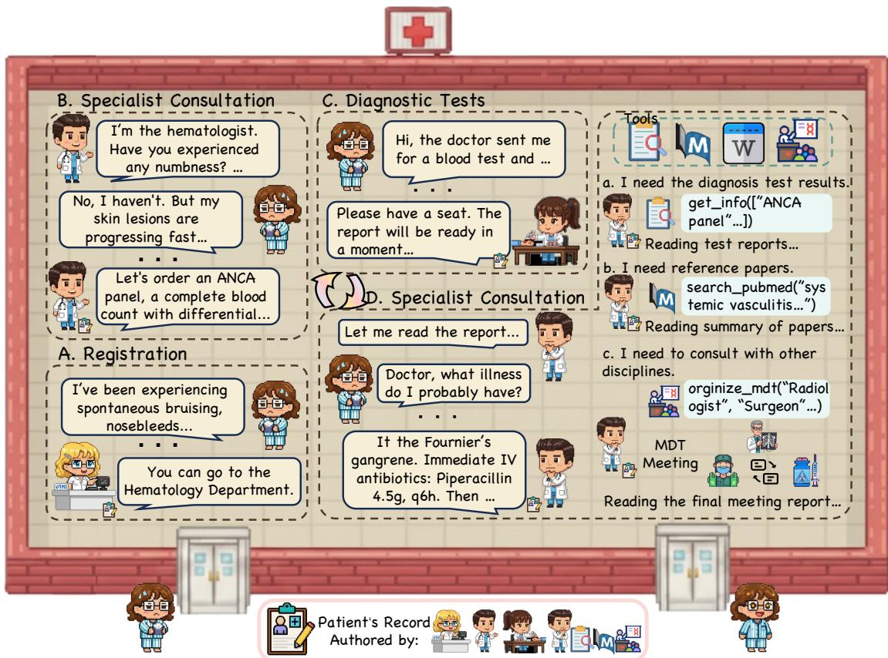
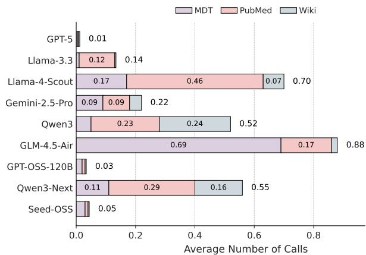
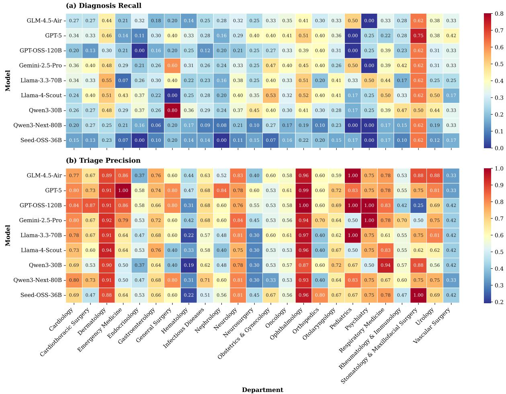

> **CP-Env: Evaluating Large Language Models on Clinical Pathways in a Controllable Hospital Environment**
>
> Yakun Zhu 等
>
> + 原文：[arXiv:2512.10206](https://arxiv.org/abs/2512.10206)
> + 本地核验 PDF：`outputs/papers/pdf/2512.10206_CP-Env.pdf`（Git 忽略）
> + 本文件为 MinerU（vlm）机器转换的英文阅读版，未翻译；逐字引用、公式与数据核验以 PDF 原文为准。转换日期 2026-08-25。

# CP-Env: Evaluating Large Language Models on Clinical Pathways in a Controllable Hospital Environment

Yakun Zhu $^{1,2*}$ Zhongzhen Huang $^{1*}$ Qianhan Feng $^{3*}$ Linjie Mu $^{1}$ Yannian Gu $^{1}$ Shaoting Zhang $^{1,4\dagger}$ Qi Dou $^{3\dagger}$ Xiaofan Zhang $^{1,2\dagger}$

$^{1}$ Shanghai Jiao Tong University, $^{2}$ Shanghai Innovation Institute, $^{3}$ The Chinese University of Hong Kong, $^{4}$ SenseTime Research

## Abstract

Medical care follows complex clinical pathways that extend beyond isolated physician-patient encounters, emphasizing decision-making and transitions between different stages. Current benchmarks focusing on static exams or isolated dialogues inadequately evaluate large language models (LLMs) in dynamic clinical scenarios. We introduce CP-Env, a controllable agentic hospital environment designed to evaluate LLMs across end-to-end clinical pathways. CP-Env simulates a hospital ecosystem with patient and physician agents, constructing scenarios ranging from triage and specialist consultation to diagnostic testing and multidisciplinary team meetings for agent interaction. Following real hospital adaptive flow of healthcare, it enables branching, long-horizon task execution. We propose a three-tiered evaluation framework encompassing Clinical Efficacy, Process Competency, and Professional Ethics. Results reveal that most models struggle with pathway complexity, exhibiting hallucinations and losing critical diagnostic details. Interestingly, excessive reasoning steps can sometimes prove counterproductive, while top models tend to exhibit reduced tool dependency through internalized knowledge. CP-Env advances medical AI agents development through comprehensive end-to-end clinical evaluation. We provide the benchmark and evaluation tools for further research and development $^{1}$ .

## 1 Introduction

Delivering effective and compassionate medical care extends far beyond isolated physician–patient encounters. Instead, it constitutes a complex clinical pathway involving repeated interactions among health-care providers and patients, ultimately forming a coherent service continuum. This pathway may include triage guidance (“Which department should I visit?”), specialty consultations (“What is causing my symptoms?”) and diagnostic workups (“What tests do I need?”), multidisciplinary team (MDT) discussions, treatment planning, and prognosis counseling (“How should I recover?”). Crucially, the process emphasizes decision-making and adaptive transitions between steps rather than executing a predetermined linear sequence.

  
Figure 1: CP-Env introduces a comprehensive agen-tic hospital environment designed to address the full spectrum of patients' healthcare needs through an in-tegrated evaluation framework. In contrast to existing benchmarks that rely on static examinations or isolated dialogue scenarios, CP-Env provides dynamic, interactive environments with sophisticated tool-use capabilities. This approach enables both the delivery of com-prehensive patient care and the rigorous evaluation of LLM-based agents across their performance in the com-plex, pathway-based clinical workflows characteristic of real-world hospital settings.

Recently, AI-based agents have begun to demonstrate their potential in complex real-world scenarios, where large language models (LLMs) execute long-horizon tasks in dynamic environments through sustained interactive engagement (Yue et al., 2024; Jia et al., 2025; Lu et al., 2025; Li et al., 2025). This paradigm is already reshaping biomedical domains such as genetic experiment design and clinical diagnosis (Qu et al., 2025; Jin et al., 2025; Qiu et al., 2025a), offering a new lens through which to rethink the role of AI in medicine. However, a fundamental question remains: how can end users and AI developers determine which systems perform best in health-care contexts?

Although a growing number of medical benchmarks have been introduced to evaluate LLM performance, they are limited in scope. Existing benchmarks either focus on medical knowledge and reasoning in examination-style formats (Jin et al., 2019, 2021) or assess conversational abilities in patient-oriented dialogues (Schmidgall et al., 2024; Fan et al., 2024). These approaches are insufficient for evaluating LLM-based agents because they: (1) lack dynamic environments and tool-use capabilities necessary for realistic, controlled comparisons; and (2) fail to capture real-world tasks that reflect the intricate clinical pathways of actual clinical practice.

To address these limitations, we introduce CP-Env, an open-ended environment in which agents play diverse healthcare roles and collaboratively engage in clinically realistic pathways to deliver patient care. Specifically, CP-Env encompasses: (1) Patient role simulation, where patients are provided with clinical presentations and assume seeking medical consultation. They interact with each attending physician and accurately report their known conditions during inquiries. (2) Clinical pathway navigation: Under expert guidance, we design four clinical scenarios following real-world healthcare pathways, including registration, specialist consultation, diagnostic testing, and advanced diagnosis and treatment. Physicians in each scenario are assigned tasks that mirror real clinical practice. Throughout this healthcare pathway, patient behavior is dynamic and responsive to physician requests—for instance, when a specialist orders laboratory tests, the patient proceeds to the laboratory department. Information between pathway nodes is managed through electronic medical records, and physicians can integrate clinical decision support tools to enhance their diagnostic and treatment decisions.

Subsequently, we establish a progressive three-tier evaluation framework tailored to this environment: (1) Clinical Efficacy: Can the agent successfully resolve medical problems? (2) Process Competency: Does the agent demonstrate sound and logically coherent problem-solving processes? (3) Professional Ethics: Does the agent maintain ethical compliance and deliver humanistic care in patient interactions? This framework comprehensively assesses LLMs' capabilities in this complex healthcare environment.

We conducted a comprehensive evaluation of outstanding models using CP-Env. Our experimental results reveal a clear performance stratification: (1) Proprietary models demonstrate significant advantages in Clinical Efficacy, showing the capability to reliably complete complex, branching clinical pathways. (2) We identified that a primary failure point for other models is the emergence of hallucinations in extended pathways, where they occasionally become myopically focused on immediate situational analysis rather than maintaining broader diagnostic workflow awareness. (3) Our multidimensional framework also reveals more nuanced insights: for instance, GPT-5 exhibits exceptional comprehensive clinical efficacy, while certain models demonstrate specific strengths in professional ethics (such as Seed-OSS's performance in empathy).

The main contributions of this paper are summarized as follows:

\- We introduce CP-Env, the first controllable agentic environment for evaluating LLM performance in dynamic, end-to-end clinical pathways.

\- We propose a multidimensional evaluation framework comprising Clinical Efficacy, Process Capability, and Professional Ethics to comprehensively assess medical agents beyond mere diagnostic accuracy.

\- We provide a comprehensive report on current LLMs, uncovering their characteristics in realistic medical scenarios, such as failures in pathway navigation and non-linear tool dependency patterns.

## 2 Related Works

Agentic Environment. Agentic Environments refer to LLM-driven dynamic simulations that replicate real-world scenarios. Generative Agents (Park et al., 2023) pioneers this field by developing cognitive architectures with memory, reflection, and planning capabilities, enabling multiple agents to exhibit believable social behaviors within a virtual town. Subsequent research evolves along two primary trajectories. The first focuses on large-scale social dynamics, scaling agent populations and grounding behaviors in real-world data to study macroscopic phenomena (Piao et al., 2025; Park et al., 2024; Mou et al., 2024). This line of work extends to urban dynamics (Bougie and Watanabe, 2025), social media (Park et al., 2022; Zhang et al., 2025b), and warfare simulation (Hua et al., 2023). The second trajectory emphasizes sophisticated professional environments, transforming simulations from behavioral observation platforms into agent evaluation and optimization systems (Almansoori et al., 2025; Zhang et al., 2025a). Agent Hospital (Li et al., 2024) enables physician agents to self-evolve through doctor-patient interactions and knowledge repository integration, while AgentsCourt (He et al., 2024) simulates judicial processes to evaluate and improve verdict prediction accuracy. However, current medical LLMs provide only chat functionality, failing to address patients' comprehensive healthcare needs. Our objective is to implement, evaluate, and optimize a hospital agent environment that guides patients through complete, end-to-end clinical pathways.

<table><tr><td>Benchmark</td><td>Task Type</td><td>Interaction Paradigm</td><td>Clinical Scope</td><td>Agent Roles</td><td>Tool Usage</td><td>Evaluation Metrics</td></tr><tr><td>PubMedQA (Jin et al., 2019)</td><td>Medical QA</td><td>Static</td><td>✕</td><td>✕</td><td>✕</td><td>Accuracy</td></tr><tr><td>MedQA (Jin et al., 2021)</td><td>Medical QA</td><td>Static</td><td>✕</td><td>✕</td><td>✕</td><td>Accuracy</td></tr><tr><td>Medbullets (Chen et al., 2025)</td><td>Medical QA</td><td>Static</td><td>✕</td><td>✕</td><td>✕</td><td>Accuracy</td></tr><tr><td>CMB-Clin (Wang et al., 2024)</td><td>Diagnosis</td><td>Static</td><td>Consultation</td><td>✕</td><td>✕</td><td>Clinical Efficacy</td></tr><tr><td>AI Hospital (Fan et al., 2024)</td><td>Diagnosis</td><td>Dialogue</td><td>Consultation &amp; Exams</td><td>Doctor-Patient</td><td>✕</td><td>Clinical Efficacy</td></tr><tr><td>AgentClinic (Schmidgall et al., 2024)</td><td>Diagnosis</td><td>Dialogue</td><td>Consultation &amp; Exams</td><td>Doctor-Patient</td><td>√</td><td>Accuracy &amp; Compliance</td></tr><tr><td>MedChain (Liu et al., 2024)</td><td>CDM</td><td>Dialogue</td><td>Sequential Healthcare</td><td>Doctor-Patient</td><td>√</td><td>Accuracy &amp; IoU</td></tr><tr><td>MedAgentSim (Almansoori et al., 2025)</td><td>Diagnosis</td><td>Dialogue &amp; Self-Evolving</td><td>Consultation &amp; Exams</td><td>Doctor-Patient</td><td>√</td><td>Accuracy</td></tr><tr><td>CP-Env</td><td>Full-Process Healthcare</td><td>Dynamic Agentic Environment</td><td>Full Clinical Pathway</td><td>Multi-Agent</td><td>√</td><td>Holistic (CE, PC, PE)</td></tr></table>

Table 1: Comparisons with existing medical benchmarks. We categorize existing benchmarks into two types based on the evolution of interaction modalities: Static Exam-based QA and Sequential Interactive Dialogue. CDM denotes clinical decision making. Unlike previous benchmarks that rely on static exam questions or single-scenario dialogues, CP-Env presents a pathway-based, dynamic environment. This is achieved through dynamic physician interactions, full-process healthcare delivery spanning interconnected pathway stages, and multi-dimensional evaluation metrics encompassing Clinical Efficacy, Process Competency, and Professional Ethics.

Medical Benchmark. Early medical benchmarks (Jin et al., 2019, 2021), derived from academic papers and licensing examinations, primarily employ multiple-choice questions to assess models' medical knowledge (Pal et al., 2022; Liu et al., 2023). The advent of LLMs drives significant evolution in benchmark design. First, multi-scenario expansion emerges, extending evaluations to specialized domains including medical calculators (Khandekar et al., 2024; Zhu et al., 2024), X-ray analysis (Zhou et al., 2024; Mu et al., 2025), and medical coding (Lee and Lindsey, 2024). Second, researchers move away from traditional examination questions toward authentic clinical cases that better align with real-world scenarios (Chen et al., 2024; Wang et al., 2023; zhao zy15, 2024). Third, as reasoning models evolve (OpenAI, 2024; DeepSeek-AI, 2025), enhanced reasoning requirements emerge. Researchers begin exploring scenarios and questions that demand stronger analytical capabilities (Zuo et al., 2025; Qiu et al., 2025b; Wu et al., 2025; Zhu et al., 2025a). Fourth, some studies move beyond static question-answering toward authentic doctor-patient conversations (Zhu et al., 2025b; Schmidgall et al., 2024; Fan et al., 2024). However, existing benchmarks either focus on medical knowledge and reasoning through examination-style formats or assess conversational abilities in patient-oriented dialogues. Yet, delivering effective and compassionate medical care extends far beyond isolated physician-patient encounters. CP-Env simulates the multi-party clinical pathway and comprehensively evaluates multiple dimensions of care delivery throughout the patient's journey.

## 3 Interactive Hospital Environment

To reflect real-world clinical pathways, we introduce CP-Env, an interactive environment based on real-world cases that integrates comprehensive information for evaluating the capabilities of LLMs in agentic hospital settings. This section elaborates the essential characteristics, including patient role simulation (Section 3.1), clinical pathway navigation (Section 3.2), and healthcare delivery mechanism (Section 3.3).

  
Figure 2: Illustration of the Interactive Hospital Environment Clinical Pathway. CP-Env integrates multiple physician roles, each executing specialized tasks through patient interactions. Upon hospital admission, patients are guided through the adaptive care pathway by different healthcare physicians, with medical records being progressively documented at each decision node. Physicians also utilize tools to collect multi-source information for clinical decision-making, ultimately facilitating patient recovery.

## 3.1 Patient Role Simulation

The effectiveness of the agentic hospital relies fundamentally on realistic patient simulation. We anchor our simulations in authentic clinical cases, with each patient role derived from comprehensive medical records. This rich, reliable medical data ensures accurate patient representation and authentic doctor-patient interactions, thereby maintaining clinical validity. We source data from top-tier medical journals containing detailed clinical encounter information (Zhu et al., 2025a).

Patients are configured to present to the hospital outpatients with specific physical complaints. During the clinical pathway, they engage in dialogue with physicians and are instructed to faithfully replicate the information they know. Each patient possesses knowledge of their general physical condition, including primary symptoms, medical history, and observable physical characteristics—all extracted from case records. To reflect real-world constraints, patients have limited access to comprehensive data, particularly laboratory and diagnostic test results, which is available only after physicians order the examinations.

## 3.2 Clinical Pathway Navigation

To comprehensively evaluate LLM capabilities in the simulated hospital environment, we design a multi-stage simulation scenario that mirrors real-world clinical pathways. As illustrated in Figure 2, the simulation encompasses the patient's journey through several decision nodes within the clinical pathway (A-D). In each stage, the evaluated LLMs assume specific physician roles and perform defined clinical tasks through interactions with both the patient agent and the hospital environment. Importantly, the pathway is adaptive and branching, allowing for dynamic interactions and iterative reasoning that reflect the complexity of actual clinical decision-making.

Stage A: Registration and Triage. This initial stage involves the interaction between the patient and the triage nurse. Upon arrival at the outpatient department, the patient presents their symptoms (e.g., spontaneous bruising). The triage nurse needs to conduct a preliminary assessment through empathetic dialogue, evaluate the patient's general condition and symptom severity, and document all pertinent information in the medical record. Subsequently, a primary task is to recommend the appropriate specialist department for the patient's next stage of care.

Stage B: Specialist Consultation. Following triage, the patient enters the specific department and interacts with the designated specialist. In this stage, the specialist needs to conduct a comprehensive anamnesis through multi-turn dialogue, exploring the patient's medical history and specific signs (e.g., numbness or lesion progression) while documenting findings in the medical record. Unlike initial triage, this encounter requires deeper domain expertise to differentiate nuanced presentations. The primary task here is hypothesis generation and examination ordering. Based on the dialogue, the specialist must formulate initial diagnostic hypotheses and order appropriate investigations (e.g., an ANCA panel) to verify these suspicions, facilitating progression to subsequent diagnostic procedures.

Stage C: Diagnostic Testing. Following the specialist's test orders, the hospital environment generates corresponding laboratory and imaging results. To access these results from the medical records, the specialist needs to employ information retrieval tools. At this stage, a critical task is result interpretation and synthesis. Specifically, the LLM must parse raw medical results, identify abnormal indicators, and integrate these objective findings with the subjective information collected during Stage B. This scenario evaluates the LLM's capacity to ground its reasoning in multimodal clinical data, rather than depending solely on conversation.

Stage D: Advanced Diagnosis and Treatment. This final stage yields the definitive clinical outcome after the comprehensive multi-stage assessment. With test results, the specialist needs to validate previous hypotheses and refine the differential diagnosis. When evidence supports high diagnostic certainty, they can determine the definitive diagnosis. If evidence remains inconclusive, additional investigations may be warranted, returning the patient to Stage B. For complex cases, the LLM can facilitate a MDT meeting, enabling collaboration with experts from complementary disciplines (e.g., radiology, surgery) to deliberate on diagnostic and treatment strategies. The specialist can also retrieve pertinent literature from external databases like PubMed to strengthen the evidence base for decision-making. This stage culminates in a comprehensive Final Clinical Report containing the confirmed diagnosis, evidence-based medication regimen, and structured follow-up protocol.

## 3.3 Healthcare Delivery Mechanism

Hospital patient care encompasses complex, clinical pathways with adaptive branching spanning multiple stages. Patients frequently undergo multiple examinations, require iterative consultations, and attend unscheduled follow-up visits, creating dynamic care trajectories. To authentically simulate real-world healthcare processes, CP-Env implements medical record management to ensure seamless transitions across scenarios, complemented by comprehensive tool support.

Medical Record Management. Dynamic healthcare delivery generates complex, nonlinear patient data throughout the care continuum. In real-world clinical settings, comprehensive record management protocols are rigorously implemented, including mandatory documentation for every clinical encounter. CP-Env adopts this medical record management paradigm by requiring physician agents to document clinical reports after each patient interaction, with all reports stored in the patient's medical record. During subsequent follow-up visits or appointments, incoming physician agents can directly assess the patient's medical history and current status through previous clinical reports.

Multidisciplinary Team Collaboration. Clinical practice relies on multidisciplinary collaboration for complex diagnoses. When cases exceed single-specialty capabilities, multidisciplinary team (MDT) meetings convene physicians from various disciplines to provide diverse clinical perspectives. We replicate this collaborative approach by allowing attending physicians to assemble MDT teams with specialized expertise throughout the diagnostic process. Through iterative discussions, these teams generate comprehensive meeting analyses stored in the medical record that inform attending physicians' decision-making across key clinical

domains.

Clinical Tool Orchestration. In clinical practice, diagnostic decision-making requires physicians to synthesize heterogeneous data from multiple sources. CP-Env incorporates a suite of clinical tools that mirror real-world workflows. The diagnostic process initiates with patient-physician dialogues, enabling elicitation of symptomatology through verbal communication. Subsequently, physicians utilize information tools to access laboratory results, extracting pertinent reports from medical records repositories. To support evidence-based practice, CP-Env integrates real-time queries to medical knowledge bases, including PubMed and Wikipedia. Furthermore, it facilitates MDT consultations, enabling physicians to leverage cross-departmental expertise through discussions and MDT reports.

## 4 Agent Evaluation Framework

Leveraging the Interactive Hospital Environment established in the previous chapter, we systematically collected comprehensive interaction data from LLMs throughout the complete healthcare workflow. To conduct a rigorous and multifaceted evaluation of LLM capabilities within agentic hospital settings, we developed an Agent Evaluation Framework guided by three progressive research questions: (1) Clinical Efficacy: Can the agent successfully resolve medical problems? (2) Process Competency: Does the agent demonstrate sound and logically coherent problem-solving processes? (3) Professional Ethics: Does the agent maintain ethical compliance and deliver humanistic care in patient interactions?

## 4.1 Clinical Efficacy

Clinical efficacy in real-world settings constitutes the fundamental benchmark for healthcare evaluation. Accordingly, LLM agents must prioritize optimizing patient outcomes through accurate diagnosis and therapeutic interventions.

Work Completion (WC) evaluates whether LLMs can comprehensively fulfill the whole hospital workflow.

Diagnosis Recall@k (DR@k) evaluates whether the top k diagnosis contain the correct diagnosis.

Triage Precision (TP) measures the appropriateness of recommended medical departments.

## 4.2 Process Competency

A competent physician not only provides accurate diagnoses but also demonstrates rigorous clinical reasoning and effective utilization of diagnostic tools. CP-Env evaluates LLMs across information inquiry and gathering, clinical reasoning and diagnostic logic, and medical record documentation, which comprehensively examines LLMs' ability to synthesize complex medical information and utilize clinical tools, providing a holistic evaluation of their medical competency.

Inquiry Sufficiency (IS) measures the extent of essential diagnostic information obtained through clinical inquiry.

Logic Coherence (LC) quantifies the completeness and consistency of diagnostic reasoning chains throughout the healthcare continuum.

Record Compliance (RC) evaluates the quality and completeness of physicians' clinical documentation.

Investigation Coverage (IC) quantifies the IoU between physician-ordered tests and the ground-truth case's diagnostic tests.

Result Utilization (RU) measures the proportion of ordered test results actively utilized by the physician.

## 4.3 Professional Ethics

Practicing patient-centered care requires physicians to extend their role beyond accurate diagnosis to address patients' psychological vulnerability with empathy, and appropriate professional boundaries. To evaluate these abilities in LLMs, CP-Env conducts comprehensive assessments of patient encounter dialogues.

Privacy Safeguard (PS) assesses physicians' capacity to safeguard patient privacy during diagnosis.

Treatment Individualization (TI) quantifies how well treatment plans incorporate patient-specific factors.

Empathic Dialogue (ED) evaluates the LLM's demonstration of care and compassion toward patients.

Follow-up Planning (FP) evaluates the quality and appropriateness of follow-up planning.

## 5 Experiments

## 5.1 Settings

Agent Models. Agent Models. To comprehensively evaluate LLMs' capabilities in the hospital environment, we selected multiple models to serve as physician agent backbones. Given that CP-Env requires physicians to dynamically leverage external tools, function-calling capability constitutes the primary selection criterion. Our evaluation encompasses both open-source and proprietary models. The open-source models included Seed-OSS-36B-Instruct (Seed-OSS; Team, 2025a), Qwen3-30B-A3B-Instruct-2507 (Qwen3; Team, 2025b), Qwen3-Next-80B-A3B-Instruct (Qwen3-Next; Team, 2025b), GLM-4.5-Air (Z.ai, 2025), Llama-3.3-70B-Instruct (Llama-3.3; Meta, 2025a), Llama-4-Scout-17B-16E-Instruct (Llama-4; Meta, 2025b), and GPT-OSS-120B (OpenAI, 2025a). Additionally, we incorporated state-of-the-art proprietary models, specifically Gemini-2.5-Pro (Deepmind, 2025) and GPT-5 (OpenAI, 2025b). Unfortunately, existing open-source medical models generally lack reliable function-calling capabilities, and Qwen3 reasoning models cannot handle long workflow tasks effectively; therefore, they were excluded from our evaluation. Furthermore, to establish a unified and equitable testing platform, we selected GPT-OSS-120B as the patient agent backbone due to its cost-effectiveness, accessibility, and wide recognition.

<table><tr><td rowspan="2">Models</td><td colspan="4">Clinical Efficacy</td><td colspan="5">Process Competency</td><td colspan="4">Professional Ethics</td></tr><tr><td>WC</td><td>DR@3</td><td>DR@5</td><td>TP</td><td>IS</td><td>LC</td><td>RC</td><td>IC</td><td>RU</td><td>PS</td><td>TI</td><td>ED</td><td>FP</td></tr><tr><td colspan="14">Open Source LLMs</td></tr><tr><td>Seed-OSS 36B</td><td>80.11</td><td>17.38</td><td>17.92</td><td>67.76</td><td>51.20</td><td>64.74</td><td>77.60</td><td>24.29</td><td>46.99</td><td>98.14</td><td>31.08</td><td>50.16</td><td>38.31</td></tr><tr><td>Qwen3 30B</td><td>85.03</td><td>39.67</td><td>40.55</td><td>66.89</td><td>44.50</td><td>8.81</td><td>78.73</td><td>27.26</td><td>70.89</td><td>99.13</td><td>17.29</td><td>24.75</td><td>41.42</td></tr><tr><td>GPT-OSS 120B</td><td>76.28</td><td>29.62</td><td>31.15</td><td>72.79</td><td>72.37</td><td>11.98</td><td>86.01</td><td>9.96</td><td>18.56</td><td>98.80</td><td>22.37</td><td>49.75</td><td>47.65</td></tr><tr><td>Qwen3-Next 80B</td><td>83.83</td><td>21.20</td><td>22.30</td><td>70.05</td><td>59.19</td><td>54.89</td><td>75.75</td><td>21.49</td><td>66.71</td><td>85.90</td><td>12.33</td><td>45.76</td><td>36.12</td></tr><tr><td>GLM-4.5-Air</td><td>84.70</td><td>35.41</td><td>36.39</td><td>71.58</td><td>65.56</td><td>42.90</td><td>69.42</td><td>21.86</td><td>93.27</td><td>95.41</td><td>19.51</td><td>57.44</td><td>39.34</td></tr><tr><td>Llama-3.3 70B</td><td>90.71</td><td>39.67</td><td>40.98</td><td>69.84</td><td>64.17</td><td>19.22</td><td>55.14</td><td>25.44</td><td>93.31</td><td>93.88</td><td>13.63</td><td>49.17</td><td>35.85</td></tr><tr><td>Llama-4 Scout</td><td>74.86</td><td>39.67</td><td>41.42</td><td>68.63</td><td>60.85</td><td>32.00</td><td>56.20</td><td>24.24</td><td>93.17</td><td>92.73</td><td>14.37</td><td>48.85</td><td>17.27</td></tr><tr><td colspan="14">Proprietary LLMs</td></tr><tr><td>Gemini-2.5-Pro</td><td>94.86</td><td>39.45</td><td>40.66</td><td>73.22</td><td>62.86</td><td>46.56</td><td>77.88</td><td>5.30</td><td>12.36</td><td>99.34</td><td>21.56</td><td>64.21</td><td>39.84</td></tr><tr><td>GPT-5</td><td>93.33</td><td>44.81</td><td>47.43</td><td>75.41</td><td>85.28</td><td>20.69</td><td>94.48</td><td>3.13</td><td>6.96</td><td>99.73</td><td>30.73</td><td>50.71</td><td>51.37</td></tr></table>

Table 2: Performance of Different Large Language Models on the CP-Env Benchmark. The evaluation encompasses clinical efficacy, process competency, and professional ethics. Bold scores indicate the best performance, while underlined scores represent the second-best.

## 5.2 Main Results

Table 2 presents the main evaluation results of LLMs on CP-Env. The results reveal a distinct performance hierarchy: proprietary models demonstrate substantial advantages over their open-source counterparts, with GPT-5 achieving superior performance across key dimensions, including navigating complex clinical pathways, reasoning consistency, and patient empathy. Gemini-2.5-Pro exhibits comparable excellence, while open-source models show more limited capabilities.

Performance at Clinical Efficacy. At CE, only Gemini-2.5-Pro and GPT-5 perform well on WC, successfully navigating the complete clinical pathways, while other models presented limitations. A primary failure observed is cognitive hallucination during extended workflows—models become entrapped in reasoning loops and fail to advance logically through sequential steps, which is particularly pronounced in Llama-4 and GPT-OSS-120B. Some reasoning models (e.g., Qwen3-30B-A3B-Thinking) exhibit it so severely that they are excluded from evaluation. Additionally, certain models (e.g., GLM-4.5-Air) suffer from intermittent tool-calling format errors. In the DR, GPT-5 achieves superior performance through its extensive knowledge base and well-calibrated reasoning capabilities. Llama and Qwen3-30B ranked second, with Qwen3-30B demonstrating remarkably strong performance despite its smaller size. Notably, Qwen3-Next underperformed relative to expectations. Comparative analysis revealed that while Qwen3-Next provided detailed responses with comprehensive reasoning chains, occasional hallucinations led to significant deviations from clinical pathways. In contrast, Qwen3-30B's more concise and direct reasoning approach proved sufficient for achieving favorable outcomes, while GPT-5 demonstrated appropriate reasoning restraint without excessive elaboration. These findings parallel observations in real clinical settings, where excessive analytical complexity does not necessarily correlate with improved patient outcomes. This suggests that our benchmark rewards judicious and targeted reasoning over exhaustive but potentially error-prone analysis.

Performance at Process Competency. Overall, OpenAI models demonstrate superior medical competency with substantial advantages over competitors. In IS, GPT-5 and GPT-OSS-120B extract the most comprehensive patient information through inquiries, highlighting their proficiency in clinical dialogue, while other models clustered within a narrower performance range behind. For RC, OpenAI models maintain leadership by producing standardized medical documentation with comprehensive content and precise terminology, reflecting superior medical literacy compared to other models. However, Seed-OSS and Qwen3-Next excel in logical reasoning tasks (LC). Seed-OSS's advantage stems from its thinking model method, while Qwen3-Next exhibited robust reasoning capabilities consistent with prior analysis. Notably, hallucinations during extended tasks degrade overall performance, suggesting that extensive thinking processes do not necessarily improve outcomes in long-sequence tasks. It should be noted that GPT-5's lower LC performance may not reflect its true capabilities, as the model's reasoning processes are concealed during inference. In IC and RU, GPT-5 and Gemini-2.5-Pro adopted conservative approaches, ordering excessive diagnostic tests compared to real cases, resulting in lower efficiency scores. While other models performed more reasonably, all LLMs demonstrated over-testing tendencies. RU reveals that GLM-4.5-air and LLaMA models showed more judicious diagnostic test utilization, whereas GPT exhibited redundant test-ordering patterns.

Performance at Professional Ethics. All models perform well in privacy protection PS. However, Seed-OSS excels in addressing personalized user needs TI and achieves outstanding ED performance, alongside Gemini-2.5-Pro and GPT-5, which lead in user interactions. GLM-4.5-Air performs commendably in ED as well. Regarding follow-up management, OpenAI's GPT-5 and GPT-OSS-120B significantly outperform other models. In summary, OpenAI models exhibit robust medical competency, while Seed-OSS excels in user-centered interactions.

  
Figure 3: Comparison of average tool usage frequency and types across different models.

## 5.3 Tool Utilization

To comprehensively analyze tool utilization strategies across different models and their relationship with diagnostic performance, we calculated the average frequency of tool invocations (MDT, PubMed, and Wiki) for each model during medical consultation dialogues, as presented in Figure 3. Models are ordered by DR scores.

Our analysis reveals a U-shaped relationship between tool usage and diagnostic accuracy, rather than a simple positive correlation. Specifically, (1) High-performing models with minimal tool usage: GPT-5, which achieved the highest diagnostic accuracy, invoked tools negligibly during experiments. Similarly, Gemini-2.5-Pro demonstrated highly selective tool utilization. These findings suggest that advanced models have either internalized sufficient medical knowledge or developed superior reasoning capabilities for accurate diagnosis without external resources. (2) Mid-tier models with intensive tool utilization: Models with intermediate accuracy, such as Llama-4-Scout and GLM-4.5-Air, exhibited the highest tool utilization rates. GLM-4.5-Air recorded an average invocation frequency of 0.88, with a marked preference for the MDT tool (0.69 invocations). In contrast, Llama-4-Scout, with 0.70 total invocations, favored PubMed literature retrieval (0.46 invocations). This pattern suggests that these models compensate for uncertainties in their medical knowledge by actively leveraging tools for validation and information. The divergent tool preferences also reflect architectural differences: GLM-4.5-Air prioritize di agnostic tools, while Llama-4-Scout emphasize literature evidence. (3) Low-performing models with limited tool engagement: Models with lower accuracy (e.g., GPT-OSS-120B and Seed-OSS-36B) demonstrated minimal tool invocation rates (0.03 and 0.04, respectively). This pattern likely reflects fundamental limitations in intent recognition and instruction-following capabilities rather than a lack of need for external resources. These models often fail to accurately determine when tool assistance is necessary or how to effectively utilize available tools. For instance, some models struggle to formulate appropriate search queries, frequently generating overly complex or poorly structured queries that yield no relevant results from PubMed, thereby limiting their diagnostic capabilities.

<table><tr><td>Model</td><td>Avg.E. Nums</td><td>Avg.E. Tokens</td><td>Avg.T. Nums</td><td>Avg.T. Tokens</td></tr><tr><td>Llama-3.3 70B</td><td>3.06</td><td>454.36</td><td>3.11</td><td>145.86</td></tr><tr><td>Llama-4 Scout</td><td>3.21</td><td>534.57</td><td>2.74</td><td>194.59</td></tr><tr><td>Qwen3 30B</td><td>3.54</td><td>478.99</td><td>2.22</td><td>215.09</td></tr><tr><td>Qwen3-Next 80B</td><td>3.09</td><td>532.89</td><td>2.37</td><td>224.31</td></tr><tr><td>GLM-4.5-Air</td><td>3.02</td><td>774.35</td><td>3.51</td><td>220.33</td></tr><tr><td>GPT-OSS 120B</td><td>3.20</td><td>641.92</td><td>2.47</td><td>259.74</td></tr><tr><td>Gemini-2.5-Pro</td><td>3.14</td><td>653.55</td><td>2.67</td><td>244.52</td></tr><tr><td>GPT-5</td><td>3.33</td><td>1089.09</td><td>2.35</td><td>461.54</td></tr><tr><td>Seed-OSS 36B</td><td>3.35</td><td>2843.19</td><td>2.66</td><td>1066.52</td></tr></table>

Table 3: Average encounters, turns, and token consumption across models. Avg.E. means average encounters per patient; Avg.T. means average dialogue turns per encounter.

These findings have important implications for medical agent design. For medium-scale models, optimizing tool utilization pipelines represents a critical pathway to improved performance. Conversely, for state-of-the-art models, enhancing internal reasoning mechanisms may yield greater benefits than integrating additional external knowledge.

## 5.4 Dialogue Efficiency

To evaluate computational efficiency and interaction patterns of different models in our agentic hospital environment, we analyze encounters per patient, dialogue turns per encounter, and token consumption across various LLMs. Table 3 presents comprehensive dialogue efficiency statistics.

The results reveal distinct consultation patterns across models despite modest overall differences. Qwen3-30B favors frequent consultations (3.54 encounters per patient), reflecting a cautious, stepby-step approach. In contrast, GLM-4.5-Air pursues fewer encounters but with deeper dialogue (3.51 turns per encounter), indicating comprehensive single-session exploration. This creates a complementary pattern: while Qwen3-30B shows the highest encounter frequency, it exhibits the lowest dialogue depth (2.22 turns per encounter), suggesting models maintain similar total information volumes per patient through different interaction strategies—either multiple focused consultations or fewer comprehensive sessions.

Token usage patterns strongly correlate with models' reasoning characteristics. Reasoning models demonstrate substantially higher consumption, with Seed leading at the highest token usage, resulting in significantly elevated computational costs. Other reasoning models show more restrained consumption: GPT-5 uses 1,089.09 tokens per encounter while Gemini-2.5-Pro maintains conservative usage at 653.55 tokens, suggesting more efficient reasoning mechanisms or superior output control.

In our benchmark involving complex clinical pathways, extensive reasoning may introduce counterproductive effects. Models with advanced reasoning occasionally become myopically focused on immediate situational analysis rather than maintaining broader pathway awareness. This reasoning trap leads to inefficient resource allocation and potentially suboptimal clinical pathway decisions.

## 6 Conclusion

This paper introduces CP-Env, a controllable multi-agent hospital environment for evaluating LLMs in end-to-end clinical pathways. Unlike existing benchmarks limited to static tasks, CP-Env assesses models through realistic clinical simulations using a three-tiered framework: Clinical Efficacy, Process Competency, and Professional Ethics. Our experiments reveal that proprietary models significantly outperform open-source alternatives in navigating complex clinical pathways, with hallucinations during extended processes being the primary failure mode. Notably, excessive analytical reasoning proves counterproductive in pathway decision-making. CP-Env provides essential benchmarks for developing more reliable medical AI agents, advancing the field beyond isolated evaluation scenarios toward comprehensive clinical pathway assessment.

## References

Mohammad Almansoori, Komal Kumar, and Hisham Cholakkal. 2025. Self-evolving multi-agent simulations for realistic clinical interactions. arXiv preprint arXiv:2503.22678.

Nicolas Bougie and Narimasa Watanabe. 2025. Citysim: Modeling urban behaviors and city dynamics with large-scale llm-driven agent simulation. arXiv preprint arXiv:2506.21805.

Hanjie Chen, Zhouxiang Fang, Yash Singla, and Mark Dredze. 2024. Benchmarking large language models on answering and explaining challenging medical questions. arXiv preprint arXiv:2402.18060.

Hanjie Chen, Zhouxiang Fang, Yash Singla, and Mark Dredze. 2025. Benchmarking large language models on answering and explaining challenging medical questions. In Proceedings of the 2025 Conference of the Nations of the Americas Chapter of the Association for Computational Linguistics: Human Language Technologies (Volume 1: Long Papers), pages 3563–3599.

Google Deepmind. 2025. Gemini 2.5 pro.

DeepSeek-AI. 2025. Deepseek-r1: Incentivizing reasoning capability in llms via reinforcement learning. Preprint, arXiv:2501.12948.

Zhihao Fan, Jialong Tang, Wei Chen, Siyuan Wang, Zhongyu Wei, Jun Xi, Fei Huang, and Jingren Zhou. 2024. Ai hospital: Benchmarking large language models in a multi-agent medical interaction simulator. arXiv preprint arXiv:2402.09742.

Zhitao He, Pengfei Cao, Chenhao Wang, Zhuoran Jin, Yubo Chen, Jiexin Xu, Huaijun Li, Xiaojian Jiang, Kang Liu, and Jun Zhao. 2024. Agentscourt: Building judicial decision-making agents with court debate simulation and legal knowledge augmentation. arXiv preprint arXiv:2403.02959.

Wenyue Hua, Lizhou Fan, Lingyao Li, Kai Mei, Jianchao Ji, Yingqiang Ge, Libby Hemphill, and Yongfeng Zhang. 2023. War and peace (waragent): Large language model-based multi-agent simulation of world wars. arXiv preprint arXiv:2311.17227.

Zheng Jia, Shengbin Yue, Wei Chen, Siyuan Wang, Yidong Liu, Yun Song, and Zhongyu Wei. 2025. Ready jurist one: Benchmarking language agents for legal intelligence in dynamic environments. arXiv preprint arXiv:2507.04037.

Di Jin, Eileen Pan, Nassim Oufattole, Wei-Hung Weng, Hanyi Fang, and Peter Szolovits. 2021. What disease does this patient have? a large-scale open domain question answering dataset from medical exams. Applied Sciences, 11(14):6421.

Qiao Jin, Bhuwan Dhingra, Zhengping Liu, William W Cohen, and Xinghua Lu. 2019. Pubmedqa: A dataset for biomedical research question answering. arXiv preprint arXiv:1909.06146.

Ruofan Jin, Yucheng Guo, Yuanhao Qu, Ming Yang, Chun Shang, Qirong Yang, Linlin Chao, Yi Zhou, Ruilai Xu, Ziyao Xu, and 1 others. 2025. Biolab: End-to-end autonomous life sciences research with multi-agents system integrating biological foundation models. bioRxiv, pages 2025–09.

Nikhil Khandekar, Qiao Jin, Guangzhi Xiong, Soren Dunn, Serina Applebaum, Zain Anwar, Maame Sarfo-Gyamfi, Conrad Safranek, Abid Anwar, Andrew Zhang, and 1 others. 2024. Medcalc-bench: Evaluating large language models for medical calculations. Advances in Neural Information Processing Systems, 37:84730–84745.

Simon A Lee and Timothy Lindsey. 2024. Can large language models abstract medical coded language? arXiv preprint arXiv:2403.10822.

Junkai Li, Yunghwei Lai, Weitao Li, Jingyi Ren, Meng Zhang, Xinhui Kang, Siyu Wang, Peng Li, Ya-Qin Zhang, Weizhi Ma, and 1 others. 2024. Agent hospital: A simulacrum of hospital with evolvable medical agents. arXiv preprint arXiv:2405.02957.

Peiji Li, Jiasheng Ye, Yongkang Chen, Yichuan Ma, Zijie Yu, Kedi Chen, Ganqu Cui, Haozhan Li, Jiacheng Chen, Chengqi Lyu, and 1 others. 2025. Internbootcamp technical report: Boosting llm reasoning with verifiable task scaling. arXiv preprint arXiv:2508.08636.

Jie Liu, Wenxuan Wang, Zizhan Ma, Guolin Huang, Yihang SU, Kao-Jung Chang, Wenting Chen, Haoliang Li, Linlin Shen, and Michael Lyu. 2024. Medchain: Bridging the gap between llm agents and clinical practice through interactive sequential benchmarking. arXiv preprint arXiv:2412.01605.

Junling Liu, Peilin Zhou, Yining Hua, Dading Chong, Zhongyu Tian, Andrew Liu, Helin Wang, Chenyu You, Zhenhua Guo, Lei Zhu, and 1 others. 2023. Benchmarking large language models on cmexam-a comprehensive chinese medical exam dataset. Advances in Neural Information Processing Systems, 36:52430–52452.

Siyuan Lu, Zechuan Wang, Hongxuan Zhang, Qintong Wu, Leilei Gan, Chenyi Zhuang, Jinjie Gu, and Tao Lin. 2025. Don't just fine-tune the agent, tune the environment. arXiv preprint arXiv:2510.10197.

Meta. 2025a. Llama 3.3. https://www.llama.com/docs/model-cards-and-prompt-formats/llama3\_3/.

Meta. 2025b. Llama 4. https://www.llama.com/docs/model-cards-and-prompt-formats/llama4/.

Xinyi Mou, Zhongyu Wei, and Xuanjing Huang. 2024. Unveiling the truth and facilitating change: Towards agent-based large-scale social movement simulation. arXiv preprint arXiv:2402.16333.

Linjie Mu, Zhongzhen Huang, Shengqian Qin, Yakun Zhu, Shaoting Zhang, and Xiaofan Zhang. 2025. Mmxu: A multi-modal and multi-x-ray understanding dataset for disease progression. arXiv preprint arXiv:2502.11651.

OpenAI. 2024. Learning to reason with llms.

OpenAI. 2025a. gpt-oss-120b & gpt-oss-20b model card. Preprint, arXiv:2508.10925.

OpenAI. 2025b. Introducing gpt-5.

Ankit Pal, Logesh Kumar Umapathi, and Malaikannan Sankarasubbu. 2022. Medmcqa: A large-scale multi-subject multi-choice dataset for medical domain question answering. In Conference on health, inference, and learning, pages 248–260. PMLR.

Joon Sung Park, Joseph O'Brien, Carrie Jun Cai, Meredith Ringel Morris, Percy Liang, and Michael S Bernstein. 2023. Generative agents: Interactive simulacra of human behavior. In Proceedings of the 36th annual acm symposium on user interface software and technology, pages 1–22.

Joon Sung Park, Lindsay Popowski, Carrie Cai, Meredith Ringel Morris, Percy Liang, and Michael S Bernstein. 2022. Social simulacra: Creating populated prototypes for social computing systems. In Proceedings of the 35th Annual ACM Symposium on User Interface Software and Technology, pages 1–18.

Joon Sung Park, Carolyn Q Zou, Aaron Shaw, Benjamin Mako Hill, Carrie Cai, Meredith Ringel Morris, Robb Willer, Percy Liang, and Michael S Bernstein. 2024. Generative agent simulations of 1,000 people. arXiv preprint arXiv:2411.10109.

Jinghua Piao, Yuwei Yan, Jun Zhang, Nian Li, Junbo Yan, Xiaochong Lan, Zhihong Lu, Zhiheng Zheng, Jing Yi Wang, Di Zhou, and 1 others. 2025. Agentsociety: Large-scale simulation of llm-driven generative agents advances understanding of human behaviors and society. arXiv preprint arXiv:2502.08691.

Pengcheng Qiu, Chaoyi Wu, Junwei Liu, Qiaoyu Zheng, Yusheng Liao, Haowen Wang, Yun Yue, Qianrui Fan, Shuai Zhen, Jian Wang, and 1 others. 2025a. Evolving diagnostic agents in a virtual clinical environment. arXiv preprint arXiv:2510.24654.

Pengcheng Qiu, Chaoyi Wu, Shuyu Liu, Weike Zhao, Ya Zhang, Yanfeng Wang, and Weidi Xie. 2025b. Quantifying the reasoning abilities of llms on real-world clinical cases. arXiv preprint arXiv:2503.04691.

Yuanhao Qu, Kaixuan Huang, Ming Yin, Kanghong Zhan, Dyllan Liu, Di Yin, Henry C Cousins, William A Johnson, Xiaotong Wang, Mihir Shah, and 1 others. 2025. Crispr-gpt for agentic automation of gene-editing experiments. Nature Biomedical Engineering, pages 1–14.

Samuel Schmidgall, Rojin Ziaei, Carl Harris, Eduardo Reis, Jeffrey Jopling, and Michael Moor. 2024. Agentclinic: a multimodal agent benchmark to evaluate ai in simulated clinical environments. arXiv preprint arXiv:2405.07960.

ByteDance Seed Team. 2025a. Seed-oss open-source models. https://github.com/ByteDance-Seed/seed-oss.

Qwen Team. 2025b. Qwen3 technical report. Preprint, arXiv:2505.09388.

Xidong Wang, Guiming Chen, Song Dingjie, Zhang Zhiyi, Zhihong Chen, Qingying Xiao, Junying Chen, Feng Jiang, Jianquan Li, Xiang Wan, and 1 others. 2024. Cmb: A comprehensive medical benchmark in chinese. In Proceedings of the 2024 Conference of the North American Chapter of the Association for Computational Linguistics: Human Language Technologies (Volume 1: Long Papers), pages 6184–6205.

Xidong Wang, Guiming Hardy Chen, Dingjie Song, Zhiyi Zhang, Zhihong Chen, Qingying Xiao, Feng Jiang, Jianquan Li, Xiang Wan, Benyou Wang, and 1 others. 2023. Cmb: A comprehensive medical benchmark in chinese. arXiv preprint arXiv:2308.08833.

Kevin Wu, Eric Wu, Rahul Thapa, Kevin Wei, Angela Zhang, Arvind Suresh, Jacqueline J Tao, Min Woo Sun, Alejandro Lozano, and James Zou. 2025. Med-casereasoning: Evaluating and learning diagnostic reasoning from clinical case reports. arXiv preprint arXiv:2505.11733.

Murong Yue, Wenhan Lyu, Wijdane Mifdal, Jennifer Suh, Yixuan Zhang, and Ziyu Yao. 2024. Mathvc: An llm-simulated multi-character virtual classroom for mathematics education. arXiv preprint arXiv:2404.06711.

Z.ai. 2025. Glm-4.5: Reasoning, coding, and agentic abilities. https://z.ai/blog/glm-4.5.

Kaiyuan Zhang, Jiaqi Li, Yueyue Wu, Haitao Li, Cheng Luo, Shaokun Zou, Yujia Zhou, Weihang Su, Qingyao Ai, and Yiqun Liu. 2025a. Chinese court simulation with llm-based agent system. arXiv preprint arXiv:2508.17322.

Xinnong Zhang, Jiayu Lin, Xinyi Mou, Shiyue Yang, Xiawei Liu, Libo Sun, Hanjia Lyu, Yihang Yang, Weihong Qi, Yue Chen, and 1 others. 2025b. Socio-verse: A world model for social simulation powered by llm agents and a pool of 10 million real-world users. arXiv preprint arXiv:2504.10157.

zhao zy15. 2024. Rarearena. Website. https://github.com/zhao-zy15/RareArena.

Yang Zhou, Tan Faith, Yanyu Xu, Sicong Leng, Xinxing Xu, Yong Liu, and Rick Siow Mong Goh. 2024. Benchx: A unified benchmark framework for medical vision-language pretraining on chest x-rays. Advances in Neural Information Processing Systems, 37:6625–6647.

Yakun Zhu, Zhongzhen Huang, Linjie Mu, Yutong Huang, Wei Nie, Jiaji Liu, Shaoting Zhang, Pengfei Liu, and Xiaofan Zhang. 2025a. Diagnosisarena: Benchmarking diagnostic reasoning for large language models. arXiv preprint arXiv:2505.14107.

Yakun Zhu, Shaohang Wei, Xu Wang, Kui Xue, Xiaofan Zhang, and Shaoting Zhang. 2024. Menti: Bridging medical calculator and llm agent with nested tool calling. arXiv preprint arXiv:2410.13610.

Yinghao Zhu, Ziyi He, Haoran Hu, Xiaochen Zheng, Xichen Zhang, Zixiang Wang, Junyi Gao, Liantao Ma, and Lequan Yu. 2025b. Medagentboard: Benchmarking multi-agent collaboration with conventional methods for diverse medical tasks. arXiv preprint arXiv:2505.12371.

Yuxin Zuo, Shang Qu, Yifei Li, Zhangren Chen, Xuekai Zhu, Ermo Hua, Kaiyan Zhang, Ning Ding, and Bowen Zhou. 2025. Medxpertqa: Benchmarking expert-level medical reasoning and understanding. arXiv preprint arXiv:2501.18362.

## A Departmental Characteristics Analysis

To investigate the performance characteristics of large language models across different medical departments, we conducted a Departmental Characteristics Analysis in this section. We systematically analyzed the Diagnosis Recall (DR) and Triage Precision (TP) of nine models across 24 departments. This analysis specifically encompasses Departmental Difficulty Stratification and Model Domain-Specific Analysis.

## A.1 Departmental Difficulty Stratification

We analyzed the performance of different models' Diagnosis Recall (DR) and Triage Precision (TP) across various departments, with the results visualized in heatmaps of Figure 4. Our findings reveal distinct performance stratification patterns across different departments.

First, high-performing departments include Ophthalmology, Dermatology, and Stomatology & Maxillofacial Surgery, which demonstrate exceptional performance in both metrics. For department allocation tasks, all models achieve TP scores exceeding 0.90, with heatmaps displaying deep red high-value regions. This superior performance stems from these departments' cases typically containing highly distinctive anatomical features and visual descriptive characteristics, enabling models to achieve accurate triage through straightforward semantic pattern matching. Moreover, their DR performance in these departments also stands out, generally surpassing other departments, suggesting that the clinical features for disease diagnosis in these specialties may possess strong discriminative properties. However, despite the remarkably high TP, the DR shows a notable decline, with dermatology's mean DR primarily ranging between 0.40 and 0.50. This indicates that for LLMs, localizing lesions based on explicit features is considerably easier than confirming specific pathological types, and fine-grained disease differentiation remains a primary bottleneck for current models.

Second, moderately performing departments include traditional internal medicine specialties such as Cardiology, Gastroenterology, and Respiratory Medicine. These departments' heatmaps predominantly display yellow-orange hues, with DR distributed in the 0.30-0.50 range and TP fluctuating between 0.60-0.80. This tier is characterized by high symptom overlap and substantial clinical manifestation intersection. For instance, chest pain could indicate myocardial infarction or originate from respiratory or gastrointestinal disorders. This clinical ambiguity demands enhanced differential diagnostic capabilities from models, requiring them to move beyond simple keyword matching and integrate patient history, accompanying symptoms, and exclusionary logic for multi-step hypothesis-deductive reasoning.

Finally, low-performing departments include Hematology, Nephrology, and Infectious Diseases. Heatmaps reveal extensive deep blue low-score regions, with most models achieving DR below 0.20 and significantly reduced TP. The underlying cause of this phenomenon lies in these departments' heavy reliance on laboratory tests and quantitative indicators. Unlike departments with explicit features such as Dermatology or Ophthalmology, Hematology and Nephrology require specific biochemical test data, while Infectious Diseases necessitates detailed epidemiological history screening. During consultation dialogues, patients typically can only describe non-specific symptoms like fever and fatigue, unable to directly provide crucial diagnostic information. This requires models to possess proactive clinical information acquisition capabilities—identifying potential disease spectra underlying non-specific symptoms and guiding patients to complete necessary examinations. The systematic low scores in these departments indicate that current LLMs have not yet fully mastered proactive, goal-oriented clinical consultation strategies, representing a crucial direction for future model optimization.

  
Figure 4: Fine-grained performance analysis of different LLMs across medical departments. The heatmaps illustrate the performance of various models across clinical specialties for Diagnosis Recall and Triage Precision. The color gradient represents the accuracy score, ranging from dark blue (lower performance) to deep red (higher performance).

In summary, the current capabilities of LLMs in medical consultation tasks demonstrate excellent performance in specialties with distinctive features, moderate performance in internal medicine departments with symptom overlap, and poor performance in departments heavily dependent on objective examinations.

## A.2 Model Domain-Specific Analysis

Beyond the inherent difficulty stratification across departments, our cross-model comparison within individual departments reveals domain-specific specialization differences. Notably, several models exhibit performance spikes in particular departments that exceed their average capabilities, revealing potential domain bias in general-purpose LLMs within medical subspecialties.

In general surgery, the Qwen3-30B model achieved a diagnosis recall of 0.80, significantly outperforming other outstanding models. This exceptional performance in conversational diagnosis suggests that the model may have acquired highly efficient consultation strategies for handling acute abdominal surgical or trauma cases. Given that general surgery diagnosis heavily relies on precise identification of specific physical signs (such as rebound tenderness and muscle guarding), Qwen3-30B's superior performance likely stems from its ability to rapidly identify critical surgical indicators during conversations without being distracted by irrelevant internal medicine symptoms. This single-domain breakthrough phenomenon demonstrates that small parameter models, through targeted knowledge and capability enhancement in specific domains, are fully capable of surpassing general-purpose large models in specialized medical consultation tasks.

Additionally, Gemini-2.5-Pro demonstrated exceptional reasoning capabilities in gastroenterology, achieving a DR score of 0.60—significantly outperforming other models' average of 0.30. Unlike surgical specialties that rely on specific physical signs, gastroenterological diagnosis typically requires comprehensive evaluation of dietary history, pain patterns, and long-term medication use. This necessitates maintaining logical coherence throughout extended dialogues. In simulated consultations, Gemini-2.5-Pro effectively managed conversation flow, elucidating complex gastrointestinal symptom evolution through iterative questioning rather than being confounded by overlapping symptoms in patient presentations. This underscores that in internal medicine specialties requiring complex history-taking and temporal reasoning, a model's contextual understanding and memory mechanisms are critical determinants of diagnostic accuracy.

GPT-5 demonstrates the characteristics of a general practitioner, and its heatmap displays the most uniform color distribution with minimal deep-blue zero-score regions. This cross-specialty consistency validates its capabilities. In real-world primary care settings where patients present with undifferentiated symptoms, an effective diagnostic AI must not only excel in its areas of strength but also avoid catastrophic errors in less familiar domains. GPT-5's stable performance across all specialties indicates it has developed a more generalizable medical diagnostic framework, enabling flexible transfer across different clinical contexts while maintaining consistently high baseline diagnostic standards.

## B Case Example

The following is an example of a patient's medical record.

## Example of Patient's Medical Record

## Recording Department: Registration Clinic Note

Solitary exophytic scalp nodule ( $\sim$ 4 cm) on the vertex, present since birth with mild enlargement after minor trauma two months ago. No urgent symptoms reported. Recommend evaluation of a congenital scalp lesion and discussion of imaging and possible excision.

Suggestion: Dermatology

Recording Department: Specialist Consultation

Clinic Note

Chief complaint: Long-standing midline scalp nodule since birth with mild enlargement after minor trauma 2 months ago.

History of present illness: 72-year-old with a \~4 cm firm, exophytic scalp nodule centered at the vertex (midline). Surface waxy and normochromic. Surrounding plaque feels infiltrated. Mildly tender to pressure; no spontaneous pain. No discharge, bleeding, crusting, or pus. Not compressible or pulsatile; no change with Valsalva. Lesion feels fixed to the underlying skull, not mobile. No central punctum or hair tuft. No headaches, nausea/vomiting, visual changes, seizures, fevers, or recurrent infections. No prior imaging or procedures.

Exam: Single \~4 cm firm exophytic nodule on the midline vertex with smooth/waxy skin-colored surface; surrounding plaque indurated. Lesion fixed to underlying calvarium. No visible sinus opening or hair tuft. No overlying erythema, warmth, or ulceration. No regional lymphadenopathy reported.

Assessment: Congenital midline scalp mass with bony fixation. Most likely diagnosis is a congenital dermoid cyst (or less likely epidermoid) with possible adherence to periosteum/skull and potential intracranial extension via a dermal sinus tract. Enlargement after trauma is plausible. Important to exclude connection to the superior sagittal sinus/dura before any biopsy or excision.

Differentials: (1) Nevus sebaceus with secondary adnexal neoplasm (e.g., trichoblastoma, syringocystadenoma papilliferum, less commonly BCC) presenting as a new nodule on a congenital plaque; (2) Proliferating trichilemmal tumor arising on the scalp; (3) Pilomatricoma; (4) Osteoma; (5) Encephalocele/sinus pericranii or vascular malformation are unlikely given non-pulsatility and lack of Valsalva change.

Plan: Do not perform biopsy before imaging. Obtain cross-sectional imaging to define any intracranial extension and calvarial involvement: (a) MRI brain and scalp with and without contrast, including fat-suppressed sequences; (b) MR venography to evaluate relation to the superior sagittal sinus; (c) Non-contrast high-resolution CT of the skull to as-

<table><tr><td>sess bony defects and calcifications.Optional: targeted high-resolution ultrasound with Doppler to assess lesion composition and vascularity if immediately available, but not a substitute for MRI/CT. Multidisciplinary coordination with Neurosurgery (and Plastics) for surgical planning. Definitive management, if no intracranial extension, is complete surgical excision down to (or including) involved periosteum with histopathology. If there is intracranial extension, plan a combined neurosurgical approach.Counseling: avoid manipulation/trauma; return urgently for new headache, fever, drainage, rapid enlargement, redness, or neurologic symptoms.SuggestionLeading diagnosis: congenital midline scalp dermoid cyst with possible cranial involvement. Differentiels include epidermoid cyst; nevus sebaceus with secondary adnexal tumor; proliferating trichilemmal tumor; pilomatricoma; osteoma; encephalocele/sinus pericranii (less likely).Recommended tests: MRI brain and scalp with and without contrast (include fat-suppressed sequences), MR venography, and non-contrast high-resolution CT of the skull. Consider targeted high-resolution ultrasound with Doppler if readily available. Avoid biopsy until imaging excludes intracranial connection. Based on imaging, proceed to complete excision with appropriate surgical team and send for histopathology.Recording Department: Diagnostic Test Completed Tests[&#x27;MRI brain and scalp with and without contrast (fat-suppressed sequences)&#x27;, &#x27;MR venography&#x27;, Non-contrast high-resolution CT of the skull&#x27;, &#x27;Targeted high-resolution ultrasound with Doppler&#x27;]Recording Department: Specialist ConsultationClinic NoteDermatology Consultation – Current Visit Subjective:- 72-year-old with a congenital midline scalp lesion present since birth. Mild enlargement after minor trauma 2 months ago. Mild tenderness to pressure only. No drainage, bleed-</td><td>ing, redness, warmth, or rapid growth. No headaches, fevers, visual changes, weakness, seizures, or other neurologic symptoms. No prior procedures or radiation to the scalp. Family history notable for father with metastatic melanoma (not suggestive of relation to this lesion).Objective (exam summary):- Single 4 cm firm, exophytic nodule centered at the vertex (midline) with smooth/waxy skin-colored surface. Surrounding plaque feels indurated. Lesion is fixed to the underlying skull; not pulsatile; no change with Valsalva. No central punctum or hair tuft. No overlying erythema, warmth, or ulceration. No regional lymphadenopathy.Imaging (reviewed today):- MRI brain and scalp with and without contrast (fat-suppressed sequences):  $4.2 \times 3.8 \times 2.5$  cm well-circumscribed subcutaneous mass at the vertex, T2 hyperintense, iso–mildly hypointense on T1, non-enhancing; no diffusion restriction. No calvarial involvement or intracranial extension.- MR venography: Normal patent dural venous sinuses; no involvement by the scalp lesion.- Non-contrast high-resolution CT skull: Well-defined subcutaneous mass without calcifications; intact calvarium with no erosion or bony defect; no intracranial abnormality.- Targeted high-resolution ultrasound with Doppler: Well-defined, heterogeneously echogenic subcutaneous nodule abutting periosteum without bony invasion; mild peripheral vascularity; no aggressive flow pattern.Assessment:- Congenital midline scalp mass most consistent with cutaneous meningeal heterotopia (heterotopic meningothelial hamartoma; Type I cutaneous meningioma). Imaging shows a well-circumscribed subcutaneous lesion without bone involvement or intracranial extension, and normal MRV, which aligns with CMH and argues against dermoid (no fat signal), epidermoid (no diffusion restriction), proliferating trichilemmal tumor (no calcifications/keratinous cyst), pilomatricoma (typically calcified), or nevus sebaceus with secondary neoplasm. No features concerning for vascular malformation or encephalocele.</td></tr></table>

## Plan:

-Surgical management: Recommend complete excision of the lesion en bloc down to (and including, if adherent) the periosteum, with submission for histopathologic confirmation. Avoid preoperative/incisional biopsy due to midline location and proximity to the superior sagittal sinus, although MRV shows no involvement.

\- Multidisciplinary coordination: Refer to Plastic Surgery for closure/reconstruction planning and to Neurosurgery for standby/consultation given the midline vertex location and periosteal adherence, despite imaging showing no intracranial connection.

\- Perioperative considerations: Standard pre-op assessment and medication review; manage anticoagulants/antiplatelets per surgical protocol if applicable. Discuss risks (bleeding, infection, nerve injury, scarring, need for periosteal/outer table burring if required) and low recurrence risk with complete excision.

\- Pathology: Request immunohistochemistry (e.g., EMA, vimentin; PR/SSTR2A) to support meningothelial differentiation and exclude adnexal neoplasms or cystic lesions.

\- Follow-up: Routine postoperative wound care and pathology review. No further imaging is needed unless new symptoms or interval change occur.

\- Return precautions: Seek urgent care for new or worsening headache, fever, drainage, redness, rapid enlargement, or neurologic symptoms.

Final Diagnosis:

\- Congenital midline scalp lesion most consistent with cutaneous meningeal heterotopia (heterotopic meningothelial hamartoma), without calvarial involvement or intracranial extension on MRI/MRV/CT/ultrasound.

## Suggestion

Proceed with definitive treatment.

Diagnosis: Congenital midline scalp lesion most consistent with cutaneous meningeal heterotopia, with no intracranial extension or bony involvement on MRI/MRV/CT and ultrasound.

Plan: Coordinate surgical excision (Dermatology/Plastic Surgery with Neurosurgery consult), excise en bloc down to periosteum as needed, and send for histopathology with immunohistochemistry to confirm. Routine pre-op assessment and postoperative follow-up. No additional preoperative imaging is required at this time.

## Treatment Planing

Final Diagnosis ['Cutaneous meningeal heterotopia (heterotopic meningothelial hamartoma; primary cutaneous meningioma, Type I)', 'Congenital dermoid cyst', 'Epidermoid cyst', 'Proliferating trichilemmal tumor', 'Nevus sebaceus with secondary adnexal neoplasm (e.g., trichoblastoma or syringocystadenoma papilliferum)']

## Treatment Plan

Definitive management is complete surgical excision. Coordinate Dermatology/Plastic Surgery with Neurosurgery consultation given the midline vertex location. Perform en bloc excision down to the periosteum (including adherent periosteum and outer-table burring if necessary) with careful hemostasis to avoid superior sagittal sinus injury. Submit the specimen for histopathology and immunohistochemistry (e.g., EMA, vimentin ± PR/SSTR2A) to confirm meningothelial differentiation and exclude adnexal or cystic lesions. Standard preoperative assessment and perioperative medication management (hold anticoagulants/antiplatelets as appropriate). Routine postoperative wound care and follow-up; no additional imaging unless new symptoms or interval change occur. Provide return precautions for headache, fever, drainage, redness, rapid enlargement, or neurologic symptoms.

The following is an example of the doctor-patient conversation.

## Example

## Encounter Turn 1 - Registration

Doctor: Hi, I'm here to help direct you to the right department. What is your main symptom and where is it located? How long has this been going on? Do you have any urgent signs like chest pain, trouble breathing, severe weakness, high fever, or heavy bleeding?

Patient: I have a solitary lump on the top of my scalp. It's an exophytic nodule about 4cm in size. The lesion has been present since I was born, but I noticed that it grew a little after a minor bump to the area a couple of months ago. I don't have chest pain, shortness of breath, severe weakness, fever, heavy bleeding, or any other urgent symptoms.

Doctor: Please go to the Dermatology Department for further examination.

[Makes a note in the patient's record]

Doctor: How old are you, and can you describe the lump's features: its color, whether it's tender or painful, any discharge or bleeding, whether it feels soft or firm, and if it seems compressible or pulsatile? Does its size change when you cough, strain, or cry?

Is the lump exactly in the midline of the scalp at the vertex? Does it move over the bone or feel fixed to the skull? Is there a central opening/punctum or a tuft of coarse hair over it?

Have you had headaches, nausea/vomiting, vision changes, seizures, fevers, or recurrent infections? Have you ever had any imaging (ultrasound/CT/MRI) or procedures on this lump before?

Patient: I am in my early's (about 72 years old). The lesion is a firm, exophytic nodule on the scalp with a waxy, normochromic surface; the surrounding plaque feels infiltrated.

It is mildly tender to pressure but not painful. There is no discharge, bleeding, crusting, or pus. The nodule is not compressible, not pulsatile, and its size does not change when I cough, strain, or cry.

The lesion is centered on the vertex of the scalp, essentially mid-line. It feels adherent to the underlying bone and does not glide over the skull; it is fixed in place. There is no visible central opening, punctum, or a tuft of coarse hair over the lesion.

I have had no headaches, nausea, vomiting, visual changes, seizures, fevers, or recurrent scalp infections. I have never had any imaging studies (ultrasound, CT, MRI) or any procedures performed on this lump before this visit.

Doctor: Leading diagnosis: congenital midline scalp dermoid cyst with possible cranial involvement. Differentiels include epidermoid cyst; nevus sebaceus with secondary adnexal tumor; proliferating trichilemmal tumor; pilomatricoma; osteoma; encephalocele/sinus pericranii (less likely). Recommended tests: MRI brain and scalp with and without contrast (include fat-suppressed sequences), MR venography, and non-contrast high-resolution CT of the skull. Consider targeted high-resolution ultrasound with Doppler if readily available. Avoid biopsy until imaging excludes intracranial connection. Based on imaging, proceed to complete excision with appropriate surgical team and send for histopathology.

[Makes a note in the patient's record]
Encounter Turn 3 - Specialist Consultation

Doctor: Thanks for coming in. I have a few quick questions, and I'd like to review your imaging reports to make sure we plan the safest next steps.

Since your scans were done, have you noticed any new symptoms such as headaches, fever, drainage from the lesion, rapid growth, redness, or any neurological issues (vision changes, weakness, seizures)?

Have you ever had any prior scalp surgeries, radiation, or similar lesions elsewhere? Any family history of similar congenital lumps?

Please provide the official reports for the completed tests: MRI brain and scalp with and without contrast (including fat-suppressed sequences); MR venography; Non-contrast high-resolution CT of the skull; Targeted high-resolution ultrasound with Doppler

Patient: I have not noticed any new problems. There are no headaches, fevers, or any drainage from the lesion. It has not grown rapidly, there is no redness or warmth around it, and I have had no visual changes, weakness, or seizures.

I have never had any surgery on the scalp, nor have I received radiation to the head. I do not have any other skin or subcutaneous lumps elsewhere on my body.

In my family the only notable skin history is that my father died of metastatic cutaneous melanoma at age; there are no congenital scalp or “birth-mark” type lesions reported in relatives.

At this point I have not had any of the studies you listed (MRI brain+scalp with and without contrast, MR venography, high-resolution non-contrast CT of the skull, or a targeted high-resolution ultrasound with Doppler). Therefore I do not have any official reports to give you yet. If you think imaging is indicated, I am happy to arrange for them.

[Using get\_info tool]

Doctor: Proceed with definitive treatment. Diagnosis: Congenital midline scalp lesion most consistent with cutaneous meningeal heterotopia, with no intracranial extension or bony involvement on MRI/MRV/CT and ultrasound. Plan: Coordinate surgical excision (Dermatology/Plastic Surgery with Neurosurgery consult), excise en bloc down to periosteum as needed, and send for histopathology with immunohistochemistry to confirm. Routine pre-op assessment and postoperative follow-up. No additional preoperative imaging is required at this time.

[Makes a note in the patient's record]

## C Implementation Details

## C.1 Experimental Setup

In our benchmark experiments, we deployed GPT-OSS-120B as the patient agent model using 2 H100 GPUs, and subsequently evaluated the performance of various doctor models. For the doctor models, we utilized official APIs for the proprietary models Gemini-2.5-Pro and GPT-5. For open-source models, we deployed them using vLLM across 2 to 8 H100 GPUs. Qwen3-Next was an exception due to unresolved issues with its vLLM implementation; therefore, we deployed it using SGLang with 8 H100 GPUs.

## C.2 Roles Simulation

We deployed GPT-OSS-120B as the patient agent model using 2 H100 GPUs, with the model under evaluation serving as the physician model.

The LLM was instructed to simulate a patient through the specific task description and prompt. The simulated patient was provided only with medical history and physical examination findings, without access to actual laboratory results or final diagnoses, thereby reflecting the information asymmetry typical of real-world patient encounters.

```txt
You are a simulated patient, intended to test the hospital's medical procedures and the doctor's diagnostic skills. You are currently role-playing as a patient at a hospital, where you will interact with various individuals and engage in limited communication with them.
```

Below is the simulated case provided to you: {INSERT\_CASE\_HERE}

Please remember the following:

1. When the doctor inquires about your medical condition, you should respond based on the provided simulated case.

2. You only need to answer the questions the doctor asks you. If a question is not asked, you do not need to provide any information.

The simulated patient is then navigated through different clinical scenarios. Since patient behavior may vary depending on the specific context or setting, we provide tailored prompts for each scenario to ensure appropriate and realistic responses.

## Registration:

You have just arrived at the hospital. Your first step is to provide basic personal information to register. A guidance nurse will speak with you to get a general understanding of your condition and recommend an appropriate department.

Now the guidance nurse says: {INSERT\_QUERY\_HERE}

## Specialist Consultation:

You have now arrived at the specialist consultation department of {INSERT\_DEPARTMENT\_HERE}.

Now the physician asks: {INSERT\_QUERY\_HERE}

Begin role-playing as the patient!

Furthermore, different physicians assume distinct roles and responsibilities within the clinical workflow.

## Registration:

You are a hospital guidance assistant stationed in the main lobby. Your job is to briefly assess each patient's general symptoms and recommend the appropriate department for consultation. Remember, you are just a guide, so keep the inquiry simple and focused on directing the patient efficiently.

You may ask up to {INSERT\_QUERYNUMS\_HERE} questions per turn, with a maximum of {INSERT\_TURNS\_HERE} rounds of dialogue. You must provide your final recommendation before the dialogue ends.

Once you have reached a conclusion, respond in the following JSON format, enclosed by \`json and \`':

"clinic\_note": "A guide note of the patient's reported symptoms and the reason for the referral.",

"suggestion": "The single, most appropriate department for the patient to visit. Must be one department name only.",

```txt
"next_step": "specialist_consultation"
...
Specialist Consultation:
You are a specialist physician in the {INSERT_DEPARTMENT_HERE} department, responsible for conducting hospital consultations. Your task is to evaluate the patient's condition through dialogue and ultimately provide a diagnosis or recommend the necessary diagnostic tests.

Patient's Medical Record: {INSERT_RECORD_HERE}. You have the tool to get completed test reports mentioned in the medical record. If a test you need is not available, you should list the required tests in your final response.

You may ask up to {INSERT_QUERYNUMS_HERE} questions per turn, with a maximum of {INSERT_TURNS_HERE} rounds of dialogue. You must deliver your final diagnosis before the dialogue ends.

Once you have reached a conclusion, respond in the following JSON format, enclosed by```json and```:

```json
{
    "clinic_note": "A comprehensive clinic note for the patient's current visit. This should include your clinical assessment, the final diagnosis, and the proposed management or treatment plan.",
    "suggestion": "Your professional recommendation. If further tests are required, list them and set `next_step` to `diagnostic_test`. If the final diagnosis is confirmed, outline the diagnosis and treatment plan, and set `next_step` to `end_of_diagnosis`.", "next_step": "Specify one of the following options: 'diagnostic_test' or 'end_of_diagnosis'."
}
...
Treatment Planing:
Based on your final analysis, enumerate the top 5 most likely diagnoses for this patient, ordered from most to least probable. In addition, provide the definitive treatment plan.

Output in JSON format, enclosed by```json and```:

```json
{
    "final_diagnosis": ["Disease 1", "Disease 2", "Disease 3", "Disease 4", "Disease 5"],
    "treatment_plan": "A treatment plan for the patient"
}
```

## C.3 Evaluation Metrics

Work Completion. WC is calculated based on whether the final task is successfully completed, with a value of 1 for success and 0 for failure. Since the CP-Env involves multiple interactions and scenario transitions controlled by LLMs at each phase, WC assesses their capacity to handle complex task demands through long-sequence agent processes in real-world hospital environments.

Diagnosis Recall. It evaluates the LLM's diagnostic capability by measuring alignment between its final diagnosis and the ground truth, where DR@k indicates whether the top k predictions contain the correct diagnosis. The judge categorizes diagnosis pairs as identical, relevant, or irrelevant, with only identical matches scoring 1 and all others scoring 0 (Zhu et al., 2025a). Additionally, LLMs provide 5 diagnoses ranked by confidence level, where DR@k indicates whether the top k predictions contain the correct diagnosis. The prompt is as follows:

```txt
You are an expert in diagnosing challenging cases. You will receive a student's answer containing 5 differential diagnoses, as well as the reference diagnosis. You need to score each diagnosis from the student's answer according to the following rules:
2 = The student's diagnosis exactly matches the reference diagnosis;
1 = A broader or narrower disease category that includes or is included in the reference diagnosis (e.g., 'pneumonia' vs 'bacterial pneumonia');
0 = Unrelated or incorrect.

Here is the student's answer:
{' '.join(diagnosis)}. Here is the reference diagnosis: {gt}.

Output Format: Output the scores in the following format. 1. Disease 1 Name: <The Score of Disease 1>; 2. Disease 2 name: <The Score of Disease 2>; ...
```

Triage Precision. It measures the model's ability to accurately route patients to appropriate medical departments based on initial assessment dialogues. The judge validates the correctness of department assignments against case presentations. The prompt is as follows:

```txt
You are an experienced clinical expert familiar with medical diagnoses. Given the medical case: {case_info} and the correct diagnosis: {right_diagnosis}, the doctor in registration reception leads the patient to the {department_suggestion} department of the hospital and gives a reason: {reason}. Do you think this initial department suggestion is correct?
```

```txt
Score the suggestion based on following rules:
```

2 = The suggested department fully matches the correct diagnosis pathway and is clearly the most appropriate destination (e.g., chest pain -> Cardiology for myocardial infarction).

1 = The suggested department is somewhat reasonable but not optimal (e.g., dizziness -> Neurology, but should ideally go to ENT based on final diagnosis).

<div class="mineru-algorithm" style="white-space: pre-wrap; font-family:monospace;">
$\theta =$ The suggested department is completely inappropriate or inconsistent with the diagnosis (e.g., appendicitis -&gt; Dermatology).
</div>

```txt
Only response the score <0 or 1 or 2>, and no other content is allowed.
```

Inquiry Sufficiency. IS measures the extent to which physicians successfully identify, elicit, and document essential diagnostic information during patient encounters. It evaluates clinicians' proficiency in capturing critical diagnostic elements necessary for accurate case assessment. It is calculated by comparing core information points extracted from the original case with those documented in the clinical records. The prompt for extracting core information is as follows:

```txt
You are an experienced clinical expert familiar with medical diagnoses. Given a medical case: {case_info}, and its confirmed final diagnosis: {right_diagnosis}, perform the following tasks:
1. List all the core and most important information a doctor must ask the patient before making a correct diagnosis (e.g., past medical history, family history).
2. From the actual doctor communication record: {consul_communiaction}, identify which of the core information you mentioned has actually been asked by the doctor.
Only consider information that is a direct match to your core list, only include items that are present in your core information list.
Output format:
@ Core information needed: info 1, info 2, ...
@ Inquired information in practice: info 1, info 2, ...
- No additional text, explanation, or punctuation is allowed. - Use consistent terminology to ensure exact matching.
```

Logic Coherence. LC quantifies the completeness and consistency of diagnostic reasoning chains throughout the healthcare continuum, spanning from inquiry and examination to diagnosis and treatment. It evaluates LLMs' ability to maintain logical coherence across the entire diagnostic process. It is assessed by extracting and scoring the cognitive processes demonstrated during conversational patient encounters. The prompt is as follows:

You are an experienced clinical expert familiar with medical diagnoses. Based on the doctor

consultation record:

{consult\_communiaction} and the reference correct diagnosis: {right\_diagnosis}, you need to identify the Clinical Logic Coherence of doctor.

## Standard:

```txt
- 10 points: Complete and coherent clinical reasoning chain - 'inquiry -> tests -> diagnosis -> treatment' - with consistent causal logic (e.g., inquiry about dysphagia -> esophageal test -> diagnosis of esophageal injury -> mucosal protective drugs).
```

```txt
- 5 points: Partially coherent reasoning; some steps logically related but missing one link or minor mismatch.
```

```txt
- 0 points: Major logical break or inconsistency (e.g., inquiry about dysphagia -> no esophageal test -> unrelated diagnosis).
```

## Notes:

```txt
- Do not assume missing steps; rely only on the given record.
```

\- Planned but not yet performed steps count if explicitly reasoned.

\- Apply strict and responsible judgment; avoid 0 or 10 unless strongly justified.

Output in the following format:

@Rating: <integer score 0-10>

```txt
@Reason: <one-sentence explanation of the rating>
```

Record Compliance. RC assesses whether physicians accurately document core symptoms, adhere to standardized documentation structures, and utilize appropriate medical terminology. It evaluates the medical professionalism and clinical documentation compliance of LLMs. We evaluate the clinical documentation quality at each stage by examining whether physicians' clinical notes contain sufficient patient information, maintain proper structure, and demonstrate appropriate use of professional medical terminology. The prompt is as follows:

```txt
You are an experienced clinical expert familiar with medical diagnoses. Evaluate the compliance of the doctor's clinical note (record) based on the doctor-patient communication record (consult_communiaction). You need to evaluate whether the clinical note accurately reflects patient-reported symptoms and history, is well-organized, and uses precise medical terminology.
Scoring standard:
```

```txt
- 10 points: Fully cites patient-reported information; structure is clear; terminology is precise and professional (e.g., 'stridor' instead of 'throat noise').
```

```txt
- 5 points: Captures part of the patient's report but lacks completeness or uses some non-standard wording.
```

```prolog
- 0 points: Misses key patient information, disorganized, or vague (e.g., 'Patient unwell, order tests').
```

```txt
Apply strict and responsible judgment when scoring, be careful when scoring 0 or 10.
```

Output in the following format:
@Rating: <integer score 0-10>
@Reason: <one-sentence explanation of the rating>

Investigation Coverage. We extract test names from both the original cases and the tests actually utilized by the model, analyze the overlapping components between them, and subsequently calculate the Intersection over Union (IoU) ratio. The prompt is as follows:

You are an experienced clinical expert familiar with medical diagnoses. Given the reference medical tests: {original\_tests} and the doctor's suggested medical tests: {','.join(suggested\_tests)}, perform the following steps:

1. Deduplicate the tests and merge items that refer to the same test.

2. Identify which suggested tests are equivalent to the reference tests (same clinical purpose, even if named differently).

Output format strictly:

@ Reference tests: item1, item2, ...

@ Suggested tests in practice: item1, item2, ...

@ Equivalent tests: item1, item2, ...

\- Use consistent terminology.

\- Only output in the above format.

\- Do not include extra text.

Result Utilization. The IC and RU assess both the physician's diagnostic test prescription competency and the agent's proficiency in workflow management and tool utilization.

You are an experienced clinical expert familiar with medical diagnoses. Given the doctor's suggested medical tests: {suggest\_tests} and the retrieved tests from knowledge tools: {','.join(re\_tests)}, identify which suggested tests are equivalent to the retrieved tests (same clinical purpose).

retrieved tests (same clinical purpose). Output format strictly:

@ Retrieved Suggested tests: item1, item2, ...

\- Use consistent terminology.

\- Only output in the above format.

\- Do not include extra text.

Privacy Safeguard. Effective clinical practice requires physicians to balance comprehensive information gathering with appropriate privacy boundaries, avoiding unnecessary inquiries into patients' personal matters during clinical interviews. The prompt is as follows:

You are an experienced clinical expert familiar with medical diagnoses. Based on the doctor consultation record:

{consult\_communiaction}, evaluate the degree to which the doctor adheres to Privacy Safeguard.

Scoring standard:

\- 10 points: Inquiries are strictly limited to condition-related information, with no irrelevant personal questions (e.g., income, relationship status).

\- 5 points: Generally appropriate but includes one or two mildly irrelevant or borderline personal questions without persistent intrusion.

\- 0 points: Repeated or explicit inquiries about irrelevant personal details (e.g., "What is your monthly income?").

## Notes:

\- Consider whether questions are medically relevant (e.g., marital status for reproductive context is acceptable).

\- Consider whether the question was initiated by the patient or the doctor.

\- Apply strict and responsible judgment when scoring, and be careful when assigning 0 or 10.

Output in the following format:

@Rating: <integer score 0-10>

@Reason: <one-sentence explanation of the rating>

## Treatment Individualization.

You are an experienced clinical expert familiar with medical diagnoses. Given a medical case: {case\_info}, corresponding tests: {original\_tests} and the correct diagnosis reference: {right\_diagnosis}, you need to identify whether the doctor's treatment recommendation: {doctor\_final}, is rational and suitable according to the patient's individual situation.

## Standard:

\- 10 points: Based on symptoms/tests, adjusted for comorbidities/age, covers core interventions, complies with guidelines.

\- 5 points: Generally evidence-based but lacks full individual adjustment or omits one key element.

\- 0 points: No evidence support, conflicts with contraindications, or incomplete plan.

Rules:

\- Use only the provided information (do not infer missing data).

\- Apply strict and responsible judgment; avoid 0 or 10 unless clearly justified.

Output in the following format:

@Rating: <integer score 0-10>

@Reason: <one-sentence explanation of the rating>

Empathic Dialogue. A physician should exhibit sufficient patience and be attentive to the vulnerable psychological state of patients who are experiencing distress. The prompt is as follows:

You are an experienced clinical expert familiar with medical diagnoses. Given the communication record between doctor and patient: {consult\_communiaction}, you need to Assess the Caring Effectiveness of the physician's communication from the patient's perspective.

Scoring standard:

\- 10 points: Expresses empathy, caring, and respect (e.g., I understand that must be worrying for you.).

\- 5 ponits: Polite and professional but emotionally neutral (e.g., Please take the medication as prescribed.).

\- 0 points: Rude, dismissive, or lacking empathy (e.g., Stop wasting my time.).

Apply strict and responsible judgment when scoring, be careful when scoring 0 or 10.

Output in the following format:

@Rating: <integer score 0-10>

@Reason: <one-sentence explanation of the rating>

Follow-up Planning. It assesses whether the LLM's follow-up plan provides clear timelines, demonstrates practical feasibility, and exhibits comprehensive clinical relevance. The prompt is as follows:

You are an experienced clinical expert familiar with medical diagnoses. Given a medical case: {case\_info}, corresponding tests: {original\_tests} and the correct diagnosis reference: {right\_diagnosis}, you need to evaluate whether the doctor conduct the Follow-up Prognosis Management well according to the treatment plan suggestion: {treatment\_plan}.

Standard:

\- 10 points: Clearly includes follow-up timing, recheck/test items, and patient guidance (e.g., Recheck barium swallow in 2 months; avoid irritant foods).

-5 points: Mentions follow-up or recheck but lacks completeness (missing one or two components).

\- 0 points: No follow-up/guidance (e.g., only Treatment completed).

Apply strict and responsible judgment when scoring, be careful when scoring 0 or 10. Output in the following format:

@Rating: <integer score 0-10>

@Reason: <one-sentence explanation of the rating>