> **Camyla: Scaling Autonomous Research in Medical Image Segmentation**
>
> Yifan Gao 等
>
> + 原文：[arXiv:2604.10696](https://arxiv.org/abs/2604.10696)；代码在本地 `references/Camyla`（CamylaBench 数据集随仓库发布）
> + 本地核验 PDF：`outputs/papers/pdf/2604.10696_Camyla.pdf`（Git 忽略）
> + 本文件为 MinerU（vlm）机器转换的英文阅读版，未翻译；逐字引用、公式与数据核验以 PDF 原文为准。转换日期 2026-08-25。

# Camyla: Scaling Autonomous Research in Medical Image Segmentation

Yifan Gao<sup>1,2</sup>, Haoyue Li<sup>1</sup>, Feng Yuan<sup>1</sup>, Xin Gao<sup>\*1</sup>, Weiran Huang<sup>\*2,3</sup>, Xiaosong Wang<sup>\*2,4</sup>

<sup>1</sup>Universit<sub>y</sub> of Science and Technolo<sub>gy</sub> of China <sup>2</sup>Shan<sub>g</sub>hai Innovation Institute <sup>3</sup>Shan<sub>g</sub>hai Jiao Ton<sub>g</sub> Universit<sub>y</sub> <sup>4</sup>Shan<sub>g</sub>hai Artificial Intelli<sub>g</sub>ence Laborator<sub>y</sub>

Corres<sub>p</sub>ondin<sub>g</sub> authors

## Abstract

We present Camyla, a system for fully autonomous research within the scientific domain of medical image segmentation. Camyla transforms raw datasets into literature-grounded research proposals, executable <sub>ex er</sub>i<sub>men</sub>t<sub>s, an</sub>d <sub>com</sub> l<sub>e</sub>t<sub>e manuscr</sub>i t<sub>s w</sub>ith<sub>ou</sub>t h<sub>uman</sub> i<sub>n</sub>t<sub>erven</sub>ti<sub>on.</sub> A<sub>u</sub>t<sub>onomous ex er</sub>i<sub>men</sub>t<sub>a</sub>ti<sub>on over</sub> l<sub>on</sub> h<sub>or</sub>i<sub>zons poses</sub> th<sub>ree</sub> i<sub>n</sub>t<sub>erre</sub>l<sub>a</sub>t<sub>e</sub>d <sub>c</sub>h<sub>a</sub>ll<sub>enges: searc</sub>h <sub>e</sub>f<sub>or</sub>t d<sub>r</sub>ift<sub>s</sub> t<sub>owar</sub>d <sub>unprom</sub>i<sub>s</sub>i<sub>ng</sub> di<sub>rec</sub>ti<sub>ons,</sub> k<sub>now</sub>l<sub>e</sub>d<sub>ge</sub> f<sub>rom ear</sub>li<sub>er</sub> t<sub>r</sub>i<sub>a</sub>l<sub>s</sub> d<sub>egra</sub>d<sub>es as con</sub>t<sub>ex</sub>t <sub>accumu</sub>l<sub>a</sub>t<sub>es, an</sub>d <sub>recovery</sub> f<sub>rom</sub> f<sub>a</sub>il<sub>ures co</sub>ll<sub>apses</sub> i<sub>n</sub>t<sub>o repe</sub>titi<sub>ve</sub> incremental fixes. To address these challenges, the system combines three coupled mechanisms: Quality-Wei<sub>g</sub>hted Branch Ex<sub>p</sub>loration for allocatin<sub>g</sub> efort across com<sub>p</sub>etin<sub>g</sub> <sub>p</sub>ro<sub>p</sub>osals<sub>,</sub> La<sub>y</sub>ered Reflective Memor<sub>y</sub> for retainin<sub>g</sub> and com<sub>p</sub>ressin<sub>g</sub> cross-trial knowled<sub>g</sub>e at multi<sub>p</sub>le <sub>g</sub>ranularities<sub>,</sub> and Diver<sub>g</sub>ent Dia<sub>g</sub>nostic Feedback for diversifying recovery after underperforming trials. The system is evaluated on CamylaBench, <sub>a con</sub>t<sub>am</sub>i<sub>na</sub>ti<sub>on-</sub>f<sub>ree</sub> b<sub>enc</sub>h<sub>mar</sub>k <sub>o</sub>f 31 d<sub>a</sub>t<sub>ase</sub>t<sub>s cons</sub>t<sub>ruc</sub>t<sub>e</sub>d <sub>exc</sub>l<sub>us</sub>i<sub>ve</sub>l<sub>y</sub> f<sub>rom</sub> 2025 <sub>pu</sub>bli<sub>ca</sub>ti<sub>ons, un</sub>d<sub>er a s</sub>t<sub>r</sub>i<sub>c</sub>t z<sub>e</sub>r<sub>o</sub>-int<sub>e</sub>r<sub>ve</sub>nti<sub>o</sub>n <sub>p</sub>r<sub>o</sub>t<sub>oco</sub>l <sub>ac</sub>r<sub>oss</sub> t<sub>wo</sub> ind<sub>epe</sub>nd<sub>e</sub>nt r<sub>u</sub>n<sub>s w</sub>ithin <sub>a</sub> t<sub>o</sub>t<sub>a</sub>l <sub>o</sub>f 28 d<sub>ays o</sub>n <sub>a</sub>n 8-GPU <sub>c</sub>l<sub>us</sub>t<sub>e</sub>r<sub>.</sub> A<sub>c</sub>r<sub>oss</sub> the two runs, Camyla generates more than 2,700 novel model implementations and 40 complete manuscripts, <sub>an</sub>d <sub>surpasses</sub> th<sub>e s</sub>t<sub>ronges</sub>t <sub>per-</sub>d<sub>a</sub>t<sub>ase</sub>t b<sub>ase</sub>li<sub>ne se</sub>l<sub>ec</sub>t<sub>e</sub>d f<sub>rom</sub> 14 <sub>es</sub>t<sub>a</sub>bli<sub>s</sub>h<sub>e</sub>d <sub>arc</sub>hit<sub>ec</sub>t<sub>ures,</sub> i<sub>nc</sub>l<sub>u</sub>di<sub>ng nn</sub>U<sub>-</sub>N<sub>e</sub>t<sub>,</sub> on 22 and 18 of 31 datasets under identical trainin<sub>g</sub> bud<sub>g</sub>ets, res<sub>p</sub>ectivel<sub>y</sub> (union: 24/31). Senior human reviewers score t<sup>h</sup>e generate<sup>d</sup> manuscripts at t<sup>h</sup>e T1/T2 <sup>b</sup>oun<sup>d</sup>ary o<sup>f</sup> contemporary me<sup>d</sup>ica<sup>l</sup> imaging journa<sup>l</sup>s. Relative to automated baselines, Camyla outperforms AutoML and NAS systems on aggregate segmentation <sub>per</sub>f<sub>ormance</sub> <sub>an</sub>d <sub>excee</sub>d<sub>s</sub> <sub>s</sub>i<sub>x</sub> <sub>open-en</sub>d<sub>e</sub>d <sub>researc</sub>h <sub>agen</sub>t<sub>s</sub> <sub>on</sub> b<sub>o</sub>th t<sub>as</sub>k <sub>comp</sub>l<sub>e</sub>ti<sub>on</sub> <sub>an</sub>d b<sub>ase</sub>li<sub>ne-surpass</sub>i<sub>ng</sub> f<sub>requency.</sub> Th<sub>ese resu</sub>lt<sub>s sugges</sub>t th<sub>a</sub>t d<sub>oma</sub>i<sub>n-sca</sub>l<sub>e au</sub>t<sub>onomous researc</sub>h i<sub>s ac</sub>hi<sub>eva</sub>bl<sub>e</sub> i<sub>n me</sub>di<sub>ca</sub>l i<sub>mage</sub> se<sub>g</sub>mentat<sup>i</sup>on.

Email: yi<sup>f</sup>angao@mai<sup>l</sup>.ustc.e<sup>d</sup>u.cn, xingaosam@163.com, weiran.<sup>h</sup>uang@out<sup>l</sup>oo<sup>k</sup>.com, wangxiaosong@pj<sup>l</sup>a<sup>b</sup>.org.cn Code: https://github.com/yifangao112/camyla

Project: https://yifangao112.github.io/camyla-page/

## 1 Introduction

Recent autonomous research s<sub>y</sub>stems have demonstrated <sub>p</sub>romisin<sub>g</sub> ca<sub>p</sub>abilities on individual scientific tasks [1–3], b<sub>u</sub>t th<sub>ey</sub> h<sub>ave</sub> b<sub>een va</sub>lid<sub>a</sub>t<sub>e</sub>d <sub>a</sub>t <sub>sma</sub>ll <sub>exper</sub>i<sub>men</sub>t<sub>a</sub>l <sub>sca</sub>l<sub>e,</sub> t<sub>yp</sub>i<sub>ca</sub>ll<sub>y one</sub> t<sub>o</sub> th<sub>ree</sub> d<sub>a</sub>t<sub>ase</sub>t<sub>s per run.</sub> Wh<sub>e</sub>th<sub>er suc</sub>h s<sub>y</sub>stems can o<sub>p</sub>erate reliabl<sub>y</sub> at domain scale<sub>,</sub> conductin<sub>g</sub> h<sub>yp</sub>othesis <sub>g</sub>eneration<sub>,</sub> ex<sub>p</sub>erimentation<sub>,</sub> and <sub>p</sub>a<sub>p</sub>er writin<sub>g</sub> across dozens of diverse tasks under a sin<sub>g</sub>le <sub>p</sub>rotocol<sub>,</sub> remains an o<sub>p</sub>en <sub>q</sub>uestion.

Medical ima<sub>g</sub>e se<sub>g</sub>mentation is a demandin<sub>g</sub> scientific domain for this challen<sub>g</sub>e: it ofers standardized metrics<sub>,</sub> stron<sub>g</sub> and diverse baselines<sub>,</sub> and a broad s<sub>p</sub>ectrum of tasks s<sub>p</sub>annin<sub>g</sub> diferent anatomical structures<sub>,</sub> ima<sub>g</sub>in<sub>g</sub> <sub>mo</sub>d<sub>a</sub>liti<sub>es, an</sub>d <sub>c</sub>li<sub>n</sub>i<sub>ca</sub>l <sub>con</sub>t<sub>ex</sub>t<sub>s.</sub> A <sub>sys</sub>t<sub>em</sub> th<sub>a</sub>t <sub>per</sub>f<sub>orms e</sub>f<sub>ec</sub>ti<sub>ve</sub>l<sub>y across suc</sub>h t<sub>as</sub>k<sub>s mus</sub>t <sub>overcome</sub> th<sub>ree</sub> i<sub>n</sub>t<sub>erre</sub>l<sub>a</sub>t<sub>e</sub>d difi<sub>cu</sub>lti<sub>es.</sub> Fi<sub>rs</sub>t<sub>,</sub> <sub>searc</sub>h <sub>e</sub>f<sub>or</sub>t d<sub>r</sub>ift<sub>s</sub> t<sub>owar</sub>d <sub>unprom</sub>i<sub>s</sub>i<sub>ng</sub> di<sub>rec</sub>ti<sub>ons</sub> <sub>w</sub>h<sub>en</sub> th<sub>e</sub> <sub>sys</sub>t<sub>em</sub> l<sub>ac</sub>k<sub>s</sub> <sub>a</sub> <sub>pr</sub>i<sub>nc</sub>i<sub>p</sub>l<sub>e</sub>d <sub>mec</sub>h<sub>an</sub>i<sub>sm</sub> f<sub>or rea</sub>ll<sub>oca</sub>ti<sub>ng exper</sub>i<sub>men</sub>t<sub>a</sub>l b<sub>u</sub>d<sub>ge</sub>t <sub>across compe</sub>ti<sub>ng proposa</sub>l<sub>s.</sub> S<sub>econ</sub>d<sub>,</sub> k<sub>now</sub>l<sub>e</sub>d<sub>ge</sub> f<sub>rom ear</sub>li<sub>er</sub> t<sub>r</sub>i<sub>a</sub>l<sub>s</sub> d<sub>egra</sub>d<sub>es as</sub> context accumulates over lon<sub>g</sub> horizons<sub>,</sub> causin<sub>g</sub> the s<sub>y</sub>stem to re<sub>p</sub>eat <sub>p</sub>ast mistakes or lose hard-won insi<sub>g</sub>hts. Third<sub>,</sub> recover<sub>y</sub> from failures colla<sub>p</sub>ses into re<sub>p</sub>etitive incremental fixes when onl<sub>y</sub> a sin<sub>g</sub>le corrective si<sub>g</sub>nal is available<sub>,</sub>

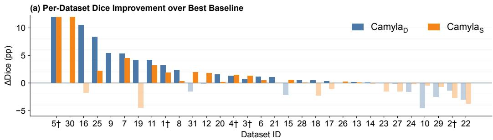

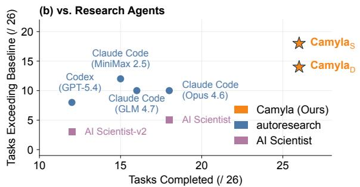

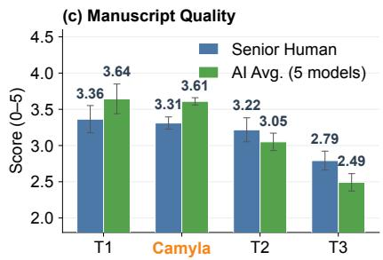  
Figure 1 Main results of Camyla across two independent runs on CamylaBench. (a) Per-dataset Dice improvement over the strongest baseline for both runs (Camyla<sub>D</sub> and Camyla<sub>S</sub>). Datasets marked with † are validation; the remainder are blind-test. (b) Comparison with six open-ended research agents on 26 blind-test datasets: Camyla achieves 100% task completion with zero proposal drift. (c) Manuscript quality evaluation: senior human reviewers and AI evaluators both score Camyla’s manuscripts at t<sup>h</sup>e T1/T2 <sup>b</sup>oun<sup>d</sup>ary o<sup>f</sup> contemporary me<sup>d</sup>ica<sup>l</sup> image segmentation venues. Tier-<sup>d</sup>e<sup>fi</sup>ning journa<sup>l</sup>s: T1 = IEEE Transactions on Medical Imaging and Medical Image Analysis (2 venues); T2 = IEEE Journal of Biomedical and Health Informatics, et al. (7 venues); T3 = Biomedical Physics & Engineering Express, et al. (9 venues).

## tra<sub>pp</sub>in<sub>g</sub> the s<sub>y</sub>stem in local o<sub>p</sub>tima.

Existin<sub>g</sub> automation a<sub>pp</sub>roaches cover <sub>p</sub>arts of this <sub>p</sub>i<sub>p</sub>eline but not the whole. Neural architecture search [4, 5] and AutoML methods [6, 7] o<sub>p</sub>timize models within fixed, human-desi<sub>g</sub>ned search s<sub>p</sub>aces and <sub>p</sub>roduce no transferable research insi<sub>g</sub>hts. General-<sub>p</sub>ur<sub>p</sub>ose research a<sub>g</sub>ents [8] can <sub>p</sub>lan and edit code freel<sub>y</sub> but lack the domain-s<sub>p</sub>ecific infrastructure to enforce ex<sub>p</sub>erimental ri<sub>g</sub>or: in our evaluation<sub>,</sub> the best such a<sub>g</sub>ent com<sub>p</sub>letes onl<sub>y</sub> 69% of assi<sub>g</sub>ned tasks, with 54% exhibitin<sub>g</sub> <sub>p</sub>ro<sub>p</sub>osal drift. End-to-end research s<sub>y</sub>stems [1, 2] broaden the sco<sub>p</sub>e to idea <sub>g</sub>eneration, <sub>co</sub>di<sub>ng, an</sub>d <sub>wr</sub>iti<sub>ng,</sub> b<sub>u</sub>t h<sub>ave no</sub>t b<sub>een</sub> t<sub>es</sub>t<sub>e</sub>d <sub>a</sub>t th<sub>e sca</sub>l<sub>e nee</sub>d<sub>e</sub>d t<sub>o es</sub>t<sub>a</sub>bli<sub>s</sub>h <sub>w</sub>h<sub>e</sub>th<sub>er</sub> th<sub>e</sub>i<sub>r</sub> di<sub>scover</sub>i<sub>es genera</sub>li<sub>ze</sub> across diverse <sub>p</sub>roblem settin<sub>g</sub>s.

We introduce Camyla, an autonomous research system for fully autonomous, domain-scale research in medical image segmentation. Camyla transforms raw segmentation datasets into literature-grounded research proposals, iterative ex<sub>p</sub>eriments<sub>,</sub> and com<sub>p</sub>lete manuscri<sub>p</sub>ts throu<sub>g</sub>h a four-sta<sub>g</sub>e <sub>p</sub>i<sub>p</sub>eline that o<sub>p</sub>erates without an<sub>y</sub> human intervention. The system rests on two infrastructure components: CamylaBench, a 31-dataset benchmark constructed exclusively from 2025 publications to eliminate data contamination, and CamylaNet, a three-function programmatic workbench that wra<sub>p</sub>s nnU-Net into an a<sub>g</sub>ent-friendl<sub>y</sub> interface while ex<sub>p</sub>osin<sub>g</sub> full architectural flexibilit<sub>y</sub>.

Three coupled mechanisms address these challenges directly. Quality-Weighted Branch Exploration (QWBE) <sub>coun</sub>t<sub>ers searc</sub>h d<sub>r</sub>ift b<sub>y mo</sub>d<sub>e</sub>li<sub>ng</sub> th<sub>e mu</sub>lti<sub>-proposa</sub>l <sub>searc</sub>h <sub>as a</sub> b<sub>an</sub>dit <sub>pro</sub>bl<sub>em w</sub>ith <sub>a r</sub>i<sub>s</sub>k<sub>-averse pr</sub>i<sub>or, concen</sub>t<sub>ra</sub>ti<sub>ng</sub> ex<sub>p</sub>erimental bud<sub>g</sub>et on <sub>p</sub>romisin<sub>g</sub> research directions while d<sub>y</sub>namicall<sub>y</sub> creatin<sub>g</sub> new <sub>p</sub>ro<sub>p</sub>osals when existin<sub>g</sub> ones stagnate. Layered Reflective Memory (LRM) counters knowledge degradation by organizing experimental k<sub>now</sub>l<sub>e</sub>d<sub>ge</sub> i<sub>n</sub>t<sub>o</sub> t<sub>r</sub>i<sub>a</sub>l<sub>-</sub>l<sub>eve</sub>l<sub>, cyc</sub>l<sub>e-</sub>l<sub>eve</sub>l<sub>, an</sub>d <sub>g</sub>l<sub>o</sub>b<sub>a</sub>l ti<sub>ers, eac</sub>h <sub>progress</sub>i<sub>ve</sub>l<sub>y compresse</sub>d<sub>, so</sub> th<sub>a</sub>t <sub>co</sub>di<sub>ng agen</sub>t<sub>s rece</sub>i<sub>ve</sub> only decision-relevant information at the appropriate abstraction level. Divergent Diagnostic Feedback (DDF) counters incremental-fix tra<sub>p</sub>s b<sub>y</sub> re<sub>p</sub>lacin<sub>g</sub> sin<sub>g</sub>le-<sub>p</sub>oint error corrections with five-su<sub>gg</sub>estion dia<sub>g</sub>nostic <sub>p</sub>ortfolios s<sub>p</sub>annin<sub>g</sub> architecture<sub>,</sub> h<sub>yp</sub>er<sub>p</sub>arameters<sub>,</sub> code fixes<sub>,</sub> and <sub>p</sub>ro<sub>p</sub>osal-im<sub>p</sub>lementation <sub>g</sub>a<sub>p</sub>s. The three mechanisms are mutually conditioning: DDF generates the diagnostic diversity that LRM compresses and QWBE exploits.

We evaluate Camyla under a strict zero-intervention rotocol across two inde endent runs on all 31 CamylaBench d<sub>a</sub>t<sub>ase</sub>t<sub>s.</sub> Th<sub>e</sub> t<sub>wo runs</sub> dif<sub>er on</sub>l<sub>y</sub> i<sub>n</sub> th<sub>e</sub> l<sub>anguage mo</sub>d<sub>e</sub>l <sub>use</sub>d f<sub>or</sub> id<sub>ea genera</sub>ti<sub>on; a</sub>ll <sub>o</sub>th<sub>er componen</sub>t<sub>s rema</sub>i<sub>n</sub> id<sub>en</sub>ti<sub>ca</sub>l<sub>.</sub> U<sub>n</sub>d<sub>er</sub> id<sub>en</sub>ti<sub>ca</sub>l t<sub>ra</sub>i<sub>n</sub>i<sub>ng</sub> b<sub>u</sub>d<sub>ge</sub>t<sub>s,</sub> th<sub>e sys</sub>t<sub>em surpasses</sub> th<sub>e s</sub>t<sub>ronges</sub>t <sub>per-</sub>d<sub>a</sub>t<sub>ase</sub>t b<sub>ase</sub>li<sub>ne se</sub>l<sub>ec</sub>t<sub>e</sub>d f<sub>rom</sub> 14 <sub>es</sub>t<sub>a</sub>bli<sub>s</sub>h<sub>e</sub>d <sub>arc</sub>hit<sub>ec</sub>t<sub>ures,</sub> i<sub>nc</sub>l<sub>u</sub>di<sub>ng</sub> <sub>nn</sub>U<sub>-</sub>N<sub>e</sub>t<sub>,</sub> <sub>on</sub> 22 <sub>an</sub>d 18 <sub>o</sub>f 31 d<sub>a</sub>t<sub>ase</sub>t<sub>s,</sub> <sub>respec</sub>ti<sub>ve</sub>l<sub>y,</sub> <sub>an</sub>d <sub>pro</sub>d<sub>uces</sub> 40 <sub>comp</sub>l<sub>e</sub>t<sub>e</sub> manuscripts t<sup>h</sup>at senior <sup>h</sup>uman reviewers score at t<sup>h</sup>e T1/T2 <sup>b</sup>oun<sup>d</sup>ary o<sup>f</sup> contemporary me<sup>d</sup>ica<sup>l</sup> imaging journa<sup>l</sup>s. Relative to automated baselines<sub>,</sub> both runs out<sub>p</sub>erform AutoML and NAS s<sub>y</sub>stems on a<sub>gg</sub>re<sub>g</sub>ate Dice and substantiall<sub>y</sub> <sub>excee</sub>d <sub>a</sub>ll <sub>s</sub>i<sub>x</sub> <sub>open-en</sub>d<sub>e</sub>d <sub>researc</sub>h <sub>agen</sub>t<sub>s</sub> <sub>on</sub> b<sub>o</sub>th t<sub>as</sub>k <sub>comp</sub>l<sub>e</sub>ti<sub>on</sub> <sub>an</sub>d b<sub>ase</sub>li<sub>ne-surpass</sub>i<sub>ng</sub> f<sub>requency.</sub>

In summar<sub>y,</sub> this <sub>p</sub>a<sub>p</sub>er <sub>p</sub>resents the followin<sub>g</sub> contributions:

• We introduce Camyla and its three coupled mechanisms for long-horizon research orchestration: QWBE for resource allocation<sub>,</sub> LRM for cross-trial knowled<sub>g</sub>e retention<sub>,</sub> and DDF for recover<sub>y</sub> diversit<sub>y</sub> after setbacks.

• We present CamylaBench, a 31-dataset benchmark with 26 blind-test datasets constructed exclusively from 2025 <sub>pu</sub>bli<sub>ca</sub>ti<sub>ons</sub> t<sub>o</sub> <sub>e</sub>li<sub>m</sub>i<sub>na</sub>t<sub>e</sub> d<sub>a</sub>t<sub>a</sub> <sub>con</sub>t<sub>am</sub>i<sub>na</sub>ti<sub>on.</sub>

• We present CamylaNet, a domain-specific research workbench that compresses dataset preparation, training, <sub>an</sub>d <sub>eva</sub>l<sub>ua</sub>ti<sub>on</sub> i<sub>n</sub>t<sub>o a</sub> th<sub>ree-</sub>f<sub>unc</sub>ti<sub>on</sub> i<sub>n</sub>t<sub>er</sub>f<sub>ace w</sub>hil<sub>e preserv</sub>i<sub>ng</sub> f<sub>u</sub>ll <sub>arc</sub>hit<sub>ec</sub>t<sub>ura</sub>l fl<sub>ex</sub>ibilit<sub>y.</sub>

• We release CamylaTrace-232k, the experimental-discovery trajectories from both runs, covering over 232,000 a<sub>g</sub>ent events<sub>,</sub> 2<sub>,</sub>865 codin<sub>g</sub> sessions<sub>,</sub> and 1<sub>,</sub>343 model im<sub>p</sub>lementations.

• Across two independent runs and comparisons against nine automated baselines, Camyla surpasses the <sub>s</sub>t<sub>ronges</sub>t <sub>per-</sub>d<sub>a</sub>t<sub>ase</sub>t b<sub>ase</sub>li<sub>ne on</sub> 24 <sub>o</sub>f 31 d<sub>a</sub>t<sub>ase</sub>t<sub>s an</sub>d <sub>pro</sub>d<sub>uces manuscr</sub>i<sub>p</sub>t<sub>s score</sub>d <sub>a</sub>t th<sub>e</sub> T1/T2 b<sub>oun</sub>d<sub>ary o</sub>f me<sup>d</sup>ica<sup>l</sup> imaging journa<sup>l</sup>s <sup>b</sup>y senior <sup>h</sup>uman reviewers.

## 2 Research Setting and Infrastructure

This section introduces the two foundational components that underpin Camyla: the benchmark on which the system is evaluated and the computational workbench through which it conducts experiments. Together, CamylaBench and CamylaNet define the research setting—what the system must accomplish and the tools it uses to do so.

## 2.1 Research Task and Evaluation Protocol

Th<sub>e researc</sub>h t<sub>as</sub>k i<sub>s</sub> d<sub>e</sub>fi<sub>ne</sub>d <sub>as</sub> f<sub>o</sub>ll<sub>ows.</sub> Gi<sub>ven a me</sub>di<sub>ca</sub>l i<sub>mage segmen</sub>t<sub>a</sub>ti<sub>on</sub> d<sub>a</sub>t<sub>ase</sub>t<sub>,</sub> th<sub>e sys</sub>t<sub>em mus</sub>t <sub>au</sub>t<sub>onomous</sub>l<sub>y</sub> <sub>genera</sub>t<sub>e a comp</sub>l<sub>e</sub>t<sub>e researc</sub>h <sub>manuscr</sub>i<sub>p</sub>t th<sub>a</sub>t i<sub>nc</sub>l<sub>u</sub>d<sub>es a nove</sub>l <sub>me</sub>th<sub>o</sub>d<sub>o</sub>l<sub>og</sub>i<sub>ca</sub>l <sub>con</sub>t<sub>r</sub>ib<sub>u</sub>ti<sub>on, compre</sub>h<sub>ens</sub>i<sub>ve exper-</sub> imental e<sub>v</sub>al<sub>u</sub>ation<sub>,</sub> and a clear scientific narrati<sub>v</sub>e. The s<sub>y</sub>stem o<sub>p</sub>erates <sub>u</sub>nder a zero-inter<sub>v</sub>ention <sub>p</sub>rotocol: once l<sub>aunc</sub>h<sub>e</sub>d <sub>w</sub>ith <sub>a</sub> d<sub>a</sub>t<sub>ase</sub>t id<sub>en</sub>tifi<sub>er,</sub> it <sub>pro</sub>d<sub>uces</sub> <sub>a</sub>ll <sub>ou</sub>t<sub>pu</sub>t<sub>s—researc</sub>h <sub>proposa</sub>l<sub>s,</sub> t<sub>ra</sub>i<sub>ne</sub>d <sub>mo</sub>d<sub>e</sub>l<sub>s,</sub> <sub>a</sub>bl<sub>a</sub>ti<sub>on</sub> <sub>s</sub>t<sub>u</sub>di<sub>es,</sub> <sub>an</sub>d <sub>a</sub> com<sub>p</sub>iled manuscri<sub>p</sub>t—without an<sub>y</sub> human in<sub>p</sub>ut.

Each dataset is <sub>p</sub>re<sub>p</sub>rocessed and evaluated followin<sub>g</sub> the same <sub>p</sub>rotocol as nnU-Net [9]. The <sub>p</sub>rimar<sub>y</sub> metric is the mean Dice coeficient [10] com<sub>p</sub>uted over all fore<sub>g</sub>round classes. The secondar<sub>y</sub> metric is the 95th-<sub>p</sub>ercentile Hausdorf distance (HD95) [11], which ca<sub>p</sub>tures boundar<sub>y</sub> accurac<sub>y</sub>. A s<sub>y</sub>stem is considered to have exceeded the baseline on a <sub>g</sub>iven dataset if the Dice im<sub>p</sub>rovement over the baseline exceeds 0.5 <sub>p</sub>ercenta<sub>g</sub>e <sub>p</sub>oints<sub>,</sub> or if the Dice diference i within 0.5 <sub>p</sub>ercenta<sub>g</sub>e <sub>p</sub>oints and the HD95 is strictl<sub>y</sub> lower than the baseline HD95. This two-tier criterion <sub>p</sub>revents the s<sub>y</sub>stem from claimin<sub>g</sub> success based on ne<sub>g</sub>li<sub>g</sub>ible Dice fluctuations while still reco<sub>g</sub>nizin<sub>g</sub> meanin<sub>g</sub>ful im<sub>p</sub>rovements in boundar<sub>y</sub> <sub>q</sub>ualit<sub>y</sub> when volumetric overla<sub>p</sub> is alread<sub>y</sub> near its ceilin<sub>g</sub>.

## 2.2 CamylaBench

E<sub>va</sub>l<sub>ua</sub>ti<sub>ng</sub> <sub>an</sub> <sub>au</sub>t<sub>onomous</sub> <sub>researc</sub>h <sub>sys</sub>t<sub>em</sub> <sub>requ</sub>i<sub>res</sub> <sub>a</sub> b<sub>enc</sub>h<sub>mar</sub>k th<sub>a</sub>t th<sub>e</sub> <sub>sys</sub>t<sub>em</sub> h<sub>as</sub> <sub>never</sub> <sub>encoun</sub>t<sub>ere</sub>d d<sub>ur</sub>i<sub>ng</sub> d<sub>eve</sub>l<sub>opmen</sub>t <sub>an</sub>d th<sub>a</sub>t <sub>no ex</sub>i<sub>s</sub>ti<sub>ng me</sub>th<sub>o</sub>d h<sub>as</sub> b<sub>een spec</sub>ifi<sub>ca</sub>ll<sub>y</sub> t<sub>une</sub>d <sub>on.</sub> E<sub>s</sub>t<sub>a</sub>bli<sub>s</sub>h<sub>e</sub>d <sub>segmen</sub>t<sub>a</sub>ti<sub>on</sub> b<sub>enc</sub>h<sub>mar</sub>k<sub>s</sub> such as the Medical Se<sub>g</sub>mentation Decathlon [12] have been widel<sub>y</sub> used for <sub>y</sub>ears, creatin<sub>g</sub> a risk of im<sub>p</sub>licit data <sub>con</sub>t<sub>am</sub>i<sub>na</sub>ti<sub>on: an</sub> LLM<sub>-</sub>b<sub>ase</sub>d <sub>researc</sub>h <sub>agen</sub>t <sub>may genera</sub>t<sub>e me</sub>th<sub>o</sub>d<sub>s</sub> th<sub>a</sub>t <sub>exp</sub>l<sub>o</sub>it <sub>memor</sub>i<sub>ze</sub>d k<sub>now</sub>l<sub>e</sub>d<sub>ge a</sub>b<sub>ou</sub>t th<sub>ese</sub> benchmarks rather than discovering genuinely new solutions. To eliminate this risk, we construct CamylaBench <sub>en</sub>ti<sub>re</sub>l<sub>y</sub> f<sub>rom</sub> d<sub>a</sub>t<sub>ase</sub>t<sub>s</sub> th<sub>a</sub>t did <sub>no</sub>t <sub>ex</sub>i<sub>s</sub>t i<sub>n</sub> th<sub>e pu</sub>bli<sub>c</sub> d<sub>oma</sub>i<sub>n un</sub>til 2025<sub>.</sub>

We adopt an exhaustive, zero-filtering collection protocol. CamylaBench is constructed from the complete set of medical ima<sub>g</sub>e se<sub>g</sub>mentation datasets <sub>p</sub>ublished in Scientific Data durin<sub>g</sub> 2025. We collected ever<sub>y</sub> article in this journa<sup>l</sup> w<sup>h</sup>ose primary contri<sup>b</sup>ution is a segmentation <sup>d</sup>ataset wit<sup>h</sup> pu<sup>bl</sup>ic<sup>l</sup>y avai<sup>l</sup>a<sup>bl</sup>e images an<sup>d</sup> annotations. No <sub>samp</sub>li<sub>ng, no</sub> difi<sub>cu</sub>lt<sub>y-</sub>b<sub>ase</sub>d filt<sub>er</sub>i<sub>ng, an</sub>d <sub>no mo</sub>d<sub>a</sub>lit<sub>y res</sub>t<sub>r</sub>i<sub>c</sub>ti<sub>on was app</sub>li<sub>e</sub>d b<sub>eyon</sub>d th<sub>e requ</sub>i<sub>remen</sub>t th<sub>a</sub>t th<sub>e</sub> d<sub>a</sub>t<sub>ase</sub>t <sub>mus</sub>t <sub>con</sub>t<sub>a</sub>i<sub>n p</sub>i<sub>xe</sub>l<sub>-</sub>l<sub>eve</sub>l <sub>segmen</sub>t<sub>a</sub>ti<sub>on</sub> l<sub>a</sub>b<sub>e</sub>l<sub>s.</sub> Thi<sub>s pro</sub>t<sub>oco</sub>l <sub>means</sub> th<sub>a</sub>t th<sub>e</sub> b<sub>enc</sub>h<sub>mar</sub>k <sub>compos</sub>iti<sub>on</sub> i<sub>s</sub> d<sub>e</sub>t<sub>erm</sub>i<sub>ne</sub>d <sub>en</sub>ti<sub>re</sub>l<sub>y</sub> b<sub>y</sub> <sub>w</sub>h<sub>a</sub>t th<sub>e</sub> <sub>researc</sub>h <sub>commun</sub>it<sub>y</sub> <sub>pu</sub>bli<sub>s</sub>h<sub>e</sub>d i<sub>n</sub> <sub>a</sub> <sub>g</sub>i<sub>ven</sub> <sub>year,</sub> <sub>no</sub>t b<sub>y</sub> <sub>our</sub> <sub>expec</sub>t<sub>a</sub>ti<sub>ons</sub> <sub>a</sub>b<sub>ou</sub>t <sub>w</sub>hi<sub>c</sub>h t<sub>as</sub>k<sub>s</sub> th<sub>e</sub> s<sub>y</sub>stem can or cannot so<sup>l</sup>ve.

The resultin<sub>g</sub> benchmark com<sub>p</sub>rises 31 datasets s<sub>p</sub>annin<sub>g</sub> 12 anatomical re<sub>g</sub>ions and 10 ima<sub>g</sub>in<sub>g</sub> modalities<sub>,</sub> with trainin<sub>g</sub> set sizes ran<sub>g</sub>in<sub>g</sub> from 24 to 10<sub>,</sub>662 cases and fore<sub>g</sub>round class counts ran<sub>g</sub>in<sub>g</sub> from 1 to 10. Table 1 <sub>p</sub>rovides the com lete dataset inventor , and the source ublications are cited in full [13–43].

The 31 datasets s<sub>p</sub>an 12 anatomical re<sub>g</sub>ions (brain, abdomen, o<sub>p</sub>hthalmolo<sub>gy</sub>, head and neck, lun<sub>g</sub>, dental, breast, skin, c<sub>y</sub>tolo<sub>gy</sub>, musculoskeletal, soft tissue, and <sub>gy</sub>necolo<sub>gy</sub>) and a wide dificult<sub>y</sub> s<sub>p</sub>ectrum: baseline Dice ran<sub>g</sub>es from 14.2% (endosco<sub>p</sub>ic instrument se<sub>g</sub>mentation) to 96.2% (dental <sub>p</sub>anoramic radio<sub>g</sub>ra<sub>p</sub>h<sub>y</sub>), with a median of 71.4%. A d<sub>e</sub>t<sub>a</sub>il<sub>e</sub>d b<sub>rea</sub>kd<sub>own o</sub>f <sub>ana</sub>t<sub>om</sub>i<sub>ca</sub>l <sub>covera e an</sub>d t<sub>as</sub>k difi<sub>cu</sub>lt i<sub>s rov</sub>id<sub>e</sub>d i<sub>n</sub> A <sub>en</sub>di<sub>x</sub> F<sub>.</sub> A<sub>mon</sub> th<sub>e</sub> 31 d<sub>a</sub>t<sub>ase</sub>t<sub>s,</sub> fi<sub>ve</sub> (Datasets 1–5) were randoml<sub>y</sub> desi<sub>g</sub>nated as validation datasets used durin<sub>g</sub> s<sub>y</sub>stem develo<sub>p</sub>ment; the remainin<sub>g</sub> 26 <sub>were</sub> h<sub>e</sub>ld <sub>ou</sub>t <sub>as</sub> bli<sub>n</sub>d<sub>-</sub>t<sub>es</sub>t d<sub>a</sub>t<sub>ase</sub>t<sub>s.</sub> All <sub>repor</sub>t<sub>e</sub>d <sub>resu</sub>lt<sub>s</sub> di<sub>s</sub>ti<sub>ngu</sub>i<sub>s</sub>h b<sub>e</sub>t<sub>ween</sub> th<sub>ese</sub> t<sub>wo su</sub>b<sub>se</sub>t<sub>s.</sub>

Table 1 Com lete inventor of the 31 datasets in CamylaBench, sourced from Scientific Data 2025. † = validation. Cf . = 2D/3D. Cl<sub>s. =</sub> f<sub>ore roun</sub>d <sub>c</sub>l<sub>asses.</sub> B<sub>ase</sub>li<sub>ne =</sub> b<sub>es</sub>t <sub>o</sub>f 14 <sub>re</sub>t<sub>ra</sub>i<sub>ne</sub>d <sub>arc</sub>hit<sub>ec</sub>t<sub>ures.</sub>

<table><tr><td>ID</td><td>Dataset</td><td>Region</td><td>Modality</td><td>N</td><td>C</td><td>Cfg</td><td>Baseline</td><td>Dice</td></tr><tr><td> $1^{\dagger}$ </td><td>GDMRI-CT</td><td>Brain</td><td>MRI</td><td>50</td><td>1</td><td>3D</td><td>STU-Net</td><td>70.6</td></tr><tr><td> $2^{\dagger}$ </td><td>MRE-BSA</td><td>Abdomen</td><td>MRI</td><td>114</td><td>10</td><td>3D</td><td>U-Mamba</td><td>71.8</td></tr><tr><td> $3^{\dagger}$ </td><td>PNPC</td><td>Head&amp;Neck</td><td>MRI</td><td>277</td><td>1</td><td>3D</td><td>nnU-Net</td><td>60.6</td></tr><tr><td> $4^{\dagger}$ </td><td>AMSMC-HTM</td><td>Head&amp;Neck</td><td>MRI</td><td>24</td><td>4</td><td>3D</td><td>nnU-Net</td><td>81.4</td></tr><tr><td> $5^{\dagger}$ </td><td>NLSTseg</td><td>Lung</td><td>CT</td><td>604</td><td>1</td><td>3D</td><td>nnU-Net</td><td>23.2</td></tr><tr><td>6</td><td>SMRI-FB</td><td>Brain</td><td>MRI</td><td>70</td><td>8</td><td>3D</td><td>MedNeXt</td><td>85.3</td></tr><tr><td>7</td><td>LMD-BM</td><td>Brain</td><td>MRI</td><td>44</td><td>3</td><td>3D</td><td>nnU-Net</td><td>46.2</td></tr><tr><td>8</td><td>BONBID2023</td><td>Brain</td><td>MRI</td><td>89</td><td>1</td><td>3D</td><td>MedNeXt</td><td>55.9</td></tr><tr><td>9</td><td>BTXRD</td><td>Musculoskel.</td><td>X-ray</td><td>1867</td><td>2</td><td>2D</td><td>UTNet</td><td>44.5</td></tr><tr><td>10</td><td>BUS-UCLM</td><td>Breast</td><td>Ultrasound</td><td>670</td><td>1</td><td>2D</td><td>nnU-Net</td><td>36.7</td></tr><tr><td>11</td><td>CirrMRI600+</td><td>Abdomen</td><td>MRI</td><td>373</td><td>1</td><td>3D</td><td>nnU-Net</td><td>81.8</td></tr><tr><td>12</td><td>CPAISD</td><td>Brain</td><td>CT</td><td>112</td><td>1</td><td>3D</td><td>U-Mamba</td><td>27.3</td></tr><tr><td>13</td><td>DenPAR</td><td>Dental</td><td>X-ray</td><td>800</td><td>1</td><td>2D</td><td>nnU-Net</td><td>96.2</td></tr><tr><td>14</td><td>DERMA-OCTA</td><td>Skin</td><td>OCTA</td><td>331</td><td>1</td><td>2D</td><td>U-Mamba</td><td>83.9</td></tr><tr><td>15</td><td>Endoscapes</td><td>Abdomen</td><td>Laparoscopy</td><td>343</td><td>6</td><td>2D</td><td>nnU-Net</td><td>47.5</td></tr><tr><td>16</td><td>FOVEA</td><td>Ophthal.</td><td>Fundus</td><td>40</td><td>1</td><td>2D</td><td>UKAN</td><td>71.4</td></tr></table>

<table><tr><td>ID</td><td>Dataset</td><td>Region</td><td>Modality</td><td>N</td><td>C</td><td>Cfg</td><td>Baseline</td><td>Dice</td></tr><tr><td>17</td><td>Fundus-AVSeg</td><td>Ophthal.</td><td>Fundus</td><td>100</td><td>3</td><td>2D</td><td>U-Mamba</td><td>77.6</td></tr><tr><td>18</td><td>HRUS-MBT</td><td>Soft Tiss.</td><td>Ultrasound</td><td>34</td><td>1</td><td>3D</td><td>nnU-Net</td><td>50.1</td></tr><tr><td>19</td><td>LapGC-KVAD</td><td>Abdomen</td><td>Laparoscopy</td><td>1252</td><td>4</td><td>2D</td><td>U-Mamba</td><td>52.8</td></tr><tr><td>20</td><td>LongCIU</td><td>Lung</td><td>CT</td><td>90</td><td>2</td><td>2D</td><td>nnU-Net</td><td>73.5</td></tr><tr><td>21</td><td>MSLesSeg</td><td>Brain</td><td>MRI</td><td>115</td><td>1</td><td>3D</td><td>U-Mamba</td><td>69.6</td></tr><tr><td>22</td><td>MU-Glioma</td><td>Brain</td><td>MRI</td><td>594</td><td>4</td><td>3D</td><td>nnU-Net</td><td>71.6</td></tr><tr><td>23</td><td>OCT5k</td><td>Ophthal.</td><td>OCT</td><td>1672</td><td>5</td><td>2D</td><td>U-Mamba</td><td>65.4</td></tr><tr><td>24</td><td>PediMS</td><td>Brain</td><td>MRI</td><td>28</td><td>1</td><td>3D</td><td>nnU-Net</td><td>79.5</td></tr><tr><td>25</td><td>PLC-CECT</td><td>Abdomen</td><td>CT</td><td>278</td><td>1</td><td>3D</td><td>U-Net++</td><td>53.2</td></tr><tr><td>26</td><td>PW-BALFC</td><td>Cytology</td><td>Microscopy</td><td>2105</td><td>1</td><td>2D</td><td>nnU-Net</td><td>76.7</td></tr><tr><td>27</td><td>SEA-SIS</td><td>Abdomen</td><td>Endoscopy</td><td>10662</td><td>6</td><td>2D</td><td>nnU-Net</td><td>14.2</td></tr><tr><td>28</td><td>STS-Tooth</td><td>Dental</td><td>X-ray</td><td>850</td><td>1</td><td>2D</td><td>U-Mamba</td><td>93.7</td></tr><tr><td>29</td><td>TOM500</td><td>Ophthal.</td><td>MRI</td><td>500</td><td>9</td><td>3D</td><td>U-Mamba</td><td>92.2</td></tr><tr><td>30</td><td>TRUSTED</td><td>Abdomen</td><td>Ultrasound</td><td>59</td><td>1</td><td>3D</td><td>U-Mamba</td><td>62.1</td></tr><tr><td>31</td><td>UT-EndoMRI</td><td>Gynecology</td><td>MRI</td><td>57</td><td>1</td><td>3D</td><td>U-Mamba</td><td>75.1</td></tr></table>

## 2.3 CamylaNet

A<sub>n au</sub>t<sub>onomous researc</sub>h <sub>s s</sub>t<sub>em re u</sub>i<sub>res a com u</sub>t<sub>a</sub>ti<sub>ona</sub>l <sub>wor</sub>kb<sub>enc</sub>h th<sub>a</sub>t <sub>sa</sub>ti<sub>s</sub>fi<sub>es</sub> t<sub>wo com e</sub>ti<sub>n cons</sub>t<sub>ra</sub>i<sub>n</sub>t<sub>s:</sub> it <sub>mus</sub>t <sub>encapsu</sub>l<sub>a</sub>t<sub>e</sub> th<sub>e</sub> f<sub>u</sub>ll <sub>exper</sub>i<sub>men</sub>t<sub>a</sub>l lif<sub>ecyc</sub>l<sub>e so</sub> th<sub>a</sub>t <sub>an</sub> LLM <sub>agen</sub>t <sub>can run a comp</sub>l<sub>e</sub>t<sub>e exper</sub>i<sub>men</sub>t th<sub>roug</sub>h <sub>a sma</sub>ll <sub>num</sub>b<sub>er</sub> <sub>o</sub>f f<sub>unc</sub>ti<sub>on ca</sub>ll<sub>s, an</sub>d it <sub>mus</sub>t <sub>expose su</sub>fi<sub>c</sub>i<sub>en</sub>t <sub>arc</sub>hit<sub>ec</sub>t<sub>ura</sub>l fl<sub>ex</sub>ibilit<sub>y so</sub> th<sub>a</sub>t th<sub>e agen</sub>t <sub>can</sub> i<sub>mp</sub>l<sub>emen</sub>t <sub>genu</sub>i<sub>ne</sub>l<sub>y nove</sub>l designs rather than merely selecting from a fixed model menu. CamylaNet is a domain-specific instantiation of this workbench <sub>p</sub>attern for medical ima<sub>g</sub>e se<sub>g</sub>mentation, wra<sub>pp</sub>in<sub>g</sub> nnU-Net v2 [9] into a three-function <sub>p</sub>ro<sub>g</sub>rammatic i<sub>n</sub>t<sub>er</sub>f<sub>ace w</sub>hil<sub>e preserv</sub>i<sub>ng</sub> f<sub>u</sub>ll <sub>con</sub>t<sub>ro</sub>l <sub>over</sub> th<sub>e ne</sub>t<sub>wor</sub>k <sub>arc</sub>hit<sub>ec</sub>t<sub>ure.</sub> A<sub>na</sub>l<sub>ogous su</sub>b<sub>s</sub>t<sub>ra</sub>t<sub>es cou</sub>ld b<sub>e cons</sub>t<sub>ruc</sub>t<sub>e</sub>d for other domains with established training and evaluation pipelines; CamylaNet’s role is to expose a minimal, <sub>agen</sub>t<sub>-execu</sub>t<sub>a</sub>bl<sub>e</sub> i<sub>n</sub>t<sub>er</sub>f<sub>ace</sub> <sub>over</sub> <sub>a</sub> <sub>s</sub>t<sub>an</sub>d<sub>ar</sub>di<sub>ze</sub>d <sub>exper</sub>i<sub>men</sub>t<sub>a</sub>l <sub>s</sub>t<sub>ac</sub>k<sub>.</sub>

The three entr<sub>y p</sub>oints corres<sub>p</sub>ond to the three sta<sub>g</sub>es of a se<sub>g</sub>mentation ex<sub>p</sub>eriment:

$$
\text { plan\_and\_preprocess } (d, C) \to \pi ,\tag{1}
$$

$$
\text { training\_network } (d, c, \mathcal {T}, \pi) \to (\mathcal {R}, \ell),\tag{2}
$$

$$
\operatorname{evaluate} (d, \mathcal {R}) \to \mathcal {M},\tag{3}
$$

where � is a dataset identifier, C is a set of tar<sub>g</sub>et confi<sub>g</sub>urations (2D, 3D full-resolution, or both), � is a <sub>p</sub>lans object that records the fin<sub>g</sub>er<sub>p</sub>rint-derived <sub>p</sub>re<sub>p</sub>rocessin<sub>g</sub> reci<sub>p</sub>e, T is a trainer class, $c \in C$ is the selected confi<sub>g</sub>uration, R is the result folder containin<sub>g</sub> check<sub>p</sub>oints and <sub>p</sub>redictions, ℓ is a trainin<sub>g</sub> lo<sub>g</sub>, and M is a dictionar<sub>y</sub> of evaluation metrics inc<sup>l</sup>u<sup>d</sup>ing Dice an<sup>d</sup> HD95. Interna<sup>ll</sup>y, plan\_and\_preprocess c<sup>h</sup>ains <sup>fi</sup>ngerprint extraction, experiment p<sup>l</sup>anning, an<sup>d d</sup>ata preprocessing into a sing<sup>l</sup>e ca<sup>ll</sup>. training\_network instantiates t<sup>h</sup>e trainer, con<sup>fi</sup>gures t<sup>h</sup>e o<sub>p</sub>timizer and learnin<sub>g</sub> rate schedule<sub>,</sub> executes the trainin<sub>g</sub> loo<sub>p</sub> with mixed-<sub>p</sub>recision <sub>g</sub>radient scalin<sub>g,</sub> and returns the output pat<sup>h</sup>. evaluate runs in<sup>f</sup>erence, computes per-case an<sup>d</sup> aggregate metrics, an<sup>d</sup> writes a structure<sup>d</sup> summary. The entire <sub>p</sub>i<sub>p</sub>eline runs in isolated sub<sub>p</sub>rocesses to <sub>p</sub>revent state leaka<sub>g</sub>e between successive ex<sub>p</sub>eriments.

Architecture Extension Interface. The key design decision that makes CamylaNet suitable for autonomous <sub>arc</sub>hit<sub>ec</sub>t<sub>ura</sub>l <sub>researc</sub>h i<sub>s</sub> th<sub>e separa</sub>ti<sub>on</sub> b<sub>e</sub>t<sub>ween</sub> th<sub>e</sub> t<sub>ra</sub>i<sub>n</sub>i<sub>ng</sub> i<sub>n</sub>f<sub>ras</sub>t<sub>ruc</sub>t<sub>ure an</sub>d th<sub>e ne</sub>t<sub>wor</sub>k d<sub>e</sub>fi<sub>n</sub>iti<sub>on.</sub> A <sub>new</sub> arc<sup>h</sup>itecture is intro<sup>d</sup>uce<sup>d b</sup> su<sup>b</sup>c<sup>l</sup>assin a <sup>b</sup>ase trainer an<sup>d</sup> overri<sup>d</sup>in a sin <sup>l</sup>e static met<sup>h</sup>o<sup>d</sup>, build\_network\_- architecture, w<sup>h</sup>ic<sup>h</sup> receives t<sup>h</sup>e num<sup>b</sup>er o<sup>f</sup> input c<sup>h</sup>anne<sup>l</sup>s, t<sup>h</sup>e num<sup>b</sup>er o<sup>f</sup> output c<sup>l</sup>asses, an<sup>d</sup> a <sup>d</sup>ictionary o<sup>f</sup> arc<sup>h</sup>itecture parameters <sup>d</sup>erive<sup>d</sup> <sup>f</sup>rom t<sup>h</sup>e <sup>d</sup>ataset <sup>fi</sup>ngerprint. T<sup>h</sup>e met<sup>h</sup>o<sup>d</sup> returns an nn.Module t<sup>h</sup>at maps an in<sub>p</sub>ut tensor to a se<sub>g</sub>mentation lo<sub>g</sub>it ma<sub>p</sub>. All other com<sub>p</sub>onents—data loadin<sub>g</sub>, au<sub>g</sub>mentation, loss com<sub>p</sub>utation (soft Dice <sub>p</sub>lus cross-entro<sub>py</sub>), learnin<sub>g</sub> rate schedulin<sub>g</sub> (<sub>p</sub>ol<sub>y</sub>nomial deca<sub>y</sub>), check<sub>p</sub>ointin<sub>g</sub>, and validation—are inherited from the base trainer. This desi<sub>g</sub>n means that an LLM a<sub>g</sub>ent can im<sub>p</sub>lement an arbitrar<sub>y</sub> P<sub>y</sub>Torch network<sub>,</sub> wra<sub>p</sub> it in a six-line trainer subclass<sub>,</sub> and obtain a full<sub>y</sub> functional ex<sub>p</sub>eriment with the same <sub>p</sub>re<sub>p</sub>rocessin<sub>g,</sub> au<sub>g</sub>mentation<sub>,</sub> <sub>an</sub>d <sub>eva</sub>l<sub>ua</sub>ti<sub>on pro</sub>t<sub>oco</sub>l <sub>use</sub>d b<sub>y every o</sub>th<sub>er arc</sub>hit<sub>ec</sub>t<sub>ure</sub> i<sub>n</sub> th<sub>e sys</sub>t<sub>em.</sub> Th<sub>e separa</sub>ti<sub>on</sub> b<sub>e</sub>t<sub>ween</sub> i<sub>n</sub>f<sub>ras</sub>t<sub>ruc</sub>t<sub>ure an</sub>d <sub>ne</sub>t<sub>wor</sub>k d<sub>e</sub>fi<sub>n</sub>iti<sub>on</sub> i<sub>s</sub> th<sub>e core a</sub>b<sub>s</sub>t<sub>rac</sub>ti<sub>on</sub> th<sub>a</sub>t <sub>ma</sub>k<sub>es</sub> thi<sub>s wor</sub>kb<sub>enc</sub>h <sub>a</sub>tt<sub>ern</sub> t<sub>rans</sub>f<sub>era</sub>bl<sub>e:</sub> th<sub>e a en</sub>t<sub>-</sub>f<sub>ac</sub>i<sub>n con</sub>t<sub>rac</sub>t (overri<sup>d</sup>e one met<sup>h</sup>o<sup>d</sup>, return an nn.Module) is in<sup>d</sup>epen<sup>d</sup>ent o<sup>f</sup> t<sup>h</sup>e un<sup>d</sup>er<sup>l</sup>ying training <sup>f</sup>ramewor<sup>k</sup>.

One-Epoch Verification. A common failure mode in LLM- enerated code is that the network definition contain shape mismatches, numerical instabilities, or memory overflows that only manifest at runtime. CamylaNet provide <sub>a</sub> d<sub>e</sub>di<sub>ca</sub>t<sub>e</sub>d <sub>one-epoc</sub>h <sub>ver</sub>ifi<sub>ca</sub>ti<sub>on</sub> f<sub>unc</sub>ti<sub>on</sub> th<sub>a</sub>t <sub>execu</sub>t<sub>es</sub> <sub>a</sub> <sub>s</sub>i<sub>ng</sub>l<sub>e</sub> t<sub>ra</sub>i<sub>n</sub>i<sub>ng</sub> <sub>epoc</sub>h <sub>w</sub>ith f<sub>u</sub>ll d<sub>a</sub>t<sub>a</sub> l<sub>oa</sub>di<sub>ng,</sub> f<sub>orwar</sub>d <sub>an</sub>d b<sub>ac</sub>k<sub>war</sub>d <sub>passes, an</sub>d <sub>va</sub>lid<sub>a</sub>ti<sub>on</sub> i<sub>n</sub>f<sub>erence.</sub> P<sub>ass</sub>i<sub>ng</sub> thi<sub>s c</sub>h<sub>ec</sub>k <sub>guaran</sub>t<sub>ees</sub> th<sub>a</sub>t th<sub>e</sub> d<sub>a</sub>t<sub>a p</sub>i<sub>pe</sub>li<sub>ne,</sub> th<sub>e ne</sub>t<sub>wor</sub>k f<sub>orwar</sub>d <sub>pass,</sub> th<sub>e</sub> l<sub>oss compu</sub>t<sub>a</sub>ti<sub>on,</sub> th<sub>e gra</sub>di<sub>en</sub>t <sub>up</sub>d<sub>a</sub>t<sub>e, an</sub>d th<sub>e</sub> i<sub>n</sub>f<sub>erence expor</sub>t <sub>a</sub>ll <sub>execu</sub>t<sub>e w</sub>ith<sub>ou</sub>t <sub>error.</sub> E<sub>very can</sub>did<sub>a</sub>t<sub>e</sub> <sub>arc</sub>hit<sub>ec</sub>t<sub>ure</sub> i<sub>s va</sub>lid<sub>a</sub>t<sub>e</sub>d th<sub>roug</sub>h thi<sub>s</sub> f<sub>unc</sub>ti<sub>on</sub> b<sub>e</sub>f<sub>ore comm</sub>itti<sub>ng</sub> t<sub>o</sub> f<sub>u</sub>ll t<sub>ra</sub>i<sub>n</sub>i<sub>ng, re</sub>d<sub>uc</sub>i<sub>ng was</sub>t<sub>e</sub>d <sub>compu</sub>t<sub>a</sub>ti<sub>on</sub> f<sub>rom</sub> im<sub>p</sub>l<sub>e</sub>m<sub>e</sub>nt<sub>a</sub>ti<sub>o</sub>n <sub>e</sub>rr<sub>o</sub>r<sub>s.</sub>

Precomputed Baseline Bank. To establish a strong per-dataset reference point, we pretrain a bank of 14 baseline architectures s<sub>p</sub>annin<sub>g</sub> convolutional, transformer-based, and state-s<sub>p</sub>ace model families (full list in A<sub>pp</sub>endix E). For <sub>eac</sub>h d<sub>a</sub>t<sub>ase</sub>t<sub>, every compa</sub>tibl<sub>e arc</sub>hit<sub>ec</sub>t<sub>ure</sub> i<sub>s</sub> t<sub>ra</sub>i<sub>ne</sub>d <sub>an</sub>d th<sub>e one ac</sub>hi<sub>ev</sub>i<sub>ng</sub> th<sub>e</sub> hi<sub>g</sub>h<sub>es</sub>t Di<sub>ce</sub> i<sub>s se</sub>l<sub>ec</sub>t<sub>e</sub>d <sub>as</sub> th<sub>e</sub> b<sub>ase</sub>li<sub>ne.</sub> This <sub>p</sub>er-dataset selection ensures that the baseline is the stron<sub>g</sub>est available model for each task: nnU-Net [9] is the best baseline on 16 of 31 datasets, U-Mamba [44] on 10, and the remainin<sub>g</sub> 5 are won b<sub>y</sub> other architectures.

## 3 The Camyla System

The Camyla system transforms a raw segmentation dataset into a complete research manuscript through a four-stage <sub>p</sub>i<sub>p</sub>eline: baseline establishment<sub>,</sub> ex<sub>p</sub>erimental discover<sub>y,</sub> ablation verification<sub>,</sub> and manuscri<sub>p</sub>t <sub>g</sub>eneration. Each sta<sub>g</sub>e <sub>p</sub>roduces artifacts that feed the next<sub>,</sub> formin<sub>g</sub> a closed loo<sub>p</sub> from data in<sub>g</sub>estion to <sub>p</sub>a<sub>p</sub>er out<sub>p</sub>ut. The entire <sub>p</sub>i<sub>p</sub>eline <sub>execu</sub>t<sub>es w</sub>ith<sub>ou</sub>t h<sub>uman</sub> i<sub>n</sub>t<sub>erven</sub>ti<sub>on once</sub> th<sub>e</sub> d<sub>a</sub>t<sub>ase</sub>t id<sub>en</sub>tifi<sub>er</sub> i<sub>s prov</sub>id<sub>e</sub>d<sub>.</sub>

## 3.1 Overview

Algorithm 1 summarizes the end-to-end procedure. In Stage 1, the system loads the target dataset into CamylaNet (§2.3), a<sub>pp</sub>lies fin<sub>g</sub>er<sub>p</sub>rint-based <sub>p</sub>re<sub>p</sub>rocessin<sub>g</sub>, and retrieves the <sub>p</sub>recom<sub>p</sub>uted results of 14 baseline architectures from th<sub>e</sub> b<sub>ase</sub>li<sub>ne</sub> b<sub>an</sub>k<sub>.</sub> Th<sub>e arc</sub>hit<sub>ec</sub>t<sub>ure ac</sub>hi<sub>ev</sub>i<sub>ng</sub> th<sub>e</sub> hi<sub>g</sub>h<sub>es</sub>t Di<sub>ce on</sub> th<sub>e eva</sub>l<sub>ua</sub>ti<sub>on</sub> f<sub>o</sub>ld i<sub>s se</sub>l<sub>ec</sub>t<sub>e</sub>d <sub>as</sub> th<sub>e re</sub>f<sub>erence</sub> <sup>b</sup>ase<sup>l</sup>ine <sup>�∗</sup>, an<sup>d</sup> a structure<sup>d</sup> summary o<sup>f</sup> a<sup>ll b</sup>ase<sup>l</sup>ine resu<sup>l</sup>ts is injecte<sup>d</sup> into t<sup>h</sup>e agent context so t<sup>h</sup>at su<sup>b</sup>sequent stages <sub>can con</sub>diti<sub>on on</sub> b<sub>ase</sub>li<sub>ne s</sub>t<sub>reng</sub>th<sub>s an</sub>d <sub>wea</sub>k<sub>nesses.</sub> I<sub>n</sub> St<sub>age</sub> 2<sub>,</sub> th<sub>e sys</sub>t<sub>em genera</sub>t<sub>es a se</sub>t <sub>o</sub>f lit<sub>era</sub>t<sub>ure-groun</sub>d<sub>e</sub>d research <sub>p</sub>ro<sub>p</sub>osals (§3.2) and ex<sub>p</sub>lores them throu<sub>g</sub>h an iterative ex<sub>p</sub>erimental search. At each iteration, Qualit<sub>y</sub>- Wei<sub>g</sub>hted Branch Ex<sub>p</sub>loration (§3.3) selects which <sub>p</sub>ro<sub>p</sub>osal branch to ex<sub>p</sub>and, a <sub>p</sub>air of com<sub>p</sub>etin<sub>g</sub> codin<sub>g</sub> a<sub>g</sub>ents i<sub>mp</sub>l<sub>emen</sub>t<sub>s</sub> th<sub>e nex</sub>t <sub>mo</sub>difi<sub>ca</sub>ti<sub>on, an</sub>d th<sub>e resu</sub>lti<sub>ng mo</sub>d<sub>e</sub>l i<sub>s</sub> t<sub>ra</sub>i<sub>ne</sub>d <sub>an</sub>d <sub>eva</sub>l<sub>ua</sub>t<sub>e</sub>d<sub>.</sub> L<sub>ayere</sub>d R<sub>e</sub>fl<sub>ec</sub>ti<sub>ve</sub> M<sub>emory</sub> (§3.4) maintains a com<sub>p</sub>ressed record of all <sub>p</sub>rior trials across <sub>p</sub>ro<sub>p</sub>osals, while Diver<sub>g</sub>ent Dia<sub>g</sub>nostic Feedback (§3.5)

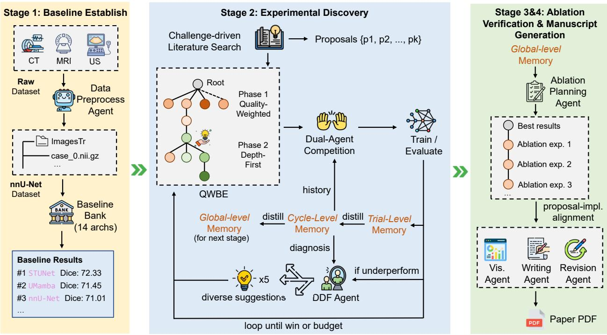  
Figure 2 Architecture of the Camyla system. The four-stage pipeline transforms a raw segmentation dataset into a complet research manuscript. Stage 1 establishes baselines via the precomputed baseline bank in CamylaNet. Stage 2 executes experimental discover<sub>y</sub> throu<sub>g</sub>h literature-<sub>g</sub>rounded <sub>p</sub>ro<sub>p</sub>osal <sub>g</sub>eneration and three cou<sub>p</sub>led mechanisms for lon<sub>g</sub>-horizon ex<sub>p</sub>erimentation: Qualit<sub>y</sub>-Wei<sub>g</sub>hted Branch Ex<sub>p</sub>loration (QWBE), La<sub>y</sub>ered Reflective Memor<sub>y</sub> (LRM), and Diver<sub>g</sub>ent Dia<sub>g</sub>nostic Feedback (DDF). St<sub>age</sub> 3 <sub>con</sub>d<sub>uc</sub>t<sub>s</sub> <sub>a</sub>bl<sub>a</sub>ti<sub>on</sub> <sub>ver</sub>ifi<sub>ca</sub>ti<sub>on</sub> <sub>o</sub>f th<sub>e</sub> <sub>w</sub>i<sub>nn</sub>i<sub>ng</sub> <sub>me</sub>th<sub>o</sub>d<sub>.</sub> St<sub>age</sub> 4 <sub>syn</sub>th<sub>es</sub>i<sub>zes</sub> th<sub>e</sub> fi<sub>na</sub>l <sub>manuscr</sub>i<sub>p</sub>t th<sub>roug</sub>h <sub>a</sub> <sub>mu</sub>lti<sub>-agen</sub>t <sub>w</sub>ritin<sub>g</sub> <sub>p</sub>i<sub>pe</sub>lin<sub>e.</sub>

<sub>g</sub>enerates cate<sub>g</sub>oricall<sub>y</sub> diverse im<sub>p</sub>rovement su<sub>gg</sub>estions after each under<sub>p</sub>erformin<sub>g</sub> trial. Sta<sub>g</sub>e 2 terminates when a t<sub>r</sub>i<sub>a</sub>l <sub>excee</sub>d<sub>s</sub> �<sup>∗</sup> <sub>or</sub> th<sub>e</sub> <sub>compu</sub>t<sub>a</sub>ti<sub>ona</sub>l b<sub>u</sub>d<sub>ge</sub>t i<sub>s</sub> <sub>ex</sub>h<sub>aus</sub>t<sub>e</sub>d<sub>.</sub> If <sub>a</sub> <sub>w</sub>i<sub>nn</sub>i<sub>ng</sub> <sub>proposa</sub>l i<sub>s</sub> f<sub>oun</sub>d<sub>,</sub> St<sub>age</sub> 3 <sub>con</sub>d<sub>uc</sub>t<sub>s</sub> <sub>a</sub>bl<sub>a</sub>ti<sub>on</sub> studies b<sub>y</sub> s<sub>y</sub>stematicall<sub>y</sub> removin<sub>g</sub> each <sub>p</sub>ro<sub>p</sub>osed module and recordin<sub>g</sub> the resultin<sub>g</sub> <sub>p</sub>erformance dro<sub>p</sub>. Finall<sub>y,</sub> St<sub>age</sub> 4 <sub>assem</sub>bl<sub>es</sub> th<sub>e researc</sub>h <sub>proposa</sub>l<sub>, exper</sub>i<sub>men</sub>t<sub>a</sub>l <sub>resu</sub>lt<sub>s, an</sub>d <sub>a</sub>bl<sub>a</sub>ti<sub>on ev</sub>id<sub>ence</sub> i<sub>n</sub>t<sub>o a manuscr</sub>i<sub>p</sub>t th<sub>roug</sub>h a multi-a<sub>g</sub>ent writin<sub>g</sub> <sub>p</sub>i<sub>p</sub>eline (§3.6). Sta<sub>g</sub>e-transition rules, suba<sub>g</sub>ent com<sub>p</sub>etition, and the ablation construction <sub>proce</sub>d<sub>ure are</sub> d<sub>e</sub>t<sub>a</sub>il<sub>e</sub>d i<sub>n</sub> A<sub>ppen</sub>di<sub>x</sub> A<sub>.</sub>

Pro<sub>p</sub>osal <sub>g</sub>eneration (§3.2) determines what to investi<sub>g</sub>ate b<sub>y g</sub>roundin<sub>g</sub> ideas in the recent literature. The remainin<sub>g</sub> three com<sub>p</sub>onents form a cou<sub>p</sub>led mechanism for lon<sub>g</sub>-horizon ex<sub>p</sub>erimentation: QWBE (§3.3) determines where to allocate the finite ex<sub>p</sub>erimental bud<sub>g</sub>et across com<sub>p</sub>etin<sub>g</sub> <sub>p</sub>ro<sub>p</sub>osals, LRM (§3.4) determines what ex<sub>p</sub>erimental knowled<sub>g</sub>e is <sub>p</sub>reserved at each decision <sub>p</sub>oint, and DDF (§3.5) determines how the s<sub>y</sub>stem recovers and diversifies <sub>a</sub>ft<sub>er</sub> <sub>se</sub>tb<sub>ac</sub>k<sub>s.</sub> Th<sub>e</sub> <sub>a</sub>bl<sub>a</sub>ti<sub>on</sub> <sub>s</sub>t<sub>u</sub>d<sub>y</sub> i<sub>n</sub> S<sub>ec</sub>ti<sub>on</sub> 5<sub>.</sub>1 <sub>con</sub>fi<sub>rms</sub> th<sub>a</sub>t th<sub>ese</sub> th<sub>ree</sub> <sub>mec</sub>h<sub>an</sub>i<sub>sms</sub> <sub>are</sub> <sub>comp</sub>l<sub>emen</sub>t<sub>ary:</sub> <sub>remov</sub>i<sub>ng</sub> <sub>any one</sub> d<sub>egra</sub>d<sub>es e</sub>ith<sub>er searc</sub>h <sub>e</sub>fi<sub>c</sub>i<sub>ency, en</sub>d<sub>-s</sub>t<sub>a</sub>t<sub>e qua</sub>lit<sub>y, or recovery</sub> f<sub>rom</sub> f<sub>a</sub>il<sub>ure.</sub>

## 3.2 Literature-Grounded Proposal Generation

The startin<sub>g</sub> <sub>p</sub>oint of ever<sub>y</sub> ex<sub>p</sub>erimental cam<sub>p</sub>ai<sub>g</sub>n is a set of research <sub>p</sub>ro<sub>p</sub>osals that s<sub>p</sub>ecif<sub>y</sub> what architectural innovations to <sub>p</sub>ursue. A naïve a<sub>pp</sub>roach—<sub>p</sub>rom<sub>p</sub>tin<sub>g</sub> a lan<sub>g</sub>ua<sub>g</sub>e model directl<sub>y</sub> for im<sub>p</sub>rovement ideas—tends to <sub>pro</sub>d<sub>uce</sub> <sub>gener</sub>i<sub>c</sub> <sub>sugges</sub>ti<sub>ons</sub> th<sub>a</sub>t <sub>recom</sub>bi<sub>ne</sub> <sub>we</sub>ll<sub>-</sub>k<sub>nown</sub> <sub>mo</sub>d<sub>u</sub>l<sub>es</sub> <sub>w</sub>ith<sub>ou</sub>t <sub>groun</sub>di<sub>ng</sub> i<sub>n</sub> th<sub>e</sub> <sub>curren</sub>t <sub>s</sub>t<sub>a</sub>t<sub>e</sub> <sub>o</sub>f th<sub>e</sub> lit<sub>era</sub>t<sub>ure.</sub> W<sub>e</sub> <sub>a</sub>dd<sub>ress</sub> thi<sub>s</sub> <sub>w</sub>ith <sub>a</sub> <sub>mu</sub>lti<sub>-agen</sub>t <sub>p</sub>i<sub>pe</sub>li<sub>ne</sub> th<sub>a</sub>t t<sub>rans</sub>f<sub>orms</sub> <sub>a</sub> <sub>raw</sub> d<sub>a</sub>t<sub>ase</sub>t d<sub>escr</sub>i<sub>p</sub>ti<sub>on</sub> i<sub>n</sub>t<sub>o</sub> <sub>a</sub> <sub>ran</sub>k<sub>e</sub>d <sub>se</sub>t <sub>o</sub>f <sub>se</sub>lf<sub>-con</sub>t<sub>a</sub>i<sub>ne</sub>d <sub>researc</sub>h <sub>proposa</sub>l<sub>s</sub> th<sub>roug</sub>h t<sub>wo</sub> <sub>p</sub>h<sub>ases.</sub>

Phase 1: Challenge Discovery. The pipeline constructs a search query from the dataset metadata (target anatomy, ima<sub>g</sub>in<sub>g</sub> modalit<sub>y</sub>, and task t<sub>yp</sub>e) and retrieves recent <sub>p</sub>a<sub>p</sub>ers from multi<sub>p</sub>le academic databases, includin<sub>g</sub> arXiv,

```txt
Algorithm 1 The Camyla Pipeline

Require: Dataset identifier d, proposal budget K, iteration budget N per proposal
Ensure: Manuscript PDF, trained model checkpoint
Stage 1: Baseline Establishment
1: Preprocess d via CamylaNet; extract fingerprint π
2: b* ← arg maxa∈BaselineBank Dice(d, a, π)
Stage 2: Experimental Discovery
3: Generate proposals {P₁, . . ., Pₖ} from literature search ▷ §3.2
4: Initialize global memory M ← ∅
5: for each QWBE selection step do ▷ §3.3
6: Select branch bi (or create new branch) via Eq. (4)
7: Two coding agents independently implement next modification
8: Train and evaluate; record result in memory (§3.4)
9: if trial underperforms then
10: Generate diagnostic report via DDF (§3.5)
11: end if
12: if any trial exceeds b* then
13: break ▷ Early stop
14: end if
15: end for
Stage 3: Ablation Verification
16: for each module m in winning proposal do
17: Train and evaluate model with m removed
18: end for
Stage 4: Manuscript Generation
19: Assemble evidence and generate paper (§3.6)
```

O<sub>p</sub>enAlex [45], and PubMed. A challen<sub>g</sub>e discover<sub>y</sub> a<sub>g</sub>ent anal<sub>y</sub>zes the retrieved abstracts to extract concrete <sub>arc</sub>hit<sub>ec</sub>t<sub>ura</sub>l <sub>c</sub>h<sub>a</sub>ll<sub>enges</sub> th<sub>a</sub>t <sub>rema</sub>i<sub>n unreso</sub>l<sub>ve</sub>d<sub>.</sub> Thi<sub>s ex</sub>t<sub>rac</sub>ti<sub>on</sub> i<sub>s repea</sub>t<sub>e</sub>d <sub>over mu</sub>lti<sub>p</sub>l<sub>e</sub> it<sub>era</sub>ti<sub>ons: a</sub>ft<sub>er eac</sub>h <sub>roun</sub>d<sub>,</sub> th<sub>e accumu</sub>l<sub>a</sub>t<sub>e</sub>d <sub>c</sub>h<sub>a</sub>ll<sub>enge memory s</sub>t<sub>eers</sub> th<sub>e nex</sub>t <sub>searc</sub>h t<sub>owar</sub>d <sub>un</sub>d<sub>erexp</sub>l<sub>ore</sub>d di<sub>rec</sub>ti<sub>ons.</sub> Th<sub>e co</sub>ll<sub>ec</sub>t<sub>e</sub>d <sub>c</sub>h<sub>a</sub>ll<sub>enges</sub> are consolidated into a small set of distinct research themes (t<sub>yp</sub>icall<sub>y</sub> three), each <sub>p</sub>airin<sub>g</sub> an architectural challen<sub>g</sub>e <sub>w</sub>ith <sub>a core researc</sub>h di<sub>rec</sub>ti<sub>on.</sub>

Phase 2: Theme-Specific Literature Search and Proposal Tournament. For each theme, the system conducts an inde<sub>p</sub>endent literature search. A review a<sub>g</sub>ent retrieves and anal<sub>y</sub>zes candidate <sub>p</sub>a<sub>p</sub>ers<sub>;</sub> a citation network a<sub>g</sub>ent <sub>expan</sub>d<sub>s</sub> th<sub>e</sub> k<sub>eywor</sub>d <sub>poo</sub>l b<sub>y exam</sub>i<sub>n</sub>i<sub>ng re</sub>f<sub>erences; an</sub>d <sub>a me</sub>th<sub>o</sub>d <sub>ex</sub>t<sub>rac</sub>ti<sub>on agen</sub>t <sub>pro</sub>d<sub>uces s</sub>t<sub>ruc</sub>t<sub>ure</sub>d <sub>summar</sub>i<sub>es o</sub>f <sub>arc</sub>hit<sub>ec</sub>t<sub>ura</sub>l i<sub>nnova</sub>ti<sub>ons</sub> f<sub>rom</sub> th<sub>e</sub> f<sub>u</sub>ll t<sub>ex</sub>t<sub>.</sub> E<sub>ac</sub>h th<sub>eme</sub>’<sub>s searc</sub>h b<sub>e</sub> i<sub>ns w</sub>ith <sub>a c</sub>l<sub>ean s</sub>t<sub>a</sub>t<sub>e so</sub> th<sub>a</sub>t th<sub>e me</sub>th<sub>o</sub>d lib<sub>rar</sub>i<sub>e</sub> f<sub>or</sub> dif<sub>eren</sub>t th<sub>emes re</sub>fl<sub>ec</sub>t <sub>genu</sub>i<sub>ne</sub>l<sub>y</sub> dif<sub>eren</sub>t <sub>reg</sub>i<sub>ons o</sub>f th<sub>e</sub> lit<sub>era</sub>t<sub>ure.</sub>

Given the literature review<sub>,</sub> the s<sub>y</sub>stem <sub>g</sub>enerates <sub>p</sub>ro<sub>p</sub>osals throu<sub>g</sub>h an iterative best-of-� tournament. In each round<sub>,</sub> three <sub>g</sub>enerator a<sub>g</sub>ents with distinct reasonin<sub>g</sub> <sub>p</sub>rofiles (creative, ri<sub>g</sub>orous, and domain-s<sub>p</sub>ecific) inde<sub>p</sub>endentl<sub>y</sub> <sub>p</sub>roduce a candidate <sub>p</sub>ro<sub>p</sub>osal. An assessment a<sub>g</sub>ent eval<sub>u</sub>ates them alon<sub>g</sub> six dimensions—coherence<sub>,</sub> credibilit<sub>y,</sub> verifiabilit<sub>y,</sub> <sub>nove</sub>lt<sub>y,</sub> <sub>a</sub>li<sub>gnmen</sub>t<sub>,</sub> <sub>an</sub>d <sub>mo</sub>d<sub>u</sub>l<sub>ar</sub>it<sub>y—an</sub>d th<sub>e</sub> <sub>w</sub>i<sub>nner</sub> i<sub>s</sub> <sub>se</sub>l<sub>ec</sub>t<sub>e</sub>d<sub>.</sub> A<sub>ccep</sub>t<sub>e</sub>d <sub>proposa</sub>l<sub>s</sub> <sub>are</sub> <sub>a</sub>dd<sub>e</sub>d t<sub>o</sub> <sub>a</sub> <sub>nega</sub>ti<sub>ve</sub> <sub>cons</sub>t<sub>ra</sub>i<sub>n</sub>t list that enforces diversit<sub>y</sub> across subse<sub>q</sub>uent rounds. Each <sub>p</sub>ro<sub>p</sub>osal s<sub>p</sub>ecifies a title<sub>,</sub> a literature-<sub>g</sub>rounded motivation<sub>,</sub> <sub>propose</sub>d <sub>mo</sub>d<sub>u</sub>l<sub>es</sub> <sub>w</sub>ith <sub>ma</sub>th<sub>ema</sub>ti<sub>ca</sub>l f<sub>ormu</sub>l<sub>a</sub>ti<sub>ons,</sub> <sub>an</sub> i<sub>n</sub>t<sub>egra</sub>ti<sub>on</sub> <sub>p</sub>l<sub>an,</sub> <sub>an</sub>d <sub>expec</sub>t<sub>e</sub>d <sub>con</sub>t<sub>r</sub>ib<sub>u</sub>ti<sub>ons.</sub>

Proposal Refinement on Failure. When a proposal fails during experimentation (e.g., the generated code does not com<sub>p</sub>ile or the model diver<sub>g</sub>es), a refinement ste<sub>p p</sub>roduces a sim<sub>p</sub>lified variant. The strate<sub>gy</sub> is deliberatel<sub>y</sub> <sub>conserva</sub>ti<sub>ve:</sub> it <sub>ma remove ro</sub>bl<sub>ema</sub>ti<sub>c mo</sub>d<sub>u</sub>l<sub>es or re</sub>d<sub>uce com</sub> l<sub>ex</sub>it <sub>,</sub> b<sub>u</sub>t d<sub>oes no</sub>t <sub>a</sub>lt<sub>er</sub> th<sub>e core researc</sub>h di<sub>rec</sub>ti<sub>on.</sub>

## 3.3 Quality-Weighted Branch Exploration

Sta<sub>g</sub>e 2 ex<sub>p</sub>lores a se<sub>q</sub>uence of distinct research <sub>p</sub>ro<sub>p</sub>osals<sub>,</sub> each formin<sub>g</sub> an inde<sub>p</sub>endent ex<sub>p</sub>erimental subtree. The fundamental challen<sub>g</sub>e is an ex<sub>p</sub>loration–ex<sub>p</sub>loitation tradeof [46]: the s<sub>y</sub>stem must decide at ever<sub>y</sub> ste<sub>p</sub> whether to broaden its search b<sub>y</sub> tr<sub>y</sub>in<sub>g</sub> a new <sub>p</sub>ro<sub>p</sub>osal or to dee<sub>p</sub>en its investment in a <sub>p</sub>artiall<sub>y</sub> ex<sub>p</sub>lored one. The value of <sub>eac</sub>h <sub>proposa</sub>l b<sub>ranc</sub>h i<sub>s</sub> <sub>un</sub>k<sub>nown</sub> <sub>a</sub>t i<sub>ncep</sub>ti<sub>on</sub> <sub>an</sub>d <sub>mus</sub>t b<sub>e</sub> <sub>es</sub>ti<sub>ma</sub>t<sub>e</sub>d i<sub>ncremen</sub>t<sub>a</sub>ll<sub>y</sub> f<sub>rom</sub> <sub>no</sub>i<sub>sy</sub> t<sub>r</sub>i<sub>a</sub>l <sub>resu</sub>lt<sub>s,</sub> <sub>w</sub>hil<sub>e</sub> th<sub>e</sub> <sub>p</sub>er-trial bud<sub>g</sub>et is finite. Two naïve <sub>p</sub>olicies fail in com<sub>p</sub>lementar<sub>y</sub> wa<sub>y</sub>s. Pure ex<sub>p</sub>loitation—a <sub>g</sub>reed<sub>y</sub> best-first <sub>p</sub>olic<sub>y</sub>— colla<sub>p</sub>ses onto whichever <sub>p</sub>ro<sub>p</sub>osal shows the earliest im<sub>p</sub>rovement<sub>,</sub> abandonin<sub>g p</sub>otentiall<sub>y</sub> su<sub>p</sub>erior alternatives after i<sub>nsu</sub>fi<sub>c</sub>i<sub>en</sub>t <sub>eva</sub>l<sub>ua</sub>ti<sub>on.</sub> P<sub>ure exp</sub>l<sub>ora</sub>ti<sub>on—un</sub>if<sub>orm a</sub>ll<sub>oca</sub>ti<sub>on across a</sub>ll b<sub>ranc</sub>h<sub>es—squan</sub>d<sub>ers resources on</sub> di<sub>rec</sub>ti<sub>ons</sub> <sub>w</sub>h<sub>ose</sub> <sub>emp</sub>i<sub>r</sub>i<sub>ca</sub>l <sub>qua</sub>lit<sub>y</sub> <sub>cons</sub>i<sub>s</sub>t<sub>en</sub>tl<sub>y</sub> f<sub>a</sub>ll<sub>s</sub> b<sub>e</sub>l<sub>ow</sub> th<sub>e</sub> b<sub>ase</sub>li<sub>ne,</sub> <sub>never</sub> <sub>concen</sub>t<sub>ra</sub>ti<sub>ng</sub> <sub>enoug</sub>h <sub>e</sub>f<sub>or</sub>t t<sub>o</sub> <sub>re</sub>fi<sub>ne</sub> <sub>a</sub> <sub>prom</sub>i<sub>s</sub>i<sub>ng</sub> id<sub>ea</sub> i<sub>n</sub>t<sub>o</sub> <sub>a</sub> <sub>genu</sub>i<sub>ne</sub> i<sub>mprovemen</sub>t<sub>.</sub>

We address this with Quality-Weighted Branch Exploration (QWBE), a hierarchical search strategy that dynami-<sub>ca</sub>ll<sub>y</sub> b<sub>a</sub>l<sub>ances exp</sub>l<sub>ora</sub>ti<sub>on an</sub>d <sub>exp</sub>l<sub>o</sub>it<sub>a</sub>ti<sub>on</sub> th<sub>roug</sub>h <sub>qua</sub>lit<sub>y-mo</sub>d<sub>u</sub>l<sub>a</sub>t<sub>e</sub>d <sub>resource a</sub>ll<sub>oca</sub>ti<sub>on.</sub> Th<sub>e</sub> k<sub>ey</sub> i<sub>ns</sub>i<sub>g</sub>ht i<sub>s</sub> th<sub>a</sub>t <sub>emp</sub>i<sub>r</sub>i<sub>ca</sub>l <sub>qua</sub>lit<sub>y measuremen</sub>t<sub>s</sub> f<sub>rom pr</sub>i<sub>or</sub> t<sub>r</sub>i<sub>a</sub>l<sub>s w</sub>ithi<sub>n a</sub> b<sub>ranc</sub>h <sub>s</sub>h<sub>ou</sub>ld <sub>mo</sub>d<sub>u</sub>l<sub>a</sub>t<sub>e</sub> th<sub>e exp</sub>l<sub>ora</sub>ti<sub>on</sub> b<sub>onus</sub> it<sub>se</sub>lf<sub>: a</sub> b<sub>ranc</sub>h th<sub>a</sub>t h<sub>as cons</sub>i<sub>s</sub>t<sub>en</sub>tl<sub>y un</sub>d<sub>erper</sub>f<sub>orme</sub>d th<sub>e</sub> b<sub>ase</sub>li<sub>ne warran</sub>t<sub>s on</sub>l<sub>y sparse con</sub>ti<sub>nue</sub>d <sub>exp</sub>l<sub>ora</sub>ti<sub>on, w</sub>hil<sub>e a</sub> b<sub>ranc</sub>h showing moderate improvement deserves aggressive deepening. QWBE operationalizes this through a risk-averse <sub>p</sub>rior that su<sub>pp</sub>resses the ex<sub>p</sub>loration bud<sub>g</sub>et for low-<sub>q</sub>ualit<sub>y</sub> arms<sub>,</sub> combined with a two-<sub>p</sub>hase switchin<sub>g</sub> rule that transitions from diversified ex<sub>p</sub>loration to focused ex<sub>p</sub>loitation once a winnin<sub>g</sub> direction is identified.

Quality-Weighted Selection. The selection rule builds on PUCT (Predictor + Upper Confidence bound applied to Trees) [47], a variant of UCB that modulates the ex<sub>p</sub>loration bonus with a <sub>p</sub>rior over arm <sub>q</sub>ualit<sub>y</sub>. In Al<sub>p</sub>haGo Zero [48], the prior is supplied by a policy network trained from self-play; in QWBE, we replace it with a quality-dependent f<sub>unc</sub>ti<sub>on</sub> d<sub>er</sub>i<sub>ve</sub>d f<sub>rom</sub> <sub>emp</sub>i<sub>r</sub>i<sub>ca</sub>l t<sub>r</sub>i<sub>a</sub>l <sub>per</sub>f<sub>ormance,</sub> <sub>so</sub> th<sub>a</sub>t th<sub>e</sub> <sub>exp</sub>l<sub>ora</sub>ti<sub>on</sub> b<sub>onus</sub> it<sub>se</sub>lf i<sub>s</sub> <sub>suppresse</sub>d f<sub>or</sub> <sub>cons</sub>i<sub>s</sub>t<sub>en</sub>tl<sub>y</sub> underperforming branches. Specifically, at each selection step QWBE scores each existing branch $b _ { i }$ as:

$$
\mathrm{Score} _ {i} = Q _ {i} + c _ {\mathrm{puct}} \cdot P (Q _ {i}) \cdot \frac {\sqrt {N _ {\mathrm{total}}}}{1 + N _ {i}},\tag{4}
$$

<sub>w</sub>h<sub>ere</sub> $Q _ { i } \in [ - 1 , + 1 ]$ i<sub>s</sub> th<sub>e mean norma</sub>li<sub>ze</sub>d <sub>qua</sub>lit<sub>y o</sub>f b<sub>ranc</sub>h $b _ { i } , N _ { i }$ i<sub>s</sub> th<sub>e num</sub>b<sub>er o</sub>f t<sub>r</sub>i<sub>a</sub>l<sub>s a</sub>ll<sub>oca</sub>t<sub>e</sub>d t<sub>o</sub> th<sub>a</sub>t b<sub>ranc</sub>h<sub>,</sub> $\begin{array} { r } { N _ { \mathrm { t o t a l } } = K + \sum _ { j = 1 } ^ { K } N _ { j } } \end{array}$ i<sub>ncorpora</sub>t<sub>es</sub> b<sub>o</sub>th th<sub>e</sub> b<sub>ranc</sub>h <sub>coun</sub>t <sub>an</sub>d <sub>a</sub>ll <sub>expans</sub>i<sub>ons, an</sub>d $c _ { \mathrm { p u c t } }$ i<sub>s</sub> th<sub>e exp</sub>l<sub>ora</sub>ti<sub>on coe</sub>fi<sub>c</sub>i<sub>en</sub> (default 1.5). The term $P ( Q _ { i } )$ i<sub>s a r</sub>i<sub>s</sub>k<sub>-averse pr</sub>i<sub>or:</sub>

$$
P (Q _ {i}) = \max (0, 1 + Q _ {i}) ^ {p},\tag{5}
$$

<sub>w</sub>ith $\hbar = 3$ b<sub>y</sub> defa<sub>u</sub>lt. This <sub>p</sub>rior scales the ex<sub>p</sub>loration bon<sub>u</sub>s as a stron<sub>g</sub>l<sub>y</sub> nonlinear f<sub>u</sub>nction of em<sub>p</sub>irical <sub>qu</sub>alit<sub>y</sub>: <sub>a</sub> b<sub>ranc</sub>h <sub>w</sub>ith $Q _ { i } = - 1$ receives zero ex<sub>p</sub>loration <sub>p</sub>ressure<sub>,</sub> efectivel<sub>y</sub> sus<sub>p</sub>endin<sub>g</sub> further investment. A branch at baseline <sub>q</sub>ualit<sub>y</sub> $( Q _ { i } = 0 )$ <sub>re</sub>t<sub>a</sub>i<sub>ns un</sub>it <sub>r</sub>i<sub>or, an</sub>d <sub>one w</sub>ith <sub>mo</sub>d<sub>era</sub>t<sub>e</sub> i<sub>m rovemen</sub>t $( Q _ { i } = 0 . 5 )$ r<sub>ece</sub>i<sub>ves a p</sub>ri<sub>o</sub>r <sub>o</sub>f $( 1 . 5 ) ^ { 3 } = 3 . 3 7 5$ . The <sub>p</sub>rocedure for normalizin<sub>g</sub> raw evaluation metrics into $Q _ { i } \in [ - 1 , + 1 ]$ <sub>,</sub> i<sub>nc</sub>l<sub>u</sub>di<sub>ng</sub> th<sub>e</sub> h<sub>an</sub>dli<sub>ng o</sub>f <sub>e</sub>x<sub>ecu</sub>ti<sub>o</sub>n <sub>e</sub>rr<sub>o</sub>r<sub>s a</sub>nd l<sub>ea</sub>f <sub>se</sub>l<sub>ec</sub>ti<sub>o</sub>n <sub>w</sub>ithin <sub>a</sub> br<sub>a</sub>n<sub>c</sub>h<sub>,</sub> i<sub>s</sub> d<sub>e</sub>t<sub>a</sub>il<sub>e</sub>d in A<sub>ppe</sub>ndix K<sub>.</sub> Th<sub>e sys</sub>t<sub>e</sub>m <sub>a</sub>l<sub>so</sub> m<sub>a</sub>int<sub>a</sub>in<sub>s a v</sub>irt<sub>ua</sub>l <sub>new-</sub>b<sub>ranc</sub>h <sub>ac</sub>ti<sub>on w</sub>ith <sub>score:</sub>

$$
\mathrm{Score} _ {\mathrm{new}} = c _ {\mathrm{puct}} \cdot \frac {\sqrt {N _ {\mathrm{total}}}}{1 + K}.\tag{6}
$$

Th<sub>e</sub> d<sub>enom</sub>i<sub>na</sub>t<sub>or</sub> $1 + K$ <sub>pena</sub>li<sub>zes new-</sub>b<sub>ranc</sub>h <sub>crea</sub>ti<sub>on as ex</sub>i<sub>s</sub>ti<sub>ng</sub> b<sub>ranc</sub>h<sub>es accumu</sub>l<sub>a</sub>t<sub>e, so</sub> th<sub>e sys</sub>t<sub>em</sub> di<sub>vers</sub>ifi<sub>es</sub> a<sub>gg</sub>ressivel<sub>y</sub> earl<sub>y</sub> and conver<sub>g</sub>es toward dee<sub>p</sub>enin<sub>g</sub> <sub>p</sub>romisin<sub>g</sub> directions as the search <sub>p</sub>ro<sub>g</sub>resses.

Phase Transition to Depth-First Exploitation. QWBE operates in two phases. During Phase 1, the PUCT-based scorin<sub>g</sub> rule <sub>g</sub>overns all selection decisions<sub>,</sub> allocatin<sub>g</sub> trials across <sub>p</sub>ro<sub>p</sub>osals in <sub>p</sub>ro<sub>p</sub>ortion to <sub>q</sub>ualit<sub>y</sub>-modulated <sub>exp</sub>l<sub>ora</sub>ti<sub>on</sub> b<sub>onuses.</sub> A<sub>s soon as any</sub> t<sub>r</sub>i<sub>a</sub>l <sub>ac</sub>hi<sub>eves a me</sub>t<sub>r</sub>i<sub>c s</sub>t<sub>r</sub>i<sub>c</sub>tl<sub>y a</sub>b<sub>ove</sub> th<sub>e</sub> b<sub>ase</sub>li<sub>ne</sub> $m _ { 0 } ,$ <sub>,</sub> th<sub>e sys</sub>t<sub>e</sub>m tr<sub>a</sub>n<sub>s</sub>iti<sub>o</sub>n<sub>s</sub> t<sub>o</sub> Ph<sub>ase</sub> 2<sub>:</sub> th<sub>e mu</sub>lti<sub>-arm se</sub>l<sub>ec</sub>ti<sub>on ru</sub>l<sub>e</sub> i<sub>s suspen</sub>d<sub>e</sub>d<sub>, an</sub>d th<sub>e g</sub>l<sub>o</sub>b<sub>a</sub>ll<sub>y</sub> b<sub>es</sub>t<sub>-per</sub>f<sub>orm</sub>i<sub>ng no</sub>d<sub>e</sub> i<sub>s se</sub>l<sub>ec</sub>t<sub>e</sub>d f<sub>or expans</sub>i<sub>on a</sub>t e<sub>v</sub>er<sub>y</sub> s<sub>u</sub>bse<sub>qu</sub>ent ste<sub>p</sub>. This de<sub>p</sub>th-first ex<sub>p</sub>loitation strate<sub>gy</sub> concentrates reso<sub>u</sub>rces on refinin<sub>g</sub> the most s<sub>u</sub>ccessf<sub>u</sub>l di<sub>rec</sub>ti<sub>on once</sub> it h<sub>as</sub> b<sub>een</sub> id<sub>en</sub>tifi<sub>e</sub>d<sub>.</sub>

## 3.4 Layered Reflective Memory

Drawin<sub>g</sub> on ideas from reflective a<sub>g</sub>ent architectures [49], a ke<sub>y</sub> challen<sub>g</sub>e in de<sub>p</sub>lo<sub>y</sub>in<sub>g</sub> LLM a<sub>g</sub>ents for iterative ex<sub>p</sub>erimentation is context contamination: as the number of trials <sub>g</sub>rows<sub>,</sub> raw execution lo<sub>g</sub>s—s<sub>p</sub>annin<sub>g</sub> debu<sub>gg</sub>in<sub>g</sub> traces<sub>,</sub> com<sub>p</sub>iler errors<sub>,</sub> trainin<sub>g</sub> curves<sub>,</sub> and dia<sub>g</sub>nostic out<sub>p</sub>uts—accumulate ra<sub>p</sub>idl<sub>y</sub> and <sub>p</sub>ollute the a<sub>g</sub>ent’s context <sub>w</sub>i<sub>n</sub>d<sub>ow.</sub> W<sub>orse,</sub> h<sub>e</sub>t<sub>erogeneous</sub> f<sub>a</sub>il<sub>ure mo</sub>d<sub>es</sub> b<sub>ecome en</sub>t<sub>ang</sub>l<sub>e</sub>d<sub>: a</sub> l<sub>ow-</sub>l<sub>eve</sub>l <sub>syn</sub>t<sub>ax error</sub> f<sub>rom a pr</sub>i<sub>or</sub> t<sub>r</sub>i<sub>a</sub>l <sub>may s</sub>it alon<sub>g</sub>side a hi<sub>g</sub>h-level conclusion that an entire research direction is unviable<sub>,</sub> forcin<sub>g</sub> the a<sub>g</sub>ent to s<sub>p</sub>end ca<sub>p</sub>acit<sub>y</sub> disentan<sub>g</sub>lin<sub>g</sub> si<sub>g</sub>nal from noise. This mirrors how human researchers maintain se<sub>p</sub>arate mental re<sub>g</sub>isters for diferent <sub>granu</sub>l<sub>ar</sub>iti<sub>es o</sub>f <sub>exper</sub>i<sub>men</sub>t<sub>a</sub>l k<sub>now</sub>l<sub>e</sub>d<sub>ge—a researc</sub>h<sub>er</sub> d<sub>oes no</sub>t <sub>re-rea</sub>d <sub>every</sub> f<sub>a</sub>il<sub>e</sub>d t<sub>ra</sub>i<sub>n</sub>i<sub>ng</sub> l<sub>og</sub> b<sub>e</sub>f<sub>ore</sub> d<sub>ec</sub>idi<sub>ng</sub> th<sub>e</sub> <sub>nex</sub>t <sub>arc</sub>hit<sub>ec</sub>t<sub>ura</sub>l <sub>mo</sub>difi<sub>ca</sub>ti<sub>on,</sub> b<sub>u</sub>t i<sub>ns</sub>t<sub>ea</sub>d <sub>consu</sub>lt<sub>s a compresse</sub>d <sub>un</sub>d<sub>ers</sub>t<sub>an</sub>di<sub>ng o</sub>f <sub>w</sub>h<sub>a</sub>t h<sub>as</sub> b<sub>een</sub> t<sub>r</sub>i<sub>e</sub>d <sub>an</sub>d <sub>w</sub>h<sub>a</sub>t h<sub>as</sub> <sub>wor</sub>k<sub>e</sub>d<sub>.</sub>

Motivated by this observation, we propose Layered Reflective Memory (LRM), a three-tier memory architecture that isolates<sub>,</sub> com<sub>p</sub>resses<sub>,</sub> and selecti<sub>v</sub>el<sub>y</sub> rela<sub>y</sub>s ex<sub>p</sub>erimental kno<sub>w</sub>led<sub>g</sub>e. The core desi<sub>g</sub>n <sub>p</sub>rinci<sub>p</sub>le is that each codin<sub>g</sub> a<sub>g</sub>ent receives onl<sub>y</sub> the information necessar<sub>y</sub> for its current decision<sub>,</sub> structured at the a<sub>pp</sub>ro<sub>p</sub>riate level of <sub>a</sub>b<sub>s</sub>t<sub>rac</sub>ti<sub>on.</sub>

Trial-Level Memory. Upon completion of each trial, a reflective summarization step distills the result into a <sub>compac</sub>t <sub>mo</sub>difi<sub>ca</sub>ti<sub>on recor</sub>d<sub>: a</sub> 2<sub>–</sub>3 <sub>sen</sub>t<sub>ence summary</sub> d<sub>escr</sub>ibi<sub>ng w</sub>h<sub>a</sub>t <sub>was c</sub>h<sub>ange</sub>d <sub>an</sub>d <sub>w</sub>h<sub>y</sub> th<sub>e ou</sub>t<sub>come</sub> dif<sub>ere</sub>d f<sub>rom</sub> th<sub>e</sub> <sub>paren</sub>t t<sub>r</sub>i<sub>a</sub>l<sub>.</sub> Th<sub>e</sub> <sub>raw</sub> <sub>execu</sub>ti<sub>on</sub> l<sub>ogs</sub> <sub>are</sub> th<sub>en</sub> di<sub>scar</sub>d<sub>e</sub>d f<sub>rom</sub> <sub>su</sub>b<sub>sequen</sub>t <sub>agen</sub>t <sub>con</sub>t<sub>ex</sub>t<sub>s,</sub> <sub>re</sub>t<sub>a</sub>i<sub>n</sub>i<sub>ng</sub> <sub>on</sub>l<sub>y</sub> thi<sub>s</sub> <sub>compresse</sub>d d<sub>e</sub>lt<sub>a.</sub>

Cycle-Level Memory. Each research cycle (corresponding to one proposal) maintains a structured experimental hi<sub>s</sub>t<sub>ory assem</sub>bl<sub>e</sub>d f<sub>rom</sub> th<sub>e mo</sub>difi<sub>ca</sub>ti<sub>on recor</sub>d<sub>s an</sub>d <sub>eva</sub>l<sub>ua</sub>ti<sub>on me</sub>t<sub>r</sub>i<sub>cs o</sub>f <sub>a</sub>ll t<sub>r</sub>i<sub>a</sub>l<sub>s w</sub>ithi<sub>n</sub> it<sub>.</sub> E<sub>ac</sub>h t<sub>r</sub>i<sub>a</sub>l <sub>en</sub>t<sub>ry con</sub>t<sub>a</sub>i<sub>ns</sub> its outcome status (baseline, success, under<sub>p</sub>erformin<sub>g</sub>, or error), <sub>q</sub>uantitative metrics, the modification record, and a t<sub>runca</sub>t<sub>e</sub>d di<sub>agnos</sub>ti<sub>c ana</sub>l<sub>ys</sub>i<sub>s.</sub> Thi<sub>s s</sub>t<sub>ruc</sub>t<sub>ure</sub>d f<sub>orma</sub>t <sub>separa</sub>t<sub>es</sub> i<sub>mp</sub>l<sub>emen</sub>t<sub>a</sub>ti<sub>on-</sub>l<sub>eve</sub>l f<sub>a</sub>il<sub>ures</sub> f<sub>rom sc</sub>i<sub>en</sub>tifi<sub>c-</sub>l<sub>eve</sub>l <sub>conc</sub>l<sub>us</sub>i<sub>ons, ena</sub>bli<sub>ng</sub> th<sub>e agen</sub>t t<sub>o</sub> di<sub>s</sub>ti<sub>ngu</sub>i<sub>s</sub>h b<sub>e</sub>t<sub>ween</sub> “thi<sub>s approac</sub>h <sub>cras</sub>h<sub>e</sub>d d<sub>ue</sub> t<sub>o a</sub> fi<sub>xa</sub>bl<sub>e</sub> b<sub>ug</sub>” <sub>an</sub>d “thi<sub>s approac</sub>h <sub>was correc</sub>tl<sub>y</sub> i<sub>mp</sub>l<sub>emen</sub>t<sub>e</sub>d b<sub>u</sub>t d<sub>oes no</sub>t i<sub>mprove over</sub> th<sub>e</sub> b<sub>ase</sub>li<sub>ne.</sub>”

Ta<sup>bl</sup>e 2 i<sup>ll</sup>ustrates t<sup>h</sup>e t<sup>h</sup>ree-<sup>l</sup>ayer interaction wit<sup>h</sup> a curate<sup>d</sup> 12-row excerpt <sup>f</sup>rom a comp<sup>l</sup>ete experimenta<sup>l</sup> trajectory on o<sub>p</sub>tic disc se<sub>g</sub>mentation (Dataset 16). Across three research c<sub>y</sub>cles, the s<sub>y</sub>stem im<sub>p</sub>roves from a baseline Dice of 0.7142 to 0.8191 (+10.5 Dice <sub>p</sub>oints) as <sub>g</sub>lobal-level insi<sub>g</sub>hts accumulate and <sub>g</sub>uide subse<sub>q</sub>uent c<sub>y</sub>cles. The com<sub>p</sub>lete 33-trial record—includin<sub>g</sub> the losin<sub>g</sub> a<sub>g</sub>ent’s Dice score at each trial and the cross-c<sub>y</sub>cle summar<sub>y</sub>—is <sub>p</sub>rovided in A<sub>pp</sub>endix M.

Global Memory. When a research cycle completes, its structured history is summarized into a scientific digest that extracts ke<sub>y</sub> findin<sub>g</sub>s<sub>,</sub> identifies cross-cuttin<sub>g</sub> insi<sub>g</sub>hts<sub>,</sub> and discards im<sub>p</sub>lementation minutiae. The <sub>g</sub>lobal memor<sub>y</sub> is then u<sub>p</sub>dated b<sub>y</sub> mer<sub>g</sub>in<sub>g</sub> the new di<sub>g</sub>est with the accumulated narrative. This <sub>p</sub>ro<sub>g</sub>ressive com<sub>p</sub>ression ensures t<sup>h</sup>at t<sup>h</sup>e g<sup>l</sup>o<sup>b</sup>a<sup>l</sup> memory grows su<sup>bl</sup>inear<sup>l</sup>y wit<sup>h</sup> t<sup>h</sup>e num<sup>b</sup>er o<sup>f</sup> cyc<sup>l</sup>es. T<sup>h</sup>e g<sup>l</sup>o<sup>b</sup>a<sup>l</sup> memory is injecte<sup>d</sup> into t<sup>h</sup>e context <sub>o</sub>f <sub>eac</sub>h <sub>new cyc</sub>l<sub>e</sub>’<sub>s agen</sub>t<sub>s, prov</sub>idi<sub>ng</sub> hi<sub>g</sub>h<sub>-</sub>l<sub>eve</sub>l <sub>awareness o</sub>f <sub>w</sub>hi<sub>c</sub>h di<sub>rec</sub>ti<sub>ons prove</sub>d f<sub>ru</sub>itf<sub>u</sub>l<sub>, w</sub>hi<sub>c</sub>h <sub>were</sub> d<sub>ea</sub>d <sub>en</sub>d<sub>s,</sub> <sub>an</sub>d <sub>w</sub>hi<sub>c</sub>h fi<sub>n</sub>di<sub>ngs</sub> <sub>may</sub> t<sub>rans</sub>f<sub>er—w</sub>ith<sub>ou</sub>t b<sub>ur</sub>d<sub>en</sub>i<sub>ng</sub> th<sub>em</sub> <sub>w</sub>ith t<sub>r</sub>i<sub>a</sub>l<sub>-</sub>l<sub>eve</sub>l d<sub>e</sub>t<sub>a</sub>il<sub>s</sub> f<sub>rom</sub> <sub>pr</sub>i<sub>or</sub> <sub>cyc</sub>l<sub>es.</sub> Wh<sub>en</sub> <sub>a</sub> <sub>cyc</sub>l<sub>e</sub> <sub>conc</sub>l<sub>u</sub>d<sub>es,</sub> it<sub>s</sub> b<sub>es</sub>t<sub>-per</sub>f<sub>orm</sub>i<sub>ng</sub> <sub>ar</sub>tif<sub>ac</sub>t i<sub>s</sub> <sub>propaga</sub>t<sub>e</sub>d f<sub>orwar</sub>d <sub>as</sub> th<sub>e</sub> <sub>see</sub>d f<sub>or</sub> th<sub>e</sub> <sub>nex</sub>t <sub>cyc</sub>l<sub>e,</sub> <sub>accompan</sub>i<sub>e</sub>d b<sub>y</sub> th<sub>e</sub> <sub>up</sub>d<sub>a</sub>t<sub>e</sub>d <sub>g</sub>l<sub>o</sub>b<sub>a</sub>l <sub>memory.</sub> Thi<sub>s</sub> d<sub>ua</sub>l <sub>re</sub>l<sub>ay—ar</sub>tif<sub>ac</sub>t <sub>p</sub>l<sub>us compresse</sub>d <sub>narra</sub>ti<sub>ve—ensures con</sub>ti<sub>nu</sub>it<sub>y o</sub>f b<sub>o</sub>th <sub>co</sub>d<sub>e an</sub>d <sub>sc</sub>i<sub>en</sub>tifi<sub>c</sub> <sub>un</sub>d<sub>ers</sub>t<sub>an</sub>di<sub>ng.</sub>

## 3.5 Divergent Diagnostic Feedback

A common failure <sub>p</sub>attern in LLM-based iterative ex<sub>p</sub>erimentation is feedback conver<sub>g</sub>ence: when a trial under<sub>p</sub>erforms, conventional s<sub>y</sub>stems <sub>g</sub>enerate a sin<sub>g</sub>le-<sub>p</sub>oint dia<sub>g</sub>nosis (e.<sub>g</sub>., “the learnin<sub>g</sub> rate is too hi<sub>g</sub>h”) and feed it back as a <sub>p</sub>rescri<sub>p</sub>tive fix. This creates a self-reinforcin<sub>g</sub> loo<sub>p</sub> in which the a<sub>g</sub>ent re<sub>p</sub>eatedl<sub>y p</sub>ursues the same narrow <sub>correc</sub>ti<sub>on, e</sub>f<sub>ec</sub>ti<sub>ve</sub>l<sub>y re</sub>d<sub>uc</sub>i<sub>ng</sub> th<sub>e searc</sub>h t<sub>ree</sub> t<sub>o a s</sub>i<sub>ng</sub>l<sub>e c</sub>h<sub>a</sub>i<sub>n.</sub> Th<sub>e pro</sub>bl<sub>em</sub> i<sub>s compoun</sub>d<sub>e</sub>d b<sub>y</sub> t<sub>wo</sub> b<sub>e</sub>h<sub>av</sub>i<sub>ora</sub>l tendencies of LLM a<sub>g</sub>ents. First<sub>,</sub> <sub>p</sub>remature commitment: once a <sub>p</sub>lausible ex<sub>p</sub>lanation is articulated<sub>,</sub> subse<sub>q</sub>uent iterations anchor on that ex<sub>p</sub>lanation even when the evidence is ambi<sub>g</sub>uous. Second<sub>,</sub> re<sub>g</sub>ression to sim<sub>p</sub>licit<sub>y</sub>: after a <sub>sequence</sub> <sub>o</sub>f f<sub>a</sub>il<sub>e</sub>d t<sub>r</sub>i<sub>a</sub>l<sub>s,</sub> <sub>agen</sub>t<sub>s</sub> t<sub>en</sub>d t<sub>o</sub> f<sub>a</sub>ll b<sub>ac</sub>k <sub>on</sub> t<sub>r</sub>i<sub>v</sub>i<sub>a</sub>l <sub>so</sub>l<sub>u</sub>ti<sub>ons—rep</sub>l<sub>ac</sub>i<sub>ng</sub> <sub>sop</sub>hi<sub>s</sub>ti<sub>ca</sub>t<sub>e</sub>d <sub>propose</sub>d <sub>mo</sub>d<sub>u</sub>l<sub>es</sub> <sub>w</sub>ith <sub>s</sub>t<sub>an</sub>d<sub>ar</sub>d <sub>convo</sub>l<sub>u</sub>ti<sub>ons, rever</sub>ti<sub>ng</sub> t<sub>o</sub> d<sub>e</sub>f<sub>au</sub>lt h<sub>yperparame</sub>t<sub>ers, or a</sub>b<sub>an</sub>d<sub>on</sub>i<sub>ng</sub> th<sub>e researc</sub>h di<sub>rec</sub>ti<sub>on en</sub>ti<sub>re</sub>l<sub>y</sub> i<sub>n</sub> f<sub>avor o</sub>f <sub>m</sub>i<sub>n</sub>i<sub>ma</sub>l <sub>mo</sub>difi<sub>ca</sub>ti<sub>ons</sub> th<sub>a</sub>t <sub>mere</sub>l<sub>y ensure</sub> th<sub>e co</sub>d<sub>e runs.</sub> I<sub>n au</sub>t<sub>oma</sub>t<sub>e</sub>d <sub>sc</sub>i<sub>en</sub>tifi<sub>c exper</sub>i<sub>men</sub>t<sub>a</sub>ti<sub>on, w</sub>h<sub>ere</sub> th<sub>e</sub> t<sub>rue</sub> cause of under<sub>p</sub>erformance ma<sub>y</sub> be a subtle interaction amon<sub>g</sub> architecture<sub>,</sub> h<sub>yp</sub>er<sub>p</sub>arameters<sub>,</sub> and im<sub>p</sub>lementation fid<sub>e</sub>lit<sub>y,</sub> th<sub>ese</sub> t<sub>en</sub>d<sub>enc</sub>i<sub>es</sub> d<sub>rama</sub>ti<sub>ca</sub>ll<sub>y narrow</sub> th<sub>e exp</sub>l<sub>ore</sub>d <sub>so</sub>l<sub>u</sub>ti<sub>on space an</sub>d t<sub>rap</sub> th<sub>e sys</sub>t<sub>em</sub> i<sub>n</sub> l<sub>oca</sub>l <sub>op</sub>ti<sub>ma.</sub>

Table 2 Complete experimental trajectory across three research cycles on optic disc segmentation (Dataset 16, baseline UKAN Dice = 0.7142). Each c<sub>y</sub>cle ex<sub>p</sub>lores a diferent research <sub>p</sub>ro<sub>p</sub>osal; the best artifact and a com<sub>p</sub>ressed <sub>g</sub>lobal memor<sub>y</sub> are rela<sub>y</sub>ed to the next c<sub>y</sub>cle. Trials marked with ★ achieved the c<sub>y</sub>cle-best result. The s<sub>y</sub>stem <sub>p</sub>ro<sub>g</sub>ressivel<sub>y</sub> im<sub>p</sub>roves from 0.7142 to 0.8191 (+10.5 Dice <sub>p</sub>oints) as <sub>g</sub>lobal-level insi<sub>g</sub>hts accumulate and <sub>g</sub>uide subse<sub>q</sub>uent c<sub>y</sub>cles.

<table><tr><td>Cycle</td><td>Trial</td><td>Dice↑</td><td>Status</td><td>Diagnostic</td><td>Modification Record (abridged)</td></tr><tr><td colspan="6">Cycle 1: HCP-Net — Hierarchical Token Diffusion replacing skip connections</td></tr><tr><td>1</td><td>1</td><td>0.7142</td><td>Baseline</td><td>—</td><td>Precomputed UKAN baseline.</td></tr><tr><td>1</td><td>2</td><td>0.6835</td><td>Underperf.</td><td>impl. shortcut</td><td>HTD with cross-attention; hierarchy embedding omitted.</td></tr><tr><td>1</td><td>3★</td><td>0.7682</td><td>Success</td><td>—</td><td>HTD at 64×64; learnable hierarchy embeddings as query bias.</td></tr><tr><td>1</td><td>6</td><td>0.7610</td><td>Success</td><td>—</td><td>Reverted to query-bias (guided by Trial 3 in cycle memory).</td></tr><tr><td>1</td><td>7</td><td>0.6976</td><td>Underperf.</td><td>regression</td><td>Added Sobel edge-aware refinement; hurt Dice.</td></tr><tr><td colspan="6">Cycle 2: BAFNet — Boundary-Guided Instance Normalization (seeded from Cycle 1 best)</td></tr><tr><td>2</td><td>2</td><td>0.5653</td><td>Underperf.</td><td>impl. shortcut</td><td>Boundary normalization reduced to scalar; fusion simplified.</td></tr><tr><td>2</td><td>4</td><td>0.7386</td><td>Success</td><td>—</td><td>Added residual connection + dropout for gradient flow.</td></tr><tr><td>2</td><td>8★</td><td>0.7829</td><td>Success</td><td>—</td><td>Fixed NaN loss ( $\epsilon: 10^{-5} \rightarrow 10^{-8}$ ); numerical stability was the key.</td></tr><tr><td>2</td><td>9</td><td>0.7413</td><td>Underperf.</td><td>regression</td><td>Added multi-scale detection; regression.</td></tr><tr><td colspan="6">Cycle 3: ARTNet — Adaptive Resolution Tokenization (seeded from Cycle 2 best)</td></tr><tr><td>3</td><td>2</td><td>0.6095</td><td>Underperf.</td><td>impl. shortcut</td><td>Adaptive tokenization reduced to fixed-grid pooling.</td></tr><tr><td>3</td><td>5</td><td>0.7988</td><td>Success</td><td>—</td><td>Gradient-magnitude complexity estimator; adaptive tokenization working.</td></tr><tr><td>3</td><td>6★</td><td>0.8191</td><td>Success</td><td>—</td><td>Minor fix; architecture from Trial 5 preserved. Overall best.</td></tr><tr><td>3</td><td>10</td><td>0.7033</td><td>Underperf.</td><td>regression</td><td>Added boundary refinement + increased channels; both hurt.</td></tr></table>

We introduce Divergent Diagnostic Feedback (DDF), a mechanism that counteracts both tendencies by replacing sin<sub>g</sub>le-<sub>p</sub>oint <sub>p</sub>rescri<sub>p</sub>tions with structured<sub>,</sub> multi-dimensional dia<sub>g</sub>nostic re<sub>p</sub>orts. The central idea is that after each under<sub>p</sub>erformin<sub>g</sub> trial<sub>,</sub> a dedicated dia<sub>g</sub>nostic a<sub>g</sub>ent <sub>p</sub>roduces not one corrective instruction<sub>,</sub> but a <sub>p</sub>ortfolio of five categorica<sup>ll</sup>y <sup>d</sup>istinct improvement suggestions—spanning arc<sup>h</sup>itecture mo<sup>d</sup>i<sup>fi</sup>cations, <sup>h</sup>yperparameter a<sup>d</sup>justments, im<sub>p</sub>lementation bu<sub>g</sub> fixes<sub>,</sub> and <sub>p</sub>ro<sub>p</sub>osal–im<sub>p</sub>lementation <sub>g</sub>a<sub>p</sub>s. B<sub>y</sub> <sub>p</sub>resentin<sub>g</sub> the a<sub>g</sub>ent with multi<sub>p</sub>le <sub>q</sub>ualitativel<sub>y</sub> <sup>d</sup>i<sup>f</sup>erent recovery pat<sup>h</sup>s simu<sup>l</sup>taneous<sup>l</sup>y, DDF prevents t<sup>h</sup>e searc<sup>h</sup> <sup>f</sup>rom co<sup>ll</sup>apsing onto a sing<sup>l</sup>e correction trajectory <sub>an</sub>d <sub>ac</sub>ti<sub>ve</sub>l<sub>y</sub> b<sub>roa</sub>d<sub>ens</sub> th<sub>e</sub> <sub>agen</sub>t’<sub>s</sub> h<sub>or</sub>i<sub>zon</sub> <sub>a</sub>ft<sub>er</sub> <sub>se</sub>tb<sub>ac</sub>k<sub>s,</sub> <sub>ena</sub>bli<sub>ng</sub> it t<sub>o</sub> <sub>escape</sub> l<sub>oca</sub>l <sub>op</sub>ti<sub>ma</sub> th<sub>roug</sub>h di<sub>rec</sub>ti<sub>ons</sub> it <sub>wou</sub>ld <sub>no</sub>t h<sub>ave</sub> <sub>cons</sub>id<sub>ere</sub>d <sub>un</sub>d<sub>er</sub> <sub>s</sub>i<sub>ng</sub>l<sub>e-po</sub>i<sub>n</sub>t f<sub>ee</sub>db<sub>ac</sub>k<sub>.</sub>

Diagnostic Procedure. When a trial underperforms, a dedicated diagnostic agent analyzes the research proposal, th<sub>e curren</sub>t i<sub>mp</sub>l<sub>emen</sub>t<sub>a</sub>ti<sub>on,</sub> th<sub>e cyc</sub>l<sub>e-</sub>l<sub>eve</sub>l hi<sub>s</sub>t<sub>ory, an</sub>d th<sub>e per</sub>f<sub>ormance gap re</sub>l<sub>a</sub>ti<sub>ve</sub> t<sub>o</sub> th<sub>e</sub> b<sub>es</sub>t<sub>-</sub>k<sub>nown resu</sub>lt<sub>.</sub> It <sub>p</sub>roduces a structured re<sub>p</sub>ort containin<sub>g</sub> a reasonin<sub>g</sub> trace that dia<sub>g</sub>noses the root cause and five cate<sub>g</sub>oricall<sub>y</sub> distinct im<sub>p</sub>rovement su<sub>gg</sub>estions. Each su<sub>gg</sub>estion s<sub>p</sub>ecifies a cate<sub>g</sub>or<sub>y,</sub> an actionable descri<sub>p</sub>tion<sub>,</sub> and an ex<sub>p</sub>ected im<sub>p</sub>act assessment.

The cate<sub>g</sub>or<sub>y</sub> taxonom<sub>y</sub> s<sub>p</sub>ans four dimensions that to<sub>g</sub>ether cover the s<sub>p</sub>ace of <sub>p</sub>ossible interventions: architecture (structural chan<sub>g</sub>es to the network), h<sub>yp</sub>er<sub>p</sub>arameter (tunin<sub>g</sub> numerical settin<sub>g</sub>s), code fix (correctin<sub>g</sub> im<sub>p</sub>lementation errors), and <sub>p</sub>ro<sub>p</sub>osal–im<sub>p</sub>lementation <sub>g</sub>a<sub>p</sub> (identif<sub>y</sub>in<sub>g</sub> com<sub>p</sub>onents described in the <sub>p</sub>ro<sub>p</sub>osal but missin<sub>g</sub> or oversim <sub>p</sub>lified in the actual code). The dia<sub>g</sub>nostic a<sub>g</sub>ent distributes its five su<sub>gg</sub>estions across multi<sub>p</sub>le cate<sub>g</sub>ories, with at least one su<sub>gg</sub>estion re<sub>q</sub>uired to audit the <sub>p</sub>ro<sub>p</sub>osal–im<sub>p</sub>lementation <sub>g</sub>a<sub>p</sub>.

Proposal–Implementation Gap Audit. The gap audit addresses a particularly important failure mode: imple-<sub>men</sub>t<sub>a</sub>ti<sub>on s</sub>h<sub>or</sub>t<sub>cu</sub>t<sub>s.</sub> Wh<sub>en</sub> f<sub>ace</sub>d <sub>w</sub>ith <sub>a comp</sub>l<sub>ex proposa</sub>l<sub>,</sub> th<sub>e co</sub>di<sub>ng agen</sub>t <sub>may su</sub>b<sub>s</sub>tit<sub>u</sub>t<sub>e a sop</sub>hi<sub>s</sub>ti<sub>ca</sub>t<sub>e</sub>d <sub>mo</sub>d<sub>u</sub>l<sub>e</sub> with a trivial <sub>p</sub>laceholder (e.<sub>g</sub>., re<sub>p</sub>lacin<sub>g</sub> a <sub>p</sub>ro<sub>p</sub>osed ada<sub>p</sub>tive tokenization mechanism with a fixed-<sub>g</sub>rid <sub>p</sub>oolin<sub>g</sub> o<sub>p</sub>eration). Standard execution feedback—which onl<sub>y</sub> re<sub>p</sub>orts trainin<sub>g</sub> loss and evaluation metrics—cannot distin<sub>g</sub>uish b<sub>e</sub>t<sub>ween</sub> “th<sub>e</sub> <sub>propose</sub>d <sub>approac</sub>h d<sub>oes</sub> <sub>no</sub>t <sub>wor</sub>k” <sub>an</sub>d “th<sub>e</sub> <sub>propose</sub>d <sub>approac</sub>h <sub>was</sub> <sub>never</sub> <sub>ac</sub>t<sub>ua</sub>ll<sub>y</sub> i<sub>mp</sub>l<sub>emen</sub>t<sub>e</sub>d<sub>.</sub>” Th<sub>e</sub> <sub>g</sub>a<sub>p</sub> audit forces the dia<sub>g</sub>nostic a<sub>g</sub>ent to ex<sub>p</sub>licitl<sub>y</sub> com<sub>p</sub>are the <sub>p</sub>ro<sub>p</sub>osal a<sub>g</sub>ainst the im<sub>p</sub>lementation and identif<sub>y</sub> such di<sub>sc</sub>r<sub>epa</sub>n<sub>c</sub>i<sub>es.</sub>

Dual-Mode Operation. DDF operates in two modes depending on the trial outcome. When a trial underperforms, it <sub>pro</sub>d<sub>uces</sub> th<sub>e</sub> fi<sub>ve-sugges</sub>ti<sub>on</sub> f<sub>a</sub>il<sub>ure</sub> <sub>ana</sub>l<sub>ys</sub>i<sub>s</sub> d<sub>escr</sub>ib<sub>e</sub>d <sub>a</sub>b<sub>ove.</sub> Wh<sub>en</sub> <sub>a</sub> t<sub>r</sub>i<sub>a</sub>l <sub>excee</sub>d<sub>s</sub> th<sub>e</sub> <sub>curren</sub>t b<sub>es</sub>t<sub>,</sub> it <sub>sw</sub>it<sub>c</sub>h<sub>es</sub> to an o<sub>p</sub>timization mode that <sub>p</sub>erforms a s<sub>y</sub>stematic com<sub>p</sub>leteness audit of the <sub>p</sub>ro<sub>p</sub>osal<sub>,</sub> labelin<sub>g</sub> each <sub>p</sub>ro<sub>p</sub>osed com<sub>p</sub>onent as full<sub>y</sub> im<sub>p</sub>lemented<sub>,</sub> sim<sub>p</sub>lified<sub>,</sub> or missin<sub>g,</sub> and <sub>g</sub>eneratin<sub>g</sub> <sub>p</sub>rioritized su<sub>gg</sub>estions for recoverin<sub>g</sub> the missin<sub>g</sub> innovations. This ens<sub>u</sub>res that DDF contrib<sub>u</sub>tes to ex<sub>p</sub>loration even when the s<sub>y</sub>stem is alread<sub>y</sub> s<sub>u</sub>cceedin<sub>g</sub>— rather than declarin<sub>g</sub> victor<sub>y</sub> after beatin<sub>g</sub> the baseline<sub>,</sub> it identifies the remainin<sub>g</sub> <sub>g</sub>a<sub>p</sub> between what was <sub>p</sub>ro<sub>p</sub>osed <sub>an</sub>d <sub>w</sub>h<sub>a</sub>t <sub>was</sub> b<sub>u</sub>ilt<sub>.</sub>

Amplification via Dual-Agent Competition. The divergent nature of DDF is amplified by the system’s dual-agent com<sub>p</sub>etition mechanism. When a dia<sub>g</sub>nostic re<sub>p</sub>ort is <sub>p</sub>roduced<sub>,</sub> each of two com<sub>p</sub>etin<sub>g</sub> codin<sub>g</sub> a<sub>g</sub>ents inde<sub>p</sub>endentl<sub>y</sub> se<sup>l</sup>ects w<sup>h</sup>ic<sup>h</sup> 1–2 suggestions to pursue. Because t<sup>h</sup>e agents operate wit<sup>h</sup> <sup>d</sup>i<sup>f</sup>erent samp<sup>l</sup>ing trajectories, t<sup>h</sup>ey natura<sup>ll</sup>y <sub>grav</sub>it<sub>a</sub>t<sub>e</sub> t<sub>owar</sub>d dif<sub>eren</sub>t <sub>su</sub>b<sub>se</sub>t<sub>s,</sub> <sub>conver</sub>ti<sub>ng</sub> th<sub>e</sub> fi<sub>ve-sugges</sub>ti<sub>on</sub> <sub>por</sub>tf<sub>o</sub>li<sub>o</sub> i<sub>n</sub>t<sub>o</sub> <sub>para</sub>ll<sub>e</sub>l <sub>exp</sub>l<sub>ora</sub>ti<sub>on</sub> b<sub>ranc</sub>h<sub>es.</sub> Th<sub>e</sub> <sub>w</sub>i<sub>nner</sub> i<sub>s se</sub>l<sub>ec</sub>t<sub>e</sub>d b<sub>ase</sub>d <sub>on eva</sub>l<sub>ua</sub>ti<sub>on me</sub>t<sub>r</sub>i<sub>cs, an</sub>d th<sub>e</sub> l<sub>oser</sub>’<sub>s approac</sub>h i<sub>s recor</sub>d<sub>e</sub>d i<sub>n</sub> th<sub>e cyc</sub>l<sub>e-</sub>l<sub>eve</sub>l <sub>memory</sub> as a counterfactual observation. A<sub>pp</sub>endix L <sub>p</sub>resents two real dia<sub>g</sub>nostic re<sub>p</sub>orts—one failure-anal<sub>y</sub>sis and one <sub>p</sub>ost-baseline o<sub>p</sub>timization—to<sub>g</sub>ether with the five-su<sub>gg</sub>estion <sub>p</sub>ortfolios and the diver<sub>g</sub>ent choices made b<sub>y</sub> the two <sup>com</sup>p<sup>etin</sup>g <sup>a</sup>g<sup>ents.</sup>

## 3.6 From Experimental Evidence to Manuscripts

Th<sub>e</sub> fi<sub>na</sub>l <sub>s</sub>t<sub>age</sub> t<sub>rans</sub>f<sub>orms</sub> th<sub>e</sub> <sub>accumu</sub>l<sub>a</sub>t<sub>e</sub>d <sub>exper</sub>i<sub>men</sub>t<sub>a</sub>l <sub>ev</sub>id<sub>ence</sub> i<sub>n</sub>t<sub>o</sub> <sub>a</sub> <sub>se</sub>lf<sub>-con</sub>t<sub>a</sub>i<sub>ne</sub>d <sub>researc</sub>h <sub>manuscr</sub>i<sub>p</sub>t<sub>.</sub> E<sub>very</sub> <sub>c</sub>l<sub>a</sub>i<sub>m</sub> i<sub>n</sub> th<sub>e genera</sub>t<sub>e</sub>d <sub>paper mus</sub>t b<sub>e</sub> t<sub>racea</sub>bl<sub>e</sub> t<sub>o a spec</sub>ifi<sub>c exper</sub>i<sub>men</sub>t<sub>a</sub>l <sub>resu</sub>lt<sub>:</sub> th<sub>e sys</sub>t<sub>em syn</sub>th<sub>es</sub>i<sub>zes</sub> t<sub>ex</sub>t f<sub>rom</sub> structured evidence rather than <sub>g</sub>eneratin<sub>g p</sub>rose from a <sub>g</sub>eneral descri<sub>p</sub>tion.

Evidence Assembly and Reconciliation. When the experimental search and ablation stages complete, the system <sub>co</sub>ll<sub>ec</sub>t<sub>s</sub> f<sub>our ca</sub>t<sub>egor</sub>i<sub>es o</sub>f <sub>ev</sub>id<sub>ence:</sub> th<sub>e researc</sub>h <sub>proposa</sub>l<sub>,</sub> th<sub>e quan</sub>tit<sub>a</sub>ti<sub>ve exper</sub>i<sub>men</sub>t<sub>a</sub>l <sub>recor</sub>d<sub>,</sub> th<sub>e a</sub>bl<sub>a</sub>ti<sub>on recor</sub>d<sub>,</sub> and the im<sub>p</sub>lementation code of the best confi<sub>g</sub>uration. A reconciliation ste<sub>p</sub> com<sub>p</sub>ares the ori<sub>g</sub>inal <sub>p</sub>ro<sub>p</sub>osal a<sub>g</sub>ainst the final im<sub>p</sub>lementation, identifies discre<sub>p</sub>ancies (omitted com<sub>p</sub>onents, emer<sub>g</sub>ent additions, and modified modules), <sub>an</sub>d <sub>pro</sub>d<sub>uces a correc</sub>t<sub>e</sub>d <sub>me</sub>th<sub>o</sub>d<sub>o</sub>l<sub>ogy</sub> d<sub>escr</sub>i<sub>p</sub>ti<sub>on</sub> th<sub>a</sub>t <sub>accura</sub>t<sub>e</sub>l<sub>y re</sub>fl<sub>ec</sub>t<sub>s w</sub>h<sub>a</sub>t <sub>was ac</sub>t<sub>ua</sub>ll<sub>y</sub> b<sub>u</sub>ilt<sub>.</sub>

Analysis, Visualization, and Writing. An analysis agent identifies the principal findings from the experimental and ablation records. A visualization a<sub>g</sub>ent <sub>g</sub>enerates result fi<sub>g</sub>ures (<sub>p</sub>erformance com<sub>p</sub>arison charts, ablation bar <sub>p</sub>lots) directl<sub>y</sub> from the numerical data, and <sub>p</sub>roduces architecture dia<sub>g</sub>rams after the <sub>p</sub>a<sub>p</sub>er text has been drafted so that the<sub>y</sub> match the notation used in the methodolo<sub>gy</sub> section. A writin<sub>g</sub> a<sub>g</sub>ent then <sub>p</sub>roduces a com<sub>p</sub>lete manuscri<sub>p</sub>t or<sub>g</sub>anized into standard sections. A citation a<sub>g</sub>ent identifies technical claims re<sub>q</sub>uirin<sub>g</sub> references<sub>,</sub> <sub>q</sub>ueries academic search en<sub>g</sub>ines<sub>,</sub> and inserts <sub>v</sub>erified citations. The man<sub>u</sub>scri<sub>p</sub>t <sub>u</sub>nder<sub>g</sub>oes t<sub>w</sub>o ro<sub>u</sub>nds of a<sub>u</sub>tomated re<sub>v</sub>ision: the first tar<sub>g</sub>ets structural issues (du<sub>p</sub>licate sections, method–ex<sub>p</sub>eriment inconsistencies); the second removes <sub>p</sub>hrasin<sub>g</sub> <sub>p</sub>atterns characteristic of lan<sub>gu</sub>a<sub>g</sub>e-model-<sub>g</sub>enerated text. The final o<sub>u</sub>t<sub>pu</sub>t is a com<sub>p</sub>iled PDF to<sub>g</sub>ether with a com<sub>p</sub>lete LaTeX project. Agent-<sup>l</sup>eve<sup>l d</sup>etai<sup>l</sup>s <sup>f</sup>or eac<sup>h</sup> o<sup>f</sup> t<sup>h</sup>e six steps—reconci<sup>l</sup>iation, ana<sup>l</sup>ysis, <sup>fi</sup>gure generation, writing, citation mana<sub>g</sub>ement<sub>,</sub> and revision—to<sub>g</sub>ether with the com<sub>p</sub>lete list of out<sub>p</sub>ut artifacts are <sub>p</sub>rovided in A<sub>pp</sub>endix N.

## 4 Main Results

## 4.1 End-to-End Autonomous Research at Scale

We evaluate Camyla on the full 31-dataset CamylaBench through two independent end-to-end runs. The two runs difer only in the large language model used for proposal generation: DeepSeek V3.2 [50] for Camyla<sub>D</sub> and Claude Sonnet 4.6 for Camyla<sub>S</sub>. All other system components—QWBE, LRM, DDF, and the CamylaNet training f<sub>ramewor</sub>k<sub>—rema</sub>i<sub>n</sub> id<sub>en</sub>ti<sub>ca</sub>l<sub>.</sub> B<sub>o</sub>th <sub>runs opera</sub>t<sub>e un</sub>d<sub>er a zero-</sub>i<sub>n</sub>t<sub>erven</sub>ti<sub>on pro</sub>t<sub>oco</sub>l<sub>: once</sub> l<sub>aunc</sub>h<sub>e</sub>d<sub>,</sub> th<sub>e sys</sub>t<sub>em</sub> autonomousl<sub>y g</sub>enerates <sub>p</sub>ro<sub>p</sub>osals<sub>,</sub> executes ex<sub>p</sub>eriments<sub>,</sub> and <sub>p</sub>roduces manuscri<sub>p</sub>ts without an<sub>y</sub> human in<sub>p</sub>ut.

Study Design. Of the 31 datasets, 5 serve as validation datasets used during system development, and the remaining 26 <sub>are</sub> h<sub>e</sub>ld <sub>ou</sub>t f<sub>or</sub> bli<sub>n</sub>d t<sub>es</sub>ti<sub>ng.</sub> A d<sub>a</sub>t<sub>ase</sub>t i<sub>s cons</sub>id<sub>ere</sub>d <sub>success</sub>f<sub>u</sub>l if th<sub>e sys</sub>t<sub>em</sub>’<sub>s</sub> b<sub>es</sub>t <sub>resu</sub>lt <sub>excee</sub>d<sub>s</sub> th<sub>e</sub> b<sub>ase</sub>li<sub>ne</sub> Dice b<sub>y</sub> more than 0.5 <sub>p</sub>ercenta<sub>g</sub>e <sub>p</sub>oints<sub>,</sub> or achieves a lower HD95 when the Dice diference is within 0.5 <sub>pp</sub>.

Results. Table 3 summarizes the main outcomes. On the full benchmark, Camyla<sub>D</sub> succeeds on 18 out of 31 datasets (58.1%) and Camyla<sub>S</sub> on 22 out of 31 (71.0%). On the 26 blind-test datasets alone, the success rates are 53.8% (14/26) and 69.2% (18/26), respectively, while both runs achieve 4 out of 5 on validation. Camyla<sub>D</sub> achieves a mean Dice of 65.93% across all 31 datasets compared to the 64.04% baseline, an average improvement of +1.89 pp. Camyla<sub>S</sub> reache 65.22%, an avera<sub>g</sub>e im<sub>p</sub>rovement of +1.18 <sub>pp</sub>. The lar<sub>g</sub>est sin<sub>g</sub>le-dataset <sub>g</sub>ain is +18.58 <sub>pp</sub> on NLSTse<sub>g</sub> (Dataset 5), <sub>w</sub>h<sub>ere</sub> b<sub>o</sub>th <sub>runs</sub> i<sub>mprove</sub> th<sub>e</sub> b<sub>ase</sub>li<sub>ne</sub> f<sub>rom</sub> 23<sub>.</sub>20% t<sub>o a</sub>b<sub>ove</sub> 41%<sub>.</sub>

The two runs display distinct success profiles. Of the 18 wins for Camyla<sub>D</sub>, 16 are achieved through Dice improvement exceeding the 0.5 pp threshold, and 2 through HD95 tiebreak. Camyla<sub>S</sub> wins 11 datasets on Dice and 11 on HD95 tiebreak<sub>,</sub> su<sub>gg</sub>estin<sub>g</sub> that the Sonnet-based <sub>g</sub>enerator <sub>p</sub>roduces methods that im<sub>p</sub>rove boundar<sub>y</sub> <sub>p</sub>recision more consistently. Table 4 shows that 16 datasets are won by both runs, 2 by Camyla<sub>D</sub> alone, 6 by Camyla<sub>S</sub> alone, and 7 by neither. The union of both runs covers 24 out of 31 datasets (77.4%), substantiall<sub>y</sub> more than either run individuall<sub>y</sub>.

In terms of search eficiency, Camyla<sub>D</sub> explores 863 total experimental nodes (mean 27.8 per dataset), while Camyla<sub>S</sub> ex<sub>p</sub>lores 514 nodes (mean 16.6). Amon<sub>g</sub> successful datasets, the first node exceedin<sub>g</sub> the baseline a<sub>pp</sub>ears at mean <sub>pos</sub>iti<sub>ons o</sub>f 5<sub>.</sub>7 <sub>an</sub>d 7<sub>.</sub>6<sub>, respec</sub>ti<sub>ve</sub>l<sub>y,</sub> i<sub>n</sub>di<sub>ca</sub>ti<sub>ng</sub> th<sub>a</sub>t b<sub>o</sub>th <sub>runs</sub> t<sub>yp</sub>i<sub>ca</sub>ll<sub>y</sub> id<sub>en</sub>tif<sub>y a success</sub>f<sub>u</sub>l <sub>me</sub>th<sub>o</sub>d <sub>w</sub>ithi<sub>n</sub> th<sub>e</sub> fi<sub>rs</sub>t <sub>p</sub>r<sub>oposa</sub>l<sub>.</sub> Th<sub>e</sub> t<sub>o</sub>t<sub>a</sub>l <sub>co</sub>m<sub>pu</sub>t<sub>a</sub>ti<sub>o</sub>n<sub>a</sub>l <sub>cos</sub>t i<sub>s</sub> <sub>app</sub>r<sub>o</sub>xim<sub>a</sub>t<sub>e</sub>l<sub>y</sub> 28 d<sub>ays</sub> <sub>o</sub>n <sub>a</sub>n 8-GPU <sub>c</sub>l<sub>us</sub>t<sub>e</sub>r <sub>ac</sub>r<sub>oss</sub> <sub>a</sub>ll 62 <sub>e</sub>x<sub>pe</sub>rim<sub>e</sub>nt<sub>s.</sub> Th<sub>e</sub> LLM API cost avera<sub>g</sub>es \$23 <sub>p</sub>er dataset for the Dee<sub>p</sub>Seek run and \$26 for the Sonnet run. Per-dataset GPU-hour breakdowns and a cost decom<sub>p</sub>osition across <sub>p</sub>i<sub>p</sub>eline sta<sub>g</sub>es are <sub>p</sub>rovided in A<sub>pp</sub>endix I. For each s<sub>u</sub>ccessf<sub>u</sub>l dataset<sub>,</sub> Camyla produces a full manuscript, yielding 18 and 22 papers for a total of 40.

Statistical Significance. Binomial tests confirm that both the Camyla<sub>S</sub> win rate (22/31, �=0.015) and the union rate (24/31, �=0.002) are si<sub>g</sub>nificant under a conservative null (�<sub>0</sub>=0.5). Per-sam<sub>p</sub>le Wilcoxon si<sub>g</sub>ned-rank tests show th<sub>a</sub>t 70% <sub>o</sub>f <sub>w</sub>innin<sub>g</sub> <sub>e</sub>x<sub>pe</sub>rim<sub>e</sub>nt<sub>s</sub> <sub>a</sub>r<sub>e</sub> <sub>s</sub>i<sub>g</sub>nifi<sub>ca</sub>nt <sub>o</sub>n <sub>a</sub>t l<sub>eas</sub>t <sub>o</sub>n<sub>e</sub> m<sub>e</sub>tri<sub>c,</sub> <sub>w</sub>ith 20 <sub>su</sub>r<sub>v</sub>i<sub>v</sub>in<sub>g</sub> B<sub>o</sub>nf<sub>e</sub>rr<sub>o</sub>ni <sub>co</sub>rr<sub>ec</sub>ti<sub>o</sub>n<sub>.</sub> F<sub>u</sub>ll statistical details are <sub>p</sub>rovided in A<sub>pp</sub>endix H.

## 4.2 Comparison with Automated Baselines

Study Design. We compare Camyla against three categories of automated segmentation methods and two categories <sub>o</sub>f <sub>open-en</sub>d<sub>e</sub>d <sub>researc</sub>h <sub>agen</sub>t<sub>s.</sub> T<sub>a</sub>bl<sub>e</sub> 5 <sub>c</sub>h<sub>arac</sub>t<sub>er</sub>i<sub>zes</sub> th<sub>e</sub> b<sub>ase</sub>li<sub>nes.</sub> Th<sub>e au</sub>t<sub>oma</sub>t<sub>e</sub>d <sub>segmen</sub>t<sub>a</sub>ti<sub>on me</sub>th<sub>o</sub>d<sub>s are:</sub> AutoNN UNet [6], which a<sub>pp</sub>lies multi-fidelit<sub>y</sub> Ba<sub>y</sub>esian o<sub>p</sub>timization to nnU-Net’s desi<sub>g</sub>n decisions; D iN TS [4], which <sub>p</sub>erforms diferentiable to<sub>p</sub>olo<sub>gy</sub>-then-cell search; and AutoSeg3D [51], inte<sub>g</sub>rated within MONAI [52], <sub>w</sub>hi<sub>c</sub>h <sub>se</sub>l<sub>ec</sub>t<sub>s among mu</sub>lti<sub>p</sub>l<sub>e a</sub>l<sub>gor</sub>ith<sub>m</sub> f<sub>am</sub>ili<sub>es an</sub>d <sub>ensem</sub>bl<sub>es</sub> th<sub>e</sub>i<sub>r pre</sub>di<sub>c</sub>ti<sub>ons.</sub> Th<sub>ese me</sub>th<sub>o</sub>d<sub>s opera</sub>t<sub>e w</sub>ithi<sub>n</sub> fi<sub>xe</sub>d<sub>,</sub> h<sub>uman-</sub>d<sub>es</sub>i<sub>gne</sub>d <sub>searc</sub>h <sub>spaces an</sub>d d<sub>o no</sub>t <sub>pro</sub>d<sub>uce researc</sub>h <sub>manuscr</sub>i<sub>p</sub>t<sub>s.</sub> Th<sub>e open-en</sub>d<sub>e</sub>d <sub>researc</sub>h <sub>agen</sub>t<sub>s</sub> inc<sup>l</sup>u<sup>d</sup>e <sup>f</sup>our autoresearch [8] con<sup>fi</sup>gurations (C<sup>l</sup>au<sup>d</sup>e Co<sup>d</sup>e + Opus 4.6, C<sup>l</sup>au<sup>d</sup>e Co<sup>d</sup>e + MiniMax 2.5, C<sup>l</sup>au<sup>d</sup>e Co<sup>d</sup>e + GLM 4.7, and Codex + GPT-5.4) and two AI Scientist systems [1, 2]. All research agents receive the same CamylaNet d<sub>ocumen</sub>t<sub>a</sub>ti<sub>on an</sub>d <sub>opera</sub>t<sub>e on</sub> th<sub>e</sub> 26 bli<sub>n</sub>d<sub>-</sub>t<sub>es</sub>t d<sub>a</sub>t<sub>ase</sub>t<sub>s.</sub>

Table 3 Summary of two independent Camyla runs on CamylaBench (31 datasets). Success is defined as exceeding the baseline Di<sub>ce</sub> b<sub>y</sub> <sub>more</sub> th<sub>an</sub> 0<sub>.</sub>5 <sub>pp,</sub> <sub>or</sub> <sub>ac</sub>hi<sub>ev</sub>i<sub>ng</sub> l<sub>ower</sub> HD95 <sub>w</sub>h<sub>en</sub> Di<sub>ce</sub> i<sub>s</sub> <sub>w</sub>ithi<sub>n</sub> 0<sub>.</sub>5 <sub>pp.</sub> HD95 i<sub>s</sub> <sub>measure</sub>d i<sub>n</sub> <sub>m</sub>illi<sub>me</sub>t<sub>ers.</sub>

<table><tr><td></td><td>CamylaD</td><td>Camylas</td></tr><tr><td>Idea generator model</td><td>DeepSeek V3.2</td><td>Claude Sonnet 4.6</td></tr><tr><td>Success rate (all 31)</td><td>18 / 31 (58.1%)</td><td>22 / 31 (71.0%)</td></tr><tr><td>Blind-test (26)</td><td>14 / 26 (53.8%)</td><td>18 / 26 (69.2%)</td></tr><tr><td>Validation (5)</td><td>4 / 5</td><td>4 / 5</td></tr><tr><td>Win via Dice</td><td>16</td><td>11</td></tr><tr><td>Win via HD95 tiebreak</td><td>2</td><td>11</td></tr><tr><td>Mean Dice (%)</td><td>65.93</td><td>65.22</td></tr><tr><td>Median Dice (%)</td><td>70.40</td><td>69.56</td></tr><tr><td>Mean Dice improvement (pp)</td><td>+1.89</td><td>+1.18</td></tr><tr><td>Mean HD95 (mm)</td><td>30.63</td><td>32.18</td></tr><tr><td>Total nodes explored</td><td>863</td><td>514</td></tr><tr><td>Mean nodes per dataset</td><td>27.8</td><td>16.6</td></tr><tr><td>First success position (mean / med.)</td><td>5.7 / 4.5</td><td>7.6 / 6.0</td></tr><tr><td>Total wall time (8-GPU cluster)</td><td colspan="2">~28 days</td></tr><tr><td>LLM API cost per dataset (mean)</td><td>$23</td><td>$26</td></tr><tr><td>Papers generated</td><td>18</td><td>22</td></tr></table>

Table 4 Cross-run consistency between Camyla<sub>D</sub> and Camyla<sub>S</sub>. The union of both runs covers substantially more datasets than <sub>e</sub>ith<sub>er run a</sub>l<sub>one.</sub>

<table><tr><td></td><td>All (31)</td><td>Blind-test (26)</td></tr><tr><td>Both runs succeed</td><td>16</td><td>12</td></tr><tr><td> $Camyla_D$  only</td><td>2</td><td>2</td></tr><tr><td> $Camyla_S$  only</td><td>6</td><td>6</td></tr><tr><td>Neither</td><td>7</td><td>6</td></tr><tr><td>Union</td><td>24 (77.4%)</td><td>20 (76.9%)</td></tr></table>

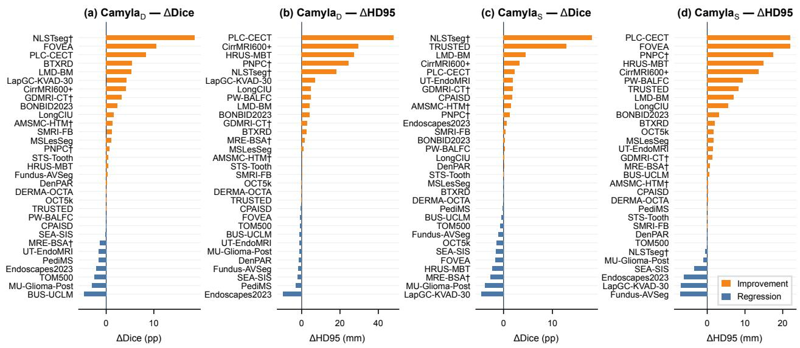  
Figure 3 Per-dataset performance change over the best baseline for both independent runs. Four panels show (a) ΔDice for Camyla , (b) ΔDice for Camyla , (c) ΔHD95 for Camyla , and (d) ΔHD95 for Camyla . Orange bars indicate improvement; blue bars indicate re<sub>g</sub>ression. For HD95, <sub>p</sub>ositive values indicate reduced boundar<sub>y</sub> error (im<sub>p</sub>rovement).

Table 5 Characterization of automated baselines compared against Camyla. “Search space” indicates whether the method explores a <sub>p</sub>redefined s<sub>p</sub>ace (closed) or can <sub>p</sub>ro<sub>p</sub>ose arbitrar<sub>y</sub> code modifications (o<sub>p</sub>en). “Pa<sub>p</sub>er out<sub>p</sub>ut” indicates whether the method <sub>p</sub>ro<sup>d</sup>uces a manuscr<sup>i</sup><sub>p</sub>t.

<table><tr><td>Method</td><td>Type</td><td>Search Space</td><td>Paper</td></tr><tr><td>AutoNNUNet</td><td>AutoML</td><td>Closed</td><td>No</td></tr><tr><td>DiNTS</td><td>NAS</td><td>Closed</td><td>No</td></tr><tr><td>AutoSeg3D</td><td>Ensemble</td><td>Closed</td><td>No</td></tr><tr><td>autoresearch</td><td>Research agent</td><td>Open</td><td>No</td></tr><tr><td>AI Scientist</td><td>Research agent</td><td>Open</td><td>Yes</td></tr><tr><td>AI Scientist-v2</td><td>Research agent</td><td>Open</td><td>Yes</td></tr><tr><td>Camyla</td><td>Research agent</td><td>Open</td><td>Yes</td></tr></table>

Results. Against automated segmentation methods, both Camyla runs outperform all baselines on aggregate Dice. T<sub>a</sub>bl<sub>e</sub> 6 <sub>repor</sub>t<sub>s</sub> th<sub>a</sub>t th<sub>e</sub> D<sub>eep</sub>S<sub>ee</sub>k <sub>run ac</sub>hi<sub>eves a mean</sub> Di<sub>ce o</sub>f 65<sub>.</sub>93% <sub>across</sub> 31 d<sub>a</sub>t<sub>ase</sub>t<sub>s, compare</sub>d t<sub>o</sub> 64<sub>.</sub>27% f<sub>or</sub> AutoNN UNet, 58.03% for DiN TS, and 63.43% for AutoSeg3D (evaluated on the 18 volumetric datasets). At th<sub>e</sub> d<sub>a</sub>t<sub>ase</sub>t l<sub>eve</sub>l<sub>,</sub> th<sub>e</sub> D<sub>eep</sub>S<sub>ee</sub>k r<sub>u</sub>n i<sub>s</sub> P<sub>a</sub>r<sub>e</sub>t<sub>o</sub>-<sub>supe</sub>ri<sub>o</sub>r t<sub>o</sub> AutoNN UNet <sub>o</sub>n 15/31 d<sub>a</sub>t<sub>ase</sub>t<sub>s a</sub>nd t<sub>o</sub> AutoSeg3D on 11/18 datasets<sub>,</sub> while these baselines are Pareto-su<sub>p</sub>erior to the Dee<sub>p</sub>Seek run on onl<sub>y</sub> 9/31 and 5/18 datasets<sub>,</sub> res<sub>p</sub>ectivel<sub>y</sub>. Detailed <sub>p</sub>er-dataset com<sub>p</sub>arisons are <sub>p</sub>rovided in A<sub>pp</sub>endix G (Tables 14–16).

Table 6 Aggregate comparison between Camyla and automated segmentation baselines. For each method, we report the mean Dice across evaluated datasets and the number of datasets on which the method is Pareto-superior to Camyla<sub>D</sub>. AutoSeg3D is evaluated onl<sub>y</sub> on the 18 volumetric (3D) datasets.

<table><tr><td>Method</td><td>Datasets</td><td>Mean Dice</td><td>Pareto vs CamylaD</td></tr><tr><td>AutoNNUNet</td><td>31</td><td>64.27%</td><td>9/31</td></tr><tr><td>DiNTS (retrained)</td><td>31</td><td>58.03%</td><td>1/31</td></tr><tr><td>AutoSeg3D</td><td>18</td><td>63.43%</td><td>5/18</td></tr><tr><td>CamylaD</td><td>31</td><td>65.93%</td><td>—</td></tr><tr><td>CamylaS</td><td>31</td><td>65.22%</td><td>—</td></tr></table>

Against open-ended research agents, Table 7 summarizes the comparison on the 26 blind-test datasets. Both Camyla runs com<sub>p</sub>lete all 26 datasets (100% com<sub>p</sub>letion rate), with the Dee<sub>p</sub>Seek run exceedin<sub>g</sub> the baseline on 14/26 datasets (mean Dice 65.91%, mean HD95 28.43 mm) and the Sonnet run on 18/26 (mean Dice 65.16%, mean HD95 29.21 mm). Among t<sup>h</sup>e autoresearch variants, C<sup>l</sup>au<sup>d</sup>e Co<sup>d</sup>e + Opus 4.6 provi<sup>d</sup>es t<sup>h</sup>e <sup>b</sup>est overa<sup>ll b</sup>a<sup>l</sup>ance: it comp<sup>l</sup>etes 18/26 tasks and exceeds the baseline on 10/26, while exhibitin<sub>g</sub> the lowest <sub>p</sub>ro<sub>p</sub>osal-drift rate (4/26) and the stron<sub>g</sub>est quantitative pro<sup>fil</sup>e among t<sup>h</sup>e autoresearch variants wit<sup>h</sup> a mean Dice o<sup>f</sup> 63.14% an<sup>d</sup> a mean HD95 o<sup>f</sup> 34.72 mm. C<sup>l</sup>au<sup>d</sup>e Co<sup>d</sup>e + MiniMax 2.5 ac<sup>h</sup>ieves t<sup>h</sup>e <sup>h</sup>ig<sup>h</sup>est <sup>b</sup>ase<sup>l</sup>ine-surpassing rate among t<sup>h</sup>e autoresearch variants (12/26), b<sub>u</sub>t <sub>w</sub>ith <sub>su</sub>b<sub>s</sub>t<sub>an</sub>ti<sub>a</sub>l i<sub>ns</sub>t<sub>a</sub>bilit<sub>y:</sub> it d<sub>r</sub>ift<sub>s</sub> f<sub>rom</sub> th<sub>e proposa</sub>l <sub>on</sub> 14/26 d<sub>a</sub>t<sub>ase</sub>t<sub>s an</sub>d <sub>y</sub>i<sub>e</sub>ld<sub>s a wea</sub>k<sub>er quan</sub>tit<sub>a</sub>ti<sub>ve pro</sub>fil<sub>e.</sub> Th<sub>e</sub> AI Scientist f<sub>a</sub>mil<sub>y</sub> i<sub>s wea</sub>k<sub>e</sub>r <sub>o</sub>n thi<sub>s</sub> b<sub>e</sub>n<sub>c</sub>hm<sub>a</sub>rk<sub>:</sub> th<sub>e o</sub>ri<sub>g</sub>in<sub>a</sub>l <sub>co</sub>m<sub>p</sub>l<sub>e</sub>t<sub>es</sub> 18/26 <sub>e</sub>x<sub>pe</sub>rim<sub>e</sub>nt<sub>s a</sub>nd <sub>e</sub>x<sub>cee</sub>d<sub>s</sub> the baseline on 5/26<sub>,</sub> reachin<sub>g</sub> a mean Dice of onl<sub>y</sub> 60.24% over com<sub>p</sub>leted runs<sub>;</sub> AI Sc ient ist-v2 com<sub>p</sub>letes onl<sub>y</sub> 12/26 with 3/26 exceeding the baseline. Camyla achieves zero proposal drift by construction, since the proposals <sub>are</sub> <sub>se</sub>lf<sub>-genera</sub>t<sub>e</sub>d <sub>an</sub>d th<sub>e</sub> <sub>sys</sub>t<sub>em</sub> <sub>arc</sub>hit<sub>ec</sub>t<sub>ure</sub> i<sub>s</sub> <sub>spec</sub>ifi<sub>ca</sub>ll<sub>y</sub> d<sub>es</sub>i<sub>gne</sub>d t<sub>o</sub> <sub>ma</sub>i<sub>n</sub>t<sub>a</sub>i<sub>n</sub> <sub>co</sub>h<sub>erence</sub> b<sub>e</sub>t<sub>ween</sub> <sub>proposa</sub>l <sub>an</sub>d im<sub>p</sub>l<sub>e</sub>m<sub>e</sub>nt<sub>a</sub>ti<sub>o</sub>n<sub>.</sub>

Table 7 Comparison with open-ended research agents on the 26 blind-test datasets. “Completed” denotes successful experiment execution; “>Baseline” counts datasets on which the s<sub>y</sub>stem exceeds the baseline (Dice im<sub>p</sub>rovement >0.5 <sub>pp</sub>, or HD95 im<sub>p</sub>rovement when Dice is within 0.5 <sub>pp</sub>). “Pro<sub>p</sub>osal Drift” denotes clear deviation from the ori<sub>g</sub>inal <sub>p</sub>lan. Dice and HD95 are summarized over completed runs only. Camyla<sub>D</sub> = DeepSeek V3.2; Camyla<sub>S</sub> = Claude Sonnet 4.6.

<table><tr><td>Family</td><td>Configuration</td><td>Completed</td><td>&gt;Baseline</td><td>Proposal Drift</td><td>Mean Dice</td><td>Mean HD95</td><td>Median Dice</td><td>Median HD95</td></tr><tr><td>autoresearch</td><td>Claude Code + Opus 4.6</td><td>18 / 26</td><td>10 / 26</td><td>4 / 26</td><td>63.14%</td><td>34.72</td><td>67.25%</td><td>20.83</td></tr><tr><td>autoresearch</td><td>Claude Code + MiniMax 2.5</td><td>15 / 26</td><td>12 / 26</td><td>14 / 26</td><td>62.58%</td><td>36.41</td><td>66.43%</td><td>22.15</td></tr><tr><td>autoresearch</td><td>Claude Code + GLM 4.7</td><td>16 / 26</td><td>10 / 26</td><td>12 / 26</td><td>62.21%</td><td>37.06</td><td>65.89%</td><td>23.04</td></tr><tr><td>autoresearch</td><td>Codex + GPT-5.4 (xhigh)</td><td>12 / 26</td><td>8 / 26</td><td>10 / 26</td><td>61.35%</td><td>38.92</td><td>64.71%</td><td>24.67</td></tr><tr><td>AI SCIENTIST</td><td>Default workflow</td><td>18 / 26</td><td>5 / 26</td><td>-</td><td>60.24%</td><td>40.55</td><td>63.18%</td><td>26.31</td></tr><tr><td>AI SCIENTIST-V2</td><td>BFTS workflow</td><td>12 / 26</td><td>3 / 26</td><td>-</td><td>58.73%</td><td>43.18</td><td>61.52%</td><td>28.94</td></tr><tr><td>Camyla</td><td>DeepSeek V3.2 ( $Camyla_D$ )</td><td>26 / 26</td><td>14 / 26</td><td>0 / 26</td><td>65.91%</td><td>28.43</td><td>69.62%</td><td>15.57</td></tr><tr><td>Camyla</td><td>Claude Sonnet 4.6 ( $Camyla_S$ )</td><td>26 / 26</td><td>18 / 26</td><td>0 / 26</td><td>65.16%</td><td>29.21</td><td>69.62%</td><td>16.01</td></tr></table>

## 4.3 Manuscript Quality

Study Design. We deliberately do not submit system-generated manuscripts to real venues or use live peer review as an evaluation instrument. Submittin<sub>g</sub> autonomousl<sub>y g</sub>enerated <sub>p</sub>a<sub>p</sub>ers would be inconsistent with the res<sub>p</sub>onsible-use <sub>po</sub>li<sub>c</sub>i<sub>es o</sub>f <sub>a</sub>ll t<sub>arge</sub>t <sub>venues an</sub>d <sub>wou</sub>ld i<sub>mpose an unnecessary</sub> b<sub>ur</sub>d<sub>en on vo</sub>l<sub>un</sub>t<sub>eer rev</sub>i<sub>ewers.</sub> I<sub>ns</sub>t<sub>ea</sub>d<sub>, we cons</sub>t<sub>ruc</sub>t <sub>a</sub> <sub>con</sub>t<sub>ro</sub>ll<sub>e</sub>d<sub>, o</sub>fli<sub>ne, an</sub>d <sub>re ro</sub>d<sub>uc</sub>ibl<sub>e eva</sub>l<sub>ua</sub>ti<sub>on su</sub>it<sub>e</sub> th<sub>a</sub>t <sub>com</sub>bi<sub>nes</sub> h<sub>uman s</sub>t<sub>ruc</sub>t<sub>ure</sub>d<sub>-summar rev</sub>i<sub>ew, mu</sub>lti<sub>-mo</sub>d<sub>e</sub>l AI summar<sub>y</sub> review<sub>,</sub> and full-manuscri<sub>p</sub>t a<sub>g</sub>entic review<sub>,</sub> benchmarked a<sub>g</sub>ainst 90 contem<sub>p</sub>oraneous external <sub>p</sub>a<sub>p</sub>ers. Thi<sub>s</sub> d<sub>es</sub>i<sub>gn cons</sub>tit<sub>u</sub>t<sub>es</sub> th<sub>e</sub> b<sub>es</sub>t <sub>ava</sub>il<sub>a</sub>bl<sub>e con</sub>t<sub>ro</sub>ll<sub>e</sub>d <sub>proxy</sub> f<sub>or manuscr</sub>i<sub>p</sub>t <sub>qua</sub>lit<sub>y un</sub>d<sub>er</sub> th<sub>e cons</sub>t<sub>ra</sub>i<sub>n</sub>t th<sub>a</sub>t li<sub>ve</sub> submission is neither a<sub>pp</sub>ro<sub>p</sub>riate nor ethical.

To instantiate this e<sub>v</sub>al<sub>u</sub>ation<sub>, w</sub>e constr<sub>u</sub>ct an external benchmark of 90 contem orar medical ima<sub>g</sub>e se<sub>g</sub>mentation papers samp<sup>l</sup>e<sup>d</sup> <sup>f</sup>rom 18 journa<sup>l</sup>s in<sup>d</sup>exe<sup>d</sup> in We<sup>b</sup> o<sup>f</sup> Science <sup>d</sup>uring 2025. T<sup>h</sup>e journa<sup>l</sup>s are organize<sup>d</sup> into t<sup>h</sup>ree tiers, summarize<sup>d</sup> in Ta<sup>bl</sup>e 8, wit<sup>h</sup> <sup>fi</sup>ve papers samp<sup>l</sup>e<sup>d</sup> per journa<sup>l</sup>; t<sup>h</sup>e <sup>f</sup>u<sup>ll</sup> venue <sup>l</sup>ist is in Appen<sup>d</sup>ix G.7.

Table 8 Tier composition of the external evaluation benchmark (90 papers across 18 journals, five papers per journal). Representative <sub>venues are</sub> li<sub>s</sub>t<sub>e</sub>d<sub>; see</sub> A<sub>ppen</sub>di<sub>x</sub> G<sub>.</sub>7 f<sub>or</sub> th<sub>e comp</sub>l<sub>e</sub>t<sub>e</sub> li<sub>s</sub>t<sub>.</sub>

<table><tr><td>Tier</td><td>Journals</td><td>Papers</td><td>Representative venues</td></tr><tr><td>T1</td><td>2</td><td>10</td><td>IEEE Transactions on Medical Imaging; Medical Image Analysis</td></tr><tr><td>T2</td><td>7</td><td>35</td><td>IEEE Journal of Biomedical and Health Informatics; Artificial Intelligence in Medicine; et al.</td></tr><tr><td>T3</td><td>9</td><td>45</td><td>International Journal of Computer Assisted Radiology and Surgery; Biomedical Physics &amp; Engineering Express; et al.</td></tr><tr><td>Total</td><td>18</td><td>90</td><td></td></tr></table>

All 130 <sub>p</sub>a<sub>p</sub>ers (90 external + 40 internal) are converted into structured <sub>p</sub>a<sub>p</sub>er summaries—standardized cards containin<sub>g</sub> title<sub>,</sub> <sub>p</sub>roblem form<sub>u</sub>lation<sub>,</sub> contrib<sub>u</sub>tions<sub>,</sub> method o<sub>v</sub>er<sub>v</sub>ie<sub>w,</sub> ex<sub>p</sub>erimental findin<sub>g</sub>s<sub>,</sub> and concl<sub>u</sub>sions. This <sub>represen</sub>t<sub>a</sub>ti<sub>on</sub> <sub>removes</sub> <sub>super</sub>fi<sub>c</sub>i<sub>a</sub>l f<sub>orma</sub>tti<sub>ng</sub> dif<sub>erences</sub> <sub>an</sub>d <sub>a</sub>ll<sub>ows</sub> b<sub>o</sub>th h<sub>uman</sub> <sub>an</sub>d AI <sub>eva</sub>l<sub>ua</sub>t<sub>ors</sub> t<sub>o</sub> <sub>opera</sub>t<sub>e</sub> <sub>on</sub> <sub>a</sub> <sub>common</sub> i<sub>n</sub>t<sub>er</sub>f<sub>ace.</sub> Th<sub>e eva</sub>l<sub>ua</sub>ti<sub>on procee</sub>d<sub>s on</sub> t<sub>wo comp</sub>l<sub>emen</sub>t<sub>ary</sub> t<sub>rac</sub>k<sub>s: a s</sub>t<sub>ruc</sub>t<sub>ure</sub>d<sub>-summary</sub> t<sub>rac</sub>k <sub>assesse</sub>d b<sub>y</sub> 15 human reviewers (10 junior, 5 senior) and 5 frontier AI models, and a full-manuscri<sub>p</sub>t track assessed b<sub>y</sub> Stanford A<sub>ge</sub>nti<sub>c</sub> R<sub>ev</sub>i<sub>ewe</sub>r<sub>.</sub>

Card-Based Blind Review by Humans. Each reviewer assesses 30 papers, producing 450 review assignments in t<sub>o</sub>t<sub>a</sub>l<sub>.</sub> E<sub>ac</sub>h <sub>rev</sub>i<sub>ew scores</sub> f<sub>our</sub> di<sub>mens</sub>i<sub>ons on a</sub> 0<sub>–</sub>5 <sub>sca</sub>l<sub>e: c</sub>l<sub>ar</sub>it<sub>y o</sub>f<sub>pro</sub>bl<sub>em</sub> f<sub>ormu</sub>l<sub>a</sub>ti<sub>on an</sub>d <sub>mo</sub>ti<sub>va</sub>ti<sub>on, me</sub>th<sub>o</sub>d<sub>o</sub>l<sub>og</sub>i<sub>ca</sub>l <sub>nove</sub>lt<sub>y, exper</sub>i<sub>men</sub>t<sub>a</sub>l <sub>comp</sub>l<sub>e</sub>t<sub>eness, an</sub>d <sub>overa</sub>ll <sub>recommen</sub>d<sub>a</sub>ti<sub>on.</sub> T<sub>a</sub>bl<sub>e</sub> 9 <sub>repor</sub>t<sub>s</sub> th<sub>e aggrega</sub>t<sub>e resu</sub>lt<sub>s.</sub> S<sub>en</sub>i<sub>or</sub> h<sub>uman</sub> reviewers place Camyla’s internal papers (3.311) above the T2 mean (3.217) and close to the T1 mean (3.364). Junior reviewers exhibit a similar <sub>p</sub>attern<sub>,</sub> scorin<sub>g</sub> internal <sub>p</sub>a<sub>p</sub>ers at 3.053 com<sub>p</sub>ared to T1’s 3.208 and T2’s 3.109. Both reviewer <sub>g</sub>rou<sub>p</sub>s <sub>p</sub>lace internal <sub>p</sub>a<sub>p</sub>ers clearl<sub>y</sub> above the T3 mean (2.792 for senior, 2.433 for junior).

Card-Based AI Review. Five frontier AI models (Claude Opus 4.6, DeepSeek V3.2, Gemini 3 Flash Preview, Gemini 3.1 Pro Preview, and GPT-5.4) evaluate the same structured summaries. The AI avera<sub>g</sub>e scores internal <sub>p</sub>a<sub>p</sub>ers at 3.610, <sub>p</sub>lacin<sub>g</sub> them on <sub>p</sub>ar with T1 <sub>p</sub>a<sub>p</sub>ers (3.644) and well above T2 (3.051) and T3 (2.492). This <sub>p</sub>attern—internal <sub>pape</sub>r<sub>s</sub> <sub>sco</sub>rin<sub>g</sub> b<sub>e</sub>t<sub>wee</sub>n T1 <sub>a</sub>nd T2 b<sub>y</sub> h<sub>u</sub>m<sub>a</sub>n <sub>eva</sub>l<sub>ua</sub>ti<sub>o</sub>n <sub>a</sub>nd <sub>a</sub>t th<sub>e</sub> T1 l<sub>eve</sub>l b<sub>y</sub> AI <sub>eva</sub>l<sub>ua</sub>ti<sub>o</sub>n—<sub>sugges</sub>t<sub>s</sub> th<sub>a</sub>t th<sub>e</sub> manuscripts generated by Camyla reach the quality level of strong clinical AI venues. Per-dimension breakdowns across the four rubric axes (<sub>p</sub>roblem formulation, methodolo<sub>g</sub>ical novelt<sub>y</sub>, ex<sub>p</sub>erimental com<sub>p</sub>leteness, and overall recommendation) are re<sub>p</sub>orted in A<sub>pp</sub>endix G.8.

Table 9 Aggregate overall-recommendation scores by reviewer group and paper tier on the structured-summary track. Human <sub>rows correspon</sub>d t<sub>o</sub> th<sub>e prov</sub>i<sub>s</sub>i<sub>ona</sub>l <sub>rev</sub>i<sub>ewer ma</sub>t<sub>r</sub>i<sub>x;</sub> th<sub>e</sub> AI <sub>row repor</sub>t<sub>s</sub> th<sub>e average over</sub> fi<sub>ve</sub> f<sub>ron</sub>ti<sub>er mo</sub>d<sub>e</sub>l <sub>eva</sub>l<sub>ua</sub>t<sub>ors.</sub>

<table><tr><td>Source</td><td>T1</td><td>T2</td><td>T3</td><td>Internal</td><td>Ext. Overall</td></tr><tr><td>Junior reviewers</td><td>3.208</td><td>3.109</td><td>2.433</td><td>3.053</td><td>2.954</td></tr><tr><td>Senior reviewers</td><td>3.364</td><td>3.217</td><td>2.792</td><td>3.311</td><td>3.038</td></tr><tr><td>All human</td><td>3.257</td><td>3.145</td><td>2.558</td><td>3.137</td><td>2.972</td></tr><tr><td>AI average (5 models)</td><td>3.644</td><td>3.051</td><td>2.492</td><td>3.610</td><td>2.862</td></tr></table>

Full-Paper AI Review. To complement the summary-based evaluation, Stanford Agentic Reviewer scores complete m<sub>a</sub>n<sub>usc</sub>ri<sub>p</sub>t<sub>s.</sub> T<sub>a</sub>bl<sub>e</sub> 10 r<sub>epo</sub>rt<sub>s</sub> th<sub>e</sub> r<sub>esu</sub>lt<sub>s.</sub> Th<sub>e</sub> r<sub>ev</sub>i<sub>ewe</sub>r <sub>ass</sub>i<sub>g</sub>n<sub>s</sub> blind-t<sub>es</sub>t int<sub>e</sub>rn<sub>a</sub>l <sub>pape</sub>r<sub>s a</sub> m<sub>ea</sub>n <sub>sco</sub>r<sub>e o</sub>f 4<sub>.</sub>766<sub>,</sub> above the external overall mean (4.633), the T2 mean (4.603), and the T3 mean (4.422), while remainin<sub>g</sub> below the T1 mean (5.690). Validation-derived internal <sub>p</sub>a<sub>p</sub>ers score lower (4.363), consistent with the ex<sub>p</sub>ectation that s<sub>y</sub>stem d<sub>eve</sub>l<sub>opmen</sub>t <sub>ar</sub>tif<sub>ac</sub>t<sub>s rece</sub>i<sub>ve</sub> l<sub>ess</sub> f<sub>avora</sub>bl<sub>e eva</sub>l<sub>ua</sub>ti<sub>on.</sub> Th<sub>ese resu</sub>lt<sub>s con</sub>fi<sub>rm</sub> th<sub>a</sub>t th<sub>e manuscr</sub>i<sub>p</sub>t<sub>s pro</sub>d<sub>uce</sub>d b<sub>y</sub> Camyla on unseen datasets approach the quality of T1/T2 venues in the contemporary medical image segmentation lit<sub>era</sub>t<sub>ure.</sub>

Table 10 Stanford Agentic Reviewer results on full manuscripts.

<table><tr><td></td><td>T1</td><td>T2</td><td>T3</td><td>Int. Blind</td><td>Int. Val.</td><td>Int. All</td><td>Ext. All</td></tr><tr><td>Stanford Agentic</td><td>5.690</td><td>4.603</td><td>4.422</td><td>4.766</td><td>4.363</td><td>4.685</td><td>4.633</td></tr></table>

(a) Structured-Summary Track  
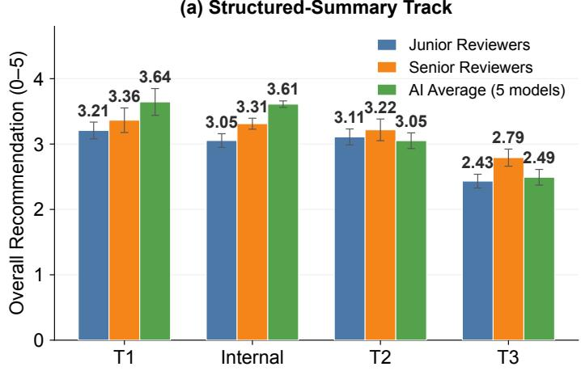

(b) Full-Manuscript Track  
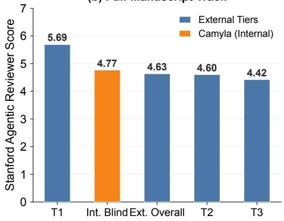  
Figure 4 Manuscript quality scores across evaluation tracks. (a) Structured-summary track: mean overall-recommendation scores from senior human reviewers and the five-model AI average, stratified by paper tier (T1, T2, T3) and Camyla-generated internal <sub>p</sub>a<sub>p</sub>ers. The dashed line marks the external overall mean for senior reviewers. (b) Full-manuscri<sub>p</sub>t track: Stanford A<sub>g</sub>entic Reviewer scores for external tiers and Camyla internal blind-test papers.

Re<sub>p</sub>resentative manuscri<sub>p</sub>ts are shown in A<sub>pp</sub>endix B<sub>,</sub> includin<sub>g</sub> full <sub>p</sub>a<sub>g</sub>e la<sub>y</sub>outs for <sub>p</sub>a<sub>p</sub>ers on neonatal brain lesion se<sub>g</sub>mentation (Dataset 8, +4.25 <sub>pp</sub> Dice) and liver se<sub>g</sub>mentation from cirrhotic MRI (Dataset 11, +5.14% Dice, −33.85%

HD95). Across all 40 <sub>g</sub>enerated <sub>p</sub>a<sub>p</sub>ers, each manuscri<sub>p</sub>t contains a self-contained literature review, a method section <sub>w</sub>ith <sub>arc</sub>hit<sub>ec</sub>t<sub>ura</sub>l di<sub>agrams</sub> <sub>an</sub>d <sub>ma</sub>th<sub>ema</sub>ti<sub>ca</sub>l f<sub>ormu</sub>l<sub>a</sub>ti<sub>ons,</sub> <sub>an</sub>d <sub>an</sub> <sub>exper</sub>i<sub>men</sub>t<sub>a</sub>l <sub>sec</sub>ti<sub>on</sub> <sub>w</sub>ith <sub>a</sub>bl<sub>a</sub>ti<sub>on</sub> <sub>s</sub>t<sub>u</sub>di<sub>es</sub> <sub>an</sub>d multi-baseline com<sub>p</sub>arisons.

## 5 Analysis

## 5.1 Ablation of System Components

Experimental Protocol. We conduct ablation experiments on the five validation datasets (1, 2, 3, 4, and 5) to quantify the contribution of each core system component. Starting from the full Camyla configuration, we remove or re<sub>p</sub><sup>l</sup>ace one com<sub>p</sub>onent at a t<sup>i</sup>me:

• Full Camyla: The complete system with QWBE, LRM, and DDF.

• −QWBE: QWBE replaced with uniform round-robin allocation.

• −LRM: Three-tier memory replaced with raw log injection.

• −DDF: Five-suggestion divergent diagnostic replaced with single-point prescriptive feedback.

Results. Table 11 summarizes the aggregate results. The full system achieves the strongest profile: 4/5 wins, a mean Di<sub>ce</sub> i<sub>mprovemen</sub>t <sub>o</sub>f +1<sub>.</sub>85 <sub>pp, a mean</sub> fi<sub>rs</sub>t<sub>-success pos</sub>iti<sub>on o</sub>f 4<sub>.</sub>8<sub>, an</sub>d <sub>a mean no</sub>d<sub>e</sub> b<sub>u</sub>d<sub>ge</sub>t <sub>o</sub>f 21<sub>.</sub>4 <sub>no</sub>d<sub>es per</sub> d<sub>a</sub>t<sub>ase</sub>t<sub>.</sub> Removin<sub>g</sub> an<sub>y</sub> sin<sub>g</sub>le com<sub>p</sub>onent de<sub>g</sub>rades at least two of the four metrics. The −QWBE variant retains 3/5 wins but re<sub>q</sub>uires substantiall<sub>y</sub> more nodes to reach its first success (mean FSP increases from 4.8 to 9.5), indicatin<sub>g</sub> that the uniform allocation <sub>p</sub>olic<sub>y</sub> wastes bud<sub>g</sub>et on un<sub>p</sub>romisin<sub>g</sub> branches. The −LRM variant shows the shar<sub>p</sub>est decline in end-state <sub>q</sub>ualit<sub>y</sub>: wins dro<sub>p</sub> to 2/5 and mean ΔDice falls to +0.47 <sub>pp</sub>, su<sub>gg</sub>estin<sub>g</sub> that raw lo<sub>g</sub> injection causes context contamination that im<sub>p</sub>airs sustained im<sub>p</sub>rovement across c<sub>y</sub>cles. The −DDF variant maintains 3/5 wins but with lower mean ΔDice (+1.02 <sub>pp</sub>) and dela<sub>y</sub>ed first success (mean FSP = 7.3), reflectin<sub>g</sub> the loss of dia<sub>g</sub>nostic diversit<sub>y</sub>.

The ablation results suggest that QWBE, LRM, and DDF function as a coupled system rather than independent add-ons: the three components address complementary failure modes. QWBE primarily governs where computational <sub>resources are a</sub>ll<sub>oca</sub>t<sub>e</sub>d<sub>:</sub> it<sub>s remova</sub>l <sub>near</sub>l<sub>y</sub> d<sub>ou</sub>bl<sub>es</sub> th<sub>e mean</sub> FSP f<sub>rom</sub> 4<sub>.</sub>8 t<sub>o</sub> 9<sub>.</sub>5<sub>.</sub> LRM <sub>pr</sub>i<sub>mar</sub>il<sub>y governs w</sub>h<sub>a</sub>t th<sub>e</sub> <sub>age</sub>nt kn<sub>ows: o</sub>n D<sub>a</sub>t<sub>ase</sub>t 5<sub>,</sub> r<sub>e</sub>m<sub>ov</sub>in<sub>g</sub> LRM <sub>cu</sub>t<sub>s</sub> th<sub>e</sub> Di<sub>ce ga</sub>in fr<sub>o</sub>m +18<sub>.</sub>58 <sub>pp</sub> t<sub>o</sub> +8<sub>.</sub>35 <sub>pp, a</sub> 55% r<sub>e</sub>d<sub>uc</sub>ti<sub>o</sub>n<sub>.</sub> DDF <sub>p</sub>rimaril<sub>y</sub> <sub>g</sub>overns how man<sub>y</sub> directions the a<sub>g</sub>ent considers: on Dataset 3<sub>,</sub> the full s<sub>y</sub>stem recovers throu<sub>g</sub>h a late-sta<sub>g</sub>e dia<sub>g</sub>nostic insi<sub>g</sub>ht (FSP = 19) that the sin<sub>g</sub>le-fix variant never discovers. Dataset 2 is the onl<sub>y</sub> validation dataset where <sub>no</sub> <sub>con</sub>fi<sub>gura</sub>ti<sub>on—</sub>i<sub>nc</sub>l<sub>u</sub>di<sub>ng</sub> th<sub>e</sub> f<sub>u</sub>ll <sub>sys</sub>t<sub>em—</sub>b<sub>ea</sub>t<sub>s</sub> th<sub>e</sub> b<sub>ase</sub>li<sub>ne,</sub> i<sub>n</sub>di<sub>ca</sub>ti<sub>ng</sub> th<sub>a</sub>t thi<sub>s</sub> f<sub>a</sub>il<sub>ure</sub> i<sub>s</sub> <sub>roo</sub>t<sub>e</sub>d i<sub>n</sub> th<sub>e</sub> i<sub>n</sub>h<sub>eren</sub>t difi<sub>cu</sub>lt<sub>y o</sub>f th<sub>e</sub> t<sub>as</sub>k <sub>ra</sub>th<sub>er</sub> th<sub>an</sub> i<sub>n a spec</sub>ifi<sub>c componen</sub>t d<sub>e</sub>fi<sub>c</sub>i<sub>ency.</sub>

Table 11 Aggregate ablation results on the five validation datasets (1, 2, 3, 4, 5). Wins: datasets exceeding the best baseline. Mean ΔDice: average Dice improvement (pp). Mean FSP: average first-success position (lower is better; computed over winning datasets only). Mean Nodes: average total nodes expanded.

<table><tr><td>Configuration</td><td>Wins (/5)</td><td>Mean ΔDice</td><td>Mean FSP↓</td><td>Mean Nodes</td></tr><tr><td>Full Camyla</td><td>4</td><td>+1.85</td><td>4.8</td><td>21.4</td></tr><tr><td>-QWBE</td><td>3</td><td>+1.31</td><td>9.5</td><td>26.8</td></tr><tr><td>-LRM</td><td>2</td><td>+0.47</td><td>6.3</td><td>24.2</td></tr><tr><td>-DDF</td><td>3</td><td>+1.02</td><td>7.3</td><td>23.6</td></tr></table>

## 5.2 Exploration Trajectories

The a<sub>gg</sub>re<sub>g</sub>ate metrics in §5.1 confirm that each com<sub>p</sub>onent contributes to end-state <sub>p</sub>erformance, but the<sub>y</sub> do not revea<sup>l h</sup>ow t<sup>h</sup>e searc<sup>h</sup> un<sup>f</sup>o<sup>ld</sup>s over time. Two <sup>d</sup>etai<sup>l</sup>e<sup>d</sup> case stu<sup>d</sup>ies in Appen<sup>d</sup>ix D provi<sup>d</sup>e no<sup>d</sup>e-<sup>b</sup>y-no<sup>d</sup>e trajectory anal<sub>y</sub>ses that ex<sub>p</sub>ose the technical content of each ex<sub>p</sub>erimental trial. On Dataset 3 (PNPC), the s<sub>y</sub>stem ex<sub>p</sub>lores ei<sub>g</sub>ht root-level DDAM variants before QWBE concentrates resources on the most promising branch; a major architectural <sub>re</sub>d<sub>es</sub>i <sub>n a</sub>t <sub>no</sub>d<sub>e</sub> 9<sub>—re</sub> l<sub>ac</sub>i<sub>n s a</sub>ti<sub>a</sub>l <sub>a</sub>tt<sub>en</sub>ti<sub>on w</sub>ith d<sub>e</sub>f<sub>orma</sub>bl<sub>e sam</sub> li<sub>n an</sub>d CBAM<sub>-s</sub>t l<sub>e a</sub>tt<sub>en</sub>ti<sub>on—ac</sub>hi<sub>eves</sub> th<sub>e</sub> fi<sub>rs</sub>t baseline-sur<sub>p</sub>assin<sub>g</sub> result, with a subse<sub>q</sub>uent refinement reducin<sub>g</sub> HD95 b<sub>y</sub> more than half. On Dataset 9 (BTXRD), <sub>s</sub>ix f<sub>a</sub>il<sub>e</sub>d <sub>va</sub>ri<sub>a</sub>nt<sub>s w</sub>ithin th<sub>e</sub> CCAN+MRFA <sub>pa</sub>r<sub>a</sub>di<sub>g</sub>m tri<sub>gge</sub>r DDF t<sub>o ge</sub>n<sub>e</sub>r<sub>a</sub>t<sub>e a ca</sub>t<sub>ego</sub>ri<sub>ca</sub>ll<sub>y</sub> di<sub>s</sub>tin<sub>c</sub>t dir<sub>ec</sub>ti<sub>o</sub>n<sub>:</sub> Multi-Scale Gated Axial Attention (MGAA), which decom<sub>p</sub>oses 2D attention into se<sub>q</sub>uential 1D axial o<sub>p</sub>erations and surpasses t<sup>h</sup>e <sup>b</sup>ase<sup>l</sup>ine at no<sup>d</sup>e 7 <sup>b</sup>y +2.7 pp Dice. T<sup>h</sup>ese trajectories exemp<sup>l</sup>i<sup>f</sup>y t<sup>h</sup>e interp<sup>l</sup>ay <sup>b</sup>etween <sup>b</sup>roa<sup>d</sup> exp<sup>l</sup>oration and focused refinement that QWBE and DDF are designed to produce.

## 5.3 Cross-Run Stability and Variance

Th<sub>e</sub> t<sub>wo</sub> i<sub>n</sub>d<sub>epen</sub>d<sub>en</sub>t <sub>runs</sub> dif<sub>er on</sub>l<sub>y</sub> i<sub>n</sub> th<sub>e</sub> l<sub>anguage mo</sub>d<sub>e</sub>l <sub>use</sub>d f<sub>or proposa</sub>l <sub>genera</sub>ti<sub>on, prov</sub>idi<sub>ng a na</sub>t<sub>ura</sub>l t<sub>es</sub>t <sub>o</sub>f s<sub>y</sub>stem sensitivit<sub>y</sub> to the idea <sub>g</sub>enerator. The concordance rate on success or failure is 23/31 datasets (74.2%), and for the 16 co-won datasets the Pearson correlation of best Dice is �=0.978 (mean absolute diference 1.56 <sub>pp</sub>). The two generators produce complementary win profiles: Camyla<sub>D</sub> wins primarily through Dice improvement (16/18 wins), while Camyla<sub>S</sub> wins equally through Dice and HD95 tiebreak (11/11), suggesting diferent improvement modalities. Camyla<sub>S</sub> explores fewer nodes (514 vs. 863) yet achieves a higher success rate, pointing to proposal quality rather th<sub>an</sub> <sub>searc</sub>h d<sub>ep</sub>th <sub>as</sub> th<sub>e</sub> <sub>pr</sub>i<sub>mary</sub> dif<sub>eren</sub>ti<sub>a</sub>t<sub>or.</sub> Th<sub>e</sub> <sub>un</sub>i<sub>on</sub> <sub>covers</sub> 77<sub>.</sub>4% <sub>o</sub>f d<sub>a</sub>t<sub>ase</sub>t<sub>s—</sub>6 <sub>more</sub> th<sub>an</sub> th<sub>e</sub> b<sub>e</sub>tt<sub>er</sub> i<sub>n</sub>di<sub>v</sub>id<sub>ua</sub>l run—confirmin<sub>g g</sub>enuine com<sub>p</sub>lementarit<sub>y</sub>.

## 5.4 Budget Sensitivity

We anal<sub>y</sub>ze how much com<sub>p</sub>utational bud<sub>g</sub>et is necessar<sub>y</sub> b<sub>y</sub> retros<sub>p</sub>ectivel<sub>y</sub> truncatin<sub>g</sub> the ex<sub>p</sub>erimental trace at <sub>no</sub>d<sub>e</sub> i<sub>n</sub>d<sub>ex</sub> � <sub>an</sub>d <sub>recor</sub>di<sub>ng w</sub>h<sub>e</sub>th<sub>er</sub> th<sub>e sys</sub>t<sub>em</sub> h<sub>as excee</sub>d<sub>e</sub>d th<sub>e</sub> b<sub>ase</sub>li<sub>ne a</sub>t th<sub>a</sub>t <sub>po</sub>i<sub>n</sub>t<sub>.</sub>

Cumulative Win Rate. Figure 5 plots the fraction of datasets won as a function of node budget �. Both runs exhibit a stee<sub>p</sub> initial rise: at �=5, Run 1 reaches 38.7% (12/31) and Run 2 reaches 29.0% (9/31). The curves conver<sub>g</sub>e b �=10 where the two runs achieve com arable win rates of 48.4% and 51.6%. Be ond �=10 each additional node contributes diminishin<sub>g</sub> returns. Run 1 reaches its final win rate at �=20; Run 2 continues to accumulate wins throu<sub>g</sub>h �=25. Takin<sub>g</sub> the union, the s<sub>y</sub>stem exceeds the baseline on at least one run for 67.7% of datasets at �=10 and 77.4% at �=30.

First-Success Position. Across the 18 successful runs in Run 1, the median FSP is 4 and the mean is 5.2; across the 22 successful runs in Run 2, the median is 6 and the mean is 7.6. In Run 1, 12 of 18 successes (67%) occur within the first 5 nodes. Run 2 exhibits a broader distribution: 9 of 22 (41%) occur within the first 5, 7 between nodes 6–10, and 6 re<sub>q</sub>uire more than 10. Amon<sub>g</sub> the 40 successful runs across both rounds, 30 (75%) succeed within a sin<sub>g</sub>le <sub>p</sub>ro<sub>p</sub>osal (10 nodes), 9 re uire two ro osals, and 1 re uires all three. The 10 runs de endin on a second or third ro osal serve as a recover<sub>y</sub> mechanism for initiall<sub>y u</sub>n<sub>p</sub>romisin<sub>g</sub> research directions.

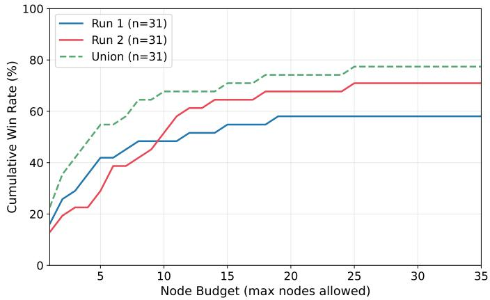  
Figure 5 Cumulative win rate as a function of node budget �. A dataset counts as won at budget � if any node with index ≤ � <sub>excee</sub>d<sub>s</sub> th<sub>e</sub> b<sub>ase</sub>li<sub>ne.</sub> T<sub>wo</sub> i<sub>n</sub>d<sub>epen</sub>d<sub>en</sub>t <sub>runs an</sub>d th<sub>e</sub>i<sub>r un</sub>i<sub>on are s</sub>h<sub>own.</sub>

## 5.5 Failure Cases

Seven of 31 datasets are never sur<sub>p</sub>assed b<sub>y</sub> either run (Datasets 2, 13, 17, 22, 23, 27, and 29). These failures share two recurrin<sub>g</sub> <sub>p</sub>atterns: (1) stron<sub>g</sub> baselines with narrow im<sub>p</sub>rovement mar<sub>g</sub>ins (e.<sub>g</sub>., Dataset 13 at 96.2% Dice, Dataset 29 at 92.2%), and (2) tasks where multi-class se<sub>g</sub>mentation with hi<sub>g</sub>h inter-structure variabilit<sub>y</sub> makes uniform <sub>g</sub>ains from a sin<sub>g</sub>le architectural modification dificult (e.<sub>g</sub>., Dataset 2 with 10 classes, Dataset 22 with 4 classes). A detailed case stud<sub>y</sub> of Dataset 2 (MRE-BSA) is <sub>p</sub>rovided in A<sub>pp</sub>endix C, where both runs exhaust all 60 trials without exceedin<sub>g</sub> the U<sub>-</sub>M<sub>am</sub>b<sub>a</sub> b<sub>ase</sub>li<sub>ne, con</sub>fi<sub>rm</sub>i<sub>ng</sub> th<sub>a</sub>t thi<sub>s</sub> li<sub>m</sub>it<sub>a</sub>ti<sub>on</sub> i<sub>s roo</sub>t<sub>e</sub>d i<sub>n</sub> th<sub>e</sub> t<sub>as</sub>k<sub>–</sub>b<sub>ase</sub>li<sub>ne</sub> i<sub>n</sub>t<sub>erac</sub>ti<sub>on ra</sub>th<sub>er</sub> th<sub>an a componen</sub>t d<sub>e</sub>fi<sub>c</sub>i<sub>ency.</sub>

## 6 Related Work

AI for Research. Large language models have progressed from code completion [53] to autonomous software en<sub>g</sub>ineerin<sub>g</sub> a<sub>g</sub>ents that navi<sub>g</sub>ate re<sub>p</sub>ositories, edit files, and execute tests [54–56], raisin<sub>g</sub> the <sub>q</sub>uestion of whether the full research lifec<sub>y</sub>cle—h<sub>yp</sub>othesis <sub>g</sub>eneration<sub>,</sub> ex<sub>p</sub>erimentation<sub>,</sub> and manuscri<sub>p</sub>t <sub>g</sub>eneration—can be similarl<sub>y</sub> <sub>au</sub>t<sub>oma</sub>t<sub>e</sub>d<sub>.</sub>

Earl<sub>y</sub> end-to-end s<sub>y</sub>stems addressed this <sub>q</sub>uestion in the machine-learnin<sub>g</sub> domain. The AI Scientist [1] <sub>g</sub>enerated research ideas<sub>,</sub> ran ex<sub>p</sub>eriments<sub>,</sub> and wrote <sub>p</sub>a<sub>p</sub>ers at under \$15 <sub>p</sub>er <sub>p</sub>a<sub>p</sub>er<sub>,</sub> establishin<sub>g</sub> the first full<sub>y</sub> autonomous research <sub>p</sub>i<sub>p</sub>eline. Its successor, AI Scientist-v2 [2], re<sub>p</sub>laced the linear execution strate<sub>gy</sub> with a <sub>p</sub>ro<sub>g</sub>ressive a<sub>g</sub>entic tree search<sub>, p</sub>rod<sub>u</sub>cin<sub>g</sub> the first AI-<sub>g</sub>enerated <sub>p</sub>a<sub>p</sub>er acce<sub>p</sub>ted at a <sub>p</sub>eer-re<sub>v</sub>ie<sub>w</sub>ed ICLR <sub>w</sub>orksho<sub>p</sub>. Se<sub>v</sub>eral conc<sub>u</sub>rren s stems ex lore alternative decom ositions of the research rocess: MLR-Co ilot [57] se arates ideation from im<sub>p</sub>lementation with an RL-tuned idea <sub>g</sub>enerator; A<sub>g</sub>ent Laborator<sub>y</sub> [3] inserts o<sub>p</sub>tional human feedback at each sta<sub>g</sub>e, reducin<sub>g</sub> cost b<sub>y</sub> 84%; and CodeScientist [58] frames ideation as <sub>g</sub>enetic search over code blocks, discoverin<sub>g</sub> 19 novel artifacts. Dee<sub>p</sub>Scientist [59] formalizes discover<sub>y</sub> as Ba<sub>y</sub>esian o<sub>p</sub>timization with a cumulative Findin<sub>g</sub>s Memor<sub>y</sub>, <sub>su</sub>r<sub>pass</sub>in<sub>g</sub> h<sub>u</sub>m<sub>a</sub>n SOTA <sub>o</sub>n thr<sub>ee</sub> AI t<sub>as</sub>k<sub>s</sub> thr<sub>oug</sub>h m<sub>o</sub>nth-l<sub>o</sub>n<sub>g</sub> <sub>au</sub>t<sub>o</sub>n<sub>o</sub>m<sub>ous</sub> <sub>cyc</sub>l<sub>es,</sub> th<sub>oug</sub>h <sub>a</sub>t <sub>a</sub> <sub>cos</sub>t <sub>o</sub>f <sub>ove</sub>r 20<sub>,</sub>000 GPU h<sub>ou</sub>r<sub>s ac</sub>r<sub>oss</sub> thr<sub>ee</sub> t<sub>as</sub>k<sub>s w</sub>ith<sub>ou</sub>t m<sub>a</sub>n<sub>usc</sub>ri<sub>p</sub>t <sub>ge</sub>n<sub>e</sub>r<sub>a</sub>ti<sub>o</sub>n<sub>.</sub> On th<sub>e</sub> id<sub>ea</sub>ti<sub>o</sub>n fr<sub>o</sub>nt<sub>,</sub> m<sub>u</sub>lti-<sub>age</sub>nt <sub>a</sub>r<sub>c</sub>hit<sub>ec</sub>t<sub>u</sub>r<sub>es</sub>— iterative review [60], virtual scientific teams [61], and <sub>p</sub>ersistent memor<sub>y</sub> [62]—have im<sub>p</sub>roved idea novelt<sub>y</sub> and feasibilit over sin le-a ent baselines [63]. In the scientific-discover settin , FunSearch [64] aired an LLM with a s<sub>y</sub>stematic evaluator in an evolutionar<sub>y</sub> loo<sub>p</sub> to sur<sub>p</sub>ass best-known results in extremal combinatorics<sub>,</sub> demonstratin<sub>g</sub> that LLM-<sub>g</sub>uided <sub>p</sub>ro<sub>g</sub>ram search can <sub>y</sub>ield <sub>g</sub>enuine mathematical discoveries. A recent surve<sub>y</sub> [65] charts the broader l<sub>an</sub>d<sub>scape</sub> f<sub>rom</sub> t<sub>as</sub>k <sub>au</sub>t<sub>oma</sub>ti<sub>on</sub> t<sub>o</sub> <sub>au</sub>t<sub>onomous</sub> <sub>agen</sub>t<sub>s.</sub>

These ideas are increasin<sub>g</sub>l<sub>y</sub> a<sub>pp</sub>lied in domain-s<sub>p</sub>ecific settin<sub>g</sub>s. The Medical AI Scientist [66] is most closel<sub>y</sub> related to our work<sub>,</sub> tailorin<sub>g</sub> the <sub>p</sub>aradi<sub>g</sub>m to clinical research with a clinician-en<sub>g</sub>ineer co-reasonin<sub>g</sub> mechanism across 19 <sub>c</sub>li<sub>n</sub>i<sub>ca</sub>l t<sub>as</sub>k<sub>s</sub> <sub>an</sub>d 6 <sub>mo</sub>d<sub>a</sub>liti<sub>es;</sub> h<sub>owever,</sub> it d<sub>e</sub>fi<sub>nes</sub> <sub>success</sub> <sub>as</sub> <sub>execu</sub>t<sub>a</sub>bl<sub>e</sub> <sub>co</sub>d<sub>e</sub> <sub>ra</sub>th<sub>er</sub> th<sub>an</sub> b<sub>ase</sub>li<sub>ne-surpass</sub>i<sub>ng</sub> <sub>p</sub>erformance<sub>,</sub> evaluates manuscri<sub>p</sub>t <sub>q</sub>ualit<sub>y</sub> on onl<sub>y</sub> 5 <sub>g</sub>enerated <sub>p</sub>a<sub>p</sub>ers a<sub>g</sub>ainst 15 venue-matched references from a sin<sub>g</sub>le task (diabetic retino<sub>p</sub>ath<sub>y</sub> classification), and em<sub>p</sub>lo<sub>y</sub>s a sin<sub>g</sub>le-<sub>p</sub>ass <sub>p</sub>i<sub>p</sub>eline without tree search or <sub>p</sub>erformanceaware dia<sub>g</sub>nostic feedback. Other domain-s<sub>p</sub>ecific s<sub>y</sub>stems include O<sub>p</sub>enLens AI [67] for health informatics, DORA [68] for multi-a<sub>g</sub>ent re<sub>p</sub>ort <sub>g</sub>eneration, S<sub>p</sub>atialA<sub>g</sub>ent [69] for s<sub>p</sub>atial biolo<sub>gy</sub>, and PharmA<sub>g</sub>ents [70] for dru<sub>g</sub> discover<sub>y</sub>.

A sim<sub>p</sub>ler alternative to <sub>p</sub>ur<sub>p</sub>ose-built <sub>p</sub>i<sub>p</sub>elines is to re<sub>p</sub>ur<sub>p</sub>ose <sub>g</sub>eneral-<sub>p</sub>ur<sub>p</sub>ose codin<sub>g</sub> a<sub>g</sub>ents directl<sub>y</sub> for research. T<sup>h</sup>e autoresearch para<sup>d</sup>igm [8] wraps a co<sup>d</sup>ing agent (e.g., C<sup>l</sup>au<sup>d</sup>e Co<sup>d</sup>e) in a <sup>l</sup>oop t<sup>h</sup>at proposes co<sup>d</sup>e mo<sup>d</sup>i<sup>fi</sup>cations, <sub>execu</sub>t<sub>es ex er</sub>i<sub>men</sub>t<sub>s, an</sub>d <sub>o</sub>b<sub>serves sca</sub>l<sub>ar rewar</sub>d<sub>s—essen</sub>ti<sub>a</sub>ll t<sub>rea</sub>ti<sub>n researc</sub>h <sub>as a co</sub>d<sub>e-o</sub> ti<sub>m</sub>i<sub>za</sub>ti<sub>on ro</sub>bl<sub>em.</sub> Thi<sub>s</sub> a<sub>pp</sub>roach has shown <sub>p</sub>romise in discoverin<sub>g</sub> adversarial attack al<sub>g</sub>orithms [71], multimodal memor<sub>y</sub> architectures [72], an<sup>d</sup> even meta-optimizing t<sup>h</sup>e autoresearc<sup>h</sup> <sup>l</sup>oop itse<sup>lf</sup> [73]. We eva<sup>l</sup>uate severa<sup>l</sup> autoresearch con<sup>fi</sup>gurations in §4.2, findin<sub>g</sub> that while the<sub>y</sub> can occasionall<sub>y</sub> discover stron<sub>g</sub> im<sub>p</sub>rovements, their com<sub>p</sub>letion rates (46–69%) and <sub>re</sub>li<sub>a</sub>bilit<sub>y</sub> f<sub>a</sub>ll <sub>su</sub>b<sub>s</sub>t<sub>an</sub>ti<sub>a</sub>ll<sub>y</sub> b<sub>e</sub>l<sub>ow</sub> th<sub>ose</sub> <sub>o</sub>f <sub>a</sub> <sub>s</sub>t<sub>ruc</sub>t<sub>ure</sub>d <sub>researc</sub>h <sub>sys</sub>t<sub>em.</sub>

Des<sub>p</sub>ite this ra<sub>p</sub>id <sub>p</sub>ro<sub>g</sub>ress<sub>,</sub> a common limitation <sub>p</sub>ersists: existin<sub>g</sub> s<sub>y</sub>stems have been validated at small ex<sub>p</sub>erimental <sub>sca</sub>l<sub>e—</sub>t<sub>yp</sub>i<sub>ca</sub>ll<sub>y one</sub> t<sub>o</sub> th<sub>ree</sub> d<sub>a</sub>t<sub>ase</sub>t<sub>s per run</sub> f<sub>or en</sub>d<sub>-</sub>t<sub>o-en</sub>d <sub>sys</sub>t<sub>ems.</sub> It th<sub>ere</sub>f<sub>ore rema</sub>i<sub>ns unc</sub>l<sub>ear w</sub>h<sub>e</sub>th<sub>er</sub> th<sub>e</sub> di<sub>scover</sub>i<sub>es</sub> <sub>genera</sub>li<sub>ze</sub> <sub>across</sub> di<sub>verse</sub> <sub>pro</sub>bl<sub>em</sub> <sub>se</sub>tti<sub>ngs</sub> <sub>or</sub> <sub>w</sub>h<sub>e</sub>th<sub>er</sub> th<sub>e</sub> <sub>sys</sub>t<sub>ems</sub> <sub>can</sub> <sub>re</sub>li<sub>a</sub>bl<sub>y</sub> <sub>opera</sub>t<sub>e</sub> <sub>w</sub>ith<sub>ou</sub>t h<sub>uman</sub> intervention at scale. Camyla addresses this gap with a strict zero-intervention protocol across 31 medical image se<sub>g</sub>mentation datasets in two inde<sub>p</sub>endent runs<sub>,</sub> achievin<sub>g</sub> 100% task com<sub>p</sub>letion and baseline-sur<sub>p</sub>assin<sub>g p</sub>erformance on 22 and 18 datasets res<sub>p</sub>ectivel<sub>y,</sub> while <sub>p</sub>roducin<sub>g</sub> 40 com<sub>p</sub>lete manuscri<sub>p</sub>ts. In a controlled evaluation a<sub>g</sub>ainst 90 contemporary published papers stratified by venue tier, senior human reviewers scored Camyla’s manuscripts at the T1/T2 boundar<sub>y</sub> (3.311 vs. T1: 3.364, T2: 3.217 on a 0–5 scale), five frontier AI raters <sub>p</sub>laced them on <sub>p</sub>ar with T1 (3.610 vs. 3.644), and Stanford A<sub>g</sub>entic Reviewer assi<sub>g</sub>ned blind-test manuscri<sub>p</sub>ts a mean of 4.766, above the T2 mean (4.603) and the external overall mean (4.633).

Automated Medical Image Segmentation. We use the term automated to refer to systems that autonomously confi<sub>g</sub>ure<sub>,</sub> o<sub>p</sub>timize<sub>,</sub> or search for se<sub>g</sub>mentation models <sub>g</sub>iven a new dataset<sub>,</sub> as distinct from automatic se<sub>g</sub>mentation<sub>,</sub> <sub>w</sub>hi<sub>c</sub>h d<sub>eno</sub>t<sub>es</sub> th<sub>e</sub> i<sub>n</sub>f<sub>erence-</sub>ti<sub>me app</sub>li<sub>ca</sub>ti<sub>on o</sub>f <sub>a pre-</sub>t<sub>ra</sub>i<sub>ne</sub>d <sub>mo</sub>d<sub>e</sub>l t<sub>o pro</sub>d<sub>uce mas</sub>k<sub>s w</sub>ith<sub>ou</sub>t h<sub>uman</sub> i<sub>n</sub>t<sub>erac</sub>ti<sub>on.</sub> A<sub>u</sub>t<sub>oma</sub>t<sub>e</sub>d <sub>me</sub>th<sub>o</sub>d<sub>s a</sub>i<sub>m</sub> t<sub>o remove</sub> h<sub>uman exper</sub>ti<sub>se</sub> f<sub>rom</sub> th<sub>e mo</sub>d<sub>e</sub>l<sub>-</sub>d<sub>eve</sub>l<sub>opmen</sub>t l<sub>oop</sub> it<sub>se</sub>lf<sub>.</sub>

The dominant <sub>p</sub>aradi<sub>g</sub>m is rule-based self-confi<sub>g</sub>uration. nnU-Net [9] demonstrated that a carefull<sub>y</sub> en<sub>g</sub>ineered set of heuristic rules—automatic selection of <sub>p</sub>atch size<sub>,</sub> batch size<sub>,</sub> network to<sub>p</sub>olo<sub>gy,</sub> and <sub>p</sub>re<sub>p</sub>rocessin<sub>g</sub>—can match <sub>or</sub> <sub>excee</sub>d h<sub>an</sub>d<sub>-</sub>t<sub>une</sub>d <sub>arc</sub>hit<sub>ec</sub>t<sub>ures</sub> <sub>across</sub> <sub>a</sub> <sub>w</sub>id<sub>e</sub> <sub>spec</sub>t<sub>rum</sub> <sub>o</sub>f d<sub>a</sub>t<sub>ase</sub>t<sub>s,</sub> <sub>es</sub>t<sub>a</sub>bli<sub>s</sub>hi<sub>ng</sub> th<sub>e</sub> <sub>s</sub>t<sub>ronges</sub>t <sub>genera</sub>l<sub>-purpose</sub> baseline. A lar<sub>g</sub>e-scale revisitation [74] further showed that CNN-based U-Net variants within this framework, when <sub>proper</sub>l<sub>y sca</sub>l<sub>e</sub>d<sub>, con</sub>ti<sub>nue</sub> t<sub>o ou</sub>t<sub>per</sub>f<sub>orm</sub> T<sub>rans</sub>f<sub>ormer-</sub>b<sub>ase</sub>d <sub>an</sub>d M<sub>am</sub>b<sub>a-</sub>b<sub>ase</sub>d <sub>arc</sub>hit<sub>ec</sub>t<sub>ures, un</sub>d<sub>erscor</sub>i<sub>ng</sub> th<sub>e en</sub>d<sub>ur</sub>i<sub>ng</sub> stren<sub>g</sub>th of rule-based confi<sub>g</sub>uration. The Medical Se<sub>g</sub>mentation Decathlon [12] <sub>p</sub>rovided a standardized multi-task benchmark that catal<sub>y</sub>zed <sub>p</sub>ro<sub>g</sub>ress in this direction. Auto-nnU-Net [6] takes this line further b<sub>y</sub> a<sub>pp</sub>l<sub>y</sub>in<sub>g</sub> AutoML techni<sub>q</sub>ues—s<sub>p</sub>ecificall<sub>y</sub>, multi-fidelit<sub>y</sub> Ba<sub>y</sub>esian o<sub>p</sub>timization—to automaticall<sub>y</sub> tune nnU-Net’s desi<sub>g</sub>n decisions (e.<sub>g</sub>., network de<sub>p</sub>th, <sub>p</sub>atch size, au<sub>g</sub>mentation strate<sub>gy</sub>) that are otherwise set b<sub>y</sub> heuristic rules, achievin<sub>g</sub> im<sub>p</sub>roved <sub>p</sub>erformance on multi<sub>p</sub>le MSD tasks. We com<sub>p</sub>are a<sub>g</sub>ainst Auto-nnU-Net as a <sub>p</sub>rimar<sub>y</sub> baseline in §4.2.

Neural architecture search (NAS) methods extend automation from confi<sub>g</sub>uration to architecture desi<sub>g</sub>n. Earl<sub>y</sub> work introduced diferentiable search for U-Net cell structures [75] and automated 2D/3D/P3D convolution selection <sub>p</sub>er la<sub>y</sub>er [76]. Subse<sub>q</sub>uent methods addressed scalabilit<sub>y</sub>: C2FNAS [5] <sub>p</sub>ro<sub>p</sub>osed coarse-to-fine to<sub>p</sub>olo<sub>gy</sub>-then-cell search, and DiNTS [4] introduced diferentiable to<sub>p</sub>olo<sub>gy</sub> search with GPU memor<sub>y</sub> bud<sub>g</sub>et constraints and a to<sub>p</sub>olo<sub>gy</sub> loss to close the discretization <sub>g</sub>a<sub>p</sub>, rankin<sub>g</sub> first on the MSD leaderboard. Auto3DSe<sub>g</sub> [51], inte<sub>g</sub>rated within MONAI [52], selects amon<sub>g</sub> multi<sub>p</sub>le al<sub>g</sub>orithm families and ensembles their <sub>p</sub>redictions, winnin<sub>g</sub> the KiTS 2023 challen<sub>g</sub>e [77]. These methods, alon<sub>g</sub> with the broader AutoML foundations [7, 78] that under<sub>p</sub>in them, share a ke<sub>y</sub> <sub>p</sub>ro<sub>p</sub>ert<sub>y</sub>: the<sub>y</sub> <sub>a</sub>ll <sub>opera</sub>t<sub>e w</sub>ithi<sub>n a</sub> fi<sub>xe</sub>d<sub>,</sub> h<sub>uman-</sub>d<sub>es</sub>i<sub>gne</sub>d <sub>searc</sub>h <sub>space.</sub> Th<sub>e se</sub>t <sub>o</sub>f <sub>can</sub>did<sub>a</sub>t<sub>e opera</sub>ti<sub>ons, connec</sub>ti<sub>v</sub>it<sub>y pa</sub>tt<sub>erns,</sub> <sub>an</sub>d h<sub>yperparame</sub>t<sub>er</sub> <sub>ranges</sub> i<sub>s</sub> d<sub>e</sub>t<sub>erm</sub>i<sub>ne</sub>d b<sub>e</sub>f<sub>ore</sub> <sub>searc</sub>h b<sub>eg</sub>i<sub>ns,</sub> <sub>an</sub>d th<sub>e</sub> <sub>me</sub>th<sub>o</sub>d<sub>s</sub> <sub>canno</sub>t <sub>propose</sub> <sub>qua</sub>lit<sub>a</sub>ti<sub>ve</sub>l<sub>y</sub> <sub>new</sub> <sub>mo</sub>d<sub>u</sub>l<sub>es</sub> <sub>or</sub> <sub>mec</sub>h<sub>an</sub>i<sub>sms</sub> b<sub>eyon</sub>d thi<sub>s</sub> <sub>pre</sub>d<sub>e</sub>fi<sub>ne</sub>d <sub>voca</sub>b<sub>u</sub>l<sub>ary.</sub>

Camyla occupies a fundamentally diferent position. Rather than searching within a closed architecture space, it <sub>genera</sub>t<sub>es</sub> lit<sub>era</sub>t<sub>ure-groun</sub>d<sub>e</sub>d <sub>researc</sub>h <sub>proposa</sub>l<sub>s</sub> th<sub>a</sub>t <sub>spec</sub>if<sub>y nove</sub>l <sub>arc</sub>hit<sub>ec</sub>t<sub>ura</sub>l <sub>mo</sub>d<sub>u</sub>l<sub>es,</sub> i<sub>mp</sub>l<sub>emen</sub>t<sub>s an</sub>d <sub>eva</sub>l<sub>ua</sub>t<sub>es</sub> th<sub>em</sub> th<sub>roug</sub>h <sub>s</sub>t<sub>ruc</sub>t<sub>ure</sub>d t<sub>ree searc</sub>h<sub>, an</sub>d <sub>syn</sub>th<sub>es</sub>i<sub>zes</sub> th<sub>e resu</sub>lt<sub>s</sub> i<sub>n</sub>t<sub>o comp</sub>l<sub>e</sub>t<sub>e manuscr</sub>i<sub>p</sub>t<sub>s.</sub> C<sub>amy</sub>l<sub>a</sub>N<sub>e</sub>t <sub>prov</sub>id<sub>es</sub> an a<sub>g</sub>ent-friendl<sub>y</sub> extension interface on to<sub>p</sub> of nnU-Net’s self-confi<sub>g</sub>urin<sub>g</sub> infrastructure<sub>,</sub> combinin<sub>g</sub> the reliabilit<sub>y</sub> <sub>o</sub>f <sub>ru</sub>l<sub>e-</sub>b<sub>ase</sub>d <sub>re rocess</sub>i<sub>n w</sub>ith th<sub>e</sub> fl<sub>ex</sub>ibilit <sub>o</sub>f <sub>o en-en</sub>d<sub>e</sub>d <sub>arc</sub>hit<sub>ec</sub>t<sub>ura</sub>l i<sub>nnova</sub>ti<sub>on.</sub> Thi<sub>s</sub> d<sub>es</sub>i <sub>n</sub> b<sub>r</sub>id <sub>es</sub> t<sub>wo</sub> <sub>p</sub>reviousl<sub>y</sub> disconnected <sub>p</sub>aradi<sub>g</sub>ms: automated se<sub>g</sub>mentation <sub>p</sub>i<sub>p</sub>elines<sub>,</sub> which o<sub>p</sub>timize models within a closed search <sub>space</sub> b<sub>u</sub>t d<sub>o</sub> <sub>no</sub>t <sub>pro</sub>d<sub>uce</sub> t<sub>rans</sub>f<sub>era</sub>bl<sub>e</sub> <sub>researc</sub>h i<sub>ns</sub>i<sub>g</sub>ht<sub>s,</sub> <sub>an</sub>d <sub>au</sub>t<sub>onomous</sub> <sub>researc</sub>h <sub>agen</sub>t<sub>s,</sub> <sub>w</sub>hi<sub>c</sub>h <sub>can</sub> <sub>wr</sub>it<sub>e</sub> <sub>papers</sub> b<sub>u</sub>t l<sub>ac</sub>k th<sub>e</sub> d<sub>oma</sub>i<sub>n-spec</sub>ifi<sub>c</sub> <sub>wor</sub>kb<sub>enc</sub>h f<sub>or</sub> <sub>r</sub>i<sub>gorous</sub> <sub>me</sub>di<sub>ca</sub>l i<sub>mage</sub> <sub>ana</sub>l<sub>ys</sub>i<sub>s</sub> <sub>a</sub>t <sub>sca</sub>l<sub>e.</sub>

## 7 Discussion

What this work demonstrates. The central finding of this paper is that a carefully designed autonomous research <sub>sys</sub>t<sub>em can pro</sub>d<sub>uce compe</sub>titi<sub>ve me</sub>th<sub>o</sub>d<sub>s an</sub>d <sub>rev</sub>i<sub>ewa</sub>bl<sub>e manuscr</sub>i<sub>p</sub>t<sub>s across a</sub> b<sub>roa</sub>d <sub>se</sub>t <sub>o</sub>f t<sub>as</sub>k<sub>s w</sub>ithi<sub>n a s</sub>i<sub>ng</sub>l<sub>e</sub> research domain. Across two independent runs on 31 medical image segmentation datasets, Camyla completes every <sub>p</sub>i<sub>p</sub>eline instance and<sub>,</sub> under identical trainin<sub>g</sub> bud<sub>g</sub>ets<sub>,</sub> sur<sub>p</sub>asses the stron<sub>g</sub>est <sub>p</sub>er-dataset baseline selected from 14 established architectures includin<sub>g</sub> nnU-Net on 22 and 18 datasets<sub>,</sub> res<sub>p</sub>ectivel<sub>y</sub>. The s<sub>y</sub>stem <sub>g</sub>enerates 40 manuscri<sub>p</sub>ts t<sup>h</sup>at senior <sup>h</sup>uman reviewers p<sup>l</sup>ace at t<sup>h</sup>e T1/T2 <sup>b</sup>oun<sup>d</sup>ary o<sup>f</sup> contemporary me<sup>d</sup>ica<sup>l</sup> imaging journa<sup>l</sup>s, an<sup>d</sup> ac<sup>h</sup>ieves 100% t<sub>as</sub>k <sub>comp</sub>l<sub>e</sub>ti<sub>on</sub> <sub>w</sub>ith <sub>zero</sub> <sub>proposa</sub>l d<sub>r</sub>ift<sub>,</sub> <sub>a</sub> <sub>re</sub>li<sub>a</sub>bilit<sub>y</sub> l<sub>eve</sub>l th<sub>a</sub>t <sub>none</sub> <sub>o</sub>f th<sub>e</sub> <sub>open-en</sub>d<sub>e</sub>d <sub>researc</sub>h <sub>agen</sub>t b<sub>ase</sub>li<sub>nes</sub> <sup>a</sup>pp<sup>roach.</sup>

The role of domain-specific infrastructure. A recurrin theme in our results is that domain-s ecific infrastructure, specifically CamylaBench and CamylaNet, is not merely a convenience but a prerequisite for reliable autonomous research. The three-function workbench of CamylaNet ensures that every experiment executes under the same <sub>p</sub>re<sub>p</sub>rocessin<sub>g,</sub> au<sub>g</sub>mentation<sub>,</sub> and evaluation <sub>p</sub>rotocol<sub>,</sub> eliminatin<sub>g</sub> a lar<sub>g</sub>e class of confounds that <sub>p</sub>la<sub>g</sub>ue o<sub>p</sub>en-ended research a<sub>g</sub>ents. The one-e<sub>p</sub>och verification function catches im<sub>p</sub>lementation errors before committin<sub>g</sub> to full trainin<sub>g,</sub> reducin<sub>g</sub> wasted com<sub>p</sub>utation. The <sub>p</sub>recom<sub>p</sub>uted baseline bank <sub>p</sub>rovides a stron<sub>g,</sub> <sub>p</sub>er-dataset reference <sub>p</sub>oint that <sub>ra</sub>i<sub>ses</sub> th<sub>e</sub> b<sub>ar a</sub>b<sub>ove w</sub>h<sub>a</sub>t <sub>a s</sub>i<sub>ng</sub>l<sub>e</sub> fi<sub>xe</sub>d <sub>arc</sub>hit<sub>ec</sub>t<sub>ure wou</sub>ld <sub>y</sub>i<sub>e</sub>ld<sub>.</sub> With<sub>ou</sub>t th<sub>ese componen</sub>t<sub>s,</sub> th<sub>e sys</sub>t<sub>em wou</sub>ld f<sub>ace</sub> t<sup>h</sup>e same re<sup>l</sup>ia<sup>b</sup>i<sup>l</sup>ity c<sup>h</sup>a<sup>ll</sup>enges o<sup>b</sup>serve<sup>d</sup> in t<sup>h</sup>e autoresearch an<sup>d</sup> AI Scientist <sup>b</sup>ase<sup>l</sup>ines: incomp<sup>l</sup>ete runs, proposa<sup>l</sup> d<sub>r</sub>ift<sub>, an</sub>d i<sub>ncons</sub>i<sub>s</sub>t<sub>en</sub>t <sub>eva</sub>l<sub>ua</sub>ti<sub>on.</sub>

Complementarity of system components. The ablation study reveals that no single component is suficient <sub>an</sub>d <sub>no componen</sub>t i<sub>s re</sub>d<sub>un</sub>d<sub>an</sub>t<sub>, w</sub>ith <sub>eac</sub>h <sub>mec</sub>h<sub>an</sub>i<sub>sm a</sub>dd<sub>ress</sub>i<sub>ng one o</sub>f th<sub>e</sub> th<sub>ree core c</sub>h<sub>a</sub>ll<sub>enges</sub> id<sub>en</sub>tifi<sub>e</sub>d i<sub>n</sub> the introduction. QWBE counters search drift by concentrating resources on high-quality branches; its removal nearl<sub>y</sub> doubles the first-success <sub>p</sub>osition. LRM counters knowled<sub>g</sub>e de<sub>g</sub>radation b<sub>y</sub> <sub>p</sub>reservin<sub>g</sub> cross-c<sub>y</sub>cle scientific knowled<sub>g</sub>e<sub>;</sub> its removal causes the shar<sub>p</sub>est decline in end-state <sub>q</sub>ualit<sub>y, p</sub>articularl<sub>y</sub> on datasets re<sub>q</sub>uirin<sub>g</sub> sustained multi-c<sub>y</sub>cle refinement. DDF counters incremental-fix tra<sub>p</sub>s b<sub>y</sub> maintainin<sub>g</sub> ex<sub>p</sub>lorator<sub>y</sub> diversit<sub>y;</sub> its removal <sub>p</sub>revents the s<sub>y</sub>stem from recoverin<sub>g</sub> on datasets where earl<sub>y</sub> trials are uniforml<sub>y</sub> un<sub>p</sub>romisin<sub>g</sub>. The interaction between th<sub>ese</sub> <sub>co</sub>m<sub>po</sub>n<sub>e</sub>nt<sub>s</sub> i<sub>s</sub> <sub>as</sub> im<sub>po</sub>rt<sub>a</sub>nt <sub>as</sub> th<sub>e</sub>ir indi<sub>v</sub>id<sub>ua</sub>l <sub>co</sub>ntrib<sub>u</sub>ti<sub>o</sub>n<sub>s:</sub> DDF <sub>ge</sub>n<sub>e</sub>r<sub>a</sub>t<sub>es</sub> th<sub>e</sub> di<sub>ag</sub>n<sub>os</sub>ti<sub>c</sub> di<sub>ve</sub>r<sub>s</sub>it<sub>y</sub> th<sub>a</sub>t LRM compresses and QWBE exploits.

Limitations. Several limitations constrain the scope of our conclusions.

1. Single-domain validation. Although the orchestration mechanisms and the workbench abstraction are designed to be <sub>p</sub>ortable<sub>,</sub> this <sub>p</sub>a<sub>p</sub>er validates them onl<sub>y</sub> in medical ima<sub>g</sub>e se<sub>g</sub>mentation. Extendin<sub>g</sub> to other domains such as reinforcement learnin<sub>g</sub> or materials science re<sub>q</sub>uires constructin<sub>g</sub> com<sub>p</sub>arable execution substrates and evaluation <sub>pro</sub>t<sub>oco</sub>l<sub>s, an</sub>d <sub>w</sub>h<sub>e</sub>th<sub>er</sub> th<sub>e same orc</sub>h<sub>es</sub>t<sub>ra</sub>ti<sub>on pr</sub>i<sub>nc</sub>i<sub>p</sub>l<sub>es</sub> t<sub>rans</sub>f<sub>er</sub> t<sub>o</sub> f<sub>un</sub>d<sub>amen</sub>t<sub>a</sub>ll<sub>y</sub> dif<sub>eren</sub>t <sub>exper</sub>i<sub>men</sub>t<sub>a</sub>l <sub>wor</sub>kfl<sub>ows</sub> rema<sup>i</sup>ns an o<sub>p</sub>en <sub>q</sub>uest<sup>i</sup>on.

2. Proxy-based manuscript evaluation. The manuscript-quality results measure reviewability, completeness, and venue-tier proximity, not rea<sup>l</sup> acceptance <sup>d</sup>ecisions or comp<sup>l</sup>ete proxies <sup>f</sup>or community nove<sup>l</sup>ty ju<sup>d</sup>gment. Our evaluation suite combines human review<sub>,</sub> multi-model AI review<sub>,</sub> and full-manuscri<sub>p</sub>t a<sub>g</sub>entic review a<sub>g</sub>ainst a stratified external benchmark<sub>,</sub> but a <sub>g</sub>a<sub>p</sub> between these <sub>p</sub>rox<sub>y</sub> assessments and <sub>g</sub>enuine ex<sub>p</sub>ert scrutin<sub>y</sub> ma<sub>y p</sub>ersist<sub>,</sub> <sub>par</sub>ti<sub>cu</sub>l<sub>ar</sub>l<sub>y</sub> f<sub>or</sub> <sub>su</sub>btl<sub>e</sub> di<sub>mens</sub>i<sub>ons</sub> <sub>suc</sub>h <sub>as</sub> <sub>c</sub>li<sub>n</sub>i<sub>ca</sub>l <sub>re</sub>l<sub>evance</sub> <sub>an</sub>d <sub>me</sub>th<sub>o</sub>d<sub>o</sub>l<sub>og</sub>i<sub>ca</sub>l <sub>nove</sub>lt<sub>y.</sub>

3. Constrained search space. The system’s search space is bounded by the coding capabilities of current language m<sub>o</sub>d<sub>e</sub>l<sub>s.</sub> Pr<sub>oposa</sub>l<sub>s</sub> th<sub>a</sub>t r<sub>equ</sub>ir<sub>e</sub> <sub>cus</sub>t<sub>o</sub>m CUDA k<sub>e</sub>rn<sub>e</sub>l<sub>s,</sub> <sub>u</sub>n<sub>co</sub>n<sub>ve</sub>nti<sub>o</sub>n<sub>a</sub>l tr<sub>a</sub>inin<sub>g</sub> <sub>p</sub>r<sub>oce</sub>d<sub>u</sub>r<sub>es,</sub> <sub>o</sub>r m<sub>o</sub>difi<sub>ca</sub>ti<sub>o</sub>n<sub>s</sub> t<sub>o</sub> th<sub>e</sub> l<sub>oss</sub> f<sub>unc</sub>ti<sub>on</sub> b<sub>eyon</sub>d th<sub>e s</sub>t<sub>an</sub>d<sub>ar</sub>d Di<sub>ce-p</sub>l<sub>us-cross-en</sub>t<sub>ropy</sub> f<sub>ormu</sub>l<sub>a</sub>ti<sub>on are e</sub>f<sub>ec</sub>ti<sub>ve</sub>l<sub>y ou</sub>t <sub>o</sub>f <sub>reac</sub>h<sub>.</sub>

4. Residual failure cases. Seven of 31 datasets resist both runs, indicating that the system’s ability to improve upon <sub>s</sub>t<sub>rong</sub> b<sub>ase</sub>li<sub>nes</sub> i<sub>s</sub> b<sub>oun</sub>d<sub>e</sub>d<sub>,</sub> <sub>par</sub>ti<sub>cu</sub>l<sub>ar</sub>l<sub>y</sub> f<sub>or</sub> <sub>mu</sub>lti<sub>-c</sub>l<sub>ass</sub> t<sub>as</sub>k<sub>s</sub> <sub>w</sub>ith <sub>narrow</sub> i<sub>mprovemen</sub>t <sub>marg</sub>i<sub>ns.</sub>

Broader implications. Infrastructure quality, not model capability, appears to be the primary bottleneck for reliable autonomous research in this setting. The transition from 46% to 69% completion rates in general purpose research agents to 100% in Camyla is driven not by a more capable LLM but by domain-specific abstractions th<sub>a</sub>t <sub>re</sub>d<sub>uce</sub> th<sub>e searc</sub>h <sub>space, en</sub>f<sub>orce exper</sub>i<sub>men</sub>t<sub>a</sub>l <sub>r</sub>i<sub>gor, an</sub>d <sub>prov</sub>id<sub>e s</sub>t<sub>ruc</sub>t<sub>ure</sub>d f<sub>ee</sub>db<sub>ac</sub>k<sub>.</sub> Thi<sub>s o</sub>b<sub>serva</sub>ti<sub>on sugges</sub>t<sub>s a</sub> d<sub>es</sub>i<sub>gn</sub> h<sub>ypo</sub>th<sub>es</sub>i<sub>s</sub> f<sub>or</sub> f<sub>u</sub>t<sub>ure au</sub>t<sub>onomous researc</sub>h <sub>sys</sub>t<sub>ems:</sub> i<sub>n</sub> d<sub>oma</sub>i<sub>ns w</sub>ith <sub>we</sub>ll<sub>-</sub>d<sub>e</sub>fi<sub>ne</sub>d <sub>exper</sub>i<sub>men</sub>t<sub>a</sub>l <sub>wor</sub>kfl<sub>ows,</sub> i<sub>nves</sub>ti<sub>ng</sub> i<sub>n</sub> d<sub>oma</sub>i<sub>n-spec</sub>ifi<sub>c wor</sub>kb<sub>enc</sub>h<sub>es</sub> th<sub>a</sub>t <sub>expose a m</sub>i<sub>n</sub>i<sub>ma</sub>l <sub>agen</sub>t<sub>-execu</sub>t<sub>a</sub>bl<sub>e</sub> i<sub>n</sub>t<sub>er</sub>f<sub>ace,</sub> t<sub>oge</sub>th<sub>er w</sub>ith <sub>s</sub>t<sub>ruc</sub>t<sub>ure</sub>d <sub>eva</sub>l<sub>ua</sub>ti<sub>on</sub> <sub>pro</sub>t<sub>oco</sub>l<sub>s</sub> <sub>an</sub>d f<sub>ee</sub>db<sub>ac</sub>k <sub>mec</sub>h<sub>an</sub>i<sub>sms,</sub> <sub>may</sub> <sub>y</sub>i<sub>e</sub>ld <sub>grea</sub>t<sub>er</sub> <sub>re</sub>t<sub>urns</sub> th<sub>an</sub> <sub>re</sub>l<sub>y</sub>i<sub>ng</sub> <sub>on</sub> <sub>more</sub> <sub>capa</sub>bl<sub>e</sub> f<sub>oun</sub>d<sub>a</sub>ti<sub>on</sub> models alone. The workbench pattern demonstrated by CamylaNet, which separates infrastructure from model d<sub>e</sub>fi<sub>n</sub>iti<sub>on so</sub> th<sub>a</sub>t <sub>agen</sub>t<sub>s</sub> i<sub>n</sub>t<sub>erac</sub>t th<sub>roug</sub>h <sub>a narrow, repro</sub>d<sub>uc</sub>ibl<sub>e con</sub>t<sub>rac</sub>t<sub>, o</sub>f<sub>ers a</sub> t<sub>emp</sub>l<sub>a</sub>t<sub>e</sub> th<sub>a</sub>t <sub>cou</sub>ld b<sub>e a</sub>d<sub>ap</sub>t<sub>e</sub>d t<sub>o</sub> other scientific domains with established trainin<sub>g</sub> <sub>p</sub>i<sub>p</sub>elines.

T<sub>o suppo</sub>rt f<sub>u</sub>rth<sub>e</sub>r r<sub>esea</sub>r<sub>c</sub>h <sub>o</sub>n <sub>au</sub>t<sub>o</sub>n<sub>o</sub>m<sub>ous sc</sub>i<sub>e</sub>ntifi<sub>c age</sub>nt<sub>s, we</sub> r<sub>e</sub>l<sub>ease</sub> C<sub>a</sub>m<sub>y</sub>l<sub>a</sub>Tr<sub>ace</sub>-232k<sub>, co</sub>m<sub>p</sub>ri<sub>s</sub>in<sub>g ove</sub>r 232<sub>,</sub>000 a<sub>g</sub>ent events<sub>,</sub> 2<sub>,</sub>865 codin<sub>g</sub> sessions<sub>,</sub> and 1<sub>,</sub>343 model im<sub>p</sub>lementations from the ex<sub>p</sub>erimental-discover<sub>y p</sub>hase. These t<sub>races ena</sub>bl<sub>e ana</sub>l<sub>ys</sub>i<sub>s o</sub>f h<sub>ow agen</sub>t<sub>s nav</sub>i<sub>ga</sub>t<sub>e comp</sub>l<sub>ex</sub> d<sub>es</sub>i<sub>gn spaces, w</sub>h<sub>en an</sub>d <sub>w</sub>h<sub>y</sub> th<sub>ey succee</sub>d <sub>or</sub> f<sub>a</sub>il<sub>, an</sub>d h<sub>ow</sub> di<sub>agnos</sub>ti<sub>c</sub> f<sub>ee</sub>db<sub>ac</sub>k <sub>s</sub>h<sub>apes</sub> it<sub>era</sub>ti<sub>ve</sub> <sub>re</sub>fi<sub>nemen</sub>t<sub>.</sub> F<sub>u</sub>ll <sub>sca</sub>l<sub>e</sub> <sub>s</sub>t<sub>a</sub>ti<sub>s</sub>ti<sub>cs,</sub> di<sub>rec</sub>t<sub>ory</sub> l<sub>ayou</sub>t<sub>,</sub> <sub>even</sub>t <sub>sc</sub>h<sub>ema,</sub> <sub>an</sub>d <sub>a</sub> <sub>compar</sub>i<sub>son</sub> with existing agent trajectory datasets are provided in Appendix J.

## 8 Conclusion

We introduced Camyla, an autonomous research system for domain-scale research in medical image segmentation. The s<sub>y</sub>stem transforms raw datasets into literat<sub>u</sub>re-<sub>g</sub>ro<sub>u</sub>nded research <sub>p</sub>ro<sub>p</sub>osals<sub>,</sub> iterative ex<sub>p</sub>eriments<sub>,</sub> and com<sub>p</sub>lete <sub>manuscr</sub>i<sub>p</sub>t<sub>s</sub> th<sub>roug</sub>h <sub>a</sub> f<sub>u</sub>ll<sub>y au</sub>t<sub>oma</sub>t<sub>e</sub>d f<sub>our-s</sub>t<sub>age p</sub>i<sub>pe</sub>li<sub>ne.</sub> Th<sub>e</sub> k<sub>ey me</sub>th<sub>o</sub>d<sub>o</sub>l<sub>og</sub>i<sub>ca</sub>l <sub>con</sub>t<sub>r</sub>ib<sub>u</sub>ti<sub>on</sub> i<sub>s</sub> th<sub>ree coup</sub>l<sub>e</sub>d mechanisms for long-horizon research orchestration: Quality-Weighted Branch Exploration for countering search drift, La<sub>y</sub>ered Reflective Memor<sub>y</sub> for counterin<sub>g</sub> knowled<sub>g</sub>e de<sub>g</sub>radation<sub>,</sub> and Diver<sub>g</sub>ent Dia<sub>g</sub>nostic Feedback for counterin<sub>g</sub> i<sub>ncremen</sub>t<sub>a</sub>l<sub>-</sub>fi<sub>x</sub> t<sub>raps.</sub> E<sub>va</sub>l<sub>ua</sub>t<sub>e</sub>d <sub>un</sub>d<sub>er a s</sub>t<sub>r</sub>i<sub>c</sub>t <sub>zero-</sub>i<sub>n</sub>t<sub>erven</sub>ti<sub>on pro</sub>t<sub>oco</sub>l <sub>across</sub> 31 d<sub>a</sub>t<sub>ase</sub>t<sub>s an</sub>d t<sub>wo</sub> i<sub>n</sub>d<sub>epen</sub>d<sub>en</sub>t <sub>runs,</sub> Camyla surpasses the strongest per-dataset baseline selected from 14 established architectures including nnU-Net on 22 <sub>an</sub>d 18 d<sub>a</sub>t<sub>ase</sub>t<sub>s un</sub>d<sub>er</sub> id<sub>en</sub>ti<sub>ca</sub>l t<sub>ra</sub>i<sub>n</sub>i<sub>ng</sub> b<sub>u</sub>d<sub>ge</sub>t<sub>s, an</sub>d <sub>pro</sub>d<sub>uces</sub> 40 <sub>manuscr</sub>i<sub>p</sub>t<sub>s</sub> th<sub>a</sub>t <sub>sen</sub>i<sub>or</sub> h<sub>uman rev</sub>i<sub>ewers score</sub> at the T1/T2 boundary of contemporary medical imaging journals. Together with CamylaBench, CamylaNet, and C<sub>amy</sub>l<sub>a</sub>T<sub>race-</sub>232k<sub>,</sub> th<sub>ese resu</sub>lt<sub>s</sub> d<sub>emons</sub>t<sub>ra</sub>t<sub>e</sub> th<sub>a</sub>t d<sub>oma</sub>i<sub>n-sca</sub>l<sub>e au</sub>t<sub>onomous researc</sub>h i<sub>s ac</sub>hi<sub>eva</sub>bl<sub>e</sub> i<sub>n me</sub>di<sub>ca</sub>l i<sub>mage</sub> <sub>segmen</sub>t<sub>a</sub>ti<sub>on.</sub> F<sub>u</sub>t<sub>ure</sub> <sub>wor</sub>k i<sub>nc</sub>l<sub>u</sub>d<sub>es</sub> <sub>ex</sub>t<sub>en</sub>di<sub>ng</sub> th<sub>e</sub> <sub>wor</sub>kb<sub>enc</sub>h <sub>a</sub>b<sub>s</sub>t<sub>rac</sub>ti<sub>on</sub> t<sub>o</sub> <sub>o</sub>th<sub>er</sub> <sub>sc</sub>i<sub>en</sub>tifi<sub>c</sub> d<sub>oma</sub>i<sub>ns</sub> <sub>an</sub>d b<sub>roa</sub>d<sub>en</sub>i<sub>ng</sub> th<sub>e sys</sub>t<sub>em</sub>’<sub>s searc</sub>h <sub>space</sub> b<sub>eyon</sub>d th<sub>e co</sub>di<sub>ng capa</sub>biliti<sub>es o</sub>f <sub>curren</sub>t l<sub>anguage mo</sub>d<sub>e</sub>l<sub>s.</sub>

## References

[1] Chris Lu, Cong Lu, Robert Tjarko Lange, Jakob Foerster, Jef Clune, and David Ha. The AI scientist: Towards fully automated o<sub>p</sub>en-ended scientific discover<sub>y</sub>. arXiv <sub>p</sub>re<sub>p</sub>rint arXiv:2408.06292<sub>,</sub> 2024.

[2] Yutaro Yamada, Robert Tjarko Lan e, Con Lu, Shen ran Hu, Chris Lu, Jakob Foerster, Jef Clune, and David Ha. The AI scientist-v2: Worksho<sub>p</sub>-level a<sub>u</sub>tomated scientific discover<sub>y</sub> via a<sub>g</sub>entic tree search. arXiv <sub>p</sub>re<sub>p</sub>rint arXiv:2504.08066<sub>,</sub> 2025.

[3] Samuel Schmid<sub>g</sub>all, Yushen<sub>g</sub> Su, Ze Wan<sub>g</sub>, Ximen<sub>g</sub> Sun, Jialian Wu, Xiaodon<sub>g</sub> Yu, Jian<sub>g</sub> Liu, Zichen<sub>g</sub> Liu, and Emad Barsoum. A<sub>ge</sub>nt l<sub>a</sub>b<sub>o</sub>r<sub>a</sub>t<sub>o</sub>r<sub>y:</sub> U<sub>s</sub>in<sub>g</sub> LLM <sub>age</sub>nt<sub>s as</sub> r<sub>esea</sub>r<sub>c</sub>h <sub>ass</sub>i<sub>s</sub>t<sub>a</sub>nt<sub>s.</sub> In Findin<sub>gs o</sub>f th<sub>e</sub> A<sub>ssoc</sub>i<sub>a</sub>ti<sub>o</sub>n f<sub>o</sub>r C<sub>o</sub>m<sub>pu</sub>t<sub>a</sub>ti<sub>o</sub>n<sub>a</sub>l Lin<sub>gu</sub>i<sub>s</sub>ti<sub>cs:</sub> EMNLP<sub>,</sub> 2025<sub>.</sub>

[4] Yufan He, Don<sub>g</sub> Yan<sub>g</sub>, Hol<sub>g</sub>er Roth, Can Zhao, and Da<sub>g</sub>uan<sub>g</sub> Xu. DiNTS: Diferentiable neural network to<sub>p</sub>olo<sub>gy</sub> search for 3D m<sub>e</sub>di<sub>ca</sub>l im<sub>age seg</sub>m<sub>e</sub>nt<sub>a</sub>ti<sub>o</sub>n<sub>.</sub> In IEEE/CVF C<sub>o</sub>nf<sub>e</sub>r<sub>e</sub>n<sub>ce o</sub>n C<sub>o</sub>m<sub>pu</sub>t<sub>e</sub>r Vi<sub>s</sub>i<sub>o</sub>n <sub>a</sub>nd P<sub>a</sub>tt<sub>e</sub>rn R<sub>ecog</sub>niti<sub>o</sub>n<sub>, pages</sub> 5841–5850<sub>,</sub> 2021<sub>.</sub>

[5] Qihan<sub>g</sub> Yu, Don<sub>g</sub> Yan<sub>g</sub>, Hol<sub>g</sub>er R. Roth, Yuton<sub>g</sub> Bai, Yixiao Zhan<sub>g</sub>, Alan L. Yuille, and Da<sub>g</sub>uan<sub>g</sub> Xu. C2FNAS: Coarse-to-fine n<sub>eu</sub>r<sub>a</sub>l <sub>a</sub>r<sub>c</sub>hit<sub>ec</sub>t<sub>u</sub>r<sub>e</sub> <sub>sea</sub>r<sub>c</sub>h f<sub>o</sub>r 3D m<sub>e</sub>di<sub>ca</sub>l im<sub>age</sub> <sub>seg</sub>m<sub>e</sub>nt<sub>a</sub>ti<sub>o</sub>n<sub>.</sub> In IEEE/CVF C<sub>o</sub>nf<sub>e</sub>r<sub>e</sub>n<sub>ce</sub> <sub>o</sub>n C<sub>o</sub>m<sub>pu</sub>t<sub>e</sub>r Vi<sub>s</sub>i<sub>o</sub>n <sub>a</sub>nd P<sub>a</sub>tt<sub>e</sub>rn <sup>R</sup>eco<sub>g</sub>n<sup>i</sup>t<sup>i</sup>on, <sub>p</sub>a<sub>g</sub>es 4126–4135, 2020.

[6] Jannis Beckte<sub>p</sub>e, Leona Henni<sub>g</sub>, Stefen Oeltze-Jafra, and Marius Lindauer. Auto-nnU-Net: Towards automated medical ima<sub>g</sub>e <sub>seg</sub>m<sub>e</sub>nt<sub>a</sub>ti<sub>o</sub>n<sub>.</sub> In Int<sub>e</sub>rn<sub>a</sub>ti<sub>o</sub>n<sub>a</sub>l C<sub>o</sub>nf<sub>e</sub>r<sub>e</sub>n<sub>ce o</sub>n A<sub>u</sub>t<sub>o</sub>m<sub>a</sub>t<sub>e</sub>d M<sub>ac</sub>hin<sub>e</sub> L<sub>ea</sub>rnin<sub>g, pages</sub> 25–1<sub>.</sub> PMLR<sub>,</sub> 2025<sub>.</sub>

[7] Frank Hutter, Lars Kotthof, and Joa<sub>q</sub>uin Vanschoren. Automated Machine Learnin<sub>g</sub>: Methods, S<sub>y</sub>stems, Challen<sub>g</sub>es. S<sub>p</sub>rin<sub>g</sub>er, 2019.

[8] Andrej Karpathy. autoresearch. https://github.com/karpathy/autoresearch, 2026.

[9] Fabian Isensee, Paul F. Jae<sub>g</sub>er, Simon A. A. Kohl, Jens Petersen, and Klaus H. Maier-Hein. nnU-Net: A self-confi<sub>g</sub>urin<sub>g</sub> method for dee<sub>p</sub> learnin<sub>g</sub>-based biomedical ima<sub>g</sub>e se<sub>g</sub>mentation. Nature Methods, 18(2):203–211, 2021.

[10] Fausto Milletari, Nassir Navab, and Se<sub>y</sub>ed-Ahmad Ahmadi. V-Net: Full<sub>y</sub> convolutional neural networks for volumetric medical im<sub>age seg</sub>m<sub>e</sub>nt<sub>a</sub>ti<sub>o</sub>n<sub>.</sub> In F<sub>ou</sub>rth Int<sub>e</sub>rn<sub>a</sub>ti<sub>o</sub>n<sub>a</sub>l C<sub>o</sub>nf<sub>e</sub>r<sub>e</sub>n<sub>ce o</sub>n 3D Vi<sub>s</sub>i<sub>o</sub>n<sub>, pages</sub> 565–571<sub>,</sub> 2016<sub>.</sub>

[11] Abdel Aziz Taha and Allan Hanbur<sub>y</sub>. Metrics for evaluatin<sub>g</sub> 3D medical ima<sub>g</sub>e se<sub>g</sub>mentation: Anal<sub>y</sub>sis, selection, and tool. BMC Medical Informatics and Decision Makin , 15(29), 2015.

[12] Michela Antonelli, Annika Reinke, S<sub>py</sub>ridon Bakas, Ke<sub>y</sub>van Farahani, Annette Ko<sub>pp</sub>-Schneider, Bennett A. Landman, Geert Litjens, Bjoern Menze, O<sup>l</sup>a<sup>f</sup> Ronne<sup>b</sup>er er, Rona<sup>ld</sup> M. Summers, et a<sup>l</sup>. T<sup>h</sup>e me<sup>d</sup>ica<sup>l</sup> se mentation <sup>d</sup>ecat<sup>hl</sup>on. Nature Communications, 13(1):4128, 2022.

[13] Lixuan Huan<sub>g</sub> et al. A com<sub>p</sub>rehensive dataset of <sub>g</sub>erminoma on MRI/CT with clinical and radiomic data. Scientific Data, 12: 312<sub>,</sub> 2025. doi: 10.1038/s41597-025-04596-7.

[14] Zhan<sub>g</sub>nan Zhon<sub>g</sub> et al. A com<sub>p</sub>rehensive dataset of ma<sub>g</sub>netic resonance entero<sub>g</sub>ra<sub>p</sub>h<sub>y</sub> ima<sub>g</sub>es with intestinal se<sub>g</sub>ment <sub>a</sub>nn<sub>o</sub>t<sub>a</sub>ti<sub>o</sub>n<sub>s.</sub> S<sub>c</sub>i<sub>e</sub>ntifi<sub>c</sub> D<sub>a</sub>t<sub>a,</sub> 12<sub>:</sub>425<sub>,</sub> 2025<sub>.</sub> d<sub>o</sub>i<sub>:</sub> 10<sub>.</sub>1038/<sub>s</sub>41597-025-04760-z<sub>.</sub>

[15] Yin Li et al. A dataset of <sub>p</sub>rimar<sub>y</sub> naso<sub>p</sub>har<sub>y</sub>n<sub>g</sub>eal carcinoma MRI with multi-modalities se<sub>g</sub>mentation. Scientific Data, 12: 1450<sub>,</sub> 2025. doi: 10.1038/s41597-025-05815-x.

[16] Helene Lajous et al. A dataset of s<sub>y</sub>nthetic, maturation-informed ma<sub>g</sub>netic resonance ima<sub>g</sub>es of the human fetal brain. S<sub>c</sub>i<sub>e</sub>ntifi<sub>c</sub> D<sub>a</sub>t<sub>a,</sub> 12<sub>:</sub>602<sub>,</sub> 2025<sub>.</sub> d<sub>o</sub>i<sub>:</sub> 10<sub>.</sub>1038/<sub>s</sub>41597-025-04926-9<sub>.</sub>

[17] Dimitra Flouri et al. A lon<sub>g</sub>itudinal MRI dataset of brain metastases with tumor se<sub>g</sub>mentations, clinical and radiomic data. S<sub>c</sub>i<sub>e</sub>ntifi<sub>c</sub> D<sub>a</sub>t<sub>a,</sub> 12<sub>:</sub>1828<sub>,</sub> 2025<sub>.</sub> d<sub>o</sub>i<sub>:</sub> 10<sub>.</sub>1038/<sub>s</sub>41597-025-06131-0<sub>.</sub>

[18] Fernanda L. Ribeiro et al. An annotated multi-site and multi-contrast ma<sub>g</sub>netic resonance ima<sub>g</sub>in<sub>g</sub> dataset for the stud<sub>y</sub> of the human ton<sub>g</sub>ue musculature. Scientific Data<sub>,</sub> 12:790<sub>,</sub> 2025. doi: 10.1038/s41597-025-05092-8.

[19] Rina Bao et al. BOston Neonatal Brain Injur Data for H oxic Ischemic Ence halo ath (BONBID-HIE): I. MRI and lesion labelin<sub>g</sub>. Scientific Data<sub>,</sub> 12:53<sub>,</sub> 2025. doi: 10.1038/s41597-024-03986-7.

[20] Shunhan Yao et al. A radio<sub>g</sub>ra<sub>p</sub>h dataset for the classification, localization, and se<sub>g</sub>mentation of <sub>p</sub>rimar<sub>y</sub> bone tumors. Scientific Data<sub>,</sub> 12:88<sub>,</sub> 2025. doi: 10.1038/s41597-024-04311-<sub>y</sub>.

[21] Noelia Vallez et al. BUS-UCLM: Breast ultrasound lesion se<sub>g</sub>mentation dataset. Scientific Data, 12:242, 2025. doi: 10.1038 s41597-025-04562-3.

[22] Debesh Jha et al. Lar<sub>g</sub>e scale MRI collection and se<sub>g</sub>mentation of cirrhotic liver. Scientific Data, 12:896, 2025. doi: 10.1038/ s41597-025-05201-7.

[23] D. Umerenkov et al. Core-<sub>p</sub>enumbra h<sub>yp</sub>eracute ischemic stroke dataset. Scientific Data, 12:707, 2025. doi: 10.1038 s41597-025-05000-0.

[24] Sumudu Rasna<sub>y</sub>aka et al. DenPAR: Annotated intra-oral <sub>p</sub>eria<sub>p</sub>ical radio<sub>g</sub>ra<sub>p</sub>hs dataset for machine learnin<sub>g</sub>. Scientific Data 12:1615<sub>,</sub> 2025. doi: 10.1038/s41597-025-05906-9.

[25] Giulia Rotunno et al. DERMA-OCTA: A com<sub>p</sub>rehensive dataset and <sub>p</sub>re<sub>p</sub>rocessin<sub>g p</sub>i<sub>p</sub>eline for dermatolo<sub>g</sub>ical OCTA vessel <sub>seg</sub>m<sub>e</sub>nt<sub>a</sub>ti<sub>o</sub>n<sub>.</sub> S<sub>c</sub>i<sub>e</sub>ntifi<sub>c</sub> D<sub>a</sub>t<sub>a,</sub> 12<sub>:</sub>1473<sub>,</sub> 2025<sub>.</sub> d<sub>o</sub>i<sub>:</sub> 10<sub>.</sub>1038/<sub>s</sub>41597-025-05763-6<sub>.</sub>

[26] Pietro Masca<sub>g</sub>ni et al. Endosca<sub>p</sub>es, a critical view of safet<sub>y</sub> and sur<sub>g</sub>ical scene se<sub>g</sub>mentation dataset for la<sub>p</sub>arosco<sub>p</sub>i cholec<sub>y</sub>stectom<sub>y</sub>. Scientific Data<sub>,</sub> 12:331<sub>,</sub> 2025. doi: 10.1038/s41597-025-04642-4.

[27] Claudio S. Ravasio et al. FOVEA: Preo<sub>p</sub>erative and intrao<sub>p</sub>erative retinal fundus ima<sub>g</sub>es with o<sub>p</sub>tic disc and retinal vessel <sub>a</sub>nn<sub>o</sub>t<sub>a</sub>ti<sub>o</sub>n<sub>s.</sub> S<sub>c</sub>i<sub>e</sub>ntifi<sub>c</sub> D<sub>a</sub>t<sub>a,</sub> 12<sub>:</sub>703<sub>,</sub> 2025<sub>.</sub> d<sub>o</sub>i<sub>:</sub> 10<sub>.</sub>1038/<sub>s</sub>41597-025-04965-2<sub>.</sub>

[28] Zhuo Den<sub>g</sub> et al. A fundus ima<sub>g</sub>e dataset for AI-based arter<sub>y</sub>-vein vessel se<sub>g</sub>mentation. Scientific Data, 12:1298, 2025. doi: 10.1038/s41597-025-05381-2.

[29] S. Dorosti et al. Hi<sub>g</sub>h-resolution ultrasound data for AI-based se<sub>g</sub>mentation in mouse brain tumor. Scientific Data, 12:1322, 2025. doi: 10.1038/s41597-025-05619-z.

[30] L. Gou et al. D<sub>y</sub>namic ke<sub>y</sub> vascular anatom<sub>y</sub> dataset for D2 l<sub>y</sub>m<sub>p</sub>h node dissection durin<sub>g</sub> la<sub>p</sub>arosco<sub>p</sub>ic <sub>g</sub>astric cancer sur<sub>g</sub>er<sub>y</sub>. S<sub>c</sub>i<sub>e</sub>ntifi<sub>c</sub> D<sub>a</sub>t<sub>a,</sub> 12<sub>:</sub>903<sub>,</sub> 2025<sub>.</sub> d<sub>o</sub>i<sub>:</sub> 10<sub>.</sub>1038/<sub>s</sub>41597-025-05255-7<sub>.</sub>

[31] D. S. Carmo et al. Manual se<sub>g</sub>mentation of o<sub>p</sub>acities and consolidations on CT of lon<sub>g</sub> COVID <sub>p</sub>atients from multi<sub>p</sub>le <sub>a</sub>nn<sub>o</sub>t<sub>a</sub>t<sub>o</sub>r<sub>s.</sub> S<sub>c</sub>i<sub>e</sub>ntifi<sub>c</sub> D<sub>a</sub>t<sub>a,</sub> 12<sub>:</sub>402<sub>,</sub> 2025<sub>.</sub> d<sub>o</sub>i<sub>:</sub> 10<sub>.</sub>1038/<sub>s</sub>41597-025-04709-2<sub>.</sub>

[32] F. Guarnera et al. MSLesSe<sub>g</sub>: baseline and benchmarkin<sub>g</sub> of a new multi<sub>p</sub>le sclerosis lesion se<sub>g</sub>mentation dataset. Scientific Data<sub>,</sub> 12:920<sub>,</sub> 2025. doi: 10.1038/s41597-025-05250-<sub>y</sub>.

[33] E. Mahmoud et al. MU-Glioma Post: A com<sub>p</sub>rehensive dataset of automated MR multi-se<sub>q</sub>uence se<sub>g</sub>mentation and clinical feat<sub>u</sub>res. Scientific Data<sub>,</sub> 12:1847<sub>,</sub> 2025. doi: 10.1038/s41597-025-06011-7.

[34] K.-H. Chen et al. NLSTse<sub>g</sub>: A <sub>p</sub>ixel-level lun<sub>g</sub> cancer dataset based on NLST LDCT ima<sub>g</sub>es. Scientific Data, 12:1475, 2025. doi: 10.1038/s41597-025-05742-x.

[35] M. Arikan et al. OCT5k: A dataset of multi-disease and multi-<sub>g</sub>raded annotations for retinal la<sub>y</sub>ers. Scientific Data, 12:267, 2025. doi: 10.1038/s41597-024-04259-z.

[36] M. Po<sub>p</sub>a et al. PediMS: A <sub>p</sub>ediatric multi<sub>p</sub>le sclerosis lesion se<sub>g</sub>mentation dataset. Scientific Data, 12:1184, 2025. doi: 10.1038/s41597-025-05346-5.

[37] Jiawei Luo et al. Com<sub>p</sub>rehensive multi-<sub>p</sub>hase 3D contrast-enhanced CT ima<sub>g</sub>in<sub>g</sub> for <sub>p</sub>rimar<sub>y</sub> liver cancer. Scientific Data, 12: 768<sub>,</sub> 2025. doi: 10.1038/s41597-025-05125-2.

[38] Xin Shi et al. PW-BALFC, a clinical dataset for detection and instance se<sub>g</sub>mentation of bronchoalveolar lava<sub>g</sub>e fluid cell. S<sub>c</sub>i<sub>e</sub>ntifi<sub>c</sub> D<sub>a</sub>t<sub>a,</sub> 12<sub>:</sub>1074<sub>,</sub> 2025<sub>.</sub> d<sub>o</sub>i<sub>:</sub> 10<sub>.</sub>1038/<sub>s</sub>41597-025-05452-4<sub>.</sub>

[39] Zhi<sub>p</sub>en<sub>g</sub> Xu et al. S<sub>p</sub>ine endosco<sub>p</sub>ic atlas: an o<sub>p</sub>en-source dataset for sur<sub>g</sub>ical instrument se<sub>g</sub>mentation. Scientific Data, 12: 1611<sub>,</sub> 2025. doi: 10.1038/s41597-025-05897-7.

[40] Ya<sub>q</sub>i Wan<sub>g</sub> et al. A multi-modal dental dataset for semi-su<sub>p</sub>ervised dee<sub>p</sub> learnin<sub>g</sub> ima<sub>g</sub>e se<sub>g</sub>mentation. Scientific Data, 12:117, 2025. doi: 10.1038/s41597-024-04306-9.

[41] Hai<sub>y</sub>an<sub>g</sub> Zhan<sub>g</sub> et al. TOM500: A multi-or<sub>g</sub>an annotated orbital MRI dataset for th<sub>y</sub>roid e<sub>y</sub>e disease. Scientific Data, 12:60, 2025. doi: 10.1038/s41597-025-04427-9.

[42] William Ndzimbon<sub>g</sub> et al. TRUSTED: The <sub>p</sub>aired 3D transabdominal ultrasound and CT human data for kidne<sub>y</sub> se<sub>g</sub>mentation and re<sub>g</sub>istration research. Scientific Data<sub>,</sub> 12:615<sub>,</sub> 2025. doi: 10.1038/s41597-025-04467-1.

[43] Xiaomin Lian<sub>g</sub> et al. A multi-modal <sub>p</sub>elvic MRI dataset for dee<sub>p</sub> learnin<sub>g</sub>-based <sub>p</sub>elvic or<sub>g</sub>an se<sub>g</sub>mentation in endometriosis. S<sub>c</sub>i<sub>e</sub>ntifi<sub>c</sub> D<sub>a</sub>t<sub>a,</sub> 12<sub>:</sub>1292<sub>,</sub> 2025<sub>.</sub> d<sub>o</sub>i<sub>:</sub> 10<sub>.</sub>1038/<sub>s</sub>41597-025-05623-3<sub>.</sub>

[44] Jun Ma, Feifei Li, and Bo Wan<sub>g</sub>. U-Mamba: Enhancin<sub>g</sub> lon<sub>g</sub>-ran<sub>g</sub>e de<sub>p</sub>endenc<sub>y</sub> for biomedical ima<sub>g</sub>e se<sub>g</sub>mentation. arXiv <sub>p</sub>re<sub>p</sub>rint arXiv:2401.04722<sub>,</sub> 2024.

[45] Jason Priem, Heather Piwowar, and Richard Orr. O<sub>p</sub>enAlex: A full<sub>y</sub>-o<sub>p</sub>en index ofscholarl<sub>y</sub> works, authors, venues, institutions, <sub>an</sub>d <sub>concep</sub>t<sub>s.</sub> <sub>ar</sub>Xi<sub>v</sub> <sub>prepr</sub>i<sub>n</sub>t <sub>ar</sub>Xi<sub>v:</sub>2205<sub>.</sub>01833<sub>,</sub> 2022<sub>.</sub>

[46] Peter Auer, Nicolò Cesa-Bianchi, and Paul Fischer. Finite-time anal<sub>y</sub>sis of the multiarmed bandit <sub>p</sub>roblem. Machine Learnin<sub>g</sub> 47(2–3):235–256, 2002.

[47] Christo<sub>p</sub>her D. Rosin. Multi-armed bandits with e<sub>p</sub>isode context. Annals of Mathematics and Artificial Intelli<sub>g</sub>ence, 61(3): 203–230<sub>,</sub> 2011.

[48] David Silver, Julian Schrittwieser, Karen Simon<sub>y</sub>an, Ioannis Antono<sub>g</sub>lou, Aja Huan<sub>g</sub>, Arthur Guez, Thomas Hubert, Lucas Baker<sub>,</sub> Matthew Lai<sub>,</sub> Adrian Bolton<sub>,</sub> et al. Masterin<sub>g</sub> the <sub>g</sub>ame of Go without human knowled<sub>g</sub>e. Nature<sub>,</sub> 550:354–359<sub>,</sub> 2017.

[49] Noah Shinn, Federico Cassano, Ashwin Go<sub>p</sub>inath, Karthik Narasimhan, and Shun<sub>y</sub>u Yao. Reflexion: Lan<sub>g</sub>ua<sub>g</sub>e a<sub>g</sub>ents with <sub>ve</sub>rb<sub>a</sub>l r<sub>e</sub>inf<sub>o</sub>r<sub>ce</sub>m<sub>e</sub>nt l<sub>ea</sub>rnin<sub>g.</sub> In Ad<sub>va</sub>n<sub>ces</sub> in N<sub>eu</sub>r<sub>a</sub>l Inf<sub>o</sub>rm<sub>a</sub>ti<sub>o</sub>n Pr<sub>ocess</sub>in<sub>g</sub> S<sub>ys</sub>t<sub>e</sub>m<sub>s,</sub> 2023<sub>.</sub>

[50] Dee<sub>p</sub>Seek-AI. Dee<sub>p</sub>Seek-V3 technical re<sub>p</sub>ort. arXiv <sub>p</sub>re<sub>p</sub>rint arXiv:2412.19437, 2024.

[51] Andri<sub>y</sub> M<sub>y</sub>ronenko, Don<sub>g</sub> Yan<sub>g</sub>, Yufan He, and Da<sub>g</sub>uan<sub>g</sub> Xu. Automated 3D se<sub>g</sub>mentation of kidne<sub>y</sub>s and tumors in MICCAI KiTS 2023 <sub>c</sub>h<sub>a</sub>ll<sub>enge.</sub> I<sub>n</sub> KiTS<sub>@</sub>MICCAI<sub>,</sub> 2023<sub>.</sub>

[52] M. Jor e Cardoso, Wen i Li, Richard Brown, Nic Ma, Eric Kerfoot, Yihen Wan , Benjamin Murra , Andri M ronenko, Can Zhao<sub>,</sub> Don<sub>g</sub> Yan<sub>g,</sub> et al. MONAI: An o<sub>p</sub>en-source framework for dee<sub>p</sub> learnin<sub>g</sub> in healthcare. arXiv <sub>p</sub>re<sub>p</sub>rint arXiv:2211.02701<sub>,</sub> 2022.

[53] Mark Chen, Jerr<sub>y</sub> Tworek, Heewoo Jun, Qiming Yuan, Henri<sub>q</sub>ue Pondé de Oliveira Pinto, Jared Ka<sub>p</sub>lan, Harrison Edwards, Yuri Burda, Nicholas Jose<sub>p</sub>h, Gre<sub>g</sub> Brockman, et al. Evaluatin<sub>g</sub> lar<sub>g</sub>e lan<sub>g</sub>ua<sub>g</sub>e models trained on code. arXiv <sub>p</sub>re<sub>p</sub>rint arXiv:2107.03374<sub>,</sub> 2021.

[54] Carlos E. Jimenez, John Yan<sub>g</sub>, Alexander Wetti<sub>g</sub>, Shun<sub>y</sub>u Yao, Kexin Pei, Ofir Press, and Karthik Narasimhan. SWE-bench: C<sub>a</sub>n l<sub>a</sub>n <sub>ua e</sub> m<sub>o</sub>d<sub>e</sub>l<sub>s</sub> r<sub>eso</sub>l<sub>ve</sub> r<sub>ea</sub>l-<sub>wo</sub>rld GitH<sub>u</sub>b i<sub>ssues</sub>? In Int<sub>e</sub>rn<sub>a</sub>ti<sub>o</sub>n<sub>a</sub>l C<sub>o</sub>nf<sub>e</sub>r<sub>e</sub>n<sub>ce o</sub>n L<sub>ea</sub>rnin R<sub>e</sub> r<sub>ese</sub>nt<sub>a</sub>ti<sub>o</sub>n<sub>s,</sub> 2024<sub>.</sub>

[55] John Yan<sub>g</sub>, Carlos E. Jimenez, Alexander Wetti<sub>g</sub>, Kilian Lieret, Shun<sub>y</sub>u Yao, Karthik Narasimhan, and Ofir Press. SWE-a<sub>g</sub>ent: A<sub>g</sub>ent-com<sub>pu</sub>ter interfaces enable a<sub>u</sub>tomated software en<sub>g</sub>ineerin<sub>g</sub>. In Advances in Ne<sub>u</sub>ral Information Processin<sub>g</sub> S<sub>y</sub>stems<sub>,</sub> 2024.

[56] Xin<sub>gy</sub>ao Wan<sub>g</sub>, Boxuan Li, Yufan Son<sub>g</sub>, Frank F. Xu, Xian<sub>g</sub>ru Tan<sub>g</sub>, Min<sub>g</sub>chen Zhu<sub>g</sub>e, Jia<sub>y</sub>i Pan, Yue<sub>q</sub>i Son<sub>g</sub>, Bowen Li, Jaskirat Sin<sub>g</sub>h<sub>, e</sub>t <sub>a</sub>l<sub>.</sub> O<sub>pe</sub>nH<sub>a</sub>nd<sub>s:</sub> An <sub>ope</sub>n <sub>p</sub>l<sub>a</sub>tf<sub>o</sub>rm f<sub>o</sub>r AI <sub>so</sub>ft<sub>wa</sub>r<sub>e</sub> d<sub>eve</sub>l<sub>ope</sub>r<sub>s as ge</sub>n<sub>e</sub>r<sub>a</sub>li<sub>s</sub>t <sub>age</sub>nt<sub>s.</sub> In Int<sub>e</sub>rn<sub>a</sub>ti<sub>o</sub>n<sub>a</sub>l C<sub>o</sub>nf<sub>e</sub>r<sub>e</sub>n<sub>ce o</sub>n Learnin Re resentations<sub>,</sub> 2025.

[57] Ruochen Li, Teerth Patel, Qin<sub>gy</sub>un Wan<sub>g</sub>, and Xin<sub>y</sub>a Du. MLR-co<sub>p</sub>ilot: Autonomous machine learnin<sub>g</sub> research based on l<sub>ar e</sub> l<sub>an ua e mo</sub>d<sub>e</sub>l<sub>s a en</sub>t<sub>s. ar</sub>Xi<sub>v re r</sub>i<sub>n</sub>t <sub>ar</sub>Xi<sub>v:</sub>2408<sub>.</sub>14033<sub>,</sub> 2024<sub>.</sub>

[58] Peter Alexander Jansen, O<sub>y</sub>vind Tafjord, Marissa Radensk<sub>y</sub>, Pao Sian<sub>g</sub>liulue, Tom Ho<sub>p</sub>e, Bhavana Dalvi, Bodhisattwa Prasad Majum<sup>d</sup>er, Danie<sup>l</sup> S. We<sup>ld</sup>, an<sup>d</sup> Peter C<sup>l</sup>ar<sup>k</sup>. Co<sup>d</sup>eScientist: En<sup>d</sup>-to-en<sup>d</sup> semi-automate<sup>d</sup> scienti<sup>fi</sup>c <sup>d</sup>iscovery wit<sup>h</sup> co<sup>d</sup>e-<sup>b</sup>ase<sup>d</sup> <sub>e</sub>x<sub>pe</sub>rim<sub>e</sub>nt<sub>a</sub>ti<sub>o</sub>n<sub>.</sub> In Ann<sub>ua</sub>l M<sub>ee</sub>tin<sub>g o</sub>f th<sub>e</sub> A<sub>ssoc</sub>i<sub>a</sub>ti<sub>o</sub>n f<sub>o</sub>r C<sub>o</sub>m<sub>pu</sub>t<sub>a</sub>ti<sub>o</sub>n<sub>a</sub>l Lin<sub>gu</sub>i<sub>s</sub>ti<sub>cs,</sub> 2025<sub>.</sub>

[59] Yixuan Wen , Minjun Zhu, Qiujie Xie, QiYao Sun, Zhen Lin, Sifan Liu, and Yue Zhan . Dee Scientist: Advancin frontier <sub>p</sub>ushin<sub>g</sub> scientific findin<sub>g</sub>s <sub>p</sub>ro<sub>g</sub>ressivel<sub>y</sub>. In The Fourteenth International Conference on Learnin<sub>g</sub> Re<sub>p</sub>resentations<sub>,</sub> 2026.

[60] Jinheon Baek, Suja<sub>y</sub> Kumar Jauhar, Silviu Cucerzan, and Sung Ju Hwang. ResearchAgent: Iterative research idea generation over scientific literature with lar<sub>g</sub>e lan<sub>g</sub>ua<sub>g</sub>e models. In North American Cha<sub>p</sub>ter of the Association for Com<sub>p</sub>utational Lin uistics 2024

[61] Haoyang Su, Renqi Chen, Shixiang Tang, Zhenfei Yin, Xinzhe Zheng, Jinzhe Li, Biqing Qi, Qi Wu, Hui Li, Wanli Ouyang, Phili<sub>p</sub> Torr<sub>,</sub> Bowen Zhou<sub>,</sub> and Nan<sub>q</sub>in<sub>g</sub> Don<sub>g</sub>. Man<sub>y</sub> heads are better than one: Im<sub>p</sub>roved scientific idea <sub>g</sub>eneration b<sub>y</sub> a LLM-b<sub>ase</sub>d m<sub>u</sub>lti-<sub>a e</sub>nt <sub>s s</sub>t<sub>e</sub>m<sub>.</sub> In Ann<sub>ua</sub>l M<sub>ee</sub>tin <sub>o</sub>f th<sub>e</sub> A<sub>ssoc</sub>i<sub>a</sub>ti<sub>o</sub>n f<sub>o</sub>r C<sub>o</sub>m <sub>u</sub>t<sub>a</sub>ti<sub>o</sub>n<sub>a</sub>l Lin <sub>u</sub>i<sub>s</sub>ti<sub>cs,</sub> 2025<sub>.</sub>

[62] You<sub>g</sub>an<sub>g</sub> L<sub>y</sub>u, Xi Zhan<sub>g</sub>, Xinhao Yi, Yu<sub>y</sub>ue Zhao, Shu<sub>y</sub>u Guo, Wenxian<sub>g</sub> Hu, Jan Piotrowski, Jakub Kaliski, Jaco<sub>p</sub>o Urbani, Z<sub>a</sub>i<sub>q</sub>i<sub>ao</sub> M<sub>e</sub>n<sub>g,</sub> L<sub>u</sub> Zh<sub>ou, a</sub>nd Xi<sub>ao</sub>h<sub>u</sub> Y<sub>a</sub>n<sub>.</sub> E<sub>vo</sub>S<sub>c</sub>i<sub>e</sub>nti<sub>s</sub>t<sub>:</sub> T<sub>owa</sub>rd<sub>s</sub> m<sub>u</sub>lti-<sub>age</sub>nt <sub>evo</sub>l<sub>v</sub>in<sub>g</sub> AI <sub>sc</sub>i<sub>e</sub>nti<sub>s</sub>t<sub>s</sub> f<sub>o</sub>r <sub>e</sub>nd-t<sub>o</sub>-<sub>e</sub>nd <sub>sc</sub>i<sub>e</sub>ntifi<sub>c</sub> di<sub>scove</sub>r<sub>y. a</sub>rXi<sub>v p</sub>r<sub>ep</sub>rint<sub>,</sub> 2026<sub>.</sub>

[63] Sikun Guo, Amir Hassan Shariatmadari, Guan<sub>g</sub>zhi Xion<sub>g</sub>, Albert Huan<sub>g</sub>, Eric Xie, Stefan Bekiranov, and Aidon<sub>g</sub> Zhan<sub>g</sub>. IdeaBench: Benchmarkin<sub>g</sub> lar<sub>g</sub>e lan<sub>g</sub>ua<sub>g</sub>e models for research idea <sub>g</sub>eneration. In ACM SIGKDD Conference on Knowled<sub>g</sub> Di<sub>scovery an</sub>d D<sub>a</sub>t<sub>a</sub> Mi<sub>n</sub>i<sub>ng,</sub> 2025<sub>.</sub>

[64] Bernardino Romera-Paredes, Mohammadamin Barekatain, Alexander Novikov, Matej Balo<sub>g</sub>, M. Pawan Kumar, Emilien Du<sub>p</sub>ont, Francisco J. R. Ruiz, Jordan Ellenber<sub>g</sub>, Pen<sub>g</sub>min<sub>g</sub> Wan<sub>g</sub>, Omar Fawzi, Pushmeet Kohli, and Alhussein Fawzi. Mathematical di<sub>scover</sub>i<sub>es</sub> f<sub>rom ro ram searc</sub>h <sub>w</sub>ith l<sub>ar e</sub> l<sub>an ua e mo</sub>d<sub>e</sub>l<sub>s.</sub> N<sub>a</sub>t<sub>ure,</sub> 625<sub>:</sub>468<sub>–</sub>475<sub>,</sub> 2024<sub>.</sub>

[65] Tianshi Zhen<sub>g</sub>, Zhe<sub>y</sub>e Den<sub>g</sub>, Hon<sub>g</sub> Tin<sub>g</sub> Tsan<sub>g</sub>, Wei<sub>q</sub>i Wan<sub>g</sub>, Jiaxin Bai, Zihao Wan<sub>g</sub>, and Yan<sub>gq</sub>iu Son<sub>g</sub>. From automation to a<sub>u</sub>tonom<sub>y</sub>: A s<sub>u</sub>rve<sub>y</sub> on lar<sub>g</sub>e lan<sub>gu</sub>a<sub>g</sub>e models in scientific discover<sub>y</sub>. arXiv <sub>p</sub>re<sub>p</sub>rint arXiv:2505.13259<sub>,</sub> 2025.

[66] Hongtao Wu, Boyun Zheng, Dingjie Song, Yu Jiang, Jianfeng Gao, Lei Xing, Lichao Sun, and Yixuan Yuan. Towards a medical AI <sub>sc</sub>i<sub>en</sub>ti<sub>s</sub>t<sub>. ar</sub>Xi<sub>v prepr</sub>i<sub>n</sub>t<sub>,</sub> 2026<sub>.</sub>

[67] Yuxiao Chen and Jinli Suo. O enLens AI: Full autonomous research a ent for health informatics. arXiv re rint arXiv:2509.14778<sub>,</sub> 2025.

[68] Vladimir Naumov, Diana Za<sub>g</sub>irova, Sha Lin, Yu<sub>p</sub>en<sub>g</sub> Xie, Wenhao Gou, Anatol<sub>y</sub> Urban, Nina Tikhonova, Khadija M. Alawi, Mik<sub>e</sub> D<sub>u</sub>r<sub>y</sub>m<sub>a</sub>n<sub>ov,</sub> Fili<sub>p</sub> G<sub>a</sub>lkin<sub>, e</sub>t <sub>a</sub>l<sub>.</sub> DORA AI S<sub>c</sub>i<sub>e</sub>nti<sub>s</sub>t<sub>:</sub> M<sub>u</sub>lti-<sub>age</sub>nt <sub>v</sub>irt<sub>ua</sub>l r<sub>esea</sub>r<sub>c</sub>h t<sub>ea</sub>m f<sub>o</sub>r <sub>sc</sub>i<sub>e</sub>ntifi<sub>c e</sub>x<sub>p</sub>l<sub>o</sub>r<sub>a</sub>ti<sub>o</sub>n di<sub>scove</sub>r<sub>y</sub> and automated re<sub>p</sub>ort <sub>g</sub>eneration. bioRxiv <sub>p</sub>re<sub>p</sub>rint 2025.03.06.641840<sub>,</sub> 2025.

[69] Hanchen Wan<sub>g</sub>, Yichun He, Paula Coelho, Massimo Bucci, Asma Nazir, Bo Chen, Loi Trinh, Serena Zhan<sub>g</sub>, Kexin Huan<sub>g</sub>, et al. S<sub>p</sub>atialA<sub>g</sub>ent: An autonomous AI a<sub>g</sub>ent for s<sub>p</sub>atial biolo<sub>gy</sub>. bioRxiv <sub>p</sub>re<sub>p</sub>rint 2025.04.03.646459<sub>,</sub> 2025.

[70] Bowen Gao, Yanwen Huan<sub>g</sub>, Yi<sub>q</sub>iao Liu, Wenxuan Xie, Wei<sub>y</sub>in<sub>g</sub> Ma, Ya-Qin Zhan<sub>g</sub>, and Yan<sub>y</sub>an Lan. PharmA<sub>g</sub>ents: Buildin<sub>g</sub> a virtual <sub>p</sub>harma with lar<sub>g</sub>e lan<sub>g</sub>ua<sub>g</sub>e model a<sub>g</sub>ents. arXiv <sub>p</sub>re<sub>p</sub>rint arXiv:2503.22164<sub>,</sub> 2025.

[71] Alexander Panfilov, Peter Romov, I<sub>g</sub>or Shilov, Yves-Alexandre de Montjo<sub>y</sub>e, Jonas Gei<sub>p</sub>in<sub>g</sub>, and Maks<sub>y</sub>m Andriushchenko. Cla<sub>u</sub>dini: A<sub>u</sub>toresearch disco<sub>v</sub>ers state-of-the-art ad<sub>v</sub>ersarial attack al<sub>g</sub>orithms for LLMs. arXi<sub>v p</sub>re<sub>p</sub>rint<sub>,</sub> 2026.

[72] Jia<sub>q</sub>i Liu, Zi<sub>p</sub>en<sub>g</sub> Lin<sub>g</sub>, Shi Qiu, Yan<sub>q</sub>in<sub>g</sub> Liu, Siwei Han, Pen<sub>g</sub> Xia, Hao<sub>q</sub>in Tu, Ze<sub>y</sub>u Zhen<sub>g</sub>, Cihan<sub>g</sub> Xie, Charles Flemin<sub>g</sub>, Min<sub>gy</sub>u Din<sub>g,</sub> and Huaxiu Yao. Omni-sim<sub>p</sub>lemem: Autoresearch-<sub>g</sub>uided discover<sub>y</sub> of lifelon<sub>g</sub> multimodal a<sub>g</sub>ent memor<sub>y</sub>. arXiv <sub>p</sub>re<sub>p</sub>rint<sub>,</sub> 2026.

[73] Yao Qu and Men<sub>g</sub> Lu. Bilevel autoresearch: Meta-autoresearchin<sub>g</sub> itself. arXiv <sub>p</sub>re<sub>p</sub>rint, 2026.

[74] Fabian Isensee, Tassilo Wald, Constantin Ulrich, Michael Baum<sub>g</sub>artner, Saikat Ro<sub>y</sub>, Klaus H. Maier-Hein, and Paul F. Jae<sub>g</sub>er. nnU-N<sub>e</sub>t r<sub>ev</sub>i<sub>s</sub>it<sub>e</sub>d<sub>:</sub> A <sub>ca</sub>ll f<sub>o</sub>r ri<sub>go</sub>r<sub>ous va</sub>lid<sub>a</sub>ti<sub>o</sub>n in 3D m<sub>e</sub>di<sub>ca</sub>l im<sub>age seg</sub>m<sub>e</sub>nt<sub>a</sub>ti<sub>o</sub>n<sub>.</sub> In Int<sub>e</sub>rn<sub>a</sub>ti<sub>o</sub>n<sub>a</sub>l C<sub>o</sub>nf<sub>e</sub>r<sub>e</sub>n<sub>ce o</sub>n M<sub>e</sub>di<sub>ca</sub>l Im<sub>age</sub> C<sub>o</sub>m<sub>pu</sub>tin<sub>g a</sub>nd C<sub>o</sub>m<sub>pu</sub>t<sub>e</sub>r-A<sub>ss</sub>i<sub>s</sub>t<sub>e</sub>d Int<sub>e</sub>r<sub>ve</sub>nti<sub>o</sub>n<sub>,</sub> 2024<sub>.</sub>

[75] Yu Weng, Tianbao Zhou, Yujie Li, and Xiaoyu Qiu. NAS-Unet: Neural architecture search for medical image segmentation. IEEE Access<sub>,</sub> 7:44247–44257<sub>,</sub> 2019.

[76] Zhuotun Zhu, Chenxi Liu, Don<sub>g</sub> Yan<sub>g</sub>, Alan Yuille, and Da<sub>g</sub>uan<sub>g</sub> Xu. V-NAS: Neural architecture search for volumetric m<sub>e</sub>di<sub>ca</sub>l im<sub>age</sub> <sub>seg</sub>m<sub>e</sub>nt<sub>a</sub>ti<sub>o</sub>n<sub>.</sub> In Int<sub>e</sub>rn<sub>a</sub>ti<sub>o</sub>n<sub>a</sub>l C<sub>o</sub>nf<sub>e</sub>r<sub>e</sub>n<sub>ce</sub> <sub>o</sub>n 3D Vi<sub>s</sub>i<sub>o</sub>n<sub>,</sub> <sub>pages</sub> 240–248<sub>,</sub> 2019<sub>.</sub>

[77] Nicholas Heller, Fabian Isensee, Klaus H. Maier-Hein, Xiaoshuai Hou, Chunmei Xie, Fen<sub>gy</sub>i Li, Yan<sub>g</sub> Nan, Guan<sub>g</sub>rui Mu, Zhi <sub>on</sub> Li<sub>n,</sub> Mi<sub>o</sub>f<sub>e</sub>i H<sub>an, e</sub>t <sub>a</sub>l<sub>.</sub> Th<sub>e s</sub>t<sub>a</sub>t<sub>e o</sub>f th<sub>e ar</sub>t i<sub>n</sub> kid<sub>ne an</sub>d kid<sub>ne</sub> t<sub>umor se men</sub>t<sub>a</sub>ti<sub>on</sub> i<sub>n con</sub>t<sub>ras</sub>t<sub>-en</sub>h<sub>ance</sub>d CT i<sub>ma</sub> i<sub>n :</sub> R<sub>esu</sub>lt<sub>s o</sub>f th<sub>e</sub> KiTS19 <sub>c</sub>h<sub>a</sub>ll<sub>en e.</sub> M<sub>e</sub>di<sub>ca</sub>l I<sub>ma e</sub> A<sub>na</sub>l <sub>s</sub>i<sub>s,</sub> 67<sub>:</sub>101821<sub>,</sub> 2021<sub>.</sub>

[78] Xin He, Kai<sub>y</sub>on<sub>g</sub> Zhao, and Xiaowen Chu. AutoML: A surve<sub>y</sub> of the state-of-the-art. Knowled<sub>g</sub>e-Based S<sub>y</sub>stems, 212:106622, 2021.

[79] Andri<sub>y</sub> M<sub>y</sub>ronenko. 3D MRI brain tumor se<sub>g</sub>mentation usin<sub>g</sub> autoencoder re<sub>g</sub>ularization. In BrainLes@MICCAI, <sub>p</sub>a<sub>g</sub>es 311–320. <sup>S</sup><sub>p</sub>r<sup>i</sup>n<sub>g</sub>er, 2019.

[80] Zon<sub>g</sub>wei Zhou, Md Mahfuzur Rahman Siddi<sub>q</sub>uee, Nima Tajbakhsh, and Jianmin<sub>g</sub> Lian<sub>g</sub>. UNet++: A nested U-Net architecture <sup>f</sup>or me<sup>di</sup>ca<sup>l</sup> <sup>i</sup>mage segmen<sup>t</sup>a<sup>ti</sup>on. <sup>I</sup>n <sup>DLMIA</sup>@<sup>MICCAI</sup>, pages <sup>3</sup>–<sup>11</sup>. <sup>S</sup>pr<sup>i</sup>nger, <sup>2018</sup>.

[81] Saikat Ro<sub>y</sub>, Gre<sub>g</sub>or Koehler, Constantin Ulrich, Michael Baum<sub>g</sub>artner, Jens Petersen, Fabian Isensee, Paul F. Jae<sub>g</sub>er, and Kl<sub>aus</sub> H<sub>.</sub> M<sub>a</sub>i<sub>e</sub>r-H<sub>e</sub>in<sub>.</sub> M<sub>e</sub>dN<sub>e</sub>Xt<sub>:</sub> Tr<sub>a</sub>n<sub>s</sub>f<sub>o</sub>rm<sub>e</sub>r-dri<sub>ve</sub>n <sub>sca</sub>lin<sub>g o</sub>f C<sub>o</sub>n<sub>v</sub>N<sub>e</sub>t<sub>s</sub> f<sub>o</sub>r m<sub>e</sub>di<sub>ca</sub>l im<sub>age seg</sub>m<sub>e</sub>nt<sub>a</sub>ti<sub>o</sub>n<sub>.</sub> In Int<sub>e</sub>rn<sub>a</sub>ti<sub>o</sub>n<sub>a</sub>l Conference on Medical Ima<sub>g</sub>e Com<sub>pu</sub>tin<sub>g</sub> and Com<sub>pu</sub>ter-Assisted Inter<sub>v</sub>ention<sub>, p</sub>a<sub>g</sub>es 405–415. S<sub>p</sub>rin<sub>g</sub>er<sub>,</sub> 2023.

[82] Ziyan Huang, Haoyu Wang, Zhongying Deng, Jin Ye, Yanzhou Su, Hui Sun, Junjun He, Yun Gu, Lixu Gu, Shaoting Zhang, and Yu Qiao. STU-Net: Scalable and transferable medical image segmentation models empowered by large-scale supervised <sub>pre-</sub>t<sub>ra</sub>i<sub>n</sub>i<sub>ng. ar</sub>Xi<sub>v prepr</sub>i<sub>n</sub>t <sub>ar</sub>Xi<sub>v:</sub>2304<sub>.</sub>06716<sub>,</sub> 2023<sub>.</sub>

[83] Chenxin Li, Xin<sub>y</sub>u Liu, Wu<sub>y</sub>an<sub>g</sub> Li, Chen<sub>g</sub> Wan<sub>g</sub>, Hen<sub>gy</sub>u Liu, and Yixuan Yuan. U-KAN makes stron<sub>g</sub> backbone for medical i<sub>mage segmen</sub>t<sub>a</sub>ti<sub>on an</sub>d <sub>genera</sub>ti<sub>on. ar</sub>Xi<sub>v prepr</sub>i<sub>n</sub>t <sub>ar</sub>Xi<sub>v:</sub>2406<sub>.</sub>02918<sub>,</sub> 2024<sub>.</sub>

[84] Ali Hatamizadeh, Vishwesh Nath, Yuchen<sub>g</sub> Tan<sub>g</sub>, Don<sub>g</sub> Yan<sub>g</sub>, Hol<sub>g</sub>er R. Roth, and Da<sub>g</sub>uan<sub>g</sub> Xu. Swin UNETR: Swin trans<sup>f</sup>ormers <sup>f</sup>or semantic se<sub>g</sub>mentation o<sup>f</sup> <sup>b</sup>rain tumors in MRI ima<sub>g</sub>es. In BrainLes@MICCAI, <sub>p</sub>a<sub>g</sub>es 272–284. S<sub>p</sub>rin<sub>g</sub>er, 2022.

[85] Ali Hatamizadeh, Yuchen<sub>g</sub> Tan<sub>g</sub>, Vishwesh Nath, Don<sub>g</sub> Yan<sub>g</sub>, Andri<sub>y</sub> M<sub>y</sub>ronenko, Bennett Landman, Hol<sub>g</sub>er R. Roth, and D<sub>agua</sub>n<sub>g</sub> X<sub>u.</sub> UNETR<sub>:</sub> Tr<sub>a</sub>n<sub>s</sub>f<sub>o</sub>rm<sub>e</sub>r<sub>s</sub> f<sub>o</sub>r 3D m<sub>e</sub>di<sub>ca</sub>l im<sub>age seg</sub>m<sub>e</sub>nt<sub>a</sub>ti<sub>o</sub>n<sub>.</sub> In IEEE/CVF Wint<sub>e</sub>r C<sub>o</sub>nf<sub>e</sub>r<sub>e</sub>n<sub>ce o</sub>n A<sub>pp</sub>li<sub>ca</sub>ti<sub>o</sub>n<sub>s</sub> of Com<sub>p</sub>uter Vision<sub>, p</sub>a<sub>g</sub>es 574–584<sub>,</sub> 2022.

[86] Hon<sub>g</sub>-Yu Zhou, Jiansen Guo, Yin<sub>g</sub>hao Zhan<sub>g</sub>, Le<sub>q</sub>uan Yu, Lianshen<sub>g</sub> Wan<sub>g</sub>, and Yizhou Yu. nnFormer: Volumetric medical im<sub>age seg</sub>m<sub>e</sub>nt<sub>a</sub>ti<sub>o</sub>n <sub>v</sub>i<sub>a a</sub> 3D tr<sub>a</sub>n<sub>s</sub>f<sub>o</sub>rm<sub>e</sub>r<sub>.</sub> IEEE Tr<sub>a</sub>n<sub>sac</sub>ti<sub>o</sub>n<sub>s o</sub>n Im<sub>age</sub> Pr<sub>ocess</sub>in<sub>g,</sub> 32<sub>:</sub>4036–4045<sub>,</sub> 2023<sub>.</sub>

[87] Ho Hin Lee, Shunxin<sub>g</sub> Bao, Yuankai Huo, and Bennett A. Landman. 3D UX-Net: A lar<sub>g</sub>e kernel volumetric ConvNet modern izin<sub>g</sub> hi<sub>e</sub>r<sub>a</sub>r<sub>c</sub>hi<sub>ca</sub>l tr<sub>a</sub>n<sub>s</sub>f<sub>o</sub>rm<sub>e</sub>r f<sub>o</sub>r m<sub>e</sub>di<sub>ca</sub>l im<sub>age seg</sub>m<sub>e</sub>nt<sub>a</sub>ti<sub>o</sub>n<sub>.</sub> In Int<sub>e</sub>rn<sub>a</sub>ti<sub>o</sub>n<sub>a</sub>l C<sub>o</sub>nf<sub>e</sub>r<sub>e</sub>n<sub>ce o</sub>n L<sub>ea</sub>rnin<sub>g</sub> R<sub>ep</sub>r<sub>ese</sub>nt<sub>a</sub>ti<sub>o</sub>n<sub>s,</sub> 2023.

[88] Jienen<sub>g</sub> Chen, Yon<sub>gy</sub>i Lu, Qihan<sub>g</sub> Yu, Xian<sub>g</sub>de Luo, Ehsan Adeli, Yan Wan<sub>g</sub>, Le Lu, Alan L. Yuille, and Yu<sub>y</sub>in Zhou. TransUNet: Transformers make stron<sub>g</sub> encoders for medical ima<sub>g</sub>e se<sub>g</sub>mentation. arXiv <sub>p</sub>re<sub>p</sub>rint arXiv:2102.04306<sub>,</sub> 2021.

[89] Yunhe Gao, Mu Zhou, and Dimitris N. Metaxas. UTNet: A h<sub>y</sub>brid transformer architecture for medical ima<sub>g</sub>e se<sub>g</sub>mentation. In Int<sub>e</sub>rn<sub>a</sub>ti<sub>o</sub>n<sub>a</sub>l C<sub>o</sub>nf<sub>e</sub>r<sub>e</sub>n<sub>ce o</sub>n M<sub>e</sub>di<sub>ca</sub>l Im<sub>age</sub> C<sub>o</sub>m<sub>pu</sub>tin<sub>g a</sub>nd C<sub>o</sub>m<sub>pu</sub>t<sub>e</sub>r-A<sub>ss</sub>i<sub>s</sub>t<sub>e</sub>d Int<sub>e</sub>r<sub>ve</sub>nti<sub>o</sub>n<sub>, pages</sub> 61–71<sub>.</sub> S<sub>p</sub>rin<sub>ge</sub>r<sub>,</sub> 2021<sub>.</sub>

[90] Jiarun Liu, Hao Yan<sub>g</sub>, Hon<sub>g</sub>-Yu Zhou, Yan Xi, Le<sub>q</sub>uan Yu, Yizhou Yu, Yon<sub>g</sub> Lian<sub>g</sub>, Guan<sub>g</sub>min<sub>g</sub> Shi, Shaotin<sub>g</sub> Zhan<sub>g</sub>, Hairon<sub>g</sub> Zh<sub>e</sub>n<sub>g, a</sub>nd Sh<sub>a</sub>n<sub>s</sub>h<sub>a</sub>n W<sub>a</sub>n<sub>g.</sub> S<sub>w</sub>in-UM<sub>a</sub>mb<sub>a:</sub> M<sub>a</sub>mb<sub>a</sub>-b<sub>ase</sub>d UN<sub>e</sub>t <sub>w</sub>ith Im<sub>age</sub>N<sub>e</sub>t-b<sub>ase</sub>d <sub>p</sub>r<sub>e</sub>tr<sub>a</sub>inin<sub>g.</sub> In Int<sub>e</sub>rn<sub>a</sub>ti<sub>o</sub>n<sub>a</sub>l C<sub>o</sub>nf<sub>e</sub>r<sub>e</sub>n<sub>ce o</sub>n M<sub>e</sub>di<sub>ca</sub>l Im<sub>a e</sub> C<sub>o</sub>m <sub>u</sub>tin <sub>a</sub>nd C<sub>o</sub>m <sub>u</sub>t<sub>e</sub>r-A<sub>ss</sub>i<sub>s</sub>t<sub>e</sub>d Int<sub>e</sub>r<sub>ve</sub>nti<sub>o</sub>n<sub>.</sub> S rin <sub>e</sub>r<sub>,</sub> 2024

## Appendix

A Pipeline Stage Details 29
A.1 Stage Transitions and Early Stopping 29
A.2 Subagent Competition 29
A.3 Ablation Study Construction 29
B Qualitative Examples of Generated Papers 29
C Failure Case Study 31
D Exploration Trajectory Case Studies 31
E Baseline Bank Details 34
F CamylaBench Dataset Details 35
G Detailed Comparison Tables 35
G.1 Per-Dataset Ablation Results 35
G.2 Cross-Run Per-Dataset Comparison 35
G.3 Comparison with AutoNNUNet 36
G.4 Comparison with DiNTS 37
G.5 Comparison with AutoSeg3D 37
G.6 Evaluation Design Parameters 38
G.7 Detailed Benchmark Composition 38
G.8 Per-Dimension Manuscript Quality Scores 39
G.9 Baseline Bank Architecture Compatibility 40
H Statistical Significance Analysis 40
H.1 Binomial Test on Win Counts 40
H.2 Per-Sample Wilcoxon Signed-Rank Tests 41
I Computational Cost 43

J CamylaTrace-232k: Research Trajectory Dataset 43
J.1 Scale and Coverage 44
J.2 Directory Structure 44
J.3 Event Schema 45
J.4 Comparison with Existing Trajectory Datasets 45
J.5 Research Value 45
K QWBE Quality Normalization 46
L Divergent Diagnostic Feedback: Real Diagnostic Examples 46
L.1 Example 1: Failure Diagnosis (Cycle 1, Trial 2) 46
L.2 Example 2: Failure Diagnosis (Cycle 3, Trial 2) 47
L.3 Adaptive Diagnosis Evolution 48
L.4 Post-Baseline Optimization Mode 48
M Complete Experimental Trajectory for Dataset 16 49
N Manuscript Generation Pipeline Details 50
N.1 Methodology Reconciliation 50
N.2 Result Analysis Protocol 51
N.3 Figure Generation 51
N.4 Paper Writing 51
N.5 Citation Management 52
N.6 Automated Revision 52
N.7 Output Artifacts 52

## A Pipeline Stage Details

## A.1 Stage Transitions and Early Stopping

The transition between sta<sub>g</sub>es is <sub>g</sub>overned b<sub>y</sub> deterministic rules evaluated after each ex<sub>p</sub>erimental trial. Sta<sub>g</sub>e 1 <sub>comp</sub>l<sub>e</sub>t<sub>es</sub> i<sub>mme</sub>di<sub>a</sub>t<sub>e</sub>l<sub>y w</sub>h<sub>en precompu</sub>t<sub>e</sub>d b<sub>ase</sub>li<sub>nes are ava</sub>il<sub>a</sub>bl<sub>e:</sub> th<sub>e sys</sub>t<sub>em</sub> l<sub>oa</sub>d<sub>s</sub> th<sub>e eva</sub>l<sub>ua</sub>ti<sub>on resu</sub>lt<sub>s o</sub>f <sub>a</sub>ll <sub>compa</sub>tibl<sub>e</sub> <sub>arc</sub>hit<sub>ec</sub>t<sub>ures</sub> f<sub>rom</sub> th<sub>e</sub> b<sub>ase</sub>li<sub>ne</sub> b<sub>an</sub>k<sub>,</sub> <sub>se</sub>l<sub>ec</sub>t<sub>s</sub> th<sub>e</sub> b<sub>es</sub>t <sub>as</sub> �<sup>∗</sup><sub>,</sub> <sub>an</sub>d <sub>procee</sub>d<sub>s</sub> t<sub>o</sub> St<sub>age</sub> 2 <sub>w</sub>ith<sub>ou</sub>t <sub>execu</sub>ti<sub>ng</sub> <sub>a</sub>n<sub>y</sub> tr<sub>a</sub>inin<sub>g.</sub> Th<sub>e</sub> tr<sub>a</sub>n<sub>s</sub>iti<sub>o</sub>n fr<sub>o</sub>m St<sub>age</sub> 2 t<sub>o</sub> St<sub>age</sub> 3 d<sub>epe</sub>nd<sub>s o</sub>n <sub>w</sub>h<sub>e</sub>th<sub>e</sub>r <sub>a</sub>n<sub>y</sub> tri<sub>a</sub>l h<sub>as e</sub>x<sub>cee</sub>d<sub>e</sub>d th<sub>e</sub> b<sub>ase</sub>lin<sub>e.</sub> Aft<sub>e</sub>r <sub>eac</sub>h <sub>proposa</sub>l <sub>comp</sub>l<sub>e</sub>t<sub>es</sub> it<sub>s</sub> <sub>a</sub>ll<sub>oca</sub>t<sub>e</sub>d it<sub>era</sub>ti<sub>ons,</sub> th<sub>e</sub> <sub>sys</sub>t<sub>em</sub> <sub>c</sub>h<sub>ec</sub>k<sub>s</sub> <sub>w</sub>h<sub>e</sub>th<sub>er</sub> th<sub>e</sub> b<sub>es</sub>t t<sub>r</sub>i<sub>a</sub>l <sub>excee</sub>d<sub>s</sub> �<sup>∗</sup><sub>.</sub> If <sub>so,</sub> <sub>rema</sub>i<sub>n</sub>i<sub>ng</sub> <sub>proposa</sub>l<sub>s</sub> <sub>are</sub> <sub>s</sub>ki<sub>ppe</sub>d <sub>an</sub>d th<sub>e</sub> <sub>sys</sub>t<sub>em</sub> <sub>procee</sub>d<sub>s</sub> t<sub>o</sub> St<sub>age</sub> 3<sub>.</sub> If <sub>no</sub> <sub>proposa</sub>l <sub>excee</sub>d<sub>s</sub> th<sub>e</sub> b<sub>ase</sub>li<sub>ne</sub> <sub>a</sub>ft<sub>er</sub> <sub>a</sub>ll <sub>proposa</sub>l<sub>s</sub> h<sub>ave</sub> been ex<sub>p</sub>lored<sub>,</sub> the ex<sub>p</sub>eriment terminates without <sub>p</sub>roducin<sub>g</sub> a manuscri<sub>p</sub>t. Amon<sub>g</sub> the 40 successful ex<sub>p</sub>eriments<sub>,</sub> 30 (75%) terminated after a sin<sub>g</sub>le <sub>p</sub>ro<sub>p</sub>osal, 9 re<sub>q</sub>uired two <sub>p</sub>ro<sub>p</sub>osals, and onl<sub>y</sub> 1 re<sub>q</sub>uired all three.

## A.2 Subagent Competition

At each iteration within Sta<sub>g</sub>e 2 and Sta<sub>g</sub>e 3<sub>,</sub> the s<sub>y</sub>stem instantiates two codin<sub>g</sub> a<sub>g</sub>ents that inde<sub>p</sub>endentl<sub>y</sub> im<sub>p</sub>lement th<sub>e</sub> <sub>nex</sub>t <sub>mo</sub>difi<sub>ca</sub>ti<sub>on.</sub> B<sub>o</sub>th <sub>agen</sub>t<sub>s</sub> <sub>rece</sub>i<sub>ve</sub> th<sub>e</sub> <sub>same</sub> i<sub>npu</sub>t<sub>s:</sub> th<sub>e</sub> <sub>researc</sub>h <sub>proposa</sub>l<sub>,</sub> th<sub>e</sub> <sub>curren</sub>t i<sub>mp</sub>l<sub>emen</sub>t<sub>a</sub>ti<sub>on</sub> <sub>co</sub>d<sub>e,</sub> the c<sub>y</sub>cle-level memor<sub>y</sub> from LRM, the <sub>g</sub>lobal memor<sub>y</sub>, and (when a<sub>pp</sub>licable) the dia<sub>g</sub>nostic re<sub>p</sub>ort from DDF. The a<sub>g</sub>ents o<sub>p</sub>erate with diferent random seeds<sub>,</sub> inducin<sub>g</sub> diversit<sub>y</sub> in their im<sub>p</sub>lementation choices. Each a<sub>g</sub>ent <sub>p</sub>roduces <sub>a comp</sub>l<sub>e</sub>t<sub>e mo</sub>difi<sub>e</sub>d i<sub>mp</sub>l<sub>emen</sub>t<sub>a</sub>ti<sub>on, w</sub>hi<sub>c</sub>h i<sub>s</sub> t<sub>ra</sub>i<sub>ne</sub>d <sub>an</sub>d <sub>eva</sub>l<sub>ua</sub>t<sub>e</sub>d<sub>.</sub> Th<sub>e agen</sub>t <sub>ac</sub>hi<sub>ev</sub>i<sub>ng</sub> th<sub>e</sub> hi<sub>g</sub>h<sub>er</sub> Di<sub>ce</sub> i<sub>s se</sub>l<sub>ec</sub>t<sub>e</sub>d <sub>as</sub> th<sub>e w</sub>i<sub>nner, an</sub>d it<sub>s</sub> i<sub>mp</sub>l<sub>emen</sub>t<sub>a</sub>ti<sub>on</sub> b<sub>ecomes</sub> th<sub>e new curren</sub>t <sub>no</sub>d<sub>e.</sub> Th<sub>e</sub> l<sub>os</sub>i<sub>ng agen</sub>t’<sub>s resu</sub>lt i<sub>s recor</sub>d<sub>e</sub>d i<sub>n</sub> th<sub>e</sub> <sub>cyc</sub>l<sub>e-</sub>l<sub>eve</sub>l <sub>memory</sub> <sub>as</sub> <sub>a</sub> <sub>coun</sub>t<sub>er</sub>f<sub>ac</sub>t<sub>ua</sub>l <sub>o</sub>b<sub>serva</sub>ti<sub>on.</sub>

## A.3 Ablation Study Construction

Sta<sub>g</sub>e 3 constructs ablation ex<sub>p</sub>eriments b<sub>y p</sub>ro<sub>g</sub>rammaticall<sub>y</sub> modif<sub>y</sub>in<sub>g</sub> the best im<sub>p</sub>lementation from Sta<sub>g</sub>e 2. For <sub>eac</sub>h <sub>propose</sub>d <sub>mo</sub>d<sub>u</sub>l<sub>e,</sub> th<sub>e</sub> <sub>sys</sub>t<sub>em</sub> <sub>crea</sub>t<sub>es</sub> <sub>a</sub> <sub>var</sub>i<sub>an</sub>t i<sub>n</sub> <sub>w</sub>hi<sub>c</sub>h th<sub>a</sub>t <sub>mo</sub>d<sub>u</sub>l<sub>e</sub> i<sub>s</sub> <sub>rep</sub>l<sub>ace</sub>d <sub>w</sub>ith <sub>a</sub> <sub>m</sub>i<sub>n</sub>i<sub>ma</sub>l <sub>su</sub>b<sub>s</sub>tit<sub>u</sub>t<sub>e</sub> (t<sub>yp</sub>icall<sub>y</sub> an identit<sub>y</sub> ma<sub>pp</sub>in<sub>g</sub> or a standard convolution). Each variant is trained from scratch to ensure that the <sub>a</sub>bl<sub>a</sub>ti<sub>on resu</sub>lt <sub>re</sub>fl<sub>ec</sub>t<sub>s</sub> th<sub>e mo</sub>d<sub>u</sub>l<sub>e</sub>’<sub>s con</sub>t<sub>r</sub>ib<sub>u</sub>ti<sub>on</sub> t<sub>o</sub> l<sub>earn</sub>i<sub>ng ra</sub>th<sub>er</sub> th<sub>an</sub> it<sub>s e</sub>f<sub>ec</sub>t <sub>on a pre</sub>t<sub>ra</sub>i<sub>ne</sub>d <sub>represen</sub>t<sub>a</sub>ti<sub>on.</sub> Th<sub>e</sub> <sub>resu</sub>lt<sub>s are save</sub>d i<sub>n a s</sub>t<sub>ruc</sub>t<sub>ure</sub>d <sub>recor</sub>d d<sub>ocumen</sub>ti<sub>ng,</sub> f<sub>or eac</sub>h <sub>a</sub>bl<sub>a</sub>t<sub>e</sub>d <sub>mo</sub>d<sub>u</sub>l<sub>e,</sub> th<sub>e resu</sub>lti<sub>ng</sub> Di<sub>ce an</sub>d HD95 <sub>score</sub> t<sub>o e</sub>th<sub>er w</sub>ith th<sub>e er</sub>f<sub>ormance</sub> d<sub>e</sub>lt<sub>a re</sub>l<sub>a</sub>ti<sub>ve</sub> t<sub>o</sub> th<sub>e</sub> f<sub>u</sub>ll <sub>mo</sub>d<sub>e</sub>l

## B Qualitative Examples of Generated Papers

To illustrate the end-to-end output of Camyla, we select two representative manuscripts from the first run and <sub>p</sub>resent their full <sub>p</sub>a<sub>g</sub>e la<sub>y</sub>outs in Fi<sub>g</sub>ure 6. Both <sub>p</sub>a<sub>p</sub>ers were <sub>g</sub>enerated without an<sub>y</sub> human intervention<sub>,</sub> startin<sub>g</sub> from raw dataset in<sub>g</sub>estion and concludin<sub>g</sub> with a com<sub>p</sub>iled PDF.

The first manuscri<sub>p</sub>t (Fi<sub>g</sub>ure 6a) addresses neonatal brain lesion se<sub>g</sub>mentation on Dataset 8, a difusion MRI dataset for h<sub>yp</sub>oxic ischemic ence<sub>p</sub>halo<sub>p</sub>ath<sub>y</sub>. The s<sub>y</sub>stem <sub>p</sub>ro<sub>p</sub>oses HCF-Net<sub>,</sub> a hierarchical context <sub>g</sub>atin<sub>g</sub> architecture that re<sub>p</sub>laces standard ski<sub>p</sub> connections with cross-fre<sub>q</sub>uenc<sub>y</sub> <sub>g</sub>atin<sub>g</sub> blocks o<sub>p</sub>eratin<sub>g</sub> on fre<sub>q</sub>uenc<sub>y</sub>-decom<sub>p</sub>osed re<sub>p</sub>resentations. The <sub>g</sub>enerated <sub>p</sub>a<sub>p</sub>er s<sub>p</sub>ans 17 <sub>p</sub>a<sub>g</sub>es and follows a standard six-section structure com<sub>p</sub>risin<sub>g</sub> introduction<sub>,</sub> <sub>re</sub>l<sub>a</sub>t<sub>e</sub>d <sub>wor</sub>k<sub>, me</sub>th<sub>o</sub>d<sub>, exper</sub>i<sub>men</sub>t<sub>s,</sub> di<sub>scuss</sub>i<sub>on, an</sub>d <sub>conc</sub>l<sub>us</sub>i<sub>on.</sub> Th<sub>e me</sub>th<sub>o</sub>d <sub>sec</sub>ti<sub>on</sub> i<sub>n</sub>t<sub>ro</sub>d<sub>uces</sub> th<sub>e arc</sub>hit<sub>ec</sub>t<sub>ure w</sub>ith formal e<sub>q</sub>uations and block dia<sub>g</sub>rams<sub>,</sub> while the ex<sub>p</sub>erimental section re<sub>p</sub>orts a Dice im<sub>p</sub>rovement of 4.25 <sub>p</sub>ercenta<sub>g</sub>e <sub>p</sub>oints over the stron<sub>g</sub>est baseline with corres<sub>p</sub>ondin<sub>g</sub> <sub>g</sub>ains in boundar<sub>y</sub> accurac<sub>y</sub> measured b<sub>y</sub> HD95.

The second manuscri<sub>p</sub>t (Fi<sub>g</sub>ure 6b) tar<sub>g</sub>ets liver se<sub>g</sub>mentation from 3D MRI on Dataset 11, a collection of T2-wei<sub>g</sub>hted abdominal scans from <sub>p</sub>atients with liver cirrhosis. Here the s<sub>y</sub>stem desi<sub>g</sub>ns HCP-3D<sub>,</sub> a framework that reform<sub>u</sub>lates 3D context <sub>p</sub>ro<sub>p</sub>a<sub>g</sub>ation as a selective state s<sub>p</sub>ace modelin<sub>g p</sub>roblem. The <sub>p</sub>a<sub>p</sub>er inte<sub>g</sub>rates a Selective 3D Mamba Block f<sub>or ca</sub> t<sub>ur</sub>i<sub>n</sub> l<sub>on -ran e</sub> d<sub>e en</sub>d<sub>enc</sub>i<sub>es w</sub>ith li<sub>near com</sub> l<sub>ex</sub>it <sub>an</sub>d <sub>a</sub> hi<sub>erarc</sub>hi<sub>ca</sub>l <sub>cross-sca</sub>l<sub>e s</sub>t<sub>a</sub>t<sub>e a</sub>ti<sub>n mec</sub>h<sub>an</sub>i<sub>sm</sub> for multi-resolution feature <sub>p</sub>ro<sub>p</sub>a<sub>g</sub>ation. The ex<sub>p</sub>erimental evaluation re<sub>p</sub>orts a 5.14% im<sub>p</sub>rovement in Dice and a 33<sub>.</sub>85% <sub>re</sub>d<sub>uc</sub>ti<sub>on</sub> i<sub>n</sub> HD95 <sub>re</sub>l<sub>a</sub>ti<sub>ve</sub> t<sub>o</sub> th<sub>e</sub> b<sub>es</sub>t b<sub>ase</sub>li<sub>ne.</sub>

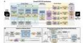

## (a)

##

##

##

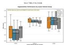

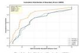

## (b)

##

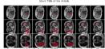

##

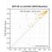

##

##

##

##

##

<table><tr><td colspan="2">Appearance Operations:</td></tr><tr><td>ARTICLE INFO</td><td>ABSTRACT</td></tr><tr><td>Appearance of the process from the organization of the first three types of space wells and the corresponding monitoring procedure.</td><td>An individual organization of the first three types of monitoring, in a critical perception for clinical diagnosis and transmission planning, particularly for the first three types of space wells and the associated monitoring procedures, such as sensitivities of the clathesiasis experiment of fluorescent research (Bench and Leibers) and the diagnostic analysis of the Bunch and Leibers. The Bunch and Leibers are described by the &quot;Estradiophanetic probes in Bunch Reference 3D layers,&quot; which includes the &quot;Estradiophanetic probes in Bunch Reference 3D layers,&quot; which includes the &quot;Estradiophanetic probes in Bunch Reference 3D layers,&quot; which includes the &quot;Estradiophanetic probes in Bunch Reference 3D layers,&quot; which includes the &quot;Estradiophanetic probes in Bunch Reference 3D layers,&quot; which includes the &quot;Estradiophanetic probes in Bunch Reference 3D layers,&quot; which include the &quot;Estradiophanetic probes in Bunch Reference 3D layers,&quot; which includes the &quot;Estradiophanetic probes in Bunch Reference 3D layers,&quot; which includes the &quot;Estradiophanetic probes in Bunch Reference 3D layers,&quot; which includes the &quot;Estradiophanetic probes in Bunch Reference 3D layers,&quot; which includes the &quot;Estradiophanetic probes in Bunch Reference 3D layers,&quot; which contains the &quot;Estradiophanetic probes in Bunch Reference 3D layers,&quot; which includes the &quot;Estradiophanetic probes in Bunch Reference 3D layers,&quot; which includes the &quot;Estradiophanetic probes in Bunch Reference 3D layers,&quot; which includes the &quot;Estradiophanetic probes in Bunch Reference 3D layers,&quot; which includes the &quot;Estradiophanetic probes in Bunch Reference 3D layers,&quot; which consists of the &quot;Estradiophanetic probes in Bunch Reference 3D layers,&quot; which includes the &quot;Estradiophanetic probes in Bunch Reference 3D layers,&quot; which includes the &quot;Estradiophanetic probes in Bunch Reference 3D layers,&quot; which includes the &quot;Estradiophanetic probes in Bunch Reference 3D layers,&quot; which includes the &quot;Estradiophanetic probes in Bunch Reference 3D layers,&quot; which is also the &quot;Estradiophanetic probes in Bunch Reference 3D layers,&quot; which includes the &quot;Estradiophanetic probes in Bunch Reference 3D layers,&quot; which includes the &quot;Estradiophanetic probes in Bunch Reference 3D layers,&quot; which includes the &quot;Estradiophanetic probes in Bunch Reference 3D layers,&quot; which includes the &quot;Estradiophanetic probes in Bunch Reference 3D layers,&quot; which has an additional label for &quot;Estradiophanetic probes in Bunch Reference 3D layers,&quot; which includes the &quot;Estradiophanetic probes in Bunch Reference 3D layers,&quot; which includes the &quot;Estradiophanetic probes in Bunch Reference 3D layers,&quot; which includes the &quot;Estradiophanetic probes in Bunch Reference 3D layers,&quot; which includes the &quot;Estradiophanetic probes in Bunch Reference 3D layers,&quot; which includes all other &quot;Estradiophanetic probes in Bunch Reference 3D layers,&quot; which includes the &quot;Estradiophanetic probes in Bunch Reference 3D layers,&quot; which includes the &quot;Estradiophanetic probes in Bunch Reference 3D layers,&quot; which includes the &quot;Estradiophanetic probes in Bunch Reference 3D layers,&quot; which includes the &quot;Estradiophanetic probes in Bunch Reference 3D layers,&quot; which includes both the &quot;Estradiophanetic probes in Bunch Reference 3D layers,&quot; which includes the &quot;Estradiophanetic probes in Bunch Reference 3D layers,&quot; which includes the &quot;Estradiophanetic probes in Bunch Reference 3D layers,&quot; which includes the &quot;Estradiophanetic probes in Bunch Reference 3D layers,&quot; which includes the &quot;Estradiophanetic probes in Bunch Reference 3D layers,&quot; which involves the &quot;Estradiophanetic probes in Bunch Reference 3D layers,&quot; which includes the &quot;Estradiophanetic probes in Bunch Reference 3D layers,&quot; which includes the &quot;Estradiophanetic probes in Bunch Reference 3D layers,&quot; which includes the &quot;Estradiophanetic probes in Bunch Reference 3D layers,&quot; which includes the &quot;Estradiophanetic probes in Bunch Reference 3D layers,&quot; which incurs the &quot;Estradiophanetic probes in Bunch Reference 3D layers,&quot; which includes the &quot;Estradiophanetic probes in Bunch Reference 3D layers,&quot; which includes the &quot;Estradiophanetic probes in Bunch Reference 3D layers,&quot; which includes the &quot;Estradiophanetic probes in Bunch Reference 3D layers,&quot; which includes the &quot;Estradiophanetic probes in Bunch Reference 3D layers,&quot; which also includes the &quot;Estradiophanetic probes in Bunch Reference 3D layers,&quot; which includes the &quot;Estradiophanetic probes in Bunch Reference 3D layers,&quot; which includes the &quot;Estradiophanetic probes in Bunch Reference 3D layers,&quot; which includes the &quot;Estradiophanetic probes in Bunch Reference 3D layers,&quot; which includes the &quot;Estradiophanetic probes in Bunch Reference 3D layers,&quot; whereas the &quot;Estradiophanetic probes in Bunch Reference 3D layers,&quot; which includes the &quot;Estradiophanetic probes in Bunch Reference 3D layers,&quot; which includes the &quot;Estradiophanetic probes in Bunch Reference 3D layers,&quot; which includes the &quot;Estradiophanetic probes in Bunch Reference 3D layers,&quot; which includes the &quot;Estradiophanetic probes in Bunch Reference 3D layers,&quot; which lacks the &quot;Estradiophanetic probes in Bunch Reference 3D layers,&quot; which includes the &quot;Estradiophanetic probes in Bunch Reference 3D layers,&quot; which includes the &quot;Estradiophanetic probes in Bunch Reference 3D layers,&quot; which includes the &quot;Estradiophanetic probes in Bunch Reference 3D layers,&quot; which includes the &quot;Estradiophanetic probes in Bunch Reference 3D layers,&quot; which provides the &quot;Estradiophanetic probes in Bunch Reference 3D layers,&quot; which includes the &quot;Estradiophanetic probes in Bunch Reference 3D layers,&quot; which includes the &quot;Estradiophanetic probes in Bunch Reference 3D layers,&quot; which includes the &quot;Estradiophanetic probes in Bunch Reference 3D layers,&quot; which includes the &quot;Estradiophanetic probes in Bunch Reference 3D layers,&quot; which supports the &quot;Estradiophanetic probes in Bunch Reference 3D layers,&quot; which includes the &quot;Estradiophanetic probes in Bunch Reference 3D layers,&quot; which includes the &quot;Estradiophanetic probes in Bunch Reference 3D layers,&quot; which includes the &quot;Estradiophanetic probes in Bunch Reference 3D layers,&quot; which includes the &quot;Estradiophanetic probes in Bunch Reference 3D layers,&quot; which leads to the &quot;Estradiophanetic probes in Bunch Reference 3D layers,&quot; which includes the &quot;Estradiophanetic probes in Bunch Reference 3D layers,&quot; which includes the &quot;Estradiophanetic probes in Bunch Reference 3D layers,&quot; which includes the &quot;Estradiophanetic probes in Bunch Reference 3D layers,&quot; which includes the &quot;Estradiophanetic probes in Bunch Reference 3D layers,&quot; which contributes the &quot;Estradiophanetic probes in Bunch Reference 3D layers,&quot; which includes the &quot;Estradiophanetic probes in Bunch Reference 3D layers,&quot; which includes the &quot;Estradiophanetic probes in Bunch Reference 3D layers,&quot; which includes the &quot;Estradiophanetic probes in Bunch Reference 3D layers,&quot; which includes the &quot;Estradiophanetic probes in Bunch Reference 3D layers,&quot; which combines the &quot;Estradiophanetic probes in Bunch Reference 3D layers,&quot; which includes the &quot;Estradiophanetic probes in Bunch Reference 3D layers,&quot; which includes the &quot;Estradiophanetic probes in Bunch Reference 3D layers,&quot; which includes the &quot;Estradiophanetic probes in Bunch Reference 3D layers,&quot; which includes the &quot;Estradiophanetic probes in Bunch Reference 3D layers,&quot; which adds the &quot;Estradiophanetic probes in Bunch Reference 3D layers,&quot; which includes the &quot;Estradiophanetic probes in Bunch Reference 3D layers,&quot; which includes the &quot;Estradiophanetic probes in Bunch Reference 3D layers,&quot; which includes the &quot;Estradiophanetic probes in Bunch Reference 3D layers,&quot; which includes the &quot;Estradiophanetic probes in Bunch Reference 3D layers,&quot; which induces the &quot;Estradiophanetic probes in Bunch Reference 3D layers,&quot; which includes the &quot;Estradiophanetic probes in Bunch Reference 3D layers,&quot; which includes the &quot;Estradiophanetic probes in Bunch Reference 3D layers,&quot; which includes the &quot;Estradiophanetic probes in Bunch Reference 3D layers,&quot; which includes the &quot;Estradiophanetic probes in Bunch Reference 3D layers,&quot; which shows the &quot;Estradiophanetic probes in Bunch Reference 3D layers,&quot; which includes the &quot;Estradiophanetic probes in Bunch Reference 3D layers,&quot; which includes the &quot;Estradiophanetic probes in Bunch Reference 3D layers,&quot; which includes the &quot;Estradiophanetic probes in Bunch Reference 3D layers,&quot; which includes the &quot;Estradiophanetic probes in Bunch Reference 3D layers,&quot; which links to the &quot;Estradiophanetic probes in Bunch Reference 3D layers,&quot; which includes the &quot;Estradiophanetic probes in Bunch Reference 3D layers,&quot; which includes the &quot;Estradiophanetic probes in Bunch Reference 3D layers,&quot; which includes the &quot;Estradiophanetic probes in Bunch Reference 3D layers,&quot; which includes the &quot;Estradiophanetic probes in Bunch Reference 3D layers,&quot; and that the Estradiophanetic probes in Bunch Reference 3D layers,&quot; which includes the &quot;Estradiophanetic probes in Bunch Reference 3D layers,&quot; which includes the &quot;Estradiophanetic probes in Bunch Reference 3D layers,&quot; which includes the &quot;Estradiophanetic probes in Bunch Reference 3D layers,&quot; which includes the &quot;Estradiophanetic probes in Bunch Reference 3D layers,&quot; which includes the &quot;Festative and Sensitive&quot; data on the &quot;Festative and Sensitive&quot; data on the &quot;Festative and Sensitive&quot; data on the &quot;Festative and Sensitive&quot; data on the &quot;Festative and Sensitive&quot; data on the &quot;Festative and Sensitive&quot; data on the &quot;Festative and Sensitive&quot; data on the &quot;Festative and Sensitive&quot; data on the &quot;Festative and Sensitive&quot; data on the &quot;Festative and Sensitive&quot; data on, respectively.</td></tr></table>

##

##

##

## 2. Rclaed Wak

##

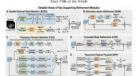

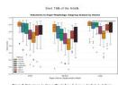

##

##

##

##

##

##

##

##

##

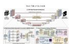

##

##

##

##

##

##

<table><tr><td>Configuration</td><td>Retrieal Component</td><td>Dio Score (1)</td><td>HOM Score (2)</td></tr><tr><td>Full Model</td><td>-</td><td>8,603</td><td>11,309</td></tr><tr><td>a(a) CFS</td><td>CFS Block</td><td>8,676</td><td>17,868</td></tr><tr><td>a(b) MS/SC</td><td>MS/SC Block</td><td>8,603</td><td>18,548</td></tr><tr><td>a(c) Frequency Decomposition</td><td>Frequency Decomposition</td><td>8,494</td><td>17,808</td></tr><tr><td>a(d) High-frequency Pathway</td><td>High-frequency Pathway</td><td>8,492</td><td>17,238</td></tr><tr><td>a(e) Channel Staffing</td><td>Channel Staffing</td><td>8,492</td><td>17,408</td></tr></table>

##

##

##

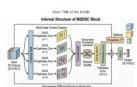

##

##

##

##

<table><tr><td colspan="3">Translucelant comparison on the BOMBOUS dataset.</td></tr><tr><td>Method</td><td>Data Score</td><td>RMS</td></tr><tr><td>MultiPath: Roy, Kredle, (Black, Baumgarten, Peterman, Korean, Jangan, and Walshkin) (301)</td><td>0.008</td><td>13,885</td></tr><tr><td>Total/Total: Liu, Rao, Math, and Landman (301)</td><td>0.026</td><td>16,656</td></tr><tr><td>MultiPath: Korean, Beier, Math, Peterman, and Walshkin (301)</td><td>0.026</td><td>16,656</td></tr><tr><td>MultiPath: Korean/All (301)</td><td>0.020</td><td>10,259</td></tr><tr><td>Polymer: Liu, Yang, Zhao, Xu, Yu, Liang, Sh, Deng, and Deng (304)</td><td>0.024</td><td>18,268</td></tr><tr><td>Effector: Wang, Deng, Yu, Su, Sun, Ru, Gu, Gu, and Zhang (305)</td><td>0.001</td><td>18,089</td></tr><tr><td>Sing/Perd</td><td>0.007</td><td>27,403</td></tr><tr><td>Effector: Pan, Deng (306)</td><td>0.000</td><td>17,082</td></tr><tr><td>Infineer: Deng, Gun, Deng, Yu, Wang, and Yu (303)</td><td>0.000</td><td>19,203</td></tr><tr><td>HOT/Net (304)</td><td>0.007</td><td>6,595</td></tr></table>

##

##

##

##

##

##

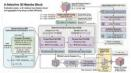

##

##

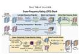

##

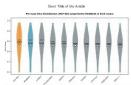

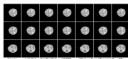

##

Figure 6 Full page layouts of two representative manuscripts generated by Camyla. (a) Dataset 8: a 17-page paper on neonatal brain lesion se<sub>g</sub>mentation <sub>p</sub>ro<sub>p</sub>osin<sub>g</sub> a hierarchical context <sub>g</sub>atin<sub>g</sub> architecture. (b) Dataset 11: a 17-<sub>p</sub>a<sub>g</sub>e <sub>p</sub>a<sub>p</sub>er on liver se<sub>g</sub>mentation<sup>30</sup> from cirrhotic MRI <sub>p</sub>ro<sub>p</sub>osin<sub>g</sub> a selective state s<sub>p</sub>ace modelin<sub>g</sub> framework. Both manuscri<sub>p</sub>ts are <sub>p</sub>roduced end-to-end without h<sub>uman</sub> i<sub>n</sub>t<sub>erven</sub>ti<sub>on.</sub>

## C Failure Case Study

Dataset 2: MRE-BSA (multi-structure intestinal MRI). This dataset requires segmenting multiple abdominal structures from MRI entero<sub>g</sub>ra<sub>p</sub>h<sub>y</sub> volumes. The U-Mamba [44] baseline achieves a Dice of 71.79% and an HD95 of 17<sub>.</sub>75 <sub>mm.</sub> A<sub>cross</sub> b<sub>o</sub>th <sub>runs,</sub> th<sub>e sys</sub>t<sub>em ex</sub>h<sub>aus</sub>t<sub>s</sub> th<sub>e</sub> f<sub>u</sub>ll b<sub>u</sub>d<sub>ge</sub>t <sub>o</sub>f th<sub>ree proposa</sub>l<sub>s w</sub>ith t<sub>en</sub> it<sub>era</sub>ti<sub>ons eac</sub>h<sub>,</sub> t<sub>o</sub>t<sub>a</sub>li<sub>ng</sub> 60 <sub>exper</sub>i<sub>men</sub>t<sub>a</sub>l t<sub>r</sub>i<sub>a</sub>l<sub>s, w</sub>ith<sub>ou</sub>t <sub>pro</sub>d<sub>uc</sub>i<sub>ng a s</sub>i<sub>ng</sub>l<sub>e resu</sub>lt th<sub>a</sub>t <sub>excee</sub>d<sub>s</sub> th<sub>e</sub> b<sub>ase</sub>li<sub>ne.</sub>

Figure 7 s<sup>h</sup>ows t<sup>h</sup>e <sup>d</sup>etai<sup>l</sup>e<sup>d</sup> no<sup>d</sup>e-<sup>b</sup>y-no<sup>d</sup>e trajectory <sup>f</sup>rom t<sup>h</sup>e <sup>fi</sup>rst proposa<sup>l</sup> o<sup>f</sup> t<sup>h</sup>e DeepSee<sup>k</sup> run. A<sup>ll</sup> ten experimenta<sup>l</sup> nodes ex<sub>p</sub>lore variants of SFP-DifNet (Semantic Flow Difusion), centered on an Anatomical Flow Field Generator (AFFG) and Diferentiable Semantic Difusion (DSD) blocks. The s<sub>y</sub>stem tries local vs. <sub>g</sub>lobal <sub>g</sub>atin<sub>g</sub> (N1–N5), <sub>p</sub>arentbased refinement (N6, N10), multi-head votin<sub>g</sub> with iterative difusion (N7), and a<sub>gg</sub>ressive memor<sub>y</sub> o<sub>p</sub>timization (N8), but never esca<sub>p</sub>es the “flow field + difusion” framework. The best node (N1) reaches 67.58% Dice, fallin<sub>g</sub> short b<sub>y</sub> more than four <sub>p</sub>ercenta<sub>g</sub>e <sub>p</sub>oints. The second and third <sub>p</sub>ro<sub>p</sub>osals ex<sub>p</sub>lore distinct directions<sub>, y</sub>et the <sub>p</sub>attern re<sub>p</sub>eats. The Sonnet r<sub>u</sub>n exhibits a similar <sub>p</sub>attern<sub>,</sub> <sub>w</sub>ith the closest res<sub>u</sub>lt reachin<sub>g</sub> 69.57% Dice and 17.48 mm HD95—narro<sub>w</sub>in<sub>g</sub> the <sub>g</sub>a<sub>p</sub> to 2.22 <sub>pp</sub> on Dice and im<sub>p</sub>rovin<sub>g</sub> on baseline HD95<sub>,</sub> but failin<sub>g</sub> to meet the win threshold.

T<sub>wo s</sub>t<sub>ruc</sub>t<sub>ura</sub>l f<sub>ac</sub>t<sub>ors con</sub>t<sub>r</sub>ib<sub>u</sub>t<sub>e</sub> t<sub>o</sub> thi<sub>s</sub> f<sub>a</sub>il<sub>ure.</sub> Fi<sub>rs</sub>t<sub>,</sub> th<sub>e</sub> U<sub>-</sub>M<sub>am</sub>b<sub>a</sub> b<sub>ase</sub>li<sub>ne</sub> i<sub>s unusua</sub>ll<sub>y s</sub>t<sub>rong re</sub>l<sub>a</sub>ti<sub>ve</sub> t<sub>o</sub> t<sub>as</sub>k difi<sub>cu</sub>lt<sub>y,</sub> l<sub>eav</sub>i<sub>ng a narrow marg</sub>i<sub>n.</sub> S<sub>econ</sub>d<sub>,</sub> th<sub>e</sub> d<sub>a</sub>t<sub>ase</sub>t i<sub>nvo</sub>l<sub>ves</sub> hi<sub>g</sub>hl<sub>y an</sub>i<sub>so</sub>t<sub>rop</sub>i<sub>c vo</sub>l<sub>ume</sub>t<sub>r</sub>i<sub>c</sub> d<sub>a</sub>t<sub>a w</sub>ith <sub>su</sub>b<sub>s</sub>t<sub>an</sub>ti<sub>a</sub>l i<sub>n</sub>t<sub>er-s</sub>t<sub>ruc</sub>t<sub>ure var</sub>i<sub>a</sub>bilit<sub>y, ma</sub>ki<sub>ng</sub> it difi<sub>cu</sub>lt f<sub>or a s</sub>i<sub>ng</sub>l<sub>e arc</sub>hit<sub>ec</sub>t<sub>ura</sub>l <sub>mo</sub>difi<sub>ca</sub>ti<sub>on</sub> t<sub>o y</sub>i<sub>e</sub>ld <sub>un</sub>if<sub>orm ga</sub>i<sub>ns across a</sub>ll <sub>eva</sub>l<sub>ua</sub>ti<sub>on</sub> <sub>c</sub>l<sub>asses.</sub>

## D Exploration Trajectory Case Studies

Case 1: Dataset 3 (PNPC, nasopharyngeal carcinoma MRI). The nnU-Net baseline achieves a Dice of 60.63% <sub>w</sub>ith <sub>an</sub> HD95 <sub>o</sub>f 45<sub>.</sub>28 <sub>mm</sub> <sub>on</sub> thi<sub>s</sub> <sub>s</sub>i<sub>ng</sub>l<sub>e-c</sub>l<sub>ass</sub> h<sub>ea</sub>d<sub>-an</sub>d<sub>-nec</sub>k <sub>segmen</sub>t<sub>a</sub>ti<sub>on</sub> t<sub>as</sub>k<sub>.</sub> Fi<sub>gure</sub> 8 <sub>s</sub>h<sub>ows</sub> th<sub>e</sub> d<sub>e</sub>t<sub>a</sub>il<sub>e</sub>d node-b<sub>y</sub>-node trajector<sub>y</sub> from Pro<sub>p</sub>osal 2 (DDSR-Net). The s<sub>y</sub>stem be<sub>g</sub>ins b<sub>y</sub> s<sub>p</sub>awnin<sub>g</sub> ei<sub>g</sub>ht root-level variants, each ex<sub>p</sub>lorin<sub>g</sub> diferent D<sub>y</sub>namic Dual-Scale Afinit<sub>y</sub> Module (DDAM) confi<sub>g</sub>urations: attention-based fusion (N1), deformable convolution with d<sub>y</sub>namic sam<sub>p</sub>lin<sub>g</sub> (N2), multi-scale dilated convolution (N3), s<sub>p</sub>atial attention (N4, N7), dual attention (N5), and the combined DDAM+SMAT architecture (N6). None sur<sub>p</sub>asses the baseline: the best root node (N7, Dice = 55.15%) uses a clean balanced desi<sub>g</sub>n with s<sub>p</sub>atial attention and channel com<sub>p</sub>ression.

At this point, QWBE identifies N7 as the most promising branch despite its sub-baseline Dice. Node 9, a child of N7, per<sup>f</sup>orms a major arc<sup>h</sup>itectura<sup>l</sup> re<sup>d</sup>esign—rep<sup>l</sup>acing spatia<sup>l</sup> attention wit<sup>h d</sup>e<sup>f</sup>orma<sup>bl</sup>e samp<sup>l</sup>ing an<sup>d</sup> CBAM-sty<sup>l</sup>e <sub>c</sub>h<sub>anne</sub>l<sub>-s a</sub>ti<sub>a</sub>l <sub>a</sub>tt<sub>en</sub>ti<sub>on, w</sub>ith <sub>a ress</sub>i<sub>ve o</sub>f<sub>se</sub>t <sub>c</sub>l<sub>am</sub> i<sub>n an</sub>d N<sub>a</sub>N h<sub>an</sub>dli<sub>n</sub> f<sub>or s</sub>t<sub>a</sub>bilit <sub>—ac</sub>hi<sub>ev</sub>i<sub>n a</sub> Di<sub>ce o</sub>f 60<sub>.</sub>88%<sub>.</sub> Node 10 further adds multi-scale dilated convolutions (dilation rates 1, 2, 4) and eficient axial attention, reachin<sub>g</sub> 61<sub>.</sub>34% Di<sub>ce</sub> <sub>an</sub>d 21<sub>.</sub>05 <sub>mm</sub> HD95<sub>,</sub> <sub>re</sub>d<sub>uc</sub>i<sub>ng</sub> b<sub>oun</sub>d<sub>ary</sub> <sub>error</sub> b<sub>y</sub> <sub>more</sub> th<sub>an</sub> h<sub>a</sub>lf <sub>re</sub>l<sub>a</sub>ti<sub>ve</sub> t<sub>o</sub> th<sub>e</sub> b<sub>ase</sub>li<sub>ne.</sub>

This trajectory exemplifies the two-phase behavior that QWBE is designed to produce. The initial broad exploration <sub>es</sub>t<sub>a</sub>bli<sub>s</sub>h<sub>es</sub> <sub>a</sub> <sub>per</sub>f<sub>ormance</sub> l<sub>an</sub>d<sub>scape</sub> <sub>across</sub> <sub>s</sub>t<sub>ruc</sub>t<sub>ura</sub>ll<sub>y</sub> di<sub>verse</sub> <sub>can</sub>did<sub>a</sub>t<sub>es;</sub> <sub>once</sub> <sub>a</sub> <sub>prom</sub>i<sub>s</sub>i<sub>ng</sub> di<sub>rec</sub>ti<sub>on</sub> <sub>emerges,</sub> th<sub>e</sub> s<sub>y</sub>stem concentrates resources and achieves <sub>p</sub>ro<sub>g</sub>ressive <sub>g</sub>ains throu<sub>g</sub>h tar<sub>g</sub>eted architectural redesi<sub>g</sub>n rather than incremental t<sub>u</sub>nin<sub>g</sub>.

Case 2: Dataset 9 (BTXRD, bone tumor X-ray). The UTNet baseline yields a Dice of 44.45% and an HD95 of 27.39 mm. Fi<sub>g</sub>ure 9 shows the detailed node-b<sub>y</sub>-node trajector<sub>y</sub> from Pro<sub>p</sub>osal 1 (HCF-CCN). The s<sub>y</sub>stem ex-<sub>p</sub>lores six root-level variants of Cascaded Cross-Attention Nestin<sub>g</sub> (CCAN) combined with Multi-Resolution Feature Ali<sub>g</sub>nment (MRFA), all <sub>p</sub>erformin<sub>g</sub> substantiall<sub>y</sub> below the baseline (Dice 18.64%–26.36%). The variants tr<sub>y</sub> diferent confi<sub>g</sub>urations—Grou<sub>p</sub>Norm32 (N3), custom U-Net backbone (N4), windowed attention (N5), and a 2D architecture switch (N6)—but all remain within the CCAN+MRFA <sub>p</sub>aradi<sub>g</sub>m.

At N7<sub>,</sub> th<sub>e sys</sub>t<sub>e</sub>m <sub>pe</sub>rf<sub>o</sub>rm<sub>s a co</sub>m<sub>p</sub>l<sub>e</sub>t<sub>e a</sub>r<sub>c</sub>hit<sub>ec</sub>t<sub>u</sub>r<sub>e p</sub>i<sub>vo</sub>t<sub>:</sub> it <sub>a</sub>b<sub>a</sub>nd<sub>o</sub>n<sub>s</sub> CCAN <sub>e</sub>ntir<sub>e</sub>l<sub>y a</sub>nd intr<sub>o</sub>d<sub>uces</sub> M<sub>u</sub>lti-S<sub>ca</sub>l<sub>e</sub> Gated Axial Attention (MGAA), decom<sub>p</sub>osin<sub>g</sub> 2D attention into se<sub>q</sub>uential 1D axial o<sub>p</sub>erations with multi-scale kernels and a Residual-in-Residual structure for stable <sub>g</sub>radient flow. This <sub>p</sub>roduces the first baseline-sur<sub>p</sub>assin<sub>g</sub> result (Dice 47.11%). N8 adds multi-scale convolutional projections to the axial attention, reaching the highest Dice of 50.17% (+5.7 <sub>pp</sub> over baseline). N9 and N10 attem<sub>p</sub>t code cleanu<sub>p</sub> and memor<sub>y</sub> o<sub>p</sub>timization, res<sub>p</sub>ectivel<sub>y</sub>, but do not sur<sub>p</sub>ass N8.

<table><tr><td>N0ROOT</td><td>UMamba baseline. Baseline reference point.</td><td>0.7179</td></tr><tr><td>N1← N0</td><td>First SFP-DiffNet. Core: AFFG producing organ-aware 3D flow fields (differentiable normalization + gating) + DSD blocks for flow-guided feature propagation. Opens &quot;anatomical flow field + semantic diffusion&quot; direction from baseline.</td><td>0.6758 -0.0421</td></tr><tr><td>N2← N0</td><td>Alternative SFP-DiffNet: AFFG with local spatial gating (per-voxel attention replacing global gating) + diffusion training. vs N1: global gating → local per-voxel attention. Performance drops.</td><td>0.6484 -0.0695</td></tr><tr><td>N3← N0</td><td>SFP-DiffNet v2: Enhanced AFFG with per-voxel organ selection (no weighted blending), multi-scale dilated conv, edge-aware flow modulation. Independent root. Hard organ selection to avoid multi-organ flow interference.</td><td>0.6594 -0.0585</td></tr><tr><td>N4← N0</td><td>AFFG with organ-specific candidate flows + global gating (GAP + softmax). Returns to global weighted aggregation. Direction opposite to N2/N3 (local attention). Among weakest results.</td><td>0.6230 -0.0949</td></tr><tr><td>N5← N0</td><td>Combined AFFG: per-voxel organ attention + learnable flow magnitude (cap 2.5) + multi-scale dilated conv + edge-aware modulation. Merges N2 per-voxel attention with N3 edge-aware modulation. No improvement.</td><td>0.6402 -0.0777</td></tr><tr><td>N6← N1</td><td>Refinement of N1: AFFG → local voxel-wise attention, DSD → flow-guided spatial transformer sampling, diffusion iterations 2→3. Parent-based refinement. Global→local gating + spatial transformer. Slightly below N1.</td><td>0.6719 -0.0460</td></tr><tr><td>N7← N0</td><td>New direction: AFFG with multi-head prediction + voting, DSD with truly iterative flow-guided diffusion + dynamic step size. Most complex variant. Multi-head voting + iterative diffusion, but over-complexity → underfitting.</td><td>0.5452 -0.1727</td></tr><tr><td>N8← N0</td><td>Iterative diffusion (T=2) + resolution-aware scaling + memory optimization (47.5GB GPU constraint). Memory-efficiency focus, but excessive capacity compression causes collapse.</td><td>0.1608 -0.5571</td></tr><tr><td>N9← N0</td><td>AFFG with multi-scale extraction + organ-specific heads + global gating, DSD T=3 + spatial transformer. Combines N4 global gating + N7 iterative diffusion. Combination ineffective.</td><td>0.5615 -0.1564</td></tr><tr><td>N10← N6</td><td>Fine-tuning N6: AFFG normalization → Tanh activation (learnable magnitude [-1, 1]), DSD + resolution-aware step sizes. Continues optimizing best non-baseline node (N6). Fails to reverse trend.</td><td>0.6672 -0.0507</td></tr></table>

Figure 7 Node-by-node exploration trajectory for Dataset 2 (MRE-BSA, Proposal 1: SFP-DifNet). Baseline: U-Mamba, Dice = 0.7179. Each row shows one ex<sub>p</sub>erimental node with its <sub>p</sub>arent derivation, architectural descri<sub>p</sub>tion, and Dice score (red: below baseline; <sub>g</sub>reen: above). All 10 nodes fail to sur<sub>p</sub>ass the baseline. The s<sub>y</sub>stem ex<sub>p</sub>lores local vs. <sub>g</sub>lobal <sub>g</sub>atin<sub>g</sub>, multi-head votin<sub>g</sub>, and iterative dif<sub>us</sub>i<sub>on var</sub>i<sub>an</sub>t<sub>s o</sub>f th<sub>e</sub> A<sub>na</sub>t<sub>om</sub>i<sub>ca</sub>l Fl<sub>ow</sub> Fi<sub>e</sub>ld G<sub>enera</sub>t<sub>or,</sub> b<sub>u</sub>t <sub>never escapes</sub> th<sub>e</sub> “fl<sub>ow</sub> fi<sub>e</sub>ld <sub>+</sub> dif<sub>us</sub>i<sub>on</sub>” f<sub>ramewor</sub>k<sub>.</sub> Th<sub>e</sub> b<sub>es</sub>t attem<sub>p</sub>t (N1, Dice = 0.6758) falls short b<sub>y</sub> 4.2 <sub>pp</sub>.

Thi<sub>s case</sub> hi<sub>g</sub>hli<sub>g</sub>ht<sub>s</sub> th<sub>e ro</sub>l<sub>e o</sub>f di<sub>vergen</sub>t di<sub>agnos</sub>ti<sub>c</sub> f<sub>ee</sub>db<sub>ac</sub>k<sub>.</sub> Aft<sub>er s</sub>i<sub>x</sub> f<sub>a</sub>il<sub>e</sub>d t<sub>r</sub>i<sub>a</sub>l<sub>s w</sub>ithi<sub>n</sub> th<sub>e same para</sub>di<sub>gm,</sub> th<sub>e</sub> dia<sub>g</sub>nostic module <sub>g</sub>enerates a cate<sub>g</sub>oricall<sub>y</sub> distinct im<sub>p</sub>rovement direction—axial attention decom<sub>p</sub>osition rather than cross-attention nestin<sub>g</sub>—rather than <sub>p</sub>rescribin<sub>g</sub> incremental fixes. In the −DDF ablation variant, the s<sub>y</sub>stem tends to <sub>p</sub>ersist with minor corrections<sub>,</sub> and the mean first-success <sub>p</sub>osition increases from 4.8 to 7.3 across the validation d<sub>a</sub>t<sub>ase</sub>t<sub>s.</sub>

<table><tr><td>N0 ROOT</td><td>nnUNet baseline. Baseline reference point.</td><td>0.6063</td></tr><tr><td>N1 - N0</td><td>First DDSR-Net. DDAM replacing skip connections with content-aware fusion: learned attention + multi-head attention + dilated conv. Opens &quot;dynamic dual-scale affinity&quot; direction, using attention to replace traditional skip.</td><td>0.4571 -0.1492</td></tr><tr><td>N2 - N0</td><td>DDAM with deformable conv + dynamic sampling offsets to bridge semantic gaps, grouped deformable conv + modulation. Independent root. Introduces deformable convolution for adaptive sampling.</td><td>0.4464 -0.1599</td></tr><tr><td>N3 - N0</td><td>DDAM with content-aware learned offsets + modulation + multi-scale dilated conv for enhanced fusion. Independent root. Combines deformable sampling with multi-scale context.</td><td>0.5019 -0.1044</td></tr><tr><td>N4 - N0</td><td>DDAM with channel compression + dynamic fusion weight generation + spatial attention for feature modulation. Independent root. Lighter spatial attention design instead of deformable conv.</td><td>0.5347 -0.0716</td></tr><tr><td>N5 - N0</td><td>DDAM with channel compression + spatial attention (sigmoid) + channel attention (adaptive pooling) + multi-scale dilated conv. Independent root. Dual attention (spatial + channel) produces worst result.</td><td>0.3389 -0.2674</td></tr><tr><td>N6 - N0</td><td>Full DDSR-Net: DDAM (deformable sampling) + SMAT (Sparse Morphology-Aware Transformer) for boundary-aware patch processing. Independent root. First to combine DDAM + SMAT dual modules.</td><td>0.4535 -0.1528</td></tr><tr><td>N7 - N0</td><td>DDAM with spatial attention + dynamic fusion weights + multi-scale dilated conv. Clean balanced design with channel compression. Independent root. Best root-level node: simple design outperforms complex variants.</td><td>0.5515 -0.0548</td></tr><tr><td>N8 - N0</td><td>DDAM with channel compression + multi-scale dilated conv + spatial attention + dynamic fusion weights. Independent root. Similar concept to N7, different implementation. Much worse.</td><td>0.3579 -0.2484</td></tr><tr><td>N9 - N7</td><td>★ Major redesign of N7: spatial attention → deformable sampling + CBAM-style attention. Adds offset clamping + NaN handling for stability. Critical turn. On best root (N7), switches to deformable + CBAM → dramatic improvement.</td><td>0.6088 +0.0025</td></tr><tr><td>N10 - N9</td><td>★ Enhancement of N9: DDAM + multi-scale dilated conv (dilation 1, 2, 4). SMAT redesigned with efficient axial attention + boundary-aware conv. Adds multi-scale context + axial attention. First node to surpass baseline (+0.71 pp).</td><td>0.6134 +0.0071</td></tr></table>

Figure 8 Node-by-node exploration trajectory for Dataset 3 (PNPC, Proposal 2: DDSR-Net). Baseline: nnU-Net, Dice = 0.6063. Ei<sub>g</sub>ht root branches ex<sub>p</sub>lore diverse DDAM variants (attention-based, deformable, multi-scale), all below baseline. The turnin<sub>g p</sub>oint occurs at the N7→N9 transition: the s<sub>y</sub>stem identifies N7 as the stron<sub>g</sub>est root (Dice = 0.5515) and <sub>p</sub>erforms an architecture-level re<sup>d</sup>esign—rep<sup>l</sup>acing spatia<sup>l</sup> attention wit<sup>h</sup> <sup>d</sup>e<sup>f</sup>orma<sup>bl</sup>e samp<sup>l</sup>ing an<sup>d</sup> CBAM-sty<sup>l</sup>e attention—jumping to 0.6088. N10 a<sup>dd</sup>s mu<sup>l</sup>ti-sca<sup>l</sup>e context and axial attention, reachin<sub>g</sub> 0.6134 and sur<sub>p</sub>assin<sub>g</sub> the baseline (+0.71 <sub>pp</sub>). The chain 7→9→10 demonstrates QWBE <sub>s</sub>hifti<sub>ng</sub> f<sub>rom</sub> b<sub>roa</sub>d <sub>exp</sub>l<sub>ora</sub>ti<sub>on</sub> t<sub>o</sub> f<sub>ocuse</sub>d <sub>re</sub>fi<sub>nemen</sub>t<sub>.</sub>

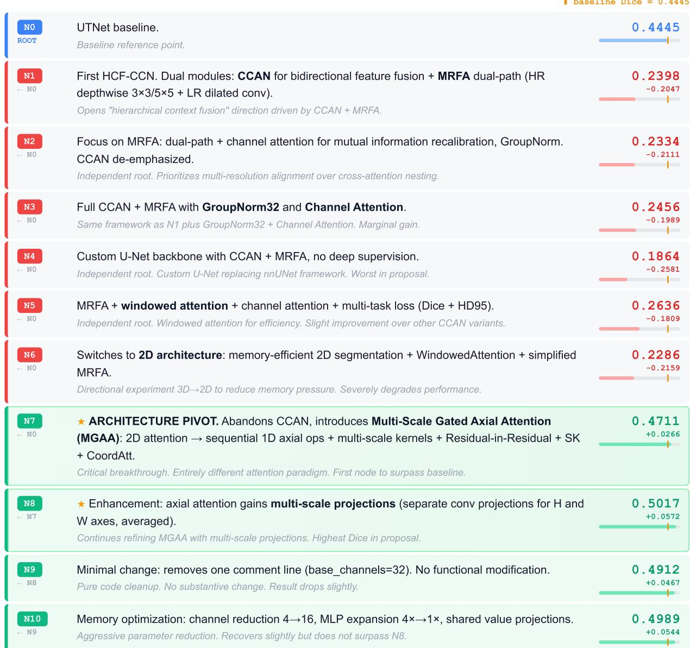  
Figure 9 Node-by-node exploration trajectory for Dataset 9 (BTXRD, Proposal 1: HCF-CCN). Baseline: UTNet, Dice = 0.4445. Nodes 1–6 ex<sub>p</sub>lore the CCAN+MRFA direction (Dice 0.19–0.26, far below baseline). At N7, the s<sub>y</sub>stem abandons CCAN entirel<sub>y</sub> and introduces Multi-Scale Gated Axial Attention (MGAA)—decom<sub>p</sub>osin<sub>g</sub> 2D attention into se<sub>q</sub>uential 1D axial o<sub>p</sub>erations—jum<sub>p</sub>in<sub>g</sub> to 0.4711 and sur<sub>p</sub>assin<sub>g</sub> the baseline for the first time. The subse<sub>q</sub>uent chain 7→8→9→10 refines MGAA to 0.5017 (+5.7 <sub>pp</sub> over baseline). This <sub>p</sub>ivot is not incremental but a fundamentall<sub>y</sub> diferent attention <sub>p</sub>aradi<sub>g</sub>m, exem<sub>p</sub>lif<sub>y</sub>in<sub>g</sub> the behavior DDF is d<sub>es</sub>i<sub>gne</sub>d t<sub>o</sub> <sub>pro</sub>d<sub>uce.</sub>

## E Baseline Bank Details

The <sub>p</sub>recom<sub>p</sub>uted baseline bank com<sub>p</sub>rises 14 architectures s<sub>p</sub>annin<sub>g</sub> three model families: convolutional (nnU-Net [9], Se<sub>g</sub>ResNet [79], U-Net++ [80], MedNeXt [81], STU-Net [82], UKAN [83]), transformer-based (SwinUNETR [84], UNETR [85], nnFormer [86], 3D UX-Net [87], TransUNet [88], UTNet [89]), and state-s<sub>p</sub>ace models (U-Mamba [44], SwinUMamba [90]). For each dataset in CamylaBench, every compatible architecture is trained with polynomial learnin<sub>g</sub> rate deca<sub>y</sub> from 10<sup>−2</sup> and Dice [10] <sub>p</sub>lus cross-entro<sub>py</sub> loss. The a<sub>g</sub>ent autonomousl<sub>y</sub> decides whether to train f<sub>or</sub> 100 <sub>or</sub> 1<sub>,</sub>000 <sub>epoc</sub>h<sub>s</sub> b<sub>ase</sub>d <sub>on</sub> th<sub>e</sub> <sub>o</sub>b<sub>serve</sub>d <sub>convergence</sub> b<sub>e</sub>h<sub>av</sub>i<sub>or.</sub> T<sub>a</sub>bl<sub>e</sub> 19 <sub>repor</sub>t<sub>s</sub> th<sub>e</sub> <sub>arc</sub>hit<sub>ec</sub>t<sub>ure–con</sub>fi<sub>gura</sub>ti<sub>on</sub> <sub>co</sub>m<sub>pa</sub>tibilit<sub>y</sub> m<sub>a</sub>trix<sub>.</sub>

## F CamylaBench Dataset Details

Anatomical and Clinical Diversity. The 31 datasets cover a broad cross-section of medical image segmentation t<sub>as</sub>k<sub>s.</sub> Ei<sub>g</sub>ht d<sub>a</sub>t<sub>ase</sub>t<sub>s</sub> t<sub>arge</sub>t b<sub>ra</sub>i<sub>n s</sub>t<sub>ruc</sub>t<sub>ures,</sub> i<sub>nc</sub>l<sub>u</sub>di<sub>ng</sub> f<sub>e</sub>t<sub>a</sub>l b<sub>ra</sub>i<sub>n parce</sub>ll<sub>a</sub>ti<sub>on,</sub> b<sub>ra</sub>i<sub>n me</sub>t<sub>as</sub>t<sub>as</sub>i<sub>s</sub> d<sub>e</sub>li<sub>nea</sub>ti<sub>on, neona</sub>t<sub>a</sub>l <sup>b</sup>rain injury <sup>d</sup>etection, isc<sup>h</sup>emic penum<sup>b</sup>ra segmentation, an<sup>d</sup> mu<sup>l</sup>tip<sup>l</sup>e sc<sup>l</sup>erosis <sup>l</sup>esion segmentation. Seven <sup>d</sup>atasets address abdominal anatom<sub>y,</sub> ran<sub>g</sub>in<sub>g</sub> from intestinal se<sub>g</sub>ment annotation on MR entero<sub>g</sub>ra<sub>p</sub>h<sub>y</sub> to liver se<sub>g</sub>mentation on cirrhosis MRI and he<sub>p</sub>atic lesion delineation on contrast-enhanced CT. Four datasets cover o<sub>p</sub>hthalmolo<sub>gy,</sub> tar<sub>g</sub>etin<sub>g</sub> o<sub>p</sub>tic disc se<sub>g</sub>mentation<sub>,</sub> retinal arter<sub>y</sub>–vein se<sub>p</sub>aration<sub>,</sub> retinal la<sub>y</sub>er <sub>p</sub>arsin<sub>g</sub> on OCT<sub>,</sub> and orbital str<sub>u</sub>ct<sub>u</sub>re delineation. The remainin<sub>g</sub> datasets s<sub>p</sub>an head and neck oncolo<sub>gy,</sub> <sub>p</sub>ulmonar<sub>y</sub> ima<sub>g</sub>in<sub>g,</sub> dental radio<sub>g</sub>ra<sub>p</sub>h<sub>y,</sub> breast ultrasound<sub>,</sub> dermatolo<sub>g</sub>ical OCTA<sub>,</sub> c<sub>y</sub>tolo<sub>gy,</sub> m<sub>u</sub>sc<sub>u</sub>loskeletal radiolo<sub>gy,</sub> soft tiss<sub>u</sub>e <sub>u</sub>ltraso<sub>u</sub>nd<sub>,</sub> and <sub>gy</sub>necolo<sub>g</sub>ical MRI.

Task Dificulty Spectrum. The datasets span a wide range of segmentation dificulty. At the easier end, dental <sub>p</sub>anoramic tooth se<sub>g</sub>mentation (Dataset 13) achieves a baseline Dice above 96%, reflectin<sub>g</sub> well-defined boundaries and hi<sub>g</sub>h contrast. At the harder end, sur<sub>g</sub>ical instrument se<sub>g</sub>mentation in endosco<sub>p</sub>ic video (Dataset 27) and ischemic <sub>p</sub>enumbra delineation on CT (Dataset 12) <sub>y</sub>ield baseline Dice scores of 14.2% and 27.3%, res<sub>p</sub>ectivel<sub>y</sub>, reflectin<sub>g</sub> severe <sub>c</sub>l<sub>ass</sub> i<sub>m</sub>b<sub>a</sub>l<sub>ance,</sub> l<sub>ow</sub> ti<sub>ssue con</sub>t<sub>ras</sub>t<sub>, an</sub>d <sub>am</sub>bi <sub>uous</sub> b<sub>oun</sub>d<sub>ar</sub>i<sub>es.</sub> Th<sub>e me</sub>di<sub>an</sub> b<sub>ase</sub>li<sub>ne</sub> Di<sub>ce across a</sub>ll 31 d<sub>a</sub>t<sub>ase</sub>t<sub>s</sub> i<sub>s</sub> 71.4%, in<sup>d</sup>icating t<sup>h</sup>at t<sup>h</sup>e majority o<sup>f</sup> tas<sup>k</sup>s present meaning<sup>f</sup>u<sup>l</sup> room <sup>f</sup>or improvement wit<sup>h</sup>out <sup>b</sup>eing trivia<sup>ll</sup>y so<sup>l</sup>va<sup>bl</sup>e.

## G Detailed Comparison Tables

## G.1 Per-Dataset Ablation Results

Table 12 disa<sub>gg</sub>re<sub>g</sub>ates the a<sub>gg</sub>re<sub>g</sub>ate ablation results re<sub>p</sub>orted in §5.1 to the individual dataset level. The four configurations—Full Camyla, −QWBE, −LRM, and −DDF—are evaluated on the five validation datasets under identical com<sub>p</sub>utational bud<sub>g</sub>ets (30 nodes each).

Three dataset-level <sub>p</sub>atterns merit attention. First, Dataset 5 (NLSTse<sub>g</sub>) am<sub>p</sub>lifies the role of LRM: the full s<sub>y</sub>stem achieves +18.58 <sub>pp</sub> over a 23.20% baseline<sub>,</sub> whereas removin<sub>g</sub> LRM reduces this <sub>g</sub>ain to +8.35 <sub>pp</sub>—a 55% reduction— b<sub>ecause</sub> th<sub>e</sub> l<sub>ow-</sub>b<sub>ase</sub>li<sub>ne</sub> <sub>reg</sub>i<sub>me</sub> d<sub>eman</sub>d<sub>s</sub> <sub>sus</sub>t<sub>a</sub>i<sub>ne</sub>d <sub>mu</sub>lti<sub>-cyc</sub>l<sub>e</sub> <sub>re</sub>fi<sub>nemen</sub>t th<sub>a</sub>t b<sub>ene</sub>fit<sub>s</sub> <sub>mos</sub>t f<sub>rom</sub> <sub>s</sub>t<sub>ruc</sub>t<sub>ure</sub>d <sub>memory.</sub> Second, Dataset 3 (PNPC) isolates the contribution of DDF: the full s<sub>y</sub>stem recovers throu<sub>g</sub>h a late dia<sub>g</sub>nostic insi<sub>g</sub>ht at FSP = 19, while the −DDF variant never exceeds the baseline, confirmin<sub>g</sub> that sin<sub>g</sub>le-<sub>p</sub>oint <sub>p</sub>rescri<sub>p</sub>tive feedback cannot enerate the diversit re uired for dificult recover scenarios. Third, Dataset 2 (MRE-BSA) resists all four <sub>con</sub>fi<sub>gura</sub>ti<sub>ons,</sub> i<sub>n</sub>di<sub>ca</sub>ti<sub>ng</sub> th<sub>a</sub>t thi<sub>s</sub> f<sub>a</sub>il<sub>ure re</sub>fl<sub>ec</sub>t<sub>s</sub> th<sub>e</sub> i<sub>n</sub>h<sub>eren</sub>t difi<sub>cu</sub>lt<sub>y o</sub>f th<sub>e</sub> t<sub>as</sub>k<sub>–</sub>b<sub>ase</sub>li<sub>ne</sub> i<sub>n</sub>t<sub>erac</sub>ti<sub>on ra</sub>th<sub>er</sub> th<sub>an</sub> an<sub>y</sub> s<sub>p</sub>ecific com<sub>p</sub>onent deficienc<sub>y</sub>.

## G.2 Cross-Run Per-Dataset Comparison

T<sub>a</sub>bl<sub>e</sub> 13 <sub>prov</sub>id<sub>es per-</sub>d<sub>a</sub>t<sub>ase</sub>t d<sub>e</sub>t<sub>a</sub>il f<sub>or</sub> th<sub>e</sub> 16 d<sub>a</sub>t<sub>ase</sub>t<sub>s on w</sub>hi<sub>c</sub>h b<sub>o</sub>th i<sub>n</sub>d<sub>epen</sub>d<sub>en</sub>t <sub>runs excee</sub>d th<sub>e</sub> b<sub>ase</sub>li<sub>ne, comp</sub>l<sub>e</sub> menting the aggregate cross-run analysis in §5.3. The two runs use diferent idea generators (Camyla : DeepSeek V3.2; Camyla<sub>S</sub>: Claude Sonnet 4.6) but share all other system components.

The table reveals three forms of inter-run divergence. First, the win mechanism difers systematically: Camyla<sub>D</sub> wins predominantly via Dice improvement (D), while Camyla<sub>S</sub> wins equally via HD95 tiebreak (H), suggesting that the Sonnet-based <sub>g</sub>enerator <sub>p</sub>roduces methods that im<sub>p</sub>rove boundar<sub>y</sub> <sub>p</sub>recision more consistentl<sub>y</sub>. Second<sub>,</sub> the ma<sub>g</sub>nitude of im<sub>p</sub>rovement varies: the mean inter-run absolute Dice diference is 1.56 <sub>pp,</sub> but individual datasets ran<sub>g</sub>e from near-identical (AMSMC-HTM: 0.20 <sub>pp</sub>) to substantiall<sub>y</sub> diver<sub>g</sub>ent (PLC-CECT: 6.17 <sub>pp</sub>), reflectin<sub>g</sub> the stochastic nature of diferent LLM-generated proposals. Third, the search eficiency difers: Camyla<sub>D</sub> reaches its first success earlier on avera<sub>g</sub>e (mean FSP 5.2 vs. 7.1), but this faster conver<sub>g</sub>ence does not consistentl<sub>y</sub> translate into hi<sub>g</sub>her end-state <sub>q</sub>ualit<sub>y</sub>. The hi<sub>g</sub>h Pearson correlation (�=0.978) of best Dice across co-won datasets confirms that des<sub>p</sub>ite these surface dif<sub>erences,</sub> b<sub>o</sub>th <sub>runs</sub> <sub>converge</sub> t<sub>o</sub> <sub>s</sub>i<sub>m</sub>il<sub>ar</sub> <sub>qua</sub>lit<sub>y</sub> l<sub>eve</sub>l<sub>s.</sub>

Table 12 Per-dataset ablation results on the five validation datasets. For each configuration we report the best Dice achieved (Best), the Dice improvement over baseline (Δ), the first-success position (FSP; “–” if never succeeded), and the total nodes expanded (N). <sup>∗</sup>M<sub>ea</sub>n FSP i<sub>s</sub> <sub>co</sub>m<sub>pu</sub>t<sub>e</sub>d <sub>ove</sub>r <sub>w</sub>innin<sub>g</sub> d<sub>a</sub>t<sub>ase</sub>t<sub>s</sub> <sub>o</sub>nl<sub>y.</sub>

<table><tr><td>ID</td><td>Dataset</td><td>BL</td><td>Best</td><td> $\Delta$ </td><td>FSP</td><td>N</td><td>ID</td><td>Dataset</td><td>BL</td><td>Best</td><td> $\Delta$ </td><td>FSP</td><td>N</td></tr><tr><td colspan="7">Full Camyla</td><td colspan="7">-QWBE</td></tr><tr><td>1</td><td>GDMRI-CT</td><td>72.33</td><td>73.87</td><td>+1.53</td><td>12</td><td>30</td><td>1</td><td>GDMRI-CT</td><td>72.33</td><td>72.98</td><td>+0.65</td><td>18</td><td>30</td></tr><tr><td>2</td><td>MRE-BSA</td><td>71.79</td><td>70.40</td><td>-1.39</td><td>-</td><td>30</td><td>2</td><td>MRE-BSA</td><td>71.79</td><td>69.87</td><td>-1.92</td><td>-</td><td>30</td></tr><tr><td>3</td><td>PNPC</td><td>60.63</td><td>61.34</td><td>+0.71</td><td>19</td><td>30</td><td>3</td><td>PNPC</td><td>60.63</td><td>61.08</td><td>+0.45</td><td>22</td><td>30</td></tr><tr><td>4</td><td>AMSMC-HTM</td><td>81.41</td><td>82.69</td><td>+1.29</td><td>1</td><td>30</td><td>4</td><td>AMSMC-HTM</td><td>81.41</td><td>82.25</td><td>+0.84</td><td>6</td><td>30</td></tr><tr><td>5</td><td>NLSTseg</td><td>23.20</td><td>41.78</td><td>+18.58</td><td>1</td><td>30</td><td>5</td><td>NLSTseg</td><td>23.20</td><td>36.41</td><td>+13.21</td><td>3</td><td>30</td></tr><tr><td colspan="2">Mean</td><td>61.87</td><td>66.02</td><td>+4.14</td><td>4.8*</td><td>30.0</td><td colspan="2">Mean</td><td>61.87</td><td>64.52</td><td>+2.65</td><td>9.5*</td><td>30.0</td></tr><tr><td colspan="2">Wins</td><td></td><td>4/5</td><td></td><td></td><td></td><td colspan="2">Wins</td><td></td><td>3/5</td><td></td><td></td><td></td></tr><tr><td colspan="7">-LRM</td><td colspan="7">-DDF</td></tr><tr><td>1</td><td>GDMRI-CT</td><td>72.33</td><td>72.61</td><td>+0.28</td><td>15</td><td>30</td><td>1</td><td>GDMRI-CT</td><td>72.33</td><td>73.14</td><td>+0.81</td><td>14</td><td>30</td></tr><tr><td>2</td><td>MRE-BSA</td><td>71.79</td><td>70.02</td><td>-1.77</td><td>-</td><td>30</td><td>2</td><td>MRE-BSA</td><td>71.79</td><td>70.15</td><td>-1.64</td><td>-</td><td>30</td></tr><tr><td>3</td><td>PNPC</td><td>60.63</td><td>60.41</td><td>-0.22</td><td>-</td><td>25</td><td>3</td><td>PNPC</td><td>60.63</td><td>60.52</td><td>-0.11</td><td>-</td><td>28</td></tr><tr><td>4</td><td>AMSMC-HTM</td><td>81.41</td><td>81.93</td><td>+0.52</td><td>4</td><td>27</td><td>4</td><td>AMSMC-HTM</td><td>81.41</td><td>82.41</td><td>+1.01</td><td>3</td><td>26</td></tr><tr><td>5</td><td>NLSTseg</td><td>23.20</td><td>31.55</td><td>+8.35</td><td>6</td><td>30</td><td>5</td><td>NLSTseg</td><td>23.20</td><td>38.24</td><td>+15.04</td><td>5</td><td>30</td></tr><tr><td colspan="2">Mean</td><td>61.87</td><td>63.30</td><td>+1.43</td><td>6.3*</td><td>28.4</td><td colspan="2">Mean</td><td>61.87</td><td>64.89</td><td>+3.02</td><td>7.3*</td><td>28.8</td></tr><tr><td colspan="2">Wins</td><td></td><td>2/5</td><td></td><td></td><td></td><td colspan="2">Wins</td><td></td><td>3/5</td><td></td><td></td><td></td></tr></table>

Table 13 Per-dataset comparison of the two independent runs on the 16 co-won datasets. † = validation. Mech.: D = Dice >0.5 pp; H <sub>=</sub> HD95 ti<sub>e</sub>b<sub>rea</sub>k<sub>.</sub>

<table><tr><td rowspan="2">ID</td><td rowspan="2">Dataset</td><td rowspan="2">BL (%)</td><td colspan="4"> $Camyla_D$  (DeepSeek V3.2)</td><td colspan="4"> $Camyla_S$  (Claude Sonnet 4.6)</td><td rowspan="2"> $|\Delta_{D-S}|$ </td></tr><tr><td>Best</td><td> $\Delta BL$ </td><td>FSP</td><td>Mech.</td><td>Best</td><td> $\Delta BL$ </td><td>FSP</td><td>Mech.</td></tr><tr><td> $1^{\dagger}$ </td><td>GDMRI-CT</td><td>72.33</td><td>73.87</td><td>+1.54</td><td>12</td><td>D</td><td>72.49</td><td>+0.16</td><td>1</td><td>H</td><td>1.38</td></tr><tr><td> $3^{\dagger}$ </td><td>PNPC</td><td>60.63</td><td>61.34</td><td>+0.71</td><td>19</td><td>H</td><td>61.95</td><td>+1.32</td><td>18</td><td>D</td><td>0.61</td></tr><tr><td> $4^{\dagger}$ </td><td>AMSMC-HTM</td><td>81.41</td><td>82.69</td><td>+1.28</td><td>1</td><td>D</td><td>82.89</td><td>+1.48</td><td>6</td><td>H</td><td>0.20</td></tr><tr><td> $5^{\dagger}$ </td><td>NLSTseg</td><td>23.20</td><td>41.78</td><td>+18.58</td><td>3</td><td>D</td><td>41.26</td><td>+18.06</td><td>11</td><td>D</td><td>0.52</td></tr><tr><td>6</td><td>SMRI-FB</td><td>85.30</td><td>86.44</td><td>+1.14</td><td>2</td><td>H</td><td>85.74</td><td>+0.44</td><td>6</td><td>H</td><td>0.70</td></tr><tr><td>7</td><td>LMD-BM</td><td>46.19</td><td>51.51</td><td>+5.32</td><td>1</td><td>D</td><td>50.69</td><td>+4.50</td><td>1</td><td>D</td><td>0.82</td></tr><tr><td>8</td><td>BONBID2023</td><td>55.85</td><td>58.23</td><td>+2.38</td><td>5</td><td>D</td><td>56.17</td><td>+0.32</td><td>2</td><td>H</td><td>2.06</td></tr><tr><td>9</td><td>BTXRD</td><td>44.45</td><td>49.89</td><td>+5.44</td><td>7</td><td>D</td><td>44.42</td><td>-0.03</td><td>11</td><td>H</td><td>5.47</td></tr><tr><td>11</td><td>CirrMRI600+</td><td>81.77</td><td>85.97</td><td>+4.20</td><td>5</td><td>H</td><td>84.99</td><td>+3.22</td><td>2</td><td>D</td><td>0.98</td></tr><tr><td>14</td><td>DERMA-OCTA</td><td>83.57</td><td>84.01</td><td>+0.44</td><td>8</td><td>D</td><td>83.81</td><td>+0.24</td><td>14</td><td>D</td><td>0.20</td></tr><tr><td>18</td><td>HRUS-MBT</td><td>42.69</td><td>50.55</td><td>+7.86</td><td>6</td><td>D</td><td>47.83</td><td>+5.14</td><td>3</td><td>D</td><td>2.72</td></tr><tr><td>20</td><td>LongCIU</td><td>73.45</td><td>75.02</td><td>+1.57</td><td>4</td><td>H</td><td>73.63</td><td>+0.18</td><td>12</td><td>H</td><td>1.39</td></tr><tr><td>21</td><td>MSLesSeg</td><td>69.57</td><td>70.63</td><td>+1.06</td><td>1</td><td>H</td><td>69.56</td><td>-0.01</td><td>1</td><td>H</td><td>1.07</td></tr><tr><td>25</td><td>PLC-CECT</td><td>53.22</td><td>61.61</td><td>+8.39</td><td>1</td><td>D</td><td>55.44</td><td>+2.22</td><td>6</td><td>D</td><td>6.17</td></tr><tr><td>26</td><td>PW-BALFC</td><td>76.66</td><td>76.63</td><td>-0.03</td><td>7</td><td>H</td><td>76.87</td><td>+0.21</td><td>9</td><td>H</td><td>0.24</td></tr><tr><td>28</td><td>STS-Tooth</td><td>93.65</td><td>94.16</td><td>+0.51</td><td>2</td><td>H</td><td>93.71</td><td>+0.06</td><td>10</td><td>H</td><td>0.45</td></tr><tr><td colspan="2">Mean</td><td>65.25</td><td>68.96</td><td>+3.77</td><td>5.2</td><td>—</td><td>67.53</td><td>+2.34</td><td>7.1</td><td>—</td><td>1.56</td></tr></table>

## G.3 Comparison with AutoNNUNet

Table 14 <sub>p</sub>rovides the full <sub>p</sub>er-dataset breakdown underl<sub>y</sub>in<sub>g</sub> the a<sub>gg</sub>re<sub>g</sub>ate com<sub>p</sub>arison in §4.2. AutoNN UNet [6] a<sub>pp</sub>lies multi-fidelit<sub>y</sub> Ba<sub>y</sub>esian o<sub>p</sub>timization to nnU-Net’s desi<sub>g</sub>n decisions within a closed search s<sub>p</sub>ace of <sub>p</sub>redefined <sup>h</sup>yp<sup>er</sup>p<sup>arameter</sup> <sup>ran</sup>g<sup>es.</sup>

On aggregate, Camyla<sub>D</sub> achieves a mean Dice of 65.93% compared to AutoNN UNet’s 64.27% (+1.66 pp). At the dataset level, Camyla<sub>D</sub> achieves the best Dice on 17 of 31 datasets and the best HD95 on 15 of 31. AutoNN UNet <sub>re</sub>t<sub>a</sub>i<sub>ns</sub> <sub>a</sub>d<sub>van</sub>t<sub>ages</sub> <sub>on</sub> d<sub>a</sub>t<sub>ase</sub>t<sub>s</sub> <sub>w</sub>h<sub>ere</sub> <sub>nn</sub>U<sub>-</sub>N<sub>e</sub>t’<sub>s</sub> d<sub>e</sub>f<sub>au</sub>lt <sub>arc</sub>hit<sub>ec</sub>t<sub>ure</sub> i<sub>s</sub> <sub>a</sub>l<sub>rea</sub>d<sub>y</sub> <sub>near-op</sub>ti<sub>ma</sub>l <sub>an</sub>d th<sub>e</sub> <sub>searc</sub>h <sub>over</sub> it<sub>s</sub> native h<sub>yp</sub>er<sub>p</sub>arameter s<sub>p</sub>ace <sub>y</sub>ields mar<sub>g</sub>inal but consistent <sub>g</sub>ains (e.<sub>g</sub>., Dataset 5 NLSTse<sub>g</sub>: 47.33% vs. 41.78%, Dataset 23 OCT5k: 67.63% vs. 65.35%). In contrast, Camyla achieves its largest margins on datasets where architectural innovation be<sub>y</sub>ond the nnU-Net famil<sub>y</sub> is re<sub>q</sub>uired (e.<sub>g</sub>., Dataset 18 HRUS-MBT: 50.55% vs. 38.03%, Dataset 16 FOVEA: 81.91% vs. 70.55%). This <sub>p</sub>attern is consistent with the fundamental distinction between the two a<sub>pp</sub>roaches: AutoNN UNet optimizes within a fixed architecture family, while Camyla explores across architectural families through open-ended code <sub>g</sub>eneration.

Table 14 Detailed comparison between AutoNN UNet and Camyla (two independent runs) on the 31-dataset benchmark. † = validation. Best values among the three methods are bolded.

<table><tr><td rowspan="2">ID</td><td rowspan="2">Dataset</td><td rowspan="2">Cfg.</td><td colspan="2">AutoNNUNET</td><td colspan="2">Camylad</td><td colspan="2">Camylas</td><td colspan="2">Baseline</td></tr><tr><td>Dice</td><td>HD95</td><td>Dice</td><td>HD95</td><td>Dice</td><td>HD95</td><td>Dice</td><td>HD95</td></tr><tr><td> $1^†$ </td><td>GDMRI-CT</td><td>3d</td><td>72.83%</td><td>7.52</td><td>73.87%</td><td>5.58</td><td>72.49%</td><td>7.11</td><td>72.33%</td><td>8.45</td></tr><tr><td> $2^†$ </td><td>MRE-BSA</td><td>3d</td><td>70.73%</td><td>16.38</td><td>70.40%</td><td>16.21</td><td>69.13%</td><td>17.00</td><td>71.79%</td><td>17.75</td></tr><tr><td> $3^†$ </td><td>PNPC</td><td>3d</td><td>61.20%</td><td>52.45</td><td>61.34%</td><td>21.05</td><td>61.95%</td><td>27.73</td><td>60.63%</td><td>45.28</td></tr><tr><td> $4^†$ </td><td>AMSMC-HTM</td><td>3d</td><td>82.77%</td><td>2.60</td><td>82.69%</td><td>2.60</td><td>82.89%</td><td>2.62</td><td>81.41%</td><td>2.89</td></tr><tr><td> $5^†$ </td><td>NLSTseg</td><td>3d</td><td>47.33%</td><td>111.85</td><td>41.78%</td><td>165.10</td><td>41.26%</td><td>183.73</td><td>23.20%</td><td>183.22</td></tr><tr><td>6</td><td>SMRI-FB</td><td>3d</td><td>85.13%</td><td>1.29</td><td>86.44%</td><td>1.14</td><td>85.74%</td><td>1.19</td><td>85.30%</td><td>1.23</td></tr><tr><td>7</td><td>LMD-BM</td><td>3d</td><td>43.82%</td><td>31.88</td><td>51.51%</td><td>28.44</td><td>50.69%</td><td>25.49</td><td>46.19%</td><td>32.54</td></tr><tr><td>8</td><td>BONBID2023</td><td>3d</td><td>53.92%</td><td>17.78</td><td>58.23%</td><td>11.93</td><td>56.17%</td><td>12.76</td><td>55.85%</td><td>15.89</td></tr><tr><td>9</td><td>BTXRD</td><td>2d</td><td>49.76%</td><td>20.67</td><td>49.89%</td><td>25.01</td><td>44.42%</td><td>25.33</td><td>44.45%</td><td>27.39</td></tr><tr><td>10</td><td>BUS-UCLM</td><td>2d</td><td>36.40%</td><td>3.98</td><td>32.06%</td><td>4.84</td><td>36.18%</td><td>3.26</td><td>36.66%</td><td>3.80</td></tr><tr><td>11</td><td>CirrMRI600+</td><td>3d</td><td>84.71%</td><td>91.77</td><td>85.97%</td><td>57.57</td><td>84.99%</td><td>73.49</td><td>81.77%</td><td>87.04</td></tr><tr><td>12</td><td>CPAISD</td><td>3d</td><td>0.00%</td><td>50.00</td><td>27.22%</td><td>72.71</td><td>29.08%</td><td>72.02</td><td>27.32%</td><td>72.25</td></tr><tr><td>13</td><td>DenPAR</td><td>2d</td><td>96.52%</td><td>4.26</td><td>96.39%</td><td>3.05</td><td>96.31%</td><td>1.79</td><td>96.22%</td><td>1.76</td></tr><tr><td>14</td><td>DERMA-OCTA</td><td>2d</td><td>83.64%</td><td>4.29</td><td>84.01%</td><td>3.28</td><td>83.81%</td><td>3.07</td><td>83.57%</td><td>3.28</td></tr><tr><td>15</td><td>Endoscapes2023</td><td>2d</td><td>47.69%</td><td>35.93</td><td>45.39%</td><td>48.81</td><td>48.13%</td><td>45.15</td><td>47.53%</td><td>39.00</td></tr><tr><td>16</td><td>FOVEA</td><td>2d</td><td>70.55%</td><td>72.40</td><td>81.91%</td><td>71.98</td><td>69.69%</td><td>49.29</td><td>71.42%</td><td>71.29</td></tr><tr><td>17</td><td>Fundus-AVSeg</td><td>2d</td><td>77.69%</td><td>61.70</td><td>77.95%</td><td>60.95</td><td>76.53%</td><td>66.50</td><td>77.61%</td><td>59.30</td></tr><tr><td>18</td><td>HRUS-MBT</td><td>3d</td><td>38.03%</td><td>100.60</td><td>50.55%</td><td>60.85</td><td>47.83%</td><td>73.26</td><td>42.69%</td><td>88.16</td></tr><tr><td>19</td><td>LapGC-KVAD-30</td><td>2d</td><td>49.69%</td><td>70.78</td><td>56.98%</td><td>59.67</td><td>48.26%</td><td>73.54</td><td>52.77%</td><td>66.45</td></tr><tr><td>20</td><td>LongCIU</td><td>2d</td><td>73.55%</td><td>17.36</td><td>75.02%</td><td>8.03</td><td>73.63%</td><td>7.11</td><td>73.45%</td><td>12.74</td></tr><tr><td>21</td><td>MSLesSeg</td><td>3d</td><td>70.47%</td><td>16.92</td><td>70.63%</td><td>15.30</td><td>69.56%</td><td>14.65</td><td>69.57%</td><td>16.33</td></tr><tr><td>22</td><td>MU-Glioma-Post</td><td>3d</td><td>71.10%</td><td>7.62</td><td>68.61%</td><td>8.32</td><td>67.82%</td><td>8.32</td><td>71.59%</td><td>7.24</td></tr><tr><td>23</td><td>OCT5k</td><td>2d</td><td>67.63%</td><td>9.43</td><td>65.35%</td><td>10.77</td><td>63.87%</td><td>9.09</td><td>65.35%</td><td>10.77</td></tr><tr><td>24</td><td>PediMS</td><td>3d</td><td>81.03%</td><td>3.45</td><td>77.85%</td><td>6.40</td><td>79.27%</td><td>3.41</td><td>79.49%</td><td>3.54</td></tr><tr><td>25</td><td>PLC-CECT</td><td>3d</td><td>58.49%</td><td>61.69</td><td>61.61%</td><td>59.58</td><td>55.44%</td><td>85.35</td><td>53.22%</td><td>107.41</td></tr><tr><td>26</td><td>PW-BALFC</td><td>2d</td><td>76.14%</td><td>50.19</td><td>76.63%</td><td>47.84</td><td>76.87%</td><td>42.98</td><td>76.66%</td><td>52.42</td></tr><tr><td>27</td><td>SEA-SIS</td><td>2d</td><td>16.01%</td><td>32.70</td><td>14.01%</td><td>15.85</td><td>12.63%</td><td>17.37</td><td>14.15%</td><td>13.92</td></tr><tr><td>28</td><td>STS-Tooth</td><td>2d</td><td>94.33%</td><td>0.83</td><td>94.16%</td><td>0.79</td><td>93.71%</td><td>0.88</td><td>93.65%</td><td>0.94</td></tr><tr><td>29</td><td>TOM500</td><td>3d</td><td>92.64%</td><td>1.19</td><td>89.74%</td><td>2.08</td><td>91.50%</td><td>1.19</td><td>92.22%</td><td>1.14</td></tr><tr><td>30</td><td>TRUSTED</td><td>3d</td><td>63.92%</td><td>38.41</td><td>62.13%</td><td>40.58</td><td>75.01%</td><td>32.26</td><td>62.13%</td><td>40.58</td></tr><tr><td>31</td><td>UT-EndoMRI</td><td>3d</td><td>74.66%</td><td>20.32</td><td>73.55%</td><td>13.34</td><td>77.03%</td><td>10.74</td><td>75.10%</td><td>12.27</td></tr><tr><td>Mean</td><td>-</td><td>-</td><td>64.27%</td><td>32.85</td><td>65.93%</td><td>30.63</td><td>65.22%</td><td>32.18</td><td>-</td><td>-</td></tr></table>

## G.4 Comparison with DiNTS

Table 15 compares D iN TS [4] against both Camyla runs on all 31 datasets. D iN TS performs diferentiable neural <sub>arc</sub>hit<sub>ec</sub>t<sub>ure searc</sub>h i<sub>n</sub> t<sub>wo s</sub>t<sub>ages: a</sub> t<sub>opo</sub>l<sub>ogy searc</sub>h <sub>over ne</sub>t<sub>wor</sub>k<sub>-</sub>l<sub>eve</sub>l <sub>connec</sub>ti<sub>v</sub>it<sub>y</sub> f<sub>o</sub>ll<sub>owe</sub>d b<sub>y a ce</sub>ll<sub>-</sub>l<sub>eve</sub>l <sub>opera</sub>ti<sub>on</sub> <sub>searc</sub>h <sub>w</sub>ithi<sub>n</sub> di<sub>scovere</sub>d t<sub>opo</sub>l<sub>og</sub>i<sub>es.</sub> F<sub>or eac</sub>h d<sub>a</sub>t<sub>ase</sub>t<sub>, we repor</sub>t b<sub>o</sub>th th<sub>e searc</sub>h<sub>-p</sub>h<sub>ase</sub> Di<sub>ce an</sub>d th<sub>e re</sub>t<sub>ra</sub>i<sub>ne</sub>d Di<sub>ce</sub> <sub>a</sub>ft<sub>er</sub> th<sub>e</sub> b<sub>es</sub>t <sub>arc</sub>hit<sub>ec</sub>t<sub>ure</sub> i<sub>s</sub> t<sub>ra</sub>i<sub>ne</sub>d f<sub>rom scra</sub>t<sub>c</sub>h<sub>.</sub>

DiN TS achieves a mean retrained Dice of 58.03%, substantially below both Camyla runs (65.93% and 65.22%). The search-<sub>p</sub>hase Dice (56.90%) is close to the retrained Dice, indicatin<sub>g</sub> that the search itself often conver<sub>g</sub>es to subo<sub>p</sub>timal architectures rather than failin<sub>g</sub> at the retrainin<sub>g</sub> ste<sub>p</sub>. DiN TS stru<sub>gg</sub>les <sub>p</sub>articularl<sub>y</sub> on datasets with com<sub>p</sub>lex multi-class structures or unusual modalities: it achieves 0.00% retrained Dice on Dataset 15 (Endosca<sub>p</sub>es2023) and b<sub>e</sub>l<sub>ow-</sub>b<sub>ase</sub>li<sub>ne resu</sub>lt<sub>s on</sub> 22 <sub>o</sub>f 31 d<sub>a</sub>t<sub>ase</sub>t<sub>s.</sub> T<sub>wo</sub> f<sub>ac</sub>t<sub>ors con</sub>t<sub>r</sub>ib<sub>u</sub>t<sub>e</sub> t<sub>o</sub> thi<sub>s a</sub>tt<sub>ern.</sub> Fi<sub>rs</sub>t th<sub>e</sub> fi<sub>xe</sub>d <sub>ce</sub>ll<sub>-</sub>l<sub>eve</sub>l <sub>o era</sub>ti<sub>on</sub> space does not include domain-specific modules (e.g., frequency decomposition, state-space models) that Camyla <sub>can genera</sub>t<sub>e</sub> th<sub>roug</sub>h <sub>open-en</sub>d<sub>e</sub>d <sub>co</sub>d<sub>e syn</sub>th<sub>es</sub>i<sub>s.</sub> S<sub>econ</sub>d<sub>,</sub> th<sub>e</sub> dif<sub>eren</sub>ti<sub>a</sub>bl<sub>e searc</sub>h <sub>proce</sub>d<sub>ure requ</sub>i<sub>res su</sub>b<sub>s</sub>t<sub>an</sub>ti<sub>a</sub>l GPU memor<sub>y,</sub> limitin<sub>g</sub> the resolution and batch size durin<sub>g</sub> the search <sub>p</sub>hase<sub>,</sub> which is <sub>p</sub>articularl<sub>y</sub> detrimental for hi h-resolution 2D datasets. The datasets where DiN TS erforms closest to Camyla tend to be 3D volumetric tasks with moderate resolution where the search <sub>p</sub>rocedure can o<sub>p</sub>erate efectivel<sub>y</sub> (e.<sub>g</sub>., Dataset 11 CirrMRI600+: 81.12% vs. 85.97%).

## G.5 Comparison with AutoSeg3D

Table 16 compares AutoSeg3D [51], integrated within the MONAI framework [52], against both Camyla runs on the 18 volumetric (3D) datasets. AutoSeg3D is restricted to 3D confi<sub>g</sub>urations b<sub>y</sub> desi<sub>g</sub>n, so 2D datasets are excluded from this com<sub>p</sub>arison. The method selects amon<sub>g</sub> multi<sub>p</sub>le al<sub>g</sub>orithm families (Se<sub>g</sub>ResNet, DiNTS, SwinUNETR) and

Table 15 Detailed com arison between DiN TS and Camyla (two inde endent runs) on the benchmark. † = validation. Best values among DiNTS, Camyla<sub>D</sub>, and Camyla<sub>S</sub> are bolded.

<table><tr><td rowspan="2">ID</td><td rowspan="2">Dataset</td><td rowspan="2">Cfg.</td><td colspan="2">DINTS</td><td rowspan="2">Camylad</td><td rowspan="2">Camylas</td><td rowspan="2">Baseline</td></tr><tr><td>Search</td><td>Retrained</td></tr><tr><td> $1^†$ </td><td>GDMRI-CT</td><td>3d</td><td>65.85%</td><td>66.15%</td><td>73.87%</td><td>72.49%</td><td>70.29%</td></tr><tr><td> $2^†$ </td><td>MRE-BSA</td><td>3d</td><td>57.92%</td><td>63.45%</td><td>70.40%</td><td>69.13%</td><td>69.72%</td></tr><tr><td> $3^†$ </td><td>PNPC</td><td>3d</td><td>48.21%</td><td>45.79%</td><td>61.34%</td><td>61.95%</td><td>60.63%</td></tr><tr><td> $4^†$ </td><td>AMSMC-HTM</td><td>3d</td><td>24.95%</td><td>79.36%</td><td>82.69%</td><td>82.89%</td><td>81.41%</td></tr><tr><td> $5^†$ </td><td>NLSTseg</td><td>3d</td><td>46.78%</td><td>24.45%</td><td>41.78%</td><td>41.26%</td><td>23.20%</td></tr><tr><td>6</td><td>SMRI-FB</td><td>3d</td><td>79.53%</td><td>84.97%</td><td>86.44%</td><td>85.74%</td><td>84.85%</td></tr><tr><td>7</td><td>LMD-BM</td><td>3d</td><td>16.09%</td><td>41.92%</td><td>51.51%</td><td>50.69%</td><td>46.19%</td></tr><tr><td>8</td><td>BONBID2023</td><td>3d</td><td>36.67%</td><td>43.82%</td><td>58.23%</td><td>56.17%</td><td>52.58%</td></tr><tr><td>9</td><td>BTXRD</td><td>2d</td><td>35.58%</td><td>43.85%</td><td>49.89%</td><td>44.42%</td><td>42.00%</td></tr><tr><td>10</td><td>BUS-UCLM</td><td>2d</td><td>62.88%</td><td>35.77%</td><td>32.06%</td><td>36.18%</td><td>36.66%</td></tr><tr><td>11</td><td>CirrMRI600+</td><td>3d</td><td>84.63%</td><td>81.12%</td><td>85.97%</td><td>84.99%</td><td>81.79%</td></tr><tr><td>12</td><td>CPAISD</td><td>3d</td><td>7.57%</td><td>26.73%</td><td>27.22%</td><td>29.08%</td><td>23.87%</td></tr><tr><td>13</td><td>DenPAR</td><td>2d</td><td>94.90%</td><td>93.64%</td><td>96.39%</td><td>96.31%</td><td>96.22%</td></tr><tr><td>14</td><td>DERMA-OCTA</td><td>2d</td><td>81.65%</td><td>83.59%</td><td>84.01%</td><td>83.81%</td><td>83.28%</td></tr><tr><td>15</td><td>Endoscapes2023</td><td>2d</td><td>48.73%</td><td>0.00%</td><td>45.39%</td><td>48.13%</td><td>47.53%</td></tr><tr><td>16</td><td>FOVEA</td><td>2d</td><td>60.22%</td><td>60.25%</td><td>81.91%</td><td>69.69%</td><td>70.78%</td></tr><tr><td>17</td><td>Fundus-AVSeg</td><td>2d</td><td>65.06%</td><td>74.81%</td><td>77.95%</td><td>76.53%</td><td>76.93%</td></tr><tr><td>18</td><td>HRUS-MBT</td><td>3d</td><td>8.95%</td><td>34.98%</td><td>50.55%</td><td>47.83%</td><td>50.09%</td></tr><tr><td>19</td><td>LapGC-KVAD-30</td><td>2d</td><td>47.97%</td><td>36.26%</td><td>56.98%</td><td>48.26%</td><td>47.20%</td></tr><tr><td>20</td><td>LongCIU</td><td>2d</td><td>71.56%</td><td>69.98%</td><td>75.02%</td><td>73.63%</td><td>73.45%</td></tr><tr><td>21</td><td>MSLesSeg</td><td>3d</td><td>65.33%</td><td>68.14%</td><td>70.63%</td><td>69.56%</td><td>69.22%</td></tr><tr><td>22</td><td>MU-Glioma-Post</td><td>3d</td><td>68.77%</td><td>65.48%</td><td>68.61%</td><td>67.82%</td><td>71.59%</td></tr><tr><td>23</td><td>OCT5k</td><td>2d</td><td>45.04%</td><td>58.69%</td><td>65.35%</td><td>63.87%</td><td>64.06%</td></tr><tr><td>24</td><td>PediMS</td><td>3d</td><td>44.51%</td><td>73.48%</td><td>77.85%</td><td>79.27%</td><td>79.49%</td></tr><tr><td>25</td><td>PLC-CECT</td><td>3d</td><td>28.67%</td><td>50.00%</td><td>61.61%</td><td>55.44%</td><td>48.13%</td></tr><tr><td>26</td><td>PW-BALFC</td><td>2d</td><td>76.34%</td><td>72.67%</td><td>76.63%</td><td>76.87%</td><td>76.66%</td></tr><tr><td>27</td><td>SEA-SIS</td><td>2d</td><td>85.33%</td><td>12.35%</td><td>14.01%</td><td>12.63%</td><td>14.15%</td></tr><tr><td>28</td><td>STS-Tooth</td><td>2d</td><td>91.38%</td><td>93.35%</td><td>94.16%</td><td>93.71%</td><td>93.07%</td></tr><tr><td>29</td><td>TOM500</td><td>3d</td><td>85.61%</td><td>83.61%</td><td>89.74%</td><td>91.50%</td><td>91.89%</td></tr><tr><td>30</td><td>TRUSTED</td><td>3d</td><td>61.18%</td><td>61.74%</td><td>62.13%</td><td>75.01%</td><td>62.13%</td></tr><tr><td>31</td><td>UT-EndoMRI</td><td>3d</td><td>65.98%</td><td>68.59%</td><td>73.55%</td><td>77.03%</td><td>74.52%</td></tr><tr><td>Mean</td><td>-</td><td>-</td><td>56.90%</td><td>58.03%</td><td>65.93%</td><td>65.22%</td><td>-</td></tr></table>

o<sub>p</sub>tionall<sub>y</sub> ensembles their <sub>p</sub>redictions.

On aggregate, Camyla<sub>D</sub> achieves a mean Dice of 66.34% on the 18 volumetric datasets, compared to AutoSeg3D’s 63.43% (+2.91 pp). Camyla achieves the best Dice on 13 of 18 datasets. AutoSeg3D retains advantages on three datasets (MU-Glioma-Post, NLSTse<sub>g</sub>, and TOM500), all of which are tasks where the ensemble of established architectures provides complementary strengths that a single Camyla-generated architecture does not capture. The largest Camyla margins appear on datasets with challenging modalities or unusual anatomies—HRUS-MBT (+13.13 pp), BONBID2023 (+5.72 <sub>pp</sub>), PLC-CECT (+4.31 <sub>pp</sub>)—where domain-s<sub>p</sub>ecific architectural innovations <sub>g</sub>enerated throu<sub>g</sub>h <sub>open-en</sub>d<sub>e</sub>d <sub>searc</sub>h <sub>y</sub>i<sub>e</sub>ld <sub>ga</sub>i<sub>ns</sub> th<sub>a</sub>t <sub>canno</sub>t b<sub>e reac</sub>h<sub>e</sub>d b<sub>y com</sub>bi<sub>n</sub>i<sub>ng s</sub>t<sub>an</sub>d<sub>ar</sub>d <sub>arc</sub>hit<sub>ec</sub>t<sub>ures.</sub>

## G.6 Evaluation Design Parameters

## G.7 Detailed Benchmark Composition

T<sub>a</sub>bl<sub>e</sub> 18 <sub>rov</sub>id<sub>es a venue-</sub>l<sub>eve</sub>l b<sub>rea</sub>kd<sub>own o</sub>f th<sub>e</sub> f<sub>u</sub>ll <sub>eva</sub>l<sub>ua</sub>ti<sub>on</sub> b<sub>enc</sub>h<sub>mar</sub>k<sub>.</sub> P<sub>u</sub>bli<sub>c a ers were co</sub>ll<sub>ec</sub>t<sub>e</sub>d f<sub>rom</sub> W<sub>o</sub>S 2025 <sub>recor</sub>d<sub>s</sub> <sub>re</sub>t<sub>r</sub>i<sub>eve</sub>d <sub>w</sub>ith th<sub>e</sub> k<sub>eywor</sub>d <sub>query</sub> “<sub>me</sub>di<sub>ca</sub>l i<sub>mage</sub> <sub>segmen</sub>t<sub>a</sub>ti<sub>on</sub>”<sub>,</sub> <sub>screene</sub>d f<sub>or</sub> t<sub>as</sub>k <sub>re</sub>l<sub>evance,</sub> filt<sub>ere</sub>d t<sub>o</sub> remove mu<sup>l</sup>ti<sup>d</sup>iscip<sup>l</sup>inary venues, an<sup>d</sup> t<sup>h</sup>en samp<sup>l</sup>e<sup>d</sup> uni<sup>f</sup>orm<sup>l</sup>y wit<sup>h fi</sup>ve papers per retaine<sup>d</sup> journa<sup>l</sup>. T<sup>h</sup>e interna<sup>l</sup> poo<sup>l</sup> is <sup>l</sup>iste<sup>d</sup> separate<sup>l</sup>y <sup>b</sup>ecause it is not organize<sup>d</sup> <sup>b</sup>y journa<sup>l</sup>, <sup>b</sup>ut <sup>b</sup>y experiment-generate<sup>d</sup> manuscript arti<sup>f</sup>acts.

Table 16 Detailed comparison between AutoSeg3D and Camyla (two independent runs) on the 18 volumetric benchmark datasets. † = validation. Best values among the three methods are bolded.

<table><tr><td rowspan="2">ID</td><td rowspan="2">Dataset</td><td rowspan="2">Cfg.</td><td colspan="2">AutoSeg3D</td><td colspan="2">Camylad</td><td colspan="2">Camylas</td><td colspan="2">Baseline</td></tr><tr><td>Dice</td><td>HD95</td><td>Dice</td><td>HD95</td><td>Dice</td><td>HD95</td><td>Dice</td><td>HD95</td></tr><tr><td> $1^†$ </td><td>GDMRI-CT</td><td>3d</td><td>72.03%</td><td>7.91</td><td>73.87%</td><td>5.58</td><td>72.49%</td><td>7.11</td><td>72.33%</td><td>8.45</td></tr><tr><td> $2^†$ </td><td>MRE-BSA</td><td>3d</td><td>69.78%</td><td>16.86</td><td>70.40%</td><td>16.21</td><td>69.13%</td><td>17.00</td><td>71.79%</td><td>17.75</td></tr><tr><td> $3^†$ </td><td>PNPC</td><td>3d</td><td>58.43%</td><td>50.30</td><td>61.34%</td><td>21.05</td><td>61.95%</td><td>27.73</td><td>60.63%</td><td>45.28</td></tr><tr><td> $4^†$ </td><td>AMSMC-HTM</td><td>3d</td><td>82.50%</td><td>2.72</td><td>82.69%</td><td>2.60</td><td>82.89%</td><td>2.62</td><td>81.41%</td><td>2.89</td></tr><tr><td> $5^†$ </td><td>NLSTseg</td><td>3d</td><td>41.84%</td><td>122.56</td><td>41.78%</td><td>165.10</td><td>41.26%</td><td>183.73</td><td>23.20%</td><td>183.22</td></tr><tr><td>6</td><td>SMRI-FB</td><td>3d</td><td>85.12%</td><td>1.26</td><td>86.44%</td><td>1.14</td><td>85.74%</td><td>1.19</td><td>85.30%</td><td>1.23</td></tr><tr><td>7</td><td>LMD-BM</td><td>3d</td><td>43.59%</td><td>32.13</td><td>51.51%</td><td>28.44</td><td>50.69%</td><td>25.49</td><td>46.19%</td><td>32.54</td></tr><tr><td>8</td><td>BONBID2023</td><td>3d</td><td>52.51%</td><td>17.02</td><td>58.23%</td><td>11.93</td><td>56.17%</td><td>12.76</td><td>55.85%</td><td>15.89</td></tr><tr><td>11</td><td>CirrMRI600+</td><td>3d</td><td>84.49%</td><td>90.11</td><td>85.97%</td><td>57.57</td><td>84.99%</td><td>73.49</td><td>81.77%</td><td>87.04</td></tr><tr><td>12</td><td>CPAISD</td><td>3d</td><td>5.88%</td><td>54.45</td><td>27.22%</td><td>72.71</td><td>29.08%</td><td>72.02</td><td>27.32%</td><td>72.25</td></tr><tr><td>18</td><td>HRUS-MBT</td><td>3d</td><td>37.42%</td><td>96.25</td><td>50.55%</td><td>60.85</td><td>47.83%</td><td>73.26</td><td>42.69%</td><td>88.16</td></tr><tr><td>21</td><td>MSLesSeg</td><td>3d</td><td>70.28%</td><td>16.65</td><td>70.63%</td><td>15.30</td><td>69.56%</td><td>14.65</td><td>69.57%</td><td>16.33</td></tr><tr><td>22</td><td>MU-Glioma-Post</td><td>3d</td><td>70.43%</td><td>7.47</td><td>68.61%</td><td>8.32</td><td>67.82%</td><td>8.32</td><td>71.59%</td><td>7.24</td></tr><tr><td>24</td><td>PediMS</td><td>3d</td><td>80.28%</td><td>3.50</td><td>77.85%</td><td>6.40</td><td>79.27%</td><td>3.41</td><td>79.49%</td><td>3.54</td></tr><tr><td>25</td><td>PLC-CECT</td><td>3d</td><td>57.30%</td><td>75.41</td><td>61.61%</td><td>59.58</td><td>55.44%</td><td>85.35</td><td>53.22%</td><td>107.41</td></tr><tr><td>29</td><td>TOM500</td><td>3d</td><td>92.10%</td><td>1.16</td><td>89.74%</td><td>2.08</td><td>91.50%</td><td>1.19</td><td>92.22%</td><td>1.14</td></tr><tr><td>30</td><td>TRUSTED</td><td>3d</td><td>63.66%</td><td>39.23</td><td>62.13%</td><td>40.58</td><td>75.01%</td><td>32.26</td><td>62.13%</td><td>40.58</td></tr><tr><td>31</td><td>UT-EndoMRI</td><td>3d</td><td>74.05%</td><td>17.50</td><td>73.55%</td><td>13.34</td><td>77.03%</td><td>10.74</td><td>75.10%</td><td>12.27</td></tr><tr><td>Mean</td><td>-</td><td>-</td><td>63.43%</td><td>36.25</td><td>66.34%</td><td>32.71</td><td>66.55%</td><td>36.24</td><td>-</td><td>-</td></tr></table>

Table 17 Evaluation design used in the current benchmark analysis.

<table><tr><td>Item</td><td>Value</td></tr><tr><td>Benchmark datasets</td><td>31</td></tr><tr><td>Validation datasets</td><td>5</td></tr><tr><td>Blind-test datasets</td><td>26</td></tr><tr><td>External papers</td><td>90</td></tr><tr><td>Internal papers</td><td>40</td></tr><tr><td>Total papers</td><td>130</td></tr><tr><td>Junior reviewers (summary track)</td><td>10</td></tr><tr><td>Senior reviewers (summary track)</td><td>5</td></tr><tr><td>Papers per reviewer (summary track)</td><td>30</td></tr><tr><td>Total human review assignments</td><td>450</td></tr><tr><td>Average reviews per paper</td><td>3.46</td></tr><tr><td>Human scoring dimensions</td><td>4</td></tr><tr><td>Summary-based AI models</td><td>5</td></tr><tr><td>Full-manuscript internal papers (blind / val.)</td><td>32 / 8</td></tr></table>

## G.8 Per-Dimension Manuscript Quality Scores

Fi<sub>g</sub>ure 10 <sub>p</sub>rovides a fine-<sub>g</sub>rained breakdown of manuscri<sub>p</sub>t <sub>q</sub>ualit<sub>y</sub> across the four individual scorin<sub>g</sub> dimensions. The per-dimension pattern is consistent with the aggregate results in §4.3: Camyla-generated papers score at or <sub>a</sub>b<sub>ove</sub> th<sub>e</sub> T2 l<sub>eve</sub>l <sub>on a</sub>ll f<sub>our</sub> di<sub>mens</sub>i<sub>ons</sub> b<sub>y sen</sub>i<sub>or</sub> h<sub>uman rev</sub>i<sub>ewers, an</sub>d <sub>a</sub>t <sub>or a</sub>b<sub>ove</sub> th<sub>e</sub> T1 l<sub>eve</sub>l b<sub>y</sub> AI <sub>eva</sub>l<sub>ua</sub>t<sub>ors.</sub> Methodolo<sub>g</sub>ical novelt<sub>y</sub> (<sub>p</sub>anel b) shows the smallest <sub>g</sub>a<sub>p</sub> between internal and T1 <sub>p</sub>a<sub>p</sub>ers, su<sub>gg</sub>estin<sub>g</sub> that the s<sub>y</sub>stem’s literature-<sub>g</sub>rounded <sub>p</sub>ro<sub>p</sub>osal <sub>g</sub>eneration <sub>p</sub>roduces research directions com<sub>p</sub>arable in novelt<sub>y</sub> to those a<sub>pp</sub>earin<sub>g</sub> in to<sub>p</sub>-tier venues. Ex<sub>p</sub>erimental com<sub>p</sub>leteness (<sub>p</sub>anel c) is the dimension on which internal <sub>p</sub>a<sub>p</sub>ers most consistentl<sub>y</sub> <sub>ma</sub>t<sub>c</sub>h T1<sub>, re</sub>fl<sub>ec</sub>ti<sub>ng</sub> th<sub>e sys</sub>t<sub>em</sub>’<sub>s s</sub>t<sub>ruc</sub>t<sub>ure</sub>d <sub>a</sub>bl<sub>a</sub>ti<sub>on an</sub>d <sub>mu</sub>lti<sub>-me</sub>t<sub>r</sub>i<sub>c eva</sub>l<sub>ua</sub>ti<sub>on p</sub>i<sub>pe</sub>li<sub>ne.</sub>

Table 18 Detailed composition of the evaluation benchmark. Each retained public journal contributes five papers, yielding 90 <sub>p</sub>ublic <sub>p</sub>a<sub>p</sub>ers in total. The internal com<sub>p</sub>arison <sub>p</sub>ool contributes 40 <sub>p</sub>a<sub>p</sub>ers.

<table><tr><td>Group</td><td>Venue / Source</td><td>Definition</td><td># Papers</td><td>Role in Benchmark</td></tr><tr><td>T1</td><td>IEEE Transactions on Medical Imaging</td><td>Top-tier medical image analysis venue</td><td>5</td><td>External benchmark</td></tr><tr><td>T1</td><td>Medical Image Analysis</td><td>Top-tier medical image analysis venue</td><td>5</td><td>External benchmark</td></tr><tr><td>T2</td><td>IEEE Journal of Biomedical and Health Informatics</td><td>JCR Q1 specialty journal</td><td>5</td><td>External benchmark</td></tr><tr><td>T2</td><td>Computerized Medical Imaging and Graphics</td><td>JCR Q1 specialty journal</td><td>5</td><td>External benchmark</td></tr><tr><td>T2</td><td>Biomedical Signal Processing and Control</td><td>JCR Q1 specialty journal</td><td>5</td><td>External benchmark</td></tr><tr><td>T2</td><td>Computer Methods and Programs in Biomedicine</td><td>JCR Q1 specialty journal</td><td>5</td><td>External benchmark</td></tr><tr><td>T2</td><td>Medical Physics</td><td>JCR Q1 specialty journal</td><td>5</td><td>External benchmark</td></tr><tr><td>T2</td><td>Artificial Intelligence in Medicine</td><td>JCR Q1 specialty journal</td><td>5</td><td>External benchmark</td></tr><tr><td>T2</td><td>Physics in Medicine and Biology</td><td>JCR Q1 specialty journal</td><td>5</td><td>External benchmark</td></tr><tr><td>T3</td><td>Bioengineering-Basel</td><td>Remaining field-specific journal</td><td>5</td><td>External benchmark</td></tr><tr><td>T3</td><td>Biomedical Physics &amp; Engineering Express</td><td>Remaining field-specific journal</td><td>5</td><td>External benchmark</td></tr><tr><td>T3</td><td>BMC Medical Imaging</td><td>Remaining field-specific journal</td><td>5</td><td>External benchmark</td></tr><tr><td>T3</td><td>International Journal of Computer Assisted Radiology and Surgery</td><td>Remaining field-specific journal</td><td>5</td><td>External benchmark</td></tr><tr><td>T3</td><td>International Journal of Imaging Systems and Technology</td><td>Remaining field-specific journal</td><td>5</td><td>External benchmark</td></tr><tr><td>T3</td><td>Journal of Imaging Informatics in Medicine</td><td>Remaining field-specific journal</td><td>5</td><td>External benchmark</td></tr><tr><td>T3</td><td>Journal of Medical Imaging</td><td>Remaining field-specific journal</td><td>5</td><td>External benchmark</td></tr><tr><td>T3</td><td>Medical &amp; Biological Engineering &amp; Computing</td><td>Remaining field-specific journal</td><td>5</td><td>External benchmark</td></tr><tr><td>T3</td><td>Quantitative Imaging in Medicine and Surgery</td><td>Remaining field-specific journal</td><td>5</td><td>External benchmark</td></tr><tr><td>Internal</td><td>Experiment-generated papers</td><td>Manuscripts produced by Camyla across two runs</td><td>40</td><td>Internal comparison pool</td></tr><tr><td>Total</td><td>Full benchmark</td><td>90 public papers + 40 internal papers</td><td>130</td><td>Final evaluation pool</td></tr></table>

Table 19 Baseline bank architecture compatibility. Each architecture is marked with the configurations it supports.

<table><tr><td>Architecture</td><td>2D</td><td>3D</td><td>Family</td></tr><tr><td>nnU-Net</td><td>√</td><td>√</td><td>Convolutional</td></tr><tr><td>SwinUNETR</td><td>√</td><td>√</td><td>Transformer</td></tr><tr><td>SegResNet</td><td>√</td><td>√</td><td>Convolutional</td></tr><tr><td>U-Net++</td><td>√</td><td>√</td><td>Convolutional</td></tr><tr><td>U-Mamba</td><td>√</td><td>√</td><td>State-space</td></tr><tr><td>MedNeXt</td><td></td><td>√</td><td>Convolutional</td></tr><tr><td>3D UX-Net</td><td></td><td>√</td><td>Transformer</td></tr><tr><td>UNETR</td><td></td><td>√</td><td>Transformer</td></tr><tr><td>nnFormer</td><td></td><td>√</td><td>Transformer</td></tr><tr><td>STU-Net</td><td></td><td>√</td><td>Convolutional</td></tr><tr><td>TransUNet</td><td>√</td><td></td><td>Transformer</td></tr><tr><td>UTNet</td><td>√</td><td></td><td>Transformer</td></tr><tr><td>SwinUMamba</td><td>√</td><td></td><td>State-space</td></tr><tr><td>UKAN</td><td>√</td><td></td><td>Convolutional</td></tr></table>

## G.9 Baseline Bank Architecture Compatibility

## H Statistical Significance Analysis

This section provides two complementary statistical analyses to quantify the robustness of Camyla’s results: (1) binomial tests on win counts with confidence intervals, and (2) <sub>p</sub>er-sam<sub>p</sub>le Wilcoxon si<sub>g</sub>ned-rank tests for individual ex<sub>p</sub>er<sup>i</sup>ments.

## H.1 Binomial Test on Win Counts

The <sub>p</sub>a<sub>p</sub>er’s <sub>p</sub>rimar<sub>y</sub> claim concerns s<sub>u</sub>ccess rates. We test <sub>w</sub>hether the obser<sub>v</sub>ed <sub>w</sub>in co<sub>u</sub>nts are si<sub>g</sub>nificantl<sub>y</sub> abo<sub>v</sub>e <sub>c</sub>h<sub>ance us</sub>i<sub>ng one-s</sub>id<sub>e</sub>d bi<sub>nom</sub>i<sub>a</sub>l t<sub>es</sub>t<sub>s un</sub>d<sub>er</sub> t<sub>wo nu</sub>ll h<sub>ypo</sub>th<sub>eses:</sub> $p _ { 0 } = 0 . 5$ (conservative: 50/50 chance of exceedin<sub>g</sub> a tuned baseline b<sub>y</sub> >0.5 <sub>pp</sub>) and $p _ { 0 } = 0 . 3$ (realistic: a randoml<sub>y</sub> initialized method is unlikel<sub>y</sub> to exceed a carefull<sub>y</sub> tuned baseline).

U<sub>n</sub>d<sub>er</sub> th<sub>e rea</sub>li<sub>s</sub>ti<sub>c nu</sub>ll $\left( p _ { 0 } = 0 . 3 \right)$ <sub>,</sub> b<sub>o</sub>th i<sub>n</sub>di<sub>v</sub>id<sub>ua</sub>l <sub>runs</sub> <sub>are</sub> hi<sub>g</sub>hl<sub>y</sub> <sub>s</sub>i<sub>gn</sub>ifi<sub>can</sub>t $( p \leq 0 . 0 0 7 )$ <sub>.</sub> U<sub>n</sub>d<sub>er</sub> th<sub>e conserva</sub>ti<sub>ve</sub>

Clarity of Problem Formulation & Motivation

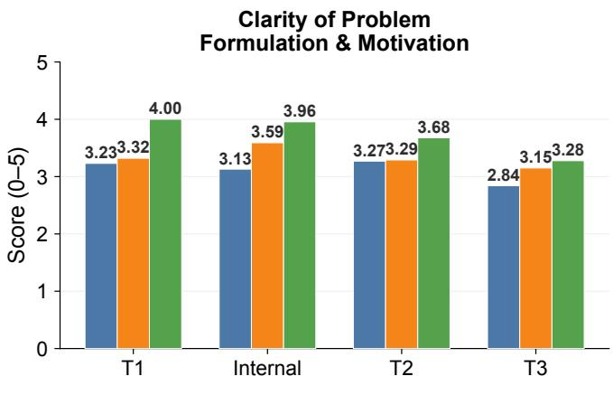  
Methodological Novelty

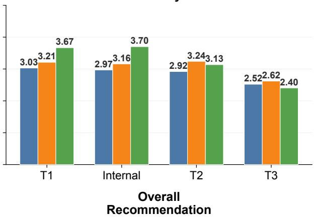

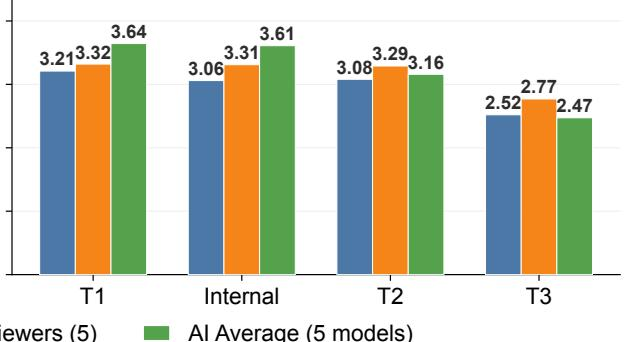  
Figure 10 Per-dimension manuscript quality scores across evaluation tracks. Four panels show (a) clarity of problem formulation and motivation, (b) methodolo<sub>g</sub>ical novelt<sub>y</sub>, (c) ex<sub>p</sub>erimental com<sub>p</sub>leteness, and (d) overall recommendation. Each <sub>p</sub>anel re<sub>p</sub>orts mean scores stratified by paper tier (T1, T2, T3) and Camyla-generated internal papers, for three reviewer groups: junior human <sub>rev</sub>i<sub>ewers, sen</sub>i<sub>or</sub> h<sub>uman rev</sub>i<sub>ewers, an</sub>d th<sub>e</sub> fi<sub>ve-mo</sub>d<sub>e</sub>l AI <sub>average.</sub> E<sub>rror</sub> b<sub>ars</sub> i<sub>n</sub>di<sub>ca</sub>t<sub>e s</sub>t<sub>an</sub>d<sub>ar</sub>d <sub>error o</sub>f th<sub>e mean.</sub>

Table 20 Binomial test results (one-sided, $H _ { 1 } : p > p _ { 0 } )$ <sub>an</sub>d Wil<sub>son</sub> 95% <sub>con</sub>fid<sub>ence</sub> i<sub>n</sub>t<sub>erva</sub>l<sub>s</sub> f<sub>or w</sub>i<sub>n ra</sub>t<sub>es.</sub>

<table><tr><td>Configuration</td><td>Wins</td><td> $p(p_0=0.5)$ </td><td> $p(p_0=0.3)$ </td><td>Wilson 95% CI</td></tr><tr><td> $Camyla_S$ (all 31)</td><td>22/31</td><td>0.015</td><td> $3.0 \times 10^{-6}$ </td><td>[53.4%, 83.9%]</td></tr><tr><td> $Camyla_D$ (all 31)</td><td>18/31</td><td>0.237</td><td>0.001</td><td>[40.8%, 73.6%]</td></tr><tr><td> $Camyla_S$ (blind 26)</td><td>18/26</td><td>0.038</td><td> $2.4 \times 10^{-5}$ </td><td>[50.0%, 83.5%]</td></tr><tr><td> $Camyla_D$ (blind 26)</td><td>14/26</td><td>0.423</td><td>0.007</td><td>[35.5%, 71.2%]</td></tr><tr><td>Union (all 31)</td><td>24/31</td><td>0.002</td><td>—</td><td>[60.2%, 88.6%]</td></tr><tr><td>Union (blind 26)</td><td>20/26</td><td>0.004</td><td>—</td><td>[57.8%, 89.4%]</td></tr></table>

<sub>nu</sub>ll $( p _ { 0 } = 0 . 5 )$ , Camyla<sub>S</sub> alone reaches $p = 0 . 0 1 5$ <sub>an</sub>d th<sub>e un</sub>i<sub>on reac</sub>h<sub>es</sub> $p = 0 . 0 0 2 .$ <sub>.</sub> Th<sub>e</sub> Wil<sub>son con</sub>fid<sub>ence</sub> i<sub>n</sub>t<sub>erva</sub>l<sub>s</sub> <sub>con</sub>fi<sub>rm</sub> th<sub>a</sub>t <sub>even</sub> th<sub>e</sub> l<sub>ower</sub> b<sub>oun</sub>d <sub>o</sub>f th<sub>e un</sub>i<sub>on w</sub>i<sub>n ra</sub>t<sub>e excee</sub>d<sub>s</sub> 60%<sub>.</sub>

## H.2 Per-Sample Wilcoxon Signed-Rank Tests

To assess si<sub>g</sub>nificance at the individual ex<sub>p</sub>eriment level<sub>,</sub> we <sub>p</sub>erform <sub>p</sub>aired Wilcoxon si<sub>g</sub>ned-rank tests at the <sub>p</sub>ersam<sub>p</sub>le level for all 40 winnin<sub>g</sub> ex<sub>p</sub>eriments. For 3D datasets<sub>,</sub> Dice and HD95 are com<sub>p</sub>uted on ever<sub>y</sub> axial slice <sub>con</sub>t<sub>a</sub>i<sub>n</sub>i<sub>ng</sub> f<sub>oregroun</sub>d i<sub>n</sub> th<sub>e</sub> <sub>re</sub>f<sub>erence</sub> <sub>segmen</sub>t<sub>a</sub>ti<sub>on,</sub> <sub>y</sub>i<sub>e</sub>ldi<sub>ng</sub> h<sub>un</sub>d<sub>re</sub>d<sub>s</sub> t<sub>o</sub> th<sub>ousan</sub>d<sub>s</sub> <sub>o</sub>f <sub>pa</sub>i<sub>re</sub>d <sub>samp</sub>l<sub>es</sub> <sub>per</sub> d<sub>a</sub>t<sub>ase</sub>t<sub>.</sub> For 2D datasets<sub>,</sub> <sub>p</sub>er-case metrics are <sub>u</sub>sed directl<sub>y</sub>. This <sub>p</sub>er-slice a<sub>pp</sub>roach follows standard <sub>p</sub>ractice in medical ima<sub>g</sub>e se<sub>g</sub>mentation evaluation [9].

Table 21 Per-sample Wilcoxon signed-rank tests for Camyla<sub>D</sub> winning experiments. † = validation. � = paired samples. \*\*\* �<0.001, \*\* �<0.01, \* �<0.05, n.s. = not significant.

<table><tr><td>ID</td><td>Dataset</td><td>Cfg</td><td>N</td><td>BL Dice</td><td>Best Dice</td><td>ΔDice</td><td>p(Dice)</td><td>Sig</td><td>p(HD95)</td><td>Sig</td></tr><tr><td> $1^†$ </td><td>GDMRI-CT</td><td>3D</td><td>44</td><td>0.7233</td><td>0.7387</td><td>+0.0153</td><td>5.07e-01</td><td>n.s.</td><td>9.75e-01</td><td>n.s.</td></tr><tr><td> $3^†$ </td><td>PNPC</td><td>3D</td><td>325</td><td>0.6063</td><td>0.6134</td><td>+0.0071</td><td>1.38e-01</td><td>n.s.</td><td>3.85e-01</td><td>n.s.</td></tr><tr><td> $4^†$ </td><td>AMSMC-HTM</td><td>3D</td><td>251</td><td>0.8141</td><td>0.8298</td><td>+0.0157</td><td>6.26e-09</td><td>***</td><td>1.28e-06</td><td>***</td></tr><tr><td> $5^†$ </td><td>NLSTseg</td><td>3D</td><td>1,446</td><td>0.2320</td><td>0.4686</td><td>+0.2365</td><td>1.29e-66</td><td>***</td><td>3.04e-11</td><td>***</td></tr><tr><td>6</td><td>SMRI-FB</td><td>3D</td><td>1,242</td><td>0.8530</td><td>0.8667</td><td>+0.0136</td><td>4.52e-40</td><td>***</td><td>1.89e-22</td><td>***</td></tr><tr><td>7</td><td>LMD-BM</td><td>3D</td><td>383</td><td>0.4619</td><td>0.5151</td><td>+0.0532</td><td>1.58e-15</td><td>***</td><td>4.10e-04</td><td>***</td></tr><tr><td>8</td><td>BONBID2023</td><td>3D</td><td>316</td><td>0.5585</td><td>0.5823</td><td>+0.0237</td><td>5.15e-03</td><td>**</td><td>3.00e-02</td><td>*</td></tr><tr><td>9</td><td>BTXRD</td><td>2D</td><td>374</td><td>0.4445</td><td>0.5017</td><td>+0.0572</td><td>4.13e-12</td><td>***</td><td>5.02e-03</td><td>**</td></tr><tr><td>11</td><td>CirrMRI600+</td><td>3D</td><td>1,616</td><td>0.8179</td><td>0.8632</td><td>+0.0453</td><td>1.77e-07</td><td>***</td><td>1.23e-33</td><td>***</td></tr><tr><td>14</td><td>DERMA-OCTA</td><td>2D</td><td>67</td><td>0.8391</td><td>0.8428</td><td>+0.0037</td><td>4.14e-03</td><td>**</td><td>8.06e-01</td><td>n.s.</td></tr><tr><td>16</td><td>FOVEA</td><td>2D</td><td>8</td><td>0.7142</td><td>0.8191</td><td>+0.1049</td><td>1.95e-01</td><td>n.s.</td><td>8.13e-01</td><td>n.s.</td></tr><tr><td>18</td><td>HRUS-MBT</td><td>3D</td><td>62</td><td>0.4269</td><td>0.5055</td><td>+0.0787</td><td>3.12e-04</td><td>***</td><td>1.92e-03</td><td>**</td></tr><tr><td>19</td><td>LapGC-KVAD</td><td>2D</td><td>251</td><td>0.5277</td><td>0.5698</td><td>+0.0421</td><td>2.97e-06</td><td>***</td><td>7.61e-03</td><td>**</td></tr><tr><td>20</td><td>LongCIU</td><td>3D</td><td>18</td><td>0.7345</td><td>0.7573</td><td>+0.0228</td><td>4.68e-01</td><td>n.s.</td><td>3.85e-02</td><td>*</td></tr><tr><td>21</td><td>MSLesSeg</td><td>3D</td><td>1,742</td><td>0.6957</td><td>0.7069</td><td>+0.0113</td><td>1.15e-03</td><td>**</td><td>5.78e-01</td><td>n.s.</td></tr><tr><td>25</td><td>PLC-CECT</td><td>3D</td><td>2,754</td><td>0.5322</td><td>0.6161</td><td>+0.0839</td><td>1.28e-52</td><td>***</td><td>3.34e-72</td><td>***</td></tr><tr><td>26</td><td>PW-BALFC</td><td>2D</td><td>421</td><td>0.7666</td><td>0.7697</td><td>+0.0031</td><td>3.67e-01</td><td>n.s.</td><td>2.60e-01</td><td>n.s.</td></tr><tr><td>28</td><td>STS-Tooth</td><td>2D</td><td>170</td><td>0.9367</td><td>0.9435</td><td>+0.0067</td><td>1.47e-13</td><td>***</td><td>1.64e-02</td><td>*</td></tr></table>

Summary: Dice significant on 12/18, HD95 significant on 11/18, either metric significant on 13/18 (72%).

Table 22 Per-sample Wilcoxon signed-rank tests for Camyla<sub>S</sub> winning experiments. Notation follows Table 21.

<table><tr><td>ID</td><td>Dataset</td><td>Cfg</td><td>N</td><td>BL Dice</td><td>Best Dice</td><td>ΔDice</td><td>p(Dice)</td><td>Sig</td><td>p(HD95)</td><td>Sig</td></tr><tr><td> $1^†$ </td><td>GDMRI-CT</td><td>3D</td><td>44</td><td>0.7233</td><td>0.7277</td><td>+0.0044</td><td>9.52e-01</td><td>n.s.</td><td>3.20e-01</td><td>n.s.</td></tr><tr><td> $3^†$ </td><td>PNPC</td><td>3D</td><td>325</td><td>0.6063</td><td>0.6195</td><td>+0.0133</td><td>1.64e-01</td><td>n.s.</td><td>4.43e-01</td><td>n.s.</td></tr><tr><td> $4^†$ </td><td>AMSMC-HTM</td><td>3D</td><td>251</td><td>0.8141</td><td>0.8289</td><td>+0.0148</td><td>7.47e-06</td><td>***</td><td>1.15e-07</td><td>***</td></tr><tr><td> $5^†$ </td><td>NLSTseg</td><td>3D</td><td>1,446</td><td>0.2320</td><td>0.4126</td><td>+0.1805</td><td>&lt;1e-300</td><td>***</td><td>4.95e-07</td><td>***</td></tr><tr><td>6</td><td>SMRI-FB</td><td>3D</td><td>1,242</td><td>0.8530</td><td>0.8590</td><td>+0.0059</td><td>6.77e-14</td><td>***</td><td>1.97e-07</td><td>***</td></tr><tr><td>7</td><td>LMD-BM</td><td>3D</td><td>383</td><td>0.4619</td><td>0.5101</td><td>+0.0482</td><td>1.05e-08</td><td>***</td><td>2.56e-04</td><td>***</td></tr><tr><td>8</td><td>BONBID2023</td><td>3D</td><td>316</td><td>0.5585</td><td>0.5641</td><td>+0.0055</td><td>6.50e-11</td><td>***</td><td>3.87e-04</td><td>***</td></tr><tr><td>9</td><td>BTXRD</td><td>2D</td><td>374</td><td>0.4445</td><td>0.4442</td><td>-0.0003</td><td>8.18e-05</td><td>***</td><td>2.60e-02</td><td>*</td></tr><tr><td>10</td><td>BUS-UCLM</td><td>2D</td><td>134</td><td>0.3666</td><td>0.3618</td><td>-0.0048</td><td>4.80e-01</td><td>n.s.</td><td>6.55e-01</td><td>n.s.</td></tr><tr><td>11</td><td>CirrMRI600+</td><td>3D</td><td>1,616</td><td>0.8179</td><td>0.8506</td><td>+0.0327</td><td>3.12e-09</td><td>***</td><td>1.69e-02</td><td>*</td></tr><tr><td>12</td><td>CPAISD</td><td>3D</td><td>404</td><td>0.2732</td><td>0.2908</td><td>+0.0176</td><td>1.81e-01</td><td>n.s.</td><td>9.80e-15</td><td>***</td></tr><tr><td>14</td><td>DERMA-OCTA</td><td>2D</td><td>67</td><td>0.8391</td><td>0.8421</td><td>+0.0030</td><td>2.34e-02</td><td>*</td><td>4.48e-03</td><td>**</td></tr><tr><td>15</td><td>Endoscapes</td><td>2D</td><td>69</td><td>0.4753</td><td>0.4813</td><td>+0.0060</td><td>4.27e-01</td><td>n.s.</td><td>2.38e-01</td><td>n.s.</td></tr><tr><td>18</td><td>HRUS-MBT</td><td>3D</td><td>62</td><td>0.4269</td><td>0.4783</td><td>+0.0514</td><td>4.21e-04</td><td>***</td><td>3.15e-03</td><td>**</td></tr><tr><td>20</td><td>LongCIU</td><td>3D</td><td>18</td><td>0.7345</td><td>0.7447</td><td>+0.0102</td><td>6.65e-02</td><td>n.s.</td><td>2.29e-01</td><td>n.s.</td></tr><tr><td>21</td><td>MSLesSeg</td><td>3D</td><td>1,742</td><td>0.6957</td><td>0.6981</td><td>+0.0024</td><td>7.91e-01</td><td>n.s.</td><td>7.94e-05</td><td>***</td></tr><tr><td>24</td><td>PediMS</td><td>3D</td><td>102</td><td>0.7949</td><td>0.7940</td><td>-0.0009</td><td>7.70e-02</td><td>n.s.</td><td>7.48e-01</td><td>n.s.</td></tr><tr><td>25</td><td>PLC-CECT</td><td>3D</td><td>2,754</td><td>0.5322</td><td>0.5544</td><td>+0.0222</td><td>4.10e-07</td><td>***</td><td>5.99e-25</td><td>***</td></tr><tr><td>26</td><td>PW-BALFC</td><td>2D</td><td>421</td><td>0.7666</td><td>0.7687</td><td>+0.0021</td><td>3.09e-01</td><td>n.s.</td><td>4.21e-02</td><td>*</td></tr><tr><td>28</td><td>STS-Tooth</td><td>2D</td><td>170</td><td>0.9367</td><td>0.9371</td><td>+0.0004</td><td>6.79e-01</td><td>n.s.</td><td>7.83e-02</td><td>n.s.</td></tr><tr><td>30</td><td>TRUSTED</td><td>3D</td><td>3,291</td><td>0.6213</td><td>0.7586</td><td>+0.1373</td><td>&lt;1e-300</td><td>***</td><td>&lt;1e-300</td><td>***</td></tr><tr><td>31</td><td>UT-EndoMRI</td><td>3D</td><td>159</td><td>0.7510</td><td>0.7703</td><td>+0.0193</td><td>2.76e-01</td><td>n.s.</td><td>4.78e-02</td><td>*</td></tr></table>

Summary: Dice significant on 12/22, HD95 significant on 13/22, either metric significant on 15/22 (68%).

T<sub>a</sub>bl<sub>es</sub> 21 <sub>an</sub>d 22 <sub>repor</sub>t th<sub>e</sub> f<sub>u</sub>ll <sub>resu</sub>lt<sub>s</sub> f<sub>or</sub> b<sub>o</sub>th <sub>runs.</sub> A<sub>cross a</sub>ll 40 <sub>w</sub>i<sub>nn</sub>i<sub>ng exper</sub>i<sub>men</sub>t<sub>s,</sub> 70% <sub>s</sub>h<sub>ow s</sub>t<sub>a</sub>ti<sub>s</sub>ti<sub>ca</sub>ll<sub>y</sub> si<sub>g</sub>nificant im<sub>p</sub>rovement (� < 0.05) on at least one metric, and 50% are si<sub>g</sub>nificant on both Dice and HD95.

Aggregate summary. Table 23 consolidates the significance counts across both runs. After Bonferroni correction <sub>across</sub> <sub>a</sub>ll 40 <sub>exper</sub>i<sub>men</sub>t<sub>s</sub> $( \alpha = 0 . 0 5 / 4 0 = 0 . 0 0 1 2 5 )$ <sub>,</sub> 20 <sub>e</sub>x<sub>pe</sub>rim<sub>e</sub>nt<sub>s</sub> r<sub>e</sub>m<sub>a</sub>in <sub>s</sub>i<sub>g</sub>nifi<sub>ca</sub>nt <sub>o</sub>n <sub>a</sub>t l<sub>eas</sub>t <sub>o</sub>n<sub>e</sub> m<sub>e</sub>tri<sub>c.</sub>

Discussion. The non-significant cases follow three predictable patterns: (a) near-saturated baselines with marginal <sub>g</sub>ains (e.<sub>g</sub>., PW-BALFC: ΔDice = +0.3 <sub>pp</sub> on a 76.7% baseline), (b) datasets with hi<sub>g</sub>h inter-case variance (e.<sub>g</sub>., GDMRI-CT with hetero<sub>g</sub>eneous multi-se<sub>q</sub>uence brain MRI), and (c) 2D datasets with ver<sub>y</sub> few test sam<sub>p</sub>les where even <sub>p</sub>er-case testin<sub>g</sub> lacks statistical <sub>p</sub>ower (e.<sub>g</sub>., FOVEA: �=8, �=0.195 des<sub>p</sub>ite ΔDice = +10.5 <sub>pp</sub>). For 3D datasets, adjacent axial slices within a volume are s<sub>p</sub>atiall<sub>y</sub> correlated<sub>,</sub> which means the Wilcoxon test’s inde<sub>p</sub>endence assum<sub>p</sub>tion is <sub>p</sub>artiall<sub>y</sub> <sub>v</sub>i<sub>o</sub>l<sub>a</sub>t<sub>e</sub>d <sub>an</sub>d th<sub>e</sub> <sub>repor</sub>t<sub>e</sub>d <sub>p-va</sub>l<sub>ues</sub> <sub>may</sub> b<sub>e</sub> <sub>s</sub>li<sub>g</sub>htl<sub>y</sub> lib<sub>era</sub>l<sub>.</sub> H<sub>owever,</sub> thi<sub>s</sub> <sub>per-s</sub>li<sub>ce</sub> <sub>eva</sub>l<sub>ua</sub>ti<sub>on</sub> f<sub>o</sub>ll<sub>ows</sub> <sub>s</sub>t<sub>an</sub>d<sub>ar</sub>d <sub>prac</sub>ti<sub>ce</sub> in th<sub>e</sub> m<sub>e</sub>di<sub>ca</sub>l <sub>seg</sub>m<sub>e</sub>nt<sub>a</sub>ti<sub>o</sub>n lit<sub>e</sub>r<sub>a</sub>t<sub>u</sub>r<sub>e, a</sub>nd 20 <sub>e</sub>x<sub>pe</sub>rim<sub>e</sub>nt<sub>s su</sub>r<sub>v</sub>i<sub>ve</sub> th<sub>e s</sub>trin<sub>ge</sub>nt B<sub>o</sub>nf<sub>e</sub>rr<sub>o</sub>ni <sub>co</sub>rr<sub>ec</sub>ti<sub>o</sub>n<sub>.</sub>

Table 23 Aggregate per-sample significance counts across both runs.

<table><tr><td></td><td>Run D (18)</td><td>Run S (22)</td><td>Total (40)</td></tr><tr><td>Dice significant</td><td>12 (67%)</td><td>12 (55%)</td><td>24 (60%)</td></tr><tr><td>HD95 significant</td><td>11 (61%)</td><td>13 (59%)</td><td>24 (60%)</td></tr><tr><td>Either metric</td><td>13 (72%)</td><td>15 (68%)</td><td>28 (70%)</td></tr><tr><td>Both metrics</td><td>10 (56%)</td><td>10 (45%)</td><td>20 (50%)</td></tr></table>

Table 24 Computational cost summary across both runs (62 experiments total). GPU-hours are measured on NVIDIA RTX 4090 48 GB GPU<sub>s</sub> <sub>u</sub>nd<sub>e</sub>r th<sub>e</sub> <sub>u</sub>nifi<sub>e</sub>d <sub>ea</sub>rl<sub>y</sub>-<sub>s</sub>t<sub>op</sub> <sub>po</sub>li<sub>cy.</sub>

<table><tr><td>Metric</td><td>Value</td></tr><tr><td>Total experiments</td><td>62</td></tr><tr><td>Total GPU-hours</td><td>5,461.9 h</td></tr><tr><td>Total GPU-days</td><td>227.6 d</td></tr><tr><td>Mean GPU-hours / experiment</td><td>88.1 h</td></tr><tr><td>Median GPU-hours / experiment</td><td>34.2 h</td></tr><tr><td>Baseline-beating experiments (40)</td><td>2,595.2 h (mean 64.9 h)</td></tr><tr><td>Non-beating experiments (22)</td><td>2,866.7 h (mean 130.3 h)</td></tr></table>

The cross-run consistenc<sub>y</sub> re<sub>p</sub>orted in §5.3 <sub>p</sub>rovides com<sub>p</sub>lementar<sub>y</sub> variance evidence: for the 16 datasets won b<sub>y</sub> both runs, the Pearson correlation of best Dice is �=0.978 and the mean inter-run absolute diference is 1.56 <sub>pp</sub>. The two r<sub>u</sub>ns var<sub>y</sub> the idea <sub>g</sub>enerator LLM—a strictl<sub>y</sub> stron<sub>g</sub>er <sub>p</sub>ert<sub>u</sub>rbation than var<sub>y</sub>in<sub>g</sub> trainin<sub>g</sub> random seeds—<sub>y</sub>et <sub>pro</sub>d<sub>uce</sub> hi<sub>g</sub>hl<sub>y concor</sub>d<sub>an</sub>t <sub>ou</sub>t<sub>comes.</sub>

## I Computational Cost

T<sub>a</sub>bl<sub>e</sub> 24 <sub>summar</sub>i<sub>zes</sub> th<sub>e</sub> <sub>compu</sub>t<sub>a</sub>ti<sub>ona</sub>l <sub>cos</sub>t <sub>o</sub>f b<sub>o</sub>th i<sub>n</sub>d<sub>epen</sub>d<sub>en</sub>t <sub>runs.</sub> All fi<sub>gures</sub> <sub>are</sub> <sub>repor</sub>t<sub>e</sub>d <sub>un</sub>d<sub>er</sub> th<sub>e</sub> <sub>un</sub>ifi<sub>e</sub>d earl<sub>y</sub>-sto<sub>p p</sub>olic<sub>y</sub> described in A<sub>pp</sub>endix A.1: once a <sub>p</sub>ro<sub>p</sub>osal’s best Dice exceeds the baseline<sub>,</sub> subse<sub>q</sub>uent <sub>p</sub>ro<sub>p</sub>osals are not executed. Under this <sub>p</sub>olic<sub>y</sub>, the 62 ex<sub>p</sub>eriments consume a total of 5,461.9 GPU-hours (227.6 GPU-da<sub>y</sub>s) on NVIDIA RTX 4090 48 GB GPU<sub>s,</sub> <sub>w</sub>ith <sub>a</sub> m<sub>ea</sub>n <sub>o</sub>f 88<sub>.</sub>1 GPU-h<sub>ou</sub>r<sub>s</sub> <sub>pe</sub>r <sub>e</sub>x<sub>pe</sub>rim<sub>e</sub>nt<sub>.</sub> Ex<sub>pe</sub>rim<sub>e</sub>nt<sub>s</sub> th<sub>a</sub>t <sub>success</sub>f<sub>u</sub>ll<sub>y</sub> <sub>e</sub>x<sub>cee</sub>d the baseline consume substantiall<sub>y</sub> fewer resources (mean 64.9 h) than those that exhaust the full bud<sub>g</sub>et without success (mean 130.3 h), because the earl<sub>y</sub>-sto<sub>p</sub> mechanism terminates search once im<sub>p</sub>rovement is confirmed.

Table 25 re<sub>p</sub>orts the <sub>p</sub>er-dataset GPU-hours a<sub>gg</sub>re<sub>g</sub>ated across both attem<sub>p</sub>ts. The variation is lar<sub>g</sub>e (6.3 h to 730.8 h), d<sub>r</sub>i<sub>ven</sub> <sub>pr</sub>i<sub>mar</sub>il<sub>y</sub> b<sub>y</sub> d<sub>a</sub>t<sub>ase</sub>t <sub>vo</sub>l<sub>ume</sub> <sub>s</sub>i<sub>ze</sub> <sub>an</sub>d th<sub>e</sub> <sub>num</sub>b<sub>er</sub> <sub>o</sub>f <sub>proposa</sub>l<sub>s</sub> <sub>requ</sub>i<sub>re</sub>d b<sub>e</sub>f<sub>ore</sub> <sub>success.</sub>

## J CamylaTrace-232k: Research Trajectory Dataset

To support future research on autonomous scientific agents, we publicly release CamylaTrace-232k, the experimentaldiscovery trajectories produced during both independent Camyla runs on the 31 CamylaBench datasets. CamylaTrace-232k ca<sub>p</sub>tures the core of the autonomous research <sub>p</sub>rocess—iterative ex<sub>p</sub>erimentation driven b<sub>y</sub> literature-<sub>g</sub>rounded <sub>proposa</sub>l<sub>s,</sub> di<sub>agnos</sub>ti<sub>c</sub> f<sub>ee</sub>db<sub>ac</sub>k<sub>,</sub> <sub>an</sub>d <sub>qua</sub>lit<sub>y-we</sub>i<sub>g</sub>ht<sub>e</sub>d <sub>searc</sub>h<sub>—as</sub> fi<sub>ne-gra</sub>i<sub>ne</sub>d<sub>,</sub> ti<sub>mes</sub>t<sub>ampe</sub>d <sub>even</sub>t l<sub>ogs.</sub> Th<sub>e</sub> d<sub>a</sub>t<sub>ase</sub>t f<sub>ocuses exc</sub>l<sub>us</sub>i<sub>ve</sub>l<sub>y on</sub> th<sub>e exper</sub>i<sub>men</sub>t<sub>a</sub>l<sub>-</sub>di<sub>scovery p</sub>h<sub>ase, w</sub>hi<sub>c</sub>h <sub>con</sub>t<sub>a</sub>i<sub>ns</sub> th<sub>e agen</sub>t’<sub>s</sub> h<sub>ypo</sub>th<sub>es</sub>i<sub>s-</sub>d<sub>r</sub>i<sub>ven arc</sub>hit<sub>ec</sub>t<sub>ura</sub>l <sub>exp</sub>l<sub>ora</sub>ti<sub>on an</sub>d i<sub>s</sub> th<sub>e p</sub>h<sub>ase mos</sub>t <sub>re</sub>l<sub>evan</sub>t t<sub>o s</sub>t<sub>u</sub>d<sub>y</sub>i<sub>ng au</sub>t<sub>onomous sc</sub>i<sub>en</sub>tifi<sub>c reason</sub>i<sub>ng.</sub> Th<sub>e</sub> “232k” <sub>re</sub>f<sub>ers</sub> t<sub>o</sub> th<sub>e</sub> 232<sub>,</sub>499 <sub>agen</sub>t <sub>even</sub>t<sub>s</sub> i<sub>n</sub> th<sub>e</sub> <sub>re</sub>l<sub>ease</sub>d <sub>corpus.</sub>

Table 25 Per-dataset GPU-hours under the unified early-stop policy. Each dataset has two attempts (one per run). † = validation. Tot. = sum across both attempts. Sav. = GPU-hours saved by early stopping. Total: 5,461.9 h (saved 1,930.5 h).

<table><tr><td>ID</td><td>Dataset</td><td>Att.1</td><td>Att.2</td><td>Tot.</td><td>Sav.</td><td>ID</td><td>Dataset</td><td>Att.1</td><td>Att.2</td><td>Tot.</td><td>Sav.</td></tr><tr><td> $1^†$ </td><td>GDMRI-CT</td><td>33.6</td><td>9.6</td><td>43.2</td><td>52.3</td><td>17</td><td>Fundus-AVSeg</td><td>6.5</td><td>31.2</td><td>37.8</td><td>33.0</td></tr><tr><td> $2^†$ </td><td>MRE-BSA</td><td>81.3</td><td>33.5</td><td>114.8</td><td>0.0</td><td>18</td><td>HRUS-MBT</td><td>243.5</td><td>9.5</td><td>253.0</td><td>144.3</td></tr><tr><td> $3^†$ </td><td>PNPC</td><td>34.7</td><td>22.8</td><td>57.4</td><td>42.0</td><td>19</td><td>LapGC-KVAD</td><td>188.1</td><td>235.9</td><td>423.9</td><td>153.9</td></tr><tr><td> $4^†$ </td><td>AMSMC-HTM</td><td>45.0</td><td>21.4</td><td>66.4</td><td>109.6</td><td>20</td><td>LongCIU</td><td>42.7</td><td>9.4</td><td>52.1</td><td>50.0</td></tr><tr><td> $5^†$ </td><td>NLSTseg</td><td>26.5</td><td>32.6</td><td>59.1</td><td>61.0</td><td>21</td><td>MSLesSeg</td><td>51.9</td><td>12.4</td><td>64.3</td><td>80.7</td></tr><tr><td>6</td><td>SMRI-FB</td><td>48.4</td><td>23.1</td><td>71.5</td><td>78.9</td><td>22</td><td>MU-Glioma</td><td>474.7</td><td>256.1</td><td>730.8</td><td>0.0</td></tr><tr><td>7</td><td>LMD-BM</td><td>68.0</td><td>150.7</td><td>218.8</td><td>262.0</td><td>23</td><td>OCT5k</td><td>440.8</td><td>219.6</td><td>660.4</td><td>0.0</td></tr><tr><td>8</td><td>BONBID2023</td><td>20.0</td><td>25.1</td><td>45.2</td><td>61.5</td><td>24</td><td>PediMS</td><td>38.9</td><td>24.2</td><td>63.1</td><td>0.0</td></tr><tr><td>9</td><td>BTXRD</td><td>279.5</td><td>210.0</td><td>489.6</td><td>180.4</td><td>25</td><td>PLC-CECT</td><td>220.7</td><td>191.5</td><td>412.2</td><td>150.3</td></tr><tr><td>10</td><td>BUS-UCLM</td><td>189.3</td><td>141.5</td><td>330.8</td><td>0.0</td><td>26</td><td>PW-BALFC</td><td>208.8</td><td>153.7</td><td>362.5</td><td>122.9</td></tr><tr><td>11</td><td>CirrMRI600+</td><td>20.9</td><td>13.1</td><td>34.0</td><td>60.4</td><td>27</td><td>SEA-SIS</td><td>33.5</td><td>41.2</td><td>74.7</td><td>0.0</td></tr><tr><td>12</td><td>CPAISD</td><td>14.5</td><td>29.0</td><td>43.5</td><td>35.0</td><td>28</td><td>STS-Tooth</td><td>9.7</td><td>6.7</td><td>16.4</td><td>35.7</td></tr><tr><td>13</td><td>DenPAR</td><td>29.9</td><td>6.3</td><td>36.2</td><td>79.4</td><td>29</td><td>TOM500</td><td>64.8</td><td>50.8</td><td>115.6</td><td>0.0</td></tr><tr><td>14</td><td>DERMA-OCTA</td><td>11.8</td><td>23.5</td><td>35.4</td><td>38.3</td><td>30</td><td>TRUSTED</td><td>181.0</td><td>185.9</td><td>366.9</td><td>33.1</td></tr><tr><td>15</td><td>Endoscapes</td><td>45.1</td><td>25.2</td><td>70.4</td><td>16.7</td><td>31</td><td>UT-EndoMRI</td><td>34.2</td><td>16.5</td><td>50.6</td><td>5.8</td></tr><tr><td>16</td><td>FOVEA</td><td>32.0</td><td>29.6</td><td>61.5</td><td>43.2</td><td></td><td></td><td></td><td></td><td></td><td></td></tr></table>

Table 26 Scale of the CamylaTrace-232k dataset. All counts are restricted to experimental-discovery directories from the 62 main ex<sub>p</sub>er<sup>i</sup>ments.

<table><tr><td>Dimension</td><td>Count</td></tr><tr><td>Datasets covered</td><td>31</td></tr><tr><td>Independent experiments</td><td>62</td></tr><tr><td>Experimental-discovery directories</td><td>147</td></tr><tr><td>Agent event files (.jsonl)</td><td>2,865</td></tr><tr><td>Agent session summaries (.md)</td><td>3,953</td></tr><tr><td>Generated experiment code files (.py)</td><td>1,343</td></tr><tr><td>Total agent events</td><td>232,499</td></tr><tr><td>Total dataset size</td><td>~700 MB</td></tr></table>

## J.1 Scale and Coverage

Th<sub>e</sub> d<sub>a</sub>t<sub>ase</sub>t <sub>spans</sub> 62 i<sub>n</sub>d<sub>epen</sub>d<sub>en</sub>t <sub>exper</sub>i<sub>men</sub>t<sub>s con</sub>d<sub>uc</sub>t<sub>e</sub>d b<sub>e</sub>t<sub>ween</sub> 2026<sub>-</sub>02<sub>-</sub>23 <sub>an</sub>d 2026<sub>-</sub>03<sub>-</sub>16<sub>, cover</sub>i<sub>ng a</sub>ll 31 d<sub>a</sub>t<sub>ase</sub>t<sub>s</sub> with two attem<sub>p</sub>ts each (one <sub>p</sub>er run). Table 26 summarizes the ke<sub>y</sub> dimensions. The 147 ex<sub>p</sub>erimental-discover<sub>y</sub> directories across the 62 ex<sub>p</sub>eriments contain three cate<sub>g</sub>ories of artifacts: a<sub>g</sub>ent event lo<sub>g</sub>s<sub>, p</sub>er-session summaries<sub>,</sub> and <sub>g</sub>enerated code files<sub>,</sub> totalin<sub>g</sub> a<sub>pp</sub>roximatel<sub>y</sub> 700 MB.

## J.2 Directory Structure

The released dataset is or<sub>g</sub>anized b<sub>y</sub> dataset ID and ex<sub>p</sub>eriment timestam<sub>p</sub>. Each ex<sub>p</sub>erimental-discover<sub>y</sub> director<sub>y</sub> <sub>con</sub>t<sub>a</sub>i<sub>ns</sub> th<sub>ree ar</sub>tif<sub>ac</sub>t <sub>su</sub>bdi<sub>rec</sub>t<sub>or</sub>i<sub>es:</sub>

```txt
camylatrace-232k/
    <dataset_id>/
    <experiment_timestamp>/
    stage_2_creative_research_<N>_proposal_<M>/
    events/ # Timestamped agent event logs
    openhands_events_<ts>.jsonl
    summaries/ # Per-session summaries
    openhands_summary_<ts>.md
    codes/ # Generated code at each tree node
    <ts>_<hash>_experiment_code.py
```

Each events/ directory contains one JSONL file per coding session, capturing the complete agent interaction loop. Each summaries/ directory contains a Markdown summary produced at the end of each session. Each codes/ di<sub>rec</sub>t<sub>ory</sub> <sub>con</sub>t<sub>a</sub>i<sub>ns</sub> th<sub>e</sub> P<sub>y</sub>th<sub>on</sub> <sub>exper</sub>i<sub>men</sub>t <sub>co</sub>d<sub>e</sub> <sub>genera</sub>t<sub>e</sub>d <sub>a</sub>t <sub>eac</sub>h <sub>searc</sub>h t<sub>ree</sub> <sub>no</sub>d<sub>e,</sub> <sub>w</sub>ith fil<sub>enames</sub> <sub>enco</sub>di<sub>ng</sub> th<sub>e</sub> ti<sub>mes</sub>t<sub>amp an</sub>d <sub>a con</sub>t<sub>en</sub>t h<sub>as</sub>h<sub>.</sub>

Table 27 Comparison of CamylaTrace-232k with existing agent trajectory datasets.

<table><tr><td>Dataset</td><td>Domain</td><td>Scope</td><td>Events</td><td>Code</td></tr><tr><td>SWE-bench</td><td>Software eng.</td><td>Bug fixes</td><td>Patch-level</td><td>Yes</td></tr><tr><td>ML-bench</td><td>Machine learning</td><td>Task completion</td><td>Limited</td><td>Yes</td></tr><tr><td>CamylaTrace-232k</td><td>Scientific research</td><td>Iterative research</td><td>232K</td><td>1,343</td></tr></table>

## J.3 Event Schema

Each line in the JSONL event files is a JSON object with the followin<sub>g</sub> fields:

```json
{
    "timestamp": "2026-03-09T01:15:15.772208",
    "event_type": "ActionEvent",
    "event_str": "Agent edits network architecture",
    "llm_message": {
    "role": "assistant",
    "content_preview": "I will modify the encoder...",
    "content_length": 27750
    }
}
```

<sup>F</sup>our event t<sub>yp</sub>es ca<sub>p</sub>ture t<sup>h</sup>e a<sub>g</sub>ent <sup>i</sup>nteract<sup>i</sup>on <sup>l</sup>oo<sub>p</sub>:

• SystemPromptEvent — System prompt containing too<sup>l</sup> <sup>d</sup>e<sup>fi</sup>nitions, <sup>d</sup>ataset context, an<sup>d</sup> <sup>d</sup>ynamic state (current best metric, remainin<sub>g</sub> bud<sub>g</sub>et).

• MessageEvent — User-ro<sup>l</sup>e messages injecting experiment instructions, <sup>d</sup>iagnostic <sup>f</sup>ee<sup>db</sup>ac<sup>k</sup> reports, an<sup>d</sup> cyc<sup>l</sup>el<sub>eve</sub>l <sub>memory.</sub>

• ActionEvent — Agent reasoning traces (c<sup>h</sup>ain-o<sup>f</sup>-t<sup>h</sup>oug<sup>h</sup>t) an<sup>d</sup> too<sup>l</sup> invocations (co<sup>d</sup>e e<sup>d</sup>its, <sup>b</sup>as<sup>h</sup> comman<sup>d</sup>s, file reads, task trackin<sub>g</sub>).

• ObservationEvent — Too<sup>l</sup> execution resu<sup>l</sup>ts returne<sup>d</sup> to t<sup>h</sup>e agent, inc<sup>l</sup>u<sup>d</sup>ing training <sup>l</sup>ogs, eva<sup>l</sup>uation metrics, and com<sub>p</sub>ilation errors.

## J.4 Comparison with Existing Trajectory Datasets

Ta<sup>bl</sup>e 27 positions Camy<sup>l</sup>aTrace-232<sup>k</sup> re<sup>l</sup>ative to existing agent trajectory <sup>d</sup>atasets. Camy<sup>l</sup>aTrace-232<sup>k</sup> is <sup>d</sup>istinguis<sup>h</sup>e<sup>d</sup> b<sub>y</sub> its covera<sub>g</sub>e of iterative scientific ex<sub>p</sub>erimentation—h<sub>yp</sub>othesis-driven architectural ex<sub>p</sub>loration with dia<sub>g</sub>nostic f<sub>ee</sub>db<sub>ac</sub>k <sub>an</sub>d <sub>qua</sub>lit<sub>y-we</sub>i<sub>g</sub>ht<sub>e</sub>d <sub>searc</sub>h<sub>—ra</sub>th<sub>er</sub> th<sub>an</sub> i<sub>so</sub>l<sub>a</sub>t<sub>e</sub>d <sub>co</sub>di<sub>ng or</sub> t<sub>as</sub>k<sub>-comp</sub>l<sub>e</sub>ti<sub>on ep</sub>i<sub>so</sub>d<sub>es.</sub>

## J.5 Research Value

Cam<sub>y</sub>laTrace-232k enables se<sub>v</sub>eral lines of in<sub>v</sub>esti<sub>g</sub>ation:

1. A<sub>g</sub>ent reasonin<sub>g</sub> anal<sub>y</sub>sis. The 2<sub>,</sub>865 codin<sub>g</sub> sessions s<sub>p</sub>an 40 successful and 22 unsuccessful ex<sub>p</sub>eriments across 31 <sup>d</sup>iverse tas<sup>k</sup>s. Comparing reasoning patterns <sup>b</sup>etween <sup>b</sup>ase<sup>l</sup>ine-<sup>b</sup>eating an<sup>d</sup> non-<sup>b</sup>eating trajectories can revea<sup>l</sup> what distin<sub>g</sub>uishes <sub>p</sub>roductive ex<sub>p</sub>loration from un<sub>p</sub>roductive iteration.

2. Scientific codin<sub>g</sub> behavior. The 1,343 code sna<sub>p</sub>shots, each <sub>p</sub>aired with execution outcomes (Dice, HD95, or error t<sub>yp</sub>e), form a lar<sub>g</sub>e-scale cor<sub>p</sub>us of iterativel<sub>y</sub> refined dee<sub>p</sub> learnin<sub>g</sub> im<sub>p</sub>lementations suitable for stud<sub>y</sub>in<sub>g</sub> code evolution and debu<sub>gg</sub>in<sub>g</sub> strate<sub>g</sub>ies.

3. A<sub>g</sub>ent trainin<sub>g</sub> and evaluation. The 232<sub>,</sub>499 timestam<sub>p</sub>ed events with <sub>p</sub>aired outcomes <sub>p</sub>rovide su<sub>p</sub>ervised si<sub>g</sub>nal f<sub>or</sub> t<sub>ra</sub>i<sub>n</sub>i<sub>ng researc</sub>h<sub>-capa</sub>bl<sub>e agen</sub>t<sub>s or cons</sub>t<sub>ruc</sub>ti<sub>ng</sub> b<sub>enc</sub>h<sub>mar</sub>k<sub>s</sub> f<sub>or sc</sub>i<sub>en</sub>tifi<sub>c agen</sub>t <sub>eva</sub>l<sub>ua</sub>ti<sub>on.</sub>

## K QWBE Quality Normalization

S<sub>ec</sub>ti<sub>on</sub> 3<sub>.</sub>3 d<sub>e</sub>fi<sub>nes</sub> th<sub>e</sub> PUCT<sub>-</sub>b<sub>ase</sub>d b<sub>ranc</sub>h <sub>scor</sub>i<sub>n ru</sub>l<sub>e</sub> $\left( \operatorname { E q } . 4 \right)$ i<sub>n</sub> t<sub>erms</sub> <sub>o</sub>f th<sub>e</sub> b<sub>ranc</sub>h <sub>qua</sub>lit<sub>y</sub> $Q _ { i } \in [ - 1 , + 1 ]$ <sub>,</sub> b<sub>u</sub>t d<sub>oes</sub> not s<sub>p</sub>ecif<sub>y</sub> how $Q _ { i }$ is com<sub>p</sub>uted from raw evaluation metrics. This a<sub>pp</sub>endix <sub>p</sub>rovides the com<sub>p</sub>lete normalization <sub>p</sub>roce<sup>d</sup>ure.

Per-Trial Normalization. The branch quality $Q _ { i }$ i<sub>s</sub> th<sub>e mean over norma</sub>li<sub>ze</sub>d <sub>qua</sub>lit<sub>y va</sub>l<sub>ues</sub> $q ( t )$ <sub>o</sub>f <sub>a</sub>ll <sub>non-s</sub>t<sub>a</sub>l<sub>e</sub> t<sub>r</sub>i<sub>a</sub>l <sub>no</sub>d<sub>es w</sub>ithi<sub>n</sub> b<sub>ranc</sub>h $b _ { i } .$ <sub>.</sub> F<sub>or a</sub> t<sub>r</sub>i<sub>a</sub>l � <sub>w</sub>ith <sub>raw eva</sub>l<sub>ua</sub>ti<sub>on me</sub>t<sub>r</sub>i<sub>c</sub> $m ( t )$ <sub>an</sub>d b<sub>ase</sub>li<sub>ne me</sub>t<sub>r</sub>i<sub>c</sub> $m _ { 0 } ,$ <sub>,</sub> th<sub>e norma</sub>li<sub>za</sub>ti<sub>on</sub> i<sub>s:</sub>

$$
q (t) = \left\{ \begin{array}{l l} \frac {m (t) - m _ {0}}{\max (1 - m _ {0} , \varepsilon)} & \text {if} m (t) \geq m _ {0}, \\ - \min \biggl (1, \left(\frac {m _ {0} - m (t)}{\max (m _ {0} , \varepsilon)}\right) ^ {e} \biggr) & \text {if} m (t) <   m _ {0}, \end{array} \right.\tag{7}
$$

where � is a numerical stabilit<sub>y</sub> constant and � is the below-<sub>p</sub>enalization ex<sub>p</sub>onent (default 1.0, <sub>y</sub>ieldin<sub>g</sub> linear ma<sub>pp</sub>in<sub>g</sub> in both re<sub>g</sub>imes). The u<sub>pp</sub>er branch ma<sub>p</sub>s im<sub>p</sub>rovements into $[ 0 , + 1 ]$ <sub>, w</sub>h<sub>ere</sub> th<sub>e</sub> d<sub>enom</sub>i<sub>na</sub>t<sub>or max</sub> $\left( 1 - m _ { 0 } , \varepsilon \right)$ <sub>norma</sub>li<sub>zes</sub> b<sub>y</sub> th<sub>e max</sub>i<sub>mum poss</sub>ibl<sub>e</sub> i<sub>mprovemen</sub>t <sub>a</sub>b<sub>ove</sub> th<sub>e</sub> b<sub>ase</sub>li<sub>ne.</sub> Th<sub>e</sub> l<sub>ower</sub> b<sub>ranc</sub>h <sub>maps un</sub>d<sub>erper</sub>f<sub>ormance</sub> i<sub>n</sub>t<sub>o</sub> $[ - 1 , 0 ]$ <sub>w</sub>h<sub>ere � con</sub>t<sub>ro</sub>l<sub>s</sub> th<sub>e pena</sub>lt<sub>y s</sub>h<sub>ape: se</sub>tti<sub>ng</sub> $e < 1$ stren<sub>g</sub>thens <sub>p</sub>enalization for under<sub>p</sub>erformin<sub>g</sub> trials b<sub>y p</sub>ullin<sub>g</sub> their normalized <sub>q</sub>ualit<sub>y</sub> closer to −1, while $e > 1$ <sub>so</sub>ft<sub>ens</sub> th<sub>e</sub> <sub>pena</sub>lt<sub>y.</sub>

Handling Execution Errors. Trials that terminate with execution errors $( \mathrm { e . g . }$ <sub>, s</sub>h<sub>ape m</sub>i<sub>sma</sub>t<sub>c</sub>h<sub>es, ou</sub>t<sub>-o</sub>f<sub>-memory</sub> crashes, or NaN diver<sub>g</sub>ence) <sub>p</sub>roduce no valid metric. For such nodes, $q ( t )$ is estimated b<sub>y</sub> inheritin<sub>g</sub> the normalized <sub>qua</sub>lit<sub>y o</sub>f th<sub>e neares</sub>t <sub>va</sub>lid <sub>ances</sub>t<sub>or an</sub>d <sub>su</sub>bt<sub>rac</sub>ti<sub>ng a</sub> fi<sub>xe</sub>d <sub>correc</sub>ti<sub>on</sub> $ { \delta _ { \mathrm { b u g g y } } }$ (default 0.2):

$$
q (t _ {\mathrm{error}}) = q (t _ {\mathrm{ancestor}}) - \delta_ {\mathrm{buggy}}.\tag{8}
$$

Thi<sub>s</sub> i<sub>n</sub>h<sub>er</sub>it<sub>ance ru</sub>l<sub>e re</sub>fl<sub>ec</sub>t<sub>s</sub> th<sub>e o</sub>b<sub>serva</sub>ti<sub>on</sub> th<sub>a</sub>t <sub>an erroneous</sub> t<sub>r</sub>i<sub>a</sub>l t<sub>yp</sub>i<sub>ca</sub>ll<sub>y represen</sub>t<sub>s a</sub> l<sub>oca</sub>li<sub>ze</sub>d i<sub>mp</sub>l<sub>emen</sub>t<sub>a</sub>ti<sub>on</sub> f<sub>a</sub>il<sub>u</sub>r<sub>e</sub> n<sub>ea</sub>r <sub>a</sub> f<sub>u</sub>n<sub>c</sub>ti<sub>o</sub>nin<sub>g</sub> <sub>pa</sub>r<sub>e</sub>nt n<sub>o</sub>d<sub>e</sub> r<sub>a</sub>th<sub>e</sub>r th<sub>a</sub>n <sub>a</sub> <sub>co</sub>m<sub>p</sub>l<sub>e</sub>t<sub>e</sub> <sub>co</sub>ll<sub>apse</sub> <sub>o</sub>f th<sub>e</sub> r<sub>esea</sub>r<sub>c</sub>h dir<sub>ec</sub>ti<sub>o</sub>n<sub>.</sub> A<sub>ss</sub>i<sub>g</sub>nin<sub>g</sub> $q = - 1$ to all error nodes would systematically undervalue the branch containing them, discouraging QWBE from revisiting a direction that ma<sub>y</sub> onl<sub>y</sub> re<sub>q</sub>uire a minor code fix.

Leaf Selection Within a Branch. Once QWBE selects a branch via Eq. 4, it chooses the best available leaf node <sub>w</sub>ithi<sub>n</sub> th<sub>a</sub>t b<sub>ranc</sub>h f<sub>or expans</sub>i<sub>on.</sub> If th<sub>e se</sub>l<sub>ec</sub>t<sub>e</sub>d l<sub>ea</sub>f <sub>correspon</sub>d<sub>s</sub> t<sub>o a</sub> f<sub>a</sub>il<sub>e</sub>d <sub>execu</sub>ti<sub>on w</sub>ithi<sub>n</sub> th<sub>e a</sub>ll<sub>owe</sub>d d<sub>e</sub>b<sub>ugg</sub>i<sub>ng</sub> de<sub>p</sub>th (default 3 consecutive errors), it is submitted for a re<sub>p</sub>air attem<sub>p</sub>t; otherwise, it is submitted for an im<sub>p</sub>rovement <sub>a</sub>tt<sub>emp</sub>t th<sub>a</sub>t <sub>genera</sub>t<sub>es a re</sub>fi<sub>ne</sub>d i<sub>mp</sub>l<sub>emen</sub>t<sub>a</sub>ti<sub>on con</sub>diti<sub>one</sub>d <sub>on</sub> th<sub>e curren</sub>t b<sub>es</sub>t <sub>resu</sub>lt i<sub>n</sub> th<sub>e</sub> b<sub>ranc</sub>h<sub>.</sub> Thi<sub>s</sub> t<sub>wo-mo</sub>d<sub>e</sub> l<sub>ea</sub>f <sub>se</sub>l<sub>ec</sub>ti<sub>on ensures</sub> th<sub>a</sub>t <sub>prom</sub>i<sub>s</sub>i<sub>ng</sub> b<sub>ranc</sub>h<sub>es are no</sub>t <sub>a</sub>b<sub>an</sub>d<sub>one</sub>d d<sub>ue</sub> t<sub>o</sub> t<sub>rans</sub>i<sub>en</sub>t i<sub>mp</sub>l<sub>emen</sub>t<sub>a</sub>ti<sub>on errors w</sub>hil<sub>e</sub> <sub>p</sub>reventin<sub>g</sub> infinite debu<sub>gg</sub>in<sub>g</sub> loo<sub>p</sub>s on fundamentall<sub>y</sub> broken directions.

## L Divergent Diagnostic Feedback: Real Diagnostic Examples

To illustrate how DDF o<sub>p</sub>erates in <sub>p</sub>ractice<sub>,</sub> we <sub>p</sub>resent two com<sub>p</sub>lete dia<sub>g</sub>nostic re<sub>p</sub>orts from the Dataset 16 ex<sub>p</sub>eriment (o<sub>p</sub>tic disc se<sub>g</sub>mentation, UKAN baseline ${ \mathrm { D i c e } } = 0 . 7 1 4 2 )$ <sub>.</sub> Th<sub>ese</sub> <sub>examp</sub>l<sub>es</sub> <sub>are</sub> <sub>ex</sub>t<sub>rac</sub>t<sub>e</sub>d <sub>ver</sub>b<sub>a</sub>ti<sub>m</sub> f<sub>rom</sub> th<sub>e</sub> <sub>sys</sub>t<sub>em</sub>’<sub>s</sub> dia<sub>g</sub>nostic lo<sub>g</sub>s.

## L.1 Example 1: Failure Diagnosis (Cycle 1, Trial 2)

Trigger. Trial 2 achieves Dice = 0.6835, falling 3.07 percentage points below the baseline.

## Reasoning Trace.

“The ex<sub>p</sub>eriment successfull<sub>y</sub> executed but the Dice score (0.6835) is si<sub>g</sub>nificantl<sub>y</sub> below the baseline (0.7142). Anal<sub>y</sub>sis <sub>o</sub>f th<sub>e</sub> i<sub>mp</sub>l<sub>emen</sub>t<sub>a</sub>ti<sub>on</sub> <sub>revea</sub>l<sub>s</sub> <sub>severa</sub>l <sub>proposa</sub>l <sub>gaps</sub> <sub>an</sub>d <sub>s</sub>i<sub>mp</sub>lifi<sub>ca</sub>ti<sub>ons</sub> <sub>ma</sub>d<sub>e</sub> b<sub>y</sub> th<sub>e</sub> <sub>agen</sub>t t<sub>o</sub> <sub>pass</sub> th<sub>e</sub> 1<sub>-epoc</sub>h t<sub>es</sub>t<sub>.</sub> S<sub>pec</sub>ifi<sub>ca</sub>ll<sub>y,</sub> th<sub>e</sub> l<sub>earna</sub>bl<sub>e</sub> hi<sub>erarc</sub>h<sub>y em</sub>b<sub>e</sub>ddi<sub>ng w</sub>hi<sub>c</sub>h i<sub>s cen</sub>t<sub>ra</sub>l t<sub>o</sub> th<sub>e</sub> HTD <sub>mo</sub>d<sub>u</sub>l<sub>e</sub>’<sub>s mo</sub>ti<sub>va</sub>ti<sub>on was om</sub>itt<sub>e</sub>d

Furthermore, the s<sub>p</sub>atial <sub>p</sub>oolin<sub>g</sub> in the attention mechanism is likel<sub>y</sub> too a<sub>gg</sub>ressive (32×32), causin<sub>g</sub> a loss of fi<sub>ne-gra</sub>i<sub>ne</sub>d b<sub>oun</sub>d<sub>ary</sub> i<sub>n</sub>f<sub>orma</sub>ti<sub>on.</sub>”

Five-Suggestion Portfolio. Table 28 lists the five suggestions produced by the diagnostic agent, spanning three cate<sub>g</sub>or<sup>i</sup>es.

Table 28 DDF diagnostic report for Dataset 16, Cycle 1, Trial 2 (Dice = 0.6835 vs. baseline 0.7142).

<table><tr><td>#</td><td>Category</td><td>Priority</td><td>Suggestion</td></tr><tr><td>1</td><td>PROPOSAL_GAP</td><td>High</td><td>Implement the learnable hierarchy embedding ( $\xi_h$ ) in the HTD module as described in the proposal. Currently the cross-attention only uses projected features; adding the hierarchy embedding to the Key ( $K = T_e^l + \xi_h$ ) will allow the model to learn the spatial/structural relationship between the optic disc and cup.</td></tr><tr><td>2</td><td>ARCHITECTURE</td><td>Medium</td><td>Replace the fixed 32×32 spatial pooling in the HTD module with a higher resolution (64×64). The current implementation significantly downsamples high-resolution fundus features before attention, likely losing fine boundary details.</td></tr><tr><td>3</td><td>CODE_FIX</td><td>High</td><td>Fix the SADCB fusion logic. The proposal specifies a channel-wise gating mechanism ( $\alpha = \sigma(\text{Conv}_{1\times 1}(X))$ ) to fuse parallel branches, but the current code uses a simplified selection or summation.</td></tr><tr><td>4</td><td>ARCHITECTURE</td><td>Medium</td><td>Add a residual connection around the HTD module in the decoder. A residual path for the original skip-connection information alongside the diffused tokens would stabilize training.</td></tr><tr><td>5</td><td>HYPERPARAMETER</td><td>Medium</td><td>Increase base_channels from 32 to 64 and adjust embed_dim in the HTD module to 128.</td></tr></table>

Dual-Agent Divergence. Two competing coding agents independently consumed this diagnostic report and selected dif<sub>eren</sub>t <sub>su</sub>b<sub>se</sub>t<sub>s:</sub>

• Agent A prioritized Suggestions 1 + 2 (hierarchy embedding + higher pooling resolution), implementing the learnable hierarch<sub>y</sub> embeddin<sub>g</sub> as a <sub>q</sub>uer<sub>y</sub> bias in cross-attention and raisin<sub>g</sub> the s<sub>p</sub>atial resolution to 64×64. Result: Dice = 0.7682 (new cycle best, +5.40 pp over baseline).

• Agent B pursued Suggestions 3 + 4 (fusion fix + residual connection), correcting the multi-branch gating and addin<sub>g</sub> a residual <sub>p</sub>ath. Result: Dice = 0.6753 (−3.89 <sub>pp</sub>, recorded as counterfactual in c<sub>y</sub>cle memor<sub>y</sub>).

The same dia<sub>g</sub>nostic event thus s<sub>p</sub>awned two diver<sub>g</sub>ent branches: one discovered a stron<sub>g</sub> im<sub>p</sub>rovement that a sin<sub>g</sub>le <sub>prescr</sub>i<sub>p</sub>ti<sub>ve</sub> fi<sub>x</sub> <sub>m</sub>i<sub>g</sub>ht h<sub>ave</sub> <sub>m</sub>i<sub>sse</sub>d<sub>,</sub> <sub>w</sub>hil<sub>e</sub> th<sub>e</sub> <sub>o</sub>th<sub>er</sub> <sub>prov</sub>id<sub>e</sub>d <sub>a</sub> <sub>nega</sub>ti<sub>ve</sub> <sub>s</sub>i<sub>gna</sub>l th<sub>a</sub>t i<sub>n</sub>f<sub>orme</sub>d <sub>su</sub>b<sub>sequen</sub>t t<sub>r</sub>i<sub>a</sub>l<sub>s.</sub>

## L.2 Example 2: Failure Diagnosis (Cycle 3, Trial 2)

Trigger. Trial 2 achieves Dice = 0.6095, falling 10.46 percentage points below the baseline after the adaptive t<sub>o</sub>k<sub>en</sub>i<sub>za</sub>ti<sub>on</sub> <sub>mo</sub>d<sub>u</sub>l<sub>e</sub> <sub>was</sub> <sub>re</sub>d<sub>uce</sub>d t<sub>o</sub> <sub>a</sub> fi<sub>xe</sub>d<sub>-gr</sub>id <sub>poo</sub>li<sub>ng</sub> <sub>p</sub>l<sub>ace</sub>h<sub>o</sub>ld<sub>er.</sub>

## Reasoning Trace.

“The current im<sub>p</sub>lementation sufers from a si<sub>g</sub>nificant <sub>p</sub>erformance <sub>g</sub>a<sub>p</sub> (−0.1046 Dice) because the core innovations were heavil<sub>y</sub> sim<sub>p</sub>lified durin<sub>g</sub> debu<sub>gg</sub>in<sub>g</sub>. S<sub>p</sub>ecificall<sub>y</sub>, the Resolution-Ada<sub>p</sub>tive Token Formation (RATF) was i<sub>m</sub> l<sub>emen</sub>t<sub>e</sub>d <sub>as a</sub> fi<sub>xe</sub>d<sub>- r</sub>id <sub>a</sub>t<sub>c</sub>h <sub>em</sub>b<sub>e</sub>ddi<sub>n ra</sub>th<sub>er</sub> th<sub>an</sub> th<sub>e com</sub> l<sub>ex</sub>it <sub>-aware c</sub>l<sub>us</sub>t<sub>er</sub>i<sub>n</sub> d<sub>escr</sub>ib<sub>e</sub>d i<sub>n</sub> th<sub>e ro osa</sub>l<sub>.</sub> The token reduction factor was set too hi<sub>g</sub>h (4×), leadin<sub>g</sub> to a loss of fine-<sub>g</sub>rained s<sub>p</sub>atial information.”

Five-Suggestion Portfolio. Table 29 lists the five suggestions, now targeting a more severe regression.

Table 29 DDF diagnostic report for Dataset 16, Cycle 3, Trial 2 (Dice = 0.6095 vs. baseline 0.7142).

<table><tr><td>#</td><td>Category</td><td>Priority</td><td>Suggestion</td></tr><tr><td>1</td><td>PROPOSAL_GAP</td><td>High</td><td>Implement the Complexity Estimator in RATF using a 3×3 Sobel filter or local variance to generate a complexity map, then use this map to weight a Softmax over different pooling kernel sizes to achieve true adaptive tokenization.</td></tr><tr><td>2</td><td>ARCHITECTURE</td><td>High</td><td>Convert the CATA block into a bottleneck style where the multi-scale attention output is concatenated with a 3×3 depthwise-separable convolution branch before the final projection, ensuring local spatial consistency.</td></tr><tr><td>3</td><td>CODE_FIX</td><td>Medium</td><td>Reduce the token_reduction factor from 4 to 2 and increase the initial hidden_sizes from 64 to 96.</td></tr><tr><td>4</td><td>ARCHITECTURE</td><td>Medium</td><td>Replace the learned Positional Embedding with Conditional Positional Encoding (CPE) using a 3×3 depthwise convolution applied to the token grid.</td></tr><tr><td>5</td><td>PROPOSAL_GAP</td><td>Medium</td><td>Implement the Size-Biased Attention formula: Attn = Softmax(QK $^{T}$ / $\sqrt{d}$  + log(token_sizes) · W $_s$ ), directly injecting scale information into the attention map as proposed.</td></tr></table>

Outcome. After two additional diagnostic-guided iterations (Trials 3–4 still underperforming due to partial fixes), Trial 5 s<sub>y</sub>nthesized the core insi<sub>g</sub>ht from Su<sub>gg</sub>estion 1—im<sub>p</sub>lementin<sub>g</sub> a <sub>g</sub>radient-ma<sub>g</sub>nitude-based com<sub>p</sub>lexit<sub>y</sub> estimator for ada<sub>p</sub>tive tokenization—and achieved Dice = 0.7988 (first si<sub>g</sub>nificant baseline beat in C<sub>y</sub>cle 3). Trial 6 refined this to 0.8191 (overall best, +10.49 <sub>pp</sub> over baseline).

## L.3 Adaptive Diagnosis Evolution

When a second dia<sub>g</sub>nosis was tri<sub>gg</sub>ered after Trial 4 (<sub>p</sub>artial recover<sub>y</sub> to Dice = 0.6602), the dia<sub>g</sub>nostic a<sub>g</sub>ent u<sub>p</sub>dated its su<sub>gg</sub>estion <sub>p</sub>ortfolio based on the new ex<sub>p</sub>erimental evidence. The Proposal<sub>\_</sub>Gap cate<sub>g</sub>or<sub>y</sub> now tar<sub>g</sub>eted crossscale attention <sub>p</sub>aths (<sub>p</sub>reviousl<sub>y</sub> unmentioned in the first re<sub>p</sub>ort), and the <sub>p</sub>riorit<sub>y</sub> orderin<sub>g</sub> shifted: the Size-Biased Attention su<sub>gg</sub>estion was <sub>p</sub>romoted from medium to hi<sub>g</sub>h <sub>p</sub>riorit<sub>y</sub>. This demonstrates DDF’s ada<sub>p</sub>tive nature: the suggestion space evo<sup>l</sup>ves wit<sup>h</sup> t<sup>h</sup>e experimenta<sup>l</sup> trajectory rat<sup>h</sup>er t<sup>h</sup>an rigi<sup>dl</sup>y repeating prior recommen<sup>d</sup>ations.

## L.4 Post-Baseline Optimization Mode

When Trial 3 in C<sub>y</sub>cle 1 beat the baseline (Dice = 0.7682), DDF switched from failure dia<sub>g</sub>nosis to o<sub>p</sub>timization mode. Instead of <sub>g</sub>eneratin<sub>g</sub> five corrective su<sub>gg</sub>estions<sub>,</sub> it <sub>p</sub>erformed a s<sub>y</sub>stematic <sub>p</sub>ro<sub>p</sub>osal–im<sub>p</sub>lementation com<sub>p</sub>leteness <sub>au</sub>dit<sub>:</sub>

Table 30 DDF optimization-mode audit after Trial 3 beats the baseline (Dice = 0.7682).

<table><tr><td>Module</td><td>Status</td><td>Description</td></tr><tr><td>HTD Tokenization</td><td>SIMPLIFIED</td><td>Uses AdaptiveAvgPool2d instead of strided projection</td></tr><tr><td>HTD Hierarchy Embedding</td><td>SIMPLIFIED</td><td>Additive vector vs. conditional attention bias</td></tr><tr><td>SADCB Gating</td><td>SIMPLIFIED</td><td>Softmax over branches vs. per-channel adaptive gating</td></tr></table>

The audit <sub>g</sub>enerated <sub>p</sub>rioritized o<sub>p</sub>timization su<sub>gg</sub>estions: (1) refactor HTD to use <sub>p</sub>ro<sub>p</sub>er Patch Partitionin<sub>g</sub> instead of AdaptiveAvgPool2d, (2) modify HTD to use Hierarchy Embedding as context token (K,V) not additive bias, (3) u<sub>p</sub>date SADCB to use channel-wise <sub>g</sub>atin<sub>g</sub> (�<sub>�</sub>) for fusin<sub>g</sub> dilated branches, and (4) increase embeddin<sub>g</sub> dimension <sub>an</sub>d <sub>a</sub>tt<sub>en</sub>ti<sub>on</sub> h<sub>ea</sub>d<sub>s.</sub> Thi<sub>s</sub> d<sub>ua</sub>l<sub>-mo</sub>d<sub>e</sub> d<sub>es</sub>i<sub>gn ensures</sub> th<sub>a</sub>t DDF <sub>con</sub>t<sub>r</sub>ib<sub>u</sub>t<sub>es</sub> t<sub>o exp</sub>l<sub>ora</sub>ti<sub>on even w</sub>h<sub>en</sub> th<sub>e sys</sub>t<sub>em</sub> i<sub>s</sub> <sub>a</sub>l<sub>rea</sub>d<sub>y</sub> <sub>succee</sub>di<sub>ng.</sub>

Table 31 Complete experimental trajectory for Dataset 16 (optic disc segmentation, UKAN baseline Dice = 0.7142). W./L. Dice: winnin<sub>g</sub>/losin<sub>g</sub> a<sub>g</sub>ent’s Dice. ★ = c<sub>y</sub>cle-best. Global memor<sub>y</sub> at c<sub>y</sub>cle transitions shown in italics

<table><tr><td>Cycle</td><td>Trial</td><td>W. Dice</td><td>L. Dice</td><td>Status</td><td>Diagnostic</td><td>Key Modification</td></tr><tr><td colspan="7">Cycle 1: HCP-Net — Hierarchical Token Diffusion replacing skip connectionsSeeded from: Baseline (UKAN, Dice = 0.7142)</td></tr><tr><td>1</td><td>1</td><td>0.7142</td><td>—</td><td>Baseline</td><td>—</td><td>Precomputed UKAN baseline.</td></tr><tr><td>1</td><td>2</td><td>0.6835</td><td>Err</td><td>Underperf.</td><td>code_issue</td><td>HTD with patch embedding + cross-attention; hierarchy embedding omitted, spatial pooling too aggressive (32×32).</td></tr><tr><td>1</td><td>3★</td><td>0.7682</td><td>0.6753</td><td>Success</td><td>—</td><td>HTD at higher resolution (64×64); learnable hierarchy embeddings as query bias in cross-attention.</td></tr><tr><td>1</td><td>4</td><td>0.6916</td><td>0.6053</td><td>Underperf.</td><td>regression</td><td>Moved hierarchy embedding from query to key; mathematical formulation change degraded performance.</td></tr><tr><td>1</td><td>5</td><td>0.6913</td><td>0.6796</td><td>Underperf.</td><td>regression</td><td>Replaced self-attention with cross-attention in HTD; new CrossAttentionBlock class introduced.</td></tr><tr><td>1</td><td>6</td><td>0.7610</td><td>0.6959</td><td>Success</td><td>—</td><td>Reverted from cross-attention to query-bias approach (guided by Trial 3&#x27;s success in cycle memory).</td></tr><tr><td>1</td><td>7</td><td>0.6976</td><td>Err</td><td>Underperf.</td><td>regression</td><td>Added Edge-Aware Refinement Module (Sobel-based edge detection) targeting HD95; hurt Dice.</td></tr><tr><td>1</td><td>8</td><td>0.6452</td><td>0.5750</td><td>Underperf.</td><td>regression</td><td>Replaced BatchNorm→GroupNorm, ReLU→GELU; over-regularization degraded performance.</td></tr><tr><td>1</td><td>9</td><td>0.7510</td><td>0.7240</td><td>Success</td><td>—</td><td>Reverted to query-bias HTD (dropping edge-aware module); recovered near Trial 3.</td></tr><tr><td>1</td><td>10</td><td>0.7175</td><td>0.5595</td><td>Underperf.</td><td>regression</td><td>Multi-scale Boundary Enhancement Module (3×3 and 5×5 kernels); still degraded Dice.</td></tr><tr><td>1</td><td>11</td><td>0.7444</td><td>0.7065</td><td>Underperf.</td><td>diminishing</td><td>Re-implemented query-bias HTD; close to Trial 3/6 but no further improvement.</td></tr><tr><td colspan="7">Cycle 2: BAFNet — Boundary-Guided Instance Normalization + Selective Cross-Scale FusionSeeded from: Cycle 1 best (Trial 3, Dice = 0.7682). Global memory: “HTD with query-bias works; boundary modules hurt Dice.”</td></tr><tr><td>2</td><td>1</td><td>0.7142</td><td>—</td><td>Baseline</td><td>—</td><td>Precomputed UKAN baseline.</td></tr><tr><td>2</td><td>2</td><td>0.5653</td><td>0.5573</td><td>Underperf.</td><td>code_issue</td><td>BGIN reduces spatial boundary map to single scalar; SCSF simplified to basic conv.</td></tr><tr><td>2</td><td>3</td><td>0.7290</td><td>0.6766</td><td>Underperf.</td><td>—</td><td>BGIN preserves spatial resolution; SCSF with dual-pooling gating mechanism.</td></tr><tr><td>2</td><td>4</td><td>0.7386</td><td>0.5570</td><td>Success</td><td>—</td><td>Added residual connection (1×1 conv) to BGIN for gradient flow; dropout(0.1) in bottleneck.</td></tr><tr><td>2</td><td>5</td><td>0.6787</td><td>0.6608</td><td>Underperf.</td><td>regression</td><td>Reverted learning rate from 0.001 back to 0.01; regression.</td></tr><tr><td>2</td><td>6</td><td>0.6537</td><td>0.6471</td><td>Underperf.</td><td>regression</td><td>Introduced MultiScaleBoundaryAttention (pyramidal multi-scale detection); over-complex, degraded.</td></tr><tr><td>2</td><td>7</td><td>0.5626</td><td>Err</td><td>Underperf.</td><td>regression</td><td>Removed MultiScaleBoundaryAttention entirely; over-simplified BGIN to basic convolution.</td></tr><tr><td>2</td><td>8★</td><td>0.7829</td><td>0.6241</td><td>Success</td><td>—</td><td>Fixed NaN loss: ε: 10-5→10-8in BGIN; reduced learning rate. Numerical stability was the key.</td></tr><tr><td>2</td><td>9</td><td>0.7413</td><td>0.7086</td><td>Underperf.</td><td>regression</td><td>Added multi-scale boundary detection (3×3 + 5×5 kernels) to BGIN; regression from Trial 8.</td></tr><tr><td>2</td><td>10</td><td>0.6902</td><td>0.5959</td><td>Underperf.</td><td>regression</td><td>Simplified to EfficientBoundaryAttention (single-scale depthwise); worse than Trial 8.</td></tr><tr><td>2</td><td>11</td><td>0.7439</td><td>0.6576</td><td>Underperf.</td><td>diminishing</td><td>Learning rate 0.002→0.001 based on Trial 8 analysis; slight regression.</td></tr><tr><td colspan="7">Cycle 3: ARTNet — Adaptive Resolution Tokenization + Context-Aware Token AggregationSeeded from: Cycle 2 best (Trial 8, Dice = 0.7829). Global memory: “Module simplification is recurring root cause; boundary add-ons hurt; numerical stability critical; faithful implementation &gt; complex additions.”</td></tr><tr><td>3</td><td>1</td><td>0.7142</td><td>—</td><td>Baseline</td><td>—</td><td>Precomputed UKAN baseline.</td></tr><tr><td>3</td><td>2</td><td>0.6095</td><td>Err</td><td>Underperf.</td><td>code_issue</td><td>RATF implemented as fixed-grid pooling (not adaptive clustering); SizeBiasedSelfAttention placeholder.</td></tr><tr><td>3</td><td>3</td><td>0.5376</td><td>0.0000</td><td>Underperf.</td><td>code_issue</td><td>RATF as grid-based pooling; token-to-spatial via reshape/interpolate destroys spatial info. Severe regression.</td></tr><tr><td>3</td><td>4</td><td>0.6602</td><td>Err</td><td>Underperf.</td><td>code_issue</td><td>Re-implemented RATF with dynamic partitioning; still simplified vs. proposal. Partial recovery.</td></tr><tr><td>3</td><td>5</td><td>0.7988</td><td>0.0289</td><td>Success</td><td>—</td><td>ComplexityEstimator using gradient magnitude; adaptive tokenization working. First significant baseline beat.</td></tr><tr><td>3</td><td>6★</td><td>0.8191</td><td>0.7035</td><td>Success</td><td>—</td><td>Minor fix (working directory initialization); architecture from Trial 5 preserved. Best overall result.</td></tr><tr><td>3</td><td>7</td><td>0.7074</td><td>0.6360</td><td>Underperf.</td><td>regression</td><td>Enhanced→EnhancedComplexityEstimator (more complex attention); regression.</td></tr><tr><td>3</td><td>8</td><td>0.7360</td><td>Err</td><td>Underperf.</td><td>regression</td><td>Increased base_channels 32→48 for more capacity; regression from Trial 6.</td></tr><tr><td>3</td><td>9</td><td>0.7407</td><td>0.6928</td><td>Underperf.</td><td>regression</td><td>Fixed channel dimension mismatch in decoder fusion; architecture changes caused regression.</td></tr><tr><td>3</td><td>10</td><td>0.7033</td><td>0.6444</td><td>Underperf.</td><td>regression</td><td>base_channels 32→48 + boundary refinement module; both hurt (echoes global memory).</td></tr><tr><td>3</td><td>11</td><td>0.7086</td><td>0.6951</td><td>Underperf.</td><td>regression</td><td>base_channels 32→48 with minor config changes; confirms capacity increase not beneficial.</td></tr></table>

## M Complete Experimental Trajectory for Dataset 16

Ta<sup>bl</sup>e 2 in t<sup>h</sup>e main text presents a curate<sup>d</sup> 12-row excerpt o<sup>f</sup> t<sup>h</sup>e Dataset 16 experimenta<sup>l</sup> trajectory. Ta<sup>bl</sup>e 31 provi<sup>d</sup>es th<sub>e comp</sub>l<sub>e</sub>t<sub>e recor</sub>d <sub>o</sub>f <sub>a</sub>ll 33 t<sub>r</sub>i<sub>a</sub>l<sub>s across</sub> th<sub>ree researc</sub>h <sub>cyc</sub>l<sub>es,</sub> i<sub>nc</sub>l<sub>u</sub>di<sub>ng</sub> th<sub>e</sub> l<sub>os</sub>i<sub>ng agen</sub>t’<sub>s</sub> Di<sub>ce score a</sub>t <sub>eac</sub>h t<sub>r</sub>i<sub>a</sub>l<sub>.</sub> Thi<sub>s ex</sub>t<sub>en</sub>d<sub>e</sub>d t<sub>a</sub>bl<sub>e</sub> ill<sub>us</sub>t<sub>ra</sub>t<sub>es</sub> th<sub>e</sub> f<sub>u</sub>ll d<sub>ynam</sub>i<sub>cs o</sub>f L<sub>ayere</sub>d R<sub>e</sub>fl<sub>ec</sub>ti<sub>ve</sub> M<sub>emory,</sub> Di<sub>vergen</sub>t Di<sub>agnos</sub>ti<sub>c</sub> F<sub>ee</sub>db<sub>ac</sub>k<sub>, an</sub>d the dual-a<sub>g</sub>ent com<sub>p</sub>etition mechanism.

Cross-Cycle Summary. Table 32 summarizes the progressive improvement across cycles, showing how each cycle b<sub>u</sub>ild<sub>s on</sub> th<sub>e prev</sub>i<sub>ous one</sub> th<sub>roug</sub>h <sub>ar</sub>tif<sub>ac</sub>t <sub>re</sub>l<sub>ay an</sub>d <sub>g</sub>l<sub>o</sub>b<sub>a</sub>l <sub>memory.</sub>

Table 32 Cross-cycle summary for Dataset 16. Each cycle explores a distinct proposal, seeded from the previous cycle’s best <sub>ar</sub>tif<sub>ac</sub>t <sub>w</sub>ith <sub>compresse</sub>d <sub>g</sub>l<sub>o</sub>b<sub>a</sub>l <sub>memory.</sub>

<table><tr><td>Cycle</td><td>Proposal</td><td>Best Dice</td><td>ΔBL</td><td>Best Trial</td><td>Trials</td><td>Key Insight</td></tr><tr><td>1</td><td>HCP-Net</td><td>0.7682</td><td>+5.40</td><td>3</td><td>11</td><td>Token diffusion with query-bias works; boundary modules hurt.</td></tr><tr><td>2</td><td>BAFNet</td><td>0.7829</td><td>+6.87</td><td>8</td><td>11</td><td>Boundary-aware normalization works if numerically stable; multi-scale detection hurts.</td></tr><tr><td>3</td><td>ARTNet</td><td>0.8191</td><td>+10.49</td><td>6</td><td>11</td><td>Adaptive tokenization via complexity estimation; simplicity &gt; complexity confirmed.</td></tr></table>

T<sup>h</sup>e trajectory i<sup>ll</sup>ustrates t<sup>h</sup>ree <sup>k</sup>ey <sup>d</sup>ynamics. First, t<sup>h</sup>e <sup>d</sup>ua<sup>l</sup>-agent competition consistent<sup>l</sup>y pro<sup>d</sup>uces <sup>l</sup>arge performance s<sub>p</sub>reads (e.<sub>g</sub>., 0.7682 vs. 0.6753 in C<sub>y</sub>cle 1 Trial 3; 0.7988 vs. 0.0289 in C<sub>y</sub>cle 3 Trial 5), confirmin<sub>g</sub> that <sub>para</sub>ll<sub>e</sub>l <sub>exp</sub>l<sub>ora</sub>ti<sub>on</sub> f<sub>rom</sub> th<sub>e same</sub> di<sub>agnos</sub>ti<sub>c pro</sub>d<sub>uces genu</sub>i<sub>ne</sub>l<sub>y</sub> di<sub>vergen</sub>t <sub>ou</sub>t<sub>comes.</sub> S<sub>econ</sub>d<sub>,</sub> th<sub>e g</sub>l<sub>o</sub>b<sub>a</sub>l <sub>memory</sub> d<sub>emons</sub>t<sub>ra</sub>bl<sub>y gu</sub>id<sub>es</sub> l<sub>a</sub>t<sub>er cyc</sub>l<sub>es:</sub> C<sub>yc</sub>l<sub>e</sub> 2 <sub>avo</sub>id<sub>s</sub> th<sub>e</sub> b<sub>oun</sub>d<sub>ary mo</sub>d<sub>u</sub>l<sub>es</sub> th<sub>a</sub>t h<sub>ur</sub>t C<sub>yc</sub>l<sub>e</sub> 1<sub>, an</sub>d C<sub>yc</sub>l<sub>e</sub> 3’<sub>s g</sub>l<sub>o</sub>b<sub>a</sub>l <sub>memory</sub> (“faithful im<sub>p</sub>lementation > com<sub>p</sub>lex additions”) is validated when Trials 7–11 all re<sub>g</sub>ress after addin<sub>g</sub> com<sub>p</sub>lexit<sub>y</sub> t<sub>o</sub> th<sub>e wo</sub>rkin<sub>g</sub> Tri<sub>a</sub>l 6 <sub>a</sub>r<sub>c</sub>hit<sub>ec</sub>t<sub>u</sub>r<sub>e.</sub> Third<sub>,</sub> th<sub>e cyc</sub>l<sub>e</sub>-l<sub>eve</sub>l m<sub>e</sub>m<sub>o</sub>r<sub>y e</sub>n<sub>a</sub>bl<sub>es w</sub>ithin-<sub>cyc</sub>l<sub>e</sub> r<sub>ecove</sub>r<sub>y:</sub> in C<sub>yc</sub>l<sub>e</sub> 1<sub>,</sub> Tri<sub>a</sub>l 6 r<sub>eve</sub>rt<sub>s</sub> t<sub>o</sub> th<sub>e que</sub>r<sub>y</sub>-bi<sub>as app</sub>r<sub>oac</sub>h <sub>spec</sub>ifi<sub>ca</sub>ll<sub>y</sub> b<sub>ecause</sub> Tri<sub>a</sub>l 3’<sub>s success</sub> i<sub>s v</sub>i<sub>s</sub>ibl<sub>e</sub> in th<sub>e s</sub>tr<sub>uc</sub>t<sub>u</sub>r<sub>e</sub>d hi<sub>s</sub>t<sub>o</sub>r<sub>y, a</sub>nd in C<sub>y</sub>cle 3, the a<sub>g</sub>ent finall<sub>y</sub> achieves a faithful com<sub>p</sub>lexit<sub>y</sub> estimator (Trial 5) after the structured histor<sub>y</sub> classifies Tria<sup>l</sup>s 2–4 as code\_issue (imp<sup>l</sup>ementation s<sup>h</sup>ortcut) rat<sup>h</sup>er t<sup>h</sup>an scienti<sup>fi</sup>c <sup>d</sup>ea<sup>d</sup> en<sup>d</sup>s

## N Manuscript Generation Pipeline Details

This a<sub>pp</sub>endix <sub>p</sub>rovides additional im<sub>p</sub>lementation details for the manuscri<sub>p</sub>t s<sub>y</sub>nthesis sta<sub>g</sub>e described in Section 3.6. The <sub>p</sub>i<sub>p</sub>eline transforms str<sub>u</sub>ct<sub>u</sub>red ex<sub>p</sub>erimental evidence into a com<sub>p</sub>iled PDF thro<sub>ug</sub>h six se<sub>qu</sub>ential ste<sub>p</sub>s: method olo<sub>gy</sub> reconciliation<sub>,</sub> result anal<sub>y</sub>sis<sub>,</sub> fi<sub>g</sub>ure <sub>g</sub>eneration<sub>, p</sub>a<sub>p</sub>er writin<sub>g,</sub> citation mana<sub>g</sub>ement<sub>,</sub> and automated revision.

## N.1 Methodology Reconciliation

The reconciliation a<sub>g</sub>ent receives two in<sub>p</sub>uts: the ori<sub>g</sub>inal research <sub>p</sub>ro<sub>p</sub>osal <sub>p</sub>roduced durin<sub>g</sub> literature-<sub>g</sub>rounded <sub>p</sub>ro<sub>p</sub>osal <sub>g</sub>eneration (§3.2) and the P<sub>y</sub>thon source code of the best-<sub>p</sub>erformin<sub>g</sub> node from Sta<sub>g</sub>e 2. The a<sub>g</sub>ent <sub>p</sub>erforms a clause-b<sub>y</sub>-clause com<sub>p</sub>arison between the <sub>p</sub>ro<sub>p</sub>osal descri<sub>p</sub>tion and the im<sub>p</sub>lemented code<sub>,</sub> identif<sub>y</sub>in<sub>g</sub> three cate<sub>g</sub>ories of discre<sub>p</sub>anc<sub>y</sub>:

• Omitted components: modules that appear in the proposal but are absent from the final implementation, typically because the<sub>y</sub> were dro<sub>pp</sub>ed durin<sub>g</sub> the iterative search to resolve im<sub>p</sub>lementation errors.

• Emergent additions: components present in the code that were not specified in the original proposal, introduced d<sub>ur</sub>i<sub>ng</sub> th<sub>e re</sub>fi<sub>nemen</sub>t <sub>process</sub> t<sub>o a</sub>dd<sub>ress</sub> i<sub>ssues</sub> di<sub>scovere</sub>d <sub>emp</sub>i<sub>r</sub>i<sub>ca</sub>ll<sub>y.</sub>

• Modified components: modules whose implementation difers from the proposal specification, such as a proposed <sub>mu</sub>lti<sub>-</sub>h<sub>ea</sub>d <sub>cross-a</sub>tt<sub>en</sub>ti<sub>on</sub> <sub>mec</sub>h<sub>an</sub>i<sub>sm</sub> th<sub>a</sub>t <sub>was</sub> <sub>s</sub>i<sub>mp</sub>lifi<sub>e</sub>d t<sub>o</sub> <sub>a</sub> <sub>s</sub>i<sub>ng</sub>l<sub>e-</sub>h<sub>ea</sub>d <sub>var</sub>i<sub>an</sub>t d<sub>ur</sub>i<sub>ng</sub> d<sub>e</sub>b<sub>ugg</sub>i<sub>ng.</sub>

Th<sub>e reconc</sub>ili<sub>a</sub>ti<sub>on ou</sub>t <sub>u</sub>t i<sub>s a rev</sub>i<sub>se</sub>d <sub>me</sub>th<sub>o</sub>d<sub>o</sub>l<sub>o</sub> d<sub>ocumen</sub>t th<sub>a</sub>t d<sub>escr</sub>ib<sub>es on</sub>l <sub>w</sub>h<sub>a</sub>t <sub>was ac</sub>t<sub>ua</sub>ll i<sub>m</sub> l<sub>emen</sub>t<sub>e</sub>d<sub>.</sub> The a<sub>g</sub>ent <sub>p</sub>reserves the ori<sub>g</sub>inal narrative structure<sub>,</sub> motivation<sub>,</sub> and contribution framin<sub>g</sub> whenever the<sub>y</sub> remain <sub>compa</sub>tibl<sub>e w</sub>ith th<sub>e</sub> i<sub>mp</sub>l<sub>emen</sub>t<sub>a</sub>ti<sub>on, an</sub>d <sub>up</sub>d<sub>a</sub>t<sub>es on</sub>l<sub>y</sub> th<sub>e</sub> i<sub>mp</sub>l<sub>emen</sub>t<sub>a</sub>ti<sub>on-sens</sub>iti<sub>ve</sub> d<sub>e</sub>t<sub>a</sub>il<sub>s: mo</sub>d<sub>u</sub>l<sub>e names an</sub>d <sub>ro</sub>l<sub>es, arc</sub>hit<sub>ec</sub>t<sub>ura</sub>l <sub>componen</sub>t<sub>s,</sub> k<sub>erne</sub>l <sub>s</sub>i<sub>zes, a</sub>tt<sub>en</sub>ti<sub>on</sub> di<sub>mens</sub>i<sub>ons, c</sub>h<sub>anne</sub>l <sub>coun</sub>t<sub>s, an</sub>d <sub>s</sub>i<sub>m</sub>il<sub>ar</sub> d<sub>es</sub>i<sub>gn parame</sub>t<sub>ers.</sub> Th<sub>eore</sub>ti<sub>ca</sub>l <sub>ro osa</sub>l d<sub>e</sub>t<sub>a</sub>il<sub>s</sub> th<sub>a</sub>t <sub>were no</sub>t <sub>rea</sub>li<sub>ze</sub>d i<sub>n</sub> th<sub>e</sub> fi<sub>na</sub>l i<sub>m</sub> l<sub>emen</sub>t<sub>a</sub>ti<sub>on are re</sub> l<sub>ace</sub>d <sub>w</sub>ith th<sub>e ac</sub>t<sub>ua</sub>l i<sub>m</sub> l<sub>emen</sub>t<sub>e</sub>d version rather than retained alon<sub>g</sub>side it. Trainin<sub>g</sub> reci<sub>p</sub>e details (o<sub>p</sub>timizer, scheduler, batch size, learnin<sub>g</sub> rate <sub>p</sub>olic<sub>y</sub>) <sub>are</sub> <sub>exc</sub>l<sub>u</sub>d<sub>e</sub>d f<sub>rom</sub> th<sub>e</sub> <sub>me</sub>th<sub>o</sub>d<sub>o</sub>l<sub>ogy</sub> <sub>ou</sub>t<sub>pu</sub>t<sub>,</sub> <sub>as</sub> th<sub>ese</sub> b<sub>e</sub>l<sub>ong</sub> <sub>exc</sub>l<sub>us</sub>i<sub>ve</sub>l<sub>y</sub> i<sub>n</sub> th<sub>e</sub> <sub>exper</sub>i<sub>men</sub>t<sub>a</sub>l <sub>se</sub>t<sub>up</sub> <sub>sec</sub>ti<sub>on</sub> <sub>o</sub>f th<sub>e</sub> <sub>paper.</sub>

## N.2 Result Analysis Protocol

Th<sub>e ana</sub>l<sub>ys</sub>i<sub>s agen</sub>t <sub>opera</sub>t<sub>es</sub> i<sub>n</sub> t<sub>wo s</sub>t<sub>eps.</sub> I<sub>n</sub> th<sub>e</sub> fi<sub>rs</sub>t <sub>s</sub>t<sub>ep,</sub> th<sub>e agen</sub>t <sub>rece</sub>i<sub>ves</sub> th<sub>e researc</sub>h <sub>proposa</sub>l <sub>an</sub>d th<sub>e</sub> f<sub>u</sub>ll ex<sub>p</sub>erimental results (includin<sub>g</sub> the metric tables from all Sta<sub>g</sub>e 2 trials and the Sta<sub>g</sub>e 3 ablation record) and <sub>p</sub>roduces a structured anal<sub>y</sub>sis re<sub>p</sub>ort. This re<sub>p</sub>ort contains a ranked list of the to<sub>p</sub>-<sub>p</sub>erformin<sub>g</sub> confi<sub>g</sub>urations with their Dice and HD95 scores<sub>,</sub> a <sub>p</sub>airwise com<sub>p</sub>arison between the best confi<sub>g</sub>uration and the baseline on both metrics<sub>,</sub> an <sub>a</sub>bl<sub>a</sub>ti<sub>on summary</sub> id<sub>en</sub>tif<sub>y</sub>i<sub>ng w</sub>hi<sub>c</sub>h <sub>mo</sub>d<sub>u</sub>l<sub>es con</sub>t<sub>r</sub>ib<sub>u</sub>t<sub>e mos</sub>t t<sub>o per</sub>f<sub>ormance an</sub>d <sub>w</sub>hi<sub>c</sub>h h<sub>ave neg</sub>li<sub>g</sub>ibl<sub>e e</sub>f<sub>ec</sub>t<sub>, an</sub>d <sub>an</sub> i<sub>n</sub>t<sub>erpre</sub>t<sub>a</sub>ti<sub>on</sub> <sub>o</sub>f th<sub>e</sub> <sub>o</sub>b<sub>serve</sub>d <sub>pa</sub>tt<sub>erns</sub> i<sub>n</sub> t<sub>erms</sub> <sub>o</sub>f th<sub>e</sub> <sub>propose</sub>d <sub>me</sub>th<sub>o</sub>d<sub>o</sub>l<sub>ogy.</sub>

I<sub>n</sub> th<sub>e secon</sub>d <sub>s</sub>t<sub>ep,</sub> th<sub>e agen</sub>t <sub>genera</sub>t<sub>es a</sub> fi<sub>gure p</sub>l<sub>an</sub> th<sub>a</sub>t <sub>spec</sub>ifi<sub>es w</sub>hi<sub>c</sub>h <sub>v</sub>i<sub>sua</sub>li<sub>za</sub>ti<sub>ons s</sub>h<sub>ou</sub>ld <sub>accompany</sub> th<sub>e paper.</sub> A t<sub>yp</sub>i<sub>ca</sub>l <sub>p</sub>l<sub>an</sub> i<sub>nc</sub>l<sub>u</sub>d<sub>es a</sub> b<sub>ar c</sub>h<sub>ar</sub>t <sub>compar</sub>i<sub>ng</sub> th<sub>e propose</sub>d <sub>me</sub>th<sub>o</sub>d <sub>aga</sub>i<sub>ns</sub>t th<sub>e</sub> b<sub>ase</sub>li<sub>ne an</sub>d <sub>a</sub>bl<sub>a</sub>ti<sub>on var</sub>i<sub>an</sub>t<sub>s on</sub> the <sub>p</sub>rimar<sub>y</sub> metric<sub>,</sub> a <sub>g</sub>rou<sub>p</sub>ed bar chart showin<sub>g</sub> <sub>p</sub>er-class Dice scores when multi-class se<sub>g</sub>mentation is involved<sub>,</sub> and <sub>q</sub>ualitative se<sub>g</sub>mentation overla<sub>y</sub>s showin<sub>g</sub> re<sub>p</sub>resentative cases where the <sub>p</sub>ro<sub>p</sub>osed method im<sub>p</sub>roves u<sub>p</sub>on the baseline. The fi<sub>g</sub>ure <sub>p</sub>lan is <sub>p</sub>assed to the visualization a<sub>g</sub>ent<sub>,</sub> which is res<sub>p</sub>onsible for <sub>g</sub>eneratin<sub>g</sub> the actual ima<sub>g</sub>es.

## N.3 Figure Generation

Fi<sub>g</sub>ure <sub>g</sub>eneration <sub>p</sub>roceeds in two <sub>p</sub>hases. Phase 1 <sub>g</sub>enerates result fi<sub>g</sub>ures before the <sub>p</sub>a<sub>p</sub>er text exists. This <sub>p</sub>hase <sub>p</sub>roduces two t<sub>yp</sub>es of out<sub>p</sub>ut. The first t<sub>yp</sub>e is deterministic se<sub>g</sub>mentation com<sub>p</sub>arison visualizations: for each test <sub>case,</sub> th<sub>e sys</sub>t<sub>em ren</sub>d<sub>ers</sub> th<sub>e groun</sub>d t<sub>ru</sub>th <sub>anno</sub>t<sub>a</sub>ti<sub>on an</sub>d th<sub>e pre</sub>di<sub>c</sub>t<sub>e</sub>d <sub>segmen</sub>t<sub>a</sub>ti<sub>on mas</sub>k <sub>o</sub>f th<sub>e</sub> b<sub>es</sub>t <sub>mo</sub>d<sub>e</sub>l <sub>s</sub>id<sub>e</sub> b<sub>y</sub> <sub>s</sub>id<sub>e, se</sub>l<sub>ec</sub>ti<sub>ng represen</sub>t<sub>a</sub>ti<sub>ve cases</sub> th<sub>a</sub>t ill<sub>us</sub>t<sub>ra</sub>t<sub>e</sub> b<sub>o</sub>th <sub>success</sub>f<sub>u</sub>l <sub>segmen</sub>t<sub>a</sub>ti<sub>on an</sub>d <sub>res</sub>id<sub>ua</sub>l f<sub>a</sub>il<sub>ure mo</sub>d<sub>es.</sub> Th<sub>ese</sub> visualizations are <sub>g</sub>enerated directl<sub>y</sub> from the model <sub>p</sub>redictions stored in the ex<sub>p</sub>eriment director<sub>y,</sub> without involvin<sub>g</sub> a lan<sub>g</sub>ua<sub>g</sub>e model. The second t<sub>yp</sub>e is data-driven anal<sub>y</sub>sis <sub>p</sub>lots: an a<sub>g</sub>ent-based code <sub>g</sub>eneration s<sub>y</sub>stem receives th<sub>e exper</sub>i<sub>men</sub>t<sub>a</sub>l <sub>resu</sub>lt<sub>s,</sub> th<sub>e a</sub>bl<sub>a</sub>ti<sub>on</sub> d<sub>a</sub>t<sub>a, an</sub>d th<sub>e</sub> fi<sub>gure p</sub>l<sub>an</sub> f<sub>rom</sub> th<sub>e ana</sub>l<sub>ys</sub>i<sub>s s</sub>t<sub>ep, wr</sub>it<sub>es ma</sub>t<sub>p</sub>l<sub>o</sub>tlib <sub>scr</sub>i<sub>p</sub>t<sub>s, an</sub>d <sub>execu</sub>t<sub>es</sub> th<sub>em</sub> i<sub>n a san</sub>db<sub>oxe</sub>d <sub>env</sub>i<sub>ronmen</sub>t th<sub>roug</sub>h th<sub>e</sub> O<sub>pen</sub>H<sub>an</sub>d<sub>s</sub> f<sub>ramewor</sub>k<sub>.</sub> Th<sub>e genera</sub>t<sub>e</sub>d <sub>p</sub>l<sub>o</sub>t<sub>s</sub> i<sub>nc</sub>l<sub>u</sub>d<sub>e me</sub>t<sub>r</sub>i<sub>c</sub> <sub>compar</sub>i<sub>son</sub> b<sub>ar c</sub>h<sub>ar</sub>t<sub>s, a</sub>bl<sub>a</sub>ti<sub>on con</sub>t<sub>r</sub>ib<sub>u</sub>ti<sub>on c</sub>h<sub>ar</sub>t<sub>s, an</sub>d <sub>any a</sub>dditi<sub>ona</sub>l <sub>v</sub>i<sub>sua</sub>li<sub>za</sub>ti<sub>ons spec</sub>ifi<sub>e</sub>d i<sub>n</sub> th<sub>e</sub> fi<sub>gure p</sub>l<sub>an.</sub> E<sub>ac</sub>h <sub>genera</sub>t<sub>e</sub>d i<sub>mage</sub> <sub>un</sub>d<sub>ergoes</sub> <sub>a</sub> <sub>s</sub>i<sub>ze</sub> <sub>an</sub>d <sub>qua</sub>lit<sub>y</sub> <sub>c</sub>h<sub>ec</sub>k<sub>;</sub> i<sub>mages</sub> b<sub>e</sub>l<sub>ow</sub> 12 KB <sub>are</sub> fl<sub>agge</sub>d <sub>as</sub> lik<sub>e</sub>l<sub>y</sub> <sub>p</sub>l<sub>ace</sub>h<sub>o</sub>ld<sub>ers</sub> <sub>an</sub>d re<sub>g</sub>enerate<sup>d</sup>.

Ph<sub>ase</sub> 2 <sub>genera</sub>t<sub>es me</sub>th<sub>o</sub>d di<sub>agrams a</sub>ft<sub>er</sub> th<sub>e paper</sub> t<sub>ex</sub>t h<sub>as</sub> b<sub>een</sub> d<sub>ra</sub>ft<sub>e</sub>d<sub>.</sub> Th<sub>e sys</sub>t<sub>em ex</sub>t<sub>rac</sub>t<sub>s</sub> th<sub>e</sub> M<sub>e</sub>th<sub>o</sub>d<sub>s sec</sub>ti<sub>on</sub> from the <sub>g</sub>enerated LaTeX and <sub>p</sub>asses it to an ima<sub>g</sub>e <sub>g</sub>eneration model (Gemini 3.1 Flash Ima<sub>g</sub>e Preview) that <sub>p</sub>roduces <sub>a ma</sub>i<sub>n arc</sub>hit<sub>ec</sub>t<sub>ure</sub> fi<sub>gure an</sub>d<sub>, op</sub>ti<sub>ona</sub>ll<sub>y, su</sub>b<sub>-</sub>fi<sub>gures</sub> f<sub>or</sub> i<sub>n</sub>di<sub>v</sub>id<sub>ua</sub>l <sub>mo</sub>d<sub>u</sub>l<sub>es.</sub> Th<sub>e ma</sub>i<sub>n</sub> fi<sub>gure</sub> i<sub>s</sub> i<sub>nser</sub>t<sub>e</sub>d b<sub>e</sub>f<sub>ore</sub> th<sub>e</sub> M<sub>e</sub>th<sub>o</sub>d<sub>s</sub> <sub>sec</sub>ti<sub>on</sub> h<sub>ea</sub>di<sub>ng,</sub> <sub>w</sub>hil<sub>e</sub> <sub>su</sub>b<sub>-</sub>fi<sub>gures</sub> <sub>are</sub> i<sub>nser</sub>t<sub>e</sub>d b<sub>e</sub>f<sub>ore</sub> th<sub>e</sub>i<sub>r</sub> <sub>correspon</sub>di<sub>ng</sub> <sub>su</sub>b<sub>sec</sub>ti<sub>on</sub> h<sub>ea</sub>di<sub>ngs.</sub> Thi<sub>s</sub> t<sub>wo-p</sub>h<sub>ase</sub> d<sub>es</sub>i<sub>gn ensures</sub> th<sub>a</sub>t <sub>resu</sub>lt fi<sub>gures are groun</sub>d<sub>e</sub>d i<sub>n ac</sub>t<sub>ua</sub>l <sub>exper</sub>i<sub>men</sub>t<sub>a</sub>l d<sub>a</sub>t<sub>a, w</sub>hil<sub>e me</sub>th<sub>o</sub>d di<sub>agrams are</sub> <sub>cons</sub>i<sub>s</sub>t<sub>en</sub>t <sub>w</sub>ith th<sub>e</sub> <sub>no</sub>t<sub>a</sub>ti<sub>on</sub> <sub>an</sub>d <sub>s</sub>t<sub>ruc</sub>t<sub>ure</sub> <sub>o</sub>f th<sub>e</sub> <sub>wr</sub>itt<sub>en</sub> <sub>me</sub>th<sub>o</sub>d<sub>o</sub>l<sub>ogy.</sub>

## N.4 Paper Writing

The writin<sub>g</sub> a<sub>g</sub>ent uses a tem<sub>p</sub>late-driven a<sub>pp</sub>roach to <sub>g</sub>enerate the <sub>p</sub>a<sub>p</sub>er. The tem<sub>p</sub>late defines the section structure<sub>,</sub> th<sub>e genera</sub>ti<sub>on mo</sub>d<sub>e</sub> f<sub>or eac</sub>h <sub>sec</sub>ti<sub>on, an</sub>d th<sub>e</sub> t<sub>arge</sub>t l<sub>eng</sub>th<sub>.</sub> Th<sub>e sys</sub>t<sub>em uses an</sub> El<sub>sev</sub>i<sub>er s</sub>i<sub>ng</sub>l<sub>e-co</sub>l<sub>umn</sub> f<sub>orma</sub>t <sub>w</sub>ith <sub>s</sub>ix <sub>p</sub>r<sub>e</sub>d<sub>e</sub>fin<sub>e</sub>d <sub>sec</sub>ti<sub>o</sub>n<sub>s:</sub> Intr<sub>o</sub>d<sub>uc</sub>ti<sub>o</sub>n<sub>,</sub> R<sub>e</sub>l<sub>a</sub>t<sub>e</sub>d W<sub>o</sub>rk<sub>,</sub> M<sub>e</sub>th<sub>o</sub>d<sub>,</sub> Ex<sub>pe</sub>rim<sub>e</sub>nt<sub>s,</sub> Di<sub>scuss</sub>i<sub>o</sub>n<sub>, a</sub>nd C<sub>o</sub>n<sub>c</sub>l<sub>us</sub>i<sub>o</sub>n<sub>.</sub> E<sub>ac</sub>h <sub>sec</sub>ti<sub>o</sub>n i<sub>s genera</sub>t<sub>e</sub>d th<sub>roug</sub>h <sub>one o</sub>f th<sub>ree mo</sub>d<sub>es</sub> d<sub>epen</sub>di<sub>ng on</sub> it<sub>s na</sub>t<sub>ure:</sub>

• Direct generation: The Introduction and Conclusion sections are produced in a single pass from the research <sub>p</sub>ro<sub>p</sub>osal<sub>,</sub> dataset context<sub>,</sub> and anal<sub>y</sub>sis re<sub>p</sub>ort.

• Hierarchical generation: The Related Work and Method sections are generated in three steps: (1) plan the subsection structure (1–2 subsections for Related Work, 3–6 for Method), (2) <sub>g</sub>enerate each subsection inde<sub>p</sub>endentl<sub>y</sub>, and (3) a l a review a ent that checks for consistenc , redundanc , and lo ical flow across subsections

• Structured generation: The Experiments section uses three fixed subsections (Datasets and Implementation Details, Ablation Studies, State-of-the-Art Com<sub>p</sub>arisons), each <sub>g</sub>enerated from a dedicated <sub>p</sub>rom<sub>p</sub>t tem<sub>p</sub>late that receives the corres<sub>p</sub>ondin<sub>g</sub> evidence slice.

The writin<sub>g</sub> a<sub>g</sub>ent is conditioned on the dataset context to <sub>p</sub>roduce domain-a<sub>pp</sub>ro<sub>p</sub>riate clinical terminolo<sub>gy</sub>. It is i<sub>ns</sub>t<sub>ruc</sub>t<sub>e</sub>d t<sub>o</sub> <sub>repor</sub>t <sub>a</sub>ll <sub>numer</sub>i<sub>ca</sub>l <sub>resu</sub>lt<sub>s</sub> t<sub>o</sub> th<sub>e</sub> <sub>prec</sub>i<sub>s</sub>i<sub>on</sub> <sub>presen</sub>t i<sub>n</sub> th<sub>e</sub> <sub>eva</sub>l<sub>ua</sub>ti<sub>on</sub> <sub>me</sub>t<sub>r</sub>i<sub>cs,</sub> t<sub>o</sub> <sub>re</sub>f<sub>erence</sub> <sub>a</sub>ll t<sub>a</sub>bl<sub>es</sub> and fi<sub>g</sub>ures<sub>,</sub> and to avoid makin<sub>g</sub> claims not su<sub>pp</sub>orted b<sub>y</sub> the ex<sub>p</sub>erimental evidence. Each section is <sub>g</sub>enerated with awareness of all <sub>p</sub>reviousl<sub>y g</sub>enerated sections (<sub>p</sub>rovided as context), ensurin<sub>g</sub> that terminolo<sub>gy</sub>, notation, and cross-references remain consistent across the <sub>p</sub>a<sub>p</sub>er.

## N.5 Citation Management

Th<sub>e c</sub>it<sub>a</sub>ti<sub>on a en</sub>t <sub>rocesses</sub> th<sub>e manuscr</sub>i t i<sub>n a s</sub>i<sub>n</sub> l<sub>e ass</sub> t<sub>o</sub> id<sub>en</sub>tif <sub>an</sub>d <sub>reso</sub>l<sub>ve c</sub>it<sub>a</sub>ti<sub>on nee</sub>d<sub>s.</sub> Th<sub>e a en</sub>t fi<sub>rs</sub>t <sub>scans</sub> the LaTeX text for citation placeholders (marked during writing as [CITE:keyword] tokens) and for sentences that contain technical claims re<sub>q</sub>uirin<sub>g</sub> references. For each identified citation need<sub>,</sub> the a<sub>g</sub>ent extracts a context window <sub>o</sub>f 200 <sub>c</sub>h<sub>arac</sub>t<sub>ers aroun</sub>d th<sub>e p</sub>l<sub>ace</sub>h<sub>o</sub>ld<sub>er</sub> t<sub>o</sub> d<sub>e</sub>t<sub>erm</sub>i<sub>ne</sub> th<sub>e prec</sub>i<sub>se mean</sub>i<sub>ng o</sub>f th<sub>e requ</sub>i<sub>re</sub>d <sub>re</sub>f<sub>erence.</sub>

Th<sub>e agen</sub>t th<sub>en quer</sub>i<sub>es</sub> S<sub>eman</sub>ti<sub>c</sub> S<sub>c</sub>h<sub>o</sub>l<sub>ar w</sub>ith k<sub>eywor</sub>d<sub>-</sub>b<sub>ase</sub>d <sub>searc</sub>h<sub>es</sub> d<sub>er</sub>i<sub>ve</sub>d f<sub>rom eac</sub>h <sub>c</sub>it<sub>a</sub>ti<sub>on con</sub>t<sub>ex</sub>t<sub>.</sub> Th<sub>e searc</sub>h sco<sub>p</sub>e includes <sub>p</sub>a<sub>p</sub>ers <sub>p</sub>ublished from 2000 onward to cover both foundational methods (such as U-Net) and recent advances. For each <sub>q</sub>uer<sub>y,</sub> the a<sub>g</sub>ent retrieves candidate <sub>p</sub>a<sub>p</sub>ers and uses a lan<sub>g</sub>ua<sub>g</sub>e model to verif<sub>y</sub> that the to<sub>p</sub> candidate matches the intended reference b<sub>y</sub> com<sub>p</sub>arin<sub>g</sub> its title and abstract a<sub>g</sub>ainst the citation context. If the initial <sub>q</sub>uer<sub>y</sub> does not return a satisfactor<sub>y</sub> match<sub>,</sub> the a<sub>g</sub>ent <sub>g</sub>enerates a refined <sub>q</sub>uer<sub>y</sub> incor<sub>p</sub>oratin<sub>g</sub> additional context from the s<sub>u</sub>rro<sub>u</sub>ndin<sub>g</sub> sentences and retries. This <sub>v</sub>erification ste<sub>p p</sub>re<sub>v</sub>ents the common fail<sub>u</sub>re mode of insertin<sub>g</sub> a <sub>super</sub>fi<sub>c</sub>i<sub>a</sub>ll<sub>y</sub> <sub>re</sub>l<sub>a</sub>t<sub>e</sub>d b<sub>u</sub>t i<sub>ncorrec</sub>t <sub>re</sub>f<sub>erence.</sub>

Cit<sub>a</sub>ti<sub>on</sub> <sub>en</sub>t<sub>r</sub>i<sub>es</sub> <sub>are</sub> d<sub>e</sub>d<sub>up</sub>li<sub>ca</sub>t<sub>e</sub>d b<sub>y</sub> DOI <sub>an</sub>d titl<sub>e</sub> <sub>ma</sub>t<sub>c</sub>hi<sub>ng</sub> b<sub>e</sub>f<sub>ore</sub> th<sub>e</sub> fi<sub>na</sub>l bibli<sub>ograp</sub>h<sub>y</sub> i<sub>s</sub> <sub>assem</sub>bl<sub>e</sub>d<sub>.</sub> A<sub>cross</sub> th<sub>e</sub> 40 manuscri<sub>p</sub>ts <sub>p</sub>roduced in our ex<sub>p</sub>eriments, the citation a<sub>g</sub>ent inserts a median of 24 references <sub>p</sub>er <sub>p</sub>a<sub>p</sub>er (ran<sub>g</sub>e: 14 to 41), with a manual verification findin<sub>g</sub> fewer than 5% of inserted citations to be tan<sub>g</sub>entiall<sub>y</sub> related to the intended <sub>c</sub>l<sub>a</sub>i<sub>m.</sub>

## N.6 Automated Revision

The manuscri<sub>p</sub>t under<sub>g</sub>oes two rounds of automated revision<sub>,</sub> each im<sub>p</sub>lemented as an a<sub>g</sub>ent-based editin<sub>g</sub> loo<sub>p</sub> usin<sub>g</sub> th<sub>e</sub> O<sub>pen</sub>H<sub>an</sub>d<sub>s</sub> f<sub>ramewor</sub>k<sub>.</sub> I<sub>n eac</sub>h <sub>roun</sub>d<sub>,</sub> th<sub>e agen</sub>t <sub>rece</sub>i<sub>ves</sub> th<sub>e</sub> f<sub>u</sub>ll L<sub>a</sub>T<sub>e</sub>X <sub>source</sub> fil<sub>e</sub> t<sub>oge</sub>th<sub>er w</sub>ith <sub>a s</sub>t<sub>ruc</sub>t<sub>ure</sub>d t<sub>as</sub>k <sub>promp</sub>t<sub>, e</sub>dit<sub>s</sub> th<sub>e</sub> fil<sub>e</sub> i<sub>n p</sub>l<sub>ace, an</sub>d th<sub>e sys</sub>t<sub>em comp</sub>il<sub>es</sub> th<sub>e resu</sub>lt<sub>.</sub> If <sub>comp</sub>il<sub>a</sub>ti<sub>on</sub> f<sub>a</sub>il<sub>s,</sub> th<sub>e comp</sub>il<sub>a</sub>ti<sub>on error</sub> l<sub>og</sub> i<sub>s</sub> <sub>sen</sub>t b<sub>ac</sub>k t<sub>o</sub> th<sub>e agen</sub>t f<sub>or correc</sub>ti<sub>on.</sub> Thi<sub>s comp</sub>il<sub>e-</sub>fi<sub>x</sub> l<sub>oop repea</sub>t<sub>s up</sub> t<sub>o</sub> f<sub>our</sub> ti<sub>mes per roun</sub>d<sub>.</sub>

Th<sub>e</sub> fi<sub>rs</sub>t <sub>roun</sub>d t<sub>arge</sub>t<sub>s s</sub>t<sub>ruc</sub>t<sub>ura</sub>l i<sub>ssues.</sub> Th<sub>e e</sub>diti<sub>ng agen</sub>t <sub>c</sub>h<sub>ec</sub>k<sub>s</sub> f<sub>or</sub> d<sub>up</sub>li<sub>ca</sub>t<sub>e sec</sub>ti<sub>on or su</sub>b<sub>sec</sub>ti<sub>on</sub> h<sub>ea</sub>di<sub>ngs,</sub> <sub>p</sub>ara<sub>g</sub>ra<sub>p</sub>hs whose content is re<sub>p</sub>eated across sections<sub>,</sub> and inconsistencies between the method descri<sub>p</sub>tion and the ex<sub>p</sub>erimental setu<sub>p</sub> (such as conflictin<sub>g</sub> h<sub>yp</sub>er<sub>p</sub>arameter values or architecture names). The a<sub>g</sub>ent also verifies that trainin<sub>g</sub> reci<sub>p</sub>e details (o<sub>p</sub>timizer, scheduler, batch size, e<sub>p</sub>och count, learnin<sub>g</sub> rate <sub>p</sub>olic<sub>y</sub>, hardware s<sub>p</sub>ecification, and train/test s<sub>p</sub>lit) a<sub>pp</sub>ear onl<sub>y</sub> in the im<sub>p</sub>lementation details subsection and not in the methodolo<sub>gy</sub> section. When du<sub>p</sub>licates or inconsistencies are found<sub>,</sub> the a<sub>g</sub>ent retains the more com<sub>p</sub>lete or more accurate version and removes th<sub>e re</sub>d<sub>un</sub>d<sub>an</sub>t <sub>ma</sub>t<sub>er</sub>i<sub>a</sub>l<sub>.</sub>

The second round tar<sub>g</sub>ets st<sub>y</sub>listic issues characteristic of lan<sub>g</sub>ua<sub>g</sub>e-model-<sub>g</sub>enerated academic text. The editin<sub>g</sub> a<sub>g</sub>ent o<sub>p</sub>erates with a curated list of over 80 words and <sub>p</sub>hrases that are statisticall<sub>y</sub> overre<sub>p</sub>resented in LLM out<sub>p</sub>ut relative to human-written academic <sub>p</sub>rose (exam<sub>p</sub>les include “delve,” “levera<sub>g</sub>e,” “ta<sub>p</sub>estr<sub>y</sub>,” “it is worth notin<sub>g</sub> that,” and “first and foremost”). The a<sub>g</sub>ent re<sub>p</sub>laces these with <sub>p</sub>lain, <sub>p</sub>recise alternatives. It also converts itemized and enumerated lists in runnin<sub>g</sub> text into coherent <sub>p</sub>rose <sub>p</sub>ara<sub>g</sub>ra<sub>p</sub>hs<sub>,</sub> removes mechanical transition <sub>p</sub>hrases<sub>,</sub> and reduces excessive use of em hasis formattin (\textbf{} and \textit{} used for rhetorical em hasis rather than technical notation). Th<sub>e agen</sub>t i<sub>s</sub> i<sub>ns</sub>t<sub>ruc</sub>t<sub>e</sub>d t<sub>o</sub> l<sub>eave sen</sub>t<sub>ences unc</sub>h<sub>ange</sub>d <sub>w</sub>h<sub>en</sub> th<sub>ey a</sub>l<sub>rea</sub>d<sub>y rea</sub>d <sub>na</sub>t<sub>ura</sub>ll<sub>y, app</sub>l<sub>y</sub>i<sub>ng</sub> th<sub>e mo</sub>difi<sub>ca</sub>ti<sub>on</sub> th<sub>res</sub>h<sub>o</sub>ld th<sub>a</sub>t <sub>e</sub>dit<sub>s</sub> <sub>s</sub>h<sub>ou</sub>ld i<sub>mprove</sub> <sub>rea</sub>d<sub>a</sub>bilit<sub>y</sub> <sub>ra</sub>th<sub>er</sub> th<sub>an</sub> <sub>mere</sub>l<sub>y</sub> <sub>swap</sub> <sub>synonyms.</sub>

## N.7 Output Artifacts

The com<sub>p</sub>lete out<sub>p</sub>ut of the manuscri<sub>p</sub>t sta<sub>g</sub>e consists of five cate<sub>g</sub>ories of artifacts: (1) the final com<sub>p</sub>iled PDF, read<sub>y</sub> for submission or review; (2) the com<sub>p</sub>lete LaTeX source <sub>p</sub>roject, includin<sub>g</sub> the main source file, biblio<sub>g</sub>ra<sub>p</sub>h<sub>y</sub>, and document class file; (3) all <sub>g</sub>enerated fi<sub>g</sub>ures in both PDF and PNG formats, or<sub>g</sub>anized into se<sub>p</sub>arate directories for method dia<sub>g</sub>rams and result <sub>p</sub>lots; (4) an Overleaf-com<sub>p</sub>atible zi<sub>p p</sub>acka<sub>g</sub>e that can be u<sub>p</sub>loaded directl<sub>y</sub> to a collaborative editin<sub>g p</sub>latform; and (5) the intermediate files from each <sub>p</sub>i<sub>p</sub>eline sta<sub>g</sub>e (raw dataset context, ori<sub>g</sub>inal and reconciled research <sub>p</sub>ro<sub>p</sub>osal, anal<sub>y</sub>sis re<sub>p</sub>ort, fi<sub>g</sub>ure <sub>p</sub>lan, draft and revised LaTeX versions, and com<sub>p</sub>ilation lo<sub>g</sub>s), <sub>p</sub>reservin<sub>g</sub> the com<sub>p</sub>lete <sub>p</sub>rovenance chain from ex<sub>p</sub>erimental evidence to final manuscri<sub>p</sub>t.