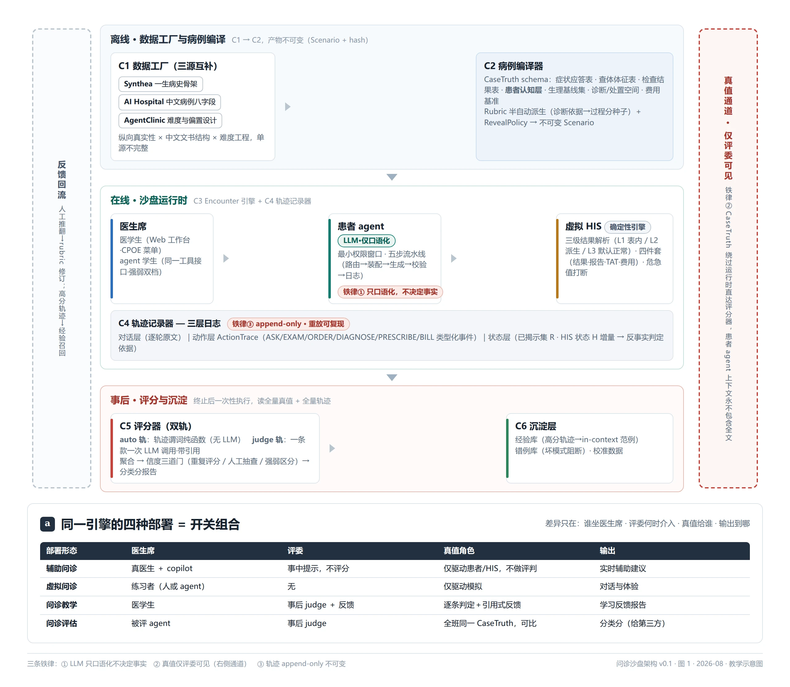
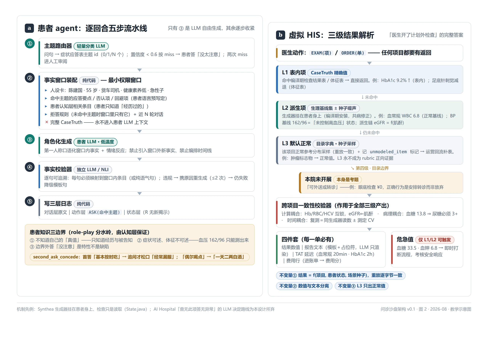
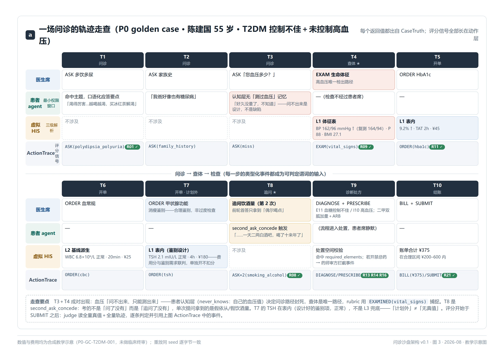
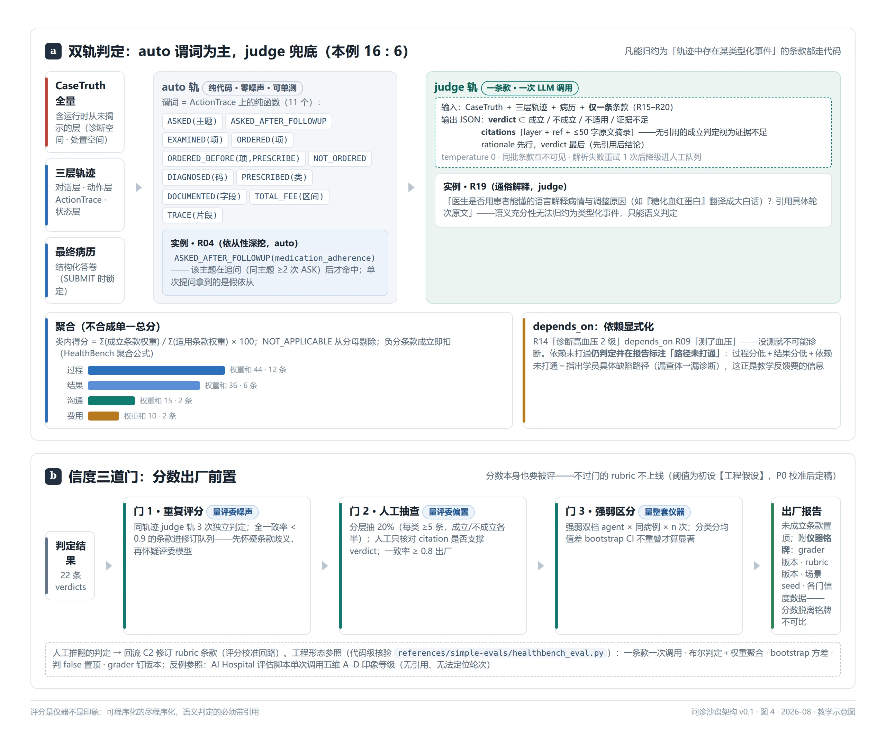

# 问诊沙盘架构设计 v0.1

**一句话**：一个引擎，四种部署（辅助问诊 / 虚拟问诊 / 问诊教学 / 问诊评估）。本文给出可直接开工的实现架构：组件切分、每组件的参考依据、以及完整的数据来源矩阵。

**与已有资产的关系**：
- 领域模型沿用 `references/DSH-AGUI-demo/docs/research/` 的 ClinMesh 研究（CaseTruth / Evidence Definition / Reveal Policy / 不可变 Scenario / ActionTrace，FHIR R5）——本文不重复其论证，只做实现切分。
- 教学直觉见 `docs/lessons/teaching-wedge-pipeline/`（五仓管线图解）；开发者侧医院系统教学见 `docs/platform/Hospital_Agent_Academy_v0.2/`（其 Golden Patient / Simulation Truth / Hidden Verifier 词汇与本设计同构）。
- 论文引用均指向 `docs/papers/INDEX.md` 已登记条目。

**证据等级标注**：【已验证】本地克隆核验过；【论文结论】论文声称、未本地复现；【工程假设】本设计的推断，待实验；【待核验】来源未确认。

---

## 1. 场景形式化

整个场景是一个**回合制受限信息博弈**，实现前先把规则说死：

```
状态   W = (T, R, H)
         T = CaseTruth（编译期固定的完整隐藏真值）
         R = 已揭示证据集（随对话增长）
         H = HIS 域状态（医嘱、费用、文书状态机）

回合   医生席发出动作 a ∈ { ASK, EXAM, ORDER, DIAGNOSE, PRESCRIBE, DOCUMENT, BILL, SUBMIT }
转移   δ(W, a)：
         ASK    → 患者agent 口语化 R 中已授权主题的事实（不产生新事实）
         EXAM   → 引擎按 T 确定性返回体征，进入 R
         ORDER  → 引擎按 T 返回检验/检查报告（含延迟、费用、危急值），进入 R
         其余    → 记录决策，推进 H
终止   医生 SUBMIT 最终病历（结构化答卷）

产出   ActionTrace（三层日志）+ 最终病历
评分   J(Trace, 病历, Rubric, T) → 逐条判定 + 证据引用 → 分类分 + 反馈
```

三条铁律（全部来自前序研究，违反任何一条考核作废）：

1. **LLM 只口语化，不决定事实**：患者 agent 的每句话必须能追溯到一个已授权揭示的真值条目；未授权主题的应答是「不知道 / 没注意 / 回避」。
2. **真值仅评委可见**：T 永不进入对话运行时的患者 agent 上下文（防泄露设计见 §4.3）。
3. **轨迹不可变**：append-only，重放可复现。

---

## 2. 总体架构



> **图 1**（教学示意图，机制以上下文为准）：离线（C1 数据工厂 → C2 病例编译）/ 在线（C3 沙盘运行时 + C4 轨迹记录）/ 事后（C5 评分 + C6 沉淀）三段流水线。右侧红色虚线通道是全图的枢纽——**真值通道**：CaseTruth 从编译器直达评分器、绕过运行时，患者 agent 上下文永不包含全文（铁律②）。左侧灰线是两条反馈回流（人工推翻 → rubric 修订；高分轨迹 → 经验召回）。面板 a 为四部署开关矩阵：同一引擎，差异只在医生席 / 评委时机 / 真值角色 / 输出。

四种部署 = 同一引擎的开关组合（详论见 lessons 文档），本文其余部分按 C1–C6 展开。

---

## 3. C1 数据工厂

### 3.1 三源策略

| 源 | 角色 | 事实依据 | 许可 |
|---|---|---|---|
| **Synthea**（`references/synthea`，commit d9d07a6） | 患者一生病史骨架：共病组合、病程时间线、就诊频率的真实分布 | 【已验证】输出 FHIR R4 Bundle + CSV；官方无中国人口包（`names.yml` 仅 EN/ES） | Apache-2.0 |
| **AI Hospital**（`references/AI_Hospital`，commit 870fc38） | 中文病例正文与结构：主诉/现病史/既往史/查体/辅助检查/初步诊断/**诊断依据/鉴别诊断**/诊治经过 | 【已验证】`src/data/patients.json` 506 例，八字段完整率 506/506/506/506/503/506/506/506；其中糖尿病相关 36 例 | 代码 MIT；**数据抓取自爱爱医病例中心用户发布病例，再分发权【待核验】——仅限本地使用，不得复制入本仓库** |
| **AgentClinic**（`references/AgentClinic`，commit b6570ed） | 难度分层与偏置注入设计（24 种认知偏置：锚定、确认偏误、可得性等） | 【已验证】仓库含 patient agent + 难度参数实现 | MIT |

**为什么需要三个源**：Synthea 给「这个人像不像真的病人」（纵向真实性），但输出是英文代码化数据、无中文病历语言；AI Hospital 给「这场问诊像不像中国的问诊」（语言与文书结构真实性），但每例只是一次住院快照，无病史纵深；AgentClinic 给「这个病例能不能考出差别」（难度工程）。三者互补，单源都不完整。

### 3.2 三源数据实例（2026-08-26 本地克隆实测）

#### 3.2.1 Synthea：疾病模块是状态机规则，我们要的是它的产物

Synthea 的输入侧是**疾病模块**（JSON 状态机），输出侧是患者一生病历（FHIR R4 / CSV）。糖尿病在本 commit **没有独立的 `diabetes.json`**（旧版教程常见该路径），它合并在 `modules/metabolic_syndrome_care.json`（"Metabolic Syndrome Standards of Care"，39 个状态）中。真实状态机片段（`Check_Diabetes`，保健就诊中「是否给这个患者查糖化」的分支），以下为**中译对照版**（原文为英文 JSON，语义等价转写，键名保留英文以便对照源码；机器可读原文见 `references/synthea`）：

```json
{ "类型": "Simple（简单状态）",
  "条件转移（conditional_transition）": [
    { "条件": { "条件类型": "Or（任一满足）", "子条件": [
        { "条件类型": "Attribute（患者属性）", "属性": "diabetes（已患糖尿病）",    "运算": "is not nil（已赋值）" },
        { "条件类型": "Attribute（患者属性）", "属性": "prediabetes（糖尿病前期）", "运算": "is not nil（已赋值）" }]},
      "转移到": "Record_HA1C（记录糖化血红蛋白观察）" },
    { "转移到": "End_Wellness_Encounter（结束本次保健就诊）" }]}
```

读法：保健就诊走到这个状态时，引擎检查患者属性——只要「糖尿病」或「糖尿病前期」任一已赋值，就走 `Record_HA1C` 分支（生成一次 HbA1c 检查观察），否则直接结束就诊。**注意这里没有「血糖值是多少」的判断**——值不来自规则，来自患者身上挂着的生理生成器（详见 §4.3.2）。

糖尿病相关状态链：`Check_Diabetes → Diagnose_Prediabetes / Diagnose_Diabetes → Diabetic_CarePlan → Living_With_Diabetes`（另有视网膜病变、肾病、截肢等并发症子模块在 `metabolic_syndrome/` 下）。

**我们消费的是产物不是模块**：运行 Synthea 得到的是带真实时间线的 `Patient / Encounter / Condition / Observation / MedicationRequest` FHIR R4 资源序列——共病组合、确诊年龄、用药史都由模块+种子概率生成。

**→ CaseTruth 映射**：产物资源序列 → `患者身份与既往病史时间线` 字段；模块的发病概率分布 → P1 批量生成时的病种配比。模块本身不进沙盘。

#### 3.2.2 AI Hospital：一例真实结构的中文病例（含 rubric 种子）

`patients.json` 每例 = 一个 JSON 对象，`raw_medical_record` 下八字段齐全。实测抽出的糖尿病病例（`继发性癫痫，脑外伤后遗症，2型糖尿病` 组，本例为 6 岁患儿 I 型糖尿病+酮症酸中毒——正好是「急症+危急值」类病例的样板）：

> **主诉**：患儿因发热五天，精神差三天入院
> **现病史**（节选）：一周前出现多饮、多尿，家长未予重视，五天前无明显诱因下出现发热……门诊查尿常规示 GLU4+ mmol/L, KET3+ mmol/L……近10天体重减轻2.5kg
> **查体**（节选）：神志稍淡漠，精神反应差，**深大呼吸**，面色无苍白，全身皮肤干燥，弹性差……口唇干燥
> **辅助检查**（节选）：尿常规 GLU4+、KET3+；血常规 WBC 10.67×10⁹/L，NEUT 95.0%；微量血糖 17.1 mmol/L
> **初步诊断**：1.糖尿病合并酮症酸中毒 2.急性上呼吸道感染
> **诊断依据**：1.多饮多尿一周+尿糖酮体强阳性+微量血糖 17.1 明显高于正常，故诊断糖尿病；2.近三日嗜睡精神差、体重下降，深大呼吸、皮肤口唇干燥，结合尿常规与血糖，考虑酮症酸中毒可能，待血气分析、电解质助诊
> **鉴别诊断**：1.高血糖高渗状态（多无酸中毒表现、血糖多高于33.3、尿酮体阴性——本例不支持）；2.败血症（发热精神差，待血培养排）

注意加粗字段：**「诊断依据」和「鉴别诊断」就是过程分 rubric 的直接种子**——每条依据改写成判定谓词（「问诊覆盖多饮/多尿」→查轨迹层 ASK 事件；「深大呼吸」→查体层 EXAM 事件），每条鉴别就是干扰主题（患者 agent 的应答表里放「无深大呼吸」与否）。

**数据质量问题（实测发现，编译必须清洗）**：① OCR 型错别字（「子」应为「予」、「思儿」应为「患儿」、「木院」应为「本院」）；② 字段内有复制粘贴重复段落（本例辅助检查段重复两遍）；③ 题目与内容偶有错位。这正是「<1 人时/例」编译预算里人工清洗占大头的原因。**此类原文仅限本地，不复制入本仓库**。

#### 3.2.3 AgentClinic：场景生成管线 + 偏置注入的两个可借鉴机制

**机制一：LLM 批量生成 OSCE 场景的管线**（`generate_cases/gen_medqa_tutorial.py`、`gen_mimic_tutorial.py`）：从 MedQA 题库（`bigbio/med_qa`）/ MIMIC 病历取材 → GPT 改写 → 结构化 `OSCE_Examination` JSON。其模板结构（节选，**中译对照版**——原文为英文 JSON，语义等价转写，键名保留英文以便对照源码）：

```json
{ "OSCE_考试": {
    "医生任务（Objective_for_Doctor）": "评估并诊断这名以急性腹痛就诊的患者。",
    "患者扮演（Patient_Actor）": {
        "人口学（Demographics）": "30 岁女性",
        "病史（History）": "突发锐痛，右下腹……",
        "症状（Symptoms）": { "主要症状": "右下腹锐痛",
                              "伴随症状": ["恶心", "无呕吐", ……] },
        "既往史（Past_Medical_History）": "……", "社会史（Social_History）": "……",
        "系统回顾（Review_of_Systems）": "否认发热、呕吐、腹泻、尿痛……" },
    "查体所见（Physical_Examination_Findings）": {
        "生命体征（Vital_Signs）": {……},
        "腹部查体": { "触诊（Palpation）": "右下腹压痛，Rovsing 征阳性……" } },
    "检查结果（Test_Results）": { "血常规": { "白细胞（WBC）": "12,000/μL（升高）" }, …… } } }
```

读法：这张「考卷」把**任务、患者剧本、查体所见、检查结果**一次性全部预写死——注意 `Test_Results` 键下连「WBC 12,000（升高）」的判读注释都写好了，开单即全给。

与 CaseTruth schema 的差异：它没有揭示规则（所有查体/检验结果一次性给全）、没有费用与延迟、没有诊断空间的结构化表达——这三处正是我们的增量。**许警示**：其 MIMIC 管线产物受 PhysioNet DUA 约束**不可再分发**；MedQA 题库为研究用途许可。借鉴模板结构，不搬运其生成数据。

**机制二：偏置注入 = 患者侧 11 种 + 医生侧 12 种的 system prompt 注入**（`agentclinic.py` `PatientAgent.generate_bias()` / `DoctorAgent`，论文口径 24 种含组合）。真实注入文本例（`self_diagnosis`，自我诊断偏置；原文英文，译文如下）：

> 「你最近在网上仔细研究过自己的症状，并得出结论：你应该被诊断为癌症。尽管医生可能不这么认为，你仍然坚信自己得了癌症。」

**→ CaseTruth 映射**：偏置不是 prompt 技巧而是**病例设计参数**——`self_diagnosis` 实现为症状应答表中的「患者坚信项」（问什么都往某诊断上引），`gender/race` 类不信任偏置实现为人设回避项。难度分层 = 干扰主题数量 × 应答表否认项比例 × 时间状态项复杂度，P1 的难度编译器据此参数化。

### 3.3 关键工程边界（已在 ClinMesh 研究核验，此处只列结论）

- **Synthea 复现合同**：commit + 人口/临床种子 + 虚拟时间锚点 + 结束时间 + 配置 + 模块集 + 时区。仅种子不可复现。
- **FHIR R4 → R5**：Synthea 原生 R4（`FhirContext.forR4()`），接入层必须转版本、重建引用、过 profile 校验。
- **中国本地化自建件**：中文姓名/身份证形态词表、七普人口分布校准（国家统计局公开汇总表，只校准不反推个人）、科室树、本院药品目录（全合成）。
- **医保编码（NHSA）**：快照可查询、无结构化批量下载合同、无再分发许可 → 受控离线 `nhsa-reference` adapter，仓库只存 schema + 来源 manifest + 哈希，不存数据行。
- **来源处置等级**：四等（可用/受控离线/仅参考/禁止进入），见 DSH demo `synthetic-hospital-data-sources.md` §来源处置等级。

---

## 4. C2 病例编译器 + C3 沙盘运行时

### 4.1 CaseTruth schema（P0 字段清单）

一个 Scenario 编译产物包含：

```
CaseTruth（评委与引擎私有，患者 agent 不可见全文）
├─ 患者身份与既往病史时间线        ← Synthea 骨架 / AI Hospital 既往史
├─ 本次就诊病情展开
│   ├─ 主诉与开场白
│   ├─ 症状应答表：可问主题 → 应答要点 | 否认项 | 回避项（未列入主题的问题答"没注意"）
│   ├─ 查体体征表：查体项 → 发现（含阴性）
│   ├─ 检查结果表：可开单项 → 结果值 + 报告文本 + 出报告延迟 + 费用 + 危急值标记
│   └─ 时间状态项：随问诊时长演进的表现（如症状加重）
├─ 患者认知层（患者脑中的内容——区别于客观真值，患者 agent 的唯一事实来源）
│   ├─ 自觉症状记忆（时间线，患者自己的语言）
│   ├─ 被告知过的诊断（仅既往就医时医生说过的才算「患者知道」）
│   ├─ 用药记忆（药名可能记错、依从性可设定）
│   ├─ 生活方式与可隐瞒项（实际饮酒/吸烟 vs 愿意承认的量）
│   ├─ 健康素养设定（决定用语水平：说「血糖高」不说「HbA1c 9.2%」）
│   └─ 就医记忆（做过哪些检查、报告在哪——决定「上次的报告」是否存在）
├─ 生理基线集（编译期为患者预生成：血压/心率/BMI/体温等生命体征基线 +
│   血常规/肝肾功能等常规检验基线，含「高血压控制/未控制」等状态标记）
├─ 诊断空间：主诊断 + 合理鉴别排序 + 设计陷阱
├─ 处置空间：可接受处方/治疗 + 禁忌（与真实药理冲突的项）
└─ 费用基准：合理检查路径的参考费用区间

RevealPolicy：主题级与单项级的揭示时机
  初始 / 问诊后(按主题) / 查体后 / 请求后 / 时间状态后 / 仅evaluator可见

Rubric：过程分条款（从"诊断依据"字段派生）
      + 结果分条款（从"诊断空间""处置空间"派生）
      + 沟通分条款（AMIE 轴体系裁剪）
      + 费用分条款（从"费用基准"派生，捕捉过度检查）
每条：判定谓词 + 类别 + 权重 +（编译期）人工终审标记
```

**rubric 半自动派生**是规模化关键：AI Hospital 每例自带「诊断依据」（4-6 条结构化依据）和「鉴别诊断」（2-3 个鉴别 + 排除依据）——这两个字段就是过程分条款的直接种子，人工只需终审与改写为可判定谓词。【工程假设】编译器把 1 例病例编译为 Scenario 的成本可压到 < 1 人时，P1 验证。

#### 4.1.1 实例透视：schema 写满一行是什么样（P0 golden case 节选）

上面的树是骨架；写满一行的实例才暴露真设计。以下节选自 `p0-golden-case/case-t2dm-casetruth.json`（陈建国，55 岁货车司机，T2DM 5 年控制不佳＋未控制高血压；完整文件含 14 个问诊主题、6 项查体、10 项检查）：

```json
{ "patient": {
    "identity": { "name": "陈建国", "age": 55, "occupation": "长途货车司机" },
    "persona_card": { "health_literacy": "低。认为「是药三分毒」，血糖高「不痛不痒就没大事」" } },
  "patient_knowledge": {                                    // ← 患者认知层：患者 agent 的唯一事实来源
    "never_knows": ["自己的血压值（从未测量）", "任何血糖数值细节",
                    "糖化血红蛋白概念", "「周围神经病变」这个词"],
    "lifestyle": { "alcohol": { "actual": "白酒约每日2两，十余年",
                                "admitted_on_first_ask": "应酬时候喝点",
                                "concede_on_second_ask": true } } },
  "symptom_response_table": { "foot_numbness": {
    "passive": true,                                        // ← 患者绝不主动提，问了才说
    "response_points": ["脚底板是有点发木，像穿了双厚袜子，得有大半年了"],
    "_design_note": "核心考点①：患者不认为这是病" } },
  "exam_findings": { "vital_signs": {
    "finding": "T 36.5℃，P 88 次/分，BP 162/96 mmHg（休息5分钟后复测 164/94）",
    "_design_note": "核心考点②：患者从未测过血压，问诊问不出，必须查体" } },
  "test_order_table": {
    "hba1c":           { "result": { "value": 9.2, "flag": "H" }, "tat_minutes": 120, "fee_cny": 45 },
    "fundus_screening":{ "result": { "flag": "目录边界" }, "fee_cny": 0 },   // ← 考题：本院未开展→转诊
    "ogtt":            { "result": { "flag": "无指征提示" } } },             // ← 考题：已确诊开 OGTT＝过度检查
  "reveal_policy": { "overrides": [
    { "item": "smoking_alcohol 实际饮酒量", "policy": "第二次追问后揭示（second_ask_concede）" } ] } }
```

四个读法（也是写实例逼出的四个决策，详见 `p0-golden-case/README.md`）：

1. **`never_knows` 是「问不出来」的机制根源**——「血压问不出来」不是 prompt 叮嘱，是认知层字段里根本没有这个值。医生问「你血压多少」必然得到「没量过，不知道」，唯一检出路径被设计成查体（呼应 rubric R09）。
2. **考题直接长在结果表的 `flag` 里**——`目录边界` 与 `无指征提示` 都是表内行，不需要额外机制。
3. **`second_ask_concede` 是应答表一等公民**——首答与实情分离存放，reveal_policy 有对应 override，rubric 用 `ASKED_AFTER_FOLLOWUP` 谓词考「追问了没有」。
4. **`passive: true` 的主题就是主动筛查考点**——`foot_numbness` 不问不说，考的就是「主动问没问」。

### 4.2 患者 agent：逐回合合同（最小权限窗口的实现）

业界两种实现：

| 方案 | 做法 | 出处 | 风险 |
|---|---|---|---|
| 全知约束式 | 上下文含完整 CaseTruth，靠 prompt 禁止泄露 | AMIE / AgentClinic 患者agent | 诱导性提问可绕过约束；泄露率不可控 |
| **最小权限窗口（本设计默认）** | 每轮只注入本轮应答所需的事实子集 | ClinMesh 模型 | 上下文外的问题答不了——但这正是想要的 |

最小权限窗口的完整回合流水线（每轮五步，只有第 3 步是 LLM 自由生成）：

```
医生话语进入
  ① 主题路由器（轻量分类 LLM）：本轮问句 → 匹配症状应答表的主题 id
     （可命中 0/1/N 个主题；置信度低于阈值按 0 个处理）
  ② 事实窗口装配（纯代码，非 LLM）：
       人设卡（姓名年龄职业性格健康素养）
     + 命中主题的应答要点/否认项/回避项
     + 患者认知层相关条目
     + 拒答规则（未命中主题时窗口里只有拒答规则）
     + 对话史（近 N 轮原文）
  ③ 角色化生成（患者 LLM，低温度）：第一人称口语化窗口内事实，
     只准陈述窗口内容 + 情绪反应，不准引入新事实
  ④ 事实校验器（独立 LLM 或 NLI 模型）：逐句做可追溯性检查——
     每句话必须能映射到窗口内某条目（或纯语气/情绪句）；
     违规 → 携违规原因重生成（最多 2 次）→ 仍失败则降级为模板句
  ⑤ 写三层日志：对话层原文 + 动作层 ASK(命中主题) + 状态层（无新揭示）
```

**患者知识的三个边界**（role-play 好坏的分水岭，全部由 CaseTruth 的患者认知层保证）：

1. **患者不知道自己的「真值」**。他只知道经历过的症状和被告知过的诊断。5 年前确诊 T2DM 的患者知道「我有糖尿病」；没确诊过的患者只知道自己「最近老渴」——绝不能说出「我是 2 型糖尿病」。患者认知层里没有的信息，就是患者的盲区。
2. **症状可述，体征不可述**。多饮多尿（主观感受）问诊可得；血压 162/96（客观体征）只能测出来——患者被问「你血压多少」时，若认知层无「近期测过」记忆，标准应答是「好久没量了，不知道」。检验值同理：没做过 HbA1c 的患者说不出 9.2%。**这条边界正是 rubric 的考点**：「该测血压没测、只靠问」是可检出的失败模式。
3. **认知边界外答「没注意」是特性不是缺陷**。真实患者对绝大多数系统回顾问题的回答就是「没有/没注意」。拒答矩阵：身体感受类未覆盖 → 「没太注意」；医学判断类 → 「这个我不懂，您说」；涉及隐瞒设定 → 按设定回避（「酒？偶尔一点点」）。

**一个追问回合的解剖**（second_ask_concede 全链路，golden case 实例）。CaseTruth 应答表里的设定：

```json
"smoking_alcohol": {
  "response_points": ["烟抽了二十来年，一天小半包"],
  "avoids": [
    { "question_pattern": "初次询问饮酒",                "response": "就应酬时候喝点，不多" },
    { "question_pattern": "追问具体频率/量（每天喝吗/喝多少）", "response": "……一天二两白酒吧，喝了十来年了，哎呀这个也要管啊？" } ] }
```

五步流水线怎么消费它：**第 1 轮** 医生问「平时喝酒吗」→ ①路由命中 `smoking_alcohol` → ②窗口装配只放入 `avoids[0]`（首答版本）与吸烟要点 → ③患者 LLM 口语化 → 「就应酬时候喝点，不多」→ ⑤动作层记 `ASK(smoking_alcohol)`。**第 2 轮** 医生追问「每天都喝吗？喝多少」→ ②装配时命中 `question_pattern: 追问具体频率/量`，这次放入 `avoids[1]` → 「……一天二两白酒吧」。动作层记第二条 `ASK(smoking_alcohol)`，于是 `ASKED_AFTER_FOLLOWUP(smoking_alcohol)` 为真，rubric R08 命中。**考点不在「问了没有」而在「追问了没有」**——单次提问拿到的是设计好的假话。

一致性保障：发病时间、症状顺序等时序事实由应答要点直接供给（要点本身就写成患者语言的时间线），LLM 无需也不允许自行编排时间。防泄露：患者 LLM 的上下文**永不包含完整 CaseTruth**，泄露在机制上被阻止；【工程假设】全知式 vs 窗口式的对话质量差 < 泄露率差，P3 对照实验量化。

### 4.3 虚拟 HIS：三级结果解析——「医生开了计划外检查」的答案

查体/开单走确定性引擎。关键问题：医生不可能只开编译时想到的检查，**任何**项目都要有返回。解法是三级解析 + 一条目录边界出口：**L1 表内项**（命中编译期体征表/检查结果表 → CaseTruth 精确值）→ 未命中则 **L2 派生项**（生理基线集 ± 场景种子噪声，带共病修正）→ 仍未命中则 **L3 默认正常**（该项目正常参考分布的种子采样）＋ 未建模标记回流；第四级**目录边界**（本院未开展 → 转诊/外送，本身是考题）。



> **图 2**（教学示意图，机制以上下文为准）：面板 a 是 §4.2 患者席的五步流水线——只有第 ③ 步是 LLM 自由生成，最小权限窗口里**永远没有完整 CaseTruth**（红叉行）；面板 b 是本节的虚拟 HIS——三级解析漏斗后接**跨项目一致性校验器**与**四件套**（结果 · 报告 · TAT · 费用），危急值仅可由 L1/L2 触发。底部不变量：结果 = f(项目, 患者状态, 场景种子)，重放逐字节一致。

三条设计不变量：

1. **结果 = f(项目 ID, 患者生理状态, 场景种子)，完全确定性**。L3 的「随机采样」也用场景种子——同一 Scenario Run 重放结果逐字节一致。LLM 全程不发明数值。
2. **数值与文本分离**。结果数值由三级解析产出；报告文本由模板 + LLM 润色，数值以占位符注入（「糖化血红蛋白 {value}%，高于参考区间」）——渲染不决定。
3. **每一单都有四件套**：结果 + 报告文本 + **TAT 延迟**（血常规 20 分钟、HbA1c 2 小时、基因检测 3 天）+ **费用行**（本院价目表）。延迟使「边等结果边继续问诊」的调度可评分；费用进账单，结账后进 rubric 费用分。结果触界自动判危急值（如血糖 33.5 mmol/L、血钾 6.8）→ 即时打断流程，考核安全响应。

#### 4.3.1 参考怎么做：三家恰好构成一条谱系（2026-08-26 本地克隆核验）

「计划外检查怎么出结果」不是我们独有的问题，三家参考都正面遇到了：

| 参考 | 机制 | 核验位置 | 证据等级 |
|---|---|---|---|
| AgentClinic | **遇不到**：检查结果在病例生成期全部预写（`Test_Results.Blood_Tests / Imaging / Electromyography`），开单即全给；结果判定=对照预写的 `Correct_Diagnosis`，完全程序化 | `references/AgentClinic/agentclinic_medqa.jsonl` | 已验证——等于只有 L1，没有「计划外」问题 |
| AI Hospital | 检查员 LLM 持病历「查体/辅助检查」原文，命中则复述；**prompt 明示：查不到的检查项目回复「xxx: 无异常」** | `src/agents/reporter.py`（temperature 0） | 已验证——无真值项 = LLM 被指示答「无异常」 |
| Synthea | **值不现编**：生理量挂在患者身上——疾病模块用 `Set_BP_Not_Controlled` 这类状态安装/切换生成器（`State.java:1896` 安装 ConstantValueGenerator 或 RandomValueGenerator(range/distribution)）；每次就诊 `Record_BP` 只是**读取**当时的 `person.getVitalSign(name, time)`（`State.java:2050`） | `references/synthea` 源码 | 已验证 |

两条结论拼出我们的立场：

- AI Hospital 的「表外默认无异常」作为**产品决策**是合理的（真实门诊多数筛查确实阴性，由队列流行率决定）；错在把**决定权**交给 LLM——数值无来源、不可复算，「无异常」与表内真值混在同一生成流里无法审计，也没有「系统知道自己缺什么」的回路。
- Synthea 给出正确**形态**：采样可以，但采样器是显式数据结构（分布+参数+种子）；值挂在患者状态上，检查只是读取。

我们采用 AI Hospital 的「表外默认正常」策略，用 Synthea 的确定性生成器机制实现。

#### 4.3.2 我们的构造：生成器挂在患者身上，检查只是读取

编译期为每个病例生成「生理基线集」——每项生理量一个**显式生成器**（示意）：

```json
"physiology_baselines": {
  "systolic_bp":   { "kind": "normal", "mu": 163, "sigma": 5, "source": "comorbidity:hypertension_uncontrolled" },
  "creatinine":    { "kind": "constant", "value": 74 },
  "random_glucose":{ "kind": "trajectory", "target": 13.5, "walk_step": 0.8 },
  "hemoglobin":    { "kind": "normal", "mu": 148, "sigma": 4, "assay_cv": 0.02 }
}
```

由此把 L2/L3 从口号落成机制：

1. **L2 派生项 = 基线集命中**。共病修正在**编译期**完成（未控制高血压 → SBP 生成器整体平移到 155–170——这正是 Synthea 疾病状态机切换生成器的模式，而不是给检查结果临时加偏移）。派生链显式声明：部分项目是其他项目的函数（eGFR = f(肌酐, 年龄, 性别)；LDL = TC − HDL − TG/5【教学示意公式】），CaseTruth 只写锚点值，其余算出。**计划外但生理耦合的项目必须派生、不能独立采样**——肌酐 180 配 eGFR 90 是一眼假。P0 实例即此形态：`physiology_baselines.vitals.bp_baseline = "162/96（未控制高血压状态）"`，医生开表外常规检验（如血常规）按 `routine_labs` 基线 ± 种子噪声返回（见 `p0-golden-case/case-t2dm-casetruth.json`）。
2. **L3 默认正常 = 检验目录字典命中**。字典每项带：类型（数值/分类/描述）、年龄性别分层参考区间、分布形状、测定 CV、TAT、价目。数值项从该项正常分布做**种子采样**（truncated normal 居中参考区间，σ 取区间半宽/2），同 Scenario Run 重放逐字节一致。参考区间来源采用中国卫生行业标准 WS/T 系列（如血细胞分析参考区间）【待核验：具体适用条目清单】。
3. **跨项目一致性校验器**（L3 最易翻车处）。任何一级的产出落报告前过一遍全项目不变式，三类耦合：**计算耦合**（Hb/RBC/HCT/MCV 互锁）；**病理耦合**（血糖 13.8 → 尿糖不能阴性——这条规则横跨 L1/L3，所以校验器作用于**全部三级产出**，不只 L3）；**时间耦合**（同一 run 内复测 = 同生成器读数 ± 测定 CV 噪声，不是重新独立采样；Synthea labile 的随机游走即此语义）。不变式冲突 → 拒绝出报告 + 进运营回流。
4. **描述类检查**（心电图/影像/病理）不走数值分布：L3 = 受控片段库的模板组装（「窦性心律，未见明显异常」类正常模板 + 结构化拼装）。P0 只出报告文字不出图像——真实工作流本来就是医生读报告。
5. **评分面约束（与 C5 的合同）**：L3 产出**永远不能成为 rubric 的正向证据源**（负向条款 NOT_ORDERED、费用分除外）。含义：病例里没有的病，任何检查都查不出异常。这条防的是评分系统奖励幻觉——若 L3 能随机出异常，学员会学会「开大套餐碰运气」。
6. **未建模回流**：L3 命中即记 `unmodeled_item` 事件（与「目录边界」事件区分）→ 聚合报表 → 补目录字典/CaseTruth 后场景升版。AI Hospital 的「无异常」没有这个回路，系统永远不知道自己缺什么。

危急值由此获得一个设计保证：L3 采样域=正常区间，**危急值只可能来自 L1/L2**（编译期有病理的项）——安全响应考核不会被随机性误触发。

**目录边界**（第四级，罕见但真实）：本院未开展的项目（如基层医院开 PET-CT）→ 返回「本院未开展，可外送或转诊」——本身考核医生换项能力，不是系统缺陷。

医嘱生命周期、签署、结账复用 DSH-AGUI-demo 已有 Encounter 状态机（病历草稿/检查/处方/签署生命周期与安全边界——**医生工作台的壳是现成的**）。

### 4.4 一个回合的完整时序（血糖与血压的走查）

场景即 P0 golden case：陈建国，55 岁，T2DM 5 年（二甲双胍，依从性差），共病未控制高血压（患者不知情），主诉「口渴加重两个月，人瘦了」。



> **图 3**（教学示意图，数值均为 CaseTruth 合成教学值）：四条泳道分别是医生席、患者 agent、虚拟 HIS、ActionTrace。三个红色/琥珀色高亮是本例的三个核心机制时刻——T3+T4 成对（血压问不出来、只能测出来）、T8（second_ask_concede 追问才松口）、T7（计划外 ≠ 无真值：TSH 是表内鉴别设计项）。底部 Trace 泳道的 `R ✓` 徽标显示：**评分信号在问诊发生的同时就已长在动作层**，judge 事后只读轨迹与真值。

逐回合要点（图中信息的事件流版本）：

- **T1–T3 问诊**：多饮多尿命中应答表；家族史命中；「你血压多少」因认知层 `never_knows` 拒答——「好久没量了，不知道」。
- **T4 查体（★核心考点）**：EXAM 生命体征 → L1 体征表 → BP 162/96 mmHg（复测 164/94）。高血压唯一检出路径，`EXAMINED(vital_signs)` → R09。
- **T5–T7 开单**：HbA1c 表内 9.2% ↑（TAT 2h、¥45）→ R11；血常规 L2 基线派生（WBC 6.8，20min、¥25）；**甲状腺功能是计划外开单但不是无真值**——TSH 2.1 在表内（消瘦鉴别设计项），¥180 照收。
- **T8 追问（★）**：第二次问饮酒 → `avoids[1]` 揭示 →「一天二两白酒」→ `ASKED_AFTER_FOLLOWUP` → R08。
- **T9 诊断处方**：E11＋I10，二甲双胍加量＋ARB；处置空间校验，若开禁忌药 → 药师审方拦截事件。
- **T10 结账**：¥375（合理区间 ¥200–600 内）＋ SUBMIT 锁定最终病历，评分开始。

注意 T7 的微妙处：消瘦待查鉴别里**甲亢是合理鉴别**，所以「甲状腺功能算不算过度检查」不能孤立判定——费用分条款必须与诊断空间联判（若 rubric 要求甲亢鉴别则该单合理；不要求则记过度检查）。这就是 rubric 编译必须医学终审、不能纯自动的原因。

### 4.5 医生席

- **人（学生）**：Web 工作台（复用 DSH-AGUI-demo，CopilotKit/AG-UI）。动作经结构化菜单（CPOE 式开单、查体项勾选），天然解决动作类型化。
- **agent 学生**：同一工具接口的 LLM agent——与人类共用动作空间是评分可比的前提。强弱双档（模型档位/prompt 档位）作为评分系统的标定器。

---

## 5. C4 轨迹记录器：三层日志

| 层 | 记什么 | 消费者 |
|---|---|---|
| 对话层 | 逐轮原文（谁、何时、说了什么） | 沟通分、人工回看 |
| 动作层 ActionTrace | 类型化事件 `ASK(主题)/EXAM(项)/ORDER(单)/DIAGNOSE(码)/PRESCRIBE(药)/BILL` | rubric 谓词绑定、重放 |
| 状态层 | 每事件后的 (已揭示集 R, HIS 状态 H) 增量 | **反事实判定**（评委证明"该问的可问且答案不利"的唯一依据） |

存储：append-only 事件流（event sourcing），Scenario Run 维度聚合；FHIR R5 资源 + AuditEvent 表达，保留来源指针（CONTEXT.md 的 Source Trace 原则）。

---

## 6. C5 评分器

### 6.1 输入合同与判定机制

```
Judge 输入 = CaseTruth + 完整三层轨迹（含学生从未见过的部分）+ 最终病历 + rubric 条款
Judge 输出 = 每条：verdict(成立/不成立/不适用) + evidence citation(轮次/动作/真值字段)
```

**为什么 LLM 评委在此可靠**：条款是原子谓词不是整体印象——HealthBench 的核心方法（48,562 条 rubric 分解，`references/simple-evals`）。**为什么强制引用**：人工抽查从「重放整场对话」降为「核对一个引用」，20% 抽查 ≥0.8 在经济上才成立。

三类分**必须分列不汇总**（过程/结果/沟通+费用），因为过程与结果是两条独立失败通道，总分会平均掉错位诊断信号（过程高分结果低分 = 综合推理弱；过程低分结果高分 = 运气）。诊断参考：AI Hospital 的 MVME 评分脚本（诊断准确性向）、AMIE 轴体系（专家 32 轴 + 患者演员 26 轴，本设计裁剪为沟通分轴）、AutoMedBench（过程分设计）。

### 6.2 评分器的具体构造（双轨工程形态，参考对照）

评分器是两台机器：**auto 轨是纯代码谓词，judge 轨是「一条款一次调用」的 LLM 判定**。条款级合同见 `p0-golden-case/case-t2dm-rubric.json`（judge_io_contract），这里定义机器本身。



> **图 4**（教学示意图，机制以上下文为准）：面板 a 是双轨判定——左列输入（全量真值＋三层轨迹＋最终病历），中间两轨（auto 谓词纯函数 / judge 一条款一次调用带引用），下方聚合（四类分列、权重构成）与 depends_on 依赖显式化；面板 b 是信度三道门（重复评分量噪声 / 人工抽查量偏置 / 强弱区分量整套仪器）→ 出厂报告附仪器铭牌，人工推翻回流 rubric 修订。

**auto 轨（本例 16/22 条）**：谓词 = ActionTrace 上的纯函数（`ASKED(主题集合)`、`ORDERED_BEFORE(项目, 事件类)` 等 11 个函数见 rubric JSON），无 LLM、无随机、可单测——「凡是能归约为『轨迹中存在某类型化事件』的条款都走代码」的直接收益：零成本零噪声，且 CPOE 菜单颗粒度越细，auto 比例越高（p0 README 决策 1）。

**judge 轨（本例 6/22 条）**逐项对照参考（核验位置：`references/simple-evals/healthbench_eval.py`，2026-08-26 代码级核验）：

| 设计点 | HealthBench 的做法（代码级） | 我们采用/改造 |
|---|---|---|
| 调用粒度 | 每条 rubric **独立一次** grader 调用（`grade_rubric_item` 循环，L407-430），不是一份 prompt 评全部 | 采纳。天然实现「同批条款互不可见」（防级联偏置），单条失败单独重试，可并行 |
| 判定输出 | 最小结构 `{criteria_met: boolean, explanation}`——**不打 1-5 分** | 采纳布尔制，扩两个枚举：NOT_APPLICABLE（场景未触发，如 R20 患者未催促）、INSUFFICIENT_EVIDENCE（HealthBench 无此情形）；explanation 升级为**结构化 citations**——我们的输入是三层轨迹+真值+病历，远大于 HealthBench 的单条对话，不引用定位就无法人工核对 |
| 条款书写规范 | grader prompt 内置语义细则：「含 such as/for example 的列举不要求全中」「负分条款判的是坏事是否发生」 | 采纳进 rubric 编写规约：列举式/惩罚式条款的措辞规范直接搬，写进病例编译器的 rubric 模板 |
| 坏输出处理 | JSON 解析失败**死循环重试**（`while True`） | 改良：重试 1 次后降级 INSUFFICIENT_EVIDENCE 进人工队列——生产环境无限重试是事故源 |
| 聚合数学 | 分数 = Σ成立条款分 / Σ正面条款分（`calculate_score`，L136-154）；负分条款成立即从分子扣；总体报 clipped mean + **bootstrap_std（1000 次重采样）** + n | 采纳公式与 bootstrap 方差，按四类分别报（见 §6.4） |
| 报告排序 | 判 false 的条款排最前（`readable_explanations` 排序） | 采纳——教学反馈把「没拿到的分」置顶 |
| 评委模型 | grader 钉死版本（`gpt-4.1-2025-04-14`）、与被评模型异源 | 采纳钉版本 + 每份报告记录 grader 版本（仪器不漂移）；异源要求见开放问题 #3 |
| 输出顺序 | —（AI Hospital 评估脚本：prompt 强制「## 分析 → ## 选项」链式输出） | 采纳 rationale → verdict 顺序：先引用后结论，抑制先定调再找证据 |

两个参照系定位我们的位置：**AI Hospital 仓库内发布的评估脚本**（`src/evaluate/eval.py`）是粗粒度极端——单次调用、五维各打 A/B/C/D 印象等级、temperature 0、参考=专家病历八段；粒度粗、无引用、无法定位轮次，但「分析→选项」链式输出被我们吸收。其论文描述的 MVME 多专家委员会机制未在该脚本中体现【待核验：可能在独立评估管线】。**AgentClinic** 是 auto 极端——最终诊断对照预写 `Correct_Diagnosis` 字段，判定完全程序化、零噪声，代价是丢掉全部过程信息。两极印证 §6.1 的分列原则：结果分可程序化尽程序化，过程分靠轨迹谓词 + judge 带引用判定。

judge 轨的 prompt 模板（结构对照 GRADER_TEMPLATE 要素，内容为本设计）：

```text
你是问诊考核的评委。给你：一份病例的完整隐藏真值（CaseTruth）、
一场问诊的三层轨迹（对话/动作/状态）、学员的最终病历，以及【一条】评分条款。
仅依据给定材料判定该条款是否成立。
输出 JSON：{ "verdict": …, "citations": […], "confidence": …, "rationale": … }
- verdict ∈ SATISFIED / NOT_SATISFIED / NOT_APPLICABLE / INSUFFICIENT_EVIDENCE
- 每个判定必须附 citations（layer + ref + ≤50 字原文摘录）；无引用的成立判定视为证据不足
- 条款含「例如/如」的列举不要求全中；惩罚条款判「坏行为是否出现」，不是「学员好不好」
- 先写引用与 rationale，最后给 verdict
temperature=0；同批各条款互不可见彼此判定。
```

两种轨的「零件」长什么样（节选自 `p0-golden-case/case-t2dm-rubric.json`，22 条之 2）：

```json
{ "id": "R04", "category": "process", "subcategory": "依从性深挖", "weight": 3,
  "enforcement": "auto",                                          // ← 纯代码轨
  "predicate": { "fn": "ASKED_AFTER_FOLLOWUP", "topics": ["medication_adherence"] },
  "medical_basis": "患者首答「基本按时吃」，追问后才承认漏服——单次提问拿到的是假依从",
  "target": "对依从性做了至少一次追问（问出漏服事实）" }

{ "id": "R19", "category": "communication", "subcategory": "解释质量", "weight": 8,
  "enforcement": "judge",                                         // ← LLM 判定轨
  "question": "医生是否用患者能懂的语言解释了病情与调整原因（如「糖化血红蛋白」是否翻译成大白话）？引用具体轮次原文",
  "medical_basis": "健康素养低设定（persona_card）下的沟通要求" }
```

judge 的一次输出长什么样（**示意**，展示合同形态而非真实判定）：

```json
{ "item_id": "R19", "verdict": "SATISFIED", "confidence": 0.9,
  "citations": [
    { "layer": "dialogue", "ref": "turn_14", "quote": "这个糖化啊，就当是您近三个月血糖的『平均分』，9 分多的满分是 6，超了不少" } ],
  "rationale": "第 14 轮将 HbA1c 9.2% 翻译为『三个月平均分』类比，符合患者健康素养设定" }
```

人工抽查核对的就是这一条 citation：打开 turn_14 原文，确认引用属实且确实支撑 SATISFIED——从「重放整场对话」降为「核对一个引用」，20% 抽查在经济上才成立。

### 6.3 信度三道门（分数出厂前置；阈值为初设值【工程假设：P0 校准后定稿】）

1. **重复评分门（量评委噪声）**：同轨迹 judge 轨 3 次独立重复；报条款级三次全一致率 + 分类分 bootstrap 方差（借 HealthBench 的 1000 次重采样统计）。全一致率 <0.9 的条款进修订队列——先怀疑条款歧义，再怀疑评委模型（条款层问题会污染所有病例）。
2. **人工抽查门（量评委偏置）**：分层抽样约 20% 判定（每分类至少 5 条，SATISFIED 与 NOT_SATISFIED 各半——两类错判成本不对称）；人工**只核对 citation 是否支撑 verdict**，不重放全程；一致率 ≥0.8 出厂。
3. **强弱区分度门（量整套仪器）**：强弱双档 agent 学生 × 同病例 × n 次重复；分类分均值差的 bootstrap CI 不重叠才算显著。分数差测的不是「哪个模型强」，而是病例×rubric×评委整套仪器能否分辨强弱。

人工推翻的判定回流 C2 修订 rubric 条款（评分校准回路）。

### 6.4 输出（附仪器铭牌）

分类分报告 + 时间线映射的引用式反馈（「第 12 轮开了二甲双胍；本案 rubric 要求处方前确认肾功能；真值 eGFR 45 当时未揭示、可查」）。未成立条款置顶（借 HealthBench 报告排序）。每份报告附**仪器铭牌**：grader 模型与版本、rubric 版本、场景 seed、各门信度数据——分数脱离铭牌不可比。教学价值在引用式反馈，不在分数。

---

## 7. C6 沉淀层

- **经验库**：高分轨迹 → 下次同病种病例的 in-context 范例（分数门控召回）——AMIE 外环的非参数替代：可版本化、可审计、可回滚。记忆设计参考 MedAgentSim 双记忆（`references/MedAgentSim`，CC 许可【待核验】，仅参考不复制）。
- **错例库**：低分轨迹 + 判定 → 已知坏模式阻断。
- **校准数据**：每次人工抽查/推翻记录 = rubric 与评委的监督信号。

---

## 8. 数据从哪里来：完整来源矩阵

| # | 数据需求 | 一手来源 | 许可/获取 | 处置 | 状态 |
|---|---|---|---|---|---|
| 1 | 患者一生病史（纵向） | Synthea | Apache-2.0 | 随项目使用 + 本地化模块自建 | 已克隆 |
| 2 | 中文病例正文与结构 | AI Hospital `patients.json`（506 例，源：爱爱医病例中心） | 代码 MIT；**数据再分发待核验** | 仅本地；衍生 Scenario 属转换创作，逐例记录溯源 | 已克隆 |
| 3 | 难度/偏置工程 | AgentClinic | MIT | 随项目使用 | 已克隆 |
| 4 | rubric 方法论 | HealthBench / simple-evals | MIT | 随项目使用 | 已克隆 |
| 5 | 疾病/手术编码 | ICD-10 国家临床版 2.0 / GB/T 14396-2016 | 官方标准发布，批量获取与再分发【待核验】 | 受控离线 | 待办 |
| 6 | 药品与医保编码 | code.nhsa.gov.cn 快照（截至 2026-08-07，280,531 条） | 无开放再分发许可（已核验） | 受控离线 adapter；仓库只存 manifest+哈希 | 边界已核验 |
| 7 | 检验参考范围 | 教科书/公开检验手册 | 【待核验】 | 人工最小映射 | P1 待办 |
| 8 | 评分的医学依据 | 临床指南原文（如 CDS 中国 2 型糖尿病防治指南，公开发表） | 引用 | rubric 条款逐条引指南 | P0 待办 |
| 9 | 中文 OSCE/住培评分细则 | —— | —— | **已知缺口**（INDEX 检索台账在案） | 待检索 |
| 10 | 人口分布（本地化校准） | 第七次全国人口普查汇总表 | 国家统计局公开 | 仅分布校准，禁止反推个人 | 可用 |
| 11 | 患者/评委 LLM | 自托管或网关 | —— | 患者 agent 与 judge 建议不同模型（降低共谋风险） | 可用 |

---

## 9. 分期路线

| 阶段 | 内容 | 出口判据 |
|---|---|---|
| **P0 golden case** | 1 例 2 型糖尿病端到端：**CaseTruth + 22 条 rubric 实例已完成（`p0-golden-case/`）**，待做：schema 固化、谓词 DSL 实现、路由器 few-shot、临床终审；运行时最小权限患者 agent + 最小 HIS + 单 judge + **人工全量核对** | 一条完整轨迹可重放；每个判定人工可核；走通「问诊→查体→检查→诊断→处方→结账→评分」全链（详细判据见 `p0-golden-case/README.md` §五） |
| **P1 规模化** | 编译器（病例→Scenario 半自动，目标 <1 人时/例）；三源数据接入；50 病例 | rubric 派生人工终审流程化；编译成本达标 |
| **P2 信度机器** | 三道门全量上线；强弱双档 agent 标定 | 重复评分稳定；20% 抽查 ≥0.8；强弱分差显著 |
| **P3 沉淀与对照** | 经验库/错例库 + 召回接入运行时；泄露率对照实验（最小权限 vs 全知） | 飞轮 A/B：有/无经验召回的 agent 学生分数差；泄露率量化 |

P0 不追求信度只追求走通；信度是 P2 的命题——顺序不可倒。

---

## 10. 开放问题

1. 中文 OSCE 评分细则语料缺失（#9）——最大的 rubric 本地化缺口，检索台账已在 INDEX。
2. AI Hospital 数据再分发权——影响 Scenario 语料库能否开源发布，需法律判断。
3. 患者 agent 与 judge 的模型独立性——同源模型可能产生系统性偏置（共谋评分），P2 引入异源 judge 对照。
4. 外部效度——沙盘分数与真实临床能力的关联是长期验证命题，P3 之后才具备研究条件。

## 参考（论文→组件映射）

| 组件 | 论文/项目 |
|---|---|
| 引擎形态 | HealthAgentBench（环境/任务/验证器分离）；Agent Hospital（医院拟真形态，勿与 AI Hospital 混淆） |
| 患者模拟 | AMIE（自博弈双环）；LLM 虚拟患者 agent（arXiv:2508.13943，约束式模拟+自动反馈）；AgentClinic（患者 agent + 偏置） |
| 评分 | HealthBench（rubric 分解方法论；judge 工程形态已代码级核验 `references/simple-evals/healthbench_eval.py`）；AMIE（轴评估）；AI Hospital（MVME【论文结论】；仓库评估脚本 `src/evaluate/eval.py` 为单评委五维版）；AutoMedBench（过程分） |
| 记忆/沉淀 | MedAgentSim（双记忆）；AMIE 外环（非参数替代） |
| 数据 | Synthea；synthea-international 边界；NHSA 快照（受控） |
