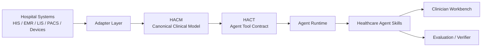
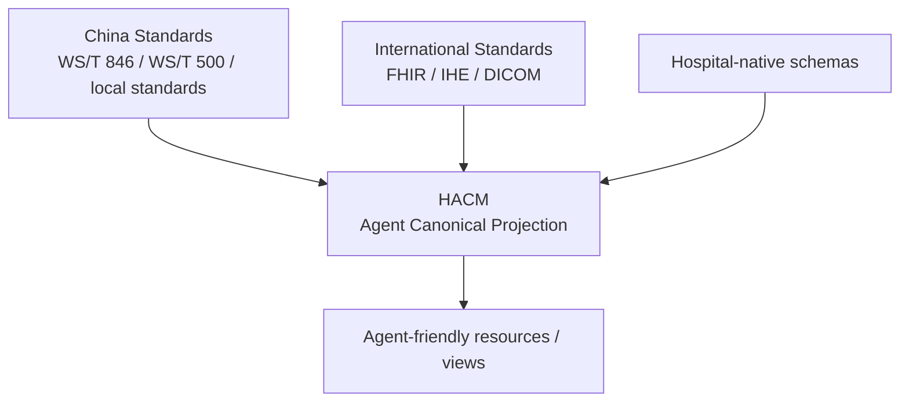
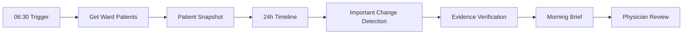
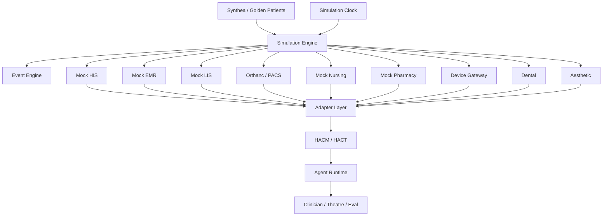
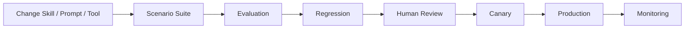

# Hospital Agent Platform v0.1
## 面向中国公立医院、私立医院与大型诊所的医疗智能体执行平台设计说明

> **文档状态**：Design Draft v0.1  
> **目标读者**：产品、前端、后端、Agent、数据/集成、算法、测试与解决方案团队  
> **核心目的**：解释当前产品设计的前因后果，明确平台边界、关键抽象、可复用开源模块、第一阶段实现范围，以及后续验证路径。  
> **重要说明**：本文是产品与技术架构设计文档，不是临床诊疗规范。所有涉及真实临床部署的高风险动作必须在医院治理、权限、审计和人工审批机制下进一步定义。

---

# 0. Executive Summary

我们要构建的不是一个“医疗版 ChatGPT”，也不是若干彼此孤立的“医疗 Agent”。

我们的目标是建立一个位于医院现有信息系统之上的 **Hospital Agent Execution Layer（医院智能体执行层）**：

> **连接医院现有数据、系统和设备，让智能体能够在可授权、可追踪、可验证的环境中完成真实医疗工作。**

平台需要同时适配：

- 国内大型公立医院；
- 私立综合医院；
- 牙科医院 / 连锁牙科；
- 整形外科 / 医美机构；
- 大型专科诊所；
- 医学院、研究型医院及科研团队。

医院原有 HIS / EMR / LIS / PACS / 护理 / 药房 / 设备系统继续作为 **System of Record**。  
我们的平台不替换这些系统，而是在它们之上提供：

1. **标准化的数据语义**：HACM；
2. **标准化的 Agent 工具接口**：HACT；
3. **医院能力协商**：HACP；
4. **统一事件模型**：Hospital Events；
5. **Adapter / Mapping / Identity / Terminology 层**；
6. **Agent Runtime / Harness**；
7. **Healthcare Agent Skill Library**；
8. **Evidence / Human Gate / Audit / AgentRun**；
9. **HospitalSim + Scenario + Verifier**；
10. **医生熟悉的 Clinical Workbench UI**。

整个系统的核心链路是：



一个非常重要的架构原则是：

> **医生界面与 Agent 执行环境必须分离。**

医生看到的仍然应该像熟悉的医院工作站：患者列表、病区、病历、检验、影像、医嘱、任务、时间线。  
Agent 在后端则拥有类似“终端式执行环境”的能力，可以查询数据、调用工具、规划、多步执行、检查结果、等待事件、恢复任务。

这一点来自我们对 HealthAgentBench 等医疗 Agent benchmark 的吸收：Agent 的先进性主要来自 **environment + tools + planning + execution + verification**，而不是来自聊天 UI。

---

# 1. 背景：为什么我们不从“医疗聊天机器人”开始

## 1.1 医院的真实问题不是“没有聊天框”

医院中的高价值任务通常具有以下特点：

- 数据分散在多个系统；
- 一项工作需要多次查询与交叉验证；
- 工作不是一次性问答，而是持续数小时或数天；
- 需要知道任务当前状态；
- 某些动作必须经过医生或护士确认；
- 结果需要回溯到原始证据；
- 发生异常时需要升级、重试或交由人工处理；
- 系统需要留下完整审计轨迹。

典型例子：

```text
危急检验结果产生
→ 找到患者
→ 读取近期检验趋势
→ 读取当前用药
→ 读取相关病史
→ 找到责任医生
→ 建立待处理任务
→ 通知
→ 等待确认
→ 未确认则升级
→ 处理完成
→ 关闭任务
```

如果把上述任务压缩成：

```text
医生问 AI：“这个患者有什么问题？”
AI 回答一段文字
```

那么我们实际上丢掉了 Agent 最有价值的部分。

---

## 1.2 产品需要从“回答问题”升级到“完成工作”

传统医疗 AI 往往是：

```text
Input → Model → Output
```

Agent-native workflow 应该是：

```text
Trigger
→ Context Acquisition
→ Understand
→ Plan
→ Tool Use
→ Execute
→ Verify
→ Human Gate
→ Continue
→ Deliver
→ Track Outcome
```

因此平台设计关注的核心对象不是 Prompt，而是：

- Goal
- Context
- State
- Tool
- Evidence
- Action
- Policy
- Approval
- Outcome
- Evaluation

---

# 2. HealthAgentBench 给我们的关键启发

本文参考的一个重要研究基础是 Microsoft Research 的 **HealthAgentBench**。  
该工作把医疗 Agent 从传统静态问答进一步推进到 **可执行医疗环境**。

项目：

- Project: https://microsoft.github.io/HealthAgentBench/
- Repository: https://github.com/microsoft/HealthAgentBench

论文覆盖 54 个任务、7 个类别，包括：

- EHR Format Conversion；
- EHR Data Quality Auditing；
- EHR Event Modelling；
- Clinical Trial Matching；
- X-ray Report Correction；
- CT Abnormality Classification；
- Pathology Tumor Area Selection。

其价值对我们而言并不在于“照搬 7 个 Agent”，而在于其任务设计哲学。

---

## 2.1 第一条启发：Agent 必须处在可执行环境中

Agent 不应该只获得整理好的 prompt context。

更真实的环境是：

```text
Agent
  ├── Query database
  ├── Read documents
  ├── Inspect longitudinal data
  ├── Inspect images
  ├── Call domain tools
  ├── Generate intermediate artifacts
  ├── Validate output
  └── Submit final result
```

这直接对应我们的：

```text
Hospital Systems
      ↓
Adapter
      ↓
HACM / HACT
      ↓
Agent Runtime
```

因此 HACT 的作用不是“做几个 API”，而是提供一个 **医疗 Agent 的 execution environment**。

---

## 2.2 第二条启发：终端适合 Agent，GUI 适合医生

HealthAgentBench 选择 terminal environment 是为了让 Agent 能自由探索和执行。

但真实医生不应该操作 terminal。

我们由此明确：

```text
Agent Plane != Clinician Plane
```

### Agent Plane

```text
hospital patient snapshot
hospital timeline query
hospital labs query
hospital documents search
hospital imaging get
hospital task create
...
```

### Clinician Plane

```text
病区
患者列表
Patient 360
Timeline
检验
影像
病历
医嘱
任务
Agent Brief
Evidence
Approval
```

这两个界面共享同一个底层数据和 Runtime。

---

## 2.3 第三条启发：Verifier 是一等公民

医疗 Agent 不能靠：

> “看起来回答得挺好。”

每个 Skill 必须定义可测试成功标准。

生产场景：

```text
Real Patient
→ Skill
→ Doctor
```

测试场景：

```text
Synthetic Patient
→ Same Skill
→ Hidden Verifier
```

这使得同一份 Agent Skill 可以被：

- Demo；
- 开发；
- 回归测试；
- 模型评估；
- 上线前验证；
- 版本升级验证。

---

## 2.4 第四条启发：大型搜索空间本身就是难题

HealthAgentBench 的 EHR Data Quality Auditing 和 Clinical Trial Matching 都说明：

> 如果让 Agent 每次从一个巨大、无结构的搜索空间开始找信息，性能会迅速下降。

因此我们的平台不能仅仅提供一个：

```text
generic SQL tool
```

而必须建设：

```text
PatientSnapshot
Timeline
Domain Search
Task-specific Tools
```

让 Agent 从更好的信息结构开始。

这也是 HACM / HACT 的重要价值之一。

---

## 2.5 第五条启发：先进 Agent 花大量时间做“定向和核验”

优秀 Agent 的典型行为不是立即生成答案，而是：

```text
Orient
→ Inspect
→ Scope
→ Execute
→ Verify
→ Correct
→ Submit
```

因此 Agent Runtime 必须原生支持：

- tool result inspection；
- intermediate artifacts；
- checkpoints；
- retry；
- verification；
- evaluator；
- trace。

---

# 3. 产品定位

## 3.1 一句话定位

> **Hospital Agent Platform 是一个跨医院系统的智能体执行层，将碎片化医疗数据、工具、设备与工作流转换成 Agent 可以可靠执行和验证的医疗工作环境。**

英文可暂时使用：

> **An agent-native execution layer across hospital systems that turns fragmented clinical data, tools and workflows into verifiable work.**

---

## 3.2 我们是什么

我们是：

- Hospital Agent Runtime；
- Agent integration layer；
- Clinical workflow execution layer；
- Healthcare Agent Skill platform；
- Hospital Agent evaluation environment。

---

## 3.3 我们不是什么

至少 V0.1 阶段，我们不是：

- 新 HIS；
- 新 EMR；
- 新 PACS；
- 新 LIS；
- 通用 FHIR Server；
- 医学影像基础模型公司；
- “AI 自动医生”；
- 单纯 ambient scribe；
- 纯医疗问答系统。

---

# 4. 总体产品架构

```mermaid
flowchart TB

    subgraph UX["Product Surface"]
        CW[Clinician Workbench]
        AT[Agent Theatre]
        AS[Agent Studio]
        EC[Evaluation Console]
        SC[Simulation Console]
    end

    subgraph SKILL["Healthcare Agent Skills"]
        W[Ward Intelligence]
        C[Critical Result]
        D[Discharge]
        Q[Medical Record / Data QA]
        R[Research]
        P[Private Care]
    end

    subgraph RUNTIME["Agent Runtime / Harness"]
        G[Goal & State]
        O[Orchestration]
        T[Tool Execution]
        PG[Policy / Human Gates]
        EV[Evidence]
        TR[Trace / AgentRun]
        ER[Evaluation]
    end

    subgraph CONTRACT["Agent Contracts"]
        HACM[HACM]
        HACT[HACT]
        EVENT[Event Model]
        HACP[HACP]
    end

    subgraph ADAPTER["Adapter Platform"]
        CON[Connectors]
        MPI[Identity / MPI]
        MAP[Schema Mapping]
        TERM[Terminology]
        UNIT[Unit / Time Normalization]
        PROV[Provenance]
        DEV[Device Wrappers]
    end

    subgraph SOURCE["Hospital Systems"]
        HIS[HIS]
        EMR[EMR]
        LIS[LIS]
        PACS[PACS]
        NURSE[Nursing]
        PHARM[Pharmacy]
        DEVICE[Devices]
    end

    UX --> SKILL
    SKILL --> RUNTIME
    RUNTIME --> CONTRACT
    CONTRACT --> ADAPTER
    ADAPTER --> SOURCE
```



---

# 5. 为什么医院接入层必须独立

现实医院不是一个统一数据库。

同一家医院可能存在：

```text
HIS        Oracle / SQL Server / REST
EMR        REST / SOAP / XML
LIS        REST / HL7 / DB View
PACS       DICOM / DICOMweb
Nursing    DB / proprietary API
Pharmacy   API / DB
Devices    Vendor SDK / TCP / WebSocket
Legacy     CSV / SFTP
```

更麻烦的是，同一个患者在不同系统中的 ID 可能不同。

例如：

```text
HIS:
PatientNo = 00092882
InpatientNo = ZY260812031

LIS:
PATID = 92882

PACS:
PatientID = P00092882

EMR:
PATIENT_KEY = 133884821
```

Agent 不应该理解这些细节。

Adapter 层必须将它们映射到：

```text
patient_id = pat_01J...
```

---

# 6. HACM：Hospital Agent Canonical Model

## 6.1 HACM 的定位

HACM 不应该成为一套与 FHIR / 中国卫生信息标准竞争的新医疗标准。

正确定位是：

> **Agent-facing Canonical Projection。**

即：



现有标准解决医疗互操作问题。

HACM 解决的是：

> **如何把这些标准投影成 Agent 更容易使用、更低歧义、更低 token/tool complexity、更适合工具调用的语义层。**

---

## 6.2 HACM v0.1 Core Resource

建议第一版包含：

```text
Patient
Encounter
Condition
Observation
Allergy
MedicationOrder
MedicationAdministration
ServiceOrder
Procedure
DiagnosticReport
ImagingStudy
ClinicalDocument
Appointment
Task
Practitioner
Organization
Location
```

另外增加两个 Agent-native derived views：

```text
PatientSnapshot
TimelineEvent
```

---

## 6.3 为什么 PatientSnapshot 很重要

Agent 不应该每次为了回答：

> “这个患者现在是什么情况？”

自己调用二十个接口。

推荐：

```text
Patient
   ↓
PatientSnapshot
   ↓
Timeline
   ↓
Deep Retrieval
```

`PatientSnapshot` 可以包含：

```yaml
patient:
current_encounter:
active_conditions:
allergies:
active_medications:
recent_vitals:
recent_labs:
recent_reports:
recent_procedures:
pending_orders:
open_tasks:
```

注意：

> Snapshot 是 derived view，不是 source of truth。

任何字段必须可以回到真实 source resource。

---

## 6.4 Provenance 是强制字段

标准化不能丢失源数据。

推荐所有 HACM resource 保留：

```json
{
  "provenance": {
    "hospital_id": "hospital_demo_01",
    "source_system": "LIS",
    "source_resource": "lab_result",
    "source_id": "LAB8842821",
    "adapter_version": "lis-adapter/1.3.2",
    "mapping_version": "lab-map/2026-08-01"
  }
}
```

并且尽可能保留：

```text
source_code
source_display
source_value
source_unit
source_identifier
```

原则：

> **Normalize but do not destroy source truth.**

---

## 6.5 时间语义必须明确

医疗 Agent 很容易因为时间产生严重错误。

需要区分：

```text
clinical_time
recorded_at
updated_at
effective_period
performed_period
```

禁止：

- 不知道日期时自行补日期；
- 把录入时间当成临床发生时间；
- 把报告时间当成采样时间。

---

# 7. HACT：Hospital Agent Command Tools

## 7.1 HACT 的定位

HACM 是 Agent 世界里的“名词”。

HACT 是 Agent 世界里的“动词”。

医院 A：

```http
GET /lis/api/report/getPatientResult?zyh=...
```

医院 B：

```http
POST /api/v3/queryLab
```

Agent 不应该知道这些差异。

统一成：

```bash
hospital labs query --patient pat_123 --from 2026-08-01
```

或者 typed function：

```ts
labs.query({
  patientId: "pat_123",
  from: "2026-08-01"
})
```

---

## 7.2 HACT v0.1

### Patient

```text
patient.resolve
patient.get
patient.snapshot
```

### Timeline

```text
timeline.query
```

### Clinical Data

```text
conditions.list
observations.query
labs.query
medications.list
procedures.list
```

### Documents

```text
documents.list
documents.get
documents.search
```

### Reports / Imaging

```text
reports.list
reports.get
imaging.list
imaging.get
```

### Tasks

```text
tasks.list
task.create
task.acknowledge
task.close
```

### Generic

```text
resource.get
capabilities.get
```

---

## 7.3 V0.1 不开放高风险直接执行

第一版不要让 Agent 直接：

```text
medication.order
procedure.order
```

可以先支持：

```text
action.prepare
action.validate
action.request_approval
```

以后再形成：

```text
Plan
→ Validate
→ Human Approve
→ Execute
```

---

# 8. HACP：Hospital Agent Capability Protocol

不同医院实际开放能力完全不同。

医院 A 可能允许：

```text
patient.read
lab.read
document.read
task.write
```

医院 B 可能只有：

```text
patient.read
lab.read
```

因此 Agent 运行前需要：

```text
hospital.capabilities()
```

示例：

```json
{
  "hospital_id": "hospital_a",
  "capabilities": {
    "patient.read": true,
    "timeline.read": true,
    "documents.search": true,
    "tasks.write": true,
    "medication.order": false
  }
}
```

Agent 不得假设某医院拥有所有工具。

---

# 9. Unified Hospital Event Model

Agent 不应该永远等待用户点击。

很多医疗工作应该由事件触发。

例如：

```text
patient.admitted
patient.transferred
patient.discharged

observation.finalized
diagnostic_report.finalized

medication.ordered

task.created
task.completed

device.alert
```

统一事件：

```json
{
  "event_type": "observation.finalized",
  "occurred_at": "2026-08-13T06:32:11+08:00",
  "patient_id": "pat_1028",
  "resource_ref": "observation/obs_123",
  "source": {
    "system": "LIS"
  }
}
```

因此底层四个 Contract 可以总结成：

```text
HACM   What exists?
HACT   What can the Agent do?
Events What happened?
HACP   What can this hospital support?
```

---

# 10. Adapter Platform

Adapter 是平台能不能真正跨医院部署的关键。

## 10.1 Adapter 的职责

```text
Source Connectivity
→ Identity Resolution
→ Schema Mapping
→ Terminology Mapping
→ Unit Normalization
→ Temporal Normalization
→ Validation
→ Provenance
→ Capability Mapping
```

Adapter **不做临床推理**。

---

## 10.2 Adapter SDK

推荐拆成：

```text
Connector
Mapping Config
Terminology Map
Transform
Validator
Capability Manifest
```

示例：

```text
adapters/
  hospital-a/
    his/
      connector.ts
      mapping.yaml
      terminology.yaml
      capabilities.yaml
    lis/
    emr/
    pacs/
```

---

## 10.3 Mapping DSL

尽量减少“每家医院都写大量业务代码”。

例如：

```yaml
resource: Observation

source:
  table: LAB_RESULT

fields:
  patient_id:
    from: PAT_NO
    transform: resolve_patient

  code.source_code:
    from: ITEM_CD

  code.source_display:
    from: ITEM_NAME

  value.value:
    from: RESULT_VAL
    transform: parse_number

  value.unit:
    from: RESULT_UNIT
    transform: normalize_unit

  clinical_time:
    from: REPORT_TIME
    transform: parse_datetime
```

长期护城河不是：

> 每家医院写 50,000 行 bespoke integration。

而是：

> Adapter Framework + Mapping Assets + Terminology Assets + Validation Assets。

---

# 11. Device Wrapper

医院独特设备统一按照 Tool 处理。

例如：

```text
bedside_monitor.snapshot
bedside_monitor.alerts

dental.cbct.get
dental.intraoral_scan.get

aesthetic.camera.timeline
aesthetic.face_scan.get

robot.delivery.dispatch
```

原则：

> Agent 面向业务语义工具，而不是厂商 SDK。

---

# 12. Agent Runtime / Harness

Agent Runtime 是整个系统最核心的自研部分之一。

## 12.1 Runtime 必须管理

```text
Goal
State
Context
Plan
Tools
Permissions
Evidence
Human Gates
Retries
Exceptions
Artifacts
Outcome
Evaluation
Trace
```

---

## 12.2 AgentRun

建议把一次 Agent 执行定义成一级对象：

```yaml
run_id:
skill_id:
skill_version:

trigger:
goal:

context:
plan:

tool_calls:
evidence:
decisions:

policy_checks:
human_approvals:

actions:
exceptions:

outputs:
outcome:
evaluation:
```

这意味着任何 Agent 结果都可以回答：

```text
为什么启动？
读取了什么？
调用了什么工具？
用了哪些证据？
做了哪些判断？
哪些步骤自动完成？
哪些步骤等了人工？
最后发生了什么？
```

---

# 13. Evidence Model

医疗 Agent 的结果必须尽可能 evidence-first。

一个 Agent claim：

```text
CRP 较昨日明显升高。
```

UI 中应该对应：

```text
[Evidence · LIS · 2026-08-13 06:31]
```

点开后：

```text
Canonical:
Observation CRP = 91 mg/L

Source:
LIS_RESULT.RESULT_VAL = 91

Source ID:
LAB8842821

Adapter:
lis-adapter/1.3.2
```

因此建议平台定义：

```text
EvidenceRef
SourceTrace
EvidenceGroup
EvidenceStatus
```

---

# 14. Healthcare Agent Skill Package

我们不应该交付大量 bespoke Agent。

应交付可移植的 **Skill Package**。

目录建议：

```text
skills/
  ward-intelligence/
    manifest.yaml
    goal.md
    tools.yaml
    context.yaml
    policies.yaml

    workflow/

    ui/

    scenarios/
      pneumonia-deterioration/
      aki/
      heart-failure/

    evaluators/
```

---

## 14.1 Skill Manifest

```yaml
name: ward-intelligence
version: 0.1.0

trigger:
  schedule: daily

required_capabilities:
  - patient.read
  - encounter.read
  - observation.read
  - medication.read
  - document.read

permissions:
  write: false

artifacts:
  - morning_briefing
  - patient_task_list

human_gates:
  - clinical_recommendation

evaluators:
  - evidence_grounding
  - factual_consistency
  - important_change_recall
```

---

# 15. 医疗 Agent 场景收束：6 个 Capability Domains

HealthAgentBench 和我们的产品需求结合后，不再用“100 个 Agent”描述产品。

统一为 6 个能力域。

| Capability Domain | 主要任务 |
|---|---|
| Clinical Intelligence | 患者理解、病区总结、重要变化、报告检查 |
| Care Execution | 危急值、出院、会诊、任务闭环 |
| Communication | 患者教育、术前术后沟通、随访 |
| Data & Quality | 数据质量、病历质控、一致性 |
| Research | 试验匹配、队列、科研分析 |
| Administration / Operations | 预约、床位、转诊、运营任务 |

---

# 16. V0.1 第一批产品 Skill

## 16.1 Ward Intelligence

目标：

> 在每天查房前自动完成病区患者过去一段时间的重要变化整理。

流程：



输出：

```text
31 patients

High Priority       3
Needs Attention     7
Stable             21
```

单患者：

```text
过去 24 小时重点变化

1. 发热 38.7°C
2. CRP 38 → 91
3. SpO₂ 最低 91%
4. 血培养 pending
5. 抗菌治疗昨日开始
```

每条信息可以回到原始证据。

---

## 16.2 Critical Result Agent

流程：

```text
Critical Lab Result
→ Resolve Patient
→ Retrieve Context
→ Check Relevant History
→ Identify Responsible Team
→ Create Task
→ Notify
→ Wait
→ Escalate
→ Close
```

该场景展示：

- event-driven；
- multi-tool；
- stateful；
- human acknowledgment；
- escalation；
- long-running Agent。

---

## 16.3 Discharge Agent

```text
Discharge Initiated
→ Readiness Check
→ Pending Labs
→ Medication Reconciliation
→ Follow-up
→ Patient Education
→ Missing Task Detection
→ Create Tasks
→ Physician Approval
→ Continue Tracking
→ Close
```

该场景用于展示 Agent 可以：

> 今天开始任务，等待事件，明天继续执行，直到 Goal 完成。

---

## 16.4 Medical Record / Data QA

```text
Read Record
→ Load Quality Rules
→ Compare Cross-source Data
→ Detect Missing / Conflict
→ Evidence
→ Assign Correction Task
→ Track
→ Verify
→ Close
```

可覆盖：

```text
Impossible values
Demographic conflicts
Cross-table inconsistency
Diagnosis conflict
Medication mismatch
Missing document
Incomplete discharge summary
```

---

## 16.5 Research Pack

包含：

```text
Clinical Trial Matching
Cohort Discovery
Research Data Agent
```

适合：

- 医学院；
- 三甲研究型医院；
- 临床研究中心。

---

## 16.6 Private Care Pack

### Dental Patient Journey

```text
Consult
→ X-ray / CBCT
→ Tooth Chart
→ Treatment Plan
→ Procedure
→ Follow-up
```

### Aesthetic / Plastic Surgery Journey

```text
Consultation
→ Photography / 3D Scan
→ Pre-op
→ Procedure
→ Medication
→ Post-op
→ Image Comparison
→ Recovery Tracking
```

这类场景的重点不是复杂住院临床推理，而是：

```text
Patient Journey
Appointment
Procedure
Media
Follow-up
CRM / Task
Retention
```

---

# 17. HospitalSim：为什么必须做

HospitalSim 不是简单 synthetic database。

它应该是：

> **可运行的 Virtual Hospital / Hospital Digital Twin for Agent Development。**

用途：

```text
Sales Demo
Agent Development
Adapter Development
Regression Testing
Evaluation
Hospital Training
```

---

# 18. HospitalSim 架构



---

# 19. HospitalSim 不应该所有接口都统一

如果所有 Mock System 都由我们自己设计成漂亮 REST API：

> Adapter Demo 没有说服力。

所以故意设计：

```text
HIS       REST + SQL
EMR       SOAP/XML
LIS       Legacy REST / DB
PACS      DICOMweb
Nursing   DB View
Device    WebSocket / event
Legacy    CSV / SFTP
```

让客户看到：

```text
Hospital-native chaos
        ↓
Adapter
        ↓
Stable Agent Contract
```

---

# 20. HospitalSim 数据策略

## Tier 1：Golden Patients

约：

```text
20–50 patients
```

特点：

- 高质量；
- 完整临床故事；
- 各系统数据相互一致；
- 专门用于 Demo / Eval。

---

## Tier 2：Background Population

约：

```text
2,000–10,000 synthetic patients
```

作用：

> 让医院看起来像真实医院。

---

## Tier 3：Load Population

以后可以：

```text
100k+
```

主要用于：

- search；
- index；
- performance；
- load testing。

---

# 21. Synthetic Data：不要随机拼病历

错误方式：

```text
random diagnosis
+ random lab
+ random medication
```

正确方式：

```text
Latent Clinical State
        ↓
Disease / Care Pathway
        ↓
Clinical Events
        ↓
Hospital System Projection
```

例如：

```text
infection = worsening
oxygenation = deteriorating
renal_function = stable
```

产生：

```text
fever
SpO2 decrease
CRP increase
nursing note
lab order
physician note
medication change
```

这样 Agent 才能做 longitudinal reasoning。

---

# 22. 可复用项目：不要重新造轮子

## 22.1 总体原则

我们要区分：

```text
Reuse
Adapt
Reference
Build Ourselves
```

---

## 22.2 推荐复用矩阵

| 项目 | 用途 | 策略 |
|---|---|---|
| Synthea | Synthetic patient generation | Reuse |
| Medplum | FHIR / auth / SDK / clinical UI primitives | Reuse / Extract |
| OpenMRS O3 | Modular clinical UX architecture | Reference / Selective reuse |
| Orthanc | Virtual PACS / DICOMweb | Reuse as separate service |
| HealthAgentBench | Scenario + verifier design | Reference / Adapt |
| MedAgentBench | EHR Agent environment/evaluation | Reference / Adapt |
| HAPI FHIR | Alternative FHIR infrastructure | Optional |
| OMOP | Research analytics CDM | Integrate later |
| OpenHIE / IHE concepts | Identity/interoperability architecture | Reference |

---

# 23. Medplum：我们应该抽什么

Medplum 提供 FHIR-oriented healthcare development platform，包括：

```text
Auth
FHIR Clinical Data Repository
FHIR API
SDK
React Components
Provider starter application
```

我们不建议：

> fork 整个平台后把它直接改成我们的产品。

更合适的是抽取：

```text
PatientHeader
PatientSearch
ResourceTable
Medication Table
Observation / Lab Table
Appointment
Task
Clinical Forms
FHIR utilities
React hooks
```

这些属于“医生已经熟悉的基础 EHR primitives”。

---

# 24. OpenMRS O3：我们应该抄什么架构

OpenMRS O3 的核心启发不是视觉样式，而是：

```text
App Shell
Frontend Modules
Extension Slots
Workspaces
Configuration
```

特别适合我们的 Agent UI。

例如患者页面：

```text
Patient Chart
 ├── Allergies
 ├── Conditions
 ├── Medications
 ├── Vitals
 └── Agent Extension Slot
```

Agent 可以作为：

```text
AgentBriefExtension
CriticalResultExtension
DischargeWorkspace
EvidenceWorkspace
```

插入已有 Clinical Workspace。

---

# 25. Clinical UI 的设计原则

## 25.1 不做 Chat-first

不推荐：

```text
Ask AI anything...
```

作为主界面。

推荐：

> Clinical Workspace + Agent Augmentation。

---

## 25.2 信息架构

主导航：

```text
今日工作
病区
我的患者
我的任务
消息

Agent
  今日重点
  待确认
  追踪中
```

患者页：

```text
Overview
Timeline
Labs
Imaging
Medications
Documents
Orders
Agent
```

---

# 26. 三种 UI Mode

## 26.1 Clinician Mode

真正临床用户使用。

隐藏：

```text
Prompt
Token
Raw tool JSON
Model internals
```

展示：

```text
Patient
Clinical Data
Agent Brief
Evidence
Tasks
Approvals
```

---

## 26.2 Agent Theatre Mode

用于：

- 客户 Demo；
- 院长；
- 信息科；
- 医务处。

三栏：

```text
Hospital World
     │
     ▼
Standard Layer
     │
     ▼
Agent World
```

例如：

```text
LIS:
K001 = 6.7

↓

HACM:
potassium = 6.7 mmol/L

↓

Agent:
critical result triggered
→ retrieve context
→ create task
→ wait for acknowledgment
```

这比 PPT 说“支持异构系统”更有说服力。

---

## 26.3 Research / Evaluation Mode

类似 HealthAgentBench：

```text
Scenario
Environment
Instruction
Tools
Trajectory
Verifier
Metrics
```

用于：

- 内部研发；
- 医学院；
- AI Lab；
- benchmark。

---

# 27. Agent UI Kit：我们真正需要自研的 UI

建议：

```text
packages/agent-ui/
```

包含：

```text
AgentBrief
AgentStatus
AgentProgress

EvidenceChip
EvidenceDrawer
SourceTrace

AgentAction
ApprovalGate
AgentTask

AgentRunTimeline
ToolCallInspector
AgentDecision
AgentWarning

EvaluatorResult
ScenarioResult
```

这些是我们的核心产品资产。

---

# 28. 医生页面示例

```text
┌────────────────────┬─────────────────────────────┬──────────────────┐
│ Patient Context    │ Agent Workspace             │ Actions          │
│                    │                             │                  │
│ 张XX 68岁          │ Morning Brief               │ Confirm          │
│                    │                             │ Create Task      │
│ Problems           │ Important Changes           │ Notify           │
│ Medications        │                             │ Prepare Action   │
│ Allergies          │ Evidence                    │                  │
│ Vitals             │                             │                  │
│ Labs               │ Suggested Review            │                  │
│ Timeline           │                             │                  │
└────────────────────┴─────────────────────────────┴──────────────────┘
```

---

# 29. Agent 不应该只存在于 Agent 页面

真正 Agent-native UX 应该渗透到原工作流中。

Labs：

```text
K   6.7 ↑↑
[Agent reviewing]
```

Documents：

```text
Progress Note
[2 inconsistencies]
```

Discharge：

```text
Agent checklist

✓ Medication reconciliation
✓ Discharge summary
⚠ Follow-up missing
○ Pending pathology
```

---

# 30. Scenario Package 与 Verifier

Scenario Package 推荐：

```text
scenarios/
  critical-hyperkalemia/
    scenario.yaml
    initial-state/
    events/
    expected/
    verifier/
```

示例：

```yaml
name: critical-hyperkalemia

initial_state:
  patient: patient_001

inject:
  - event: observation.finalized
    code: potassium
    value: 6.7

expected:
  must:
    - detect_critical_result
    - retrieve_recent_renal_function
    - retrieve_active_medications
    - cite_source_observation
    - request_human_review

  must_not:
    - fabricate_ecg
    - directly_execute_medication_order
```

---

# 31. Evaluation Framework

## 31.1 Ward Intelligence

```text
Important Change Recall
Evidence Grounding
Temporal Correctness
Factual Consistency
Unsupported Claim Rate
Priority Accuracy
```

## 31.2 Critical Result

```text
Detection
Relevant Context Retrieval
Correct Responsible Team
Acknowledgement
Escalation
Time to Close
```

## 31.3 Discharge

```text
Pending Item Recall
Medication Reconciliation
Follow-up Completeness
Education Completeness
Closure Rate
```

## 31.4 QA

```text
Error Recall
Precision
Evidence Accuracy
Cross-source Consistency
```

---

# 32. Agent 发布流程

禁止：

```text
改 prompt
→ 直接上线
```

推荐：



更完整的 evolution loop：

```text
Run
→ Trace
→ Evaluate
→ Diagnose
→ Propose Lesson
→ Review
→ Version Skill / Policy
→ Regression
→ Promote
→ Monitor
```

---

# 33. Multi-Agent 原则

不要因为“Multi-Agent 很先进”而拆 Agent。

错误：

```text
Diagnosis Agent
→ Medication Agent
→ Lab Agent
→ Imaging Agent
→ Supervisor Agent
```

如果这些 Agent 每次都重新读取同一个患者上下文：

> context 被浪费，系统反而更复杂。

只有存在以下边界时考虑独立 Agent：

```text
不同权限
独立长期责任
独立验证职责
明显不同 context
并行处理带来价值
```

例如 Clinical Agent 和 Independent Evidence Verifier 可以合理分开。

---

# 34. 医疗安全与 Progressive Autonomy

建议自主级别：

```text
Level 0  Retrieve
Level 1  Summarize / Recommend
Level 2  Prepare Action
Level 3  Human-approved Execution
Level 4  Bounded Autonomous Execution
```

V0.1 重点：

```text
Level 0–2
```

少量低风险任务可以：

```text
Level 3
```

例如：

```text
task.create
notification.send
```

不应该为了 Demo 直接做：

```text
autonomous medication ordering
```

---

# 35. 推荐仓库结构

```text
apps/
  clinician-workbench/
  hospital-sim/
  agent-theatre/
  agent-studio/
  evaluation-console/

packages/
  hacm/
  hact-sdk/
  hacp/
  hospital-events/

  adapter-sdk/
  mapping-engine/
  terminology/
  identity/

  agent-runtime/
  skill-runtime/
  policy-engine/
  evidence/
  agent-run/

  scenario-sdk/
  evaluator-sdk/

  clinical-ui/
  agent-ui/

  fhir-bridge/

services/
  simulator/
  event-bus/
  mock-his/
  mock-lis/
  mock-emr/
  device-gateway/

skills/
  ward-intelligence/
  critical-result/
  discharge/
  medical-record-qa/
  clinical-trial-matching/
  dental-journey/
  aesthetic-journey/
```

---

# 36. V0.1 建议技术边界

## Source Systems

第一版：

```text
HIS
EMR
LIS
PACS
Nursing
Pharmacy
Device Gateway
```

私立扩展：

```text
Dental
Aesthetic
```

---

## HACM

第一版：

```text
Patient
Encounter
Condition
Observation
Allergy
MedicationOrder
MedicationAdministration
ServiceOrder
Procedure
DiagnosticReport
ImagingStudy
ClinicalDocument
Task
Practitioner
Location

PatientSnapshot
TimelineEvent
```

---

## HACT

第一版 Read-heavy：

```text
patient.*
timeline.query

conditions.list
observations.query
labs.query
medications.list

documents.*
reports.*
imaging.*

tasks.list
task.create
task.acknowledge
task.close
```

---

# 37. 第一阶段不要做什么

明确 Non-goals：

```text
完整重建 HIS
完整重建 EMR
全院几十个深度科室
全自动诊断
自主处方
自主手术/设备控制
自研 PACS
自研 FHIR Server
自研 synthetic population engine
复杂多 Agent 演戏
```

---

# 38. 推荐 OSS 技术组合

## Synthetic Population

**Synthea**

用途：

```text
Background population
Longitudinal synthetic records
FHIR export
```

我们在其上增加：

```text
China localization
Golden Patient scenarios
Hospital system projection
```

Repository:

https://github.com/synthetichealth/synthea

---

## FHIR / Clinical Development

**Medplum**

用途：

```text
FHIR backend reference
FHIR types
Auth reference
React healthcare components
Provider UI reference
```

Repositories:

https://github.com/medplum/medplum  
https://github.com/medplum/medplum-provider

---

## Clinical UI Architecture

**OpenMRS O3**

主要借：

```text
App Shell
Frontend Modules
Extension Slots
Workspaces
Patient Chart architecture
```

Docs:

https://o3-docs.openmrs.org/

---

## PACS

**Orthanc**

作为独立 Virtual PACS / DICOMweb service。

Docs:

https://orthanc.uclouvain.be/book/

---

## Agent Evaluation

**HealthAgentBench**

主要借：

```text
Executable environment
Scenario packaging
Hidden verifier
Task success
Trajectory inspection
```

https://github.com/microsoft/HealthAgentBench

---

# 39. 标准策略

HACM 必须建立在现有标准之上，而不是另起炉灶。

重点参考：

```text
China:
WS/T 846 Hospital Information Platform Interaction
WS/T 500 Electronic Medical Record Shared Document

International:
FHIR
DICOM / DICOMweb
IHE profiles
SMART on FHIR
```

当前架构原则：

```text
FHIR-compatible
but not FHIR-dependent
```

原因：

```text
FHIR 很适合跨系统互操作；
Agent 不一定适合直接面对所有原始 FHIR 复杂度。
```

因此：

```text
FHIR / Chinese Standards
        ↓
HACM Canonical Projection
        ↓
HACT Agent Tools
```

---

# 40. FHIR Projection

为了最大化复用 Medplum/FHIR 生态：

```text
HACM
 ├── Agent Projection
 │      ↓
 │     HACT
 │
 └── FHIR Projection
        ↓
   Clinical UI / FHIR tools
```

Agent Runtime **不能依赖 Medplum**。

Medplum 是可替换基础设施，不是平台核心边界。

---

# 41. HospitalSim 第一版 Reference Hospital

建议使用完全虚构医院：

> 华夏大学附属第一医院（Synthetic）

避免客户误解数据来自真实患者。

模拟规模：

```text
大型综合医院
约 1,500 床
30+ clinical departments
10+ diagnostic / technical departments
multi-campus capable
```

上述规模仅是 simulator parameter，不代表任何真实医院。

---

# 42. 第一版深度科室

公立旗舰：

```text
Respiratory
Cardiology
Emergency
ICU
General Surgery
```

私立旗舰：

```text
Dentistry
Plastic & Aesthetic Surgery
```

其他科室可以作为背景数据存在，但暂不做深度 Scenario。

---

# 43. 最重要的 Demo Flow

最终面向医院负责人演示时，不要只演示：

> “AI 可以总结病历。”

应该演示完整链路：

```text
1. 打开 Mock LIS
2. 注入 Critical Potassium
3. 原始 LIS 数据产生
4. Adapter 捕获
5. Identity Resolution
6. 映射为 HACM Observation
7. Event emitted
8. Critical Result Skill triggered
9. Agent 查询 patient.snapshot
10. Agent 查询 labs / meds / documents
11. Evidence Verifier
12. 创建任务
13. 医生确认
14. Agent 持续追踪
15. Task closed
16. AgentRun 可完整查看
```

这个 Demo 同时证明：

```text
医院异构接入能力
Agent 执行能力
事件驱动
长期状态
Human-in-the-loop
Evidence
Auditability
```

---

# 44. 第二个 Demo：Ward Intelligence

```text
06:30 Simulation Clock
→ Ward Agent Triggered
→ Get patient list
→ Snapshot
→ 24h Timeline
→ Change Detection
→ Evidence Check
→ Priority
→ Morning Brief
```

医生看到的是熟悉的病区列表。

信息科看到的是 Agent Run。

管理层看到的是：

```text
减少遗漏
工作前置
过程可追踪
```

---

# 45. Adapter Copilot：一个值得进入 Phase 2 的方向

HealthAgentBench 的 ETL 类任务提示：

Agent 已经可以在明确约束和 verifier 下完成相当一部分数据转换工程。

未来可以做：

```text
Hospital API docs
+ sample payload
+ HACM schema
      ↓
Adapter Copilot
      ↓
Propose mapping
      ↓
Generate config
      ↓
Run fixture
      ↓
Validation
      ↓
Engineer approval
```

它不会取代 Integration Engineer。

它的价值是降低新医院接入成本。

---

# 46. 实施阶段

## Phase 0：Contracts

目标：

> 把概念变成代码 Contract。

交付：

```text
HACM v0.1 schemas
HACT v0.1 interfaces
Hospital Event schema
HACP schema
AgentRun schema
Evidence schema
Skill manifest schema
Scenario schema
```

成功标准：

> 两个 Mock Hospital 可以通过不同 Adapter 暴露相同 HACT。

---

## Phase 1：Reference Hospital

交付：

```text
HospitalSim
Mock HIS / LIS / EMR
Orthanc
Medplum/FHIR reference
Adapter Studio
Patient 360
Timeline
```

成功标准：

> 可以完成 Patient → Snapshot → Timeline → Source Trace。

---

## Phase 2：First Agent Loop

先做：

```text
Ward Intelligence
Critical Result
```

成功标准：

```text
Event
→ Agent
→ Tools
→ Evidence
→ Human Gate
→ Outcome
```

完整闭环。

---

## Phase 3：Stateful Workflow

加入：

```text
Discharge
Medical Record QA
```

验证：

```text
Long-running task
Multiple events
Retry / escalation
Evaluation
```

---

## Phase 4：Expansion Packs

```text
Research Pack
Dental Pack
Aesthetic Pack
```

---

# 47. 开发优先级

推荐优先顺序：

```text
P0
HACM
HACT
Event
HACP

P0
Adapter SDK
Identity
Mapping
Provenance

P0
PatientSnapshot
Timeline

P0
AgentRun
Evidence

P1
HospitalSim
Simulation Clock
Event Injection

P1
Clinician Workbench

P1
Ward Intelligence
Critical Result

P1
Verifier

P2
Discharge
QA

P2
Dental / Aesthetic

P3
Adapter Copilot
Research
Advanced multimodal
```

---

# 48. Architecture Decision Records

## ADR-001：不建立新的完整医疗数据标准

**Decision**

HACM 是 Agent-facing projection。

**Reason**

已有 FHIR、中国 WS/T、DICOM 等标准；重新造标准会导致重复和生态隔离。

---

## ADR-002：Agent 不直接依赖 Hospital-native API

**Decision**

所有 Agent 通过 HACT。

**Reason**

保证 Skill 跨医院可移植。

---

## ADR-003：Agent 不直接依赖 Medplum

**Decision**

Medplum 只作为可复用 FHIR / UI infrastructure。

**Reason**

平台必须能够部署到使用任何 HIS/EMR 厂商的医院。

---

## ADR-004：Clinician UI 与 Agent execution 分离

**Decision**

医生使用 GUI；Agent 使用 execution environment。

**Reason**

两种用户的认知和交互完全不同。

---

## ADR-005：Verifier 属于 Skill

**Decision**

每个生产 Skill 同时有 Scenario/Evaluator。

**Reason**

Agent 升级必须可回归、可比较。

---

## ADR-006：默认 Progressive Autonomy

**Decision**

V0.1 主要 Read / Prepare / Recommend。

**Reason**

先证明价值和可靠性，再增加执行权限。

---

## ADR-007：HospitalSim 是正式平台资产

**Decision**

不是一次性销售 Demo。

**Reason**

它同时服务开发、测试、评测、销售和培训。

---

# 49. 关键工程不变量

以下应视为长期 architecture invariants：

```text
1. Source truth cannot be destroyed.
2. Every derived clinical claim should be traceable.
3. Agent tools must be capability-aware.
4. High-risk action must support human gates.
5. Every Agent run must be observable.
6. Skill versions must be testable.
7. Hospital-specific logic belongs in Adapter/Profile.
8. Core Skill should not know vendor-native schema.
9. Simulation and production should run the same Skill code.
10. Model provider should be replaceable.
```

---

# 50. 仍需要真实医院验证的问题

当前架构可以开始工程实现，但以下问题必须通过真实医院访谈 / 样本数据继续验证：

## Data

```text
真实 HIS/EMR/LIS 表结构
Patient ID mapping
时间字段
术语编码
单位
状态码
文档格式
```

## Workflow

```text
危急值责任链
查房前真实工作方式
出院流程 owner
病历质控规则
任务升级路径
```

## Permission

```text
Agent read scope
department isolation
doctor role
nurse role
audit requirements
```

## Devices

```text
牙科 CBCT / scanner interface
医美影像设备
monitor vendor APIs
```

原则：

> 不要用 Simulator 的假设反过来定义真实医院。

HospitalSim 是 reference environment，不是对现实医院的断言。

---

# 51. Definition of Done：V0.1

当下面这条链路可以稳定演示和自动测试时，可以认为 V0.1 架构成立：

```text
Mock LIS
→ native lab payload
→ Adapter
→ identity resolution
→ HACM Observation
→ hospital event
→ Agent Skill
→ HACT tools
→ evidence
→ clinician approval
→ task state
→ outcome
→ AgentRun
→ verifier
```

同时满足：

```text
同一 Skill 可以换另一套医院 Adapter 继续工作。
```

这才证明我们做的是 Platform，而不是 Demo。

---

# 52. 最终产品逻辑

整个体系可以压缩为五层：

```text
Healthcare Systems
        ↓
Adapter & Canonicalization
        ↓
Agent Execution Contracts
        ↓
Agent Runtime & Skills
        ↓
Human + Agent Workflow
```

真正持续积累的公司资产将是：

```text
HACM
HACT
Adapter SDK
Mapping / Terminology Assets
Hospital Profiles
Skill Library
Scenario Library
Evaluation Sets
AgentRun Data
Clinical UX
```

而不是：

> 某一家医院的一次性定制代码。

---

# 53. 推荐开发团队的共同心智模型

当讨论一个新功能时，不要先问：

> “要不要做一个 XXX Agent？”

而应该按以下顺序问：

```text
1. Trigger 是什么？
2. Goal 是什么？
3. 谁是 owner？
4. Agent 需要哪些 Context？
5. 需要哪些 Tools？
6. 哪些步骤需要判断？
7. 哪些 Action 可以执行？
8. 哪些地方必须 Human Gate？
9. State 要保存多久？
10. Exception 如何处理？
11. Output artifact 是什么？
12. Evidence 怎么回溯？
13. 如何自动 Evaluation？
14. 这个 Skill 能不能迁移到下一家医院？
```

只有这些问题回答清楚，才应该开发新的 Agent Skill。

---

# 54. References

## Research / Agent Benchmarks

- HealthAgentBench  
  https://microsoft.github.io/HealthAgentBench/  
  https://github.com/microsoft/HealthAgentBench

- MedAgentBench  
  https://github.com/stanfordmlgroup/medagentbench

## Healthcare Platform / UI

- Medplum  
  https://github.com/medplum/medplum

- Medplum Provider  
  https://github.com/medplum/medplum-provider

- OpenMRS O3  
  https://o3-docs.openmrs.org/

## Simulation

- Synthea  
  https://github.com/synthetichealth/synthea

## Imaging

- Orthanc  
  https://orthanc.uclouvain.be/book/

## Standards

- HL7 FHIR R5  
  https://hl7.org/fhir/R5/

- 国家卫生健康委员会 WS/T 846《医院信息平台交互标准》  
  国家卫生健康委员会官网标准页面 / 文件

---

# 55. Final Principle

如果整个项目只保留一句设计原则：

> **不要让 Agent 适配每一家医院；让每一家医院适配一个稳定的 Agent 执行世界。**

医院内部仍然可以是：

```text
HIS
EMR
LIS
PACS
SOAP
SQL
DICOM
Vendor API
```

但是 Agent 看到的应该始终是：

```text
HACM
HACT
Events
Capabilities
Evidence
State
```

在这个稳定世界之上，Ward、Critical Result、Discharge、QA、Research、Dental、Aesthetic 等 Skill 才真正具备跨医院复用的可能。

这就是当前 Hospital Agent Platform v0.1 的核心设计。
