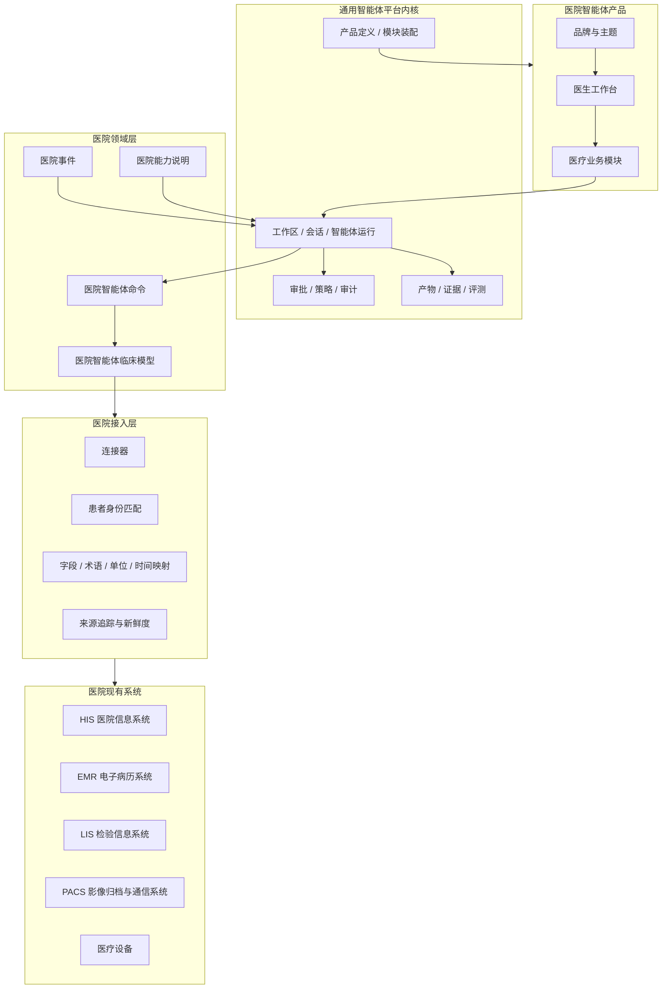

# 医院智能体平台统一设计 v0.2

> 文档状态：统一设计草案  
> 统一来源：`Hospital_Agent_Platform_Design_v0.1.md` 与 Bio Discovery X Issue #380  
> 目标：在复用现有通用智能体产品内核的前提下，形成可实施、可验证、可跨医院迁移的医院智能体产品设计。  
> 语言约定：正文优先使用中文。确需使用英文缩写时，第一次出现同时给出中文解释。

---

# 1. 一句话结论

医院智能体产品不是新的医院信息系统，也不是给现有聊天产品换一套医疗皮肤。

它是构建在医院现有系统之上的 **智能体执行层**：连接医院的数据、工具和工作流，让智能体在明确授权、完整证据、人工把关和自动验证的约束下完成工作。

该产品复用现有 Bio Discovery X 的通用智能体平台内核，但拥有独立的产品外壳、导航、品牌、功能组合和发行物。

```text
通用智能体平台内核
├── Bio Discovery X 产品
└── 医院智能体产品
    ├── 公立医院组合
    ├── 牙科组合
    ├── 医美组合
    └── 科研组合
```

这里的“组合”不是运行时切换模式，而是在构建和部署时选择产品模块、连接器、工具、技能、主题和策略。

---

# 2. 设计目标与非目标

## 2.1 设计目标

1. 复用现有工作区、会话、运行、产物、审批、审计和模型适配能力。
2. 将不同医院的医院信息系统（HIS）、电子病历系统（EMR）、检验信息系统（LIS）、影像归档与通信系统（PACS）和设备差异封装在医院接入层中。
3. 为智能体提供稳定、低歧义、可追溯的医疗数据与命令接口。
4. 为医生提供熟悉的患者、病区、检验、影像、任务和审批界面。
5. 让每个医疗技能同时拥有场景、验证器和回归测试。
6. 首期以读取、总结、建议和准备动作为主，临床结论由专业人员确认。
7. 同一项技能更换医院接入实现后仍可运行。

## 2.2 明确不做

- 不替换医院现有的医院信息系统、电子病历系统、检验信息系统或影像归档与通信系统。
- 不建立一套与快速医疗互操作资源（FHIR）、医学数字成像与通信标准（DICOM）或中国卫生信息标准竞争的新标准。
- 不把医院产品做成 Bio Discovery X 中的一个运行时开关。
- 不让产品模块直接调用模型、数据库或医院系统。
- 不把所有医院数据全量复制到平台数据库。
- 不把所有扩展都称为“插件”并共用一个启用开关。
- 不在首期让真实患者原始影像或完整病历进入云端模型上下文。
- 不在首期自动诊断、自动处方或写回核心医疗记录。
- 不为每家医院维护永久分支或独立代码副本。

---

# 3. 统一后的总体架构



这套架构分为五层：

| 层 | 负责什么 | 不负责什么 |
|---|---|---|
| 医院现有系统 | 保存真实患者、医嘱、报告和影像 | 不适配智能体的统一交互 |
| 医院接入层 | 连接、身份匹配、格式转换、来源追踪 | 不做临床推理 |
| 医院领域层 | 向智能体提供稳定的临床数据、命令、事件和能力 | 不保存通用智能体运行事实 |
| 通用智能体平台内核 | 管理运行、工具、审批、产物、审计和评测 | 不理解医院厂商私有字段 |
| 医院智能体产品 | 提供医生界面、业务模块、品牌和工作流 | 不绕过平台内核直接访问来源系统 |

---

# 4. 统一的产品装配模型

## 4.1 两个独立产品，共享一个内核

Bio Discovery X 与医院智能体是两个独立产品：

- 分别拥有自己的产品入口、产品外壳、路由、导航和品牌；
- 分别构建和发布，不是同一安装包中的两个模式；
- 共同依赖版本化的平台内核包；
- 不在共享代码中散落 `if product == hospital` 一类判断；
- Bio Discovery X 本身也必须使用产品定义，不能保留为内核中的特殊默认产品。

## 4.2 产品定义

**产品定义**是一个产品的唯一装配入口，负责声明：

```yaml
产品标识:
品牌:
主题:
业务模块:
导航结构:
功能策略:
允许的工具:
允许的连接器类型:
受控术语:
```

产品定义必须是经过类型校验的构建期配置，不能成为散落的环境变量或页面条件判断。

## 4.3 五类扩展必须分开

| 类型 | 何时加入产品 | 主要职责 | 示例 |
|---|---|---|---|
| 产品模块 | 构建时 | 页面、领域对象、业务流程、模块数据 | 牙科计算机断层扫描（CT）辅助检查 |
| 连接器 | 部署或运行时 | 连接医院系统、认证、查询、动作和事件 | 某医院 PACS 连接器 |
| 工具插件 | 运行时 | 向智能体提供经过审核的可执行命令 | 影像处理命令行工具 |
| 智能体技能 | 运行时 | 指导智能体如何完成某类工作 | 危急值处置技能 |
| 品牌与主题 | 部署时 | 名称、标志、色彩、字体、密度和术语 | 某医院品牌主题 |

它们可以在界面上被统一展示为“能力”，但不能共用一个后端对象、安装表或启用状态。

## 4.4 功能状态

功能至少有三种状态：

- **未打包**：不进入发行物、路由、后台登记表、智能体能力清单和物料清单。
- **已停用**：代码存在，但导航、直接网址、后台命令和智能体激活都必须拒绝。
- **仅隐藏**：只是界面不展示，不代表没有权限。

因此，“隐藏左侧导航”绝不能被当作权限控制。

---

# 5. 统一的数据模型

## 5.1 三层数据表示

统一后不再追求一张能够容纳所有来源的“万能记录表”，而是采用三层表示：

```text
第一层：通用资源外壳
  身份、来源、版本、观察时间、敏感等级、可用能力

第二层：医院领域数据
  患者、就诊、检验、用药、报告、影像、任务等明确类型

第三层：来源专有扩展
  某厂商或某协议无法无损映射、但必须保留的字段
```

概念示例：

```json
{
  "资源类型": "检验结果",
  "平台资源标识": "obs_123",
  "来源": {
    "连接器标识": "lis_a",
    "连接标识": "hospital_a_lis",
    "来源记录标识": "LAB8842821"
  },
  "来源版本": "rev_17",
  "观察时间": "2026-08-13T06:31:00+08:00",
  "敏感等级": "患者敏感数据",
  "可用能力": ["读取", "查看趋势"],
  "临床数据": {
    "检验项目": "血钾",
    "数值": 6.7,
    "单位": "mmol/L"
  }
}
```

## 5.2 HACM 的最终定位

HACM 是 **Hospital Agent Clinical Model，医院智能体临床模型**。

旧设计使用 `Canonical Model`（规范模型）这一英文名称。统一设计保留 HACM 缩写，但改用 `Clinical Model`（临床模型），以避免团队将其误解为一套试图统一所有医院和医疗标准的新规范。

它不是新的完整医疗数据标准，而是医院领域内面向智能体的临床数据投影：

- 建立在 FHIR、DICOM、中国卫生信息标准和医院原始数据之上；
- 为智能体提供更少歧义、更少工具调用、更低上下文成本的表示；
- 保留原始编码、原始值、原始单位和来源标识；
- 每个派生字段都可以追溯到来源；
- 无法无损映射的字段进入带命名空间和版本的来源扩展。

HACM 第一版建议包含：

```text
患者
就诊
诊断或健康问题
检验与观察
过敏
用药医嘱
用药执行
服务申请
操作与手术
诊断报告
影像检查
临床文档
预约
任务
医务人员
机构
地点
```

并提供两个专门面向智能体的派生视图：

- **患者摘要**：当前就诊、活动问题、过敏、当前用药、近期检验、待办事项。
- **患者时间线**：按临床发生时间排列的重要事件。

派生视图不是事实来源，任何内容都必须能回到原始资源。

## 5.3 时间与来源必须显式

至少区分：

- 临床发生时间；
- 记录时间；
- 更新时间；
- 生效时间段；
- 实际执行时间段。

禁止把报告发布时间当成采样时间，也禁止缺少日期时自行补齐。

每个资源至少记录：来源系统、来源记录标识、连接器版本、映射版本和读取时间。

## 5.4 按需转换，不做默认全量复制

- HIS、EMR、LIS、PACS 继续保存原始事实。
- 接入层按需读取并转换为稳定的数据接口。
- 只有搜索索引、离线缓存和派生结果在有明确需求时落地。
- 落地数据必须说明来源版本、新鲜度、是否可重建和保存期限。
- 断网或缓存过期时，界面必须明确显示离线和最后同步时间。

---

# 6. 统一的命令、事件和能力模型

## 6.1 HACT：医院智能体命令工具

HACT 是 **Hospital Agent Command Tools，医院智能体命令工具**。

HACM 描述“有什么”，HACT 描述“智能体能做什么”。智能体不接触医院私有网址、数据库表或厂商命令，而使用稳定的业务命令：

```text
患者.查找
患者.读取
患者.读取摘要
时间线.查询
检验.查询
用药.列出
文档.搜索
影像.列出
任务.创建
任务.确认
任务.关闭
```

程序内部可以使用英文稳定标识，例如 `patient.snapshot`，但产品文档、界面和业务沟通优先使用中文名称。

普通医生界面通过类型安全的程序客户端调用后台接口；智能体通过平台命令行或工具调用同一个后台处理器。两者共享数据、权限、业务规则和审计，不建立两套后端。

## 6.2 医院事件

事件表示“发生了什么”，例如：

```text
患者已入院
患者已转科
检验结果已发布
报告已完成
任务已创建
任务已确认
设备产生告警
```

事件包含事件类型、发生时间、患者标识、资源引用、来源和版本。事件只负责触发和传递变化，不代替资源本身。

## 6.3 HACP：医院能力说明

HACP 是 **Hospital Agent Capability Profile，医院智能体能力说明**。

它回答：

> 当前医院、当前连接和当前版本实际提供哪些能力？

例如某医院可能支持读取患者、检验和文档，但不支持创建任务。能力说明用于发现和协商，不直接决定某一次运行是否有权限。

这是对旧设计的重要修正：HACP 不再称为“能力协议”，也不承担最终授权。

## 6.4 最终授权模型

某次智能体运行的有效权限，由下列事实共同求交：

```text
连接器当前能力和授权范围
∩ 产品与部署策略
∩ 产品模块或人员的数据授权
∩ 智能体的连接器分配
∩ 智能体权限配置
∩ 运行环境实际能力
∩ 数据敏感等级与模型提供方规则
∩ 本次高风险动作的人工批准
```

这里必须区分：

- 能否打开某个页面；
- 某模块能否读取某项数据；
- 某智能体能否在一次运行中读取数据；
- 能否看到元数据或原始内容；
- 能否准备写入；
- 能否真正写回；
- 某一次高风险动作是否已被批准。

这些都不是同一个“已启用”状态。

每次运行只获得短期、最小权限凭证。命令参数只能缩小权限，不能切换身份或扩大权限。医院连接密码不得进入浏览器、命令参数、运行轨迹、模型上下文或普通日志。

---

# 7. 统一的智能体执行模型

## 7.1 复用现有平台执行链

所有医疗业务模块都必须复用：

```text
工作区
→ 会话
→ 智能体运行
→ 上下文解析
→ 工具执行
→ 策略检查
→ 人工把关
→ 产物
→ 审计
→ 评测
```

产品模块不得：

- 在页面中直接调用模型；
- 自建一套运行、审批或产物表；
- 用隐藏提示词代替明确的数据引用；
- 把模型文本直接当成临床事实。

## 7.2 智能体运行

一次智能体运行至少记录：

```yaml
运行标识:
技能及版本:
触发原因:
目标:
输入资源引用:
数据敏感等级:
授权结果:
计划:
工具调用:
证据:
策略检查:
人工批准:
产生的动作:
异常与重试:
输出产物:
结果:
评测:
```

运行记录只保存必要的引用、版本和决策，不默认复制患者正文、原始影像、连接密码、内部网址或完整模型响应。

## 7.3 结构化页面与对话的关系

对话适合自由探索；结构化页面适合：

- 固定输入；
- 批量比较；
- 证据和版本审核；
- 人工修改与确认；
- 长期状态跟踪；
- 签署或未来写回。

结构化页面可以带着明确的资源引用启动智能体运行，智能体产物也可以回到业务页面，但两者都不能绕过领域校验。

## 7.4 证据优先

模型给出的每个重要临床判断应尽可能关联证据：

```text
结论：血钾达到危急值。
证据：LIS 检验结果 LAB8842821，采样时间 06:12，结果 6.7 mmol/L。
读取版本：rev_17。
映射版本：lab-map/1.2.0。
```

必须区分：

- 模型建议；
- 引用证据及其来源版本；
- 人工修改；
- 人工确认结果；
- 确认人、确认时间和确认版本；
- 外部写回请求与回执。

批准一次工具调用，不代表医生确认了模型的临床结论。

---

# 8. 产品模块设计

## 8.1 产品模块的职责

产品模块是经过代码审查、在构建时加入发行物的可信业务代码。它可以拥有：

- 专业页面；
- 领域对象；
- 业务工作流；
- 模块自己的数据与迁移；
- 后台业务能力；
- 产物展示方式；
- 智能体任务入口。

产品模块不拥有：

- 医院系统连接密码；
- 通用智能体运行生命周期；
- 平台内部数据库；
- 医院原始事实；
- 不受控制的外部进程权限。

## 8.2 牙科 CT 的归属示例

| 内容 | 归属 |
|---|---|
| PACS 地址、认证和连接状态 | PACS 连接器 |
| DICOM 检查、序列和影像类型 | 医院影像领域模型 |
| 牙科检查页、标注、检查清单和人工确认 | 牙科 CT 产品模块 |
| 工作区、会话、运行、审批、产物和审计 | 通用平台内核 |
| 牙科影像分析方法和步骤 | 智能体技能 |
| 影像读取和处理程序 | 工具插件或受控影像服务 |

## 8.3 模块接口

第一版只开放少量稳定入口：

- 带命名空间的页面路由；
- 导航候选项；
- 设置区域；
- 工作区动作；
- 产物预览或编辑器；
- 智能体任务入口；
- 必要的上下文侧栏。

模块可以声明导航候选项，但最终放在哪里、是否展示和显示什么名称，由产品定义决定。

模块不得访问平台内部数据库，也不得让前端直连医院系统或模块私有端口。模块的后台操作必须经过统一的输入校验、权限、错误处理、审计和脱敏。

## 8.4 模块停用与卸载

- 停用模块时保留数据，只关闭入口和执行能力。
- 卸载是独立、显式、可审计的操作，必须先决定导出、保留或删除。
- 可重建缓存与必须保留的确认记录、审计记录使用不同清理策略。
- 关闭导航开关不得删除业务数据。

产品模块不等于微服务。只有存在独立扩缩容、合规隔离、专用图形处理器（GPU）、原生依赖或已有服务时，才引入独立进程；即使如此，仍由平台后台统一管理身份、生命周期、健康和审计。

---

# 9. 医院接入层设计

## 9.1 连接器与适配器

统一术语如下：

- **连接器定义**：描述一种来源系统如何认证、提供哪些能力和使用哪个适配实现。
- **连接实例**：某家医院实际配置的一次连接，保存凭证引用、状态和当前能力。
- **适配器**：把某个来源系统的数据和动作转换为平台稳定接口的实现。
- **映射配置**：字段、术语、单位和时间的转换规则。

一套医院接入实现通常包括：

```text
来源连接
→ 患者身份匹配
→ 字段映射
→ 术语映射
→ 单位转换
→ 时间规范化
→ 数据校验
→ 来源追踪
→ 能力说明
```

适配器只转换和校验，不进行临床推理。

## 9.2 查询、动作与事件

医院接口不能被强行简化成普通增删改查：

- **资源**：读取带来源信息的患者、检验、报告或影像。
- **查询**：支持过滤、分页、新鲜度和权限约束的搜索。
- **动作**：签署、撤回、创建任务等有前置条件和风险的操作。
- **事件**：来源系统的变化通知。

动作必须单独定义输入、前置条件、风险级别、人工审批、重复提交保护和外部回执。

## 9.3 大数据处理

DICOM（医学数字成像与通信）影像、可移植文档格式（PDF）文件和长病历，不能直接作为巨大文本或 Base64（二进制转文本编码）数据进入命令输出和默认模型上下文。

智能体先获得：

- 受控资源引用；
- 元数据；
- 有界摘要；
- 可用处理能力。

需要读取内容时，通过平台管理的数据流或产物通道按最小范围访问。

---

# 10. 安全与临床责任

## 10.1 首期自主程度

| 等级 | 中文说明 | 首期策略 |
|---|---|---|
| 0 | 检索信息 | 支持 |
| 1 | 总结和建议 | 支持 |
| 2 | 准备动作 | 支持 |
| 3 | 人工批准后执行 | 仅限少量低风险动作 |
| 4 | 有边界的自主执行 | 暂不开放 |

可考虑的低风险动作包括创建普通任务或发送非临床通知。用药、手术和临床结论写回不在首期范围。

## 10.2 数据进入模型前必须拒绝优先

当前系统必须承认：只要数据进入智能体上下文，它就可能发送给所选模型服务商。本地后台不等于数据不会外发。

每次运行在模型或工具产生副作用之前，必须检查：

```text
数据敏感等级
∩ 来源系统规则
∩ 产品与部署规则
∩ 模块声明
∩ 智能体数据分配
∩ 权限配置
∩ 运行环境能力
∩ 模型服务商和部署位置
```

任何必要事实缺失时默认拒绝，而不是默认放行。

首个版本仅允许合成数据、脱敏数据或明确最小化的派生数据进入智能体。真实患者原始影像和完整病历必须等待单独的数据隔离设计与真实环境验证。

## 10.3 日志不是原文备份

正式日志默认记录：

- 人员、模块和运行标识；
- 不透明资源引用和来源版本；
- 操作、能力和策略版本；
- 授权与批准结果；
- 状态、耗时、重试和外部回执；
- 脱敏且有长度限制的错误。

患者正文、影像、提示词、工具完整输出和模型完整响应必须按数据分类与保存策略另行处理。

---

# 11. 医生界面与智能体界面

## 11.1 两种使用界面

**医生工作界面**展示：

```text
病区
患者列表
患者全景
时间线
检验
影像
病历
用药
任务
智能体摘要
证据
待确认事项
```

**智能体执行界面**提供：

```text
患者摘要查询
时间线查询
检验与用药查询
文档搜索
影像资源读取
任务创建和跟踪
中间产物
验证与提交
```

它们共享同一数据和后台处理器，但交互形式不同。医生不需要使用终端，智能体也不应该通过点击医生界面完成工作。

## 11.2 产品外壳与主题

产品外壳决定：导航、页面层级、默认工作流和正式版/支持版差异。

主题只决定：名称、标志、颜色、字体、密度、圆角、阴影、图表颜色和受控术语。主题不能改变路由、权限或加载任意代码。

正式医院发行物在构建时排除研发诊断入口。现场支持版是独立且明显标识的发行物，不能用普通用户可开启的“开发者模式”代替权限系统。

---

# 12. 技能、场景和验证

## 12.1 技能包

一项智能体技能至少包含：

```text
目标
触发方式
所需上下文
所需能力
允许的工具
工作步骤
策略与人工把关
输出产物
测试场景
验证器
```

技能是“如何完成工作”的知识，不是权限，也不拥有连接密码或业务真相。

## 12.2 同一技能用于生产和测试

```text
生产：真实或获准数据 → 同一技能 → 医生审核
测试：合成场景 → 同一技能 → 隐藏验证器
```

每次修改技能、工具、模型或映射后，都必须运行场景回归，再经过人工审查和小范围发布。

## 12.3 第一版的业务能力域

| 能力域 | 典型工作 |
|---|---|
| 临床信息整理 | 患者摘要、病区重点、重要变化 |
| 照护任务闭环 | 危急值、出院、会诊、任务升级 |
| 沟通与随访 | 患者教育、术前术后沟通、随访 |
| 数据与质量 | 病历质控、数据一致性、错误发现 |
| 科研 | 试验匹配、队列发现、科研分析 |
| 运营 | 预约、转诊、床位和行政任务 |

---

# 13. 模拟医院与验证环境

## 13.1 模拟医院是正式平台资产

模拟医院不是一次性销售演示数据，而是可运行的医院参考环境，同时服务：

- 产品演示；
- 智能体技能开发；
- 医院接入开发；
- 自动回归和模型评测；
- 压力测试；
- 医院培训。

生产和模拟环境必须运行同一份技能代码、命令接口和验证逻辑，差异只存在于数据来源、连接实例和授权策略。

## 13.2 模拟医院也要保留来源差异

模拟系统不能全部被设计成整洁、统一的接口，否则无法证明接入层的价值。参考环境应有意覆盖不同接入形态：

```text
模拟医院信息系统：网页接口 + 数据库
模拟电子病历系统：基于 XML（可扩展标记语言）的 SOAP（简单对象访问协议）旧式接口
模拟检验信息系统：旧式网页接口或数据库视图
模拟影像系统：DICOMweb（基于网页协议的医学影像接口）
模拟护理系统：数据库视图
模拟设备：事件流
遗留数据：CSV（逗号分隔值）文件或安全文件传输
```

智能体仍然只能看到统一的医院临床模型、命令、事件和能力说明，不能知道模拟系统的私有结构。

## 13.3 三层模拟数据

| 层级 | 规模建议 | 用途 |
|---|---:|---|
| 金标准患者 | 20 至 50 人 | 完整临床故事、演示和严格评测 |
| 背景患者 | 2,000 至 10,000 人 | 搜索空间、病区和医院真实感 |
| 压力患者 | 10 万人以上 | 索引、查询和负载测试 |

模拟数据不能用随机诊断、随机检验和随机用药简单拼接。应先定义患者潜在临床状态和照护路径，再生成相互一致的检验、文档、用药、任务和事件。

## 13.4 场景包

每个金标准场景包含：

```text
初始患者状态
来源系统数据
按时间注入的事件
允许的工具和权限
必须完成的事项
禁止发生的事项
自动验证器
```

模拟医院不能反过来定义真实医院。患者身份规则、危急值责任链、科室权限和设备接口仍必须用真实医院访谈和脱敏样本持续校正。

---

# 14. 首个端到端验证切片

统一设计建议将第一条产品化验证链保持为牙科 CT 辅助检查：

```text
合成或脱敏的 DICOM 影像
→ PACS 连接器和适配器
→ 影像检查资源
→ 牙科 CT 结构化页面
→ 带资源引用的智能体任务
→ 统一智能体运行
→ 运行期最小权限影像工具
→ 建议和证据产物
→ 专业人员修改与确认
```

它必须证明：

1. 医院产品有独立外壳、导航、品牌和发行物。
2. 牙科模块只依赖公开接口，不修改平台内核。
3. 页面、智能体命令和直接后台调用进入同一数据与授权处理器。
4. 原始 PACS 仍是影像事实来源。
5. 原始敏感影像不进入默认模型上下文。
6. 模型建议与人工确认是两个独立事实。
7. 不写回医院核心系统的临床结论。
8. 全程能够关联运行、证据、审批、产物和审计。

第二条临床流程验证链建议为危急检验值：

```text
模拟 LIS 发布危急值
→ 适配器转换检验结果
→ 医院事件触发
→ 智能体读取患者摘要、检验趋势、用药和文档
→ 引用证据
→ 创建待处理任务
→ 等待医生确认
→ 超时升级
→ 任务关闭
→ 验证器检查结果
```

牙科 CT 验证产品装配、影像和结构化业务页面；危急值验证事件驱动、长期状态、人工把关和跨系统临床工作流。

---

# 15. 分阶段实施路线

## 阶段 0：冻结长期决策

- 固定本文术语和架构边界。
- 写明产品定义、产品模块、连接器和医院数据模型的归属。
- 固定真实患者敏感数据、临床确认和写回的禁止边界。

## 阶段 1：让现有产品先消费产品定义

- Bio Discovery X 成为第一个产品定义使用者。
- 去除名称、标志、标题栏、托盘和通知中的硬编码。
- 建立产品物料清单，记录平台、模块、契约、连接器定义和主题版本。

## 阶段 2：完成产品外壳和功能策略

- 区分未打包、已停用和仅隐藏。
- 统一约束导航、直接网址、后台命令和智能体能力。
- 保持网页端和桌面端各自的路由机制。

## 阶段 3：主题与最小产品模块接口

- 建立完整主题字段和无障碍测试。
- 先把 Bio Discovery X 的一个现有功能改造成模块，再与牙科 CT 的需要对照。
- 只有被两个真实使用者共同需要的入口才提升为稳定接口。

## 阶段 4：后台模块登记与数据生命周期

- 支持带命名空间的后台功能和模块数据迁移。
- 模块能力由后台强制检查。
- 明确停用、卸载、导出和保留规则。

## 阶段 5：医院连接与标准数据接口

- 冻结资源、查询、动作和事件的数据结构。
- 实现来源、版本、新鲜度、敏感等级和能力说明。
- 实现安全的凭证保管和运行期短期授权。

## 阶段 6：统一的智能体命令面

- 医生界面客户端和智能体命令进入同一处理器。
- 大数据使用资源引用、数据流或产物通道。
- 运行冻结所用的连接器、数据结构和能力版本。

## 阶段 7：医院产品与牙科 CT 闭环

- 建立独立医院网页、桌面和后台发行物。
- 完成牙科 CT 端到端切片。
- 仅使用合成或脱敏数据，不开放临床写回。

## 阶段 8：临床流程与模拟医院

- 建立模拟医院、模拟 LIS、EMR 和 PACS。
- 完成危急值与病区重点两个技能。
- 同一技能在两个不同模拟医院接入实现上通过验证。

## 阶段 9：稳定和交付

- 发布版本兼容矩阵、升级说明和契约测试包。
- 对每个发行物生成可机器读取的物料清单。
- 删除只被单一场景使用、没有证明普适性的扩展入口。

---

# 16. 第一版完成标准

第一版不是以“能够聊天”或“能够展示一个影像页面”为完成标准，而要同时证明两条闭环。

**平台装配闭环：**

```text
产品定义
→ 独立医院产品
→ 产品模块
→ 连接器
→ 统一运行
→ 产物
→ 人工确认
```

**临床执行闭环：**

```text
医院来源数据
→ 接入与身份匹配
→ 医院智能体临床模型
→ 医院事件或命令
→ 智能体技能
→ 证据
→ 人工把关
→ 任务结果
→ 智能体运行记录
→ 自动验证
```

还必须满足：

- Bio Discovery X 和医院智能体都消费产品定义。
- 医院产品是独立发行物，不是隐藏菜单形成的模式。
- 同一技能更换另一套医院适配器后仍可运行。
- 未打包和已停用能力在前端、后台和智能体侧表现一致。
- 所有重要临床结论能够追溯来源和版本。
- 真实敏感原始数据进入模型的路径默认拒绝。
- 模型建议、人工确认和外部写回严格分离。
- 所有技能具有场景和自动验证器。

---

# 17. 统一术语表

## 产品与扩展

**通用智能体平台内核**：供多个产品复用的工作区、会话、运行、工具、审批、产物、审计和评测能力。避免称为“医院后台”。

**医院智能体产品**：基于通用内核构建、拥有独立产品外壳和发行物的医院工作产品。避免称为“医院模式”。

**产品定义**：一个产品在构建时的唯一装配入口。避免使用“产品环境变量集合”。

**产品外壳**：负责产品顶层布局、导航、路由、品牌和默认工作流。避免将其与主题混用。

**产品模块**：在构建时加入产品的可信垂直业务代码。避免泛称为“插件”。

**智能体技能**：指导智能体如何完成某项工作的版本化知识包。技能不是权限，也不是可执行程序本身。

**工具插件**：向智能体提供经过审核的本地可执行命令。工具插件不提供业务页面。

## 医院数据与接入

**HACM（Hospital Agent Clinical Model，医院智能体临床模型）**：医院领域内面向智能体的临床数据投影，不是新的完整医疗标准。

**HACT（Hospital Agent Command Tools，医院智能体命令工具）**：智能体读取医疗数据和执行获准动作的稳定命令集合。

**HACP（Hospital Agent Capability Profile，医院智能体能力说明）**：说明某医院或连接当前实际提供哪些能力，不直接等同于授权。

**医院事件**：医院系统中已经发生的变化通知，用于触发和推进工作流。

**连接器定义**：描述某类外部系统的认证方式、能力和适配实现。

**连接实例**：某家医院实际配置的一次外部系统连接。

**适配器**：将某个来源系统转换为平台稳定数据和动作接口的实现。

**映射配置**：字段、术语、单位和时间的转换规则。

**来源追踪**：记录数据来自哪个系统、哪条记录、哪个版本和哪版映射。

**新鲜度**：说明数据最后读取或同步的时间，以及它是否仍可被视为当前状态。

## 执行与安全

**智能体运行**：一次有目标、有输入、有权限、有工具、有证据和有结果的完整执行记录。

**资源引用**：不直接复制大对象或敏感正文，而用受控标识指向来源资源的方式。

**人工把关**：需要专业人员确认后才能继续的流程节点。

**人工批准**：允许执行某个具体动作，不等同于认可模型的临床结论。

**人工确认结果**：专业人员对建议进行审阅、修改后形成的正式确认事实。

**验证器**：根据场景中明确的必须项、禁止项和结果标准自动判断任务是否成功的程序。

## 外部标准和系统缩写

**HIS（Hospital Information System，医院信息系统）**：医院收费、住院、医嘱等综合业务系统的常用统称。

**EMR（Electronic Medical Record，电子病历系统）**：保存结构化或文档化临床病历的系统。

**LIS（Laboratory Information System，检验信息系统）**：管理检验申请、样本和结果的系统。

**PACS（Picture Archiving and Communication System，影像归档与通信系统）**：保存和分发医学影像的系统。

**FHIR（Fast Healthcare Interoperability Resources，快速医疗互操作资源）**：医疗数据交换标准。

**DICOM（Digital Imaging and Communications in Medicine，医学数字成像与通信）**：医学影像及其交换协议标准。

**CT（Computed Tomography，计算机断层扫描）**：通过 X 射线断层重建人体结构的影像检查。

**CBCT（Cone Beam Computed Tomography，锥形束计算机断层扫描）**：牙科等领域常用的锥形束三维影像检查。

---

# 18. 最终原则

统一设计可以压缩为一句话：

> 不让智能体逐家理解医院的混乱接口，而让每家医院通过受控接入层投影成一个稳定、可授权、可追溯、可验证的智能体工作世界。

这个工作世界由四类核心对象组成：

```text
临床数据：有什么
智能体命令：能做什么
医院事件：发生了什么
能力与授权：在当前运行中允许做什么
```

在其上复用通用智能体平台的运行、工具、审批、产物和评测能力，再由医院产品的结构化界面承接医生工作流。这是从现有通用智能体产品演进到医院智能体平台的最小、清晰且可验证路径。
