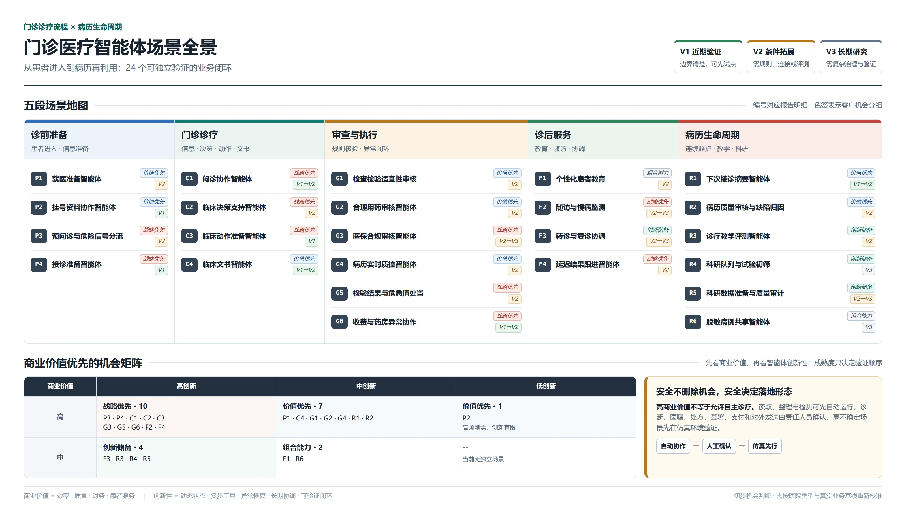

# 门诊医疗智能体场景全景与试点选择指南 v0.1

## 1. 目的与边界

本指南用于向医疗机构客户展示围绕门诊诊疗流程与病历生命周期可以拓展的医疗智能体（Medical AI Agent）场景，并帮助客户识别值得优先验证的业务机会。它不是单个场景方案，也不声称图中的全部智能体已经实现或经过真实临床验证。

范围限定为中国二级或三级公立医院的成人普通门诊，以及一次门诊产生的临床记录的直接后续用途。住院、手术、公共卫生、医院后勤、药物研发等场景不在当前地图内。

客户阅读后的建议行动，是从全景图选择两至三个场景进入联合调研与概念验证，而不是根据一张机会图直接批准生产部署。

## 2. 管理层摘要

1. **医疗智能体不是一个覆盖所有岗位的超级助手。** 本指南识别出 24 个具有独立触发、责任人、业务结果和验证条件的场景，分布在诊前准备、门诊诊疗、审查与执行、诊后服务和病历生命周期五个阶段。
2. **场景选择先看商业价值，再看创新性。** 综合公立医院基准图形成 10 个战略优先场景、8 个价值优先场景、4 个创新储备场景和 2 个组合能力；这些分组是待客户验证的机会假设，不是采购排名或 ROI 承诺。
3. **高价值场景不等于高自治。** 安全与合规不删除商业机会，但决定场景采用自动协作、责任人员确认还是先在仿真环境验证。
4. **模型不是主要差异。** 真正决定场景能否落地的是业务状态、医院工具、规则与证据、岗位责任、异常恢复、审计和端到端评测。
5. **建议下一步是联合选出两至三个场景。** 组合包含一个近期价值场景、一个战略创新场景，并可增加一个病历生命周期场景；在客户基线、数据、责任和出口指标明确前，不进入生产承诺。

## 3. 一页全景图



## 附录 A：全景图口径

### A.1 两条主线

```text
门诊诊疗流程
患者进入 -> 诊前准备 -> 门诊诊疗 -> 审查与执行 -> 诊后服务
                              |
                              v
病历生命周期
形成与签署 -> 连续照护 -> 质量治理 -> 教学评测 -> 科研与受治理共享
```

### A.2 成熟度标记

| 标记 | 含义 | 可以声称什么 | 不能声称什么 |
|---|---|---|---|
| **V1 近期验证** | 业务边界与责任链较清楚，适合先用合成或脱敏数据验证 | 可以作为近期概念验证或小范围试点候选 | 不能据此声称临床有效性或规模化生产可用 |
| **V2 条件拓展** | 仍需补充规则、智能体工作流、评测器、数据治理或系统连接 | 可以作为未来 6-12 个月的场景建设候选 | 不能写成已经落地的成熟能力 |
| **V3 长期研究** | 依赖跨机构数据、复杂治理、临床验证或新的产品边界 | 可以作为研究方向和能力储备 | 不能给出未经验证的上线周期或收益承诺 |

成熟度是对场景验证条件的初步判断，不代表具体医院已经具备相应数据、流程或上线条件。每家机构仍需通过现场访谈、系统盘点和样本核验重新校准。

### A.3 智能体场景准入

单次分类、抽取、生成、检索或预测属于原子 AI 能力。只有当工作流有明确触发、责任人和终止条件，要求根据环境状态调用数据或工具、处理分支或异常，并产生可验证结果、交接或人工把关时，本图才将其称为智能体场景。

## 附录 B：24 个场景明细

### B.1 诊前准备

| ID | 智能体场景 | 主要参与者 | 触发 -> 可验证结果 | 智能体成立的必要条件 | 成熟度 |
|---|---|---|---|---|---|
| P1 | 就医准备智能体 | 患者、门诊服务人员 | 患者提出就医需求 -> 经患者确认的科室、时间与材料计划 | 必须联合查询科室能力、号源、院内规则和患者约束，并处理无号、停诊或信息不足；单次科室分类不是智能体 | V2 |
| P2 | 挂号资料协作智能体 | 患者、挂号员 | 患者到院或线上挂号 -> 完整资料草稿、患者匹配结果和待审挂号提案 | 必须处理患者查重、资料缺失、号源状态和冲突恢复；普通表单自动填充不是智能体 | V1 |
| P3 | 预问诊与危险信号分流智能体 | 患者、分诊护士 | 挂号完成 -> 结构化预问诊单，或高风险患者升级到人工分诊 | 必须根据回答动态追问、识别信息缺口和危险信号，并在不确定时停止自动流程 | V2 |
| P4 | 接诊准备智能体 | 门诊医生 | 患者进入医生队列 -> 带来源、版本和缺口提示的患者摘要 | 必须从纵向记录中按当前就诊目标取证、处理冲突和新鲜度；普通病历摘要只是原子能力 | V1 |

### B.2 门诊诊疗

| ID | 智能体场景 | 责任人 | 触发 -> 可验证结果 | 智能体成立的必要条件 | 成熟度 |
|---|---|---|---|---|---|
| C1 | 问诊协作智能体 | 门诊医生 | 医生开始接诊 -> 已覆盖的必要主题、未解决信息缺口和可追溯问诊记录 | 必须根据已获信息决定追问主题，并允许医生接管；开放式会话能力不能由有限问题编码模拟直接证明 | V1 -> V2 |
| C2 | 临床决策支持智能体 | 门诊医生 | 获得足够患者信息 -> 带患者证据和医学证据的鉴别诊断与检查建议 | 必须更新鉴别诊断、处理反证和停止条件，并引用适用指南；输出不构成正式诊断或医嘱 | V2 |
| C3 | 临床动作准备智能体 | 门诊医生 | 医生形成诊疗意图 -> 通过目录和规则校验的诊断、检查、处方与文书提案 | 必须读取本院可用项目和患者状态、处理版本冲突，并把正式动作交给医生确认 | V1 |
| C4 | 临床文书智能体 | 门诊医生 | 诊疗信息基本形成 -> 结构化病历草稿、来源引用和缺项提示 | 必须整合问诊、结果和正式动作，检查前后一致性并进入签署流程；单次文本生成不是完整场景 | V1 -> V2 |

### B.3 流程内审查与执行

| ID | 智能体场景 | 责任人 | 触发 -> 可验证结果 | 智能体成立的必要条件 | 成熟度 |
|---|---|---|---|---|---|
| G1 | 检查检验适宜性审核智能体 | 门诊医生、检验相关岗位 | 检查提案形成 -> 放行、修改建议或人工复核任务 | 必须结合近期结果、重复窗口、禁忌、成本和诊断目的；固定必填校验不需要智能体 | V2 |
| G2 | 合理用药审核智能体 | 药师、门诊医生 | 处方提案或正式处方形成 -> 分级风险、依据和药师处理结果 | 必须联合患者过敏、肝肾功能、诊断、剂量和相互作用证据；医保能否支付不是本场景结论 | V2 |
| G3 | 医保合规审核智能体 | 医保或收费岗位 | 诊疗项目、药品或材料准备结算 -> 支付政策匹配结果、缺失材料或人工工单 | 必须使用适用地区、时间和人群的政策版本；符合医保规则不能证明临床合理 | V2 -> V3 |
| G4 | 病历实时质控智能体 | 门诊医生、医务管理人员 | 病历准备签署 -> 缺陷清单、修订提案或放行结果 | 必须使用明确病历规范并定位证据；不得静默改写临床事实 | V2 |
| G5 | 检验结果与危急值处置智能体 | 检验岗位、责任医生、护士 | 报告发布或命中危急值 -> 已通知、已确认、已处置或按时升级的闭环记录 | 必须能等待、恢复、催办、升级和验证关闭条件；单次异常值分类不是完整场景 | V2 |
| G6 | 收费与药房异常协作智能体 | 收费员、药师 | 正常流程无法继续 -> 有证据的异常原因、修复提案或升级工单 | 只有跨系统取证、状态冲突和异常恢复需要智能体；正常支付和发药仍是确定性业务流程 | V1 -> V2 |

### B.4 诊后服务

| ID | 智能体场景 | 责任人 | 触发 -> 可验证结果 | 智能体成立的必要条件 | 成熟度 |
|---|---|---|---|---|---|
| F1 | 个性化患者教育智能体 | 门诊医生、药师、患者 | 诊疗方案确认 -> 经专业人员审核、适合患者理解能力的说明与确认记录 | 必须以正式诊疗结果和证据为边界，识别患者疑问并升级；单次通俗改写只是原子能力 | V2 |
| F2 | 随访与慢病监测智能体 | 医生、护士、患者 | 到达随访条件或患者上传数据 -> 归档结果、异常任务、复诊或急诊升级 | 必须维护长期状态、同意与联系方式边界，并避免用固定阈值替代临床判断 | V2 -> V3 |
| F3 | 转诊与复诊协调智能体 | 医生、门诊服务人员、患者 | 产生转诊或复诊计划 -> 匹配资源、材料齐备并由患者确认的安排 | 必须处理跨机构能力、资源变化、失败重试和责任交接 | V2 -> V3 |
| F4 | 延迟结果跟进智能体 | 责任医生、护士、患者 | 患者离院后报告发布 -> 医生确认、患者通知及必要处置记录 | 必须区分普通结果、异常结果和危急值，并保证通知失败可以升级 | V2 |

### B.5 病历生命周期与二次利用

| ID | 智能体场景 | 责任人 | 触发 -> 可验证结果 | 智能体成立的必要条件 | 成熟度 |
|---|---|---|---|---|---|
| R1 | 下次接诊摘要智能体 | 门诊医生 | 同一患者再次进入队列 -> 带来源、时间和未解决问题的纵向摘要 | 必须区分历史事实、当前状态和旧诊断的不确定性；不得把历史记录当成当前真值 | V1 -> V2 |
| R2 | 病历质量审核与缺陷归因智能体 | 医务或病案管理人员 | 病历签署或进入抽检批次 -> 缺陷分类、证据定位、责任流转和整改结果 | 必须区分文书缺陷与诊疗质量问题，并使用可复核规则 | V2 |
| R3 | 诊疗教学评测智能体 | 教师、学员、评测人员 | 合成病例训练结束 -> 基于病例真值、过程轨迹和 rubric 的引用式反馈 | 必须评价信息获取、推理、动作、文书、成本与安全，不能只给最终病历一个总分 | V2 |
| R4 | 科研队列发现与试验初筛智能体 | 研究者、研究管理人员 | 获批研究问题或试验方案进入 -> 可复核候选队列及纳排理由 | 必须在授权数据中执行、保留查询版本与证据，并由研究人员确认；初筛不等于正式入组 | V3 |
| R5 | 科研数据准备与质量审计智能体 | 数据管理人员、研究者 | 获批队列形成 -> 版本化分析数据、质量问题和处理记录 | 必须检查缺失、冲突、单位、时间和泄漏风险；一次格式转换不足以构成完整场景 | V2 -> V3 |
| R6 | 脱敏病例共享智能体 | 病案、教学或科研治理人员 | 收到经批准的共享需求 -> 经身份风险审查、用途受限且可追溯的病例包 | 必须执行最小化、脱敏风险检查、授权和到期治理；不得直接共享原始病历或把病例称为医学证据 | V3 |

## 附录 C：机会判断与客户校准

### C.1 判断顺序

客户机会按以下顺序判断，不计算加权总分：

1. **商业价值**：是否显著改善效率、质量、财务或患者服务。
2. **创新性**：是否真正需要动态状态判断、多步工具、异常恢复、长期协调或可验证闭环，而不是固定规则或单次生成。
3. **验证成熟度**：近期验证、条件拓展或长期研究。

安全与合规不降低一个场景的商业机会等级，但决定它采用自动协作、责任人员确认还是先在仿真环境验证。高价值不能被解释为允许未经验证的自主诊疗。

### C.2 全景分组

| 商业价值 \ 创新性 | 高创新 | 中创新 | 低创新 |
|---|---|---|---|
| **高商业价值** | **战略优先**：P3 预问诊分流、P4 接诊准备、C1 问诊协作、C2 临床决策支持、C3 临床动作准备、G3 医保合规、G5 危急值处置、G6 收费药房异常、F2 随访慢病、F4 延迟结果跟进 | **价值优先**：P1 就医准备、C4 临床文书、G1 检查适宜性、G2 合理用药、G4 实时病历质控、R1 下次接诊摘要、R2 病历质量审核 | **价值优先**：P2 挂号资料协作 |
| **中商业价值** | **创新储备**：F3 转诊复诊协调、R3 诊疗教学评测、R4 科研队列与试验初筛、R5 科研数据准备 | **组合能力**：F1 个性化患者教育、R6 脱敏病例共享 | -- |

“中商业价值”不表示场景没有意义，而是其收益通常更依赖医院类型。例如科研队列发现对研究型医院可能升为高商业价值，对普通综合医院则未必是近期采购重点。

### C.3 逐场景定性判断

| ID | 商业价值 | 主要价值来源 | 创新性 | 机会分组 | 验证成熟度 | 建议落地形态 |
|---|---|---|---|---|---|---|
| P1 | 高 | 效率、患者服务 | 中 | 价值优先 | V2 | 智能体形成计划，患者确认 |
| P2 | 高 | 效率、患者服务 | 低 | 价值优先 | V1 | 智能体准备资料，挂号员确认异常与提交 |
| P3 | 高 | 质量、效率、患者服务 | 高 | 战略优先 | V2 | 自适应采集，危险信号立即转人工分诊 |
| P4 | 高 | 效率、质量 | 高 | 战略优先 | V1 | 自动取证与摘要，医生核对后使用 |
| C1 | 高 | 质量、效率 | 高 | 战略优先 | V1 -> V2 | 医生主导问诊，智能体追踪覆盖与缺口 |
| C2 | 高 | 质量 | 高 | 战略优先 | V2 | 智能体提供带证据建议，医生形成正式结论 |
| C3 | 高 | 效率、质量 | 高 | 战略优先 | V1 | 智能体准备提案，医生逐项确认正式动作 |
| C4 | 高 | 效率、质量 | 中 | 价值优先 | V1 -> V2 | 智能体生成并校验草稿，医生修订和签署 |
| G1 | 高 | 财务、质量 | 中 | 价值优先 | V2 | 智能体审核并解释，医生或检验岗位处理 |
| G2 | 高 | 质量、财务 | 中 | 价值优先 | V2 | 规则与智能体联合审核，药师和医生负责 |
| G3 | 高 | 财务、效率 | 高 | 战略优先 | V2 -> V3 | 智能体取证并形成结论，医保人员确认 |
| G4 | 高 | 质量、效率 | 中 | 价值优先 | V2 | 智能体实时提示，医生决定是否修订 |
| G5 | 高 | 质量、效率 | 高 | 战略优先 | V2 | 事件驱动协调，责任人员确认和处置 |
| G6 | 高 | 财务、效率 | 高 | 战略优先 | V1 -> V2 | 智能体处理异常证据，岗位人员执行修复 |
| F1 | 中 | 患者服务、质量 | 中 | 组合能力 | V2 | 智能体个性化生成，专业人员审核后发送 |
| F2 | 高 | 质量、患者服务、效率 | 高 | 战略优先 | V2 -> V3 | 自动监测，异常生成任务并由医护处置 |
| F3 | 中 | 患者服务、效率 | 高 | 创新储备 | V2 -> V3 | 智能体协调资源，患者和工作人员确认安排 |
| F4 | 高 | 质量、患者服务 | 高 | 战略优先 | V2 | 自动监听结果，医生确认后通知或处置 |
| R1 | 高 | 效率、质量 | 中 | 价值优先 | V1 -> V2 | 自动生成纵向摘要，接诊医生核对 |
| R2 | 高 | 质量、效率 | 中 | 价值优先 | V2 | 自动发现与归因，管理人员确认整改 |
| R3 | 中 | 质量、人才培养 | 高 | 创新储备 | V2 | 先在合成病例中运行，教师校准评分 |
| R4 | 中 | 科研效率、潜在财务 | 高 | 创新储备 | V3 | 审批后检索，研究人员确认候选资格 |
| R5 | 中 | 科研效率、质量 | 高 | 创新储备 | V2 -> V3 | 隔离环境运行，数据人员审核数据版本 |
| R6 | 中 | 科研与教学协作 | 中 | 组合能力 | V3 | 经治理审批生成用途受限的病例包 |

### C.4 客户解读

- **战略优先**表示商业价值和智能体创新性都高，值得优先讨论，但不等于可以直接生产上线。
- **价值优先**表示收益清楚、创新性相对有限，通常更适合作为较快见效的切入口。
- **创新储备**表示智能体形态成立，但商业价值依赖研究型医院、专科能力或后续数据规模。
- **组合能力**通常不应单独包装为旗舰项目，更适合作为其他场景中的配套能力。

以上分组是面向综合公立医院的 **初步机会假设**，不是已经验证的市场结论或 ROI 承诺。

### C.5 按医院类型重新定级

| 医院特征 | 建议重点上调的场景 | 需要验证的原因 |
|---|---|---|
| 门诊量大、窗口与医生负荷高 | P1、P2、P4、C4、G4、G6、R1、R2 | 等候、录入、返工和跨岗位异常是否构成主要成本 |
| 医疗质量与安全管理压力高 | P3、C1、C2、G1、G2、G4、G5、F4 | 漏项、用药风险、危急值时效和诊后失联是否有可测基线 |
| 医保精细化运营压力高 | G1、G2、G3、G6 | 拒付、违规风险、材料补交和人工复核成本是否集中 |
| 慢病患者占比高或承担医联体任务 | P3、F1、F2、F3、F4、R1 | 随访完成率、异常升级、复诊和转诊协同是否是核心问题 |
| 研究型或教学型医院 | C2、R3、R4、R5、R6 | 是否拥有获批数据、研究队列、教师资源和治理流程 |

每家医院重新定级时只调整商业价值，不因客户偏好改变“是否真正需要智能体”的判定标准。

### C.6 商业价值验证问题

| 价值类型 | 客户侧基线 | 试点后需要观察的变化 |
|---|---|---|
| 效率 | 单例处理时间、等待时间、人工触点、返工量、异常关闭时长 | 时间或工作量下降，同时没有把负担转移给下一岗位 |
| 质量 | 漏项率、错误率、重复检查、处方干预、危急值处置时效 | 缺陷或风险下降，误报和漏报处于可接受范围 |
| 财务 | 人工成本、拒付或补材料、无效检查、流程中断损失 | 可归因的成本下降或回收增加，不重复计算质量收益 |
| 患者服务 | 等候、流程完成率、失访、结果触达、投诉或满意度 | 服务完成与触达改善，且没有扩大特定人群的使用障碍 |

客户无法提供基线、责任人或结果数据时，对应的“高商业价值”只能保留为待验证假设。

## 附录 D：共用能力与落地边界

### D.1 横向能力底座

以上场景不是二十多个互不相干的产品。它们复用六类底座：

1. **患者与就诊上下文**：患者身份、Encounter、纵向病历、当前岗位和数据新鲜度。
2. **医院业务工具**：挂号、分诊、问诊、检查、诊断、处方、病历、收费、药房和任务命令。
3. **证据与规则**：医学证据知识库、本院目录、药品规则、医保政策和病历规范。
4. **执行与责任**：岗位绑定、风险分层、人工把关、幂等、版本冲突和异常恢复。
5. **追溯与数据治理**：资源引用、来源追踪、审计，以及患者纵向病历与派生数据产品的隔离。
6. **验证与评测**：场景真值、过程检查点、验证器、人工校准和跨版本可比性。

### D.2 落地条件

场景落地不取决于单一模型能力，而取决于医院是否同时具备：可授权的数据来源、稳定的业务操作接口、可核验的规则或证据、明确的岗位责任、人工把关入口、完整审计，以及能反映真实业务结果的评测方法。

V1、V2 和 V3 是形成全景图时的初步工程判断，不表示某个智能体已经实现或通过评测。进入具体医院后，必须重新盘点其 HIS、EMR、LIS、PACS、药学、医保和患者服务系统，并用脱敏样本与实际岗位流程校准成熟度。

### D.3 已确认的安全与数据边界

- 不设置可在运行中自行切换医院岗位的超级智能体。
- 自动读取、整理和检测可以进入无人值守测试；诊断、医嘱、处方、病历签署、支付和对外发送默认由责任人确认。
- 人工批准动作不表示人工认可模型结论。
- 已签署病历保留在 EHR 权威边界内，不自动进入统一向量库、模型记忆或训练集。
- 患者连续照护、脱敏教学、科研分析和医学证据检索使用相互隔离的数据产品与授权。
- 合成环境结果只能证明受控条件下的任务能力，不能直接外推为真实临床有效性。

## 附录 E：证据与判断边界

### E.1 证据标签

| 标签 | 含义 | 能支持什么 | 不能支持什么 |
|---|---|---|---|
| **[P] 官方政策** | 政府部门发布的方向、要求或规范 | 场景的政策相关性与治理要求 | 具体医院的采购意愿、ROI 或产品效果 |
| **[R] 论文实验** | 同行评议论文或可核验预印本中的实验 | 任务设计、能力边界、评测方法和已报告实验现象 | 直接外推到真实医院的临床有效性 |
| **[E] 工程事实** | 可通过运行、日志或测试复核的系统行为 | 数据、工具、状态、人工把关和评测机制是否可执行 | 尚未运行的设想或真实业务收益 |
| **[H] 机会假设** | 基于工作流和已有证据形成的产品判断 | 指导客户访谈、场景筛选和概念验证设计 | 已验证市场结论 |
| **[C] 待客户验证** | 必须从具体医院获得的事实 | 本院基线、责任人、数据条件、采用意愿和价值结果 | 不能由政策、论文或供应方代答 |

全景图中的商业价值和机会分组属于 **[H][C]**。V1、V2、V3 属于 **[E][H]** 层面的初步验证判断，进入具体医院后仍须重新校准。

### E.2 证据到场景的对应

| 场景范围 | 主要证据 | 当前结论性质 |
|---|---|---|
| P1-P3、F1-F3 | [P][H][C] | 政策支持患者服务、预问诊、随访与转诊方向；具体价值和渠道条件待客户验证 |
| P4、C1-C4、G1-G5、F4、R1-R2 | [P][R][E][H][C] | 政策和研究支持临床辅助、EHR 工具任务与过程评测；真实医疗质量和采用结果待验证 |
| G6 | [R][E][H][C] | 医疗行政研究说明跨系统长程任务的可评测性；具体医院异常量和财务价值待验证 |
| R3 | [R][E][H][C] | 对话、临床路径和 rubric 研究支持仿真教学评测；教师校准和教学效果待验证 |
| R4-R5 | [R][H][C] | 研究基准支持队列检索、数据准备和质量审计任务；数据授权与科研收益待验证 |
| R6 | [P][H][C] | 数据治理方向支持受控共享；脱敏风险、授权流程和实际需求必须由客户确认 |

### E.3 已核验来源

1. [《关于促进和规范“人工智能+医疗卫生”应用发展的实施意见》](https://www.gov.cn/zhengce/zhengceku/202511/content_7047018.htm)，国卫办规划发〔2025〕30号。[P]
2. [MedAgentBench: A Virtual EHR Environment to Benchmark Medical LLM Agents](https://doi.org/10.1056/AIdbp2500144)，NEJM AI 2(9)，2025。[R]
3. [Towards conversational diagnostic artificial intelligence](https://doi.org/10.1038/s41586-025-08866-7)，Nature 642:442-450，2025。[R]
4. [PhysicianBench: Evaluating LLM Agents in Real-World EHR Environments](https://arxiv.org/abs/2605.02240)，arXiv:2605.02240。[R]
5. [HealthAdminBench: Evaluating Computer-Use Agents on Healthcare Administration Tasks](https://arxiv.org/abs/2604.09937)，arXiv:2604.09937。[R]
6. [HealthBench: Evaluating Large Language Models Towards Improved Human Health](https://arxiv.org/abs/2505.08775)，arXiv:2505.08775。[R]
7. [Sequential Diagnosis with Language Models](https://arxiv.org/abs/2506.22405)，arXiv:2506.22405。[R]
8. [CP-Env: Evaluating Large Language Models on Clinical Pathways in a Controllable Hospital Environment](https://arxiv.org/abs/2512.10206)，arXiv:2512.10206。[R]
9. [HealthAgentBench: A Unified Benchmark Suite of Realistic Agentic Healthcare Environments for Challenging Frontier AI Agents](https://arxiv.org/abs/2606.31179)，arXiv:2606.31179。[R]
10. [AutoMedBench: Towards Medical AutoResearch with Agentic AI Models](https://arxiv.org/abs/2606.01961)，arXiv:2606.01961。[R]

论文结果仅作为场景结构、任务能力和评测方法的证据，不能替代具体医院的流程访谈、真实脱敏样本、规则核验、临床终审和业务结果测量。

## 附录 F：客户场景选择工作坊

### F.1 客户下一步

全景图的核心主张不是“拥有更强的医疗模型”，而是医疗智能体需要接入业务状态、医院工具、岗位责任和评测闭环，才能从一次内容生成走向可验证的业务协作。

建议客户从不同机会类型中选择两至三个场景进入联合调研：至少包含一个价值清楚、适合近期验证的场景，以及一个商业价值和智能体创新性同时较高的战略场景。联合调研应确认现行业务基线、责任人、数据和系统入口、规则来源、人工把关方式、异常路径与可测结果；这些事实未确认前，不进入生产承诺。

### F.2 参与者

- 院领导或医务管理部门：确认医院目标、资源和质量责任。
- 信息科：确认系统、接口、身份权限、审计和运维条件。
- 场景业务责任人：确认现有流程、规则、异常和实际成本。
- 临床使用者：确认医疗合理性、人工把关与可采用性。

任何一方缺席都不应由另一方代替其作出事实判断。

### F.3 场景组合

| 组合位置 | 选择目标 | 候选来源 |
|---|---|---|
| 近期价值场景 | 价值清楚、边界较窄、能较快取得基线与结果 | 价值优先组，优先考虑 V1 或边界清楚的 V2 |
| 战略创新场景 | 商业价值高，且真正需要多步工具、动态状态或长期闭环 | 战略优先组 |
| 可选病历生命周期场景 | 验证一次诊疗的数据如何经过治理产生持续价值 | R1-R6；只有客户具备相应用途和治理条件时加入 |

不建议三个场景全部依赖同一尚未获得的数据源、同一临床规则或同一种高风险动作。

### F.4 场景选择卡

每个候选场景先填写同一张选择卡，再作比较：

| 字段 | 必须回答的问题 |
|---|---|
| 客户问题 | 当前是谁在什么条件下遇到什么问题？ |
| 业务基线 | 当前处理量、时间、质量、财务或患者服务结果是多少？ |
| 场景闭环 | 什么触发，谁负责，产生什么正式结果，何时结束？ |
| 智能体必要性 | 为什么固定规则、传统工作流或单次模型生成不足？ |
| 数据与工具 | 需要读取什么、调用什么、写回什么，来源和权限是什么？ |
| 人工把关 | 谁在何时判断、修改、批准或接管？ |
| 异常路径 | 数据缺失、系统失败、意见冲突或超时后如何处理？ |
| 结果指标 | 哪些业务与任务结果可以机械或人工核验？ |
| 验证缺口 | 当前还有哪些事实、样本、规则或责任关系未确认？ |

### F.5 PoC 出口合同

| 维度 | 最低要求 | 不能替代它的指标 |
|---|---|---|
| 业务 | 效率、质量、财务或患者服务至少一项相对基线改善 | 模型调用次数、功能数量 |
| 任务 | 端到端正式业务结果成功，关键检查点可追溯 | 中间文本看起来合理 |
| 人机 | 人工修正率、审阅负担、拒绝与升级路径可接受 | 只统计采纳率 |
| 系统 | 权限、版本冲突、失败恢复、幂等与审计经过测试 | 一次无异常演示 |
| 采用 | 目标岗位愿意在约定场景继续使用 | 项目团队主观评价 |

出口阈值必须在看到试验结果前约定。未达到出口条件的场景可以继续研究，但不能用调整口径的方式宣布 PoC 成功。

## 附录 G：商业价值测量模板

报告不填写未经验证的行业收益比例。每个进入联合调研的场景都由客户提供本院基线，再用同一口径比较概念验证结果。

### G.1 效率价值

```text
年度净效率收益
= 年处理量 ×（基线单例耗时 - 试点单例耗时）× 对应岗位单位时间成本
- 新增人工审阅时间成本
- 系统运行与场景运营成本
```

除平均耗时外，还应报告中位数和高分位耗时，避免少量复杂病例或异常任务被平均值掩盖。若工作量只是从医生转移给护士、药师或信息科，不计为净效率收益。

### G.2 质量价值

```text
质量改善
= 基线缺陷或风险事件率 - 试点缺陷或风险事件率
```

质量指标按严重程度分层，同时报告误报、漏报和人工推翻。没有因果证据时，不把缺陷减少直接换算成避免事故或经济收益。

### G.3 财务价值

```text
年度净财务收益
= 可归因的拒付减少 + 可归因的无效成本减少 + 可归因的回收增加
- 实施成本 - 运行成本 - 新增治理与审阅成本
```

同一项改善不能在效率、质量和财务收益中重复计算。医保或收费改善必须使用相同地区、政策版本和病例范围的基线。

### G.4 患者服务价值

患者服务至少观察等待时间、流程完成率、结果触达率、失访率和投诉或满意度中的相关指标，并按老年人、数字工具使用困难者等人群检查差异。没有可靠换算依据时，患者服务改善独立报告，不强行折算为金额。

### G.5 客户数据填写表

| 字段 | 基线期 | 概念验证期 | 数据来源与负责人 |
|---|---|---|---|
| 业务量与病例范围 | 待客户填写 | 待客户填写 | 待确认 |
| 单例处理与审阅时间 | 待客户填写 | 待客户填写 | 待确认 |
| 质量、误报与漏报 | 待客户填写 | 待客户填写 | 待确认 |
| 成本、拒付或异常损失 | 待客户填写 | 待客户填写 | 待确认 |
| 患者完成与触达结果 | 待客户填写 | 待客户填写 | 待确认 |
| 系统和运营投入 | 待客户填写 | 待客户填写 | 待确认 |

只有指标定义、统计窗口、病例范围和数据来源一致时，基线与概念验证结果才可以比较。
